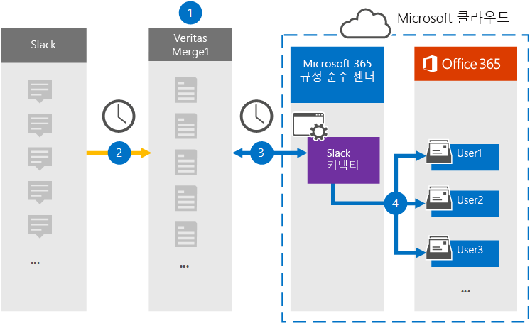

# Slack eDiscovery 데이터를 보관할 커넥터 설정Set up a connector to archive Slack eDiscovery data

Microsoft 365 규정 준수 센터의 Veritas 커넥터를 사용하여 소셜 미디어, 인스턴트 메시징 및 문서 공동 작업 플랫폼에서 타사 데이터를 Microsoft 365 사서함으로 가져오고 보관합니다.Use a Veritas connector in the Microsoft 365 compliance center to import and archive third-party data from social media, instant messaging, and document collaboration platforms to mailboxes in your Microsoft 365 organization. Veritas는 타사 데이터 원본에서 항목을 캡처한 다음(정기적으로) 해당 항목을 가져오도록 구성된 [Slack](https://globanet.com/slack/) 커넥터를 Microsoft 365.Veritas provides a [Slack](https://globanet.com/slack/) connector that's configured to capture items from the third-party data source (on a regular basis) and then import those items to Microsoft 365. Slack은 Slack API에서 메시지와 파일을 가져와서 전자 메일 메시지 형식으로 변환한 다음 항목을 사용자 사서함으로 가져올 수 있습니다.Slack pulls messages and files from the Slack API and converts them to an email message format and then imports the item to user mailboxes.

Slack eDiscovery 데이터를 사용자 사서함에 저장한 후 소송 보존, eDiscovery Microsoft 365 보존 정책 및 보존 레이블, 통신 준수와 같은 Microsoft 365 준수 기능을 적용할 수 있습니다.After Slack eDiscovery data is stored in user mailboxes, you can apply Microsoft 365 compliance features such as Litigation Hold, eDiscovery, retention policies and retention labels, and communication compliance. Slack 커넥터를 사용하여 조직의 데이터 가져오기 및 보관을 Microsoft 365 정부 및 규제 정책을 준수하는 데 도움이 될 수 있습니다.Using a Slack connector to import and archive data in Microsoft 365 can help your organization stay compliant with government and regulatory policies.

## Slack eDiscovery 데이터 보관 개요Overview of archiving Slack eDiscovery data

다음 개요에서는 커넥터를 사용하여 Slack 정보를 해당 커넥터에 보관하는 Microsoft 365.The following overview explains the process of using a connector to archive the Slack information in Microsoft 365.

1. 조직은 Slack과 함께 Slack 사이트를 설정하고 구성합니다.Your organization works with Slack to set up and configure a Slack site.

2. 24시간마다 Slack eDiscovery의 채팅 메시지가 Veritas Merge1 사이트에 복사됩니다.Once every 24 hours, chat messages from Slack eDiscovery are copied to the Veritas Merge1 site. 또한 커넥터는 채팅 메시지의 내용을 전자 메일 메시지 형식으로 변환합니다.The connector also converts the content of a chat message to an email message format.

3. Microsoft 365 준수 센터에서 만든 Slack eDiscovery 커넥터는 매일 Veritas Merge1 사이트에 연결하고 Microsoft 클라우드의 보안 Azure Storage 위치로 채팅 메시지를 전송합니다.The Slack eDiscovery connector that you create in the Microsoft 365 compliance center, connects to the Veritas Merge1 site every day and transfers the chat messages to a secure Azure Storage location in the Microsoft cloud.

4. 커넥터는 3단계에 설명된 바와 같이 *Email* 속성 및 자동 사용자 매핑 값을 사용하여 변환된 채팅 메시지 항목을 특정 사용자의 사서함으로 가져올 수 있습니다.The connector imports the converted chat message items to the mailboxes of specific users using the value of the *Email* property and automatic user mapping, as described in Step 3. **Slack eDiscovery라는** 받은 편지함 폴더의 새 하위 폴더가 사용자 사서함에 만들어지며 채팅 메시지 항목을 해당 폴더로 가져오게 됩니다.A new subfolder in the Inbox folder named **Slack eDiscovery** is created in the user mailboxes, and the chat message items are imported to that folder. 커넥터는 Email 속성 값을 사용하여 항목을 가져올 사서함을 결정할 *수* 있습니다.The connector determines which mailbox to import items to by using the value of the *Email* property. 모든 채팅 메시지에는 채팅 메시지의 모든 참가자의 전자 메일 주소로 채워지는 이 속성이 포함되어 있습니다.Every chat message contains this property, which is populated with the email address of every participant of the chat message.

## 시작하기 전에Before you begin

- Microsoft 커넥터에 대한 Veritas Merge1 계정을 생성합니다.Create a Veritas Merge1 account for Microsoft connectors. 계정을 만들하려면 [Veritas 고객 지원에 문의하세요.](https://globanet.com/ms-connectors-contact)To create an account, contact [Veritas Customer Support](https://globanet.com/ms-connectors-contact). 1단계에서 커넥터를 만들 때 이 계정에 로그인합니다.You will sign into this account when you create the connector in Step 1.

- 조직의 Slack 엔터프라이즈 계정의 사용자 이름과 암호를 얻습니다.Obtain the username and password for your organization's Slack enterprise account. Slack을 구성할 때 2단계에서 이 계정에 로그인해야 합니다.You'll need to sign into this account in Step 2 when you configure Slack.

- 1단계에서 Slack eDiscovery 커넥터를 만들고 3단계에서 완료하는 사용자는 2단계에서 사서함 가져오기 내보내기 역할에 할당해야 Exchange Online.The user who creates the Slack eDiscovery connector in Step 1 (and completes it in Step 3) must be assigned to the Mailbox Import Export role in Exchange Online. 이 역할은 준수 센터의  데이터 커넥터 페이지에서 커넥터를 Microsoft 365 필요합니다.This role is required to add connectors on the **Data connectors** page in the Microsoft 365 compliance center. 기본적으로 이 역할은 역할 그룹의 역할 그룹에 할당되지 Exchange Online.By default, this role is not assigned to a role group in Exchange Online. 사서함 가져오기 내보내기 역할을 조직의 조직 관리 역할 그룹에 추가할 수 Exchange Online.You can add the Mailbox Import Export role to the Organization Management role group in Exchange Online. 또는 역할 그룹을 만들고 사서함 가져오기 내보내기 역할을 할당한 다음 해당 사용자를 구성원으로 추가할 수 있습니다.Or you can create a role group, assign the Mailbox Import Export role, and then add the appropriate users as members. 자세한 내용은 "역할  그룹에서  역할 그룹 관리" 문서의 역할 그룹 만들기 또는 역할 그룹 수정 섹션을 Exchange Online.For more information, see the [Create role groups](/Exchange/permissions-exo/role-groups#create-role-groups) or [Modify role groups](/Exchange/permissions-exo/role-groups#modify-role-groups) sections in the article "Manage role groups in Exchange Online".

## 1단계: Slack eDiscovery 커넥터 설정Step 1: Set up the Slack eDiscovery connector

첫 번째 단계는 준수  센터의 데이터 커넥터 페이지에 액세스하고 Microsoft 365 대한 커넥터를 만드는 것입니다.The first step is to access to the **Data Connectors** page in the Microsoft 365 compliance center and create a connector for Slack data.

1. 으로 [https://compliance.microsoft.com](https://compliance.microsoft.com/) 이동한 다음 **데이터** 커넥터  >  **Slack eDiscovery 를 클릭합니다.**Go to [https://compliance.microsoft.com](https://compliance.microsoft.com/) and then click **Data connectors** > **Slack eDiscovery**.

2. **Slack eDiscovery** 제품 설명 페이지에서 커넥터 **추가를 클릭합니다.**On the **Slack eDiscovery** product description page, click **Add connector**.

3. 서비스 **약관 페이지에서** 동의를 **클릭합니다.**On the **Terms of service** page, click **Accept**.

4. 커넥터를 식별하는 고유한 이름을 입력하고 다음 을 **클릭합니다.**Enter a unique name that identifies the connector, and then click **Next**.

5. Merge1 계정에 로그인하여 커넥터를 구성합니다.Sign in to your Merge1 account to configure the connector.

## 2단계: Slack eDiscovery 구성Step 2: Configure Slack eDiscovery

두 번째 단계는 Merge1 사이트에서 Slack eDiscovery 커넥터를 구성하는 것입니다.The second step is to configure the Slack eDiscovery connector on the Merge1 site. Veritas Merge1 사이트에서 Slack eDiscovery 커넥터를 구성하는 방법에 대한 자세한 내용은 [Merge1 Third-Party Connectors User Guide를 참조하십시오.](https://docs.ms.merge1.globanetportal.com/Merge1%20Third-Party%20Connectors%20Slack%20eDiscovery%20User%20Guide.pdf)For more information about how to configure the Slack eDiscovery connector on the Veritas Merge1 site, see [Merge1 Third-Party Connectors User Guide](https://docs.ms.merge1.globanetportal.com/Merge1%20Third-Party%20Connectors%20Slack%20eDiscovery%20User%20Guide.pdf).

저장 및 & **마친** 후  준수 센터의 커넥터 마법사에 Microsoft 365 페이지가 표시됩니다.After you click **Save & Finish**, the **User mapping** page in the connector wizard in the Microsoft 365 compliance center is displayed.

## 3단계: 사용자 매핑 및 커넥터 설정 완료Step 3: Map users and complete the connector setup

1. 외부 사용자를 **사용자 Microsoft 365** 매핑 페이지에서 자동 사용자 매핑을 사용하도록 설정합니다.On the **Map external users to Microsoft 365 users** page, enable automatic user mapping.

   Slack eDiscovery 항목에는 조직의 사용자에 대한 전자 메일 주소가 포함된 *Email이라는* 속성이 포함됩니다.Slack eDiscovery items include a property called *Email*, which contains email addresses for users in your organization. 커넥터가 이 주소를 Microsoft 365 사용자 사서함으로 항목을 가져올 수 있습니다.If the connector can associate this address with a Microsoft 365 user, the items are imported to that user's mailbox.

2. **다음을** 클릭하고 설정을 검토하고  데이터 커넥터 페이지로 이동하여 새 커넥터의 가져오기 프로세스 진행률을 확인합니다.Click **Next**, review your settings, and go to the **Data connectors** page to see the progress of the import process for the new connector.

## 4단계: Slack eDiscovery 커넥터 모니터링Step 4: Monitor the Slack eDiscovery connector

Slack eDiscovery 커넥터를 만든 후 규정 준수 센터에서 커넥터 상태를 Microsoft 365 있습니다.After you create the Slack eDiscovery connector, you can view the connector status in the Microsoft 365 compliance center.

1. 으로 [https://compliance.microsoft.com](https://compliance.microsoft.com) 이동하여 왼쪽 **nav에서 데이터** 커넥터를 클릭합니다.Go to [https://compliance.microsoft.com](https://compliance.microsoft.com) and click **Data connectors** in the left nav.

2. 커넥터 **탭을** 클릭한 다음 **Slack eDiscovery** 커넥터를 선택하여 플라이아웃 페이지를 표시합니다.Click the **Connectors** tab and then select the **Slack eDiscovery** connector to display the flyout page. 이 페이지에는 커넥터에 대한 속성과 정보가 포함되어 있습니다.This page contains the properties and information about the connector.

3. 원본이 있는 커넥터 상태  **아래에서** 로그 다운로드 링크를 클릭하여 커넥터의 상태 로그를 열거나 저장합니다.Under **Connector status with source**, click the **Download log** link to open (or save) the status log for the connector. 이 로그에는 Microsoft 클라우드로 가져온 데이터에 대한 정보가 포함되어 있습니다.This log contains information about the data that has been imported to the Microsoft cloud.

## 알려진 문제Known issues

- 현재는 10MB보다 큰 첨부 파일 또는 항목 가져오기는 지원되지 않습니다.At this time, we don't support importing attachments or items that are larger than 10 MB. 더 큰 항목에 대한 지원은 나중에 사용할 수 있습니다.Support for larger items will be available at a later date.