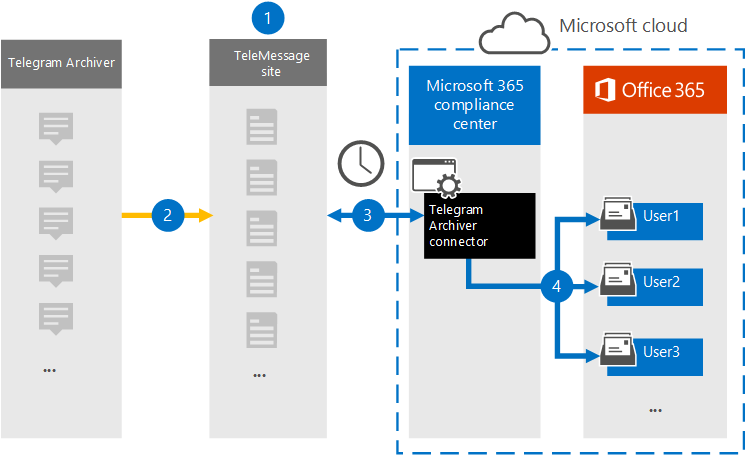

# 원격 통신 데이터를 보관할 커넥터 설정Set up a connector to archive Telegram communications data

메시지의 TeleMessage 커넥터를 사용하여 Microsoft 365 규정 준수 센터, 첨부 파일 및 삭제된 메시지와 통화를 가져오고 보관할 수 있습니다.Use the TeleMessage connector in the Microsoft 365 compliance center to import and archive Telegram chats, attachments, files, and deleted messages and calls. 커넥터를 설정 및 구성한 후 조직의 TeleMessage 계정에 연결하고, 원격 보관을 사용하여 직원의 모바일 통신을 조직의 사서함으로 Microsoft 365.After you set up and configure a connector, it connects to your organization's TeleMessage account, and imports the mobile communication of employees using the Telegram Archiver to mailboxes in Microsoft 365.

Telegram Archiver 커넥터 데이터를 사용자 사서함에 저장한 후 소송 보존, Microsoft 365 검색 및 보존 정책과 같은 Microsoft 365 준수 기능을 원격 통신 데이터에 적용할 수 있습니다.After Telegram Archiver connector data is stored in user mailboxes, you can apply Microsoft 365 compliance features such as Litigation Hold, Content search, and Microsoft 365 retention policies to Telegram communication data. 예를 들어 콘텐츠 검색을 사용하여 원격 통신을 검색하거나 원격 보관 커넥터 데이터가 포함된 사서함을 보관된 사례의 Advanced eDiscovery 있습니다.For example, you can search Telegram communication using Content Search or associate the mailbox that contains the Telegram Archiver connector data with a custodian in an Advanced eDiscovery case. 원격 보관 커넥터를 사용하여 조직의 데이터를 가져오고 Microsoft 365 조직이 회사 거버넌스 규정 및 규정 정책을 준수하는 데 도움이 될 수 있습니다.Using a Telegram Archiver connector to import and archive data in Microsoft 365 can help your organization stay compliant with corporate governance regulations and regulatory policies.

## 원격 통신 데이터 보관 개요Overview of archiving Telegram communications data

다음 개요에서는 커넥터를 사용하여 원격 통신 데이터를 커넥터에 보관하는 Microsoft 365.The following overview explains the process of using a connector to archive  Telegram communications data in Microsoft 365.

1. 조직은 TeleMessage와 함께 원격 보관 커넥터를 설치합니다.Your organization works with TeleMessage to set up a Telegram Archiver connector. 자세한 내용은 [Activating the TeleMessage Telegram Archiver for Microsoft 365.](https://www.telemessage.com/microsoft-365-activation-for-telegram-archiver/)For more information, see [Activating the TeleMessage Telegram Archiver for Microsoft 365](https://www.telemessage.com/microsoft-365-activation-for-telegram-archiver/).

2. 실시간으로 조직의 원격 데이터가 TeleMessage 사이트에 복사됩니다.In real time, your organization's Telegram data is copied to the TeleMessage site.

3. Microsoft 365 규정 준수 센터 만든 Telegram Archiver 커넥터는 매일 TeleMessage 사이트에 연결하고 이전 24시간 동안의 전자 메일 메시지를 Microsoft 클라우드의 보안 Azure Storage 영역으로 전송합니다.The Telegram Archiver connector that you create in the Microsoft 365 compliance center connects to the TeleMessage site every day and transfers the email messages from the previous 24 hours to a secure Azure Storage area in the Microsoft Cloud.

4. 커넥터는 모바일 통신 항목을 특정 사용자의 사서함으로 가져올 수 있습니다.The connector imports the mobile communication items to the mailbox of a specific user. Telegram Archiver라는 새 폴더가 특정 사용자의 사서함에 만들어지며 항목이 해당 폴더로 가져오기됩니다.A new folder named Telegram Archiver will be created in the specific user's mailbox and the items will be imported to it. 커넥터는 사용자의 전자 메일 주소 속성 값을 사용하여 이 *매핑을* 실행합니다.The connector does this mapping by using the value of the *User's Email address* property. 모든 전자 메일 메시지에는 전자 메일 메시지의 모든 참가자의 전자 메일 주소로 채워지는 이 속성이 포함되어 있습니다.Every email message contains this property, which is populated with the email address of every participant of the email message.

> 사용자의 전자 메일 주소 속성 값을  사용하는 자동 사용자 매핑 외에도 CSV 매핑 파일을 업로드하여 사용자 지정 매핑을 정의할 수도 있습니다.In addition to automatic user mapping using the value of the *User's Email address* property, you can also define a custom mapping by uploading a CSV mapping file. 이 매핑 파일에는 사용자의 휴대폰 번호와 각 사용자의 Microsoft 365 사서함 주소가 포함되어야 합니다.This mapping file should contain User's mobile Number and the corresponding Microsoft 365 mailbox address for each user. 자동 사용자 매핑을 사용하도록 설정하고 사용자 지정 매핑을 제공하는 경우 커넥터가 모든 전자 메일 항목에 대해 먼저 사용자 지정 매핑 파일을 봐야 합니다.If you enable automatic user mapping and provide a custom mapping, for every email item the connector will first look at custom mapping file. 사용자의 휴대폰 번호에 해당하는 유효한 Microsoft 365 찾을 수 없는 경우 커넥터는 전자 메일 항목의 사용자 전자 메일 주소 속성을 사용하게 됩니다.If it doesn't find a valid Microsoft 365 user that corresponds to a user's mobile number, the connector will use the User ‘s email address property of the email item. 커넥터가 전자 메일 항목의 사용자 지정 매핑 Microsoft 365 사용자의 전자  메일 주소 속성에서 유효한 사용자 지정 사용자를 찾지 못하면 항목을 가져오지 않습니다.If the connector doesn't find a valid Microsoft 365 user in either the custom mapping file or the *user's email address* property of the email item, the item won't be imported.

## 커넥터를 설정하기 전에Before you set up a connector

- [TeleMessage에서 원격](https://www.telemessage.com/mobile-archiver/order-mobile-archiver-for-o365/) 보관 서비스를 주문하고 조직에 대한 유효한 관리 계정을 얻습니다.Order the [Telegram archiving service from TeleMessage](https://www.telemessage.com/mobile-archiver/order-mobile-archiver-for-o365/) and get a valid administration account for your organization. 준수 센터에서 커넥터를 만들 때 이 계정에 로그인해야 합니다.You'll need to sign into this account when you create the connector in the compliance center.

- TeleMessage 계정에 원격 보관이 필요한 모든 사용자를 등록합니다.Register all users that require Telegram archiving in the TeleMessage account. 사용자를 등록할 때 사용자 계정과 동일한 전자 메일 주소를 Microsoft 365 합니다.When registering users, be sure to use the same email address that's used for their Microsoft 365 account.

- 직원의 휴대폰에 Telegram Archiver 앱을 설치하고 활성화합니다.Install the Telegram Archiver app on the mobile phones of your employees and activate it. Telegram Archiver 앱을 사용하면 다른 텔레그램 사용자와 통신하고 채팅할 수 있습니다.The Telegram Archiver app allows them to communicate and chat with other Telegram users.

- 3단계에서 원격 보관 커넥터를 만드는 사용자에게 사서함 가져오기 내보내기 역할이 할당되어야 Exchange Online.The user who creates a Telegram Archiver connector in Step 3 must be assigned the Mailbox Import Export role in Exchange Online. 이 연결은 서버의 데이터  커넥터 페이지에서 커넥터를 추가하는 Microsoft 365 규정 준수 센터.This is required to add connectors in the **Data connectors** page in the Microsoft 365 compliance center. 기본적으로이 역할은 Exchange Online의 어떤 역할 그룹에도 할당되지 않습니다.By default, this role isn't assigned to any role group in Exchange Online. 사서함 가져오기 내보내기 역할을 조직의 조직 관리 역할 그룹에 추가할 수 Exchange Online.You can add the Mailbox Import Export role to the Organization Management role group in Exchange Online. 또는 역할 그룹을 만들고 사서함 가져오기 내보내기 역할을 할당한 다음 해당 사용자를 구성원으로 추가할 수 있습니다.Or you can create a role group, assign the Mailbox Import Export role, and then add the appropriate users as members. 자세한 내용은 "역할  그룹에서  역할 그룹 관리" 문서의 역할 그룹 만들기 또는 역할 그룹 수정 섹션을 Exchange Online.For more information, see the [Create role groups](/Exchange/permissions-exo/role-groups#create-role-groups) or [Modify role groups](/Exchange/permissions-exo/role-groups#modify-role-groups) sections in the article "Manage role groups in Exchange Online".

## 원격 보관 커넥터 만들기Create a Telegram Archiver connector

이전 섹션에 설명된 선행 작업을 완료한 후 원격 보관함 커넥터를 Microsoft 365 규정 준수 센터.After you've completed the prerequisites described in the previous section, you can create the Telegram Archiver connector in the Microsoft 365 compliance center. 커넥터는 사용자가 제공한 정보를 사용하여 TeleMessage 사이트에 연결하고 원격 통신 데이터를 해당 사용자의 사서함 상자로 Microsoft 365.The connector uses the information you provide to connect to the TeleMessage site and transfers Telegram communications data to the corresponding user mailbox boxes in Microsoft 365.

1. 으로 <https://compliance.microsoft.com> 이동한  다음 T **elegram Archiver에서** 데이터 > 클릭합니다.Go to <https://compliance.microsoft.com> and then click **Data connectors** > T **elegram Archiver**.

2. **Telegram Archiver** 제품 설명 페이지에서 커넥터 **추가를 클릭합니다.**On the **Telegram Archiver** product description page, click **Add connector**.

3. 서비스 **약관 페이지에서** 동의를 **클릭합니다.**On the **Terms of service** page, click **Accept**.

4. **TeleMessage에** 로그인 페이지의 3단계에서 다음 상자에 필요한 정보를 입력하고 다음을 **클릭합니다.**On the **Login to TeleMessage** page, under Step 3, enter the required information in the following boxes and then click **Next**.

    - **사용자 이름:** TeleMessage 사용자 이름입니다.**Username:** Your TeleMessage username.

    - **암호:** TeleMessage 암호입니다.**Password:** Your TeleMessage password.

5. 커넥터를 만든 후 팝업 창을 닫고 다음 페이지로 이동하면 됩니다.After the connector is created, you can close the pop-up window and go to the next page.

6. 사용자 **매핑 페이지에서** 자동 사용자 매핑을 사용하도록 설정합니다.On the **User mapping** page, enable automatic user mapping. 사용자 지정 매핑을 사용하도록 설정하려면 사용자 매핑 정보가 포함된 CSV 파일을 업로드한 후 다음 을 **클릭합니다.**To enable custom mapping, upload a CSV file that contains the user mapping information, and then click **Next**.

7. 설정을 검토한 다음 **마친을 클릭하여** 커넥터를 생성합니다.Review your settings, and then click **Finish** to create the connector.

8. 데이터 커넥터 페이지의 커넥터  탭으로 이동하여 새 커넥터의 가져오기 프로세스 진행률을 볼 수 있습니다.Go to the Connectors tab in **Data connectors** page to see the progress of the import process for the new connector.

## 알려진 문제Known issues

- 현재는 10MB보다 큰 첨부 파일 또는 항목 가져오기는 지원되지 않습니다.At this time, we don't support importing attachments or items that are larger than 10 MB. 더 큰 항목에 대한 지원은 나중에 사용할 수 있습니다.Support for larger items will be available at a later date.
