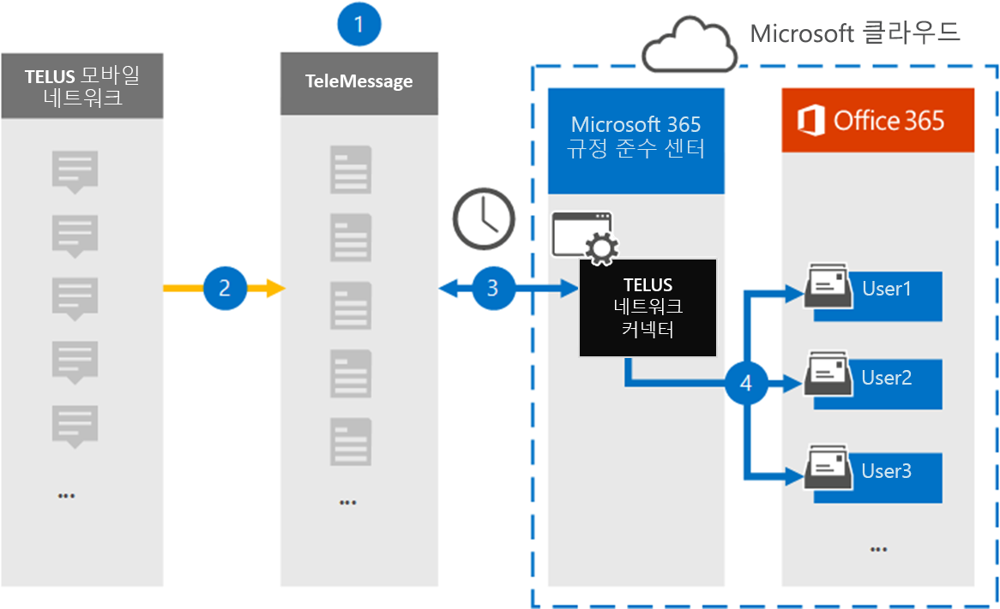

# TELUS 네트워크 데이터를 보관할 커넥터 설정Set up a connector to archive TELUS Network data

Microsoft 365 규정 준수 센터의 TeleMessage 커넥터를 사용하여 조직의 TELUS 네트워크에서 SMS(Short Messaging Service) 데이터를 가져오고 보관합니다.Use the TeleMessage connector in the Microsoft 365 compliance center to import and archive Short Messaging Service (SMS) data from your organization's TELUS Network. 커넥터를 설정하고 구성한 후 커넥터는 매일 한 번 조직의 TELUS 네트워크에 연결하고 SMS 데이터를 조직의 사서함으로 Microsoft 365.After you set up and configure a connector, it connects to your organization's TELUS Network once every day, and imports SMS data to mailboxes in Microsoft 365.

메시지를 SMS 사서함에 저장한 후 소송 보존, Microsoft 365 검색 및 보존 정책과 같은 Microsoft 365 준수 기능을 TELUS 데이터에 적용할 수 있습니다.After SMS messages are stored in user mailboxes, you can apply Microsoft 365 compliance features such as Litigation Hold, Content Search, and Microsoft 365 retention policies to TELUS data. 예를 들어 콘텐츠 검색을 사용하여 TELUS SMS 검색하거나 TELUS 데이터가 포함된 사서함을 Advanced eDiscovery 있습니다.For example, you can search TELUS SMS messages using Content Search or associate the mailbox that contains the TELUS data with a custodian in an Advanced eDiscovery case. TELUS 네트워크 커넥터를 사용하여 조직에서 데이터를 가져오고 Microsoft 365 정부 및 규정 정책을 준수하는 데 도움이 될 수 있습니다.Using a TELUS Network connector to import and archive data in Microsoft 365 can help your organization stay compliant with government and regulatory policies.

## 보관 TELUS 네트워크 데이터 개요Overview of archiving TELUS Network data

다음 개요에서는 커넥터를 사용하여 TELUS 네트워크 데이터를 커넥터에 보관하는 Microsoft 365.The following overview explains the process of using a connector to archive TELUS Network data in Microsoft 365.

1. 조직은 TeleMessage 및 TELUS와 함께 TELUS 네트워크 커넥터를 설치합니다.Your organization works with TeleMessage and TELUS to set up a TELUS Network connector. 자세한 내용은 [TELUS Network Archiver 를 참조하세요.](https://www.telemessage.com/office365-activation-for-telus-network-archiver/)For more information, see [TELUS Network Archiver](https://www.telemessage.com/office365-activation-for-telus-network-archiver/).

2. 실시간으로 SMS TELUS 네트워크의 메시지가 TeleMessage 사이트에 복사됩니다.In real time, SMS messages from your organization's TELUS Network are copied to the TeleMessage site.

3. Microsoft 365 준수 센터에서 만드는 TELUS 네트워크 커넥터는 매일 TeleMessage 사이트에 연결하고 이전 24시간 동안의 SMS 메시지를 Microsoft 클라우드의 보안 Azure Storage 위치로 전송합니다.The TELUS Network connector that you create in the Microsoft 365 compliance center connects to the TeleMessage site every day and transfers the SMS messages from the previous 24 hours to a secure Azure Storage location in the Microsoft cloud. 또한 커넥터는 전자 메일 메시지의 SMS 전자 메일 메시지 형식으로 변환합니다.The connector also converts the content of SMS messages to an email message format.

4. 커넥터는 모바일 통신 항목을 특정 사용자의 사서함으로 가져올 수 있습니다.The connector imports the mobile communication items to the mailbox of a specific user. **TELUS** SMS 네트워크 보관함이라는 새 폴더가 특정 사용자의 사서함에 만들어지며 항목을 가져와야 합니다.A new folder named **TELUS SMS Network Archiver** is created in the specific user's mailbox and the items are imported to it. 커넥터는 사용자의 전자 메일 주소 속성 값을 사용하여 *매핑합니다.*The connector does mapping by using the value of the *User's Email address* property. 모든 SMS 메시지에는 메시지의 모든 참가자의 전자 메일 주소로 채워지는 이 속성이 SMS 있습니다.Every SMS message contains this property, which is populated with the email address of every participant of the SMS message.

   사용자의 전자 메일 주소 속성 값을  사용하는 자동 사용자 매핑 외에도 CSV 매핑 파일을 업로드하여 사용자 지정 매핑을 구현할 수도 있습니다.In addition to automatic user mapping using the value of the *User’s Email address* property, you can also implement custom mapping by uploading a CSV mapping file. 이 매핑 파일에는 조직의 사용자에 대한 휴대폰 번호와 Microsoft 365 전자 메일 주소가 포함되어 있습니다.This mapping file contains the mobile phone number and corresponding Microsoft 365 email address for users in your organization. 자동 사용자 매핑과 사용자 지정 매핑을 모두 사용하도록 설정하면 커넥터가 모든 TELUS 항목에 대해 먼저 사용자 지정 매핑 파일을 룩합니다.If you enable both automatic user mapping and custom mapping, for every TELUS item the connector first looks at custom mapping file. 사용자의 휴대폰 번호에 해당하는 유효한 Microsoft 365 사용자가 없는 경우 커넥터는 가져오려고 하는 항목의 전자 메일 주소 속성에 있는 값을 사용합니다.If it doesn't find a valid Microsoft 365 user that corresponds to a user's mobile phone number, the connector will use the values in the email address property of the item it's trying to import. 커넥터가 사용자 지정 매핑 파일 또는 Microsoft 365 TELUS 항목의 전자 메일 주소 속성에서 유효한 사용자 지정 사용자를 찾지 못하면 항목을 가져오지 않습니다.If the connector doesn't find a valid Microsoft 365 user in either the custom mapping file or in the email address property of the TELUS item, the item won't be imported.

## 커넥터를 설정하기 전에Before you set up a connector

TELUS 네트워크 데이터를 보관하는 데 필요한 일부 구현 단계는 Microsoft 365 외부에 있으며 준수 센터에서 커넥터를 만들기 전에 완료해야 합니다.Some of the implementation steps required to archive TELUS Network data are external to Microsoft 365 and must be completed before you can create a connector in the compliance center.

- [TeleMessage에서 TELUS 네트워크 보관](https://www.telemessage.com/mobile-archiver/order-mobile-archiver-for-o365) 서비스 순서를 정하고 조직에 대한 유효한 관리 계정을 얻습니다.Order the [TELUS Network Archiver service from TeleMessage](https://www.telemessage.com/mobile-archiver/order-mobile-archiver-for-o365) and get a valid administration account for your organization. 준수 센터에서 커넥터를 만들 때 이 계정에 로그인해야 합니다.You'll need to sign into this account when you create the connector in the compliance center.

- TeleMessage 온보더링 양식을 작성하고 TELUS에서 메시지 보관 서비스를 주문할 수 있도록 TELUS 네트워크 계정 및 대금 청구 연락처 세부 정보를 얻습니다.Obtain your TELUS Network account and billing contact details so you can fill-out the TeleMessage onboarding forms and order the message archiving service from TELUS.

- TeleMessage 계정에 네트워크 SMS TELUS가 필요한 모든 사용자를 등록합니다.Register all users that require TELUS SMS Network archiving in the TeleMessage account. 사용자를 등록할 때 사용자 계정과 동일한 전자 메일 주소를 Microsoft 365 합니다.When registering users, be sure to use the same email address that's used for their Microsoft 365 account.

- 직원은TELUS 모바일 네트워크에 회사 소유 휴대폰 및 회사 소유 휴대폰이 있어야 합니다.Your employees must have corporate-owned and corporate-liable mobile phones on theTELUS mobile network. 직원 소유의 Microsoft 365 또는 BYOD(Bring Your Own Devices) 디바이스에서는 보관 메시지를 사용할 수 없습니다.Archiving messages in Microsoft 365 isn't available for employee-owned or Bring Your Own Devices (BYOD) devices.

- TELUS 네트워크 커넥터를 만드는 사용자에게 TELUS 네트워크 커넥터의 사서함 가져오기 내보내기 역할이 할당되어야 Exchange Online.The user who creates a TELUS Network connector must be assigned the Mailbox Import Export role in Exchange Online. 준수 센터의 데이터 커넥터  페이지에서 커넥터를 추가하려면 Microsoft 365 필요합니다.This is required to add connectors in the **Data connectors** page in the Microsoft 365 compliance center. 기본적으로이 역할은 Exchange Online의 어떤 역할 그룹에도 할당되지 않습니다.By default, this role isn't assigned to any role group in Exchange Online. 사서함 가져오기 내보내기 역할을 조직의 조직 관리 역할 그룹에 추가할 수 Exchange Online.You can add the Mailbox Import Export role to the Organization Management role group in Exchange Online. 또는 역할 그룹을 만들고 사서함 가져오기 내보내기 역할을 할당한 다음 해당 사용자를 구성원으로 추가할 수 있습니다.Or you can create a role group, assign the Mailbox Import Export role, and then add the appropriate users as members. 자세한 내용은 "역할  그룹에서  역할 그룹 관리" 문서의 역할 그룹 만들기 또는 역할 그룹 수정 섹션을 Exchange Online.For more information, see the [Create role groups](/Exchange/permissions-exo/role-groups#create-role-groups) or [Modify role groups](/Exchange/permissions-exo/role-groups#modify-role-groups) sections in the article "Manage role groups in Exchange Online".

- 이 데이터 커넥터는 미국 GCC 클라우드의 Microsoft 365 사용할 수 있습니다.This data connector is available in GCC environments in the Microsoft 365 US Government cloud. 타사 응용 프로그램 및 서비스는 Microsoft 365 인프라 외부에 있는 타사 시스템에서 조직의 고객 데이터를 저장, 전송 및 처리해야 할 수 있으므로 Microsoft 365 및 데이터 보호 약정의 적용을 Microsoft 365 수 있습니다.Third-party applications and services might involve storing, transmitting, and processing your organization's customer data on third-party systems that are outside of the Microsoft 365 infrastructure and therefore are not covered by the Microsoft 365 compliance and data protection commitments. Microsoft는 타사 응용 프로그램에 연결하는 데 이 제품을 사용하는 것은 해당 타사 응용 프로그램이 FEDRAMP 규격임을 암시하는 표현을 사용하지 않습니다.Microsoft makes no representation that use of this product to connect to third-party applications implies that those third-party applications are FEDRAMP compliant.

## TELUS 네트워크 커넥터 만들기Create a TELUS Network connector

이전 섹션에 설명된 선행 작업을 완료한 후 규정 준수 센터에서 TELUS 네트워크 커넥터를 Microsoft 365 있습니다.After you've completed the prerequisites described in the previous section, you can create TELUS Network connector in the Microsoft 365 compliance center. 커넥터는 사용자가 제공한 정보를 사용하여 TeleMessage 사이트에 연결하고 SMS 사서함에 메시지를 Microsoft 365.The connector uses the information you provide to connect to the TeleMessage site and transfer SMS messages to the corresponding user mailbox boxes in Microsoft 365.

1. 으로 [https://compliance.microsoft.com](https://compliance.microsoft.com/) 이동한 다음 **데이터** 커넥터  >  **TELUS 네트워크 를 클릭합니다.**Go to [https://compliance.microsoft.com](https://compliance.microsoft.com/) and then click **Data connectors** > **TELUS Network**.

2. **TELUS 네트워크 제품** 설명 페이지에서 커넥터 **추가를 클릭합니다.**On the **TELUS Network** product description page, click **Add connector**

3. 서비스 **약관 페이지에서** 동의를 **클릭합니다.**On the **Terms of service** page, click **Accept**.

4. **TeleMessage에** 로그인 페이지의 3단계에서 다음 상자에 필요한 정보를 입력하고 다음을 **클릭합니다.**On the **Login to TeleMessage** page, under Step 3, enter the required information in the following boxes and then click **Next**.

   - **사용자 이름:** TeleMessage 사용자 이름입니다.**Username:** Your TeleMessage username.

   - **암호:** TeleMessage 암호입니다.**Password:** Your TeleMessage password.

5. 커넥터를 만든 후 팝업 창을 닫고 다음 페이지로 이동하면 됩니다.After the connector is created, you can close the pop-up window and go to the next page.

6. 사용자 **매핑 페이지에서** 자동 사용자 매핑을 사용하도록 설정하고 다음 을 **클릭합니다.**On the **User mapping** page, enable automatic user mapping and click **Next**. CSV 파일을 업로드하는 사용자 지정 매핑이 필요한 경우 다음 을 **클릭합니다.**In case you need custom mapping upload a CSV file, and click **Next**.

7. 설정을 검토한 다음 **마친을 클릭하여** 커넥터를 생성합니다.Review your settings, and then click **Finish** to create the connector.

8. 데이터 커넥터 페이지의 커넥터  탭으로 이동하여 새 커넥터의 가져오기 프로세스 진행률을 볼 수 있습니다.Go to the Connectors tab in **Data connectors** page to see the progress of the import process for the new connector.

## 알려진 문제Known issues

- 현재는 10MB보다 큰 첨부 파일 또는 항목 가져오기는 지원되지 않습니다.At this time, we don't support importing attachments or items that are larger than 10 MB. 더 큰 항목에 대한 지원은 나중에 사용할 수 있습니다.Support for larger items will be available at a later date.
