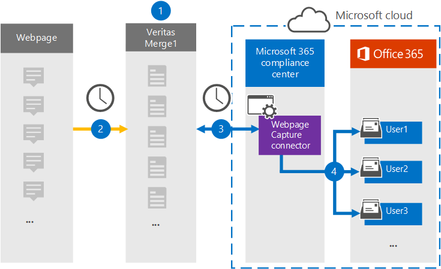

# 웹 페이지 데이터를 보관 하는 커넥터 설정Set up a connector to archive webpage data

Microsoft 365 준수 센터의 Globanet 커넥터를 사용 하 여 Microsoft 365 조직의 사용자 사서함으로 웹 페이지 데이터를 가져오고 보관 합니다.Use a Globanet connector in the Microsoft 365 compliance center to import and archive data from webpages to user mailboxes in your Microsoft 365 organization. Globanet에서는 특정 웹 사이트 또는 전체 도메인에 있는 특정 웹 페이지와 해당 페이지의 링크를 캡처하는 [웹 페이지 캡처](https://globanet.com/webpage-capture) 커넥터를 제공 합니다.Globanet provides a [Webpage Capture](https://globanet.com/webpage-capture) connector that captures specific webpages (and any links on those pages) in a specific website or an entire domain. 이 커넥터는 웹 페이지 콘텐츠를 PDF, PNG 또는 사용자 지정 파일 형식으로 변환 하 고 변환 된 파일을 전자 메일 메시지에 연결한 다음 해당 전자 메일 항목을 Microsoft 365의 사용자 사서함으로 가져옵니다.The connector converts the webpage content to a PDF, PNG, or custom file format and then attaches the converted files to an email message and then imports those email items to user mailboxes in Microsoft 365.

웹 페이지 콘텐츠가 사용자 사서함에 저장 되 면 소송 보존, eDiscovery, 보존 정책 및 보존 레이블과 같은 Microsoft 365 준수 기능을 적용할 수 있습니다.After webpage content is stored in user mailboxes, you can apply Microsoft 365 compliance features such as Litigation Hold, eDiscovery, and retention policies and retention labels. 웹 페이지 캡처 커넥터를 사용 하 여 Microsoft 365에서 데이터를 가져오고 보관 하면 조직이 정부 및 규정 정책을 준수 하는 데 도움이 될 수 있습니다.Using a Webpage Capture connector to import and archive data in Microsoft 365 can help your organization stay compliant with government and regulatory policies.

## 웹 페이지 데이터 보관 개요Overview of archiving webpage data

다음 개요에서는 커넥터를 사용 하 여 Microsoft 365에서 웹 페이지 콘텐츠를 보관 하는 프로세스에 대해 설명 합니다.The following overview explains the process of using a connector to archive webpage content in Microsoft 365.

1. 조직에서 웹 페이지 원본으로 작업 하 여 웹 페이지 캡처 사이트를 설정 및 구성 합니다.Your organization works with the webpage source to set up and configure a Webpage Capture site.

2. 24 시간 마다 한 번씩 웹 페이지 원본 항목이 Globanet Merge1 site에 복사 됩니다.Once every 24 hours, the webpage sources items are copied to the Globanet Merge1 site. 또한이 커넥터는 웹 페이지의 콘텐츠를 변환 하 고 전자 메일 메시지에 첨부 합니다.The connector also converts and attaches the content of a webpage to an email message.

3. Microsoft 365 준수 센터에서 만든 웹 페이지 캡처 커넥터는 매일 Globanet Merge1 site에 연결 하 고 웹 페이지 항목을 Microsoft 클라우드의 안전한 Azure Storage 위치로 전송 합니다.The Webpage Capture connector that you create in the Microsoft 365 compliance center, connects to the Globanet Merge1 site every day and transfers the webpage items to a secure Azure Storage location in the Microsoft cloud.

4. 커넥터는 [3 단계](#step-3-map-users-and-complete-the-connector-setup)에 설명 된 대로 자동 사용자 매핑의 *Email* 속성 값을 사용 하 여 변환 된 웹 페이지 항목을 특정 사용자의 사서함으로 가져옵니다.The connector imports the converted webpage items to the mailboxes of specific users by using the value of the *Email* property of the automatic user mapping as described in [Step 3](#step-3-map-users-and-complete-the-connector-setup). **웹 페이지 캡처** 라는 받은 편지함 폴더의 하위 폴더가 사용자 사서함에 만들어지고, 해당 폴더로 웹 페이지 항목을 가져옵니다.A subfolder in the Inbox folder named **Webpage Capture** is created in the user mailboxes, and the webpage items are imported to that folder. 커넥터는 *Email* 속성 값을 사용 하 여이를 수행 합니다.The connector does this by using the value of the *Email* property. 모든 웹 페이지 항목에는이 속성이 있으며 [2 단계](#step-2-configure-the-webpage-capture-connector-on-the-globanet-merge1-site)에서 웹 페이지 캡처 커넥터를 구성할 때 제공 되는 전자 메일 주소로 채워집니다.Every webpage item contains this property, which is populated with the email addresses provided when you configure the Webpage Capture connector in [Step 2](#step-2-configure-the-webpage-capture-connector-on-the-globanet-merge1-site).

## 시작하기 전에Before you begin

- Microsoft 커넥터에 대 한 Globanet Merge1 계정을 만듭니다.Create a Globanet Merge1 account for Microsoft connectors. 이 작업을 수행 하려면 [Globanet 고객 지원](https://globanet.com/ms-connectors-contact/)에 문의 하세요.To do this, contact [Globanet Customer Support](https://globanet.com/ms-connectors-contact/). 1 단계에서 커넥터를 만들 때이 계정에 로그인 해야 합니다.You need to sign into this account when you create the connector in Step 1.

- 웹 페이지 항목을 변환할 사용자 지정 파일 형식을 설정 하려면 Globanet 지원 작업을 수행 해야 합니다.You need to work with Globanet support to set up a custom file format to convert the webpage items to. 자세한 내용은 다음에서 Merge1 타사 커넥터 사용자 가이드를 참조 하세요.For more information, see the Merge1 Third-Party Connectors User Guide in 

- 1 단계에서 웹 페이지 캡처 커넥터를 만든 사용자 (3 단계에서 완료)는 Exchange Online의 사서함 가져오기 내보내기 역할에 할당 되어야 합니다.The user who creates the Webpage Capture connector in Step 1 (and completes it in Step 3) must be assigned to the Mailbox Import Export role in Exchange Online. 이 역할은 Microsoft 365 준수 센터의 **데이터 커넥터** 페이지에 커넥터를 추가 하는 데 필요 합니다.This role is required to add connectors on the **Data connectors** page in the Microsoft 365 compliance center. 기본적으로이 역할은 Exchange Online의 어떠한 역할 그룹에도 할당 되지 않습니다.By default, this role is not assigned to any role group in Exchange Online. Exchange Online의 조직 관리 역할 그룹에 사서함 가져오기 내보내기 역할을 추가할 수 있습니다.You can add the Mailbox Import Export role to the Organization Management role group in Exchange Online. 또는 역할 그룹을 만들고 사서함 가져오기 내보내기 역할을 할당 한 다음 해당 사용자를 구성원으로 추가할 수 있습니다.Or you can create a role group, assign the Mailbox Import Export role, and then add the appropriate users as members. 자세한 내용은 "Exchange Online에서 역할 그룹 관리" 문서의 [역할 그룹 만들기](https://docs.microsoft.com/Exchange/permissions-exo/role-groups#create-role-groups) 또는 [역할 그룹 수정](https://docs.microsoft.com/Exchange/permissions-exo/role-groups#modify-role-groups) 섹션을 참조 하세요.For more information, see the [Create role groups](https://docs.microsoft.com/Exchange/permissions-exo/role-groups#create-role-groups) or [Modify role groups](https://docs.microsoft.com/Exchange/permissions-exo/role-groups#modify-role-groups) sections in the article "Manage role groups in Exchange Online".

## 1 단계: 웹 페이지 캡처 커넥터 설정Step 1: Set up the Webpage Capture connector

첫 번째 단계는 **데이터 커넥터** 에 액세스 하 고 웹 페이지 원본 데이터에 대 한 커넥터를 만드는 것입니다.The first step is to access to the **Data Connectors** and create a connector for Web Page source data.

1. 로 이동한 [https://compliance.microsoft.com](https://compliance.microsoft.com/) 다음 **데이터 커넥터**  >  **웹 페이지 캡처** 를 클릭 합니다.Go to [https://compliance.microsoft.com](https://compliance.microsoft.com/) and then click **Data connectors** > **Webpage Capture** .

2. **웹 페이지 캡처** 제품 설명 페이지에서 **커넥터 추가** 를 클릭 합니다.On the **Webpage Capture** product description page, click **Add connector** .

3. **서비스 약관** 페이지에서 **수락** 을 클릭 합니다.On the **Terms of service** page, click **Accept** .

4. 커넥터를 식별 하는 고유한 이름을 입력 한 후 **다음** 을 클릭 합니다.Enter a unique name that identifies the connector, and then click **Next** .

5. Merge1 계정에 로그인 하 여 커넥터를 구성 합니다.Sign in to your Merge1 account to configure the connector.

## 2 단계: Globanet Merge1 사이트에서 웹 페이지 캡처 커넥터 구성Step 2: Configure the Webpage Capture connector on the Globanet Merge1 site

두 번째 단계는 Globanet Merge1 사이트에서 웹 페이지 캡처 커넥터를 구성 하는 것입니다.The second step is to configure the Webpage Capture connector on the Globanet Merge1 site. 웹 페이지 캡처 커넥터를 구성 하는 방법에 대 한 자세한 내용은 [Merge1 타사 커넥터 사용자 가이드](https://docs.ms.merge1.globanetportal.com/Merge1%20Third-Party%20Connectors%20Web%20Page%20Capture%20User%20Guide%20.pdf)를 참조 하십시오.For information about how to configure the Webpage Capture connector, see [Merge1 Third-Party Connectors User Guide](https://docs.ms.merge1.globanetportal.com/Merge1%20Third-Party%20Connectors%20Web%20Page%20Capture%20User%20Guide%20.pdf).

**마침을 & 저장** 을 클릭 하면 Microsoft 365 준수 센터로 다시 이동 하 여 커넥터 마법사의 **사용자 매핑** 페이지로 리디렉션됩니다.After you click **Save & Finish** , you are directed back to the Microsoft 365 compliance center, to the **User mapping** page in the connector wizard.

## 3 단계: 사용자 매핑 및 커넥터 설정 완료Step 3: Map users and complete the connector setup

사용자를 매핑하고 Microsoft 365 준수 센터에서 커넥터 설정을 완료 하려면 다음 단계를 수행 합니다.To map users and complete the connector setup in the Microsoft 365 compliance center, follow the steps below:

1. **웹 페이지 매핑 사용자를 Microsoft 365 사용자에 게 캡처** 페이지에서 자동 사용자 매핑을 사용 하도록 설정 합니다.On the **Map Webpage Capture users to Microsoft 365 users** page, enable automatic user mapping. 웹 페이지 캡처 항목에는 조직의 사용자에 대 한 전자 메일 주소를 포함 하는 *email* 이라는 속성이 포함 되어 있습니다.The Webpage Capture items include a property called *Email* , which contains email addresses for users in your organization. 커넥터가이 주소를 Microsoft 365 사용자와 연결할 수 있으면 해당 사용자의 사서함으로 항목을 가져옵니다.If the connector can associate this address with a Microsoft 365 user, the items are imported to that user's mailbox.

2. **관리자 동의** 페이지에서 **동의를 제공** 합니다 .를 클릭 합니다.On the **Admin Consent** page, click **Provide Consent** . Microsoft 사이트로 리디렉션됩니다.You'll be redirected to the Microsoft site. **수락** 을 클릭 하 여 동의를 제공 합니다.Click **Accept** to provide the consent.

   조직에서는 Office 365 가져오기 서비스가 조직의 사서함 데이터에 액세스할 수 있도록 허용 해야 합니다.Your organization must consent to allow the Office 365 Import service to access mailbox data in your organization. 관리자의 동의를 제공 하려면 Microsoft 365 전역 관리자의 자격 증명을 사용 하 여 로그인 한 다음 승인 요청을 수락 해야 합니다.To provide admin consent, you must be signed in with the credentials of a Microsoft 365 global admin, and then accept the consent request. 전역 관리자로 로그인 하지 않은 경우 [이 페이지로](https://login.microsoftonline.com/common/oauth2/authorize?client_id=570d0bec-d001-4c4e-985e-3ab17fdc3073&response_type=code&redirect_uri=https://portal.azure.com/&nonce=1234&prompt=admin_consent) 이동 하 여 전역 관리자 자격 증명을 사용 하 여 로그인 하 고 요청을 수락할 수 있습니다.If you aren't signed in as a global admin, you can go to [this page](https://login.microsoftonline.com/common/oauth2/authorize?client_id=570d0bec-d001-4c4e-985e-3ab17fdc3073&response_type=code&redirect_uri=https://portal.azure.com/&nonce=1234&prompt=admin_consent) and sign in using global admin credentials to accept the request.

3. **다음** 을 클릭 하 고 설정을 검토 한 다음 **데이터 커넥터** 페이지로 이동 하 여 새 커넥터에 대 한 가져오기 프로세스의 진행 상황을 확인 합니다.Click **Next** , review your settings, and go to the **Data connectors** page to see the progress of the import process for the new connector.

## 4 단계: 웹 페이지 캡처 커넥터 모니터링Step 4: Monitor the Webpage Capture connector

웹 페이지 캡처 커넥터를 만든 후에는 Microsoft 365 준수 센터에서 커넥터 상태를 볼 수 있습니다.After you create the Webpage Capture connector, you can view the connector status in the Microsoft 365 compliance center.

1. 으로 이동 하 여 [https://compliance.microsoft.com](https://compliance.microsoft.com) 왼쪽 탐색 창에서 **데이터 커넥터** 를 클릭 합니다.Go to [https://compliance.microsoft.com](https://compliance.microsoft.com) and click **Data connectors** in the left nav.

2. **커넥터** 탭을 클릭 한 다음 **웹 페이지 캡처** 커넥터를 선택 하 여 플라이 아웃 페이지를 표시 합니다.Click the **Connectors** tab and then select the **Webpage Capture** connector to display the flyout page. 이 페이지에는 커넥터에 대 한 속성 및 정보가 포함 되어 있습니다.This page contains the properties and information about the connector.

3. **커넥터 상태 (원본 포함** )에서 **로그 다운로드** 링크를 클릭 하 여 커넥터의 상태 로그를 열거나 저장 합니다.Under **Connector status with source** , click the **Download log** link to open (or save) the status log for the connector. 이 로그는 Microsoft 클라우드로 가져온 데이터를 포함 합니다.This log contains data that has been imported to the Microsoft cloud.

## 알려진 문제Known issues

- 현재로 서는 10mb 보다 큰 첨부 파일 또는 항목을 가져올 수 없습니다.At this time, we don't support importing attachments or items that are larger than 10 MB. 더 큰 항목에 대 한 지원은 나중에 제공 될 예정입니다.Support for larger items will be available at a later date.
