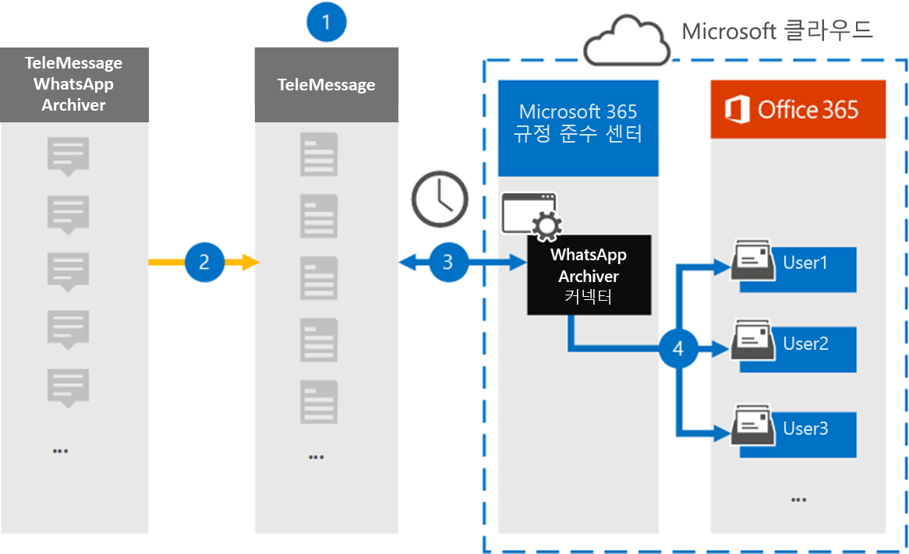

# WhatsApp 데이터를 보관할 커넥터 설정Set up a connector to archive WhatsApp data

Microsoft 365 규정 준수 센터의 TeleMessage 커넥터를 사용하여 WhatsApp 통화, 채팅, 첨부 파일, 파일 및 삭제된 메시지를 가져오고 보관합니다.Use the TeleMessage connector in the Microsoft 365 compliance center to import and archive WhatsApp calls, chats, attachments, files, and deleted messages. 커넥터를 설정하고 구성한 후 이 커넥터는 매일 조직의 TeleMessage 계정에 연결하고, TeleMessage WhatsApp Phone Archiver 또는 TeleMessage WhatsApp Cloud Archiver를 사용하여 직원의 모바일 통신을 Microsoft 365의 사서함으로 가져올 수 있습니다.After you set up and configure a connector, it connects to your organization's TeleMessage account once every day, and imports the mobile communication of employees using the TeleMessage WhatsApp Phone Archiver or TeleMessage WhatsApp Cloud Archiver to mailboxes in Microsoft 365.

WhatsApp 데이터를 사용자 사서함에 저장한 후 소송 보존, 콘텐츠 검색 및 Microsoft 365 보존 정책과 같은 Microsoft 365 규정 준수 기능을 WhatsApp 데이터에 적용할 수 있습니다.After WhatsApp data is stored in user mailboxes, you can apply Microsoft 365 compliance features such as Litigation Hold, Content Search, and Microsoft 365 retention policies to WhatsApp data. 예를 들어 콘텐츠 검색을 사용하여 WhatsApp 메시지를 검색하거나 WhatsApp 메시지가 포함된 사서함을 고급 eDiscovery 사례의 보위원과 연결할 수 있습니다.For example, you can search WhatsApp messages using Content Search or associate the mailbox that contains WhatsApp messages with a custodian in an Advanced eDiscovery case. WhatsApp 커넥터를 사용하여 Microsoft 365에서 데이터를 가져오고 보관하면 조직이 정부 및 규제 정책을 준수하는 데 도움이 될 수 있습니다.Using a WhatsApp connector to import and archive data in Microsoft 365 can help your organization stay compliant with government and regulatory policies.

## WhatsApp 데이터 보관 개요Overview of archiving WhatsApp data

다음 개요에서는 커넥터를 사용하여 Microsoft 365에서 WhatsApp 데이터를 보관하는 프로세스에 대해 설명합니다.The following overview explains the process of using a connector to archive WhatsApp data in Microsoft 365.

1. 조직은 TeleMessage와 함께 WhatsApp Archiver 커넥터를 설치합니다.Your organization works with TeleMessage to set up a WhatsApp Archiver connector. 자세한 내용은 [WhatsApp Archiver를 참조하세요.](https://www.telemessage.com/office365-activation-for-whatsapp-archiver)For more information, see [WhatsApp Archiver](https://www.telemessage.com/office365-activation-for-whatsapp-archiver).

2. 24시간마다 조직의 WhatsApp 데이터가 TeleMessage 사이트에 복사됩니다.Once every 24 hours, your organization’s WhatsApp data is copied to the TeleMessage site.

3. Microsoft 365 규정 준수 센터에서 만드는 WhatsApp 커넥터는 매일 TeleMessage 사이트에 연결하고 지난 24시간 동안의 WhatsApp 데이터를 Microsoft 클라우드의 보안 Azure Storage 위치로 전송합니다.The WhatsApp connector that you create in the Microsoft 365 compliance center connects to the TeleMessage site every day and transfers WhatsApp data from the previous 24 hours to a secure Azure Storage location in the Microsoft Cloud. 또한 커넥터는 WhatsApp 데이터를 전자 메일 메시지 형식으로 변환합니다.The connector also converts the content WhatsApp data to an email message format.

4. 커넥터는 WhatsApp 데이터를 특정 사용자의 사서함으로 가져올 수 있습니다.The connector imports WhatsApp data to the mailbox of a specific user. **WhatsApp Archiver라는** 새 폴더가 특정 사용자의 사서함에 만들어지며 해당 폴더로 항목이 가져오기됩니다.A new folder named **WhatsApp Archiver** is created in the specific user's mailbox and the items are imported to it. 커넥터는 사용자의 전자 메일 주소 속성 값을 사용하여 이 *매핑을* 실행합니다.The connector does this mapping by using the value of the *User’s Email address* property. 모든 WhatsApp 메시지에는 메시지의 모든 참가자의 전자 메일 주소로 채워지는 이 속성이 포함되어 있습니다.Every WhatsApp message contains this property, which is populated with the email address of every participant of the message.

   사용자의 전자 메일 주소 속성 값을  사용하는 자동 사용자 매핑 외에도 CSV 매핑 파일을 업로드하여 사용자 지정 매핑을 구현할 수도 있습니다.In addition to automatic user mapping using the value of the *User’s Email address* property, you can also implement custom mapping by uploading a CSV mapping file. 이 매핑 파일에는 조직의 사용자에 대한 휴대폰 번호와 해당 Microsoft 365 전자 메일 주소가 포함되어 있습니다.This mapping file contains the mobile phone number and corresponding Microsoft 365 email address for users in your organization. 자동 사용자 매핑과 사용자 지정 매핑을 모두 사용하도록 설정하면 모든 WhatsApp 항목에 대해 커넥터가 먼저 사용자 지정 매핑 파일을 룩합니다.If you enable both automatic user mapping and custom mapping, for every WhatsApp item the connector first looks at custom mapping file. 사용자의 휴대폰 번호에 해당하는 유효한 Microsoft 365 사용자를 찾지 못하면 커넥터는 가져오려고 하는 항목의 전자 메일 주소 속성 값을 사용합니다.If it doesn't find a valid Microsoft 365 user that corresponds to a user's mobile phone number, the connector will use the values in the email address property of the item it's trying to import. 커넥터가 WhatsApp 항목의 전자 메일 주소 속성 또는 사용자 지정 매핑 파일에서 유효한 Microsoft 365 사용자를 찾지 못하면 항목을 가져오지 않습니다.If the connector doesn't find a valid Microsoft 365 user in either the custom mapping file or in the email address property of the WhatsApp item, the item won't be imported.

## 시작하기 전에Before you begin

WhatsApp 통신 데이터를 보관하는 데 필요한 구현 단계 중 일부는 Microsoft 365 외부에 있으며 준수 센터에서 커넥터를 만들기 전에 완료해야 합니다.Some of the implementation steps required to archive WhatsApp communication data are external to Microsoft 365 and must be completed before you can create the connector in the compliance center.

- [TeleMessage에서 WhatsApp Archiver](https://www.telemessage.com/mobile-archiver/order-mobile-archiver-for-o365) 서비스를 주문하고 조직에 대한 유효한 관리 계정을 얻습니다.Order the [WhatsApp Archiver service from TeleMessage](https://www.telemessage.com/mobile-archiver/order-mobile-archiver-for-o365) and get a valid administration account for your organization. 준수 센터에서 커넥터를 만들 때 이 계정에 로그인해야 합니다.You'll need to sign into this account when you create the connector in the compliance center.

- TeleMessage 계정에 WhatsApp 보관이 필요한 모든 사용자를 등록합니다.Register all users that require WhatsApp archiving in the TeleMessage account. 사용자를 등록할 때 Microsoft 365 계정에 사용되는 동일한 전자 메일 주소를 사용하세요.When registering users, be sure to use the same email address that's used for their Microsoft 365 account.

- 직원의 휴대폰에 TeleMessage [WhatsApp Phone Archiver](https://www.telemessage.com/mobile-archiver/whatsapp-phone-archiver-2/) 앱을 설치하고 활성화합니다.Install the TeleMessage [WhatsApp Phone Archiver app](https://www.telemessage.com/mobile-archiver/whatsapp-phone-archiver-2/) on the mobile phones of your employees and activate it. 또는 직원의 휴대폰에 일반 WhatsApp 또는 WhatsApp Business 앱을 설치하고 TeleMessage 웹 사이트에서 QR 코드를 검사하여 WhatsApp 클라우드 보관 서비스를 활성화할 수 있습니다.Alternatively, you can install the regular WhatsApp or WhatsApp Business apps on the mobile phones of your employees and activate the WhatsApp Cloud Archiver service by scanning a QR code on the TeleMessage website. 자세한 내용은 [WhatsApp Cloud Archiver를 참조하세요.](https://www.telemessage.com/mobile-archiver/whatsapp-archiver/whatsapp-cloud-archiver/)For more information, see [WhatsApp Cloud Archiver](https://www.telemessage.com/mobile-archiver/whatsapp-archiver/whatsapp-cloud-archiver/).

- Verizon 네트워크 커넥터를 만드는 사용자에게 Exchange Online에서 사서함 가져오기 내보내기 역할을 할당해야 합니다.The user who creates a Verizon Network connector must be assigned the Mailbox Import Export role in Exchange Online. 이는 Microsoft 365  규정 준수 센터의 데이터 커넥터 페이지에서 커넥터를 추가하는 데 필요합니다.This is required to add connectors in the **Data connectors** page in the Microsoft 365 compliance center. 기본적으로이 역할은 Exchange Online의 어떤 역할 그룹에도 할당되지 않습니다.By default, this role isn't assigned to any role group in Exchange Online. Exchange Online의 조직 관리 역할 그룹에 사서함 가져오기 내보내기 역할을 추가할 수 있습니다.You can add the Mailbox Import Export role to the Organization Management role group in Exchange Online. 또는 역할 그룹을 만들고 사서함 가져오기 내보내기 역할을 할당한 다음 해당 사용자를 구성원으로 추가할 수 있습니다.Or you can create a role group, assign the Mailbox Import Export role, and then add the appropriate users as members. 자세한 내용은 "Exchange  Online에서  역할 그룹 관리" 문서의 역할 그룹 만들기 또는 역할 그룹 수정 섹션을 참조하세요.For more information, see the [Create role groups](/Exchange/permissions-exo/role-groups#create-role-groups) or [Modify role groups](/Exchange/permissions-exo/role-groups#modify-role-groups) sections in the article "Manage role groups in Exchange Online".

## WhatsApp Archiver 커넥터 만들기Create a WhatsApp Archiver connector

이전 섹션에 설명된 선행 작업을 완료한 후 Microsoft 365 규정 준수 센터에서 WhatsApp 커넥터를 만들 수 있습니다.After you've completed the prerequisites described in the previous section, you can create the WhatsApp connector in the Microsoft 365 compliance center. 커넥터는 사용자가 제공한 정보를 사용하여 TeleMessage 사이트에 연결하고 WhatsApp 데이터를 Microsoft 365의 해당 사용자 사서함 상자로 전송합니다.The connector uses the information you provide to connect to the TeleMessage site and transfer the WhatsApp data to the corresponding user mailbox boxes in Microsoft 365.

1. 으로 [https://compliance.microsoft.com](https://compliance.microsoft.com/) 이동한 다음 **데이터** 커넥터  >  **WhatsApp Archiver 를 클릭합니다.**Go to [https://compliance.microsoft.com](https://compliance.microsoft.com/) and then click **Data connectors** > **WhatsApp Archiver**.

2. **WhatsApp Archiver** 제품 설명 페이지에서 커넥터 **추가를 클릭합니다.**On the **WhatsApp Archiver** product description page, click **Add connector**

3. 서비스 **약관 페이지에서** 동의를 **클릭합니다.**On the **Terms of service** page, click **Accept**.

4. **TeleMessage에** 로그인 페이지의 3단계에서 다음 상자에 필요한 정보를 입력하고 다음을 **클릭합니다.**On the **Login to TeleMessage** page, under Step 3, enter the required information in the following boxes and then click **Next**.

   - **사용자 이름:** TeleMessage 사용자 이름입니다.**Username:** Your TeleMessage username.

   - **암호:** TeleMessage 암호입니다.**Password:** Your TeleMessage password.

5. 커넥터를 만든 후 팝업 창을 닫고 다음 페이지로 이동하면 됩니다.After the connector is created, you can close the pop-up window and go to the next page.

6. 사용자 **매핑 페이지에서** 자동 사용자 매핑을 사용하도록 설정하고 다음 을 **클릭합니다.**On the **User mapping** page, enable automatic user mapping and click **Next**. CSV 파일을 업로드하는 사용자 지정 매핑이 필요한 경우 다음 을 **클릭합니다.**In case you need custom mapping upload a CSV file, and click **Next**.

7. 설정을 검토한 다음 **마친을 클릭하여** 커넥터를 생성합니다.Review your settings, and then click **Finish** to create the connector.

8. 데이터 커넥터 페이지의 커넥터  탭으로 이동하여 새 커넥터의 가져오기 프로세스 진행률을 볼 수 있습니다.Go to the Connectors tab in **Data connectors** page to see the progress of the import process for the new connector.

## 알려진 문제Known issues

- 현재는 10MB보다 큰 첨부 파일 또는 항목 가져오기는 지원되지 않습니다.At this time, we don't support importing attachments or items that are larger than 10 MB. 더 큰 항목에 대한 지원은 나중에 사용할 수 있습니다.Support for larger items will be available at a later date.