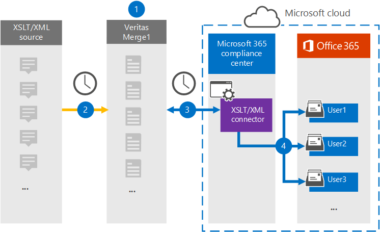

# XSLT/XML 데이터를 보관할 커넥터 설정

웹 페이지 원본의 veritas 커넥터를 Microsoft 365 규정 준수 센터 웹 페이지 원본에서 조직의 사용자 사서함으로 데이터를 Microsoft 365 있습니다. Veritas는 XSLT(Extensible Style sheet Language Transformations)를 사용하여 XML 파일을 가져오기 위해 가져올 수 있는 다른 파일 형식(예: HTML 또는 텍스트)으로 변환하여 파일을 빠르게 개발할 수 있는 [XSLT/XML](https://globanet.com/xslt-xml) 커넥터를 Microsoft 365. 커넥터는 항목의 내용을 XSLT/XML 원본에서 전자 메일 메시지 형식으로 변환한 다음 변환된 항목을 사서함으로 Microsoft 365 합니다.

XSLT/XML 데이터를 사용자 사서함에 저장한 후 소송 보존, eDiscovery Microsoft 365 보존 정책 및 보존 레이블과 같은 Microsoft 365 준수 기능을 적용할 수 있습니다. XSLT/XML 커넥터를 사용하여 조직에서 데이터를 가져오고 Microsoft 365 정부 및 규정 정책을 준수하는 데 도움이 될 수 있습니다.

## XSLT/XML 데이터 보관 개요

다음 개요에서는 커넥터를 사용하여 XSLT/XML 원본 데이터를 커넥터에 보관하는 Microsoft 365.

1. 조직은 XSLT/XML 원본과 함께 XSLT/XML 사이트를 설정하고 구성합니다.

2. 24시간마다 XSLT/XML 원본의 채팅 메시지가 Veritas Merge1 사이트에 복사됩니다. 또한 커넥터는 콘텐츠를 전자 메일 메시지 형식으로 변환합니다.

3. Microsoft 365 규정 준수 센터 만드는 XSLT/XML 커넥터는 매일 Veritas Merge1 사이트에 연결하고 메시지를 Microsoft 클라우드의 보안 Azure Storage 위치로 전송합니다.

4. 커넥터는 3단계에 설명된 자동 사용자 매핑의 *Email* 속성 값을 사용하여 변환된 메시지 항목을 특정 사용자의 사서함으로 가져올 수 있습니다. 받은 편지함 **폴더의 XSLT/XML이라는** 새 하위 폴더가 사용자 사서함에 만들어지며 메시지 항목을 해당 폴더로 가져와야 합니다. 이 커넥터는 Email 속성 값을 사용하여 이 *기능을* 실행합니다. 모든 메시지에는 메시지 참가자의 전자 메일 주소로 채워지는 이 속성이 포함되어 있습니다.

## 시작하기 전에

- Microsoft 커넥터에 대한 Veritas Merge1 계정을 생성합니다. 이 계정을 만들하려면 [Veritas 고객 지원에 문의하세요.](https://www.veritas.com/content/support/) 1단계에서 커넥터를 만들 때 이 계정에 로그인합니다.

- 1단계에서 XSLT/XML 커넥터를 만들고 3단계에서 완료하는 사용자는 2단계에서 사서함 가져오기 내보내기 역할에 할당해야 Exchange Online. 이 역할은 서버의 데이터  커넥터 페이지에서 커넥터를 추가하는 Microsoft 365 규정 준수 센터. 기본적으로 이 역할은 역할 그룹의 역할 그룹에 할당되지 Exchange Online. 사서함 가져오기 내보내기 역할을 조직의 조직 관리 역할 그룹에 추가할 수 Exchange Online. 또는 역할 그룹을 만들고 사서함 가져오기 내보내기 역할을 할당한 다음 해당 사용자를 구성원으로 추가할 수 있습니다. 자세한 내용은 "역할  그룹에서  역할 그룹 관리" 문서의 역할 그룹 만들기 또는 역할 그룹 수정 섹션을 Exchange Online.

## 1단계: XSLT/XML 커넥터 설정

첫 번째 단계는 서버의  데이터 커넥터에 액세스하고 Microsoft 365 규정 준수 센터 XSLT/XML 데이터에 대한 커넥터를 만드는 것입니다.

1. 으로 [https://compliance.microsoft.com](https://compliance.microsoft.com/) 이동한 다음 **데이터** 커넥터  >  **XSLT/XML을 클릭합니다.**

2. **XSLT/XML** 제품 설명 페이지에서 새 커넥터 **추가를 클릭합니다.**

3. 서비스 **약관 페이지에서** 동의를 **클릭합니다.**

4. 커넥터를 식별하는 고유한 이름을 입력하고 다음 을 **클릭합니다.**

5. Merge1 계정에 로그인하여 커넥터를 구성합니다.

## 2단계: XSLT/XML 커넥터 구성

두 번째 단계는 Merge1 사이트에서 XSLT/XML 커넥터를 구성하는 것입니다. Veritas Merge1 사이트에서 XSLT/XML 커넥터를 구성하는 방법에 대한 자세한 내용은 [Merge1 Third-Party Connectors User Guide를 참조하십시오.](https://docs.ms.merge1.globanetportal.com/Merge1%20Third-Party%20Connectors%20XSLT-XML%20User%20Guide%20.pdf)

Save & **Finish를** 클릭하면 연결선의 커넥터 마법사에 있는 사용자 매핑 Microsoft 365 규정 준수 센터 표시됩니다. 

## 3단계: 사용자 매핑 및 커넥터 설정 완료

1. 사용자를 매핑하고 Microsoft 365 규정 준수 센터 다음 단계를 따르세요.

2. **XSLT/XML** 사용자와 사용자 Microsoft 365 매핑 페이지에서 자동 사용자 매핑을 사용하도록 설정합니다. XSLT/XML 항목에는 조직의 사용자에 대한 전자 메일 주소가 포함된 *Email이라는* 속성이 포함됩니다. 커넥터가 이 주소를 Microsoft 365 사용자 사서함으로 항목을 가져올 수 있습니다.

3. **다음을** 클릭하고 설정을 검토하고  데이터 커넥터 페이지로 이동하여 새 커넥터의 가져오기 프로세스 진행률을 확인합니다.

## 4단계: XSLT/XML 커넥터 모니터링

XSLT/XML 커넥터를 만든 후 연결선의 커넥터 상태를 볼 수 Microsoft 365 규정 준수 센터.

1. 으로 [https://compliance.microsoft.com](https://compliance.microsoft.com) 이동하여 왼쪽 **nav에서 데이터** 커넥터를 클릭합니다.

2. 커넥터 **탭을** 클릭한 다음 **XSLT/XML** 커넥터를 선택하여 플라이아웃 페이지를 표시합니다. 이 페이지에는 커넥터에 대한 속성과 정보가 포함되어 있습니다.

3. 원본이 있는 커넥터 상태  **아래에서** 로그 다운로드 링크를 클릭하여 커넥터의 상태 로그를 열거나 저장합니다. 이 로그에는 Microsoft 클라우드로 가져온 데이터가 포함되어 있습니다.

## 알려진 문제

- 현재는 10MB보다 큰 첨부 파일 또는 항목 가져오기는 지원되지 않습니다. 더 큰 항목에 대한 지원은 나중에 사용할 수 있습니다.