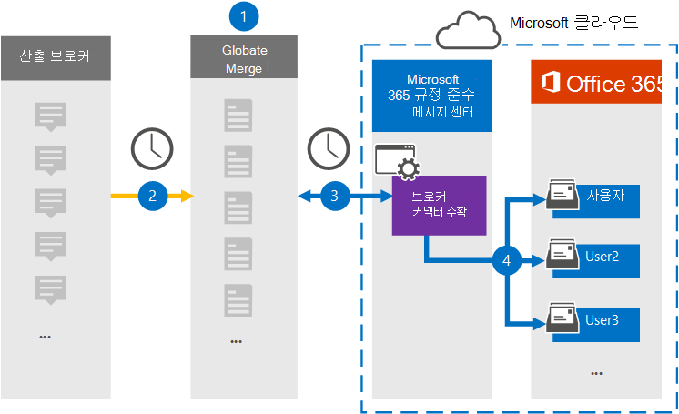

# Yieldbroker 데이터를 보관할 커넥터 설정

Microsoft 365 규정 준수 센터의 Globanet 커넥터를 사용하여 Yieldbroker에서 Microsoft 365 조직의 사용자 사서함으로 데이터를 가져오고 보관합니다. Globanet은 타사 데이터 원본에서 항목을 캡처하고 해당 항목을 Microsoft 365로 가져오도록 구성된 [Yieldbroker](https://globanet.com/yieldbroker/) 커넥터를 제공합니다. 커넥터는 Yieldbroker의 콘텐츠를 전자 메일 메시지 형식으로 변환한 다음 해당 항목을 Microsoft 365의 사용자 사서함으로 가져올 수 있습니다.

Yieldbroker를 사용자 사서함에 저장한 후 소송 보존, eDiscovery, 보존 정책 및 보존 레이블과 같은 Microsoft 365 규정 준수 기능을 적용할 수 있습니다. Yieldbroker 커넥터를 사용하여 Microsoft 365에서 데이터를 가져오고 보관하면 조직이 정부 및 규제 정책을 준수하는 데 도움이 될 수 있습니다.

## 보관 Yieldbroker 데이터 개요

다음 개요에서는 커넥터를 사용하여 Microsoft 365에서 Yieldbroker 데이터를 보관하는 프로세스에 대해 설명합니다.

1. 조직은 Yieldbroker와 함께 Yieldbroker 사이트를 설정하고 구성합니다.

2. 24시간마다 한 번씩, Yieldbroker 항목이 Globanet Merge1 사이트에 복사됩니다. 또한 커넥터는 콘텐츠를 전자 메일 메시지 형식으로 변환합니다.

3. Microsoft 365 규정 준수 센터에서 만든 Yieldbroker 커넥터는 매일 Globanet Merge1 사이트에 연결하고 메시지를 Microsoft 클라우드의 보안 Azure Storage 위치로 전송합니다.

4. 커넥터는 3단계에 설명된 자동 사용자 매핑의 *Email* 속성 값을 사용하여 변환된 Yieldbroker 항목을 특정 사용자의 사서함으로 [가져올 수 있습니다.](#step-3-map-users-and-complete-the-connector-setup) 받은 편지함 **폴더에서 Yieldbroker라는** 하위 폴더가 사용자 사서함에 만들어지며 항목을 해당 폴더로 가져올 수 있습니다. 커넥터는 Email 속성 값을 사용하여 항목을 가져올 사서함을 결정할 *수* 있습니다. 모든 Yieldbroker에는 항목의 모든 참가자의 전자 메일 주소로 채워지는 이 속성이 포함되어 있습니다.

## 시작하기 전에

- Microsoft 커넥터에 대한 Globanet Merge1 계정을 만드시다. 계정을 만들 경우 [Globanet 고객](https://globanet.com/contact-us/)지원에 문의하세요. 1단계에서 커넥터를 만들 때 이 계정에 로그인해야 합니다.

- 1단계에서 Yieldbroker 커넥터를 만들고 3단계에서 완료하는 사용자는 Exchange Online의 사서함 가져오기 내보내기 역할에 할당되어야 합니다. 이 역할은 Microsoft 365 규정 준수 센터의 데이터 커넥터 페이지에서 커넥터를 추가하는 데 필요합니다. 기본적으로 이 역할은 Exchange Online의 역할 그룹에 할당되지 않습니다. Exchange Online의 조직 관리 역할 그룹에 사서함 가져오기 내보내기 역할을 추가할 수 있습니다. 또는 역할 그룹을 만들고 사서함 가져오기 내보내기 역할을 할당한 다음 해당 사용자를 구성원으로 추가할 수 있습니다. 자세한 내용은 "Exchange  Online에서  역할 그룹 관리" 문서의 역할 그룹 만들기 또는 역할 그룹 수정 섹션을 참조하십시오.

## 1단계: Yieldbroker 커넥터 설정

첫 번째 단계는 Microsoft  365 규정 준수 센터의 데이터 커넥터 페이지에 액세스하고 Yieldbroker에 대한 커넥터를 만드는 것입니다.

1. Go to [https://compliance.microsoft.com](https://compliance.microsoft.com/) and then click Data **connectors** &gt; **Yieldbroker.**

2. **Yieldbroker 제품** 설명 페이지에서 새 커넥터 **추가를 클릭합니다.**

3. 서비스 약관 **페이지에서** 수락을 **클릭합니다.**

4. 커넥터를 식별하는 고유한 이름을 입력하고 다음을 **클릭합니다.**

5. Merge1 계정에 로그인하여 커넥터를 구성합니다.

## 2단계: Globanet Merge1 사이트에서 Yieldbroker 커넥터 구성

두 번째 단계는 Merge1 사이트에서 Yieldbroker 커넥터를 구성하는 것입니다. Yieldbroker를 구성하는 방법에 대한 자세한 내용은 [Merge1 Third-Party Connectors 사용자 가이드를 참조하십시오.](https://docs.ms.merge1.globanetportal.com/Merge1%20Third-Party%20Connectors%20Yieldbroker%20User%20Guide%20.pdf)

저장 & **마친** 후 Microsoft  365 준수 센터의 커넥터 마법사에 있는 사용자 매핑 페이지가 표시됩니다.

## 3단계: 사용자 매핑 및 커넥터 설정 완료

사용자를 매핑하고 커넥터 설정을 완료하려면 다음 단계를 수행합니다.

1. Microsoft **365** 사용자에 대한 Map Yieldbroker 사용자 페이지에서 자동 사용자 매핑을 사용하도록 설정합니다. Yieldbroker 항목에는 조직의 사용자에 대한 전자 메일 주소가 포함된 *Email이라는* 속성이 포함됩니다. 커넥터가 이 주소를 Microsoft 365 사용자와 연결하면 항목이 해당 사용자의 사서함으로 가져오기됩니다.

2. 다음을 **클릭하고** 설정을 검토하고  데이터 커넥터 페이지로 이동하여 새 커넥터의 가져오기 프로세스 진행률을 확인합니다.

## 4단계: Yieldbroker 커넥터 모니터링

Yieldbroker 커넥터를 만든 후 Microsoft 365 규정 준수 센터에서 커넥터 상태를 볼 수 있습니다.

1. Go to [https://compliance.microsoft.com](https://compliance.microsoft.com/) and click **Data connectors** in the left nav.

2. 커넥터 **탭을** 클릭한 다음 **Yieldbroker** 커넥터를 선택하여 커넥터에 대한 속성과 정보가 포함된 플라이아웃 페이지를 표시합니다.

3. 원본이 **있는 커넥터** 상태  아래에서 다운로드 로그 링크를 클릭하여 커넥터의 상태 로그를 열거나 저장합니다. 이 로그에는 Microsoft 클라우드로 가져온 데이터가 포함되어 있습니다.

## 알려진 문제

- 현재는 10MB보다 큰 첨부 파일 또는 항목 가져오기는 지원되지 않습니다. 더 큰 항목에 대한 지원은 나중에 사용할 수 있습니다.
