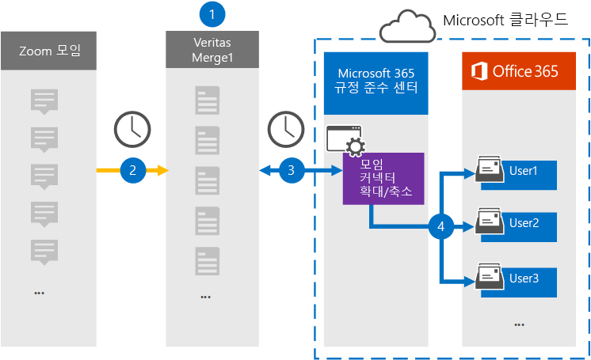

# 확대/축소 모임 데이터를 보관할 커넥터 설정Set up a connector to archive Zoom Meetings data

Microsoft 365 규정 준수 센터의 Globanet 커넥터를 사용하여 확대/축소 모임에서 Microsoft 365 조직의 사용자 사서함으로 데이터를 가져오고 보관합니다.Use a Globanet connector in the Microsoft 365 compliance center to import and archive data from Zoom Meetings to user mailboxes in your Microsoft 365 organization. Globanet은  타사 데이터 원본에서 항목을 캡처하고(정기적으로) 해당 항목을 Microsoft 365로 가져오도록 구성된 확대/축소 모임 커넥터를 제공합니다.Globanet provides a [Zoom Meetings](https://globanet.com/zoom/) connector that is configured to capture items from the third-party data source (on a regular basis) and import those items to Microsoft 365. 커넥터는 모임의 콘텐츠(채팅, 녹음된 파일 및 메타데이터 포함)를 확대/축소 모임 계정에서 전자 메일 메시지 형식으로 변환한 다음 이러한 항목을 Microsoft 365의 사용자 사서함으로 가져올 수 있습니다.The connector converts the content of the meetings (including chats, recorded files, and metadata) from the Zoom Meetings account to an email message format and then imports those items to user mailboxes in Microsoft 365.

확대/축소 모임 데이터가 사용자 사서함에 저장되고 나면 소송 보존, eDiscovery, 보존 정책 및 보존 레이블, 통신 준수와 같은 Microsoft 365 규정 준수 기능을 적용할 수 있습니다.After Zoom Meetings data is stored in user mailboxes, you can apply Microsoft 365 compliance features such as Litigation Hold, eDiscovery, retention policies and retention labels, and communication compliance. 확대/축소 모임 커넥터를 사용하여 Microsoft 365에서 데이터를 가져오고 보관하면 조직이 정부 및 규정 정책을 준수하는 데 도움이 될 수 있습니다.Using a Zoom Meetings connector to import and archive data in Microsoft 365 can help your organization stay compliant with government and regulatory policies.

## 확대/축소 모임 데이터 보관 개요Overview of archiving Zoom Meetings data

다음 개요에서는 커넥터를 사용하여 Microsoft 365에서 확대/축소 모임 데이터를 보관하는 프로세스에 대해 설명합니다.The following overview explains the process of using a connector to archive Zoom Meetings data in Microsoft 365.

1. 조직은 확대/축소 모임을 사용하여 확대/축소 모임 사이트를 설정하고 구성합니다.Your organization works with Zoom Meetings to set up and configure a Zoom Meetings site.

2. 24시간마다 확대/축소 모임의 모임 항목이 Globanet Merge1 사이트에 복사됩니다.Once every 24 hours, meeting items from Zoom Meetings are copied to the Globanet Merge1 site. 또한 커넥터는 모임의 콘텐츠를 전자 메일 메시지 형식으로 변환합니다.The connector also converts the content of the meetings to an email message format.

3. Microsoft 365 규정 준수 센터에서 만든 확대/축소 모임 커넥터는 매일 Globanet Merge1에 연결하고 모임 메시지를 Microsoft 클라우드의 보안 Azure Storage 위치로 전송합니다.The Zoom Meetings connector that you create in the Microsoft 365 compliance center, connects to the Globanet Merge1 every day, and transfers the meeting messages to a secure Azure Storage location in the Microsoft cloud.

4. 커넥터는 3단계에 설명된 전자 메일 속성 및 자동  사용자 매핑 값을 사용하여 변환된 모임 항목을 특정 사용자의 사서함으로 가져올 수 있습니다.The connector imports the converted meeting items to the mailboxes of specific users using the value of the *Email* property and automatic user mapping, as described in Step 3. 받은 편지함 폴더의 **Zoom Meetings라는** 새 하위 폴더가 사용자 사서함에 만들어지며 모임 항목을 해당 폴더로 가져올 수 있습니다.A new subfolder in the Inbox folder named **Zoom Meetings** is created in user mailboxes, and the meeting items are imported to that folder. 커넥터는 Email 속성 값을 사용하여 이 *기능을* 실행합니다.The connector does this by using the value of the *Email* property. 모든 모임 항목에는 모임의 모든 참가자의 전자 메일 주소로 채워지는 이 속성이 포함되어 있습니다.Every meeting item contains this property, which is populated with the email address of every participant of the meeting.

## 시작하기 전에Before you begin

- Microsoft 커넥터에 대한 Globanet Merge1 계정을 만드시다.Create a Globanet Merge1 account for Microsoft connectors. 이 계정을 만들하려면 [Globanet 고객 지원에 문의하세요.](https://globanet.com/ms-connectors-contact)To create this account, contact [Globanet Customer Support](https://globanet.com/ms-connectors-contact). 1단계에서 커넥터를 만들 때 이 계정에 로그인합니다.You will sign into this account when you create the connector in Step 1.

- 조직의 Zoom Business 또는 Zoom Enterprise 계정의 사용자 이름과 암호를 얻습니다.Obtain the username and password for your organization's Zoom Business or Zoom Enterprise account. 확대/축소 모임 커넥터를 구성할 때 2단계에서 이 계정에 로그인해야 합니다.You'll need to sign into this account in Step 2 when you configure the Zoom Meetings connector.

- 확대/축소 마켓플레이스에서 다음 [응용 프로그램을 만드시다.](https://marketplace.zoom.us)Create the following applications in the [Zoom Marketplace](https://marketplace.zoom.us):

  - OAuth 응용 프로그램OAuth application

  - JWT 응용 프로그램JWT application

  이러한 응용 프로그램을 만든 후 확대/축소 플랫폼은 토큰을 생성하는 데 사용되는 고유한 자격 증명 집합을 생성합니다.After you create these applications, the Zoom platform generates a set of unique credentials used to generate the tokens. 이러한 토큰은 커넥터가 확대/축소 계정에 연결하여 Merge1 사이트에 항목을 복사할 때 커넥터를 인증하는 데 사용됩니다.These tokens are used to authenticate the connector when it connects to your Zoom account and copies items to the Merge1 site. 2단계에서 확대/축소 커넥터를 구성할 때 이러한 토큰을 사용하게 됩니다.You will use these tokens when you configure the Zoom connector in Step 2.

  OAuth 및 JWT 응용 프로그램을 만드는 방법에 대한 단계별 지침은 Merge1 타사 커넥터 [사용자 가이드를 참조하세요.](https://docs.ms.merge1.globanetportal.com/Merge1%20Third-Party%20Connectors%20Zoom%20Meetings%20User%20Guide%20.pdf)For step-by step instructions on how to create the OAuth and JWT applications, see [Merge1 Third-Party Connectors User Guide](https://docs.ms.merge1.globanetportal.com/Merge1%20Third-Party%20Connectors%20Zoom%20Meetings%20User%20Guide%20.pdf).

- 1단계에서 확대/축소 모임 커넥터를 만들고 3단계에서 완료하는 사용자는 Exchange Online의 사서함 가져오기 내보내기 역할에 할당되어야 합니다.The user who creates the Zoom Meetings connector in Step 1 (and completes it in Step 3) must be assigned to the Mailbox Import Export role in Exchange Online. 이 역할은 Microsoft 365 규정 준수 센터의 데이터 커넥터 페이지에서 커넥터를 추가하는 데 필요합니다. This role is required to add connectors on the **Data connectors** page in the Microsoft 365 compliance center. 기본적으로 이 역할은 Exchange Online의 역할 그룹에 할당되지 않습니다.By default, this role is not assigned to a role group in Exchange Online. Exchange Online의 조직 관리 역할 그룹에 사서함 가져오기 내보내기 역할을 추가할 수 있습니다.You can add the Mailbox Import Export role to the Organization Management role group in Exchange Online. 또는 역할 그룹을 만들고 사서함 가져오기 내보내기 역할을 할당한 다음 해당 사용자를 구성원으로 추가할 수 있습니다.Or you can create a role group, assign the Mailbox Import Export role, and then add the appropriate users as members. 자세한 내용은 "Exchange  Online에서  역할 그룹 관리" 문서에서 역할 그룹 만들기 또는 역할 그룹 수정 섹션을 참조하십시오.For more information, see the [Create role groups](https://docs.microsoft.com/Exchange/permissions-exo/role-groups#create-role-groups) or [Modify role groups](https://docs.microsoft.com/Exchange/permissions-exo/role-groups#modify-role-groups) sections in the article "Manage role groups in Exchange Online".

## 1단계: 확대/축소 모임 커넥터 설정Step 1: Set up the Zoom Meetings connector

첫 번째 단계는 Microsoft 365 규정 준수 센터에서 **데이터** 커넥터에 액세스하고 확대/축소 모임 커넥터를 만드는 것입니다.The first step is to access the **Data Connectors** in the Microsoft 365 compliance center and create a Zoom Meetings connector.

1. Go to [https://compliance.microsoft.com](https://compliance.microsoft.com/) and then click Data **connectors**  >  **Zoom Meetings.**Go to [https://compliance.microsoft.com](https://compliance.microsoft.com/) and then click **Data connectors** > **Zoom Meetings**.

2. **확대/축소 모임** 제품 설명 페이지에서 커넥터 **추가를 클릭합니다.**On the **Zoom Meetings** product description page, click **Add connector**.

3. 서비스 약관 **페이지에서** 수락을 **클릭합니다.**On the **Terms of service** page, click **Accept**.

4. 커넥터를 식별하는 고유한 이름을 입력하고 다음을 **클릭합니다.**Enter a unique name that identifies the connector, and then click **Next**.

5. Merge1 계정에 로그인하여 커넥터를 구성합니다.Sign in to your Merge1 account to configure the connector.

## 2단계: 확대/축소 모임 커넥터 구성Step 2: Configure the Zoom Meetings connector

두 번째 단계는 Merge1 사이트에서 확대/축소 모임 커넥터를 구성하는 것입니다.The second step is to configure the Zoom Meetings connector on the Merge1 site. Globanet Merge1 사이트에서 확대/축소 모임 커넥터를 구성하는 방법에 대한 자세한 내용은 [Merge1 Third-Party Connectors 사용자 가이드를 참조하십시오.](https://docs.ms.merge1.globanetportal.com/Merge1%20Third-Party%20Connectors%20Zoom%20Meetings%20User%20Guide%20.pdf)For more information about how to configure the Zoom Meetings connector on the Globanet Merge1 site, see [Merge1 Third-Party Connectors User Guide](https://docs.ms.merge1.globanetportal.com/Merge1%20Third-Party%20Connectors%20Zoom%20Meetings%20User%20Guide%20.pdf).

저장 **&** 마친 후 Microsoft  365 준수 센터의 커넥터 마법사에 있는 사용자 매핑 페이지가 표시됩니다.After you click **Save & Finish**, the **User mapping** page in the connector wizard in the Microsoft 365 compliance center is displayed.

## 3단계: 사용자 매핑 및 커넥터 설정 완료Step 3: Map users and complete the connector setup

1. 외부 사용자를 **Microsoft 365** 사용자에 매핑 페이지에서 자동 사용자 매핑을 사용하도록 설정합니다.On the **Map external users to Microsoft 365 users** page, enable automatic user mapping.

   확대/축소 모임 항목에는 조직의 사용자에 대한 전자 메일 주소가 포함된 *Email이라는* 속성이 포함됩니다.Zoom Meetings items include a property called *Email* that contains email addresses for users in your organization. 커넥터가 이 주소를 Microsoft 365 사용자와 연결하면 해당 사용자의 사서함으로 항목이 가져오기됩니다.If the connector can associate this address with a Microsoft 365 user, the items are imported to that user's mailbox

2. 다음을 **클릭하고** 설정을 검토하고  데이터 커넥터 페이지로 이동하여 새 커넥터의 가져오기 프로세스 진행률을 확인합니다.Click **Next**, review your settings, and go to the **Data connectors** page to see the progress of the import process for the new connector.

## 4단계: 확대/축소 모임 커넥터 모니터링Step 4: Monitor the Zoom Meetings connector

확대/축소 모임 커넥터를 만든 후 Microsoft 365 규정 준수 센터에서 커넥터 상태를 볼 수 있습니다.After you create the Zoom Meetings connector, you can view the connector status in the Microsoft 365 compliance center.

1. Go to [https://compliance.microsoft.com](https://compliance.microsoft.com) and click **Data connectors** in the left nav.Go to [https://compliance.microsoft.com](https://compliance.microsoft.com) and click **Data connectors** in the left nav.

2. 커넥터 **탭을** 클릭한 다음 확대/축소 **모임** 커넥터를 선택하여 플라이아웃 페이지를 표시합니다.Click the **Connectors** tab and then select the **Zoom Meetings** connector to display the flyout page. 이 페이지에는 커넥터에 대한 속성과 정보가 포함되어 있습니다.This page contains the properties and information about the connector.

3. 원본이 **있는 커넥터** 상태  아래에서 다운로드 로그 링크를 클릭하여 커넥터의 상태 로그를 열거나 저장합니다.Under **Connector status with source**, click the **Download log** link to open (or save) the status log for the connector. 이 로그에는 Microsoft 클라우드로 가져온 데이터에 대한 정보가 포함되어 있습니다.This log contains information about the data that has been imported to the Microsoft cloud.

## 알려진 문제Known issues

- 현재는 10MB보다 큰 첨부 파일 또는 항목 가져오기는 지원되지 않습니다.At this time, we don't support importing attachments or items that are larger than 10 MB. 더 큰 항목에 대한 지원은 나중에 사용할 수 있습니다.Support for larger items will be available at a later date.

- 확대/축소 모임 커넥터가 작동하려면 확대/축소 모임을 설정할 때 녹음/녹화를 사용하도록 설정해야 합니다.For the Zoom Meetings connector to work, you must enable recordings when setting up Zoom Meetings.
