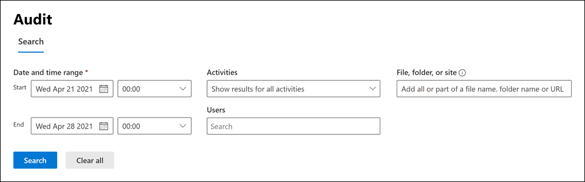

# Microsoft 365의 감사 솔루션Auditing solutions in Microsoft 365

Microsoft 365 감사 솔루션은 조직이 보안 이벤트, 법의학적 조사, 내부 조사 및 규정 준수 의무에 효과적으로 대응할 수 있도록 지원하는 통합 솔루션을 제공합니다.Microsoft 365 auditing solutions provide an integrated solution to help organizations effectively respond to security events, forensic investigations, internal investigations, and compliance obligations. 수십 개의 Microsoft 365 서비스 및 솔루션에서 수행되는 수천 개의 사용자 및 관리 작업이 조직의 통합 감사 로그에 캡처, 기록 및 보존됩니다.Thousands of user and admin operations performed in dozens of Microsoft 365 services and solutions are captured, recorded, and retained in your organization's unified audit log. 이러한 이벤트에 대한 감사 기록은 보안 운영자, IT 관리자, 내부자 위험 팀, 조직의 규정 준수 및 법률 조사관이 검색할 수 있습니다.Audit records for these events are searchable by security ops, IT admins, insider risk teams, and compliance and legal investigators in your organization. 이 기능을 사용하면 Microsoft 365 조직 전체에서 수행되는 작업을 볼 수 있습니다.This capability provides visibility into the activities performed across your Microsoft 365 organization.

## Microsoft 365 감사 솔루션Microsoft 365 auditing solutions

Microsoft 365는 기본 감사와 고급 감사라는 두 가지 감사 솔루션을 제공합니다.Microsoft 365 provides two auditing solutions: Basic auditing and Advanced Audit.

### 기본 감사Basic auditing

기본 감사 기능은 감사된 활동을 기록 및 검색하고 법의학, IT, 규정 준수 및 법적 조사를 수행할 수 있는 기능을 제공합니다.Basic auditing provides with you with the ability to log and search for audited activities and power your forensic, IT, compliance, and legal investigations.

- **기본적으로 사용 설정** 됩니다.**Enabled by default**. 기본 감사는 해당 구독이 있는 모든 조직에 대해 기본적으로 설정됩니다.Basic auditing is turned on by default for all organizations with the appropriate subscription. 이는 감사된 활동에 대한 기록을 캡처하고 검색할 수 있음을 의미합니다.That means records for audited activities will be captured and searchable. 필요한 유일한 설정은 감사 로그 검색 도구(및 해당 cmdlet)에 액세스하는 데 필요한 사용 권한을 할당하고 사용자의 에 고급 감사 기능에 올바른 라이선스가 할당되었는지 확인하는 것입니다.The only setup that required is to assign the necessary permissions to access the audit log search tool (and the corresponding cmdlet) and make sure that user's are assigned the right license for Advanced Audit features.
- **수천 개의 검색 가능한 감사 이벤트**.**Thousands of searchable audit events**. 조직의 대부분의 Microsoft 365 서비스에서 발생하는 광범위한 감사 활동을 검색할 수 있습니다.You can search for a wide-range of audited activities that occur is most of the Microsoft 365 services in your organization. 검색할 수 있는 작업의 일부 목록은 [감사 활동](search-the-audit-log-in-security-and-compliance.md#audited-activities)을 참조하세요.For a partial list of the activities you can search for, see [Audited activities](search-the-audit-log-in-security-and-compliance.md#audited-activities). 감사된 작업을 지원하는 서비스 및 기능 목록은 [감사 로그 레코드 유형](/office/office-365-management-api/office-365-management-activity-api-schema#auditlogrecordtype)을 참조하세요.For a list of the services and features that support audited activities, see [Audit log record type](/office/office-365-management-api/office-365-management-activity-api-schema#auditlogrecordtype).
- **Microsoft 365 규정 준수 센터의 감사 검색 도구**.**Audit search tool in the Microsoft 365 compliance center**. Microsoft 365 규정 준수 센터의 감사 로그 검색 도구를 사용하여 감사 레코드를 검색합니다.Use the Audit log search tool in the Microsoft 365 compliance center to search for audit records. 특정 활동, 특정 사용자가 수행한 활동 및 날짜 범위로 발생한 활동을 검색할 수 있습니다.You can search for specific activities, for activities performed by specific users, and activities that occurred with a date range. 다음은 규정 준수 센터에 있는 감사 검색 도구의 스크린샷입니다.Here's a screenshot of the Audit search tool in the compliance center.

   

- **Search-UnifiedAuditLog cmdlet**.**Search-UnifiedAuditLog cmdlet**. Exchange Online PowerShell의 **Search-UnifiedAuditLog** cmdlet(검색 도구의 기본 cmdlet)을 사용하여 감사 이벤트를 검색하거나 스크립트에서 사용할 수도 있습니다.You can also use the **Search-UnifiedAuditLog** cmdlet in Exchange Online PowerShell (the underlying cmdlet for the search tool) to search for audit events or to use in a script. 자세한 내용은 다음을 참조하세요.For more information, see:

  - [검색 통합감사 로그Search-UnifiedAuditLog](/powershell/module/exchange/search-unifiedauditlog)
  - [PowerShell 스크립트를 사용하여 감사 로그 검색Use a PowerShell script to search the audit log](audit-log-search-script.md)

- **감사 레코드를 CSV 파일로 내보내기**.**Export audit records to a CSV file**. 규정 준수 센터에서 감사 로그 검색 도구를 실행한 후 검색에 의해 반환된 감사 레코드를 CSV 파일로 내보낼 수 있습니다.After run the Audit log search tool in the compliance center, you can export the audit records returned by the search to a CSV file. 이렇게 하면 Microsoft Excel 정렬 및 필터 기능을 여러 감사 레코드 속성에서 사용할 수 있습니다.This lets you use Microsoft Excel sort and filter on different audit record properties. Excel 파워 쿼리 변환 기능을 사용하여 AuditData JSON 개체의 각 속성을 자체 열로 분할할 수도 있습니다.You can also use Excel Power Query transform functionality to split each property in the AuditData JSON object into its own column. 이렇게 하면 서로 다른 이벤트에 대한 유사한 데이터를 효과적으로 보고 비교할 수 있습니다.This lets you effectively view and compare similar data for different events. 자세한 내용은 [감사 로그 레코드 내보내기, 구성 및 보기](export-view-audit-log-records.md)를 참조하세요.For more information, see [Export, configure, and view audit log records](export-view-audit-log-records.md).

- **Office 365 Management Activity API를 통해 감사 로그에 액세스**.**Access to audit logs via Office 365 Management Activity API**. 감사 레코드를 액세스하고 검색하는 세 번째 방법은 Office 365 Management Activity API를 사용하는 것입니다.A third method for accessing and retrieving audit records is to use the Office 365 Management Activity API. 이를 통해 조직은 감사 데이터를 기본 90일보다 오랜 기간 동안 보존하고 감사 데이터를 SIEM 솔루션으로 가져올 수 있습니다.This lets organizations retain auditing data for longer periods than the default 90 days and lets them import their auditing data to a SIEM solution. 자세한 내용은 [Office 365 Management Activity API 참조](/office/office-365-management-api/office-365-management-activity-api-reference)를 참조하세요.For information, see [Office 365 Management Activity API reference](/office/office-365-management-api/office-365-management-activity-api-reference).

- **90일 감사 로그 보존 기간**.**90-day audit log retention**. 사용자 또는 관리자가 감사되는 활동을 수행하면 감사 레코드가 생성되어 조직의 감사 로그에 저장됩니다.When an audited activity is performed by a user or admin, an audit record is generated and stored in the audit log for your organization. 기본 감사에서 레코드는 90일 동안 유지되므로 지난 3개월 내에 발생한 활동을 검색할 수 있습니다.In Basic auditing, records are retained for 90 days, which means you can search for activities that occurred within the past three months.

### 고급 감사Advanced Audit

고급 감사는 감사 로그 보존 정책, 감사 기록의 장기 보존, 고부가가치 중요 이벤트 및 Office 365 Management Activity API에 대한 높은 대역폭 액세스 기능을 제공함으로써 기본 감사 기능을 기반으로 합니다.Advanced Audit builds on the capabilities of Basic auditing by providing audit log retention policies, longer retention of audit records, high-value crucial events, and higher bandwidth access to the Office 365 Management Activity API.

- **감사 로그 보존 정책**.**Audit log retention policies**. 사용자 정의된 감사 로그 보존 정책을 생성하여 감사 레코드를 최대 1년(필요한 추가 기능 라이선스를 가진 사용자의 경우 최대 10년)까지 더 오래 유지할 수 있습니다.You can create customized audit log retention policies to retain audit records for longer periods of time up to one year (and up to 10 years for users with required add-on license). 감사된 활동이 발생하는 서비스, 특정 감사된 활동 또는 감사된 활동을 수행하는 사용자를 기준으로 감사 레코드를 보관하는 정책을 만들 수 있습니다.You can create a policy to retain audit records based the service where the audited activities occur, specific audited activities, or the user who performs an audited activity.

- **더 길어진 감사 레코드의 보존****Longer retention of audit records**. Exchange, SharePoint 및 Azure Active Directory 감사 레코드는 기본적으로 1년 동안 유지됩니다.Exchange, SharePoint, and Azure Active Directory audit records are retained for one year by default. 감사 로그 보존 정책을 사용하여 더 긴 보존 기간을 구성할 수 있으므로 다른 모든 작업에 대한 감사 레코드는 기본적으로 90일 동안 유지됩니다.Audit records for all other activities are retained for 90 days by default, by you can use audit log retention policies to configure longer retention periods.

- **높은 값, 중요한 이벤트**.**High-value, crucial events**. 중요한 이벤트에 대한 감사 레코드는 메일 항목에 액세스한 시기, 메일 항목에 회신 및 회송된 시기, Exchange Online 및 SharePoint Online에서 사용자가 검색한 시기 및 내용과 같은 이벤트에 대한 가시성을 제공하여 조직이 법의학적 조사 및 규정 준수 조사를 수행하는 데 도움이 될 수 있습니다.Audit records for crucial events can help your organization conduct forensic and compliance investigations by providing visibility to events such as when mail items were accessed, or when mail items were replied to and forwarded, and when and what a user searched for in Exchange Online and SharePoint Online. 이러한 주요 이벤트는 발생 가능성이 있는 위반을 조사하고 손상 범위를 결정 하는 데 도움이 될 수 있습니다.These crucial events can help you investigate possible breaches and determine the scope of compromise.

- **Office 365 관리 활동 API에 대한 고 대역폭**.**Higher bandwidth to the Office 365 Management Activity API**. 고급 감사는 Office 365 관리 활동 API를 통해 감사 로그에 액세스할 수 있는 더 많은 대역폭을 조직에 제공합니다.Advanced Audit provides organizations with more bandwidth to access auditing logs through the Office 365 Management Activity API. 기본 감사 또는 고급 감사 기능이 있는 모든 조직에는 처음에는 분당 2,000개의 요청이 할당되지만, 이 제한은 조직의 좌석 수와 라이선스 가입에 따라 동적으로 증가합니다.Although all organizations (that have Basic auditing or Advanced Audit) are initially allocated a baseline of 2,000 requests per minute, this limit will dynamically increase depending on an organization's seat count and their licensing subscription. 따라서 고급 감사 기능이 있는 조직은 기본 감사 기능이 있는 조직보다 약 두 배 더 많은 대역폭을 얻게 됩니다.This results in organizations with Advanced Audit getting about twice the bandwidth as organizations with Basic auditing.

고급 감사 기능에 대한 자세한 내용은 [Microsoft 365의 고급 감사](advanced-audit.md)를 참조하세요.For more detailed information about Advanced Audit features, see [Advanced Audit in Microsoft 365](advanced-audit.md).

## 주요 기능 비교Comparison of key capabilities

다음 표에서는 기본 감사와 고급 감사에서 사용할 수 있는 주요 기능을 비교합니다.The following table compares the key capabilities available in Basic auditing and Advanced Audit. 모든 기본 감사 기능은 고급 감사에 포함됩니다.All Basic auditing functionality is included in Advanced Audit.

|기능Capability|기본 감사Basic auditing|고급 감사Advanced Audit|
|:------|:-------------|:-------------|
|기본적으로 사용Enabled by default|||
|수천 개의 검색 가능한 감사 이벤트Thousands of searchable audit events|||
|Microsoft 365 규정 준수 센터의 감사 검색 도구Audit search tool in the Microsoft 365 compliance center|||
|**Search-UnifiedAuditLog** cmdlet**Search-UnifiedAuditLog** cmdlet|||
|CSV 파일로 감사 레코드 내보내기Export audit records to CSV file|||
|Office 365 Management Activity API를 통해 감사 로그에 액세스1.Access to audit logs via Office 365 Management Activity API 1|||
|90일 감사 로그 보존90-day audit log retention|||
|1년 감사 로그 보존1-year audit log retention|||
|10년 감사 로그 보존 기간 210-year audit log retention 2|||
|로그 보존 정책 감사Audit log retention policies|||
|가치가 높고 중요한 이벤트High-value, crucial events|||
||||
> [!NOTE]
> 1 고급 감사에는 감사 데이터에 대한 더 빠른 액세스를 제공하는 Office 365 관리 활동 API에 대한 더 높은 대역폭 액세스가 포함됩니다.1 Advanced Audit includes higher bandwidth access to the Office 365 Management Activity API, which provides faster access to audit data. 2 고급 감사에 필요한 라이선스(다음 섹션에서 설명) 외에 감사 레코드를 10년 동안 유지하려면 사용자에게 라이선스에 10년 감사 로그 보존 추가가 할당되어야 합니다.2 In addition to the required licensing for Advanced Audit (described in the next section), a user must be assigned a 10-Year Audit Log Retention add on license to retain their audit records for 10 years.

## 라이선스 요구사항Licensing requirements

다음 섹션에서는 기본 감사 및 고급 감사에 대한 라이선싱 요구 사항을 식별합니다.The following sections identify the licensing requirements for Basic auditing and Advanced Audit. 기본 감사 기능은 고급 감사에 포함됩니다.Basic auditing functionality is included with Advanced Auditing.

### 기본 감사Basic auditing

- Microsoft 365 Enterprise E3 구독Microsoft 365 Enterprise E3 subscription
- Microsoft 365 Business PremiumMicrosoft 365 Business Premium
- Microsoft 365 Education A3 구독Microsoft 365 Education A3 subscription
- Microsoft 365 Government G3 구독Microsoft 365 Government G3 subscription
- Microsoft 365 Government G1 구독Microsoft 365 Government G1 subscription
- Office 365 Enterprise E3 구독Office 365 Enterprise E3 subscription
- Office 365 Enterprise E1 구독Office 365 Enterprise E1 subscription
- Office 365 Education A1 구독Office 365 Education A1 subscription
- Office 365 Education A3 구독Office 365 Education A3 subscription

### 고급 감사Advanced Audit

- Microsoft 365 Enterprise E5 구독Microsoft 365 Enterprise E5 subscription
- Microsoft 365 Enterprise E3 구독 + Microsoft 365 E5 규정 준수 추가 기능Microsoft 365 Enterprise E3 subscription + the Microsoft 365 E5 Compliance add-on
- Microsoft 365 Enterprise E3 구독 + Microsoft 365 E5 eDiscovery 및 감사 추가 기능Microsoft 365 Enterprise E3 subscription + the Microsoft 365 E5 eDiscovery and Audit add-on
- Microsoft 365 Education A5 구독Microsoft 365 Education A5 subscription
- Microsoft 365 Education A3 구독 + Microsoft 365 A5 규정 준수 추가 기능Microsoft 365 Education A3 subscription + the Microsoft 365 A5 Compliance add-on
- Microsoft 365 Education A3 구독 + Microsoft 365 A5 eDiscovery 및 감사 추가 기능Microsoft 365 Education A3 subscription + the Microsoft 365 A5 eDiscovery and Audit add-on
- Microsoft 365 Government G5 구독Microsoft 365 Government G5 subscription
- Microsoft 365 Government G5 구독 + Microsoft 365 G5 규정 준수 추가 기능Microsoft 365 Government G5 subscription + the Microsoft 365 G5 Compliance add-on
- Microsoft 365 Government G5 구독 + Microsoft 365 G5 eDiscovery 및 감사 추가 기능Microsoft 365 Government G5 subscription + the Microsoft 365 G5 eDiscovery and Audit add-on
- Office 365 Enterprise E5 구독Office 365 Enterprise E5 subscription
- Office 365 Education A5 구독Office 365 Education A5 subscription
- Office 365 Enterprise E3 구독 + Office 365 Advanced Compliance 추가 기능(더 이상 새 구독에는 사용할 수 없음)Office 365 Enterprise E3 subscription + the Office 365 Advanced Compliance add-on (no longer available for new subscriptions)

## Microsoft 365 감사 솔루션 설정Set up Microsoft 365 auditing solutions

Microsoft 365의 감사 솔루션 사용을 시작하려면 다음 설정 지침을 참조하세요.To get started using the auditing solutions in Microsoft 365, see the following setup guidance.

### 기본 감사 설정Set up Basic auditing

첫 번째 단계는 기본 감사를 설정한 다음 감사 로그 검색 실행을 시작하는 것입니다.The first step is to set up Basic auditing and then start running audit log searches.

1. 조직에 기본 감사를 지원하는 구독이 있는지와 해당되는 경우 고급 감사를 지원하는 구독이 있는지 확인해야 합니다.Verify that your organization has a subscription that supports Basic auditing and if applicable, a subscription that supports Advanced Audit.

2. Microsoft 365 규정 준수 센터 또는 **Search-UnifiedAuditLog** cmdlet에서 감사 로그 검색 도구를 사용할 조직의 사용자에게 Exchange Online의 사용 권한을 할당합니다.Assign permissions in Exchange Online to people in your organization who will use the audit log search tool in the Microsoft 365 compliance center or the **Search-UnifiedAuditLog** cmdlet. 특히, Exchange Online에서 보기 전용 감사 로그 또는 감사 로그 역할이 할당되어야 합니다.Specifically, uses must be assigned the View-Only Audit Logs or Audit Logs role in Exchange Online.

3. 감사 로그 검색Search the audit log. 1단계와 2단계를 완료한 후 조직의 사용자는 감사 로그 검색 도구(또는 해당 cmdlet)를 사용하여 감사된 활동을 검색할 수 있습니다.After completing step 1 and step 2, users in your organization can use the audit log search tool (or corresponding cmdlet) to search for audited activities.

### 고급 감사 설정Set up Advanced Audit

조직에 고급 감사를 지원하는 구독이 있는 경우 다음 단계를 수행하여 고급 감사의 추가 기능을 설정하고 사용하세요.If your organization has a subscription that supports Advanced Audit, perform the follow steps to set up and use the additional capabilities in Advanced Audit.

1. 사용자에 대한 고급 감사 설정Set up Advanced Audit for users. 이 단계는 다음과 같은 작업으로 구성됩니다.This step consists of the following tasks:

   - 사용자에게 고급 감사에 대한 적절한 라이선스 또는 추가 기능 라이선스가 할당되어 있는지 확인Verifying that users are assigned the appropriate license or add-on license for Advanced Audit.
  
   - 해당 사용자에 대해 고급 감사 앱/서비스 계획을 켜야 합니다.Turning on the Advanced Audit app/service plan must be for those users.
  
   - 중요한 이벤트에 대한 감사를 활성화한 다음 해당 사용자에 대해 고급 감사 앱/서비스 계획을 켜면 됩니다.Enabling the auditing of crucial events and then turning on the Advanced Auditing app/service plan for those users.

2. 사용자가 Exchange Online 및 SharePoint Online에서 검색을 수행할 때 중요한 이벤트를 기록할 수 있습니다.Enable crucial events to be logged when users perform searches in Exchange Online and SharePoint Online.

3. 감사 로그 보존 정책을 설정합니다.Set up audit log retention policies. Exchange, SharePoint 및 Azure AD 감사 레코드를 1년 동안 유지하는 기본 정책에 더해 조직의 보안 작업, IT 및 규정 준수 팀의 요구 사항을 충족하는 추가 감사 로그 보존 정책을 만들 수 있습니다.In additional to the default policy that retains Exchange, SharePoint, and Azure AD audit records for one year, you can create additional audit log retention policies to meet the requirements of your organization's security operations, IT, and compliance teams.

4. 법의학적 조사를 수행할 때 중요한 사건 및 기타 활동을 검색합니다.Search for crucial events and other activities when conducting forensic investigations. 1단계와 2단계를 완료한 후 손상된 계정 및 기타 유형의 보안 또는 규정 준수 조사를 수행하는 동안 감사 로그를 검색하여 중요한 이벤트 및 기타 활동을 확인할 수 있습니다.After completing step 1 and step 2, you can search the audit log for crucial events and other activities during forensic investigations of compromised accounts and other types of security or compliance investigations.

## 교육Training

기본 감사 및 고급 감사에서 보안 운영 팀, IT 관리자 및 규정 준수 조사 팀을 교육하면 감사 기능을 사용하여 조사를 보다 신속하게 시작할 수 있습니다.Training your security operations team, IT administrators, and compliance investigators team in Basic auditing and Advanced Audit can help your organization get started more quickly using auditing to help with your investigations. Microsoft 365는 조직의 이러한 사용자가 감사를 시작하는 데 도움이 되는 다음과 같은 리소스를 제공합니다. [Microsoft 365의 감사 기능에 대해 설명합니다](/learn/modules/describe-audit-capabilities-microsoft-365).Microsoft 365 provides the following resource to help these users in your organization getting started with auditing: [Describe the audit capabilities in Microsoft 365](/learn/modules/describe-audit-capabilities-microsoft-365).
