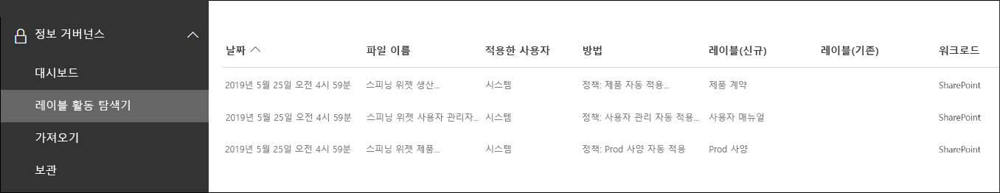

# <a name="manage-the-lifecycle-of-sharepoint-documents-with-retention-labels"></a><span data-ttu-id="83405-104">보존 레이블을 사용하여 SharePoint 문서의 수명 주기 관리</span><span class="sxs-lookup"><span data-stu-id="83405-104">Manage the lifecycle of SharePoint documents with retention labels</span></span>

><span data-ttu-id="83405-105">*[보안 및 규정 준수를 위한 Microsoft 365 라이선싱 지침](https://aka.ms/ComplianceSD)*</span><span class="sxs-lookup"><span data-stu-id="83405-105">*[Microsoft 365 licensing guidance for security & compliance](https://aka.ms/ComplianceSD).*</span></span>

<span data-ttu-id="83405-106">이 문서에서는 보존 레이블을 사용하고, 레이블을 자동으로 적용하며, 이벤트 기반 보존을 구성하여 SharePoint Online에 저장된 제품 관련 문서의 수명주기를 관리하는 방법에 대해 설명합니다.</span><span class="sxs-lookup"><span data-stu-id="83405-106">This article describes how you can manage the lifecycle of product-related documents stored in SharePoint Online by using retention labels, and specifically by auto-applying labels and configuring event-based retention.</span></span> <span data-ttu-id="83405-107">자동 적용 기능은 SharePoint 메타 데이터를 사용하여 문서 분류를 활용합니다.</span><span class="sxs-lookup"><span data-stu-id="83405-107">The auto-apply functionality leverages document classification by the use of SharePoint metadata.</span></span> <span data-ttu-id="83405-108">이 문서의 시나리오는 제품 관련 문서를 기반으로 하지만 다른 시나리오에도 동일한 개념을 사용할 수 있습니다.</span><span class="sxs-lookup"><span data-stu-id="83405-108">The scenario in this article is based on product-related documents, but the same concepts can be used for other scenarios.</span></span> <span data-ttu-id="83405-109">예를 들어 석유 및 가스 산업에서는 석유 플랫폼, 석유정 로그 또는 생산 라이선스와 같은 물리적 자산과 관련된 문서의 수명주기를 관리할 수 있습니다.</span><span class="sxs-lookup"><span data-stu-id="83405-109">For example, in the oil and gas industry, you could manage the lifecycle of documents related to physical assets such as oil platforms, well logs, or production licenses.</span></span> <span data-ttu-id="83405-110">금융 서비스 산업에서는 은행 계좌, 모기지 또는 보험 계약과 관련된 문서를 관리할 수 있습니다.</span><span class="sxs-lookup"><span data-stu-id="83405-110">In the financial services industry, you can manage documents related to bank accounts, mortgages, or insurance contracts.</span></span> <span data-ttu-id="83405-111">공공 부문에서는 건설 허가 또는 세금 양식과 관련된 문서를 관리할 수 있습니다.</span><span class="sxs-lookup"><span data-stu-id="83405-111">In the public sector, you can manage documents related to construction permits or tax forms.</span></span>

<span data-ttu-id="83405-112">이 문서의 시나리오에 대해 살펴보겠습니다.</span><span class="sxs-lookup"><span data-stu-id="83405-112">Let's look at the scenario for this article.</span></span> <span data-ttu-id="83405-113">정보 아키텍처와 보존 레이블의 정의에 대해 살펴보겠습니다.</span><span class="sxs-lookup"><span data-stu-id="83405-113">We'll look at the information architecture and the definition of the retention labels.</span></span> <span data-ttu-id="83405-114">그런 다음 레이블을 자동으로 적용하여 문서를 분류하고 마지막으로 보존 기간 시작을 실행하는 이벤트를 생성하는 방법을 살펴보겠습니다.</span><span class="sxs-lookup"><span data-stu-id="83405-114">Then we'll look at classifying documents by auto-applying the labels, and finally generating the events that initiate the start of the retention period.</span></span>

## <a name="information-architecture"></a><span data-ttu-id="83405-115">정보 아키텍처</span><span class="sxs-lookup"><span data-stu-id="83405-115">Information architecture</span></span>

<span data-ttu-id="83405-116">이 문서의 시나리오는 SharePoint Online을 사용하여 회사가 개발하는 제품과 관련된 모든 문서를 저장하는 제조 회사를 기준으로 합니다.</span><span class="sxs-lookup"><span data-stu-id="83405-116">The scenario for this article is based on a manufacturing company that uses SharePoint Online to store all the documents related to the products the company develops.</span></span> <span data-ttu-id="83405-117">이러한 문서에는 제품 사양, 공급자와의 계약 및 사용자 매뉴얼이 포함됩니다.</span><span class="sxs-lookup"><span data-stu-id="83405-117">These documents include product specifications, agreements with suppliers, and user manuals.</span></span> <span data-ttu-id="83405-118">엔터프라이즈 콘텐츠 관리 정책의 일부로 SharePoint에 이러한 문서를 저장하는 경우, 문서 메타 데이터를 정의하고 사용하여 분류할 수 있습니다.</span><span class="sxs-lookup"><span data-stu-id="83405-118">When these documents are stored in SharePoint as part of the Enterprise Content Management policies, document metadata is defined and used to classify them.</span></span> <span data-ttu-id="83405-119">각 문서에는 다음과 같은 메타 데이터 속성이 있습니다.</span><span class="sxs-lookup"><span data-stu-id="83405-119">Each document has the following metadata properties:</span></span>

- <span data-ttu-id="83405-120">**문서 유형** (예 : 제품 사양, 계약 및 사용자 매뉴얼)</span><span class="sxs-lookup"><span data-stu-id="83405-120">**Doc Type** (such as product specification, agreement, and user manual)</span></span>

- <span data-ttu-id="83405-121">**제품 이름**</span><span class="sxs-lookup"><span data-stu-id="83405-121">**Product Name**</span></span>

- <span data-ttu-id="83405-122">**상태** (초안 또는 최종)</span><span class="sxs-lookup"><span data-stu-id="83405-122">**Status** (draft or final)</span></span>

<span data-ttu-id="83405-123">이 메타 데이터는 모든 문서에 대해 **생산 문서**라는 기본 콘텐츠 유형을 형성합니다.</span><span class="sxs-lookup"><span data-stu-id="83405-123">This metadata forms the base content type called **Production Document** for all documents.</span></span>


> [!NOTE]
> <span data-ttu-id="83405-125">**문서 유형** 및 **상태** 속성은 시나리오의 뒷부분에 나오는 보존 정책에서 보존 레이블을 분류하고 자동 적용하는 데 사용됩니다.</span><span class="sxs-lookup"><span data-stu-id="83405-125">The **Doc Type** and **Status** properties are used by retention policies later in the scenario to classify and auto-apply retention labels.</span></span>

<span data-ttu-id="83405-126">다양한 유형의 문서를 나타내는 몇 가지 콘텐츠 유형이 있을 수 있지만 제품 문서에 중점을 두겠습니다.</span><span class="sxs-lookup"><span data-stu-id="83405-126">We can have several content types that represent different types of documents, but let's focus on the Product Documentation.</span></span>

<span data-ttu-id="83405-127">이 시나리오에서는 관리되는 메타 데이터 서비스 및 용어 저장소를 사용하여 **문서 유형**에 대한 용어 집합과 **제품 이름**에 대한 용어 집합을 만듭니다.</span><span class="sxs-lookup"><span data-stu-id="83405-127">In this scenario, we use the Managed Metadata service and the Term store to create a term set for **Doc Type** and another one for **Product Name**.</span></span> <span data-ttu-id="83405-128">각 용어 집합에 대해 각 값에 대한 용어를 만듭니다.</span><span class="sxs-lookup"><span data-stu-id="83405-128">For each term set, we create a term for each value.</span></span> <span data-ttu-id="83405-129">SharePoint 조직의 용어 저장소에 다음과 같이 표시됩니다.</span><span class="sxs-lookup"><span data-stu-id="83405-129">It would look like something like this in Term store for your SharePoint organization:</span></span>


<span data-ttu-id="83405-131">콘텐츠 유형은 [콘텐츠 유형 허브](https://support.office.com/article/manage-content-type-publishing-06f39ac0-5576-4b68-abbc-82b68334889b)를 사용하여 작성하고 게시할 수 있습니다.</span><span class="sxs-lookup"><span data-stu-id="83405-131">Content Type can be created and published using the [Content Type Hub](https://support.office.com/article/manage-content-type-publishing-06f39ac0-5576-4b68-abbc-82b68334889b).</span></span> <span data-ttu-id="83405-132">콘텐츠 유형은 또한 [PnP 프로비저닝 프레임워크](https://docs.microsoft.com/sharepoint/dev/solution-guidance/pnp-provisioning-framework) 또는 [사이트 디자인 JSON 스키마](https://docs.microsoft.com/sharepoint/dev/declarative-customization/site-design-json-schema#define-a-new-content-type)와 같은 사이트 제공 도구를 사용하여 만들고 게시할 수도 있습니다.</span><span class="sxs-lookup"><span data-stu-id="83405-132">A content type can also be created and published using site provisioning tools such as the [PnP provisioning framework](https://docs.microsoft.com/sharepoint/dev/solution-guidance/pnp-provisioning-framework) or the [site design JSON schema](https://docs.microsoft.com/sharepoint/dev/declarative-customization/site-design-json-schema#define-a-new-content-type).</span></span>

<span data-ttu-id="83405-133">각 제품에는 하나의 문서 라이브러리가 포함된 전용 SharePoint Online 사이트가 있으며 올바른 콘텐츠 유형이 활성화되어 있습니다.</span><span class="sxs-lookup"><span data-stu-id="83405-133">Each product has a dedicated SharePoint Online site that contains one document library, with the right content types enabled.</span></span> <span data-ttu-id="83405-134">모든 문서는 이 문서 라이브러리에 저장됩니다.</span><span class="sxs-lookup"><span data-stu-id="83405-134">All documents are stored in this document library.</span></span>


> [!NOTE]
> <span data-ttu-id="83405-136">이 시나리오의 제조 회사는 제품별로 SharePoint Online 사이트를 보유하는 대신 지속적인 채팅과 같은 팀 구성원과의 공동 작업을 지원하는 팀 단위의 제품 별 Microsoft Team을 사용하고 문서 관리를 위해 팀의 **파일** 탭을 사용할 수 있습니다.</span><span class="sxs-lookup"><span data-stu-id="83405-136">Instead of having a SharePoint Online site per product, the manufacturing company in this scenario could use a Microsoft Team per product that would support collaboration with members of the team, such as persistent chat and use the **Files** tab in the team for document management.</span></span> <span data-ttu-id="83405-137">이 문서에서는 단지 문서에만 중점을 두므로 사이트만 사용하겠습니다.</span><span class="sxs-lookup"><span data-stu-id="83405-137">In this article we only focus on documents, therefore we will only use a site.</span></span>

<span data-ttu-id="83405-138">다음은 스피닝 위젯 제품의 문서 라이브러리 보기입니다.</span><span class="sxs-lookup"><span data-stu-id="83405-138">Here's a view of the document library for the Spinning Widget product:</span></span>


<span data-ttu-id="83405-140">이제 문서 관리를 위한 기본 정보 아키텍처가 준비되었으므로 메타 데이터 및 문서 분류를 사용하는 문서의 보존 및 폐기 전략을 살펴보겠습니다.</span><span class="sxs-lookup"><span data-stu-id="83405-140">Now that we have the basic information architecture in place for document management, let's look at the retention and disposal strategy of the documents that use the metadata and classification of documents.</span></span>

## <a name="retention-and-disposition"></a><span data-ttu-id="83405-141">보존 및 폐기</span><span class="sxs-lookup"><span data-stu-id="83405-141">Retention and disposition</span></span>

<span data-ttu-id="83405-142">제조 회사의 규정 준수 및 데이터 거버넌스 정책에 따라 데이터 보존 및 폐기 방법이 결정됩니다.</span><span class="sxs-lookup"><span data-stu-id="83405-142">The manufacturing company's compliance and data governance policies dictate the way data is preserved and disposed of.</span></span> <span data-ttu-id="83405-143">제품 관련 문서는 제품이 제조되는 동안 및 그 이후 일정 기간동안 보관해야합니다.</span><span class="sxs-lookup"><span data-stu-id="83405-143">Product-related documents must be kept for as long as the product is manufactured, and for a certain period after that.</span></span> <span data-ttu-id="83405-144">이 기간은 제품 사양, 계약 및 사용자 매뉴얼에 따라 다릅니다.</span><span class="sxs-lookup"><span data-stu-id="83405-144">This period is different for product specifications, agreements, and user manuals.</span></span> <span data-ttu-id="83405-145">다음 표는 보존 및 폐기 요구 사항을 나타냅니다.</span><span class="sxs-lookup"><span data-stu-id="83405-145">The following table indicates the retention and disposition requirements:</span></span>

| <span data-ttu-id="83405-146">**문서 유형**</span><span class="sxs-lookup"><span data-stu-id="83405-146">**Document type**</span></span>          | <span data-ttu-id="83405-147">**보존**</span><span class="sxs-lookup"><span data-stu-id="83405-147">**Retention**</span></span>                          | <span data-ttu-id="83405-148">**폐기**</span><span class="sxs-lookup"><span data-stu-id="83405-148">**Disposition**</span></span>                              |
| -------------------------- | -------------------------------------- | -------------------------------------------- |
| <span data-ttu-id="83405-149">제품 사양</span><span class="sxs-lookup"><span data-stu-id="83405-149">Product specification</span></span>      | <span data-ttu-id="83405-150">생산 중단 이후 5년</span><span class="sxs-lookup"><span data-stu-id="83405-150">5 years after cessation of production</span></span>  | <span data-ttu-id="83405-151">삭제</span><span class="sxs-lookup"><span data-stu-id="83405-151">Delete</span></span>                                       |
| <span data-ttu-id="83405-152">제품 계약</span><span class="sxs-lookup"><span data-stu-id="83405-152">Product agreement</span></span>          | <span data-ttu-id="83405-153">생산 중단 이후 10년</span><span class="sxs-lookup"><span data-stu-id="83405-153">10 years after cessation of production</span></span> | <span data-ttu-id="83405-154">검토</span><span class="sxs-lookup"><span data-stu-id="83405-154">Review</span></span>                                       |
| <span data-ttu-id="83405-155">사용자 매뉴얼</span><span class="sxs-lookup"><span data-stu-id="83405-155">User manual</span></span>                | <span data-ttu-id="83405-156">생산 중단 이후 5년</span><span class="sxs-lookup"><span data-stu-id="83405-156">5 years after cessation of production</span></span>  | <span data-ttu-id="83405-157">삭제</span><span class="sxs-lookup"><span data-stu-id="83405-157">Delete</span></span>                                       |
| <span data-ttu-id="83405-158">다른 모든 유형의 문서</span><span class="sxs-lookup"><span data-stu-id="83405-158">All other types of documents</span></span> | <span data-ttu-id="83405-159">다른 문서를 적극적으로 보존하지 않음</span><span class="sxs-lookup"><span data-stu-id="83405-159">Don't actively retain other documents</span></span>  | <span data-ttu-id="83405-160">문서가 3년보다 오래된 경우 삭제<sup>\*</sup></span><span class="sxs-lookup"><span data-stu-id="83405-160">Delete when document is older than 3 years<sup>\*</sup></span></span>  |
|||

> [!NOTE]
> <span data-ttu-id="83405-161"><sup>\*</sup> 지난 3년 동안 수정하지 않은 문서는 3년이 지난 것으로 간주됩니다.</span><span class="sxs-lookup"><span data-stu-id="83405-161"><sup>\*</sup> A document is considered older than 3 years if it hasn't been modified within the last 3 years.</span></span>

<span data-ttu-id="83405-162">보안 및 준수 센터를 사용하여 다음과 같은 보존 레이블을 만듭니다.</span><span class="sxs-lookup"><span data-stu-id="83405-162">Using the security and compliance center, we create the following retention labels:</span></span>

  - <span data-ttu-id="83405-163">제품 사양</span><span class="sxs-lookup"><span data-stu-id="83405-163">Product Specification</span></span>

  - <span data-ttu-id="83405-164">제품 계약</span><span class="sxs-lookup"><span data-stu-id="83405-164">Product Agreement</span></span>

  - <span data-ttu-id="83405-165">사용자 매뉴얼</span><span class="sxs-lookup"><span data-stu-id="83405-165">User Manual</span></span>

<span data-ttu-id="83405-166">이 문서에서는 제품 사양 보존 레이블을 작성하고 자동 적용하는 방법만을 보여줍니다.</span><span class="sxs-lookup"><span data-stu-id="83405-166">In this article, we only show how to create and auto-apply the Product Specification retention label.</span></span> <span data-ttu-id="83405-167">전체 시나리오를 구현 하려면 다른 두 개의 문서 유형에 대한 보존 레이블을 만들어 자동 적용합니다.</span><span class="sxs-lookup"><span data-stu-id="83405-167">To implement the complete scenario, you would create and auto-apply retention labels for the other two document types.</span></span>

### <a name="settings-for-the-product-specification-retention-label"></a><span data-ttu-id="83405-168">제품 사양 보존 레이블 설정</span><span class="sxs-lookup"><span data-stu-id="83405-168">Settings for the Product Specification retention label</span></span>

<span data-ttu-id="83405-169">제품 사양 보존 레이블에 대한 [파일 계획](file-plan-manager.md)은 다음과 같습니다.</span><span class="sxs-lookup"><span data-stu-id="83405-169">Here's the [file plan](file-plan-manager.md) for the Product Specification retention label:</span></span> 

- <span data-ttu-id="83405-170">**이름:** 제품 사양</span><span class="sxs-lookup"><span data-stu-id="83405-170">**Name:** Product Specification</span></span>

- <span data-ttu-id="83405-171">**관리자를 위한 설명:** 제품 사양 레이블, 생산 중단 이후 5년 간 보존, 자동 삭제, 이벤트 기반 보존, 이벤트 유형은 제품 중단입니다.</span><span class="sxs-lookup"><span data-stu-id="83405-171">**Description for admins:** Product Specification Label, retain for five years after cessation of production, auto delete, event-based retention, event type is Product Cessation.</span></span>

- <span data-ttu-id="83405-172">**사용자를 위한 설명:** 생산 중단 이후 5년 간 보존</span><span class="sxs-lookup"><span data-stu-id="83405-172">**Description for users:** Retain for five years after cessation of production.</span></span>

- <span data-ttu-id="83405-173">**보존 작업:** 유지 및 삭제</span><span class="sxs-lookup"><span data-stu-id="83405-173">**Retention action:** Keep and delete</span></span>

- <span data-ttu-id="83405-174">**보존 기간:** 5년 (1,825일)</span><span class="sxs-lookup"><span data-stu-id="83405-174">**Retention duration:** Five years (1825 days)</span></span>

- <span data-ttu-id="83405-175">**레코드 레이블**: 콘텐츠를 [레코드](labels.md#using-retention-labels-for-records-management)로 분류하기 위해 보존 레이블을 구성합니다. (레코드로 분류된 문서는 사용자가 수정하거나 삭제할 수 없음)</span><span class="sxs-lookup"><span data-stu-id="83405-175">**Record label**: Configure the retention label to classify content as a [record](labels.md#using-retention-labels-for-records-management) (documents that are classified as a record can't be modified or deleted by users)</span></span>

- <span data-ttu-id="83405-176">**파일 계획 설명자:** (시나리오 단순화를 위해 파일 설명자가 제공되지 않음)</span><span class="sxs-lookup"><span data-stu-id="83405-176">**File plan descriptors:** (for simplifying the scenario, no file descriptors are provided)</span></span>

<span data-ttu-id="83405-177">다음 스크린샷은 보안 및 준수 센터에서 제품 사양 [보존 레이블](labels.md)을 만들 때의 설정을 보여줍니다.</span><span class="sxs-lookup"><span data-stu-id="83405-177">The following screenshot shows the settings when you create the Product Specification [retention label](labels.md) in the security and compliance center.</span></span> <span data-ttu-id="83405-178">보존 레이블을 만들 때 **제품 중단** 이벤트 유형을 만들 수 있습니다.</span><span class="sxs-lookup"><span data-stu-id="83405-178">You can create the **Product Cessation** event type when you create the retention label.</span></span> <span data-ttu-id="83405-179">아래 단계를 참조하세요.</span><span class="sxs-lookup"><span data-stu-id="83405-179">See the steps below.</span></span>


> [!NOTE]
> <span data-ttu-id="83405-181">실용적인 목적 및 문서가 자동으로 삭제되는 것을 보기 위해 5년 간 기다려야 하는 것을 방지하려면, 테스트 환경에서 이 시나리오를 재작성하는 경우 보존 기간을 1일로 설정합니다.</span><span class="sxs-lookup"><span data-stu-id="83405-181">For the practical purposes and to avoid having to wait 5 years to see a document automatically deleted, set the retention duration to 1 day if you're recreating this scenario in your test environment.</span></span>

### <a name="create-an-event-type-when-creating-a-retention-label"></a><span data-ttu-id="83405-182">보존 레이블을 만들 때 이벤트 유형 만들기</span><span class="sxs-lookup"><span data-stu-id="83405-182">Create an event type when creating a retention label</span></span>

1. <span data-ttu-id="83405-183">드롭다운 목록의 **콘텐츠를 보존 또는 삭제**에서 **이벤트**를 선택합니다.</span><span class="sxs-lookup"><span data-stu-id="83405-183">In the **Retain or delete content based** on dropdown list, select **an event**.</span></span>

2. <span data-ttu-id="83405-184">**이벤트 유형 선택**을 선택합니다.</span><span class="sxs-lookup"><span data-stu-id="83405-184">Select **Choose an event type**.</span></span>

   

3. <span data-ttu-id="83405-186">**이벤트 유형 선택** 페이지에서, **여기에서 새 이벤트 유형을 만들 수 있습니다**를 선택합니다.</span><span class="sxs-lookup"><span data-stu-id="83405-186">On the **Choose an event type** page, select **You can create new event types here**.</span></span>

4. <span data-ttu-id="83405-187">**제품 중단**이라는 이벤트 유형을 만들고 설명을 입력한 후 **완료**를 선택하여 만듭니다.</span><span class="sxs-lookup"><span data-stu-id="83405-187">Create an event type named **Product Cessation**, give a description, and select **Finish** to create it.</span></span> 

5. <span data-ttu-id="83405-188">**이벤트 유형 선택** 페이지로 돌아간 후 사용자가 만든 **제품 중단** 이벤트 유형을 선택한 다음 **추가**를 선택합니다.</span><span class="sxs-lookup"><span data-stu-id="83405-188">Back on the **Choose an event type** page, select the **Product Cessation** event type that you created, and then select **Add**.</span></span>

<span data-ttu-id="83405-189">제품 사양 보존 레이블의 설정은 다음과 같습니다.</span><span class="sxs-lookup"><span data-stu-id="83405-189">Here's what the settings look like for the Product Specification retention label.</span></span> <span data-ttu-id="83405-190">**이 레이블 만들기**를 선택하여 만듭니다.</span><span class="sxs-lookup"><span data-stu-id="83405-190">Select **Create this label** to create it.</span></span>


> [!TIP]
> <span data-ttu-id="83405-192">자세한 단계는 [보존 기간이 이벤트를 기반으로 하는 레이블 만들기](event-driven-retention.md#step-1-create-a-label-whose-retention-period-is-based-on-an-event)를 참조하세요.</span><span class="sxs-lookup"><span data-stu-id="83405-192">For more detailed steps, see [Create a label whose retention period is based on an event](event-driven-retention.md#step-1-create-a-label-whose-retention-period-is-based-on-an-event).</span></span>

<span data-ttu-id="83405-193">이제 보존 레이블을 생성했으므로 보존 레이블을 제품 사양 컨텐츠에 자동 적용하는 방법을 살펴보겠습니다.</span><span class="sxs-lookup"><span data-stu-id="83405-193">Now that the retention label is created, let's look at auto-applying the retention label to product specification content.</span></span>

## <a name="classifying-content-by-auto-applying-retention-labels"></a><span data-ttu-id="83405-194">보존 레이블을 자동 적용하여 콘텐츠 분류</span><span class="sxs-lookup"><span data-stu-id="83405-194">Classifying content by auto-applying retention labels</span></span>

<span data-ttu-id="83405-195">KQL (키워드 쿼리 언어)을 사용하여 이 시나리오를 위해 만든 보존 레이블을 [자동 적용](labels.md#applying-a-retention-label-automatically-based-on-conditions)합니다.</span><span class="sxs-lookup"><span data-stu-id="83405-195">We're going to [auto-apply](labels.md#applying-a-retention-label-automatically-based-on-conditions) the retention labels that we've created for this scenario by using Keyword Query Language (KQL).</span></span> <span data-ttu-id="83405-196">KQL은 검색 쿼리를 작성하는 데 사용되는 언어입니다.</span><span class="sxs-lookup"><span data-stu-id="83405-196">KQL is the language used to build search queries.</span></span> <span data-ttu-id="83405-197">KQL에서는 키워드 또는 관리 속성을 사용하여 검색할 수 있습니다.</span><span class="sxs-lookup"><span data-stu-id="83405-197">In KQL, you can search by using keywords or managed properties.</span></span> <span data-ttu-id="83405-198">KQL에 대한 자세한 내용은 <https://docs.microsoft.com/sharepoint/dev/general-development/keyword-query-language-kql-syntax-reference>을 참조하세요.</span><span class="sxs-lookup"><span data-stu-id="83405-198">For more information about KQL, see <https://docs.microsoft.com/sharepoint/dev/general-development/keyword-query-language-kql-syntax-reference></span></span>

<span data-ttu-id="83405-199">개략적으로 Microsoft 365에 "**최종** **상태** 및 **문서 유형**이 **제품 사양**인 모든 문서에 **제품 사양** 보존 레이블을 적용"하라고 주문하고 싶습니다.</span><span class="sxs-lookup"><span data-stu-id="83405-199">At a high level, we want to tell Microsoft 365 to "apply the **Product Specification** retention label to all documents that have a **Status** of **Final** and a **Doc Type** of **Product Specification**.</span></span> <span data-ttu-id="83405-200">**상태** 및 **문서 유형**은 [정보 아키텍처](#information-architecture) 섹션에서 제품 문서 콘텐츠 유형에 대해 이전에 정의했던 사이트 열입니다.</span><span class="sxs-lookup"><span data-stu-id="83405-200">Recall that **Status** and **Doc Type** are the site columns we previously defined for Product Documentation content type in the [Information architecture](#information-architecture) section.</span></span> <span data-ttu-id="83405-201">이를 위해서는 검색 스키마를 구성해야 합니다.</span><span class="sxs-lookup"><span data-stu-id="83405-201">To achieve this, we need to configure the search schema.</span></span>

<span data-ttu-id="83405-202">SharePoint는 콘텐츠를 인덱싱할 때 각 사이트 열에 대해 크롤링된 속성을 자동으로 생성합니다.</span><span class="sxs-lookup"><span data-stu-id="83405-202">When SharePoint indexes content, it automatically generates crawled properties for each site column.</span></span> <span data-ttu-id="83405-203">이 시나리오에서 우리는 **문서 종류** 및 **상태** 속성에 관심이 있습니다.</span><span class="sxs-lookup"><span data-stu-id="83405-203">For this scenario, we're interested in the **Doc Type** and **Status** properties.</span></span> <span data-ttu-id="83405-204">검색시 크롤링된 속성을 만들려면 올바른 콘텐츠 유형을 사용하는 라이브러리에 문서가 필요하고, 또한 사이트 열이 채워져 있어야합니다.</span><span class="sxs-lookup"><span data-stu-id="83405-204">We need documents in the library using the right content type and have the site columns filled in, in order for search to create the crawled properties.</span></span>

<span data-ttu-id="83405-205">SharePoint 관리 센터에서 검색 구성을 열고 **검색 스키마 관리**를 선택하여 크롤링된 속성을 확인하고 이를 구성할 수 있습니다.</span><span class="sxs-lookup"><span data-stu-id="83405-205">In the SharePoint admin center, we can open the Search configuration, and select **Manage Search Schema** to view and configure the crawled properties.</span></span>


<span data-ttu-id="83405-207">**크롤링된 속성** 상자에 **상태**를 입력하고 녹색 화살표를 선택하면 다음과 같은 결과가 표시됩니다.</span><span class="sxs-lookup"><span data-stu-id="83405-207">If we type **status** in the **Crawled properties** box, and select the green arrow, we should see a result like this:</span></span>


<span data-ttu-id="83405-209">우리가 관심을 가지고 있는 속성은 **ows\_\_상태** (이중 밑줄에 주목)입니다.</span><span class="sxs-lookup"><span data-stu-id="83405-209">The property **ows\_\_Status** (notice the double underscore) is the one that interests us.</span></span> <span data-ttu-id="83405-210">이는 생산 문서 콘텐츠 유형의 **상태** 속성에 매핑됩니다.</span><span class="sxs-lookup"><span data-stu-id="83405-210">This maps to the **Status** property of the Production Document content type.</span></span>

<span data-ttu-id="83405-211">이제 **ows\_문서**를 입력하고 녹색 화살표를 선택하면 다음과 같이 표시됩니다.</span><span class="sxs-lookup"><span data-stu-id="83405-211">Now if we type **ows\_doc** and select the green arrow we should see something like this:</span></span>


<span data-ttu-id="83405-213">**ows\_문서\_x0020\_유형** 속성은 우리가 관심있는 두 번째 속성입니다.</span><span class="sxs-lookup"><span data-stu-id="83405-213">The property **ows\_Doc\_x0020\_Type** is the second property that interests us.</span></span> <span data-ttu-id="83405-214">이는 프로덕션 문서 콘텐츠 유형의 **문서 유형** 특성에 맵핑됩니다.</span><span class="sxs-lookup"><span data-stu-id="83405-214">This maps to the **Doc Type** property of the Production Document content type.</span></span>

> [!TIP]
> <span data-ttu-id="83405-215">이 시나리오의 크롤링된 속성 이름을 확인하려면 생산 문서가 포함된 문서 라이브러리로 이동한 다음 라이브러리 설정으로 이동합니다.</span><span class="sxs-lookup"><span data-stu-id="83405-215">To identify the name of a crawled property for this scenario, go the document library that contains the production documents and then go to the library settings.</span></span> <span data-ttu-id="83405-216">**열**에서 열 이름 (예: **상태** 또는 **문서 유형**)을 선택하여 사이트 열 페이지를 엽니다.</span><span class="sxs-lookup"><span data-stu-id="83405-216">In the **Columns**, select the name of the column (for example, **Status** or **Doc Type**) to open the site column page.</span></span> <span data-ttu-id="83405-217">해당 페이지의 URL에서 **필드** 매개 변수에 필드 이름이 포함되어 있습니다.</span><span class="sxs-lookup"><span data-stu-id="83405-217">The **Field** parameter in the URL for that page contains the name of the field.</span></span> <span data-ttu-id="83405-218">"ows_" 접두사가 붙는 필드 이름은 크롤링된 속성의 이름입니다.</span><span class="sxs-lookup"><span data-stu-id="83405-218">This field name, prefixed with "ows_", is the name of the crawled property.</span></span> <span data-ttu-id="83405-219">예를 들어 URL `https://tenantname.sharepoint.com/sites/SpinningWidget/_layouts/15/FldEdit.aspx?List=%7BC38C2F45-3BD6-4C3B-AA3B-EF5DF6B3D172%7D&Field=_Status`은 **ows\_\_상태** 크롤링된 속성에 해당합니다.</span><span class="sxs-lookup"><span data-stu-id="83405-219">For example, the URL `https://tenantname.sharepoint.com/sites/SpinningWidget/_layouts/15/FldEdit.aspx?List=%7BC38C2F45-3BD6-4C3B-AA3B-EF5DF6B3D172%7D&Field=_Status` corresponds to the **ows\_\_Status** crawled property.</span></span>

<span data-ttu-id="83405-220">원하는 크롤링된 속성이 SharePoint 관리 센터의 검색 스키마 관리 섹션에 나타나지 않으면 다음 중 하나일 수 있습니다.</span><span class="sxs-lookup"><span data-stu-id="83405-220">If the crawled properties you're looking for don't appear in the Manage Search Schema section in the SharePoint admin center, it could be for one of the following reasons:</span></span>

- <span data-ttu-id="83405-221">문서가 인덱싱되지 않았습니다.</span><span class="sxs-lookup"><span data-stu-id="83405-221">The documents haven't been indexed.</span></span> <span data-ttu-id="83405-222">문서 라이브러리 설정 > 고급 설정으로 이동하여 라이브러리를 강제로 다시 인덱싱할 수 있습니다.</span><span class="sxs-lookup"><span data-stu-id="83405-222">You can force a re-index of the library by going to Document library settings > Advanced Settings.</span></span>

- <span data-ttu-id="83405-223">문서 라이브러리가 최신 사이트에 있는 경우 SharePoint 관리자도 사이트 모음 관리자인지 확인합니다.</span><span class="sxs-lookup"><span data-stu-id="83405-223">If the document library is in a modern site, make sure that the SharePoint admin is also a site collection admin.</span></span>

<span data-ttu-id="83405-224">크롤링된 속성과 관리 속성에 대한 자세한 내용은 [SharePoint Server에서 자동으로 작성된 관리 속성](https://docs.microsoft.com/sharepoint/technical-reference/automatically-created-managed-properties-in-sharepoint)을 참조하세요.</span><span class="sxs-lookup"><span data-stu-id="83405-224">For more information about crawled and managed properties, see [Automatically created managed properties in SharePoint Server](https://docs.microsoft.com/sharepoint/technical-reference/automatically-created-managed-properties-in-sharepoint).</span></span>

### <a name="mapping-crawled-properties-to-pre-defined-managed-properties"></a><span data-ttu-id="83405-225">크롤링된 속성을 사전 정의된 관리 속성에 매핑</span><span class="sxs-lookup"><span data-stu-id="83405-225">Mapping crawled properties to pre-defined managed properties</span></span>

<span data-ttu-id="83405-226">KQL은 검색 쿼리에서 크롤링된 속성을 사용할 수 없습니다.</span><span class="sxs-lookup"><span data-stu-id="83405-226">KQL can't use crawled properties in search queries.</span></span> <span data-ttu-id="83405-227">관리 속성을 사용해야 합니다.</span><span class="sxs-lookup"><span data-stu-id="83405-227">It has to use a managed property.</span></span> <span data-ttu-id="83405-228">일반적인 검색 시나리오에서는 관리 속성을 만들어 필요한 크롤링된 속성에 매핑합니다.</span><span class="sxs-lookup"><span data-stu-id="83405-228">In a normal search scenario, we create a managed property and map it to the crawled property that we need.</span></span> <span data-ttu-id="83405-229">그러나 자동 적용된 보존 레이블의 경우 사용자 지정 관리 속성이 아닌 KQL 사전 정의 관리 속성에서만 지정할 수 있습니다.</span><span class="sxs-lookup"><span data-stu-id="83405-229">However, for auto-applying retention labels, you can only specify in KQL pre-defined managed properties and not custom managed properties.</span></span> <span data-ttu-id="83405-230">문자열 RefinableString00에서 RefinableString199까지 사용할 수 있도록 시스템에 이미 사전 정의된 관리 속성 집합이 있습니다.</span><span class="sxs-lookup"><span data-stu-id="83405-230">There's a set of predefined managed properties already created in the system for string RefinableString00 to RefinableString199 that can be used.</span></span> <span data-ttu-id="83405-231">전체 목록은 [기본 미사용 관리 속성](https://docs.microsoft.com/sharepoint/manage-search-schema#default-unused-managed-properties)을 참조하세요.</span><span class="sxs-lookup"><span data-stu-id="83405-231">For a complete list, see [Default unused managed properties](https://docs.microsoft.com/sharepoint/manage-search-schema#default-unused-managed-properties).</span></span> <span data-ttu-id="83405-232">이러한 기본 관리 속성은 일반적으로 검색 구체화를 정의하는 데 사용됩니다.</span><span class="sxs-lookup"><span data-stu-id="83405-232">These default managed properties are typically used for defining search refiners.</span></span>

<span data-ttu-id="83405-233">KQL 쿼리를 사용하여 올바른 보존 레이블을 제품 문서 내용에 자동으로 적용하기 위해 크롤링된 속성 **ows\_문서\_x0020\_유형**과 **ows\_\_상태**를 두 개의 정의 가능한 관리 속성에 맵핑합니다.</span><span class="sxs-lookup"><span data-stu-id="83405-233">For the KQL query to work and automatically apply the correct retention label to product document content, we map the crawled properties **ows\_Doc\_x0020\_Type** and **ows\_\_Status** to two refinable managed properties.</span></span> <span data-ttu-id="83405-234">이 시나리오의 테스트 환경에서는 **RefinableString00** 및 **RefinableString01**은 사용되지 않습니다.</span><span class="sxs-lookup"><span data-stu-id="83405-234">In our test environment for this scenario, **RefinableString00** and **RefinableString01** aren't being used.</span></span> <span data-ttu-id="83405-235">이를 위해 SharePont 관리 센터의 **검색 스키마 관리**에서 **관리 속성**을 살펴보았습니다.</span><span class="sxs-lookup"><span data-stu-id="83405-235">We determined this by looking at **Managed Properties** in the **Manage Search Schema** in the SharePont admin center.</span></span>


<span data-ttu-id="83405-237">이전 스크린 샷의 **매핑된 크롤링 속성** 열이 비어있는 것을 주목하세요.</span><span class="sxs-lookup"><span data-stu-id="83405-237">Notice that the **Mapped Crawled Properties** column in the previous screenshot is empty.</span></span>

<span data-ttu-id="83405-238">**ows\_문서\_x0020\_유형** 크롤링된 속성에 매핑하려면 다음을 실행합니다.</span><span class="sxs-lookup"><span data-stu-id="83405-238">To map the **ows\_Doc\_x0020\_Type** crawled property, do the following:</span></span>

1. <span data-ttu-id="83405-239">**관리 속성** 필터 상자에 **RefinableString00**을 입력하고 녹색 화살표를 선택합니다.</span><span class="sxs-lookup"><span data-stu-id="83405-239">In the **Managed property** filter box, type **RefinableString00** and select the green arrow.</span></span>

2. <span data-ttu-id="83405-240">결과 목록에서 **RefinableString00** 링크를 선택한 다음 아래로 스크롤하여 **크롤링된 속성에 매핑** 섹션으로 이동합니다.</span><span class="sxs-lookup"><span data-stu-id="83405-240">In the results list, select the **RefinableString00** link, and then scroll down to the **Mappings to crawled properties** section.</span></span>  

3. <span data-ttu-id="83405-241">**매핑 추가**를 선택하고 **크롤링된 속성 선택** 창의 **크롤링된 속성 이름 검색** 상자에 **ows\_문서\_x0020\_유형**을 입력합니다.</span><span class="sxs-lookup"><span data-stu-id="83405-241">Select **Add a Mapping**, and then type **ows\_Doc\_x0020\_Type** in the **Search for a crawled property name** box in the **Crawled property selection** window.</span></span> <span data-ttu-id="83405-242">**찾기**를 선택합니다.</span><span class="sxs-lookup"><span data-stu-id="83405-242">Select **Find**.</span></span>  

4. <span data-ttu-id="83405-243">결과 목록에서 **ows\_문서\_x0020\_유형**을 선택한 다음 **확인**을 선택합니다.</span><span class="sxs-lookup"><span data-stu-id="83405-243">In the results list, select **ows\_Doc\_x0020\_Type** and then select **OK**.</span></span>

   <span data-ttu-id="83405-244">**맵핑된 크롤링 속성** 섹션에 다음 스크린샷과 유사한 내용이 표시됩니다.</span><span class="sxs-lookup"><span data-stu-id="83405-244">In the **Mapped Crawled Properties** section, you should see something similar to this screenshot:</span></span>

   

5. <span data-ttu-id="83405-246">페이지 맨 아래로 스크롤하고 **확인**을 선택하여 맵핑을 저장합니다.</span><span class="sxs-lookup"><span data-stu-id="83405-246">Scroll to the bottom of the page and select **OK** to save the mapping.</span></span>

<span data-ttu-id="83405-247">이 절차를 반복하여 RefinableString01과 ows\_\_상태를 맵핑합니다.</span><span class="sxs-lookup"><span data-stu-id="83405-247">Repeat this same procedure to map RefinableString01 and ows\_\_Status.</span></span>

<span data-ttu-id="83405-248">이제 두 개의 크롤링된 속성에 맵핑된 두 가지 관리 속성이 있습니다.</span><span class="sxs-lookup"><span data-stu-id="83405-248">Now you should have two managed properties mapped to the two crawled properties:</span></span>


<span data-ttu-id="83405-250">엔터프라이즈 검색을 실행하여 이 모든 것이 올바르게 설정되었는지 확인하겠습니다.</span><span class="sxs-lookup"><span data-stu-id="83405-250">Let's verify that all this is set up correctly by running an enterprise search.</span></span> <span data-ttu-id="83405-251">브라우저에서 https://yourtenant.sharepoint.com/search로 이동합니다.</span><span class="sxs-lookup"><span data-stu-id="83405-251">In a browser, go to https://yourtenant.sharepoint.com/search.</span></span> <span data-ttu-id="83405-252">검색 상자에 **RefinableString00:"제품 사양"** 을 입력하고 엔터키를 누릅니다.</span><span class="sxs-lookup"><span data-stu-id="83405-252">In the search box, type **RefinableString00:"Product Specification"** and press enter.</span></span> <span data-ttu-id="83405-253">이렇게 하면 제품 사양을 포함하는 모든 문서를 **문서 유형**으로 반환합니다.</span><span class="sxs-lookup"><span data-stu-id="83405-253">This should return all documents that have Product Specification as **Doc Type**.</span></span>

<span data-ttu-id="83405-254">이제 검색 상자에 **RefinableString00:"Product Specification" AND RefinableString01:Final**을 입력하고 엔터키를 누릅니다.</span><span class="sxs-lookup"><span data-stu-id="83405-254">Now in the search box, type **RefinableString00:"Product Specification" AND RefinableString01:Final** and press enter.</span></span> <span data-ttu-id="83405-255">이 경우 제품 사양을 포함하는 모든 문서를 **문서 유형**으로 또한 **최종**상태가 반환됩니다.</span><span class="sxs-lookup"><span data-stu-id="83405-255">This should return all documents that have Product Specification as **Doc Type** and a Status of **Final**.</span></span>

### <a name="creating-the-auto-apply-label-policies"></a><span data-ttu-id="83405-256">자동 적용 레이블 정책 만들기</span><span class="sxs-lookup"><span data-stu-id="83405-256">Creating the auto-apply label policies</span></span>

<span data-ttu-id="83405-257">이제 KQL 쿼리가 올바르게 작동하는지 확인했으므로 KQL 쿼리를 사용하여 제품 사양 보존 레이블을 해당 문서에 자동으로 적용하는 레이블 정책을 작성하겠습니다.</span><span class="sxs-lookup"><span data-stu-id="83405-257">Now that we verified that the KQL query is working correctly, let's create the label policy that uses a KQL query to auto-apply the Product Specification retention label to the appropriate documents.</span></span>

1. <span data-ttu-id="83405-258">[보안 및 준수 센터](https://protection.office.com)에서 **분류** > **보존 레이블**로 이동한 다음 **레이블 자동 적용**을 선택합니다.</span><span class="sxs-lookup"><span data-stu-id="83405-258">In the [security and compliance center](https://protection.office.com), go to **Classification** > **Retention labels**, and then select **Auto-apply a label**.</span></span> 

   

2. <span data-ttu-id="83405-260">**자동 적용할 레이블 선택** 마법사 페이지에서 **자동 적용할 레이블 선택**을 선택합니다.</span><span class="sxs-lookup"><span data-stu-id="83405-260">On the **Choose a label to auto-apply** wizard page, select **Choose a label to auto-apply**.</span></span>

3. <span data-ttu-id="83405-261">레이블 목록에서 **제품 사양**을 선택하고 **추가**를 선택한 후 **다음**을 선택합니다.</span><span class="sxs-lookup"><span data-stu-id="83405-261">In the list of labels, select **Product Specification**, select **Add**, and then select **Next**.</span></span>

4. <span data-ttu-id="83405-262">**특정 단어나 구를 포함하는 콘텐츠에 레이블 적용**을 선택한 후 **다음**을 선택합니다.</span><span class="sxs-lookup"><span data-stu-id="83405-262">Select **Apply label to content that contains specific words or phrases, or properties**, and then select **Next**.</span></span>

   

   <span data-ttu-id="83405-264">다음 단계에서는 이전 섹션에서 테스트한 것과 동일한 KQL 검색 쿼리를 제공합니다.</span><span class="sxs-lookup"><span data-stu-id="83405-264">In the next step, you will provide the same KQL search query that we tested in the previous section.</span></span> <span data-ttu-id="83405-265">기억 하시겠지만, 이 쿼리는 최종 상태인 모든 제품 사양 문서를 반환했습니다.</span><span class="sxs-lookup"><span data-stu-id="83405-265">As you recall, this query returned all Product Specification documents that have a status of Final.</span></span> <span data-ttu-id="83405-266">레이블 정책에서 이와 동일한 쿼리를 사용하면 제품 사양 보존 레이블이 해당 검색 쿼리와 일치하는 모든 문서에 자동으로 적용됩니다.</span><span class="sxs-lookup"><span data-stu-id="83405-266">The result of using this same query in the label policy means that the Product Specification retention label will be automatically applied to all documents that match this search query.</span></span>

5. <span data-ttu-id="83405-267">**키워드 쿼리 편집기** 상자에서 **RefinableString00:"Product Specification" AND RefinableString01:Final**을 입력하고 **다음**을 선택합니다.</span><span class="sxs-lookup"><span data-stu-id="83405-267">In the **Keyword query editor** box, type **RefinableString00:"Product Specification" AND RefinableString01:Final**, and then select **Next**.</span></span>

   

6. <span data-ttu-id="83405-269">이름(예: **제품 사양 레이블 자동 적용**)과 레이블 정책에 대한 설명(선택 사항)을 입력한 후 **다음**을 선택합니다.</span><span class="sxs-lookup"><span data-stu-id="83405-269">Type a name (for example, **Auto apply Product Specification label**) and an optional description for the label policy, and then select **Next**.</span></span> 

7. <span data-ttu-id="83405-270">**위치 선택** 마법사 페이지에서 정책을 적용하려는 콘텐츠 위치를 선택합니다.</span><span class="sxs-lookup"><span data-stu-id="83405-270">On the **Choose locations** wizard page, you select the content locations that you want to apply the policy to.</span></span> <span data-ttu-id="83405-271">이 시나리오에서는 모든 생산 문서가 SharePoint 문서 라이브러리에만 저장되므로 SharePoint 위치에만 정책을 적용합니다.</span><span class="sxs-lookup"><span data-stu-id="83405-271">For this scenario, we apply the policy only to SharePoint locations because all production documents are stored only in SharePoint document libraries.</span></span> <span data-ttu-id="83405-272">따라서 **직접 특정 위치 선택**을 선택하고 Exchange 전자 메일, OneDrive 계정 및 Microsoft 365 그룹 상태를 해제로 전환한 후 SharePoint 사이트 상태가 설정되어 있는지 확인합니다.</span><span class="sxs-lookup"><span data-stu-id="83405-272">Select **Let me choose specific locations**, toggle the status for Exchange email, OneDrive accounts, and Microsoft 365 Groups to off and make sure the status for SharePoint sites is toggled on.</span></span> 

    

   > [!TIP]
   > <span data-ttu-id="83405-274">정책을 모든 SharePoint 사이트에 적용하는 대신 **사이트 선택**을 선택하여 특정 SharePoint 사이트의 URL을 추가할 수 있습니다.</span><span class="sxs-lookup"><span data-stu-id="83405-274">Instead of applying the policy to all SharePoint sites, you can select **Choose sites** and add the URLs for specific SharePoint sites.</span></span>

8. <span data-ttu-id="83405-275">**다음**을 선택하여 **설정 검토** 페이지를 표시합니다.</span><span class="sxs-lookup"><span data-stu-id="83405-275">Select **Next** to display the **Review your settings** page.</span></span> 

    

9. <span data-ttu-id="83405-277">**자동 적용**을 선택하여 레이블 정책을 만듭니다.</span><span class="sxs-lookup"><span data-stu-id="83405-277">Select **Auto-apply** to create the label policy.</span></span> <span data-ttu-id="83405-278">사용자가 제공한 KQL 검색 쿼리와 일치하는 모든 문서에 제품 사양 레이블을 자동으로 적용하는 데 최대 7일이 걸립니다.</span><span class="sxs-lookup"><span data-stu-id="83405-278">It takes up to seven days to automatically apply the Product Specification label to all documents that match the KQL search query that you provided.</span></span>

### <a name="verifying-the-retention-label-was-automatically-applied"></a><span data-ttu-id="83405-279">보존 레이블이 자동으로 적용되었는지 확인</span><span class="sxs-lookup"><span data-stu-id="83405-279">Verifying the retention label was automatically applied</span></span>

<span data-ttu-id="83405-280">7일 후, 보안 및 준수 센터에서 [레이블 활동 탐색기](view-label-activity-for-documents.md)를 사용하여 앞서 작성한 레이블 정책이 이 시나리오의 보존 레이블을 제품 문서에 자동으로 적용했는지 확인합니다.</span><span class="sxs-lookup"><span data-stu-id="83405-280">After seven days, use the [Label activity explorer](view-label-activity-for-documents.md) in the security and compliance center to see that the label policy that we created has automatically applied the retention labels in this scenario to the product documents.</span></span> <span data-ttu-id="83405-281">이 문서에서 이러한 보존 레이블과 레이블 정책 만들기에 대해 설명하지는 않았지만 다음 스크린샷에서 제품 계약과 사용자 매뉴얼에도 보존 레이블이 적용되었음을 알 수 있습니다.</span><span class="sxs-lookup"><span data-stu-id="83405-281">In the following screenshot, retention labels have also been applied to product agreements and user manuals, even though we didn't cover creating those retention labels and label policies in this article.</span></span>



<span data-ttu-id="83405-283">또 다른 확인 단계는 문서 라이브러리의 문서 속성을 확인하는 것입니다.</span><span class="sxs-lookup"><span data-stu-id="83405-283">Another verification step is to look at the properties of the document in the Document Library.</span></span> <span data-ttu-id="83405-284">정보 패널에서 보존 레이블이 선택된 문서에 적용되어 있음을 확인할 수 있습니다.</span><span class="sxs-lookup"><span data-stu-id="83405-284">In the information panel, you can see that the retention label is applied to a selected document.</span></span>


<span data-ttu-id="83405-286">보존 레이블이 문서에 자동으로 적용되었으므로 보존 레이블이 문서를 레코드로 선언하도록 구성되었기 때문에 문서가 삭제되지 않습니다.</span><span class="sxs-lookup"><span data-stu-id="83405-286">Because the retention labels have been auto-applied to documents, the documents are protected from being deleted because the retention label was configured to declare the documents as records.</span></span> <span data-ttu-id="83405-287">이 보호 기능의 예로 이러한 문서 중 하나를 삭제하려고 하면 다음 스크린샷에 표시된 오류 메시지가 나타납니다.</span><span class="sxs-lookup"><span data-stu-id="83405-287">As an example of this protection, we receive an error message shown in the following screenshot when we try to delete one of these documents.</span></span>


## <a name="generating-the-events-that-trigger-the-start-of-the-retention-period"></a><span data-ttu-id="83405-289">보존 기간 시작을 트리거하는 이벤트 생성</span><span class="sxs-lookup"><span data-stu-id="83405-289">Generating the events that trigger the start of the retention period</span></span>

<span data-ttu-id="83405-290">이제 보존 레이블이 자동으로 적용되었으므로 특정 제품의 생산 종료를 나타내는 이벤트에 중점을 두겠습니다.</span><span class="sxs-lookup"><span data-stu-id="83405-290">Now that the retention labels were successfully automatically applied, let's focus on the event that will indicate the end of production for a particular product.</span></span> <span data-ttu-id="83405-291">이 이벤트가 발생하면 문서에 자동으로 적용된 보존 레이블에 정의된 보존 기간의 시작을 트리거합니다.</span><span class="sxs-lookup"><span data-stu-id="83405-291">When this event occurs, it triggers the beginning of the retention period defined in retention labels auto-applied to documents.</span></span> <span data-ttu-id="83405-292">예를 들어 제품 사양 문서의 경우 "생산 종료" 이벤트가 트리거되면 5년의 보존 기간이 시작됩니다.</span><span class="sxs-lookup"><span data-stu-id="83405-292">For example, for product specification documents, the five-year retention period begins when the "end of production" event is triggered.</span></span>

<span data-ttu-id="83405-293">**레코드 관리** > **이벤트**로 이동하여 이벤트 유형을 선택한 후 올바른 자산 ID를 설정하고 이벤트 날짜를 입력하여 보안 및 준수 센터에서 이벤트를 수동으로 만들 수 있습니다.</span><span class="sxs-lookup"><span data-stu-id="83405-293">You can manually create the event in the security and compliance center by going to **Records Managements** > **Events** and choosing the event type, setting the correct Asset Ids, and entering a date for the event.</span></span> <span data-ttu-id="83405-294">자세한 내용은 [이벤트 기반 보존의 개요](event-driven-retention.md)를 참조하세요.</span><span class="sxs-lookup"><span data-stu-id="83405-294">For more information, see [Overview of event-driven retention](event-driven-retention.md).</span></span>

<span data-ttu-id="83405-295">이 시나리오에서는 외부 생산 시스템에서 이벤트를 생성하여 자동으로 작성합니다.</span><span class="sxs-lookup"><span data-stu-id="83405-295">For this scenario, we'll automatically create the event by generating it from an external production system.</span></span> <span data-ttu-id="83405-296">이 경우 이벤트를 생성하는 시스템은 제품이 생산 중인지 여부를 나타내는 간단한 SharePoint 목록 및 그과 관련된 [Microsoft Flow](https://docs.microsoft.com/flow/getting-started)이며, 이것이 이벤트를 트리거합니다.</span><span class="sxs-lookup"><span data-stu-id="83405-296">In this case, the system that generates the event is a simple SharePoint list that indicates whether a product is in production and a [Microsoft Flow](https://docs.microsoft.com/flow/getting-started) that's associated with the list and will trigger the event.</span></span> <span data-ttu-id="83405-297">실제 시나리오에서는 HR 또는 CRM 시스템과 같이 이벤트를 생성하는 모든 시스템이 될 수 있습니다.</span><span class="sxs-lookup"><span data-stu-id="83405-297">In a real-world scenario, it could be any system that generates the event, such as an HR or CRM system.</span></span> <span data-ttu-id="83405-298">Flow에는 Exchange, SharePoint, Teams 및 Dynamics 365와 같은 Microsoft 365 워크로드뿐만 아니라 Twitter, Box, Salesforce 및 Workdays와 같은 타사 앱을 위한 다양하고 즉시 사용 가능한 상호 작용 및 구성 요소가 포함되어 있습니다.</span><span class="sxs-lookup"><span data-stu-id="83405-298">Flow contains many ready-to-use interactions and building block for Microsoft 365 workloads such as Exchange, SharePoint, Teams, and Dynamics 365, and third-party apps such as Twitter, Box, Salesforce, and Workdays.</span></span> <span data-ttu-id="83405-299">따라서 Flow를 이러한 시스템과 쉽게 통합할 수 있습니다.</span><span class="sxs-lookup"><span data-stu-id="83405-299">This makes it easy to integrate Flow with these systems.</span></span> <span data-ttu-id="83405-300">자세한 내용은 [이벤트 기반 보존의 자동화](automate-event-driven-retention.md)를 참조하세요.</span><span class="sxs-lookup"><span data-stu-id="83405-300">For more information, see [Automate event-driven retention](automate-event-driven-retention.md).</span></span>

<span data-ttu-id="83405-301">다음 스크린샷은 이벤트를 트리거하는 데 사용되는 SharePoint 목록을 보여줍니다.</span><span class="sxs-lookup"><span data-stu-id="83405-301">The following screenshot shows the SharePoint list that will be used the trigger the event:</span></span> 


<span data-ttu-id="83405-303">현재 생산중인 두 가지 제품이 있으며 **생산 중** 열에 **예** 값으로 표시됩니다.</span><span class="sxs-lookup"><span data-stu-id="83405-303">There are two products currently in production, which is indicated by the value of **Yes** in the **In Production** column.</span></span> <span data-ttu-id="83405-304">이 열의 값을 제품에 대해 **아니요**로 설정하면 목록과 관련된 흐름에서 자동으로 이벤트를 생성합니다.</span><span class="sxs-lookup"><span data-stu-id="83405-304">When the value in this column is set to **No** for a product, the flow associated with the list will automatically generate the event.</span></span> <span data-ttu-id="83405-305">그러면 해당 제품 문서에 자동으로 적용된 보존 레이블의 보존 기간 시작이 트리거됩니다.</span><span class="sxs-lookup"><span data-stu-id="83405-305">This in turn triggers the start of the retention period for the retention label that was auto-applied to the corresponding product documents.</span></span>

<span data-ttu-id="83405-306">이 시나리오에서는 다음 흐름을 사용하여 이벤트를 트리거합니다.</span><span class="sxs-lookup"><span data-stu-id="83405-306">For this scenario, we use the following flow to trigger the event:</span></span>


<span data-ttu-id="83405-308">이 흐름을 만들려면 SharePoint 커넥터에서 시작하여 **항목을 만들거나 수정할 때** 트리거를 선택합니다.</span><span class="sxs-lookup"><span data-stu-id="83405-308">To create this flow, start from a SharePoint connector and select the **When an item is created or modified** trigger.</span></span> <span data-ttu-id="83405-309">사이트 주소와 목록 이름을 지정한 다음 **생산 중** 목록 열 값이 **아니오**로 설정되는 경우를 기준으로 조건을 추가합니다 (또는 조건 카드에서 false와 같은 경우).</span><span class="sxs-lookup"><span data-stu-id="83405-309">Specify the site address and list name, and then add a condition based on when the **In Production** list column value is set to **No** (or equal to false in the condition card).</span></span> <span data-ttu-id="83405-310">그런 다음 기본 제공 HTTP 서식 파일을 기반으로 하는 작업을 추가합니다.</span><span class="sxs-lookup"><span data-stu-id="83405-310">Then add an action based on the built-in HTTP template.</span></span> <span data-ttu-id="83405-311">다음 섹션의 값을 사용하여 HTTP 작업을 구성합니다.</span><span class="sxs-lookup"><span data-stu-id="83405-311">Use the values in the following section to configure the HTTP action.</span></span> <span data-ttu-id="83405-312">아래 섹션에서 URI와 Body 속성의 값을 복사하여 서식 파일에 붙여넣을 수 있습니다.</span><span class="sxs-lookup"><span data-stu-id="83405-312">You can copy the values for the URI and Body properties from the section below and then paste them into the template.</span></span>

- <span data-ttu-id="83405-313">**메서드**: POST</span><span class="sxs-lookup"><span data-stu-id="83405-313">**Method**: POST</span></span>
- <span data-ttu-id="83405-314">**URI**: https://ps.compliance.protection.outlook.com/psws/service.svc/ComplianceRetentionEvent</span><span class="sxs-lookup"><span data-stu-id="83405-314">**URI**: https://ps.compliance.protection.outlook.com/psws/service.svc/ComplianceRetentionEvent</span></span>
- <span data-ttu-id="83405-315">**헤더**: Key = Content-Type, Value = application/atom+xml</span><span class="sxs-lookup"><span data-stu-id="83405-315">**Headers**: Key = Content-Type, Value = application/atom+xml</span></span>
- <span data-ttu-id="83405-316">**Body**:</span><span class="sxs-lookup"><span data-stu-id="83405-316">**Body**:</span></span>

```HTML
<?xml version='1.0' encoding='utf-8' standalone='yes'>
<entry xmlns:d='https://schemas.microsoft.com/ado/2007/08/dataservices' xmlns:m='https://schemas.microsoft.com/ado/2007/08/dataservices/metadata' xmlns='https://www.w3.org/2005/Atom'>
<category scheme='https://schemas.microsoft.com/ado/2007/08/dataservices/scheme' term='Exchange.ComplianceRetentionEvent'>
<updated>9/9/2017 10:50:00 PM</updated>
<content type='application/xml'>
<m:properties>
<d:Name>Cessation Production @{triggerBody()?['Product_x0020_Name']?['Value']}</d:Name>
<d:EventType>Product Cessation&lt;</d:EventType>
<d:SharePointAssetIdQuery>ProductName:&quot;@{triggerBody()?['Product_x0020_Name']?['Value']}<d:SharePointAssetIdQuery>
<d:EventDateTime>@{formatDateTime(utcNow(),'yyyy-MM-dd')}</d:EventDateTime>
</m:properties>
</content&gt>
</entry>
```

<span data-ttu-id="83405-317">다음 표에서는 이 시나리오에 맞게 구성해야 하는 작업의 *Body* 속성에 포함된 매개 변수를 설명합니다.</span><span class="sxs-lookup"><span data-stu-id="83405-317">The following section describes the parameters within the *Body* property of the action that must be configured specifically for this scenario.</span></span>

- <span data-ttu-id="83405-318">**Name**: 이 매개 변수는 보안 및 규정 준수 센터에서 생성되는 이벤트 이름을 지정합니다.</span><span class="sxs-lookup"><span data-stu-id="83405-318">**Name**: This parameter specifies the name of the event that will be created in the security and compliance center.</span></span> <span data-ttu-id="83405-319">이 시나리오에서, 이름은 "Cessation Production xxx"입니다. 여기서 xxx는 앞에서 만든 ProductName 관리 속성의 값입니다.</span><span class="sxs-lookup"><span data-stu-id="83405-319">For this scenario, the name is "Cessation Production xxx", where xxx is the value of the ProductName managed property that we created earlier.</span></span>
- <span data-ttu-id="83405-320">**EventType**: 이 매개 변수의 값은 생성된 이벤트가 적용되는 이벤트 유형에 해당합니다.</span><span class="sxs-lookup"><span data-stu-id="83405-320">**EventType**: The value for this parameter corresponds to the event type that the created event will apply to.</span></span> <span data-ttu-id="83405-321">이 이벤트 유형은 보존 레이블을 생성할 때 정의되었습니다.</span><span class="sxs-lookup"><span data-stu-id="83405-321">This event type was defined when you created the retention label.</span></span> <span data-ttu-id="83405-322">이 시나리오의 경우 이벤트 유형은 "Product Cessation"입니다.</span><span class="sxs-lookup"><span data-stu-id="83405-322">For this scenario, the event type is "Product Cessation".</span></span>
- <span data-ttu-id="83405-323">**SharePointAssetIdQuery**: 이 매개 변수는 이벤트의 자산 ID를 정의합니다.</span><span class="sxs-lookup"><span data-stu-id="83405-323">**SharePointAssetIdQuery**:This parameter defines the Asset Id for the event.</span></span> <span data-ttu-id="83405-324">이벤트 기반 보존에는 문서에 대한 고유 식별자가 필요합니다.</span><span class="sxs-lookup"><span data-stu-id="83405-324">Event-based retention needs a unique identifier for the document.</span></span> <span data-ttu-id="83405-325">자산 ID를 사용하여 특정 이벤트가 적용 가능한 문서를 식별하거나 이 시나리오에서와 같이 메타데이터 열, 고유한 제품 이름을 사용할 수 있습니다.</span><span class="sxs-lookup"><span data-stu-id="83405-325">We can use Asset Ids to identify the documents that a particular event applies to, or as we do for this scenario, a metadata column, our own Product Name.</span></span> <span data-ttu-id="83405-326">이렇게 하려면 KQL 쿼리에 사용할 수 있는 ProductName이라는 새 관리 속성을 만들어야 합니다 (또는 새 관리 속성을 만드는 대신 RefinableString00을 사용할 수도 있음).</span><span class="sxs-lookup"><span data-stu-id="83405-326">To do  this, we have to create a new managed property named ProductName that can be used in the KQL query (or we could have used RefinableString00 instead of creating a new managed property).</span></span> <span data-ttu-id="83405-327">또한 이 새로운 관리 속성을 ows_Product_x0020_Name 크롤링된 속성에 맵핑해야합니다.</span><span class="sxs-lookup"><span data-stu-id="83405-327">We also need to map this new managed property to the ows_Product_x0020_Name crawled property.</span></span> <span data-ttu-id="83405-328">다음은 이 관리 속성의 스크린샷입니다.</span><span class="sxs-lookup"><span data-stu-id="83405-328">Here's a screenshot of this managed property.</span></span>

    

- <span data-ttu-id="83405-330">**EventDateTime**: 이 매개 변수는 이벤트 발생 날짜를 정의합니다.</span><span class="sxs-lookup"><span data-stu-id="83405-330">**EventDateTime**: This parameter defines the date the event occurs.</span></span> <span data-ttu-id="83405-331">현재 날짜 형식 *formatDateTime(utcNow(),'yyyy-MM-dd'*)을 사용합니다.</span><span class="sxs-lookup"><span data-stu-id="83405-331">Use the current date format: *formatDateTime(utcNow(),'yyyy-MM-dd'*)</span></span>

### <a name="putting-it-all-together"></a><span data-ttu-id="83405-332">모든 항목 요약</span><span class="sxs-lookup"><span data-stu-id="83405-332">Putting it all together</span></span>

<span data-ttu-id="83405-333">이제 보존 레이블이 만들어지고 자동 적용되며 흐름을 구성하고 작성했으므로 제품 목록에서 스피닝 위젯 제품에 대한 **생산 중**열에 있는 값이 **예**에서 **아니요**로 변경될 때 발생하는 상황은 다음과 같습니다.</span><span class="sxs-lookup"><span data-stu-id="83405-333">Now that the retention label is created and auto-applied and the flow is configured and created, here's what happens when the value in the **In Production** column for the Spinning Widget product in the Products list is changed from **Yes** to **No**.</span></span> <span data-ttu-id="83405-334">흐름이 트리거되고 이벤트가 생성됩니다.</span><span class="sxs-lookup"><span data-stu-id="83405-334">The flow is triggered and creates the event.</span></span> <span data-ttu-id="83405-335">보안 및 준수 센터에서 이 이벤트를 보려면 **레코드 관리** > **이벤트**로 이동합니다.</span><span class="sxs-lookup"><span data-stu-id="83405-335">To see this event in the security and compliance center, go to **Records management** > **Events**.</span></span>


<span data-ttu-id="83405-337">이벤트를 선택하여 플라이 아웃 페이지에서 세부 정보를 확인합니다.</span><span class="sxs-lookup"><span data-stu-id="83405-337">Select the event to view the details on the flyout page.</span></span> <span data-ttu-id="83405-338">이벤트를 만든 후에도 이벤트 상태의 세부 정보에는 SharePoint 사이트 또는 문서가 처리되지 않은 것으로 표시됩니다.</span><span class="sxs-lookup"><span data-stu-id="83405-338">Notice that even though the event is created, the details in the event status show that no SharePoint sites or documents have been processed.</span></span>


<span data-ttu-id="83405-340">그러나 일정 시간이 지나면 이벤트 상태 섹션에 SharePoint 사이트 및 SharePoint 문서가 처리된 것으로 표시됩니다.</span><span class="sxs-lookup"><span data-stu-id="83405-340">But after some time, the event status section shows that for a SharePoint site and a SharePoint document have been processed.</span></span>  


 
<span data-ttu-id="83405-342">이는 생산 중단 스피닝 위젯 이벤트의 이벤트 날짜를 기준으로 스피닝 위젯 제품 문서에 적용된 레이블의 보존 기간이 시작되었음을 의미합니다.</span><span class="sxs-lookup"><span data-stu-id="83405-342">This means the retention period for the label applied to the Spinning Widget product document has been initiated, based on the event date of the Cessation Production Spinning Widget event.</span></span> <span data-ttu-id="83405-343">1일 보존 기간을 구성하여 테스트 환경에서 시나리오를 구현한 경우에는 해당 이벤트를 만든 다음 며칠이 지난 후에 제품 문서를 볼 수 있는 문서 라이브러리로 이동하여 문서가 삭제되었는지 확인할 수 있습니다 (SharePoint의 삭제 작업을 실행한 후).</span><span class="sxs-lookup"><span data-stu-id="83405-343">Assuming you implemented the scenario in your test environment by configuring a one-day retention period, you can go to the document library for your product documents a few days after the event was created and verify that the document is deleted (after the deletion job in SharePoint has run).</span></span>

### <a name="more-about-asset-ids"></a><span data-ttu-id="83405-344">자산 ID에 대한 자세한 정보</span><span class="sxs-lookup"><span data-stu-id="83405-344">More about Asset Ids</span></span>

<span data-ttu-id="83405-345">[이벤트 기반 보존 개요](event-driven-retention.md)에서 설명했듯이 이벤트 유형, 레이블, 이벤트 및 자산 ID간의 관계를 이해하는 것이 중요합니다.</span><span class="sxs-lookup"><span data-stu-id="83405-345">As explained in the [overview of event-driven retention](event-driven-retention.md), it's important to understand the relationship between event types, labels, events, and asset Ids.</span></span> <span data-ttu-id="83405-346">자산 ID는 SharePoint 및 OneDrive의 또 다른 문서 속성입니다.</span><span class="sxs-lookup"><span data-stu-id="83405-346">The Asset Id is simply another document property in SharePoint and OneDrive.</span></span> <span data-ttu-id="83405-347">이를 통해 이벤트에 의해 보존 기간이 시작되는 문서를 추가로 식별하는 데 도움이 됩니다.</span><span class="sxs-lookup"><span data-stu-id="83405-347">It helps you to further identify the documents whose retention period will be triggered by the event.</span></span> <span data-ttu-id="83405-348">기본적으로 SharePoint에는 이벤트 기반 보존에 사용할 수 있는 자산 ID 속성이 있습니다.</span><span class="sxs-lookup"><span data-stu-id="83405-348">By default, SharePoint has an Asset Id property that you can use for event-driven retention:</span></span>


<span data-ttu-id="83405-350">다음 스크린샷에 표시된대로 자산 ID 관리 속성을 **ComplianceAssetId**라고 합니다.</span><span class="sxs-lookup"><span data-stu-id="83405-350">As shown in the following screenshot, the Asset Id managed property is called **ComplianceAssetId**.</span></span>


<span data-ttu-id="83405-352">이 시나리오에서와 같이 기본 자산 ID 속성을 사용하는 대신 다른 속성을 사용할 수도 있습니다.</span><span class="sxs-lookup"><span data-stu-id="83405-352">Instead of using the default Asset Id property, you can also use any other property, as we do in this scenario.</span></span> <span data-ttu-id="83405-353">그러나 이벤트에 대해 자산 ID 또는 키워드를 지정하지 않으면 해당 이벤트 유형의 레이블이 있는 모든 콘텐츠가 이벤트에 의해 트리거된 보존 기간을 갖게 됩니다.</span><span class="sxs-lookup"><span data-stu-id="83405-353">But it's important to understand that if you don't specify an asset ID or keywords for an event, all of the content with a label of that event type will have its retention period triggered by the event.</span></span>

### <a name="using-advanced-search-in-sharepoint"></a><span data-ttu-id="83405-354">SharePoint에서 고급 검색 사용</span><span class="sxs-lookup"><span data-stu-id="83405-354">Using advanced search in SharePoint</span></span>

<span data-ttu-id="83405-355">이전 스크린샷에서 **ComplianceTag**라는 보존 레이블과 관련된 다른 관리 속성이 있으며, 이는 크롤링된 속성에 맵핑되어 있음을 확인할 수도 있습니다.</span><span class="sxs-lookup"><span data-stu-id="83405-355">In the previous screenshot, we can also see that there's another managed property related to retention labels called **ComplianceTag** and that it's mapped to a crawled property.</span></span> <span data-ttu-id="83405-356">**ComplianceAssetId** 관리 속성도 크롤링된 속성에 맵핑되어 있습니다.</span><span class="sxs-lookup"><span data-stu-id="83405-356">The **ComplianceAssetId** managed property is also mapped to a crawled property.</span></span> <span data-ttu-id="83405-357">이는 고급 검색에서 이러한 관리 속성을 사용하여 보존 레이블로 태그가 지정된 모든 문서를 검색할 수 있음을 의미합니다.</span><span class="sxs-lookup"><span data-stu-id="83405-357">This means you can use these managed properties in advanced search to retrieve all documents that have been tagged with a retention label.</span></span>

## <a name="summary"></a><span data-ttu-id="83405-358">요약</span><span class="sxs-lookup"><span data-stu-id="83405-358">Summary</span></span>

<span data-ttu-id="83405-359">이 문서에서는 SharePoint의 사이트 열을 기반으로 보존 레이블을 자동으로 적용한 문서 관리 시나리오를 보여줍니다.</span><span class="sxs-lookup"><span data-stu-id="83405-359">This article illustrated a document management scenario where we automatically applied a retention label based on a site column in SharePoint.</span></span> <span data-ttu-id="83405-360">그런 다음 이벤트 기반 보존 및 Microsoft Flow를 사용하여 외부 이벤트를 기반으로 보존 기간 시작을 자동으로 트리거했습니다.</span><span class="sxs-lookup"><span data-stu-id="83405-360">Then we used event-based retention and Microsoft Flow to automatically trigger the start of the retention period based on an external event.</span></span>

## <a name="credits"></a><span data-ttu-id="83405-361">크레딧</span><span class="sxs-lookup"><span data-stu-id="83405-361">Credits</span></span>

<span data-ttu-id="83405-362">이 시나리오의 작성자는 다음과 같습니다.</span><span class="sxs-lookup"><span data-stu-id="83405-362">This scenario was authored by:</span></span> 

<span data-ttu-id="83405-363">Frederic Lapierre</span><span class="sxs-lookup"><span data-stu-id="83405-363">Frederic Lapierre</span></span><br/><span data-ttu-id="83405-364">Principal Consultant, Microsoft Services</span><span class="sxs-lookup"><span data-stu-id="83405-364">Principal Consultant, Microsoft Services</span></span>
