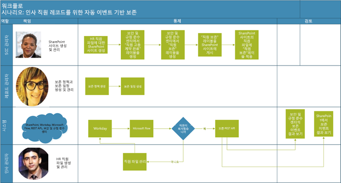
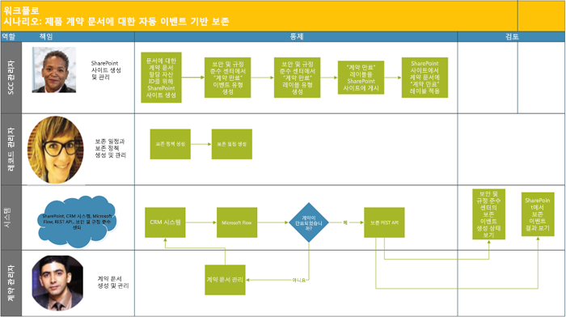

# <a name="automate-event-based-retention"></a><span data-ttu-id="77bae-103">이벤트 기반 보존 자동화</span><span class="sxs-lookup"><span data-stu-id="77bae-103">Automate event-based retention</span></span>

><span data-ttu-id="77bae-104">*[보안 및 규정 준수를 위한 Microsoft 365 라이선싱 지침](https://aka.ms/ComplianceSD)*</span><span class="sxs-lookup"><span data-stu-id="77bae-104">*[Microsoft 365 licensing guidance for security & compliance](https://aka.ms/ComplianceSD).*</span></span>

<span data-ttu-id="77bae-p101">조직의 컨텐츠가 폭발적으로 증가하고 ROT(중복, 구식, 사소)가 될 가능성은 심각한 문제입니다. 법률, 비즈니스 및 규정 준수 문제를 지속적으로 충족하려면 조직은 중요한 정보를 보관하고 보호할 수 있어야하며 관련 정보를 신속하게 찾을 수 있어야 합니다. 중요하고 관련성 있는 정보만 보유하는 것이 조직 성공의 열쇠입니다.</span><span class="sxs-lookup"><span data-stu-id="77bae-p101">The explosion of content in organizations and how it can become ROT (redundant, obsolete, trivial) is serious business. To continue to meet legal, business, and regulatory compliance challenges, organizations must be able to keep and protect important information and quickly find what’s relevant. Retaining only important, pertinent information is key to an organization's success.</span></span>

<span data-ttu-id="77bae-p102">이 요구 사항을 충족하기 위해서 조직에서는 Office 365 보안 및 준수 센터의 보존 솔루션을 활용할 수 있습니다. 보관은 [보존 레이블](labels.md)을 이용하여 시작할 수 있습니다. 보존 레이블에는 [특정 이벤트에 보존 기간을 적용 ](event-driven-retention.md)할 수 있는 옵션이 있습니다. 일반적으로 보존 기간은 콘텐츠의 생성 날짜 또는 최종 수정 날짜와 같은 알려진 날짜를 기반으로 합니다. 그러나 조직에서는 직원이 퇴사한 후 7년이 경과한 경우와 같은 이벤트 발생에 따라 콘텐츠를 삭제해야 합니다.</span><span class="sxs-lookup"><span data-stu-id="77bae-p102">To help meet this need, organizations can take advantage of retention solutions in the Office 365 Security & Compliance Center. Retention can be triggered by using [retention labels](labels.md). A retention label has the option to [base the retention period on a specific event](event-driven-retention.md). Typically, the retention period is based on a known date, such as the creation date or last modified date for the content. However, organizations also have requirements to dispose of content based on the occurrence of an event, such as seven years after an employee leaves an organization.</span></span>

<span data-ttu-id="77bae-p103">규정을 준수하는 콘텐츠 처리를 보장하려면 이벤트 발생시기를 알아야 합니다. 콘텐츠의 양이 급속히 증가함에 따라 콘텐츠를 적시에 적법한 방법으로 보유하고 폐기하는 일이 어려워지고 있습니다.</span><span class="sxs-lookup"><span data-stu-id="77bae-p103">To ensure compliant disposal of content, it's imperative to know when an event takes place. With the volume of content increasing rapidly, it's becoming challenging to retain and dispose content in a timely and compliant manner.</span></span>

<span data-ttu-id="77bae-p104">이벤트 기반 보존은 이 문제점을 해결합니다. 이 항목에서는 Microsoft 365 REST API를 사용하여 이벤트를 통한 보존을 자동화하는 비즈니스 프로세스 흐름을 설정하는 방법에 대해 설명합니다.</span><span class="sxs-lookup"><span data-stu-id="77bae-p104">Event-based retention solves this problem. This topic explains how to set up your business process flows to automate retention through events by using the Microsoft 365 REST API.</span></span>

## <a name="about-event-based-retention"></a><span data-ttu-id="77bae-117">이벤트 기반 보존에 대한 설명</span><span class="sxs-lookup"><span data-stu-id="77bae-117">About event-based retention</span></span>

<span data-ttu-id="77bae-p105">조직의 규모는 크거나 적정하거나 작을 수 있습니다. 일상적으로 생성되고 관리되는 비즈니스 문서, 법률 문서, 직원 파일, 계약서 및 제품 문서의 수는 급격히 증가하고 있습니다.</span><span class="sxs-lookup"><span data-stu-id="77bae-p105">An organization can be small, medium, or large. The number of business documents, legal documents, employee files, contracts, and product documents that get created and managed on a day-to-day basis is increasing dramatically.</span></span>

<span data-ttu-id="77bae-p106">예를 들어, 매일, 수십, 수백 명의 직원이 조직에 가입하고 퇴사합니다. HR 부서에서는 비즈니스 요구 사항에 따라 직원 관련 문서를 계속 작성, 업데이트 또는 삭제합니다. 이 프로세스는 비즈니스에 대해 개괄적으로 명시된 다양한 보존 정책의 적용을 받습니다.</span><span class="sxs-lookup"><span data-stu-id="77bae-p106">For example, each day, tens and hundreds of employees are joining and leaving organizations. The HR department continues to create, update, or delete employee-related documents as per business requirements. This process is subject to the different retention policies outlined for the business:</span></span>

- <span data-ttu-id="77bae-p107">\*\* 컨텐츠 보유 기간은 컨텐츠 작성, 최종 수정 또는 레이블 지정 날짜와 같은 알려진 날짜\*\* 일 수 있습니다. 예를 들어, 문서를 작성한 후 7 년 동안 문서를 보존한 다음 삭제할 수 있습니다.</span><span class="sxs-lookup"><span data-stu-id="77bae-p107">**The period of retention for content can be a known date** such as the date the content was created, last modified, or labeled. For example, you might retain documents for seven years after they're created and then delete them.</span></span>

- <span data-ttu-id="77bae-p108">**콘텐츠 보유 기간은 알 수 없는 날짜가 될 수도 있습니다**. 예를 들어 보존 레이블을 사용하면 직원이 조직을 떠나는 경우와 같이 특정 유형의 이벤트가 발생할 때에 대해 보존 기간을 설정할 수 있습니다.</span><span class="sxs-lookup"><span data-stu-id="77bae-p108">**The period of retention of content can also be an unknown date**. For example, with retention labels, you can also base a retention period on when a specific type of event occurs, such as an employee leaving the organization.</span></span>

<span data-ttu-id="77bae-p109">이벤트가 보유 기간의 시작을 트리거하고 해당 이벤트 유형에 적용된 레이블이 있는 모든 컨텐츠는 레이블의 보유 조치를 받습니다. 이를 이벤트 기반 보존이라고합니다. 자세한 내용은 [이벤트 기반 보존 개요](event-driven-retention.md)를 참조하십시오.</span><span class="sxs-lookup"><span data-stu-id="77bae-p109">The event triggers the start of the retention period, and all content with a label applied for that type of event get the label's retention actions enforced on them. This is called event-based retention. To learn more, see [Overview of event-driven retention](event-driven-retention.md).</span></span>

## <a name="set-up-event-based-retention"></a><span data-ttu-id="77bae-130">이벤트 기반 보존 설정</span><span class="sxs-lookup"><span data-stu-id="77bae-130">Set up event-based retention</span></span>

<span data-ttu-id="77bae-131">이 절에서는 콘텐츠를 보존하기 전에 수행해야 할 작업에 대해 설명합니다.</span><span class="sxs-lookup"><span data-stu-id="77bae-131">This section describes what needs to be done before retaining content.</span></span>

### <a name="identify-roles"></a><span data-ttu-id="77bae-132">역할 확인</span><span class="sxs-lookup"><span data-stu-id="77bae-132">Identify roles</span></span>

<span data-ttu-id="77bae-133">레코드 관리 작업을 수행하고 효과적이고 효율적인 비즈니스 문서 보존을 담당하는 조직 안의 다양한 역할을 식별합니다.</span><span class="sxs-lookup"><span data-stu-id="77bae-133">Identify the different roles in an organization that perform Record Management tasks and would be responsible for effective and efficient retention of business documents.</span></span>

  | <span data-ttu-id="77bae-134">가상 사용자</span><span class="sxs-lookup"><span data-stu-id="77bae-134">Persona</span></span> | <span data-ttu-id="77bae-135">역할</span><span class="sxs-lookup"><span data-stu-id="77bae-135">Role</span></span> |
  | - | - |
  | <span data-ttu-id="77bae-136">관리</span><span class="sxs-lookup"><span data-stu-id="77bae-136">Admin</span></span> | <span data-ttu-id="77bae-137">SharePoint에 보존 이벤트 유형, 보존 레이블 및 레코드 리포지토리를 만듭니다.</span><span class="sxs-lookup"><span data-stu-id="77bae-137">Creates Retention Event types, Retention labels and Record repositories in SharePoint</span></span> |
  | <span data-ttu-id="77bae-138">레코드 관리자</span><span class="sxs-lookup"><span data-stu-id="77bae-138">Records Manager</span></span>                                  | <span data-ttu-id="77bae-139">보존 정책과 보존 일정 지침 및 준수 세부사항을 제공합니다.</span><span class="sxs-lookup"><span data-stu-id="77bae-139">Provides Retention Policies and Retention Schedules guidance and compliance details</span></span>   |
  | <span data-ttu-id="77bae-140">시스템 관리자(회사)</span><span class="sxs-lookup"><span data-stu-id="77bae-140">System Admin (business)</span></span>                          | <span data-ttu-id="77bae-141">Microsoft 365에서 작동하도록 외부 시스템을 설정하고 관리합니다.</span><span class="sxs-lookup"><span data-stu-id="77bae-141">Sets up and manages external systems to work with Microsoft 365</span></span>                       |
  | <span data-ttu-id="77bae-142">정보 근로자</span><span class="sxs-lookup"><span data-stu-id="77bae-142">Information Worker</span></span>                               | <span data-ttu-id="77bae-143">비즈니스 프로세스(HR, 재무, IT 등)의 수명 주기를 관리합니다.</span><span class="sxs-lookup"><span data-stu-id="77bae-143">Manages the lifecycle of their business process (HR, Finance, IT, and so on)</span></span>                 |

### <a name="set-up-the-security--compliance-center"></a><span data-ttu-id="77bae-144">보안 및 준수 센터 설정</span><span class="sxs-lookup"><span data-stu-id="77bae-144">Set up the Security & Compliance Center</span></span>
  
1. <span data-ttu-id="77bae-145">규정 준수 관리자가 이벤트 유형(예 &ndash; 직원 퇴사, 계약 만료 또는 제품 제조 종료)을 만듭니다.</span><span class="sxs-lookup"><span data-stu-id="77bae-145">Compliance admin creates an event type &ndash; for example, Employee Termination or Contract Expiration or End of Product Manufacturing.</span></span> <span data-ttu-id="77bae-146">([이벤트 기반 보존](event-driven-retention.md)의 단계별 프로세스 참조.)</span><span class="sxs-lookup"><span data-stu-id="77bae-146">(See the step-by-step process in [Event-driven retention](event-driven-retention.md).</span></span>
    
2. <span data-ttu-id="77bae-147">규정 준수 관리자가 이벤트를 기반으로 보존 레이블을 만들고 레이블을 이벤트 유형과 연결합니다.</span><span class="sxs-lookup"><span data-stu-id="77bae-147">Compliance admin creates a retention label based on an event and associates the label with an event type.</span></span>
    
    <span data-ttu-id="77bae-148">보존 레이블에 대해 다음과 같이 4종류의 트리거가 있습니다.</span><span class="sxs-lookup"><span data-stu-id="77bae-148">There are four types of triggers for retention labels:</span></span>
            
    1. <span data-ttu-id="77bae-149">만든 날짜</span><span class="sxs-lookup"><span data-stu-id="77bae-149">Create date</span></span>
                
    2. <span data-ttu-id="77bae-150">마지막으로 수정한 날짜</span><span class="sxs-lookup"><span data-stu-id="77bae-150">Last modified</span></span>
                
    3. <span data-ttu-id="77bae-151">레이블 날짜(콘텐츠 레이블이 지정 된 때)</span><span class="sxs-lookup"><span data-stu-id="77bae-151">Label date (when the content was labeled)</span></span>
                
    4. <span data-ttu-id="77bae-152">이벤트 기반</span><span class="sxs-lookup"><span data-stu-id="77bae-152">Event-based</span></span>
    
3. <span data-ttu-id="77bae-153">규정 준수 관리자가 보존 레이블을 게시합니다.</span><span class="sxs-lookup"><span data-stu-id="77bae-153">Compliance admin publishes the retention label.</span></span>

### <a name="set-up-sharepoint"></a><span data-ttu-id="77bae-154">SharePoint 설정</span><span class="sxs-lookup"><span data-stu-id="77bae-154">Set up SharePoint</span></span>
   
<span data-ttu-id="77bae-155">레코드 저장소를 만들기 위해 규정 준수 관리자는 다음 작업을 수행합니다.</span><span class="sxs-lookup"><span data-stu-id="77bae-155">To create a records repository, the compliance admin:</span></span>

1. <span data-ttu-id="77bae-156">SharePoint 사이트를 생성합니다.</span><span class="sxs-lookup"><span data-stu-id="77bae-156">Creates a SharePoint site.</span></span>

2. <span data-ttu-id="77bae-157">다음 중 하나를 수행합니다.</span><span class="sxs-lookup"><span data-stu-id="77bae-157">Does one of the following:</span></span>
        
   - <span data-ttu-id="77bae-p111">SharePoint 라이브러리 만들기: 라이브러리 수준에서 이벤트 기반 레이블을 설정합니다. 자세한 내용은 [ SharePoint 라이브러리, 폴더 또는 문서 집합의 모든 콘텐츠에 기본 보존 레이블 적용](labels.md#applying-a-default-retention-label-to-all-content-in-a-sharepoint-library-folder-or-document-set)을 참조하십시오.</span><span class="sxs-lookup"><span data-stu-id="77bae-p111">Creates a SharePoint library: Set event-based label at the library level. For more information, see [Applying a default retention label to all content in a SharePoint library, folder, or document set](labels.md#applying-a-default-retention-label-to-all-content-in-a-sharepoint-library-folder-or-document-set).</span></span>
          
   - <span data-ttu-id="77bae-160">SharePoint에서 문서 집합을 설정합니다.</span><span class="sxs-lookup"><span data-stu-id="77bae-160">Sets up a document set in SharePoint.</span></span> <span data-ttu-id="77bae-161">자세한 내용은 [문서 집합 소개](https://support.microsoft.com/ko-KR/office/introduction-to-document-sets-3dbcd93e-0bed-46b7-b1ba-b31de2bcd234)를 참조합니다.</span><span class="sxs-lookup"><span data-stu-id="77bae-161">For more information, see [Introduction to document sets](https://support.microsoft.com/ko-KR/office/introduction-to-document-sets-3dbcd93e-0bed-46b7-b1ba-b31de2bcd234).</span></span>
      
3. <span data-ttu-id="77bae-162">각 직원 문서 집합에 자산 ID를 할당합니다.</span><span class="sxs-lookup"><span data-stu-id="77bae-162">Assigns an asset ID to each employee document set.</span></span> <span data-ttu-id="77bae-163">자산 ID는 조직에서 사용하는 제품 이름 또는 코드입니다. 예를 들어 직원 번호는 자산 ID가 될 수 있습니다.</span><span class="sxs-lookup"><span data-stu-id="77bae-163">An asset ID is a product name or code used by the organization, for example, Employee number can be an asset ID.</span></span> <span data-ttu-id="77bae-164">자산 ID를 폴더에 할당하면 해당 폴더에 있는 모든 항목이 자동으로 동일한 자산 ID를 상속합니다.</span><span class="sxs-lookup"><span data-stu-id="77bae-164">By assigning the asset ID to the folder, every item in that folder automatically inherits the same asset ID.</span></span> <span data-ttu-id="77bae-165">즉, 동일한 이벤트로 모든 항목의 보존 기간을 트리거할 수 있습니다.</span><span class="sxs-lookup"><span data-stu-id="77bae-165">This means all the items can have their retention period triggered by the same event.</span></span>

## <a name="ways-to-trigger-event-based-retention"></a><span data-ttu-id="77bae-166">이벤트 기반 보존을 트리거하는 방법</span><span class="sxs-lookup"><span data-stu-id="77bae-166">Ways to trigger event-based retention</span></span>

<span data-ttu-id="77bae-167">두 가지 방법으로 이벤트 기반 보존을 트리거할 수 있습니다.</span><span class="sxs-lookup"><span data-stu-id="77bae-167">There are two ways in which event-based retention can be triggered:</span></span>

- <span data-ttu-id="77bae-168">**관리자 센터 UI 사용** 한 번에 적은 콘텐츠를 유지하는 데 사용할 수 있거나 매월 또는 매년과 같이 보존을 트리거하는 빈도가 자주 없는 프로세스입니다.</span><span class="sxs-lookup"><span data-stu-id="77bae-168">**Using the admin center UI** This is a process that can be used to retain less content at a time or the frequency to trigger retention isn't often, such as monthly or yearly.</span></span> <span data-ttu-id="77bae-169">이 방법에 자세한 내용은 [이벤트 기반 보존의 개요](event-driven-retention.md)를 참조하세요.</span><span class="sxs-lookup"><span data-stu-id="77bae-169">For more information about this method, see [Overview of event-driven retention](event-driven-retention.md).</span></span> <span data-ttu-id="77bae-170">그러나 보존을 트리거하는 이 방법은 시간이 오래 걸리고 오류가 발생하기 쉬워 확장성을 저해합니다.</span><span class="sxs-lookup"><span data-stu-id="77bae-170">However, this method of triggering retention can be time consuming and prone to error, thus stunting scalability.</span></span> <span data-ttu-id="77bae-171">따라서 보존을 트리거하는 자동화된 원활한 솔루션을 통해 데이터 보안 및 규정 준수를 개선할 수 있습니다.</span><span class="sxs-lookup"><span data-stu-id="77bae-171">Therefore, an automated, seamless solution to trigger retention can enhance data security and compliance.</span></span>

- <span data-ttu-id="77bae-p115">\*\* M365 REST API 사용\*\* 이 프로세스는 대용량의 콘텐츠를 한 번에 보존 및/또는 보존을 트리거하는 빈도가 일일 또는 주간과 같이 빈번한 경우에 사용할 수 있습니다. 이 흐름은 기간 업무(LOB) 시스템에서 이벤트가 발생하면이를 감지 한 다음 보안 및 규정 준수 센터에서 관련 이벤트를 자동으로 만듭니다. UI가 발생할 때마다 UI에 수동으로 이벤트를 만들 필요가 없습니다.</span><span class="sxs-lookup"><span data-stu-id="77bae-p115">**Using a M365 REST API** This process can be used when large amounts of content are to be retained at a time and/or the frequency to trigger retention is often such as daily or weekly. The flow detects when an event occurs in your line-of-business system, and then automatically creates a related event in the Security & Compliance Center. You don't need to manually create an event in the UI each time one occurs.</span></span>

<span data-ttu-id="77bae-175">REST API를 사용할 수 있는 옵션은 다음과 같이 두 가지가 있습니다.</span><span class="sxs-lookup"><span data-stu-id="77bae-175">There are two options for using the REST API:</span></span>

- <span data-ttu-id="77bae-176">**Microsoft Flow 또는 유사한 응용 프로그램**을 이벤트 발생을 자동으로 트리거하는 데 사용할 수 있습니다.</span><span class="sxs-lookup"><span data-stu-id="77bae-176">**Microsoft Flow or a similar application** can be used to trigger the occurrence of an event automatically.</span></span> <span data-ttu-id="77bae-177">Microsoft Flow는 다른 시스템에 연결하기 위한 조정자입니다.</span><span class="sxs-lookup"><span data-stu-id="77bae-177">Microsoft Flow is an orchestrator for connecting to other systems.</span></span> <span data-ttu-id="77bae-178">Microsoft Flow를 사용하는 경우 사용자 지정 솔루션이 필요하지 않습니다.</span><span class="sxs-lookup"><span data-stu-id="77bae-178">Using Microsoft Flow doesn't require a custom solution.</span></span>

- <span data-ttu-id="77bae-179">**REST API를 호출하는 PowerShell 또는 HTTP 클라이언트** PowerShell (버전 6 이상)을 사용하여 Microsoft 365 REST API를 호출하여 이벤트를 만듭니다.</span><span class="sxs-lookup"><span data-stu-id="77bae-179">**PowerShell or an HTTP client to call REST API** Using PowerShell (version 6 or higher) to call Microsoft 365 REST API to create events.</span></span> 

<span data-ttu-id="77bae-180">Rest API는 서비스 자원에 대한 작성/검색/갱신/삭제 액세스를 제공하는 HTTP 조작(메소드) 세트를 지원하는 서비스 엔드 포인트입니다.</span><span class="sxs-lookup"><span data-stu-id="77bae-180">A Rest API is a service endpoint that supports sets of HTTP operations (methods), which provide create/retrieve/update/delete access to the service's resources.</span></span> <span data-ttu-id="77bae-181">자세한 정보는 [REST API 요청/응답 구성 요소](https://docs.microsoft.com/rest/api/gettingstarted/#components-of-a-rest-api-requestresponse)를 참조하세요.</span><span class="sxs-lookup"><span data-stu-id="77bae-181">For more information, see [Components of a REST API request/response](https://docs.microsoft.com/rest/api/gettingstarted/#components-of-a-rest-api-requestresponse).</span></span> <span data-ttu-id="77bae-182">이 경우 Microsoft 365 REST API를 사용하여 POST 및 GET 메서드를 사용하여 이벤트를 만들고 검색할 수 있습니다.</span><span class="sxs-lookup"><span data-stu-id="77bae-182">In this case, by using the Microsoft 365 REST API, events can be created and retrieved using operations (methods) POST and GET.</span></span>

## <a name="example-scenarios"></a><span data-ttu-id="77bae-183">예제 시나리오</span><span class="sxs-lookup"><span data-stu-id="77bae-183">Example scenarios</span></span>

<span data-ttu-id="77bae-184">다음과 같은 시나리오를 고려해 봅시다.</span><span class="sxs-lookup"><span data-stu-id="77bae-184">Let’s consider the following scenarios.</span></span>

### <a name="scenario-1-employees-leaving-the-organization"></a><span data-ttu-id="77bae-185">시나리오 1: 조직을 떠나는 직원</span><span class="sxs-lookup"><span data-stu-id="77bae-185">Scenario 1: Employees leaving the organization</span></span> 

<span data-ttu-id="77bae-186">조직은 직원 한 명당 수많은 직원 관련 문서를 작성하고 저장합니다.</span><span class="sxs-lookup"><span data-stu-id="77bae-186">An organization creates and stores numerous employee-related documents per employee.</span></span> <span data-ttu-id="77bae-187">이 서류들은 각 직원의 고용 기간 동안 관리되고 유지됩니다.</span><span class="sxs-lookup"><span data-stu-id="77bae-187">These documents are managed and retained during the employment of each employee.</span></span> <span data-ttu-id="77bae-188">그러나 직원이 조직을 떠나거나 고용이 해지되는 경우 조직은 법률 및 비즈니스 요구사항에 따라 해당 직원의 문서를 규정된 기간 동안 보유해야 합니다.</span><span class="sxs-lookup"><span data-stu-id="77bae-188">However, when the employee leaves the organization or the employment is terminated, the organization is obligated by legal and business requirements to retain the documents of that employee for a stipulated period.</span></span>

<span data-ttu-id="77bae-189">이제 여러 명의 직원이 매일 조직을 떠나는 경우 조직에서는 매일 수천 개의 문서가 아니라도 수백 가지의 보존 시계를 트리거해야 합니다.</span><span class="sxs-lookup"><span data-stu-id="77bae-189">Now if multiple employees leave the organization every day, the organization must trigger the retention clock of hundreds if not thousands of documents each day.</span></span>

<span data-ttu-id="77bae-190">이 외에도 직원 보유 기간은 직원 기록의 유형에 따라 직원의 근무 종료일자 + 일수, 개월수 또는 연수로 계산해야 합니다.</span><span class="sxs-lookup"><span data-stu-id="77bae-190">In addition to this, the retention period needs to be calculated for each of these employees as Employee termination date + number of days, months, or years based on the type of the employee record.</span></span> <span data-ttu-id="77bae-191">예를 들어, 동일한 직원에 대한 근로자 보상과 수당 서류의 보존 기간이 서로 다를 수 있습니다.</span><span class="sxs-lookup"><span data-stu-id="77bae-191">For example, worker’s compensation of the employee vs. benefits filings of the same employee may need different retention.</span></span>

<span data-ttu-id="77bae-192">아래 다이어그램은 단일 이벤트와 연관된 레이블이 어떻게 여러 개가 존재할 수 있는지 보여줍니다.</span><span class="sxs-lookup"><span data-stu-id="77bae-192">The diagram below shows how there can be multiple labels that are associated with a single event.</span></span> <span data-ttu-id="77bae-193">여기서 근로자 보상 레이블 아래의 모든 파일과 직원 혜택 레이블 아래의 모든 파일은 조직을 떠나는 직원이라는 단일 이벤트와 연관됩니다.</span><span class="sxs-lookup"><span data-stu-id="77bae-193">Here all the files under Worker’s compensation label and all the files under Employee benefits label are both associated with a single event, which is the employee leaving the organization.</span></span> <span data-ttu-id="77bae-194">이러한 서로 다른 파일에는 서로 다른 보존 시계가 있습니다. </span><span class="sxs-lookup"><span data-stu-id="77bae-194">Each of these different files has different retention clocks.</span></span> <span data-ttu-id="77bae-195">따라서 직원이 조직을 떠날 때 각 레이블 내의 파일에는 다른 보존 기간이 적용됩니다.</span><span class="sxs-lookup"><span data-stu-id="77bae-195">So, when an employee leaves the organization, these files within each label experience a different retention period.</span></span> <span data-ttu-id="77bae-196">각 직원의 개별 파일 유형 또는 레이블에 대해 이러한 다양한 보존 시계를 트리거하는 것은 매우 어려운 작업입니다.</span><span class="sxs-lookup"><span data-stu-id="77bae-196">Triggering all these different retention clocks for each file type or label for each employee is a very challenging task.</span></span> <span data-ttu-id="77bae-197">여러 직원에 대해 이 작업을 수행한다고 가정해 보십시오.</span><span class="sxs-lookup"><span data-stu-id="77bae-197">Imagine doing this for multiple employees.</span></span>


<span data-ttu-id="77bae-199">따라서 여러 직원에 대해 서로 다른 보존 시계를 트리거하는 자동화된 프로세스는 시간을 절약해주고 오류가 없으며 매우 효율적입니다.</span><span class="sxs-lookup"><span data-stu-id="77bae-199">Hence an automated process to trigger these different retention clocks for multiple employees will be time-saving, error-free, and extremely efficient.</span></span>

<span data-ttu-id="77bae-200">**이 시나리오에 대한 이벤트 기반 자동 보존 구성하기:**</span><span class="sxs-lookup"><span data-stu-id="77bae-200">**Configuring Automated Event Based Retention for this scenario:**</span></span>



  - <span data-ttu-id="77bae-202">관리자는 문서 집합에 Jane Doe, John Smith와 같은 직원 폴더를 생성합니다.</span><span class="sxs-lookup"><span data-stu-id="77bae-202">Admin creates employee folders to the Document set such as Jane Doe, John Smith.</span></span>

  - <span data-ttu-id="77bae-203">관리자는 수당, 급여, 근로 보상 등과 같은 직원 파일을 각 직원 폴더에 추가합니다.</span><span class="sxs-lookup"><span data-stu-id="77bae-203">Admin adds employee files such as Benefits, Payroll, Worker’s Compensation to each employee folder.</span></span>

  - <span data-ttu-id="77bae-204">관리자는 각 직원 폴더에 자산 ID를 할당합니다.</span><span class="sxs-lookup"><span data-stu-id="77bae-204">Admin assigns Asset ID to each employee folder.</span></span> 

  - <span data-ttu-id="77bae-205">SCC 관리자는 보안 및 준수 센터로 로그인합니다.</span><span class="sxs-lookup"><span data-stu-id="77bae-205">SCC Admin logs into the Security & Compliance Center.</span></span>

  - <span data-ttu-id="77bae-206">SCC 관리자가 “직원 퇴사”, “직원 채용” 이벤트와 같은 직원 관련 이벤트 유형을 만듭니다.</span><span class="sxs-lookup"><span data-stu-id="77bae-206">SCC Admin creates employee-related events types such as “Employee Termination”, “Employee Hire” events.</span></span>

  - <span data-ttu-id="77bae-207">SCC 관리자가 “직원 보존” 레이블을 만듭니다.</span><span class="sxs-lookup"><span data-stu-id="77bae-207">SCC Admin creates “Employee Retention” label.</span></span>

  - <span data-ttu-id="77bae-208">이 "직원 보존"레이블은 SharePoint의 직원 파일에 수동 또는 자동으로게시되고 적용됩니다.</span><span class="sxs-lookup"><span data-stu-id="77bae-208">This “Employee Retention” label is published and applied manually or automatically to the employee files in SharePoint.</span></span>

  - <span data-ttu-id="77bae-209">Workday와 같은 HR 관리 시스템은 Microsoft Flow와 함께 정기적으로 실행되어 직원 파일을 관리할 수 있습니다.</span><span class="sxs-lookup"><span data-stu-id="77bae-209">HR Management System like Workday can work with Microsoft Flow to run periodically to manage employee files.</span></span>

  - <span data-ttu-id="77bae-210">직원이 조직을 떠난 경우 Flow는 특정 직원의 파일에 대한 보존 시계를 시작할 M365 이벤트 기반 보존 REST API를 트리거합니다.</span><span class="sxs-lookup"><span data-stu-id="77bae-210">If an employee has left the organization, the Flow will trigger the M365 Event Based Retention REST API that will begin the retention clock on the specific employee’s files.</span></span>

#### <a name="using-microsoft-flow"></a><span data-ttu-id="77bae-211">Microsoft Flow 사용</span><span class="sxs-lookup"><span data-stu-id="77bae-211">Using Microsoft Flow</span></span>

<span data-ttu-id="77bae-212">1단계- Flow를 생성하여 Microsoft 365 REST API를 사용하는 이벤트를 만듭니다.</span><span class="sxs-lookup"><span data-stu-id="77bae-212">Step 1- Create a flow to create an event using the Microsoft 365 REST API</span></span>


##### <a name="create-an-event"></a><span data-ttu-id="77bae-215">이벤트 만들기</span><span class="sxs-lookup"><span data-stu-id="77bae-215">Create an event</span></span>

<span data-ttu-id="77bae-216">REST API를 호출하는 샘플 코드:</span><span class="sxs-lookup"><span data-stu-id="77bae-216">Sample code to call the REST API:</span></span>

- <span data-ttu-id="77bae-217">**메서드**: POST</span><span class="sxs-lookup"><span data-stu-id="77bae-217">**Method**: POST</span></span>
- <span data-ttu-id="77bae-218">**URL**: `https://ps.compliance.protection.outlook.com/psws/service.svc/ComplianceRetentionEvent`</span><span class="sxs-lookup"><span data-stu-id="77bae-218">**URL**: `https://ps.compliance.protection.outlook.com/psws/service.svc/ComplianceRetentionEvent`</span></span>
- <span data-ttu-id="77bae-219">**헤더**: Key = Content-Type, Value = application/atom+xml</span><span class="sxs-lookup"><span data-stu-id="77bae-219">**Headers**: Key = Content-Type, Value = application/atom+xml</span></span>
- <span data-ttu-id="77bae-220">**Body**:</span><span class="sxs-lookup"><span data-stu-id="77bae-220">**Body**:</span></span>
    
    ```xml
    <?xml version='1.0' encoding='utf-8' standalone='yes'?>
    
    <entry xmlns:d='http://schemas.microsoft.com/ado/2007/08/dataservices'
    
    xmlns:m='http://schemas.microsoft.com/ado/2007/08/dataservices/metadata'
    
    xmlns='http://www.w3.org/2005/Atom'>
    
    <category scheme='http://schemas.microsoft.com/ado/2007/08/dataservices/scheme' term='Exchange.ComplianceRetentionEvent' />
    
    <updated>9/9/2017 10:50:00 PM</updated>
    
    <content type='application/xml'>
    
    <m:properties>
    
    <d:Name>Employee Termination </d:Name>
    
    <d:EventType>99e0ae64-a4b8-40bb-82ed-645895610f56</d:EventType>
    
    <d:SharePointAssetIdQuery>1234</d:SharePointAssetIdQuery>
    
    <d:EventDateTime>2018-12-01T00:00:00Z </d:EventDateTime>
    
    </m:properties>
    
    </content>
    
    </entry>
    ```
- <span data-ttu-id="77bae-221">**인증**: 기본</span><span class="sxs-lookup"><span data-stu-id="77bae-221">**Authentication**: Basic</span></span>
- <span data-ttu-id="77bae-222">**사용자 이름**: "Complianceuser"</span><span class="sxs-lookup"><span data-stu-id="77bae-222">**Username**: "Complianceuser"</span></span>
- <span data-ttu-id="77bae-223">**암호**: "Compliancepassword"</span><span class="sxs-lookup"><span data-stu-id="77bae-223">**Password**: "Compliancepassword"</span></span>


##### <a name="available-parameters"></a><span data-ttu-id="77bae-224">사용 가능한 매개 변수</span><span class="sxs-lookup"><span data-stu-id="77bae-224">Available parameters</span></span>


|<span data-ttu-id="77bae-225">매개 변수</span><span class="sxs-lookup"><span data-stu-id="77bae-225">Parameters</span></span>|<span data-ttu-id="77bae-226">설명</span><span class="sxs-lookup"><span data-stu-id="77bae-226">Description</span></span>|<span data-ttu-id="77bae-227">참고</span><span class="sxs-lookup"><span data-stu-id="77bae-227">Notes</span></span>|
|--- |--- |--- |
|<span data-ttu-id="77bae-228"><d:Name></d:Name></span><span class="sxs-lookup"><span data-stu-id="77bae-228"><d:Name></d:Name></span></span>|<span data-ttu-id="77bae-229">이벤트에 대해 고유한 이름을 제공하고,</span><span class="sxs-lookup"><span data-stu-id="77bae-229">Provide a unique name for the event,</span></span>|<span data-ttu-id="77bae-230">후행 공백 및 다음 문자를 사용할 수 없습니다. % \* \ & < \> \| # ?</span><span class="sxs-lookup"><span data-stu-id="77bae-230">Cannot contain trailing spaces, and the following characters: % \* \ & < \> \| # ?</span></span> <span data-ttu-id="77bae-231">, : ;</span><span class="sxs-lookup"><span data-stu-id="77bae-231">, : ;</span></span>|
|<span data-ttu-id="77bae-232"><d:EventType></d:EventType></span><span class="sxs-lookup"><span data-stu-id="77bae-232"><d:EventType></d:EventType></span></span>|<span data-ttu-id="77bae-233">이벤트 유형 이름(또는 Guid)을 입력합니다.</span><span class="sxs-lookup"><span data-stu-id="77bae-233">Enter event type name (or Guid),</span></span>|<span data-ttu-id="77bae-p122">예제: "직원 고용 계약 완료". 이벤트 유형은 보존 레이블과 관련되어야 합니다.</span><span class="sxs-lookup"><span data-stu-id="77bae-p122">Example: “Employee termination”. Event type has to be associated with a retention label.</span></span>|
|<span data-ttu-id="77bae-236"><d:SharePointAssetIdQuery></d:SharePointAssetIdQuery></span><span class="sxs-lookup"><span data-stu-id="77bae-236"><d:SharePointAssetIdQuery></d:SharePointAssetIdQuery></span></span>|<span data-ttu-id="77bae-237">“ComplianceAssetId:”와 직원 ID 입력</span><span class="sxs-lookup"><span data-stu-id="77bae-237">Enter “ComplianceAssetId:” + employee Id</span></span>|<span data-ttu-id="77bae-238">예제: "ComplianceAssetId:12345"</span><span class="sxs-lookup"><span data-stu-id="77bae-238">Example: "ComplianceAssetId:12345"</span></span>|
|<span data-ttu-id="77bae-239"><d:EventDateTime></d:EventDateTime></span><span class="sxs-lookup"><span data-stu-id="77bae-239"><d:EventDateTime></d:EventDateTime></span></span>|<span data-ttu-id="77bae-240">이벤트 날짜 및 시간</span><span class="sxs-lookup"><span data-stu-id="77bae-240">Event Date and Time</span></span>|<span data-ttu-id="77bae-241">형식: yyyy-MM-ddTHH:mm:ssZ, 예제: 2018-12-01T00:00:00Z</span><span class="sxs-lookup"><span data-stu-id="77bae-241">Format: yyyy-MM-ddTHH:mm:ssZ, Example: 2018-12-01T00:00:00Z</span></span>
|

##### <a name="response-codes"></a><span data-ttu-id="77bae-242">응답코드</span><span class="sxs-lookup"><span data-stu-id="77bae-242">Response codes</span></span>

| <span data-ttu-id="77bae-243">응답코드</span><span class="sxs-lookup"><span data-stu-id="77bae-243">Response Code</span></span> | <span data-ttu-id="77bae-244">설명</span><span class="sxs-lookup"><span data-stu-id="77bae-244">Description</span></span>       |
| ----------------- | --------------------- |
| <span data-ttu-id="77bae-245">302</span><span class="sxs-lookup"><span data-stu-id="77bae-245">302</span></span>               | <span data-ttu-id="77bae-246">리디렉션</span><span class="sxs-lookup"><span data-stu-id="77bae-246">Redirect</span></span>              |
| <span data-ttu-id="77bae-247">201</span><span class="sxs-lookup"><span data-stu-id="77bae-247">201</span></span>               | <span data-ttu-id="77bae-248">만든 날짜</span><span class="sxs-lookup"><span data-stu-id="77bae-248">Created</span></span>               |
| <span data-ttu-id="77bae-249">403</span><span class="sxs-lookup"><span data-stu-id="77bae-249">403</span></span>               | <span data-ttu-id="77bae-250">인증 실패</span><span class="sxs-lookup"><span data-stu-id="77bae-250">Authorization Failed</span></span>  |
| <span data-ttu-id="77bae-251">401</span><span class="sxs-lookup"><span data-stu-id="77bae-251">401</span></span>               | <span data-ttu-id="77bae-252">인증 실패</span><span class="sxs-lookup"><span data-stu-id="77bae-252">Authentication Failed</span></span> |

##### <a name="get-events-based-on-time-range"></a><span data-ttu-id="77bae-253">이벤트를 시간 범위를 기준으로 설정</span><span class="sxs-lookup"><span data-stu-id="77bae-253">Get Events based on time range</span></span>

- <span data-ttu-id="77bae-254">**메서드**: GET</span><span class="sxs-lookup"><span data-stu-id="77bae-254">**Method**: GET</span></span>

- <span data-ttu-id="77bae-255">**URL**: `https://ps.compliance.protection.outlook.com/psws/service.svc/ComplianceRetentionEvent?BeginDateTime=2019-01-11&EndDateTime=2019-01-16`</span><span class="sxs-lookup"><span data-stu-id="77bae-255">**URL**: `https://ps.compliance.protection.outlook.com/psws/service.svc/ComplianceRetentionEvent?BeginDateTime=2019-01-11&EndDateTime=2019-01-16`</span></span>

- <span data-ttu-id="77bae-256">**헤더**: Key = Content-Type, Value = application/atom+xml</span><span class="sxs-lookup"><span data-stu-id="77bae-256">**Headers**: Key = Content-Type, Value = application/atom+xml</span></span>

- <span data-ttu-id="77bae-257">**인증**: 기본</span><span class="sxs-lookup"><span data-stu-id="77bae-257">**Authentication**: Basic</span></span>

- <span data-ttu-id="77bae-258">**사용자 이름**: "Complianceuser"</span><span class="sxs-lookup"><span data-stu-id="77bae-258">**Username**: "Complianceuser"</span></span>

- <span data-ttu-id="77bae-259">**암호**: "Compliancepassword"</span><span class="sxs-lookup"><span data-stu-id="77bae-259">**Password**: "Compliancepassword"</span></span>


##### <a name="response-codes"></a><span data-ttu-id="77bae-260">응답코드</span><span class="sxs-lookup"><span data-stu-id="77bae-260">Response codes</span></span>

| <span data-ttu-id="77bae-261">응답코드</span><span class="sxs-lookup"><span data-stu-id="77bae-261">Response Code</span></span> | <span data-ttu-id="77bae-262">설명</span><span class="sxs-lookup"><span data-stu-id="77bae-262">Description</span></span>                   |
| ----------------- | --------------------------------- |
| <span data-ttu-id="77bae-263">200</span><span class="sxs-lookup"><span data-stu-id="77bae-263">200</span></span>               | <span data-ttu-id="77bae-264">확인, atom + xml의 이벤트 목록</span><span class="sxs-lookup"><span data-stu-id="77bae-264">OK, A list of events in atom+ xml</span></span> |
| <span data-ttu-id="77bae-265">404</span><span class="sxs-lookup"><span data-stu-id="77bae-265">404</span></span>               | <span data-ttu-id="77bae-266">찾을 수 없음</span><span class="sxs-lookup"><span data-stu-id="77bae-266">Not found</span></span>                         |
| <span data-ttu-id="77bae-267">302</span><span class="sxs-lookup"><span data-stu-id="77bae-267">302</span></span>               | <span data-ttu-id="77bae-268">리디렉션</span><span class="sxs-lookup"><span data-stu-id="77bae-268">Redirect</span></span>                          |
| <span data-ttu-id="77bae-269">401</span><span class="sxs-lookup"><span data-stu-id="77bae-269">401</span></span>               | <span data-ttu-id="77bae-270">인증 실패</span><span class="sxs-lookup"><span data-stu-id="77bae-270">Authorization Failed</span></span>              |
| <span data-ttu-id="77bae-271">403</span><span class="sxs-lookup"><span data-stu-id="77bae-271">403</span></span>               | <span data-ttu-id="77bae-272">인증 실패</span><span class="sxs-lookup"><span data-stu-id="77bae-272">Authentication Failed</span></span>             |

##### <a name="get-an-event-by-id"></a><span data-ttu-id="77bae-273">이벤트 ID로 가져오기</span><span class="sxs-lookup"><span data-stu-id="77bae-273">Get an event by ID</span></span>

- <span data-ttu-id="77bae-274">**메서드**: GET</span><span class="sxs-lookup"><span data-stu-id="77bae-274">**Method**: GET</span></span>

- <span data-ttu-id="77bae-275">**URL**: `https://ps.compliance.protection.outlook.com/psws/service.svc/ComplianceRetentionEvent('174e9a86-74ff-4450-8666-7c11f7730f66')`</span><span class="sxs-lookup"><span data-stu-id="77bae-275">**URL**: `https://ps.compliance.protection.outlook.com/psws/service.svc/ComplianceRetentionEvent('174e9a86-74ff-4450-8666-7c11f7730f66')`</span></span>

- <span data-ttu-id="77bae-276">**헤더**: Key = Content-Type, Value = application/atom+xml</span><span class="sxs-lookup"><span data-stu-id="77bae-276">**Headers**: Key = Content-Type, Value = application/atom+xml</span></span>

- <span data-ttu-id="77bae-277">**인증**: 기본</span><span class="sxs-lookup"><span data-stu-id="77bae-277">**Authentication**: Basic</span></span>

- <span data-ttu-id="77bae-278">**사용자 이름**: "Complianceuser"</span><span class="sxs-lookup"><span data-stu-id="77bae-278">**Username**: "Complianceuser"</span></span>

- <span data-ttu-id="77bae-279">**암호**: "Compliancepassword"</span><span class="sxs-lookup"><span data-stu-id="77bae-279">**Password**: "Compliancepassword"</span></span>


##### <a name="response-codes"></a><span data-ttu-id="77bae-280">응답코드</span><span class="sxs-lookup"><span data-stu-id="77bae-280">Response codes</span></span>

| <span data-ttu-id="77bae-281">응답코드</span><span class="sxs-lookup"><span data-stu-id="77bae-281">Response Code</span></span> | <span data-ttu-id="77bae-282">설명</span><span class="sxs-lookup"><span data-stu-id="77bae-282">Description</span></span>                                      |
| ----------------- | ---------------------------------------------------- |
| <span data-ttu-id="77bae-283">200</span><span class="sxs-lookup"><span data-stu-id="77bae-283">200</span></span>               | <span data-ttu-id="77bae-284">확인, 응답 본문에 atom + xml 이벤트가 포함되어 있습니다.</span><span class="sxs-lookup"><span data-stu-id="77bae-284">OK, The response body contains the event in atom+xml</span></span> |
| <span data-ttu-id="77bae-285">404</span><span class="sxs-lookup"><span data-stu-id="77bae-285">404</span></span>               | <span data-ttu-id="77bae-286">찾을 수 없음</span><span class="sxs-lookup"><span data-stu-id="77bae-286">Not found</span></span>                                            |
| <span data-ttu-id="77bae-287">302</span><span class="sxs-lookup"><span data-stu-id="77bae-287">302</span></span>               | <span data-ttu-id="77bae-288">리디렉션</span><span class="sxs-lookup"><span data-stu-id="77bae-288">Redirect</span></span>                                             |
| <span data-ttu-id="77bae-289">401</span><span class="sxs-lookup"><span data-stu-id="77bae-289">401</span></span>               | <span data-ttu-id="77bae-290">인증 실패</span><span class="sxs-lookup"><span data-stu-id="77bae-290">Authorization Failed</span></span>                                 |
| <span data-ttu-id="77bae-291">403</span><span class="sxs-lookup"><span data-stu-id="77bae-291">403</span></span>               | <span data-ttu-id="77bae-292">인증 실패</span><span class="sxs-lookup"><span data-stu-id="77bae-292">Authentication Failed</span></span>                                |

##### <a name="get-an-event-by-name"></a><span data-ttu-id="77bae-293">이벤트 이름으로 받기</span><span class="sxs-lookup"><span data-stu-id="77bae-293">Get an event by name</span></span>

- <span data-ttu-id="77bae-294">**메서드**: GET</span><span class="sxs-lookup"><span data-stu-id="77bae-294">**Method**: GET</span></span>

- <span data-ttu-id="77bae-295">**URL**: `https://ps.compliance.protection.outlook.com/psws/service.svc/ComplianceRetentionEvent`</span><span class="sxs-lookup"><span data-stu-id="77bae-295">**URL**: `https://ps.compliance.protection.outlook.com/psws/service.svc/ComplianceRetentionEvent`</span></span>

- <span data-ttu-id="77bae-296">**헤더**: Key = Content-Type, Value = application/atom+xml</span><span class="sxs-lookup"><span data-stu-id="77bae-296">**Headers**: Key = Content-Type, Value = application/atom+xml</span></span>

- <span data-ttu-id="77bae-297">**인증**: 기본</span><span class="sxs-lookup"><span data-stu-id="77bae-297">**Authentication**: Basic</span></span>

- <span data-ttu-id="77bae-298">**사용자 이름**: "Complianceuser"</span><span class="sxs-lookup"><span data-stu-id="77bae-298">**Username**: "Complianceuser"</span></span>

- <span data-ttu-id="77bae-299">**암호**: "Compliancepassword"</span><span class="sxs-lookup"><span data-stu-id="77bae-299">**Password**: "Compliancepassword"</span></span>


##### <a name="response-codes"></a><span data-ttu-id="77bae-300">응답코드</span><span class="sxs-lookup"><span data-stu-id="77bae-300">Response codes</span></span>

| <span data-ttu-id="77bae-301">응답코드</span><span class="sxs-lookup"><span data-stu-id="77bae-301">Response Code</span></span> | <span data-ttu-id="77bae-302">설명</span><span class="sxs-lookup"><span data-stu-id="77bae-302">Description</span></span>                                      |
| ----------------- | ---------------------------------------------------- |
| <span data-ttu-id="77bae-303">200</span><span class="sxs-lookup"><span data-stu-id="77bae-303">200</span></span>               | <span data-ttu-id="77bae-304">확인, 응답 본문에 atom + xml 이벤트가 포함되어 있습니다.</span><span class="sxs-lookup"><span data-stu-id="77bae-304">OK, The response body contains the event in atom+xml</span></span> |
| <span data-ttu-id="77bae-305">404</span><span class="sxs-lookup"><span data-stu-id="77bae-305">404</span></span>               | <span data-ttu-id="77bae-306">찾을 수 없음</span><span class="sxs-lookup"><span data-stu-id="77bae-306">Not found</span></span>                                            |
| <span data-ttu-id="77bae-307">302</span><span class="sxs-lookup"><span data-stu-id="77bae-307">302</span></span>               | <span data-ttu-id="77bae-308">리디렉션</span><span class="sxs-lookup"><span data-stu-id="77bae-308">Redirect</span></span>                                             |
| <span data-ttu-id="77bae-309">401</span><span class="sxs-lookup"><span data-stu-id="77bae-309">401</span></span>               | <span data-ttu-id="77bae-310">인증 실패</span><span class="sxs-lookup"><span data-stu-id="77bae-310">Authorization Failed</span></span>                                 |
| <span data-ttu-id="77bae-311">403</span><span class="sxs-lookup"><span data-stu-id="77bae-311">403</span></span>               | <span data-ttu-id="77bae-312">인증 실패</span><span class="sxs-lookup"><span data-stu-id="77bae-312">Authentication Failed</span></span>                                |

#### <a name="using-powershell-version-6-or-later-or-any-http-client"></a><span data-ttu-id="77bae-313">PowerShell(버전 6 이상) 또는 모든 HTTP 클라이언트를 사용</span><span class="sxs-lookup"><span data-stu-id="77bae-313">Using PowerShell (version 6 or later) or any HTTP client</span></span>

<span data-ttu-id="77bae-314">1단계: PowerShell에 연결합니다.</span><span class="sxs-lookup"><span data-stu-id="77bae-314">Step 1: Connect to PowerShell.</span></span>

<span data-ttu-id="77bae-315">2단계: 다음 스크립트를 실행합니다.</span><span class="sxs-lookup"><span data-stu-id="77bae-315">Step 2: Run the following script.</span></span>

```powershell
param([string]$baseUri)

$userName = "UserName"

$password = "Password"

$securePassword = ConvertTo-SecureString $password -AsPlainText -Force

$credentials = New-Object System.Management.Automation.PSCredential($userName, $securePassword)

$EventName="EventByRESTPost-$(([Guid]::NewGuid()).ToString('N'))"

Write-Host "Start to create an event with name: $EventName"

$body = "<?xml version='1.0' encoding='utf-8' standalone='yes'?>

<entry xmlns:d='http://schemas.microsoft.com/ado/2007/08/dataservices'

xmlns:m='http://schemas.microsoft.com/ado/2007/08/dataservices/metadata'

xmlns='http://www.w3.org/2005/Atom'>

<category scheme='http://schemas.microsoft.com/ado/2007/08/dataservices/scheme' term='Exchange.ComplianceRetentionEvent' />

<updated>7/14/2017 2:03:36 PM</updated>

<content type='application/xml'>

<m:properties>

<d:Name>$EventName</d:Name>

<d:EventType>e823b782-9a07-4e30-8091-034fc01f9347</d:EventType>

<d:SharePointAssetIdQuery>'ComplianceAssetId:123'</d:SharePointAssetIdQuery>

</m:properties>

</content>

</entry>"

$event = $null

try

{

$event = Invoke-RestMethod -Body $body -Method 'POST' -Uri "$baseUri/ComplianceRetentionEvent" -ContentType "application/atom+xml" -Authentication Basic -Credential $credentials -MaximumRedirection 0

}

catch

{

$response = $_.Exception.Response

if($response.StatusCode -eq "Redirect")

{

$url = $response.Headers.Location

Write-Host "redirected to $url"

$event = Invoke-RestMethod -Body $body -Method 'POST' -Uri $url -ContentType "application/atom+xml" -Authentication Basic -Credential $credentials -MaximumRedirection 0

}

}

$event | fl *

```


#### <a name="verify-the-outcome-in-both-options"></a><span data-ttu-id="77bae-316">두 옵션 모두에서 결과 확인하기</span><span class="sxs-lookup"><span data-stu-id="77bae-316">Verify the outcome in both options</span></span>

<span data-ttu-id="77bae-317">1단계: 보안 및 준수 센터로 이동</span><span class="sxs-lookup"><span data-stu-id="77bae-317">Step 1: Go to the Security & Compliance Center.</span></span>

<span data-ttu-id="77bae-318">2단계: **정보 거버넌스**에서 **이벤트**를 선택합니다.</span><span class="sxs-lookup"><span data-stu-id="77bae-318">Step 2: Select **Events** under **Information governance**.</span></span>

<span data-ttu-id="77bae-319">3단계: 이벤트가 생성되었는지 확인합니다.</span><span class="sxs-lookup"><span data-stu-id="77bae-319">Step 3: Verify Event has been created.</span></span>

<span data-ttu-id="77bae-320">마찬가지로 이벤트 기반 보존을 자동화하는 위의 옵션을 다음 시나리오에도 사용할 수 있습니다.</span><span class="sxs-lookup"><span data-stu-id="77bae-320">Similarly, the above options to automate event-based retention can be used for the following scenarios as well.</span></span>

### <a name="scenario-2-contracts-expiring"></a><span data-ttu-id="77bae-321">시나리오 2: 계약 만료</span><span class="sxs-lookup"><span data-stu-id="77bae-321">Scenario 2: Contracts Expiring</span></span>

<span data-ttu-id="77bae-322">조직은 고객, 공급 업체, 파트너와의 단일 계약에 대한 레코드를 여러 개 가질 수 있습니다.</span><span class="sxs-lookup"><span data-stu-id="77bae-322">An organization can have multiple records for a single contract with customers, vendors, and partners.</span></span> <span data-ttu-id="77bae-323">이러한 문서는 SharePoint와 같은 문서 라이브러리에 있을 수 있습니다.</span><span class="sxs-lookup"><span data-stu-id="77bae-323">These documents can reside in a document library like SharePoint.</span></span> <span data-ttu-id="77bae-324">계약이 끝나면 계약과 관련된 문서의 보존 기간에 대한 시작이 결정됩니다.</span><span class="sxs-lookup"><span data-stu-id="77bae-324">The end of a contract determines the start of the retention period of the documents associated with the contract.</span></span> <span data-ttu-id="77bae-325">예를 들어 계약과 관련된 모든 레코드를 계약이 만료되는 시간으로부터 5년 동안 유지해야 합니다.</span><span class="sxs-lookup"><span data-stu-id="77bae-325">For example, all records related to contracts need to be retained for five years from the time the contract expires.</span></span> <span data-ttu-id="77bae-326">5년 보존 기간을 트리거하는 이벤트는 계약 만료입니다.</span><span class="sxs-lookup"><span data-stu-id="77bae-326">The event that triggers the five-year retention period is the expiration of the contract.</span></span>

<span data-ttu-id="77bae-327">CRM(고객 관계 관리) 시스템은 Microsoft 365와 함께 작동하고 계약 문서의 보존을 트리거 할 수 있습니다.</span><span class="sxs-lookup"><span data-stu-id="77bae-327">A Customer Relationship Management (CRM) system can work with Microsoft 365 and trigger retention of Contract documents.</span></span>

<span data-ttu-id="77bae-328">**이 시나리오에 대한 이벤트 기반 자동 보존 구성하기:**</span><span class="sxs-lookup"><span data-stu-id="77bae-328">**Configuring Automated Event Based Retention for this scenario:**</span></span>



  - <span data-ttu-id="77bae-330">관리자는 각 계약 유형별로 다양한 폴더가 있는 SharePoint 라이브러리를 만듭니다.</span><span class="sxs-lookup"><span data-stu-id="77bae-330">Admin creates a SharePoint library with various folders for each contract type.</span></span>

  - <span data-ttu-id="77bae-331">관리자는 라이센스 계약, 개발 계약과 같은 계약 파일을 각 계약 폴더에 추가합니다.</span><span class="sxs-lookup"><span data-stu-id="77bae-331">Admin adds contract files such as License Contracts, Development Contracts to each contract folder.</span></span>

  - <span data-ttu-id="77bae-332">관리자는 각 계약 폴더에 자산 ID를 할당합니다.</span><span class="sxs-lookup"><span data-stu-id="77bae-332">Admin assigns Asset ID to each contract folder.</span></span>

  - <span data-ttu-id="77bae-333">SCC 관리자는 보안 및 준수 센터로 로그인합니다.</span><span class="sxs-lookup"><span data-stu-id="77bae-333">SCC Admin logs into the Security & Compliance Center.</span></span>

  - <span data-ttu-id="77bae-334">SCC 관리자가 “계약 생성”, “계약 만료” 등과 같은 계약 관련 이벤트 유형을 만듭니다.</span><span class="sxs-lookup"><span data-stu-id="77bae-334">SCC Admin creates contract-related events types such as “Contract Creation”, “Contract Expiration” events.</span></span>

  - <span data-ttu-id="77bae-335">SCC 관리자가 “계약 만료” 레이블을 만듭니다.</span><span class="sxs-lookup"><span data-stu-id="77bae-335">SCC Admin creates “Contract Expiration” label.</span></span>

  - <span data-ttu-id="77bae-336">이 "계약 만료 " 레이블은 SharePoint의 계약 파일에 수동 또는 자동으로 게시되고 적용됩니다.</span><span class="sxs-lookup"><span data-stu-id="77bae-336">This “ Contract Expiration” label is published and applied manually or automatically to the contract files in SharePoint.</span></span>

  - <span data-ttu-id="77bae-337">계약 관리 시스템은 Microsoft Flow 또는 이와 유사한 응용 프로그램과 함께 정기적으로 실행되어 계약 파일을 관리할 수 있습니다.</span><span class="sxs-lookup"><span data-stu-id="77bae-337">Contract Management System can work with Microsoft Flow or a similar application to run periodically to manage contract files.</span></span>

  - <span data-ttu-id="77bae-338">계약이 만료되면 Microsoft Flow는 M365 이벤트 기반 보존 REST API를 트리거하여 특정 계약의 파일에 대한 보존 시계를 시작합니다.</span><span class="sxs-lookup"><span data-stu-id="77bae-338">If a contract expires, Microsoft Flow will trigger the M365 Event Based Retention REST API that will begin the retention clock on the specific contract’s files.</span></span>

### <a name="scenario-3-end-of-product-manufacturing"></a><span data-ttu-id="77bae-339">시나리오 3: 제품 제조 종료</span><span class="sxs-lookup"><span data-stu-id="77bae-339">Scenario 3: End of Product Manufacturing</span></span>

<span data-ttu-id="77bae-p124">제품 라인을 다르게 생산하는 제조 회사는 많은 종류의 제조 사양 및 가격 책정 문서를 작성합니다. 제품이 더 이상 제조되지 않게 되면 이 제품과 관련된 모든 사양 및 문서를 제품 수명 만료 후 일정한 기간 동안 보존해야 합니다.</span><span class="sxs-lookup"><span data-stu-id="77bae-p124">A manufacturing company that produces different lines of products creates many manufacturing specifications and pricing documents. When the product is no longer manufactured, all specifications and documents linked to this product need to be retained for a specific period after the end of the lifetime of the product.</span></span>

<span data-ttu-id="77bae-342">ERP(Enterprise Resource Planning) 시스템은 Microsoft 365 및 Microsoft Flow와 함께 사용해 보존을 트리거할 수 있습니다.</span><span class="sxs-lookup"><span data-stu-id="77bae-342">An Enterprise Resource Planning (ERP) system can work with Microsoft 365 and Microsoft Flow to trigger retention.</span></span>

<span data-ttu-id="77bae-343">**이 시나리오에 대한 이벤트 기반 자동 보존 구성하기:**</span><span class="sxs-lookup"><span data-stu-id="77bae-343">**Configuring Automated Event Based Retention for this scenario:**</span></span>


  - <span data-ttu-id="77bae-345">관리자는 제품 1, 제품 2 등과 같이 문서 집합에 제품 폴더를 만듭니다.</span><span class="sxs-lookup"><span data-stu-id="77bae-345">Admin creates product folders in the Document set such as Product 1, Product 2, and so on.</span></span>

  - <span data-ttu-id="77bae-346">관리자는 제조 사양, 제품 가격, 제품 라이센스와 같은 제품 파일을 각 제품 폴더에 추가합니다.</span><span class="sxs-lookup"><span data-stu-id="77bae-346">Admin adds product files such as Manufacturing Specifications, Product Pricing, Product licensing to each product folder.</span></span>

  - <span data-ttu-id="77bae-347">관리자는 각 제품폴더에 자산 ID를 할당합니다.</span><span class="sxs-lookup"><span data-stu-id="77bae-347">Admin assigns Asset ID to each product folder.</span></span>

  - <span data-ttu-id="77bae-348">SCC 관리자는 보안 및 준수 센터로 로그인합니다.</span><span class="sxs-lookup"><span data-stu-id="77bae-348">SCC Admin logs into the Security & Compliance Center.</span></span>

  - <span data-ttu-id="77bae-349">SCC 관리자가 “제품 제조 시작”, “제품 제조 종료”와 같은 직원 관련 이벤트 유형을 만듭니다.</span><span class="sxs-lookup"><span data-stu-id="77bae-349">SCC Admin creates employee-related events types such as “Start of Product Manufacturing”, “End of Product Manufacturing” events.</span></span>

  - <span data-ttu-id="77bae-350">SCC 관리자가 “제품 제조 종료” 레이블을 만듭니다.</span><span class="sxs-lookup"><span data-stu-id="77bae-350">SCC Admin creates “End of Product Manufacturing” label.</span></span>

  - <span data-ttu-id="77bae-351">이 "제품 제조 종료" 레이블은 SharePoint의 제품 파일에 수동 또는 자동으로 게시되고 적용됩니다.</span><span class="sxs-lookup"><span data-stu-id="77bae-351">This “ End of Product Manufacturing” label is published and applied manually or automatically to the product files in SharePoint.</span></span>

  - <span data-ttu-id="77bae-352">ERP 시스템은 Microsoft Flow 또는 이와 유사한 응용 프로그램과 함께 정기적으로 실행되어 제품 파일을 관리할 수 있습니다.</span><span class="sxs-lookup"><span data-stu-id="77bae-352">ERP Systems can work with Microsoft Flow or similar applications to run periodically to manage product files.</span></span>

  - <span data-ttu-id="77bae-353">제품 제조가 끝나면 Microsoft Flow는 M365 이벤트 기반 보존 REST API를 트리거하여 특정 제품의 파일에 대한 보존 시계를 시작합니다.</span><span class="sxs-lookup"><span data-stu-id="77bae-353">If the manufacturing of a product ends, Microsoft Flow will trigger the M365 Event Based Retention REST API that will begin the retention clock on the specific product’s files.</span></span>

## <a name="appendix"></a><span data-ttu-id="77bae-354">부록</span><span class="sxs-lookup"><span data-stu-id="77bae-354">Appendix</span></span>

### <a name="using-redirect-302-response-results-to-call-the-rest-api"></a><span data-ttu-id="77bae-355">Redirect 302 응답 결과를 이용하여 REST API 호출</span><span class="sxs-lookup"><span data-stu-id="77bae-355">Using Redirect 302 response results to call the REST API</span></span>

1. <span data-ttu-id="77bae-356">REST API URL `https://ps.compliance.protection.outlook.com/psws/service.svc/ComplianceRetentionEvent`을(를) 사용하여 POST 보존 이벤트 호출을 실행합니다.</span><span class="sxs-lookup"><span data-stu-id="77bae-356">Invoke a POST retention event call by using the REST API URL: `https://ps.compliance.protection.outlook.com/psws/service.svc/ComplianceRetentionEvent`</span></span>
    
    <span data-ttu-id="77bae-357">전역 관리자 권한이 필요합니다.</span><span class="sxs-lookup"><span data-stu-id="77bae-357">Global administrator permissions are required.</span></span>

2. <span data-ttu-id="77bae-358">응답코드를 확인하십시오.</span><span class="sxs-lookup"><span data-stu-id="77bae-358">Check the response code.</span></span> <span data-ttu-id="77bae-359">URL이 302인 경우 응답 헤더의 위치 속성에서 리디렉션된 URL을 가져옵니다.</span><span class="sxs-lookup"><span data-stu-id="77bae-359">If it's 302, then get the redirected URL from Location property of the response header.</span></span>

3. <span data-ttu-id="77bae-360">리디렉션된 URL을 사용하여 POST 보존 이벤트 호출을 다시 호출하십시오.</span><span class="sxs-lookup"><span data-stu-id="77bae-360">Invoke the POST retention event call again using the redirected URL.</span></span>

## <a name="credits"></a><span data-ttu-id="77bae-361">크레딧</span><span class="sxs-lookup"><span data-stu-id="77bae-361">Credits</span></span>

<span data-ttu-id="77bae-362">이 주제의 검토자:</span><span class="sxs-lookup"><span data-stu-id="77bae-362">This topic was reviewed by:</span></span>

<span data-ttu-id="77bae-363">Antonio Maio</span><span class="sxs-lookup"><span data-stu-id="77bae-363">Antonio Maio</span></span><br/><span data-ttu-id="77bae-364">Microsoft Office 앱 및 서비스 MVP</span><span class="sxs-lookup"><span data-stu-id="77bae-364">Microsoft Office Apps and Services MVP</span></span><br/> <span data-ttu-id="77bae-365">Antonio.Maio@Protiviti.com</span><span class="sxs-lookup"><span data-stu-id="77bae-365">Antonio.Maio@Protiviti.com</span></span>
