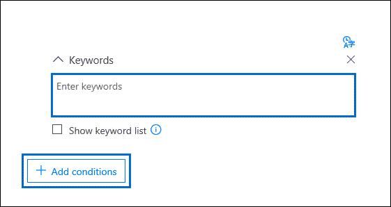

# Advanced eDiscovery에서 검색 모음 쿼리 작성

Advanced eDiscovery 사례에서 데이터를 수집하기 위해 검색 쿼리를 구축할 때 키워드를 사용하여 특정 콘텐츠 및 조건을 검색하여 법적 조사와 가장 관련이 있는 항목을 반환하도록 검색 범위를 좁힐 수 있습니다.

## 키워드 검색

검색 쿼리의 **키워드** 상자에 키워드 쿼리를 입력합니다. 키워드, 전자 메일 메시지 속성(보낸 날짜 및 받은 날짜 등) 또는 문서 속성(예: 파일 이름 또는 문서가 마지막으로 변경된 날짜)을 지정할 수 있습니다. **AND**, **OR**, **NOT**, **NEAR** 와 같은 부울 연산자를 사용하는 좀 더 복잡한 쿼리를 사용할 수 있습니다. SharePoint 및 OneDrive의 문서에서 중요한 정보(예: 주민 등록 번호)를 검색하거나(전자 메일 메시지 아미지) 외부에서 공유된 문서를 검색할 수도 있습니다. 키워드 상자를 **비워** 두면 지정된 콘텐츠 위치에 있는 모든 콘텐츠가 검색 결과에 표시됩니다.

## 키워드 목록

또는 키워드 목록 표시  확인란을 선택하고 각 행에 키워드 또는 키워드 구를 입력할 수 있습니다. 각 행의 키워드는 작성된 검색 쿼리의 **OR** 연산자와 기능상 유사한 논리 연산자(검색 쿼리 구문에서 *c:s로* 표시)로 연결됩니다. 즉, 모든 행에 키워드가 포함된 항목이 검색 결과에 있습니다. Advanced eDiscovery 검색 쿼리의 키워드 목록에 최대 180개 행을 추가할 수 있습니다.

키워드 목록을 사용하는 이유 키워드 목록의 각 키워드와 일치하는 항목 수를 표시하는 통계를 얻을 수 있습니다. 이를 통해 가장 효과적이고 가장 효과적인 키워드를 빠르게 식별할 수 있습니다. 키워드 목록의 행에 키워드 구(괄호로 둘러싸임)를 사용할 수도 있습니다. 검색 통계에 대한 자세한 내용은 [검색 통계를 참조하세요.](search-statistics-in-advanced-ediscovery.md)

## 조건

검색 조건을 추가하여 검색 범위를 좁히고 보다 구체화된 결과 집합을 반환할 수 있습니다. 각 조건은 검색을 시작할 때 생성 및 실행되는 검색 쿼리에 절을 추가합니다. 조건은 **AND** 연산자와 기능상 유사한 논리 연산자(검색 쿼리 구문에서 *c:c로* 표시)에 의해 키워드 상자에 지정된 키워드 쿼리에 논리적으로 연결됩니다. 즉, 항목이 키워드 쿼리와 검색 결과에 포함될 하나 이상의 조건을 모두 충족해야 합니다. 이 방법을 통해 결과를 좁힐 수 있습니다. 검색 쿼리에서 사용할 수 있는 조건의 목록 및 설명은 키워드 쿼리 및 검색 조건의 "검색 조건" [섹션을 참조하세요.](keyword-queries-and-search-conditions.md#search-conditions)
