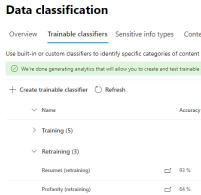

# 콘텐츠 탐색기에서 분류자를 재학습하는 방법

학습 가능한 Microsoft 365 분류자인 도구는 살펴보기 위한 샘플을 제공하여 다양한 유형의 콘텐츠를 인식하는 데 사용할 수 있는 도구입니다. 교육이 이행된 후 이를 사용하여 민감도 레이블, 커뮤니케이션 준수 정책 및 보존 Office 적용하기 위한 항목을 식별할 수 있습니다.

이 문서에서는 사용자 지정 학습 가능한 분류자 및 사전 학습된 일부 분류자에 대한 추가 피드백을 제공하여 성능을 개선하는 방법을 보여줍니다.

다양한 분류자 유형에 대한 자세한 내용은 학습 가능한 분류자에 대해 자세히 [알아보기를 참조합니다.](classifier-learn-about.md)

조정 및 재실행 프로세스에 대한 간단한 요약은 이 비디오를 시청하십시오. 자세한 내용을 확인하려면 이 전체 문서를 읽어야 합니다.

 

> [!VIDEO https://www.microsoft.com/videoplayer/embed/RWyGMs]

## 사용 권한

규정 준수 센터에서 분류자에 Microsoft 365:

- 분류자 교육을 위해 규정 준수 관리자 역할 또는 준수 데이터 관리자 필요

이러한 시나리오에서 분류기를 사용하려면 다음 권한이 있는 계정이 필요합니다.

- 보존 레이블 정책 시나리오: 레코드 관리 및 보존 관리 역할 

## 전체 워크플로

> [!IMPORTANT]
> 콘텐츠 탐색기에서 보존 레이블 정책을 자동으로 적용하기 위한 피드백을 Exchange 분류기를 조건으로 사용합니다. **보존 레이블을 항목에 자동으로 적용하고 분류기를 조건으로 Exchange 보존 정책이 없는 경우 여기에서 중지하세요.**

분류기를 사용할 때 분류의 정밀도를 높이는 것이 더 나을 수 있습니다. 이 작업을 위해 일치하는 항목으로 식별되거나 일치하지 않은 항목의 분류 품질을 평가합니다. 분류자에 대해 30회 평가를 수행한 후 해당 피드백을 반영하고 자동으로 재조정합니다.

분류자 재시도의 전체 워크플로에 대한 자세한 내용은 분류자 재조정을 위한 프로세스 흐름을 [참조하세요.](classifier-learn-about.md#retraining-classifiers)

> [!NOTE]
> 분류자는 이미 게시되어 있으며 사용 중이면 다시 강의할 수 있습니다.

## 콘텐츠 탐색기에서 분류자를 재학습하는 방법

1. 준수 관리자 또는 Microsoft 365 규정 준수 센터 역할 액세스로 로그인하고 데이터 분류 콘텐츠 **탐색기를 Microsoft 365 규정 준수 센터**  >    >  **를 니다.** 
2. 레이블, **정보** 유형 또는 범주에 대한 필터 목록에서 교육 가능한 **분류자 를 확장합니다.**

> [!IMPORTANT]
> 집계된 항목이 학습 가능한 분류자 제목 아래에 표시될 경우 최대 8일이 걸릴 수 있습니다.

3. 보존 레이블 정책을 자동 적용하는 데 사용한 학습 가능한 분류자 선택 피드백을 제공하면 교육 가능한 분류자입니다.

> [!NOTE]
> 항목에 보존 레이블 열에  항목이 있는 경우 항목이 로 분류된 `match` 것입니다.  항목에 보존 레이블 열에 항목이  없는 경우 항목은 으로 분류된 `close match` 것입니다. 항목에 대한 피드백을 제공하여 분류자 정밀도를 가장 향상시킬 수 `close match` 있습니다. 

4. 항목을 선택하고 여는 경우
 
 > [!TIP]
> 여러 항목을 모두 선택한 다음 명령 표시줄에서 분류 개선을 선택하여 동시에 피드백을 **제공할** 수 있습니다.

5. 의견 **제공 을 선택 합니다.**
6. 세부 **피드백 창에서** 항목이 실제 양수이면 일치를 **선택하십시오.**  항목이 가을 긍정이면 범주에 잘못 포함되었습니다. **일치하지 않음을 선택합니다.**
7. 항목에 더 적합한 다른 분류자가 있는 경우 교육 가능한 다른 분류자 제안 목록에서 선택할 **수** 있습니다. 이렇게 하면 다른 분류자는 항목을 평가합니다.
8. 피드백 **보내기를** 선택하면 , 분류에 대한 평가를 보내고 교육 가능한 다른 분류자 제안을 `match` 할 수 `not a match` 있습니다. 분류자에 30개 피드백 인스턴스를 제공하면 자동으로 재조정됩니다. 재조정은 1시간에서 4시간까지 걸릴 수 있습니다. 분류자에는 하루 두 번만 재조정할 수 있습니다.

> [!IMPORTANT]
> 이 정보는 테넌트의 분류자로 이동하고 **Microsoft로 돌아가지 않습니다.**

9. 교육 **가능한 분류자 를 열기**
10. 통신 준수 정책에 사용된 분류자는 재교육 제목 **아래에** 표시됩니다.

11. 재 교육이 완료되면 분류기를 선택해 재 교육 개요를 열 수 있습니다.

12. 권장 작업과 재실행 및 현재 게시된 분류자 버전의 예측 비교를 검토합니다.
13. 재작성 결과가 만족스러우면 다시 **게시를 선택 합니다.**
14. 재실행 결과에 만족하지 않는 경우 콘텐츠 탐색기 인터페이스에서 분류자에 추가 피드백을 제공하고 다른 재실행 주기를 시작하거나, 현재 게시된 분류자 버전이 계속 사용되는 경우 아무 것도 하지 않을 수 있습니다. 

## 추천 다시 게시에 대한 세부 정보

다음은 재구성된 분류자 다시 게시 또는 추가 재실행을 제안하기 위한 권장을 수식화하는 방법에 대한 약간의 정보입니다. 이를 위해서는 학습 가능한 분류자 작동 방법을 좀 더 깊이 이해해야 합니다.

재조정 후 피드백이 있는 항목과 원래 분류자 교육에 사용된 항목 둘 다에서 분류자 성능을 평가합니다. 

- 기본 제공 모델의 경우 분류자 교육에 사용되는 항목은 Microsoft에서 모델을 빌드하는 데 사용하는 항목입니다.
- 사용자 지정 모델의 경우 원래 교육에 사용된 항목 분류자는 테스트 및 검토를 위해 추가한 사이트의 항목입니다.

재실행 및 게시된 분류자에 대한 두 항목 집합의 성능 수를 비교하여 다시 게시하기 위한 개선이 있는지 여부를 권장합니다. 

## 참고 항목

- [학습 가능한 분류자에 대한 자세한 정보](classifier-learn-about.md)
- [SharePoint Server의 크롤링되는 기본 파일 이름 확장명 및 구문 분석되는 파일 형식](/sharepoint/technical-reference/default-crawled-file-name-extensions-and-parsed-file-types)