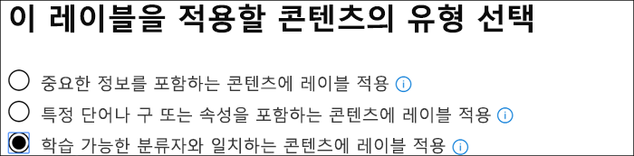

# 바로 사용 가능한 분류자 사용 (미리 보기)

Microsoft는 매우 큰 예제 데이터 집합을 사용 하는 분류자 수를 교육 하 고 테스트 한 경우 특정 콘텐츠 범주를 식별 하는 데 도움이 됩니다. [Trainable 분류자 (미리 보기) 시작을](classifier-getting-started-with.md)참조 하세요. 이러한 분류자는 `Ready to use` 기본적으로 그룹에 표시 됩니다.

- **비속어**: profanities, slurs, taunts 및 가짜 식이 포함 된 텍스트 항목 (더 공격적인 용어와 의미가 동일한 식 임)을 검색 합니다.
- **다시 시작**: 지원자 개인, 교육, 전문가 자격, 작업 환경 및 기타 개인 식별 정보에 대 한 텍스트 계정인 항목을 검색 합니다.
- **SourceCode**: 광범위 하 게 사용 되는 컴퓨터 프로그래밍 언어로 작성 된 지침 및 명령문 집합을 포함 하는 항목을 검색 합니다.
- **Harassment**: 레이스, ethnicity, religion, 국립 근원, 성별, 성적 방향, 연령, 장애 등의 특성을 기반으로 하 여 한 명 이상의 개인이 대상으로 하는 공격적인 언어 텍스트 항목의 특정 범주를 감지 합니다.
- **불경**: 대부분의 사용자에 게 embarrass 하는 식이 포함 된 비속어 (공격적인 언어) 텍스트 항목의 특정 범주를 감지 합니다.
- **위협**: 사용자 또는 속성에 대 한 폭력을 커밋하거나 물리적으로 피해를 주거나 위험에 관련 된 비속어 텍스트 항목의 특정 범주를 감지 합니다.

> [!NOTE]
> 분류 및 레이블 지정 워크플로에 사용할 수 있는 분류자를 사용 하기 전에 분류 예측이 예상과 맞는지 확인 하기 위해 범주에 적합 한 조직의 콘텐츠 샘플에 대해 테스트 해야 합니다.

> [!IMPORTANT]
> 비속어, harassment, 비속어 및 threat 분류자는 검색 가능한 텍스트만 사용할 수 있습니다.  추가적으로, 언어 및 문화 표준이 지속적으로 변경 되 고 이러한 현실에 따라 Microsoft는 이러한 분류자를 업데이트할 수 있는 권리를 보유 합니다. 이 분류자는 사용 중인 공격적인 및 기타 언어를 모니터링 하는 데 도움이 될 수 있지만,이 분류자는 이러한 언어의 결과를 해결 하지 않으며, 조직의 사용자가 사용 하는 유일한 모니터링 또는 대응 수단을 제공 하기 위한 것이 아닙니다. 해당 언어 Microsoft 또는 해당 자회사가 아닌 조직은 미리 훈련 된 분류자로 식별 되는 콘텐츠의 모니터링, 적용, 차단, 제거 및 보존과 관련 된 모든 결정을 계속 담당 합니다.

## 분류자 사용을 준비 하 고 사용 하는 방법

1. 테스트 대상 범주에 사용 가능한 분류자 (긍정 일치) 및 포함 하지 않아야 하는 항목 (음수 일치)의 범주에 속하는 것으로 판단 되는 삭제 가능 테스트 콘텐츠를 수집 합니다.

> [!IMPORTANT]
> 샘플 항목은 암호화 하지 않아야 하며 영어로 되어 있어야 합니다.

2. 전용 SharePoint Online 폴더를 만들고 검색 인덱스에 폴더를 추가할 시간을 하나 이상 기다립니다. 폴더 URL을 기록해 둡니다.

3. 준수 관리자 또는 보안 관리자 역할 액세스를 사용 하 여 microsoft 365 준수 센터에 로그인 하 고 **microsoft 365 준수 센터** 또는 **microsoft 365 보안 센터** > **레코드 관리 (미리 보기)** > **레이블 정책** 탭을 엽니다.

4. 을 `Auto-apply a label`선택 합니다.

5. 을 `Choose a label to auto-apply`선택 합니다.

6. 이 `Create new labels` 테스트에만 사용할 레이블을 선택 하 고 만듭니다. 이렇게 하면 설정 해제로 유지 `Retention` 됩니다. 보존 또는 기타 작업을 설정 하지 않으려고 합니다. 이 경우에는 작업을 적용 하지 않고 보존 레이블을 단순히 텍스트 레이블로 사용 합니다. 예를 들어 작업 없이 "SourceCode 분류자 test" 라는 보존 레이블을 만든 다음 해당 보존 레이블을 원본 코드 분류자가 조건으로 포함 된 콘텐츠에 자동으로 적용할 수 있습니다. 보존 레이블 만들기에 대 한 자세한 내용은 [Overview (보존 레이블](labels.md))를 참조 하십시오.
  
7. 을 `Auto-apply a label` 선택 하 `Choose a label to auto-apply`고을 클릭 합니다. 조건 기반 자동 적용 레이블을 사용 하는 방법에 대 한 자세한 내용은 [조건에 따라 보존 레이블 정책 자동 적용](labels.md#applying-a-retention-label-automatically-based-on-conditions)을 참조 하십시오.

8. 목록에서 테스트 레이블을 선택 하 고를 선택 `Next`합니다.

9. 을 `Apply label to content that matches a trainable classifier`선택 합니다.

.

10. 이 경우 목록에서 분류자를 선택 합니다.`Source Code`

11. 정책 이름 (예: "소스 코드에서 분류자 테스트를 사용할 준비가 되었습니다.")

12. 을 `Let me choose specific locations`선택 합니다.

13. 를 제외한 `SharePoint sites` 모든 위치를 해제 하 `Choose sites`고를 선택 합니다.

14. 2 단계에 해당 하는 사이트의 URL을 입력 합니다.

15. 마법사를 완료 하 고`Auto-apply`

16. 테스트 항목을 전용 SharePoint Online 폴더에 배치 합니다.

17. 레이블이 적용 되는 시간을 허용 합니다.

18. 레이블에 대 한 문서의 속성을 확인 하 여 해당 분류자가 필요한 대로 테스트 콘텐츠를 포함 하 고 제외 했는지 확인 합니다.

19. 레이블이 지정 된 항목을 검토 합니다.

20. 테스트를 완료 한 경우 콘텐츠 및 레이블 정책을 삭제 합니다.

참고 항목:

- [학습 가능한 분류자 시작 (미리 보기)](classifier-getting-started-with.md)
- [보존 레이블 개요](labels.md)
- [조건에 따라 보존 레이블 정책 자동 적용](labels.md#applying-a-retention-label-automatically-based-on-conditions)