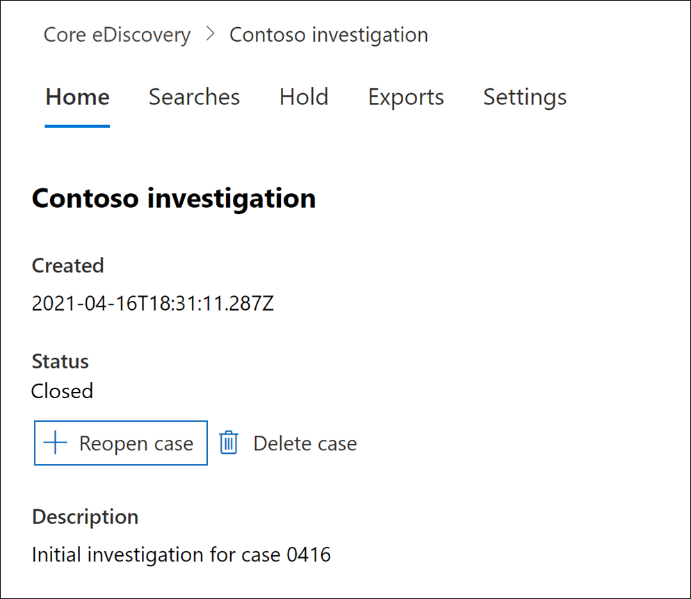
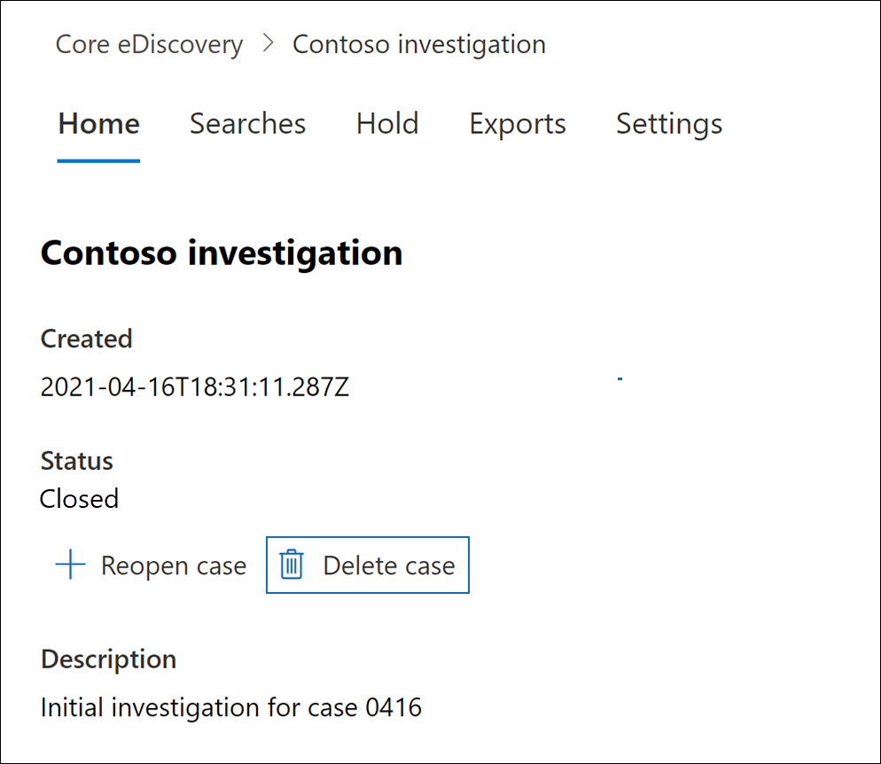

# Core eDiscovery 사례 닫기, 다시 열기 및 삭제

이 문서에서는 이 문서에서 핵심 eDiscovery 사례를 닫고, 다시 열고, 삭제하는 Microsoft 365.

## 케이스 종료

Core eDiscovery 사례에서 지원되는 법적 사례 또는 조사가 완료되면 사례를 닫을 수 있습니다. 사례를 닫을 때 발생하는 경우는 다음과 같습니다.
  
- 사례에 eDiscovery 보류가 포함된 경우 해당 보류가 해제됩니다. 보류가 해제된 후 30일의 유예 기간(지연 보류)이 보류된 콘텐츠 위치에 적용됩니다. 이렇게 하면 콘텐츠가 즉시 삭제되는 것을 방지할 수 있으며, 관리자가 지연 보류 기간이 만료된 후 영구적으로 삭제되기 전에 콘텐츠를 검색하고 복원할 수 있는 기회를 제공합니다. 자세한 내용은 [eDiscovery 보류에서](create-ediscovery-holds.md#removing-content-locations-from-an-ediscovery-hold)콘텐츠 위치 제거를 참조하세요.

- 케이스를 닫으면 케이스와 연결된 보류 항목만 꺼집니다. 다른 보존이 콘텐츠 위치(예: 소송 보존, 보존 정책 또는 다른 Core eDiscovery 사례의 보류)에 배치된 경우에도 해당 보존은 유지 관리됩니다.

- 사례는 여전히 해당 페이지의 Core eDiscovery 페이지에 Microsoft 365 규정 준수 센터. 닫힌 케이스의 세부 정보, 보류, 검색 및 구성원은 유지됩니다.

- 사례를 닫은 후 편집할 수 있습니다. 예를 들어 구성원을 추가 또는 제거하고, 검색을 만들고, 검색 결과를 내보낼 수 있습니다. 활성 사례와 닫힌 사례의 주요 차이점은 사례가 닫히면 eDiscovery 보류가 해제되어 있는 것입니다.

케이스를 닫으려면
  
1. 이 Microsoft 365 규정 준수 센터 **eDiscovery** Core를 클릭하여 조직의  >   Core eDiscovery 사례 목록을 표시합니다.

2. 닫을 사례의 이름을 클릭합니다.

   

3. 홈 페이지의 상태 **아래에서** **대소문자 닫기 를 클릭합니다.**

    사례와 연결된 보류가 해제될 것 같은 경고가 표시됩니다.

4. 예를 **클릭하여** 사례를 닫습니다.

    사례 홈 페이지의 상태가 활성에서 닫기 **로** **변경됩니다.**

5. Core **eDiscovery** 페이지에서 새로  고침을 클릭하여 닫힌 사례의 상태를 업데이트합니다. 닫기 프로세스를 완료하는 데 최대 60분 정도 걸릴 수 있습니다.

    프로세스가 완료되면 Core **eDiscovery** 페이지에서  사례 상태가 Closed로 변경됩니다.

## 닫힌 사례 다시 열기

사례를 다시 열면 사례가 닫혀 있을 때 실행되던 eDiscovery 보류가 자동으로 다시 설정되지 않습니다. 사례가 다시 열리면 보류 페이지로 이동하여  이전 보류를 켜야 합니다. 보류를 설정하려면 해당 보류를 선택해 플라이아웃 페이지를 표시한 다음 **상태** 토글을 **켜기** 로 설정합니다.
  
1. 이 Microsoft 365 규정 준수 센터 **eDiscovery** Core를 클릭하여 조직의  >   Core eDiscovery 사례 목록을 표시합니다.

2. 다시 열 사례의 이름을 클릭합니다.

   

3. 홈 페이지의 상태 **아래에서** 사례 **다시 열기 를 클릭합니다.**

    사례가 닫히면 사례와 연결된 보류가 자동으로 설정되지 않는 경고가 표시됩니다.

4. **사례를** 다시 열려면 예를 클릭합니다.

    사례 홈 페이지 플라이아웃 페이지의 상태가 **닫힌** 상태에서 활성으로 **변경됩니다.**

5. Core **eDiscovery** 페이지에서 새로  고침을 클릭하여 다시 연 사례의 상태를 업데이트합니다. 다시 열기 프로세스를 완료하는 데 최대 60분이 걸릴 수 있습니다. 

    프로세스가 완료되면 **Core eDiscovery** 페이지에서  사례 상태가 활성으로 변경됩니다.

6. (선택 사항) 다시 열린 사례와 연결된 보류를 설정하려면 보류 탭으로 이동하여 보류를 선택한 다음  보류 플라이아웃 페이지의 상태 아래에서 확인란을 선택합니다. 
  
## 케이스 삭제

활성 및 닫힌 Core eDiscovery 사례를 삭제할 수도 있습니다. 사례를 삭제하면 해당 사례의 모든 검색 및 내보내기 목록이 삭제되고 해당 사례는 해당 사례의 **Core eDiscovery** 페이지에 있는 사례 목록에서 Microsoft 365 규정 준수 센터. 삭제된 사례는 다시 열 수 없습니다.

사례를 삭제하려면 먼저 사례와 연결된 *모든* eDiscovery 보류를 삭제해야 합니다. 여기에는 끄기 상태의 보류 삭제가 **포함됩니다.** 

eDiscovery 보류를 삭제하려면

1. 삭제하려는  경우 보류 탭으로 이동하십시오.

2. 삭제할 보류를 선택합니다.

3. 플라이아웃 페이지에서 **삭제를 클릭합니다.**

      

케이스를 삭제하려면

1. 이 Microsoft 365 규정 준수 센터 **eDiscovery** Core를 클릭하여 조직의  >   Core eDiscovery 사례 목록을 표시합니다.

2. 삭제할 사례의 이름을 클릭합니다.

3. 사례 홈 페이지의 상태 **아래에서** 사례 **삭제를 클릭합니다.**

      

삭제하려는 사례에 eDiscovery 보류가 계속 포함되어 있는 경우 오류 메시지가 표시됩니다. 사례와 연결된 모든 보류를 삭제한 다음 다시 시도하여 사례를 삭제해야 합니다.
