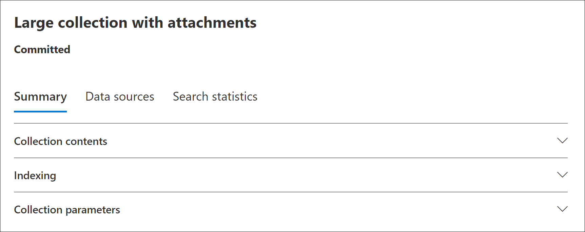

# 컬렉션 통계 및 보고서의 Advanced eDiscovery

초안 컬렉션을 만든 후 검색 조건과 일치하는 항목이 가장 많은 콘텐츠 위치, 검색 쿼리에서 반환된 항목 수 등 검색된 항목에 대한 통계를 볼 수 있습니다. 결과의 하위 집합을 미리 볼 수 있습니다.

추가로 검사할 문서 집합을 확인한 경우 검색 결과를 검토 집합에 추가하여 수집 및 처리합니다.

## 초안 컬렉션에 대한 통계 및 보고서

이 섹션에서는 초안 컬렉션에 사용할 수 있는 통계에 대해 설명합니다. 이러한 통계는 임시  컬렉션의 플라이아웃 페이지에 있는 검색 통계 탭에서 사용할 수 있습니다.

### 수집 예상

이 섹션에는 컬렉션에서 반환된 예상 항목에 대한 그래픽 요약이 표시됩니다. 컬렉션의 검색 조건과 일치하는 항목 수를 나타냅니다. 이 정보는 컬렉션에서 반환되는 예상 항목 수에 대한 아이디어를 제공합니다.

- **위치 기준 예상 항목:** 컬렉션에서 반환된 예상 항목의 총 수입니다. 사서함에 있으며 사이트에 있는 특정 항목 수도 표시됩니다.

- **적중 횟수가 있는** 예상 위치: 컬렉션에서 반환된 항목이 포함된 총 콘텐츠 위치 수입니다. 사서함 및 사이트 위치의 특정 수도 표시됩니다.

- **위치당 데이터 볼륨(MB)**: 컬렉션에서 반환된 모든 예상 항목의 총 크기입니다. 사서함 항목 및 사이트 항목의 특정 크기도 표시됩니다.

### 조건 보고서

이 섹션에는 컬렉션 검색 쿼리에 대한 통계와 검색 쿼리의 여러 부분과 일치하는 예상 항목 수가 표시됩니다. 이러한 통계를 사용하여 검색 쿼리의 각 구성 요소와 일치하는 항목 수를 분석할 수 있습니다. 이렇게하면 컬렉션의 검색 조건을 구체화하고 필요한 경우 컬렉션의 범위를 좁힐 수 있습니다.

- **위치 유형:** 쿼리 통계를 적용할 수 있는 콘텐츠 위치의 유형입니다. Exchange **값은** 사서함 위치를 나타냅니다. 값이 **SharePoint** 위치를 나타냅니다.

- **파트:** 검색 쿼리에서 통계를 적용할 수 있는 부분입니다. **Primary는** 전체 검색 쿼리를 나타냅니다. **Keyword는** 행의 통계가 특정 키워드에 대한 통계를 나타냅니다. 컬렉션에서 검색 쿼리에 대해 키워드 목록을 사용하는 경우 쿼리의 각 구성 요소에 대한 통계가 이 표에 포함됩니다.

- **조건:** 해당 행에 표시된 통계를 반환한 초안 컬렉션에 대해 실행된 검색 쿼리의 실제 구성 요소(키워드 또는 조건)입니다.

- **적중 횟수가** 있는 위치: 조건 열에  나열된 기본 쿼리 또는 키워드 쿼리와 일치하는 항목이 포함된 콘텐츠 위치(위치 유형 열로 지정)의 **수입니다.**

- **항목:** 조건 열에 나열된 쿼리와 일치하는 항목 수(지정된 콘텐츠 위치의 항목 수)입니다.  앞서 설명한 것 처럼 항목에 검색되는 키워드의 인스턴스가 여러 개 포함된 경우 이 열에는 한 번만 계산됩니다.

- **크기(MB)**: 조건 열의 검색 쿼리와 일치하는 지정된 콘텐츠 위치에 있는 모든 항목의 총 **크기입니다.**

### 상위 위치

이 섹션에는 컬렉션에서 반환된 항목이 가장 많은 특정 콘텐츠 위치에 대한 통계가 표시됩니다.

- 위치 이름(사서함의 전자 메일 주소 및 사이트의 URL)입니다.

- 위치 유형(사서함 또는 사이트)

- 컬렉션에서 반환된 콘텐츠 위치에 있는 예상 항목 수입니다.

- 각 콘텐츠 위치에 있는 예상 항목의 총 크기입니다.

## 커밋된 컬렉션에 대한 통계 및 보고서

이 섹션에서는 검토 집합에 추가된 실제 항목 수를 포함하여 컬렉션을 검토 집합에 커밋한 후 사용할 수 있는 통계에 대해 설명합니다. 이러한 통계(로드 집합 정보 외에도)는 사례에 추가된 콘텐츠에 대한 기록 정보를 제공합니다.

검토 집합에 컬렉션을 커밋하면 다음 탭이 커밋된 연결의 플라이아웃 페이지에 표시됩니다. 이러한 각 탭에는 컬렉션에 대한 다양한 유형의 정보가 포함되어 있습니다.

### 컬렉션 콘텐츠

요약 **탭의** 이 섹션에는 컬렉션의 데이터 원본에서 수집되어 검토 집합에 추가된 항목에 대한 통계 및 기타 정보가 포함되어 있습니다.

- **추출된 총 항목입니다.** 검토 집합에 추가된 총 항목 수입니다. 이 숫자는 검토 집합에 추가된 상위 항목과 자식 항목의 합계를 나타냅니다.

  > [!TIP]
  > 부모 또는 자식 항목 막대 위에 커서를 마우스로 대면 부모 또는 자식 항목의 총 수가 표시됩니다.

- **상위 항목.** 검토 집합에 추가된 항목을 수집하는 데 사용된 컬렉션에서 반환된 항목 수입니다. 이 숫자는 컬렉션 매개 변수 섹션에 표시되는 예상 항목 수에 **해당합니다.** 검토 집합에 추가된 항목을 수집하는 데 사용된 정보를 수집하는 상위 항목 수입니다.
 
   상위 항목에는 여러 자식 항목이 포함될 수 있습니다. 예를 들어 전자 메일 메시지는 첨부 파일이 포함되어 있는 경우 또는 클라우드 첨부 파일이 있는 경우 상위 항목입니다. 이 경우 첨부된 파일 또는 클라우드 첨부 파일의 대상이 자식 항목으로 간주됩니다. 컬렉션을 커밋하면 상위 항목과 해당 하위 항목이 개별 항목이나 파일로 검토 집합에 추가됩니다.

- **하위 항목.** 검토 집합에 추가된 하위 항목 수입니다. 자식 항목은 부모 항목의 첨부 파일 또는 다른 부분입니다. 자식 항목에는 첨부 파일, 클라우드 첨부 파일, 이미지 및 전자 메일 서명이 포함됩니다. 검토 집합에 컬렉션을 커밋하면 하위 항목이 추출되어 인덱싱되어 검토 집합에 개별 파일로 추가됩니다.

- **고유 항목.** 검토 집합에 추가된 고유 항목 수입니다. 고유한 항목은 검토 집합에 고유합니다. 검토 집합에 이전 항목이 없는 경우 첫 번째 컬렉션이 새 검토 집합에 추가될 때 모든 항목은 고유합니다.

- **중복 항목을 확인했습니다.** 검토 집합에 동일한 항목이 이미 있기 때문에 검토 집합에 추가되지 않은 컬렉션의 항목 수입니다. 중복 항목에 대한 통계는 초안 컬렉션의 예상 항목 수와 검토 집합에 추가된 실제 항목 수의 차이를 설명하는 데 도움이 될 수 있습니다.

### 인덱싱

**커밋된**  검토 집합의 요약 탭에 있는 인덱싱 섹션에는 검토 집합에 추가된 항목에 대한 인덱싱 정보가 포함되어 있습니다.

**새 인덱싱된 항목 입니다.** 검토 집합에 추가되기 전에 새로 인덱싱된 항목 수입니다. 새로 인덱싱된 항목의 예로는 상위 항목에서 추출된 다음 검토 집합에 추가되기 전에 인덱싱된 하위 항목이 있습니다. 또한 이 경우 데이터 원본 탭에 나열된 양도 데이터 원본 및 비관리 콘텐츠  위치에 없는 항목은 검토에 추가되기 전에 인덱싱됩니다. 예를 들어 새로 인덱싱된 항목에는 추가 위치에서 수집된 항목이 포함됩니다.

**인덱싱된 항목이 업데이트되었습니다.** 성공적으로 인덱싱되어 검토 집합에 추가된 부분적으로 인덱싱된 항목 수입니다. 이 통계는 양도 및 비관리 콘텐츠 위치의 부분적으로 인덱싱된  항목을 나타내며, 이 탭은 컬렉션이 검토 집합에 커밋될 때 성공적으로 인덱싱된 데이터 원본 탭을 나타냅니다.

**인덱싱 오류.** 검토 집합에 추가되기 전에 인덱싱할 수 없는 부분적으로 인덱싱된 항목 수입니다. 이러한 항목에는 오류 수정이 필요할 수 있습니다.

### 컬렉션 매개 변수

이 섹션에는 검토 집합에 추가된 항목을 수집하는 데 사용된 컬렉션 정보가 표시됩니다. 이 탭에는 검색 통계 탭의 정보와 비슷한 **정보가** 표시됩니다. 이 섹션에서는 컬렉션에서 사용하는 검색 쿼리, 검색된 콘텐츠 위치 및 예상 컬렉션 결과의 빠른 스냅샷을 제공합니다. 앞서 설명한 것 처럼 이 섹션의 예상 항목 수는 컬렉션 콘텐츠 섹션에 표시된 상위 항목 수와 **동일합니다.**

### 검색 통계 탭

검색 통계 탭에  표시되는 통계는 임시 컬렉션을 마지막으로 실행한 이후의 통계와 같습니다. 여기에는 컬렉션 예상치, 조건 보고서 및 상위 위치가 포함됩니다. 이 정보는 기록 참조를 위해 초안 컬렉션에서 보존되고 검토 집합에 커밋된 실제 컬렉션과 비교할 수 있습니다.

## 초안 컬렉션 예상과 실제 커밋된 컬렉션의 차이점

초안 컬렉션을 실행하면 검색 통계 탭의 요약 탭과 컬렉션 예상 섹션에 컬렉션  조건을 충족하는  예상 항목 수와 총 크기가 **표시됩니다.** 검토 집합에 초안 컬렉션을 커밋한 후 검토 집합에 추가된 실제 항목 수와 전체 크기는 예상치와 다를 수 있습니다. 대부분의 경우 초안 컬렉션에서 예상된 것보다 더 많은 항목이 검토 집합에 추가됩니다. 다음 목록에서는 이러한 차이점의 가장 일반적인 이유와 이러한 차이점을 식별하기 위한 팁에 대해 설명합니다.

- **하위 항목.** 부모 항목에서 추출하여 개별 파일로 추가되는 자식 항목입니다. 자식 항목 수가 검토 집합에 실제로 추가되는 항목 수를 크게 늘릴 수 있습니다. 일반적으로 커밋된 컬렉션의 요약  탭에 있는 컬렉션  콘텐츠 섹션에서 식별되는 상위 항목 수는 초안 컬렉션의 예상 항목 수와 같아야 합니다.

- **항목을 중복합니다.** 이전 컬렉션에서 검토 집합에 이미 추가된 초안 컬렉션의 항목은 추가되지 않습니다. 앞서 설명한 것 처럼 컬렉션의 중복 항목  수는 요약 탭의 컬렉션 콘텐츠 **섹션에** 표시됩니다.

- **컬렉션 구성 옵션.** 검토 집합에 초안 컬렉션을 커밋할 때 대화 스레드, 클라우드 첨부 파일 및 문서 버전을 포함해야 합니다. 검토 집합에 추가되는 이러한 항목은 초안 컬렉션의 예상 항목에 포함되지 않습니다. 컬렉션을 커밋할 때만 식별되고 수집됩니다. 이러한 옵션을 선택하면 검토 집합에 추가되는 항목 수가 늘어날 가능성이 높습니다. 

    예를 들어 여러 버전의 SharePoint 초안 컬렉션에 대한 예상 문서는 포함되지 않습니다. 그러나 검색 결과를 내보낼 때 모든 문서 버전을 포함하기 위한 옵션을 선택하면 검토 집합에 추가된 항목의 실제 수와 총 크기가 늘어날 수 있습니다. 

    이러한 옵션에 대한 자세한 내용은 검토 집합에 초안 컬렉션 [커밋을 참조하세요.](commit-draft-collection.md#commit-a-draft-collection-to-a-review-set-in-advanced-ediscovery) 

다음은 임시 컬렉션의 예상 결과가 실제 커밋된 결과와 다를 수 있는 다른 이유입니다.

- **초안 컬렉션의 결과를 예측하는 방법** 초안 컬렉션에서 반환되는 검색 결과의 예상치는 컬렉션 쿼리 조건을 충족하는 항목의 예상 수가 아니라 실제 수입니다. 예상 전자 메일 항목 수를 컴파일하기 위해 검색 조건을 충족하는 메시지 EXCHANGE 요청합니다. 그러나 컬렉션을 검토 집합으로 커밋하면 컬렉션이 다시 시작되어 데이터베이스에서 실제 Exchange 검색됩니다. 따라서 예상 항목 수와 실제 항목 수가 결정되는 방식 때문에 차이가 있을 수 있습니다.

- **초안 컬렉션을** 예상하고 커밋할 때 사이에 변경됩니다. 초안 컬렉션을 검토 집합에 커밋하면 검색이 다시 시작되어 검색 조건에 충족하는 가장 최근 항목을 검색 인덱스에 수집합니다. 초안 컬렉션을 마지막으로 실행한 시간과 초안 컬렉션이 검토 집합에 커밋된 시간 사이의 검색 조건을 충족하는 추가 항목을 만들거나 보내거나 삭제할 수 있습니다. 또한 초안 컬렉션 결과가 예상된 경우 검색 인덱스에 있는 항목이 더 이상 데이터 원본에서 제거된 후 컬렉션을 커밋하지 못하게 되기도 합니다. 이 문제를 완화하는 한 가지 방법은 컬렉션의 날짜 범위를 지정하는 것입니다. 또 다른 방법은 항목을 보존하고 제거하지 못하게 콘텐츠 위치를 보류하는 것입니다.

- **인덱서되지 않은 항목입니다.** 초안 컬렉션에 모든 Exchange 사서함 또는 모든 SharePoint 사이트 검색이 포함된 경우 컬렉션 조건과 일치하는 항목이 포함된 콘텐츠 위치의 인덱스되지 않은 항목만 검토 집합에 추가됩니다. 즉, 사서함이나 사이트에서 결과가 발견되지 않는 경우 해당 사서함 또는 사이트의 인덱서되지 않은 항목이 검토 집합에 추가되지 않습니다. 그러나 모든 콘텐츠 위치의 인덱서되지 않은 항목(컬렉션 쿼리와 일치하는 항목이 포함되지 않은 항목도 포함)은 예상 모음 결과에 포함됩니다.

    또는 초안 컬렉션에 특정 콘텐츠 위치(즉, 임시 모음 마법사의  추가 위치 페이지에 지정된 특정 사서함 또는 사이트)가 포함된 경우 검색에 지정된 콘텐츠 위치에서 인덱스되지 않은 항목(컬렉션 조건에 의해 제외되지 않음)을 내보낼 수 있습니다. 이 경우 예상되는 인덱서되지 않은 항목 수와 검토 집합에 추가된 인덱서되지 않은 항목의 수는 동일해야 합니다.
