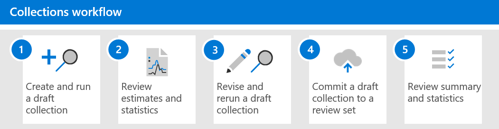

# 컬렉션에 대해 Advanced eDiscoveryLearn about collections in Advanced eDiscovery

> [!NOTE]
> 이 문서에서 설명하는 새 컬렉션 환경을 Advanced eDiscovery 있습니다.We're rolling out a new collections experience in Advanced eDiscovery, which is described in this article. 이 롤아웃은 모든 조직에서 사용할 수 있도록 하기까지 몇 주가 소요됩니다.This rollout will take a number of weeks before it's available to all organizations. 조직에서 새 컬렉션 환경을 사용할 수 없는 경우에도 검색 도구 를 사용하여 사례 [콘텐츠를 Advanced eDiscovery 있습니다.](create-search-to-collect-data.md)If the new collections experience isn't available in your organization, you can still collect case content with the [Advanced eDiscovery search tool](create-search-to-collect-data.md).

조직이 조사 또는 잠재적인 소송과 관련이 있을 수 있는 커뮤니케이션 및 콘텐츠를 수집하는 데 직면한 경우 최상의 상황에서 중요한 과제에 직면하게 됩니다.When organizations are faced with gathering the communications and content that may be relevant to an investigation or potential litigation, they face a significant challenge under the best of circumstances. 오늘날의 최신 작업 공간에서 콘텐츠의 양, 다양성 및 속도는 혁신과 원격 작업을 가능하게 하는 동시에 eDiscovery 조사를 위한 컬렉션 관리에 대한 요구 사항 및 프로세스를 확장하고 있습니다.In today’s modern workplace, the volume, variety, and velocity of content is enabling innovation and remote work, while also expanding the requirements and process for managing collections for eDiscovery investigations.

컬렉션 워크플로는 기본 위치 및 원본에서 콘텐츠를 추출하는 데 중요한 기술적 문제가 있습니다.The collection workflow poses significant technical challenges around extracting content from native locations and sources. 또한 일반적인 소송 또는 조사 시나리오에 대한 평가 및 전략의 중요 시점입니다.It's also a critical point in the assessment and strategy for common litigation or investigations scenarios. 조직이 조사를 평가하기 시작하면 먼저 질문한 질문은 누가 관련이 있나요?As organizations begin to assess an investigation, the first questions asked are who was involved? 관련자를 식별한 후 이러한 보유자를 신속하게 보류하여 관련 콘텐츠를 보존할 수 있습니다.After identifying who was involved, these custodians can quickly be placed on hold to preserve relevant content. 다음 질문은 어떻게 됐나요?The next question is what took place? 모든 조사에 대한 이 두 번째 기본 질문에 대답하려면 관리자는 데이터를 전환해야 합니다.To answer this second fundamental question of any investigation, managers must turn to the data. 가장 관련성이 높은 콘텐츠를 빠르게 평가하기 위해 관리자는 질문의 대상을 구체화하여 컬렉션 결과가 너무 광범위하지 않으면서 포괄적이 되도록 합니다.To quickly assess the most relevant content to the question of what took place, managers start to refine the target of the question to ensure that the collection results are comprehensive without being too broad.

eDiscovery Advanced eDiscovery 컬렉션을 사용하면 eDiscovery 관리자가 전자 메일, 문서 및 기타 콘텐츠에 대한 검색 범위를 빠르게 Microsoft 365.Collections in Advanced eDiscovery help eDiscovery managers quickly scope a search for content across email, documents, and other content in Microsoft 365. 컬렉션은 관리자에게 사례와 관련이 있을 수 있는 예상 콘텐츠를 제공합니다.Collections provide managers with an estimate of the content that may be relevant to the case. 이를 통해 관리자는 사례와 관련된 콘텐츠의 크기 및 범위에 대한 정보를 신속하게 결정을 내릴 수 있습니다.This allows managers to make quick, informed decisions about the size and scope of content relevant to a case. eDiscovery 관리자는 사서함 및 SharePoint 사이트와 같은 관리 데이터 원본을 검색하고 특정 검색 조건(예: 키워드 및 날짜 범위)을 사용하여 컬렉션의 범위를 빠르게 정의하는 컬렉션을 만들 수 있습니다.eDiscovery managers can create a collection to search custodial data sources (such as mailboxes and SharePoint sites) and by using specific search criteria (such as keywords and date ranges) to quickly define the scope of their collection.

컬렉션이 정의되고 나면 eDiscovery 관리자는 컬렉션을 초안으로 저장하고 예상 데이터 볼륨, 결과가 포함된 콘텐츠 위치 및 검색 쿼리 조건에 대한 방문 횟수를 포함하여 예상 결과를 얻을 수 있습니다.After the collection is defined, eDiscovery managers can save the collection as a draft and get estimates, including estimates for data volume, the content locations that contain results, and the number of hits for search query condition. 이러한 인사이트는 eDiscovery 워크플로의 검토 및 분석 단계로 이동하기 전에 컬렉션 범위를 좁히거나 확장하기 위해 컬렉션을 수정해야 하는지 알리는 데 도움이 될 수 있습니다.These insights can help to inform if the collection should be revised to narrow or expand the scope of the collection before moving on the review and analyze stages in the eDiscovery workflow.

관리자가 컬렉션의 범위와 응답성이 있을 것으로 예상되는 예상 콘텐츠 양에 만족하면 검토 집합에  콘텐츠를 추가하거나 커밋할 수 있습니다.When the manager is satisfied with the scope of the collection and the estimated amount of content that's likely to be responsive, the manager can add or *commit* the content to a review set. 검토 집합에 컬렉션을 커밋할 때 해당 관리자에게는 채팅 대화, 클라우드 첨부 파일 및 문서 버전을 포함할 수 있는 옵션도 있습니다.When committing a collection to a review set, that manager also has the options to include chat conversations, cloud attachments, and document versions. 또한 컬렉션의 콘텐츠는 검토 집합으로 수집하는 동안 다른 처리 수준을 통과합니다.The content in the collection also goes through another level of processing during ingestion into the review set. 컬렉션이 최종 컬렉션 요약으로 업데이트됩니다.and the collection will be updated with the final collection summary. 검토 집합에 콘텐츠를 추가한 후 eDiscovery 관리자는 콘텐츠를 계속 쿼리, 그룹화 및 구체화하여 최소화하고 검토할 수 있습니다.After content is added to the review set, eDiscovery managers can continue to query, group, and refine the content in to help with minimization and review. 또한 컬렉션은 검토 집합에 커밋된 콘텐츠에 대한 정보 및 통계로 업데이트됩니다.Additionally, the collection is updated with information and statistics about the content committed to the review set. 컬렉션의 콘텐츠에 대한 기록 참조를 제공합니다.This provides a historical reference about the content in the collection.

컬렉션이 릴리스되고 Advanced eDiscovery 준수 센터에서  검색 탭의 Advanced eDiscovery 컬렉션으로  Microsoft 365 있습니다.With the release of collections in an Advanced eDiscovery, the **Searches** tab has been renamed to **Collections** in an Advanced eDiscovery case in the Microsoft 365 compliance center. 컬렉션의 범위와 크기를 정의하는 단계는 검색과 동일한 프로세스에 따라 위치 및 조건을 정의합니다.The steps to define the scope and size of the collection follow the same process as search to define locations and conditions. 초안으로 저장 및 미리 보기 예상 결과 보기를 사용하면 전체 검색 및 컬렉션을 검토 집합에 커밋하기 전에 대상 컬렉션 범위를 빠르게 유효성 검사할 수 있습니다.Save as draft and get preview estimates enables quick validation of targeted scope of collections prior to committing a full search and collection into the review set. 이렇게 하면 검색 및 수집 프로세스 중에 콘텐츠를 최소화하기 위해 작업을 관리하고 대상이 지정되는 작업을 다시 시작할 수 있습니다.This enables improved job management, and targeted iterations for starting to minimize content during the search and collection process.

## 컬렉션 워크플로Collections workflow

이 문서의 컬렉션 사용을 Advanced eDiscovery 프로세스의 각 단계에 대한 기본 워크플로와 설명은 다음과 있습니다.To get started using collections in Advanced eDiscovery, here's a basic workflow and descriptions of each step in the process.

1. **초안 컬렉션을 만들고 실행합니다.****Create and run a draft collection**. 첫 번째 단계는 초안 컬렉션을 만들고 검색할 양부 및 비보조 데이터 원본을 정의하는 것입니다.The first step is to create a draft collection and define the custodial and non-custodial data sources to search. 사례에 추가되지 않은 다른 데이터 원본을 검색할 수도 있습니다.You can also search other data sources that haven't been added to the case. 데이터 원본을 추가한 후 데이터 원본에서 사례와 관련된 콘텐츠를 검색하도록 검색 쿼리를 구성합니다.After you add the data sources, you configure the search query to search the data sources for content relevant to the case. 키워드, 속성 및 조건을 사용하여 사례와 가장 관련성이 높은 콘텐츠를 반환하는 검색 쿼리를 만들 수 있습니다.You can keywords, properties, and conditions to build search queries that return content that's likely most relevant to the case. 자세한 내용은 초안 컬렉션 [만들기를 참조하세요.](create-draft-collection.md)For more information, see [Create a draft collection](create-draft-collection.md).

2. **예상 및 통계를 검토합니다.****Review estimates and statistics**. 초안 컬렉션을 만들고 실행한 후 다음 단계에서는 컬렉션 통계를 확인하여 관련 콘텐츠가 있는지 여부와 적중 수가 가장 많은 콘텐츠 위치를 확인하는 데 도움이 됩니다.After you create a draft collection and run it, the next step is to view collection statistics to help you verify whether relevant content is being found and the content locations with the most hits. 또한 검색 결과 샘플을 미리 보고 콘텐츠가 조사 범위 내에 있는지 확인하는 데 도움이 될 수도 있습니다.You can also preview a sample of the search results to further help you determine if the content is within scope of your investigation. 자세한 내용은 임시 컬렉션에 대한 [통계 및 보고서를 참조하세요.](collection-statistics-reports.md#statistics-and-reports-for-draft-collections)For more information, see [Statistics and reports for draft collections](collection-statistics-reports.md#statistics-and-reports-for-draft-collections).

3. **초안 컬렉션을 다시 작성하고 다시 을(를) 다시 작성합니다.****Revise and rerun a draft collection**. 컬렉션에서 반환된 예상 결과 및 통계에 따라 검색되는 데이터 원본과 검색 쿼리를 변경하여 초안 컬렉션을 편집하여 컬렉션을 확장하거나 범위를 좁힐 수 있습니다.Based on the estimates and statistics returned by the collection, you can edit the draft collection by changing the data sources that are searched and the search query to expand or narrow the collection. 초안 컬렉션에 사례와 가장 관련이 있는 콘텐츠가 들어 있다는 확신이 있을 때까지 초안 컬렉션을 업데이트하고 다시할 수 있습니다.You can update and rerun the draft collection until you're confident that collection contains the content that's most relevant to your case.

4. **초안 컬렉션을 검토 집합에 커밋합니다.****Commit a draft collection to a review set**. 컬렉션에서 사례와 관련된 형식 콘텐츠를 반환하면 검토 집합에 컬렉션을 커밋할 수 있습니다.When you're satisfied that the collection returns the type content that is relevant to the case, you can commit the collection to the review set. 컬렉션을 커밋할 때 대화 스레드, 클라우드 첨부 파일 및 문서 버전을 검토 집합에 추가할 수 있으며, 이 모든 버전은 사례와 관련이 있을 수 있습니다.When you commit a collection, you have the option to add conversation threads, cloud attachments, and document versions to the review set, all of which might be relevant to the case. 컬렉션을 커밋하면 다음과 같은 상황이 발생하게 됩니다.The following things happen when you commit a collection:

   - 하위 항목(예: 전자 메일 첨부 파일, 전자 메일 서명 및 이미지)은 상위 항목(예: 전자 메일 메시지, 채팅 메시지 또는 문서)에서 추출되어 인덱싱(심층 인덱싱이라고 하는 프로세스)에서 추출되어 검토 집합에 별도의 파일로 추가됩니다.Child items (such as email attachments, email signatures, and images) are extracted from a parent item (such as an email message, chat message, or document), indexed (in a process called *deep indexing*), and added to the review set as separate files.

   - 추가 데이터 원본에서 수집된 항목에 대해 심층 인덱싱이 수행됩니다.Deep indexing is performed on items collected from additional data sources. 이러한 유형의 데이터 원본은 이전에 사례에 추가된 양도 및 비보조 데이터 원본이 아닌 콘텐츠 위치입니다.These types of data sources are content locations other than the custodial and non-custodial data sources previously added to the case.

   자세한 내용은 [검토 집합에 초안 컬렉션 커밋을 참조하세요.](commit-draft-collection.md)For more information, see [Commit a draft collection to a review set](commit-draft-collection.md).

5. **컬렉션 요약 및 통계를 검토합니다.****Review collection summary and statistics**. 검토 집합에 컬렉션을 커밋하면 추출된 항목에 대한 통계, 심층 인덱싱, 컬렉션에 사용된 검색 쿼리, 항목이 수집된 콘텐츠 위치 등 컬렉션에 대한 정보가 유지됩니다.After you commit a collection to a review set, information about the collection is retained, such as statistics about extracted items, deep indexing, the search query used for the collection, and the content locations that items were collected from. 또한 커밋된 컬렉션은 편집하거나 다시할 수 없습니다.Also, committed collections can't be edited or rerun. 복사하거나 삭제할 수만 있습니다.You can only copy or delete them. 컬렉션 보존은 검토 집합에 추가된 수집된 항목의 기록 레코드를 제공합니다.Preserving collections provides a historical record of the collected items that were added to a review set. 자세한 내용은 커밋된 컬렉션에 대한 [통계 및 보고서를 참조하세요.](collection-statistics-reports.md#statistics-and-reports-for-committed-collections)For more information, see [Statistics and reports for committed collections](collection-statistics-reports.md#statistics-and-reports-for-committed-collections).
