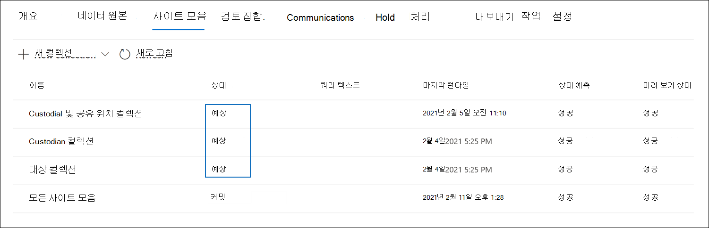

# 초안 컬렉션을 임시 검토 집합에 Advanced eDiscovery

초안 컬렉션에서 수집한 항목에 만족하고 이를 분석, 태그 및 검토할 준비가 된 경우 사례의 검토 집합에 컬렉션을 추가할 수 있습니다. 초안 컬렉션을 검토 집합에 커밋하면 수집된 항목이 검토 집합의 원래 콘텐츠 위치에서 Microsoft 365 복사됩니다. 검토 집합은 Microsoft 클라우드에서 microsoft에서 제공하는 안전한 Azure Storage 위치입니다.

## 검토 집합에 초안 컬렉션 사용

1. 이 Microsoft 365 규정 준수 센터 사례를 Advanced eDiscovery 컬렉션 탭을 선택하여 해당 사례의 컬렉션 목록을 표시합니다. 

   

   > [!TIP]
   > 상태 열의 값은 검토 집합에 추가할 수 있는 초안 `Estimated` 컬렉션을 식별합니다.  상태는 컬렉션이 검토 집합에 이미 추가된 `Committed` 상태입니다.

2. 컬렉션 **페이지에서** 검토 집합에 커밋할 초안 컬렉션을 선택합니다.

3. 플라이아웃 페이지의 아래쪽에서 **Actions**  >  **Edit 컬렉션 을 선택합니다.**

4. 컬렉션 편집 마법사에서 **초안** 저장 또는 수집 페이지가 **표시될 때까지 다음을** 클릭합니다.

5. 다음 설정을 구성합니다.

   1. 항목 **수집을 선택하고 검토 집합에 추가를 선택합니다.**

   2. 컬렉션을 제출한 후 새 검토 집합에 컬렉션을 추가할지 아니면 기존 검토 집합에 추가할지 여부를 결정하십시오. 결정에 따라 이 섹션을 완료합니다.

   3. 추가 컬렉션 설정을 구성합니다.

       - **Teams** 및 Yammer 메시지: 컬렉션에 검색 쿼리에서 반환된 채팅 항목이 포함된 대화 스레드를 컬렉션에 추가하려면 이 옵션을 선택합니다. 즉, 검색 조건과 일치하는 항목이 포함된 채팅 대화가 재구성됩니다. 이렇게 하면 대화의 컨텍스트에서 채팅 항목을 검토할 수 있습니다. 자세한 내용은 에서 [대화 스레딩을 Advanced eDiscovery.](conversation-review-sets.md)

       - **클라우드 첨부 파일:** 컬렉션 결과가 검토 집합에 추가될 때 최신 첨부 파일 또는 연결된 파일을 포함하려면 이 옵션을 선택합니다. 즉, 최신 첨부 파일 또는 연결된 파일의 대상 파일이 검토 집합에 추가됩니다.

       - **SharePoint 버전:** 컬렉션의 버전 제한 및 검색 매개 변수에 따라 SharePoint 문서의 모든 버전 컬렉션을 사용하도록 설정하려면 이 옵션을 선택합니다. 이 옵션을 선택하면 검토 집합에 추가된 항목의 크기가 크게 증가합니다.

   4. 검토 집합에 추가할 컬렉션의 배율을 정의하도록 설정을 구성합니다.

      - **모든 컬렉션 결과 추가:** 컬렉션의 검색 조건과 일치하는 모든 항목을 검토 집합에 추가하려면 이 옵션을 선택합니다.

      - **컬렉션 결과 샘플** 추가: 모든 결과를 추가하는 대신 검토 집합에 컬렉션 결과 샘플을 추가하려면 이 옵션을 선택합니다. 이 옵션을 선택하는 경우 샘플 **매개** 변수 편집을 클릭하고 다음 옵션 중 하나를 선택합니다.

         - **신뢰도 기반** 샘플: 컬렉션의 항목이 검토 집합에 추가되면 설정한 통계 매개 변수에 따라 결정됩니다. 일반적으로 결과를 샘플링할 때 신뢰 수준과 간격을 사용하는 경우 드롭다운 상자에 지정합니다. 그렇지 않은 경우 기본 설정을 사용합니다.

         - **임의** 샘플: 컬렉션의 항목은 검색에서 반환된 총 항목 수에 대해 지정된 비율의 임의 선택에 따라 검토 집합에 추가됩니다.

6. 컬렉션 **검토 페이지에서** 이전 페이지에서 구성한 컬렉션 설정을 검토할 수 있습니다. **변경하려면** 편집을 클릭합니다.

7. **제출을** 클릭하여 초안 컬렉션을 만들 수 있습니다. 컬렉션이 만들어졌다는 확인 페이지가 표시됩니다.

## 초안 컬렉션을 커밋한 후 발생하는 일

초안 컬렉션을 검토 집합에 커밋하면 다음과 같은 상황이 발생하게 됩니다.

- 컬렉션을 커밋하기 위해 새 검토 집합을 만든 경우 검토 집합이 만들어지며 이 경우 검토 집합 **탭에** 표시됩니다. 새 검토 집합의 상태는 준비 **입니다.** 이 상태 값은 검토 집합이 만들어졌다는 의미입니다. 컬렉션이 검토 집합에 추가된 것은 아니며, 컬렉션의 항목을 검토 집합에 추가하는 상태가 컬렉션 **탭에** 표시됩니다.

- 컬렉션 검색 쿼리가 다시 실행됩니다. 즉, 검토 집합에 복사된 실제 검색 결과는 컬렉션 검색이 마지막으로 실행될 때 반환된 예상 결과와 다를 수 있습니다.

- 검색 결과의 모든 항목은 라이브 서비스의 원본 데이터 원본에서 복사되어 Microsoft 클라우드의 보안 Azure Storage 위치에 복사됩니다.

- 문서 또는 비관리 데이터 원본에 없는 모든 항목(콘텐츠 및 메타데이터 포함)은 사례 데이터를 검토하는 동안 검토 집합의 모든 데이터를 완전히 검색할 수 있도록 깊이 인덱싱이라는 프로세스에서 다시 인덱싱됩니다. 컬렉션의 콘텐츠를 다시 인덱스하면 사례 조사 중에 검토 집합의 콘텐츠를 검색하거나 필터링할 때 철저하고 빠른 검색이 진행됩니다.

- 암호화된 SharePoint OneDrive 문서 및 암호화된 파일 첨부 전자 메일 메시지는 컬렉션을 검토 집합에 커밋할 때 암호가 해독됩니다. 검토 집합에서 암호 해독된 파일을 검토하고 쿼리할 수 있습니다. 자세한 내용은 [eDiscovery](ediscovery-decryption.md)도구에서 암호 Microsoft 365 참조하세요.

- OCR(광학 문자 인식) 기능은 이미지에서 텍스트를 추출하고 검토 집합에 추가된 콘텐츠와 함께 이미지 텍스트를 포함합니다. 자세한 내용은 이 문서의 광학 문자 [인식](#optical-character-recognition) 섹션을 참조하세요.

- 커밋이 완료되면 컬렉션 탭의 상태 열 값이 로  `Committed` 변경됩니다.

## 광학 문자 인식

검토 집합에 컬렉션을 커밋하면 검토 집합에 추가된 콘텐츠와 함께 이미지에서 Advanced eDiscovery 자동으로 추출되는 OCR(광학 문자 인식) 기능이 이미지에서 추출됩니다. 선택된 이미지 파일의 텍스트 뷰어에서 추출된 텍스트를 검토 집합에서 볼 수 있습니다. 따라서 이미지의 텍스트를 추가로 검토하고 분석할 수 있습니다. 느슨한 파일, 전자 메일 첨부 파일 및 포함된 이미지에 대해 OCR이 지원됩니다. OCR에 지원되는 이미지 파일 형식 목록은 [고급 eDiscovery에서 지원되는 파일 형식](supported-filetypes-ediscovery20.md#image)을 참조하세요.

고급 eDiscovery에서 만든 각 사례에 대해 OCR 기능을 사용하도록 설정해야 합니다. 자세한 내용은 검색 및 분석 [설정 구성을 참조하세요.](configure-search-and-analytics-settings-in-advanced-ediscovery.md#optical-character-recognition-ocr)
