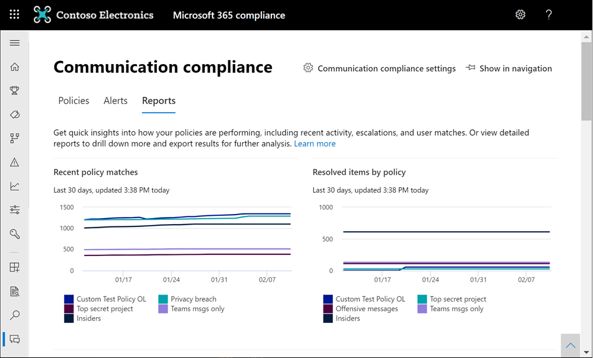

# <a name="communication-compliance-feature-reference"></a>커뮤니케이션 규정 준수 기능 참조

## <a name="policies"></a>정책

> [!IMPORTANT]
> PowerShell을 사용하여 커뮤니케이션 규정 준수 정책을 만들고 관리하는 것은 지원되지 않습니다. 이러한 정책을 만들고 관리하려면 통신 규정 준수 솔루션의 정책 관리 [Microsoft 365 합니다.](https://compliance.microsoft.com/supervisoryreview)

Microsoft 365 규정 준수 센터에서 Microsoft 365 조직에 대한 커뮤니케이션 규정 준수 정책을 만들 수 있습니다. 통신 준수 정책은 조직에서 검토할 통신 및 사용자를 정의하고, 통신이 충족해야 하는 사용자 지정 조건을 정의하고, 검토할 사용자를 지정합니다. 통신 준수 *관리자 역할이* 할당된 사용자는 정책을 설정할 수 있으며,  이 역할이 할당된 모든 사용자는 정책의 통신 준수 페이지 및 전역 설정에 액세스할 Microsoft 365 규정 준수 센터. 필요한 경우 정책 수정 내역을 검토 보류 중인 알림.csv 에스컬레이터된 항목 및 해결된 항목의 상태도 포함하는 정책(콤보로 구분된 값) 파일로 내보낼 수 있습니다. 정책의 이름을 바을 수 없습니다. 더 이상 필요하지 않은 경우 삭제할 수 있습니다.

## <a name="policy-templates"></a>정책 템플릿

정책 템플릿은 일반적인 규정 준수 시나리오를 해결하기 위한 정책을 신속하게 만드는 데 사용할 수 있는 미리 정의된 정책 설정입니다. 이러한 각 템플릿은 조건과 범위의 차이를 가지며, 모든 템플릿은 동일한 유형의 검색 신호를 사용 합니다. 다음 정책 템플릿 중 선택할 수 있습니다.

|**영역**|**정책 템플릿**|**세부 정보**|
|:-----|:-----|:-----|
| **비방성 언어 및 괴롭히기 방지** | 공격 언어에 대한 통신 모니터링 | - 위치: Exchange Online, Microsoft Teams, Yammer, 비즈니스용 Skype <br> - 방향: 인바운드, 아웃바운드, 내부 <br> - 검토 비율: 100% <br> - 조건: 비방성 언어 분류자 |
| **민감 정보** | 중요한 정보에 대한 통신 모니터링 | - 위치: Exchange Online, Microsoft Teams, Yammer, 비즈니스용 Skype <br> - 방향: 인바운드, 아웃바운드, 내부 <br> - 검토 비율: 10% <br> - 조건: 중요한 정보, 첫 번째 콘텐츠 패턴 및 유형, 사용자 지정 사전 옵션, 1MB보다 큰 첨부 파일 |
| **규정 준수** | 금융 규제 준수와 관련된 정보 통신 모니터링 | - 위치: Exchange Online, Microsoft Teams, Yammer, 비즈니스용 Skype <br> - 방향: 인바운드, 아웃바운드 <br> - 검토 비율: 10% <br> - 조건: 사용자 지정 사전 옵션, 1MB보다 큰 첨부 파일 |
| **이해 상충** | 두 그룹 또는 두 사용자 간의 통신을 모니터링하여 이해 상충 방지 | - 위치: Exchange Online, Microsoft Teams, Yammer, 비즈니스용 Skype <br> - 방향: 내부 <br> - 검토 비율: 100% <br> - 조건: 없음 |

통신은 정책이 만들어진 시간부터 24시간마다 검색됩니다. 예를 들어 오전 11시에 공격적인 언어 정책을 만드는 경우 정책은 매일 오전 11시에 24시간마다 통신 준수 신호를 수집합니다. 이번에는 정책을 편집해도 변경되지 않습니다. 정책에 대한 마지막 검사 날짜 및 시간을 표시하기 위해 정책 페이지의 마지막 정책 *검사* **열로 이동합니다.** 새 정책을 만들고 나면 첫 번째 정책 검사 날짜 및 시간을 보는 데 최대 24시간이 걸릴 수 있습니다. 마지막 검사의 날짜와 시간은 로컬 시스템의 표준 시간대로 변환됩니다.

## <a name="pause-a-policy-preview"></a>정책 일시 중지(미리 보기)

통신 준수 정책을 만든 후 필요한 경우 해당 정책이 일시적으로 일시 중지될 수 있습니다. 정책의 상태 변경은 정책 일치를 테스트 또는 문제 해결하거나 정책 조건을 최적화하는 데 사용될 수 있습니다. 이러한 상황에서 정책을 삭제하는 대신 정책을 페이스할 경우 지속적인 조사 및 검토를 위한 기존 정책 경고 및 메시지도 보존됩니다. 정책을 일시 중지하면 정책이 일시 중지된 시간 동안 정책에 정의된 모든 사용자 메시지 조건에 대한 검사 및 경고 생성을 방지할 수 있습니다. 정책을 일시 중지하거나 다시 시작하려면 사용자가 *Communication Compliance Admin* 역할 그룹의 구성원이 되어야 합니다.

정책을 일시 중지하려면 정책 페이지로 **이동하여** 정책을 선택한  다음 작업 도구 모음에서 정책 일시 중지를 선택합니다. 정책 **일시 중지 창에서** 일시 중지 를 선택하여 정책을 일시 중지할지 **선택합니다.** 경우에 따라 정책을 일시 중지하는 데 최대 24시간이 걸릴 수 있습니다. 정책이 일시 중지되면 정책과 일치하는 메시지에 대한 알림이 생성되지 않습니다. 그러나 정책을 Pausing하기 전에 만든 경고와 관련된 메시지는 조사, 검토 및 수정을 위해 계속 사용할 수 있습니다.

일시 중지된 정책의 정책 상태는 여러 상태를 나타낼 수 있습니다.

- **활성:** 정책이 활성 상태입니다.
- **일시 중지:** 정책이 완전히 일시 중지됩니다.
- **일시 중지:** 정책이 일시 중지 중입니다.
- **다시 시작:** 다시 시작되는 프로세스의 정책입니다.
- **다시 시 오류:** 정책을 다시할 때 오류가 발생했습니다. 오류 스택 추적의 경우 정책 페이지의 상태 열에서 상태를 다시 열 때 *오류* 위에 마우스를 놓습니다.
- **지연 오류:** 정책을 페이스할 때 오류가 발생했습니다. 오류 스택 추적의 경우 정책 페이지의 상태 열에서 상태를 페이스할 때 *오류* 위에 마우스를 놓습니다.

정책을 다시 시작하려면 정책 페이지로 **이동하여** 정책을 선택한  다음 작업 도구 모음에서 정책 다시 시작을 선택합니다. 정책 **다시 시작** 창에서 다시 시작 을 선택하여 정책을 다시 시작할지 **선택합니다.** 경우에 따라 정책을 다시 시작하는 데 최대 24시간이 걸릴 수 있습니다. 정책이 다시 시작되면 정책과 일치하는 메시지에 대한 알림이 만들어지며 조사, 검토 및 수정에 사용할 수 있습니다.

## <a name="copy-a-policy-preview"></a>정책 복사(미리 보기)

기존 통신 준수 정책이 있는 조직의 경우 기존 정책에서 새 정책을 만드는 시나리오가 유용할 수 있습니다. 정책을 복사하면 모든 범위 내 사용자, 할당된 모든 검토자 및 모든 정책 조건을 포함하여 기존 정책이 정확히 중복됩니다. 일부 시나리오는 다음과 같습니다.

- **정책 저장소 제한에 도달했습니다.** 활성 통신 준수 정책에는 메시지 저장소 제한이 있습니다. 정책의 저장소 제한에 도달하면 정책이 자동으로 비활성화됩니다. 비활성화된 정책에서 다루는 부적절한 메시지를 계속 검색, 캡처 및 작업해야 하는 조직은 동일한 구성을 사용하여 새 정책을 빠르게 만들 수 있습니다.
- **여러 사용자** 그룹에 대한 부적절한 메시지를 검색하고 검토: 일부 조직에서는 구성이 동일하지만 범위 내 사용자와 각 정책에 대해 서로 다른 검토자는 포함하기를 원할 수 있습니다.
- **작은 변경 내용이 있는** 유사한 정책: 복잡한 구성 또는 조건이 있는 정책의 경우 유사한 정책에서 새 정책을 만드는 데 시간을 절약할 수 있습니다.

정책을 복사하려면 사용자가 통신 준수 또는  통신 준수 관리자 역할 그룹의 *구성원이* 되어야 합니다. 기존 정책에서 새 정책을 만든 후 새 정책 구성과 일치하는 메시지를 보는 데 최대 24시간이 걸릴 수 있습니다.

정책을 복사하고 새 정책을 만들 수 있는 경우 다음 단계를 완료합니다.

1. 복사할 정책을 선택합니다.
2. 명령 **표시줄에서** 정책 명령 표시줄  단추 복사를 선택하거나 정책에 대한 작업 메뉴에서 정책 복사를 선택합니다.
3. 정책 **복사 창의** 정책 이름 필드에서 정책의 기본  이름을 수락하거나 정책 이름을 변경합니다. 새 정책의 정책 이름은 기존 활성 정책 또는 비활성화된 정책과 같을 수 없습니다. 필요한 경우 **설명 필드를** 입력합니다.
4. 정책을 추가로 사용자 지정하지 필요 없는 경우  정책 복사를 선택하여 프로세스를 완료합니다. 새 정책의 구성을 업데이트해야 하는 경우 정책 사용자 **지정 을 선택합니다.** 그러면 새 정책을 업데이트하고 사용자 지정하는 데 도움이 되는 정책 마법사가 시작됩니다.

## <a name="storage-limit-notification-preview"></a>Storage 제한 알림(미리 보기)

각 통신 준수 정책의 저장소 제한 크기는 100GB 또는 100만 개 메시지 중 먼저 도달하는 메시지입니다. 정책이 이러한 제한에 도달하면 알림 전자 메일이 통신  준수 또는 통신 준수 관리자 역할 그룹에 할당된 사용자에게 *자동으로* 전송됩니다. 저장소 크기 또는 메시지 수가 제한의 80%, 90% 및 95%에 도달하면 알림 메시지가 전송됩니다. 정책 제한에 도달하면 정책이 자동으로 비활성화되고 정책이 경고에 대한 메시지 처리를 중지합니다.

>[!IMPORTANT]
>저장소 및 메시지 제한에 도달하여 정책이 비활성화된 경우 비활성화된 정책을 관리하는 방법을 평가해야 합니다. 정책을 삭제하면 모든 메시지, 연결된 첨부 파일 및 메시지 알림이 영구적으로 삭제됩니다. 이러한 항목을 유지 관리해야 하는 경우 비활성화된 정책을 삭제하지 않습니다.

저장소 및 메시지 제한에 접근하는 정책을 관리하기 위해 정책 복사본을 만들어 적용 범위 연속성을 유지하거나 다음 작업을 수행하여 현재 정책 저장소 크기 및 메시지 수를 최소화하는 데 도움이 됩니다.

- 정책에 할당된 사용자 수를 줄이는 것이 고려됩니다. 정책에서 사용자를 제거하거나 여러 사용자 그룹에 대해 서로 다른 정책을 만들면 정책 크기 및 총 메시지의 증가 속도를 늦출 수 있습니다.
- 정책을 검사하여 과도한 가짓 긍정 경고를 검사합니다. 일반적인 가짓 긍정 경고를 무시하기 위해 정책 조건에 예외 또는 변경 내용을 추가하는 것을 고려합니다.
- 정책이 저장소 또는 메시지 제한에 도달하고 비활성화된 경우 정책 복사본을 만들어 동일한 조건과 사용자에 대한 작업을 계속 감지하고 조치를 취합니다.

## <a name="permissions"></a>권한

> [!IMPORTANT]
> 기본적으로 전역 관리자는 통신 준수 기능에 액세스할 수 없습니다. 이 단계에서 할당된 역할은 통신 준수 기능에 액세스하기 전에 필요합니다.

통신 준수 기능을 관리하기 위한 사용 권한을 구성하는 데 사용되는 5개의 역할 그룹이 있습니다. 통신 **규정** 준수를 Microsoft 365 규정 준수 센터 메뉴 옵션으로 사용할 수 있도록 설정하고 이러한 구성 단계를  계속하려면 통신 준수 또는 통신 준수 관리자 역할 그룹에 *할당해야* 합니다. 초기 구성 후 통신 준수 기능에 액세스하고 관리하려면 사용자가 하나 이상의 통신 준수 역할 그룹의 구성원이 되어야 합니다.

통신 정책 및 경고를 관리하는 방법에 따라 사용자를 특정 역할 그룹에 할당해야 합니다. 커뮤니케이션 규정 준수 기능의 여러 영역을 관리하기 위해 특정 역할 그룹에 서로 다른 준수 책임이 있는 사용자를 할당하도록 선택할 수 있습니다. 또는 지정된 관리자, 분석가, 조사자 및 뷰어에 대한 모든 사용자 계정을 *통신* 준수 역할 그룹에 할당할 수 있습니다. 단일 역할 그룹 또는 여러 역할 그룹을 사용하여 규정 준수 관리 요구 사항에 가장 잘 맞도록 합니다.

통신 규정 준수를 구성할 때 다음 역할 그룹 옵션 중 선택합니다.

|**역할 그룹**|**역할 그룹 권한**|
|:-----|:-----|
| **통신 규정 준수** | 이 역할 그룹을 사용하여 단일 그룹에서 조직에 대한 통신 규정 준수를 관리합니다. 지정된 관리자, 분석가, 조사자 및 뷰어에 대한 모든 사용자 계정을 추가하여 단일 그룹에서 통신 준수 권한을 구성할 수 있습니다. 이 역할 그룹에는 모든 통신 준수 권한 역할이 포함되어 있습니다. 이 구성은 통신 규정 준수를 빠르게 시작하는 가장 쉬운 방법으로, 별도의 사용자 그룹에 대해 정의된 별도의 사용 권한이 필요하지 않은 조직에 적합한 구성입니다. |
| **커뮤니케이션 규정 준수 관리자** | 이 역할 그룹을 사용하여 처음에 통신 준수를 구성하고 나중에 통신 준수 관리자를 정의된 그룹으로 나란히 구성합니다. 이 역할 그룹에 할당된 사용자는 통신 준수 정책, 전역 설정 및 역할 그룹 할당을 만들고, 읽고, 업데이트하고, 삭제할 수 있습니다. 이 역할 그룹에 할당된 사용자는 메시지 알림을 볼 수 없습니다. |
| **커뮤니케이션 준수 분석가** | 이 그룹을 사용하여 커뮤니케이션 규정 준수 분석가 역할을 할 사용자에게 사용 권한을 할당합니다. 이 역할 그룹에 할당된 사용자는 검토자로 할당된 정책을 보거나, 메시지 메타데이터(메시지 콘텐츠 아미타)를 보거나, 다른 검토자로 에스컬레이터하거나, 사용자에게 알림을 보낼 수 있습니다. 분석가가 보류 중인 경고를 해결할 수 없습니다. |
| **커뮤니케이션 규정 준수 조사자** | 이 그룹을 사용하여 커뮤니케이션 준수 조사자 역할을 할 사용자에게 사용 권한을 할당합니다. 이 역할 그룹에 할당된 사용자는 메시지 메타데이터 및 콘텐츠를 보고, 다른 검토자로 에스컬레이터하고, Advanced eDiscovery 사례로 에스컬레이터하고, 사용자에게 알림을 보내고, 경고를 해결할 수 있습니다. |
| **커뮤니케이션 규정 준수 뷰어** | 이 그룹을 사용하여 통신 보고서를 관리할 사용자에게 사용 권한을 할당합니다. 이 역할 그룹에 할당된 사용자는 통신 준수 홈 페이지의 모든 보고 위젯에 액세스할 수 있으며 모든 통신 준수 보고서를 볼 수 있습니다. |

### <a name="for-organizations-using-the-original-permissions-and-role-groups"></a>원래 사용 권한 및 역할 그룹을 사용하는 조직

새로운 역할 그룹 구조는 통신 준수를 위한 초기 역할 그룹 구조를 대체합니다. 이미 통신 규정 준수를 사용하는 조직의 경우 조직에서 통신 규정 준수를 시작하려면 관리 검토 관리자 역할을 할당해야 Microsoft 365 규정 준수 센터. 또한 관리 검토 관리자, 사례 관리, 준수 관리자 및 검토 역할을 사용하여 검토자에 대한 새 역할 그룹을 만들어 정책 일치 메시지를 조사하고 수정해야 합니다. 기본적으로 모든 관리자와 검토자는 단일 역할 그룹에 있으며 모든 사용자가 동일한 액세스 및 관리 권한을 가졌다. 통신 규정 준수에 대한 최신 업데이트를 사용하면 이전 역할 그룹 구조에서 새 역할 그룹 구조로 마이그레이션할 계획을 세우는 것이 좋습니다. 이전 역할 그룹 구조에 대한 지원은 단계적으로 지원되지 않습니다.

마이그레이션 계획을 지원하기 위해 다음 예를 고려합니다. 현재 조직에는 IT 관리자, 심사 및 검토자 세 가지 유형의 사용자가 있습니다. 이러한 세 가지 유형의 사용자는 이전 역할 그룹 구조에 있으며 다음 역할이 할당된 단일 역할 그룹의 구성원입니다.

- 관리 검토 관리자
- 사례 관리
- 규정 준수 관리자
- 검토

새 역할 그룹 구조에 대한 이러한 사용자에 대한 역할을 업데이트하고 사용자에 대한 액세스 및 관리 권한을 분리하려면 다음과 같은 세 개의 새 그룹과 연결된 새 역할 그룹 할당을 고려할 수 있습니다.

- **IT 관리자:** 새 통신 준수 관리자 역할 *그룹에* 할당됩니다.
- **Triage:** 커뮤니케이션 준수 *분석가* 역할 그룹에 할당됩니다.
- **검토자:** 새 통신  준수 조사자 역할 그룹에 할당됩니다.

## <a name="supervised-users"></a>감독된 사용자

커뮤니케이션 규정 준수를 사용하기 전에, 통신을 검토해야 하는 대상을 결정해야 합니다. 정책에서 사용자 전자 메일 주소는 관리할 개인 또는 사용자 그룹을 식별합니다. 이러한 그룹의 몇 가지 예로는 Microsoft 365 그룹, Exchange 기반 메일 그룹, Yammer 커뮤니티 및 Microsoft Teams 있습니다. 특정 제외 그룹 또는 그룹 목록을 사용하여 특정 사용자나 그룹을 검사 대상에서 제외할 수도 있습니다. 통신 준수 정책에서 지원되는 그룹 유형에 대한 자세한 내용은 통신 준수 [시작을 참조하세요.](communication-compliance-configure.md#step-3-optional-set-up-groups-for-communication-compliance)

> [!IMPORTANT]
> 통신 준수 정책이 적용된 사용자는 Microsoft 365 E5 Compliance 라이선스, 고급 준수 추가 기능을 Office 365 Enterprise E3 라이선스를 포함하거나 Office 365 Enterprise E5 구독에 포함되어야 합니다. 기존 Enterprise E5 요금제가 없는 경우 커뮤니케이션 규정 준수를 시도하려는 경우 E5 의 [평가판을](https://go.microsoft.com/fwlink/p/?LinkID=698279)Office 365 Enterprise 있습니다.

## <a name="reviewers"></a>검토자

통신 준수 정책을 만들 때 감독되는 사용자의 메시지를 검토하는 사용자를 결정해야 합니다. 정책에서 사용자 전자 메일 주소는 관리되는 통신을 검토할 대상 개인 또는 그룹을 식별합니다. 모든 검토자는 모든 검토자에 호스트된 사서함이 Exchange Online 통신 준수  분석 또는 통신 준수 조사 역할에 *할당되어야* 합니다. 검토자(분석가 또는 조사자)도 통신 준수 사례 *관리* 역할을 할당해야 합니다. 검토자는 정책에 추가될 때 정책에 할당을 알림하는 전자 메일 메시지를 자동으로 받고 검토 프로세스에 대한 정보에 대한 링크를 제공합니다.

## <a name="groups-for-supervised-users-and-reviewers"></a>감독된 사용자 및 검토자 그룹

설치를 단순화하려면 커뮤니케이션을 검토해야 하는 사용자에 대한 그룹과 해당 커뮤니케이션을 검토하는 사용자에 대한 그룹을 만들 수 있습니다. 그룹을 사용할 경우, 여러 그룹이 필요할 수 있습니다. 예를 들어, 두 개의 고유한 사용자 그룹 간의 커뮤니케이션을 검사하는 경우나 관리되지 않는 그룹을 지정하고자 할 경우가 있습니다.

정책에서 메일 그룹을 할당하면 정책은 메일 그룹의 각 사용자의 모든 전자 메일을 모니터링합니다. 정책에서 Microsoft 365 그룹을 할당하면 정책은 각 그룹 구성원이 받은 개별 전자 메일이 아니라 해당 그룹으로 전송된 모든 전자 메일을 모니터링합니다.

커뮤니케이션 준수 정책에 그룹 및 메일 그룹을 추가하는 것은 전체 조건 및 규칙 집합의 일부이기 때문에 정책에서 지원하는 최대 그룹 및 메일 그룹 수는 정책에 추가된 조건의 수에 따라 다릅니다. 각 정책은 정책에 있는 추가 조건 수에 따라 약 20개 그룹 또는 메일 그룹을 지원해야 합니다.

## <a name="supported-communication-types"></a>지원되는 통신 유형

통신 준수 정책을 사용하면 다음 통신 플랫폼 중 하나 이상에서 그룹으로 또는 독립 실행형 원본으로 메시지를 검색하도록 선택할 수 있습니다. 이러한 플랫폼에서 캡처된 통신은 사용자가 조직을 떠나 사서함이 삭제된 경우에도 기본적으로 각 정책에 대해 7년 동안 유지됩니다.

- **Microsoft Teams:** 공개 및 개인 Microsoft Teams 채널과 개별 채팅 모두에서 채팅 통신을 검색할 수 있습니다. 사용자가 선택된 Microsoft Teams 통신 준수 정책에 할당되면 사용자에 대한 채팅 통신이 사용자가 구성원으로 있는 모든 Microsoft Teams 자동으로 모니터링됩니다. Microsoft Teams 정책 서식 파일은 미리 정의된 정책 템플릿에 대해 자동으로 포함되며 사용자 지정 정책 템플릿에서 기본적으로 선택됩니다. Teams 준수 정책 조건과 일치하는 채팅을 처리하는 데 최대 48시간이 걸릴 수 있습니다.

    개인 채팅 및 비공개 채널의 경우 통신 준수 정책은 최신 첨부 파일 검색을 지원합니다. 최신 첨부 파일은 OneDrive [](/onedrive/plan-onedrive-enterprise#modern-attachments) 메시지에 SharePoint [](/sharepoint/dev/solution-guidance/modern-experience-customizations) 사이트에서 Teams 파일입니다. 자동 처리를 위해 이러한 첨부 파일에서 텍스트가 자동으로 추출되고 활성 통신 준수 정책 조건 및 분류자와 일치하는 잠재적인 일치가 가능합니다. 최신 첨부 파일 검색 및 처리에 필요한 추가 구성은 없습니다. 정책 조건과 일치하는 첨부 파일에만 텍스트가 추출됩니다. 첨부 파일에 정책 일치도 있는 경우에도 정책이 일치하는 메시지의 첨부 파일에 대해 텍스트가 추출되지 않습니다.

    다음 파일 형식에 대해 최신 첨부 파일 검색이 지원됩니다.

    - Microsoft Word(.docx)
    - Microsoft Excel(.xlsx)
    - Microsoft PowerPoint(.pptx)
    - 텍스트(.txt)
    - Portable Document Format(.pdf)

    최신 첨부 파일에 대한 추출된 텍스트는 정책에  대한 보류 중인 알림 대시보드의 관련 메시지에 포함됩니다. 첨부 파일에 대해 추출된 텍스트의 이름은 첨부 파일 이름(및 형식 확장명) 및 확장명 .txt 지정됩니다. 예를 들어ContosoBusinessPlan.docx첨부 파일에 대해 추출된 텍스트는  정책의 보류 ContosoBusinessPlan.docx.txt대시보드에 표시됩니다. 

    추출된 첨부 파일 텍스트를 선택하여 *원본,* 일반 텍스트 또는 주석 보기에서 세부 정보를 볼 *수* 있습니다. 검토한 후 명령 표시줄 컨트롤을 사용하여 첨부 파일 텍스트를 확인하거나 조치를 취할 수 있습니다. 또한 통신 준수 검토 프로세스 외부에서 검토를 위해 첨부 파일을 다운로드할 수도 있습니다.

    다음 그룹 관리 구성을 사용하여 그룹의 개별 사용자 채팅 및 채널 통신을 Teams.

    - **채팅 Teams:** 개별 사용자를 할당하거나 [](https://support.office.com/article/Distribution-groups-E8BA58A8-FAB2-4AAF-8AA1-2A304052D2DE) 메일 그룹을 통신 준수 정책에 할당합니다. 이 설정은 일 대 일 또는 일 대 다 사용자/채팅 관계에 해당합니다.
    - **채널 Teams:** 특정 Microsoft Teams 포함된 모든 Microsoft 365 채널 또는 사용자 그룹을 통신 준수 정책에 할당합니다. 다른 Microsoft Teams 채널 또는 Microsoft 365 그룹에 동일한 사용자를 추가하는 경우, 반드시 커뮤니케이션 규정 준수 정책에 이러한 새 채널 및 그룹을 추가해야 합니다. 채널의 구성원이 정책 내에서 감독된 사용자인  경우 인바운드 방향이 정책에서 구성된 경우 채널 내에서 전송된 모든 메시지는 명시적으로 감독되지 않는 채널의 사용자라도 검토 및 잠재적인 정책 일치가 적용될 수 있습니다. 예를 들어 사용자 A는 채널의 소유자 또는 구성원입니다. 사용자 B와 사용자 C는 동일한 채널의 구성원으로, 사용자 A만 감독하는 공격적인 언어 정책과 일치하는 언어를 사용하게 됩니다. 사용자 B와 사용자 C는 공격적인 언어 정책에서 직접 감독되지 않는 경우에도 채널 내의 대화에 대한 정책 일치를 생성합니다. Teams 포함된 채널 외부에 있는 사용자 B와 사용자 C 간의 대화에는 사용자 A를 포함하는 공격적인 언어 정책이 사용되지 않습니다. 채널의 다른 구성원이 명시적으로 감독되는 경우 채널 구성원을 감독에서 제외하기 위해 해당 통신 준수 정책에서 인바운드 통신 방향 설정을 해제합니다. 
    - **하이브리드 Teams** 환경과의 채팅 통신의 경우: 통신 규정 준수는 Exchange 배포 또는 외부 전자 메일 공급자가 하이브리드 전자 메일 환경을 사용하도록 설정한 조직의 사용자에 대해 채팅 메시지를 모니터링할 Microsoft Teams. 모니터링할 사서함이 있는 사용자에 대한 메일 그룹을 만들어야 합니다. 통신 준수 정책을 만들 때 이 메일 그룹을  정책 마법사에서 감독된 사용자 및 그룹 선택으로 할당합니다. 클라우드 기반 저장소를 사용하도록 설정하기 위한 요구 사항 및 제한 사항에 대한 자세한 내용은 Teams 사용자에 대한 Teams 채팅 데이터 검색을 [참조하세요.](search-cloud-based-mailboxes-for-on-premises-users.md)

- **Exchange 전자 메일:** Exchange Online 또는 Office 365 Microsoft 365 구독의 일부로 호스트되는 사서함은 모두 메시지 검색에 사용할 수 있습니다. Exchange 준수 정책 조건과 일치하는 전자 메일 메시지 및 첨부 파일을 처리하는 데 최대 24시간이 걸릴 수 있습니다. 커뮤니케이션 규정 준수를 위해 지원되는 첨부 파일 형식은 [Exchange 메일 흐름 규칙 콘텐츠 검사에 대해 지원되는 파일 형식](/exchange/security-and-compliance/mail-flow-rules/inspect-message-attachments#supported-file-types-for-mail-flow-rule-content-inspection)과 동일해야 합니다.

- **Yammer:** 커뮤니티의 개인 메시지 및 공개 대화 Yammer 첨부 파일을 검색할 수 있습니다. 사용자가 정의된 채널로 Yammer 포함된 통신 준수 정책에 사용자를 추가하면 사용자가 구성원으로 있는 Yammer 모든 커뮤니티의 통신이 검사 프로세스에 포함됩니다. Yammer 준수 정책 조건과 일치하는 채팅 및 첨부 파일을 처리하는 데 최대 24시간이 걸릴 수 있습니다. Yammer 통신 및 [](/yammer/configure-your-yammer-network/overview-native-mode) 첨부 파일을 모니터링하려면 통신 준수 정책의 기본 Yammer 있어야 합니다. 기본 모드에서는 모든 Yammer 사용자가 AAD(Azure Active Directory)에 있으며, 모든 그룹은 Office 365 그룹으로 설정되고 모든 파일은 SharePoint Online에 저장됩니다.

- **비즈니스용 Skype Online**: 비즈니스용 Skype Online의 채팅 통신 및 관련 첨부 파일을 감독할 수 있습니다. 커뮤니케이션 규정 준수 정책 조건과 일치하는 비즈니스용 Skype Online 채팅을 처리하는 데에는 최대 24시간이 걸릴 수 있습니다. 감독되는 채팅 대화는 온라인 에서 저장한 이전 [비즈니스용 Skype 있습니다.](https://support.office.com/article/Find-a-previous-Skype-for-Business-conversation-18892eba-5f18-4281-8c87-fd48bd72e6a2)  다음 그룹 관리 구성을 사용하여 온라인에서 사용자 채팅 통신을 비즈니스용 Skype 있습니다.

    - **비즈니스용 Skype 온라인 채팅** 통신의 경우: 개별 사용자를 [](https://support.office.com/article/Distribution-groups-E8BA58A8-FAB2-4AAF-8AA1-2A304052D2DE) 할당하거나 통신 준수 정책에 메일 그룹을 할당합니다. 이 설정은 일 대 일 또는 일 대 다 사용자/채팅 관계에 해당합니다.

- **타사** 원본: [Instant Bloomberg,](archive-instant-bloomberg-data.md) [Slack Microsoft 365](archive-slack-data.md) [Zoom,](archive-zoommeetings-data.md)SMS 및 기타 여러 타사 소스에서 Microsoft 365 조직의 사서함으로 가져온 데이터에 대한 통신을 검색할 수 있습니다. 통신 규정 준수에서 지원되는 커넥터의 전체 목록은 타사 데이터 [보관을 참조하세요.](archiving-third-party-data.md)

    통신 준수 정책에 커넥터를 할당하려면 Microsoft 365 조직에 대해 타사 커넥터를 구성해야 합니다. 통신 **준수 정책** 마법사의 타사 원본 섹션에는 현재 구성된 타사 커넥터만 표시됩니다.

## <a name="policy-settings"></a>정책 설정

### <a name="users"></a>사용자

모든 사용자를 **선택하거나** 통신 준수 정책에서 특정 사용자를 정의하도록 선택할 수 있습니다. **모든 사용자** 를 선택하면 모든 사용자 및 각 사용자가 구성원으로 포함된 모든 그룹에 정책이 적용됩니다. 특정 사용자를 정의하면, 정의된 사용자 및 해당 사용자가 구성원으로 포함된 각 그룹에 정책이 적용됩니다.

### <a name="direction"></a>방향

기본적으로 **Direction는** 조건이 표시되고 제거할 수 없습니다. 정책의 통신 방향 설정은 개별적으로 또는 함께 선택됩니다.

- **인바운드:** 정책의  다른 감독된 사용자를 포함하여 외부 및 내부 보낸 사람이 감독하는 사용자에게 전송된 통신을 검색합니다.
- **아웃바운드**: 정책의 다른 감독된 사용자를 포함하여 감독되는 사용자가 외부 및 내부 받는 사람에게 보낸 통신을 검색합니다. 
- **내부:** 정책의  감독된 사용자 또는 그룹 간의 통신을 검색합니다.

### <a name="sensitive-information-types"></a>중요한 정보 유형

커뮤니케이션 규정 준수 정책의 일부로 중요한 정보 유형을 포함하도록 선택할 수 있습니다. 중요한 정보 유형은 신용 카드 번호, 은행 계좌 번호, 여권 번호 등 식별하고 보호하는 데 도움이 되는 미리 정의된 데이터 형식 또는 사용자 지정 데이터 형식입니다. 데이터 손실 방지에 대한 정보의 일부로 [중요한](dlp-learn-about-dlp.md)정보 구성은 패턴, 문자 근접성, 신뢰 수준 및 사용자 지정 데이터 형식을 사용하여 중요한 콘텐츠를 식별하고 플래그를 지정하는 데 도움이 될 수 있습니다. 기본 중요한 정보 유형은 다음입니다.

- 금융
- 의료 및 건강
- 개인 정보
- 사용자 지정 정보 유형

중요한 정보 세부 정보 및 기본 유형에 포함된 패턴에 대한 자세한 내용은 중요한 정보 유형 엔터티 정의 [를 참조하세요.](sensitive-information-type-entity-definitions.md)

### <a name="custom-keyword-dictionaries"></a>사용자 지정 키워드 사전

조직 또는 산업 관련 키워드를 간단하게 관리하도록 사용자 지정 키워드 사전(또는 사전)을 구성합니다. 키워드 사전은 사전에서 최대 100 KB의 용어(압축 후)를 지원하고 모든 언어를 지원합니다. 또한 테넌트 제한은 압축 후 100 KB입니다. 필요한 경우 단일 정책에 여러 사용자 지정 키워드 사전을 적용하거나 정책당 단일 키워드 사전을 사용할 수 있습니다. 이러한 사전은 통신 준수 정책에 할당되어 파일(예: .csv 또는 .txt 목록) 또는 준수 센터에서 가져올 수 있는 목록에서 가져올 [수 있습니다.](create-a-keyword-dictionary.md) 조직 및 정책과 관련한 용어 또는 언어를 지원해야 하는 경우 사용자 지정 사전을 사용 합니다.

### <a name="classifiers"></a>분류자

교육 가능한 기본 제공 분류자 및 전역 분류자 검사는 조직의 모든 통신 채널에서 보내거나 받은 메시지를 검사하여 다양한 유형의 규정 준수 문제를 검사합니다. 분류자는 괴롭힘 방지 정책을 위반할 가능성이 큰 언어를 메시지에서 식별하기 위해 인공 지능과 키워드의 조합을 사용합니다. 기본 제공 분류기는 현재 여러 언어로 메시지 키워드 식별을 지원하고 있습니다.

- 중국어(간체)
- 영어
- 프랑스어
- 독일어
- 이탈리아어
- 일본어
- 포르투갈어
- 스페인어

커뮤니케이션 규정 준수 기본 제공 교육 가능 및 전역 분류자들은 다음 유형의 언어 및 콘텐츠에 대한 용어, 이미지 및 정서에 대한 통신을 검색합니다.

- **성인 이미지:** 본질적으로 명시적인 이미지를 검색합니다.
- **차별(미리 보기)**: 명시적 차별 언어를 검사하며, 다른 커뮤니티와 비교할 때 아프리카 아메리카/검은색 커뮤니티에 대한 차별 언어에 특히 민감합니다.
- **고리 이미지:** 폭력과 유해를 묘사하는 이미지를 검색합니다.
- **비언어:** 대부분의 사람들이 언성을 끄는 비음성 식을 검색합니다.
- **인종 이미지:** 본질적으로 성적으로 권장되지만 성인으로 생각되는 이미지보다 명시적이지 않은 콘텐츠를 포함하는 이미지를 검색합니다.
- **대상 괴롭혔습니다.** 경마, 색, 분장, 국가 원점과 관련하여 타기팅하는 공격적인 행동을 검사합니다.
- **위협:** 사람 또는 속성에 대해 폭력이나 물리적인 피해를 가하는 위협을 검사합니다.

*성인,* *인종* 및  고리 이미지 분류자는 .jpeg, .png, .gif 및 형식의 .bmp 검색합니다. 이미지 파일의 크기는 4MB보다 작아야 합니다. 이미지의 크기는 50x50픽셀보다 크고 이미지가 50킬로바이트(KB)보다 커야 평가를 받을 수 있습니다. 이미지 식별은 전자 메일 메시지 및 Exchange Online 채널 및 Microsoft Teams 지원됩니다.

교육 가능한 기본 제공 분류자 및 전역 분류자에서는 이러한 영역에서 용어 또는 이미지의 전체 목록을 제공하지 않습니다. 또한 언어 및 문화 표준은 지속적으로 변경되고 이러한 현실을 생각할 때 Microsoft는 재량에 따라 분류자 업데이트할 수 있는 권리가 있습니다. 분류자 조직에서 이러한 영역을 모니터링하는 데 도움이 될 수 있지만 분류자만이 이러한 언어 또는 이미지를 모니터링하거나 처리하기 위한 목적으로만 제공되지는 않습니다. Microsoft가 아닌 조직은 로컬 개인 정보 보호 및 기타 관련 법률 준수를 포함하여 이러한 영역에서 언어 및 이미지 모니터링, 검사 및 차단과 관련된 모든 결정에 대한 책임을 져야 합니다. Microsoft는 배포 및 사용 전에 법률 자문가와 상의하는 것이 좋습니다.

> [!NOTE]
> 분류기를 사용하는 정책은 단어 개수가 6개 이상인 메시지를 검사하고 평가합니다. 6개 미만의 단어를 포함하는 메시지는 분류기를 사용하여 정책에서 평가되지 않습니다. 부적절한 콘텐츠를 포함하는 더 짧은 메시지를 식별하고 조치를 취하려면 이러한 유형의 콘텐츠에 대한 통신 준수 정책 모니터링에 사용자 지정 키워드 사전을 포함하는 것이 좋습니다.

교육 가능한 분류자에 대한 자세한 Microsoft 365 학습 가능한 분류자 [시작하기를 참조하세요.](classifier-get-started-with.md)

### <a name="optical-character-recognition-ocr"></a>광학 문자 인식(OCR)

조직에서 부적절할 수 있는 이미지에서 인쇄되거나 필기한 텍스트를 검색하고 식별하도록 기본 제공 또는 사용자 지정 통신 준수 정책을 구성합니다. [이미지에서](/azure/cognitive-services/computer-vision/overview-ocr) 텍스트를 식별하기 위한 통합 Azure 인지 서비스 및 광학 검색 지원을 통해 분석가와 조사자는 주로 텍스트가 아닌 통신에서 부적절한 행동이 누락될 수 있는 경우를 감지하고 작업을 할 수 있습니다.

템플릿, 사용자 지정 정책의 새 정책에서 OCR(광학 문자 인식)을 사용하도록 설정하거나 기존 정책을 업데이트하여 포함된 이미지 및 첨부 파일 처리에 대한 지원을 확장할 수 있습니다. 정책 템플릿에서 만든 정책에서 사용하도록 설정하면 전자 메일 및 채팅 메시지에 포함된 이미지 또는 첨부된 이미지에 대해 자동 Microsoft Teams 지원됩니다. 문서 파일에 포함된 이미지의 경우 OCR 검색이 지원되지 않습니다. 사용자 지정 정책의 경우 정책에서 키워드, 기본 제공 분류자 또는 중요한 정보 유형과 연결된 하나 이상의 조건부 설정을 구성하여 OCR 검색을 선택해야 합니다.

다음 이미지 형식의 50 KB에서 4MB까지의 이미지를 검사하고 처리합니다.

- .jpg/.jpeg(공동 사진 전문가 그룹)
- .png(휴대용 네트워크 그래픽)
- .bmp(비트맵)
- .tiff(태그 이미지 파일 형식)
- .pdf(이동식 문서 형식)

> [!NOTE]
> 포함 및 첨부된 이미지에 대한 .pdf 추출은 현재 전자 메일 메시지에 한해 지원됩니다.

OCR을 사용하는 정책에 대해 보류 중인 경고를 검토할 때 식별되고 정책 조건과 일치하는 이미지는 연결된 경고의 하위 항목으로 표시됩니다. 원본 이미지를 보고 원본 메시지와 함께 컨텍스트에서 식별된 텍스트를 평가할 수 있습니다. 경고에서 검색된 이미지를 사용할 수 있는 데 최대 48시간이 걸릴 수 있습니다.

### <a name="conditional-settings"></a>조건부 설정
<a name="ConditionalSettings"> </a>

정책에 대해 선택한 조건은 조직의 전자 메일 및 타사 소스(예: Instant Bloomberg에서)의 통신에 적용됩니다.

다음 표에서는 각 조건에 대한 자세한 설명을 제공합니다.

|**조건**|**이 조건을 사용하는 방법**|
|:-----|:-----|
| **콘텐츠가 다음 분류자와 일치** | 분류자 중 어느 것이 메시지에 포함되거나 제외될 때 정책에 적용됩니다. 일부 분류자는 테넌트에 미리 정의되어 있으며 사용자 지정 분류자는 이 조건에 사용할 수 있도록 하기 전에 별도로 구성해야 합니다. 하나의 분류자만 정책에서 조건으로 정의할 수 있습니다. 분류자 구성에 대한 자세한 내용은 학습 가능한 분류자에 대한 자세한 정보(미리 [보기)를 참조하세요.](classifier-learn-about.md) |
| **콘텐츠에 다음 중요한 정보 유형이 포함되어 있습니다.** | 메시지에 중요한 정보 유형이 포함되거나 제외될 때 정책에 적용합니다. 일부 분류기는 테넌트에 미리 정의되어 있으며, 사용자 지정 분류자도 별도로 구성하거나 조건 할당 프로세스의 일부로 구성할 수 있습니다. 선택한 각 중요한 정보 유형은 별도로 적용되고 이러한 중요한 정보 유형 중 하나만 적용해야 정책이 메시지에 적용됩니다. 사용자 지정 중요한 정보 유형에 대한 자세한 내용은 중요한 정보 유형에 대한 자세한 [정보를 참조하세요.](sensitive-information-type-learn-about.md) |
| **다음 도메인에서 메시지를 수신합니다.**  <br><br> **이러한 도메인에서 메시지를 받지 못했습니다.** | 받은 메시지에 특정 도메인 또는 전자 메일 주소를 포함하거나 제외하려면 정책을 적용합니다. 각 도메인 또는 전자 메일 주소를 입력하고 여러 도메인 또는 전자 메일 주소를 콤보로 구분합니다. 입력한 각 도메인 또는 전자 메일 주소는 개별적으로 적용되고, 정책이 메시지에 적용하려면 도메인 또는 전자 메일 주소 하나만 적용해야 합니다. <br><br> 특정 도메인의 모든 전자 메일을 검색하지만 검토할 필요가 없는 메시지(뉴스레터, 알림 등)를 제외하려면 전자 메일  주소를 제외하는 이러한 도메인 조건(예: "newsletter@contoso.com")에서 메시지를 받지 못하도록 구성해야 합니다. |
| **메시지가 다음 도메인으로 전송됩니다.**  <br><br> **메시지가 이러한 도메인으로 전송되지 않습니다.** | 보낸 메시지에 특정 도메인 또는 전자 메일 주소를 포함하거나 제외하려면 정책을 적용합니다. 각 도메인 또는 전자 메일 주소를 입력하고 여러 도메인 또는 전자 메일 주소를 콤보로 구분합니다. 각 도메인 또는 전자 메일 주소는 개별적으로 적용되고 정책이 메시지에 적용하려면 도메인 또는 전자 메일 주소 하나만 적용해야 합니다. <br><br> 특정 도메인으로 전송된 모든 전자 메일을 검색하지만 검토할 필요가 없는 보낸 메시지를 제외하려면 다음 두 가지 조건을 구성해야 합니다. <br> - **메시지가** 도메인("contoso.com")을 정의하는 이러한 도메인 조건으로 전송됩니다. <br> - **전자 메일** 주소("subscriptions@contoso.com")를 제외하는 이러한 도메인 조건으로 메시지가 전송되지 않습니다. |
| **메시지가 다음 레이블로 분류됩니다.**  <br><br> **메시지가 이러한 레이블로 분류되지 않습니다.** | 메시지에 특정 보존 레이블이 포함되거나 제외될 때 정책을 적용합니다. 보존 레이블은 별도로 구성해야 합니다. 이 조건의 일부로 구성된 레이블이 선택됩니다. 선택한 각 레이블은 별도로 적용됩니다(메시지에 적용할 정책에는 이러한 레이블 중 하나만 적용해야 합니다). 보존 레이블에 대한 자세한 내용은 보존 정책 및 보존 레이블에 대해 자세히를 [참조하세요.](retention.md)|
| **다음 단어가 포함된 메시지**  <br><br> **메시지에 다음 단어가 없음** | 메시지에 특정 단어나 구가 포함되거나 제외될 때 정책을 적용하기 위해 각 단어를 콤보로 구분하여 입력합니다. 두 단어 이상의 구의 경우 구 주위에 인용 부호를 사용 합니다. 입력하는 각 단어 또는 구는 별도로 적용됩니다(메시지에 적용하려면 한 단어만 적용해야 합니다). 단어나 구를 입력하는 데 대한 자세한 내용은 다음 섹션 전자 메일 또는 첨부 파일에 단어 및 구 [일치를 참조하세요.](communication-compliance-feature-reference.md#Matchwords)|
| **Attachment에 다음 단어가 포함되어 있습니다.**  <br><br> **Attachment에 다음 단어가 포함되어 없음** | 특정 단어나 구가 메시지 첨부 파일(예: Word 문서)에 포함되거나 제외될 때 정책을 적용하기 위해 각 단어를 각 단어를 0으로 구분하여 입력합니다. 두 단어 이상의 구의 경우 구 주위에 인용 부호를 사용 합니다. 입력하는 각 단어 또는 구는 별도로 적용됩니다(첨부 파일에 적용하려면 한 단어만 적용해야 합니다). 단어나 구를 입력하는 데 대한 자세한 내용은 다음 섹션 전자 메일 또는 첨부 파일에 단어 및 구 [일치를 참조하세요.](communication-compliance-feature-reference.md#Matchwords)|
| **Attachment is any of these file types**  <br><br> **첨부 파일이 이러한 파일 형식이 없음** | 특정 유형의 첨부 파일을 포함하거나 제외하는 통신을 감독하기 위해 파일 확장명(예: .exe 또는 .pdf)을 입력합니다. 여러 파일 확장명을 포함하거나 제외하려는 경우 이러한 확장명을 별도의 줄에 입력합니다. 정책을 적용하려면 하나의 첨부 파일 확장명만 일치해야 합니다.|
| **메시지 크기가 보다 크기**  <br><br> **메시지 크기가 작지 않습니다.** | 특정 크기에 따라 메시지를 검토하기 위해 다음 조건을 사용하여 메시지의 검토 대상이 되기 전의 최대 또는 최소 크기를 지정합니다. 예를 들어 메시지  크기가 \> **1.0MB보다** 크면 1.01MB 이상인 모든 메시지를 검토할 수 있습니다. 이 조건에 대해바이트, 킬로바이트, 메가바이트 또는 기가바이트를 선택할 수 있습니다.|
| **첨부 파일이 보다 크기**  <br><br> **첨부 파일이 작지 않습니다.** | 첨부 파일 크기에 따라 메시지를 검토하기 위해 첨부 파일이 메시지 및 첨부 파일을 검토하기 전까지의 최대 또는 최소 크기를 지정합니다. 예를 들어 **Attachment가** \> **2.0MB보다** 크면 첨부 파일이 2.01MB 이상인 모든 메시지는 검토할 수 있습니다. 이 조건에 대해바이트, 킬로바이트, 메가바이트 또는 기가바이트를 선택할 수 있습니다.|

#### <a name="matching-words-and-phrases-to-emails-or-attachments"></a>전자 메일 또는 첨부 파일에 단어 및 구 일치
<a name="Matchwords"> </a>

입력하는 각 단어와 콤보로 구분하는 단어는 개별적으로 적용됩니다(정책 조건이 전자 메일 또는 첨부 파일에 적용하려면 한 단어만 적용되어야 합니다). 예를 들어 **다음** 단어가 메시지에 포함된 조건과 키워드 "banker", "confidential" 및 "insider trading"를 각 MA(은행원, 기밀, "내부자 거래")로 구분하여 사용해 보겠습니다. 이 정책은 "은행원", "기밀" 또는 "내부자 거래" 구를 포함하는 모든 메시지에 적용됩니다. 이 정책 조건을 적용하려면 이러한 단어 또는 구 중 하나만 발생해야 합니다. 메시지 또는 첨부 파일에 있는 단어는 입력한 단어와 정확히 일치해야 합니다.

> [!IMPORTANT]
>
> 사용자 지정 사전 파일을 가져올 때 각 단어나 구는 캐리지 리턴과 별도의 줄로 구분해야 합니다. 예를 들어:
>
> *banker* <br>
> *confidential* <br>
> *내부자 거래*

전자 메일 메시지와 첨부 파일에서 동일한 키워드를 [](create-a-keyword-dictionary.md) 모두 검색하려면 메시지에서 검색할 용어에 대한 사용자 지정 키워드 사전을 만드면 됩니다. 이 정책 구성은 전자 메일 메시지 또는 전자 메일 첨부 파일에 나타나는 **정의된** 키워드를 식별합니다. 표준 조건부 정책 설정(*메시지에는* 다음 단어가 포함되어 있으며 *Attachment에는* 다음 단어 중 하나만 포함)을  사용하여 메시지의 용어를 식별하고 첨부 파일에 용어를 포함하려면 메시지와 첨부 파일에 용어를 모두 포함해야 합니다.

#### <a name="enter-multiple-conditions"></a>여러 조건 입력

여러 조건을 입력하면 Microsoft 365 모든 조건을 함께 사용하여 통신 항목에 통신 준수 정책을 적용할 때를 결정할 수 있습니다. 여러 조건을 설정할 때 예외를 입력하지 않는 한 정책이 적용될 모든 조건을 충족해야 합니다. 예를 들어 메시지에 "trade"라는 단어가 포함되어 있으며 2MB보다 큰 경우 적용되는 정책이 필요합니다. 그러나 메시지에 "Approved by Contoso financial"의 단어도 포함된 경우 정책을 적용하면 안 됩니다. 이 예에서 세 조건은 다음과 같이 정의됩니다.

- **메시지에 다음 단어 중 하나와** 키워드 "trade"가 포함되어 있습니다.
- **메시지 크기가 보다** 크며 값 2MB
- **메시지에는**"Contoso 재무 팀에서 승인했습니다."라는 키워드가 포함된 단어가 없습니다.

### <a name="review-percentage"></a>검토 백분율

검토할 콘텐츠의 양을 줄이면 통신 준수 정책이 적용하는 모든 통신의 백분율을 지정할 수 있습니다. 선택된 정책 조건에 부합하는 콘텐츠의 총 백분율로 무작위 샘플이 실시간으로 선택됩니다. 검토자가 모든 항목을 검토하게 하려면, 커뮤니케이션 규정 준수 정책에서 **100%** 를 구성합니다.

## <a name="privacy"></a>개인 정보

정책 일치가 있는 사용자의 개인 정보를 보호하는 것은 중요하며, 커뮤니케이션 준수 경고에 대한 데이터 조사 및 분석 검토에서 객관성 향상에 도움이 될 수 있습니다. 이 설정은 통신 준수 솔루션을 표시하는 사용자 이름에만 적용됩니다. 다른 규정 준수 솔루션 또는 관리 센터에 이름이 표시되는 방식에는 영향을 주지 않습니다.

통신 준수 일치가 일치하는 사용자의 경우 통신 준수 설정에서 다음 설정 중 **하나를 선택할 수 있습니다.**

- **사용자 이름의** 비동기화된 버전 표시: 사용자 이름은 통신 준수  분석가 역할 그룹의 사용자가 정책 경고와 연결된 사용자를 볼 수 있도록 하는 데 사용할 수 없습니다. 통신 *준수* 조사자 역할 그룹의 사용자는 항상 사용자 이름을 볼 수 있습니다. 예를 들어 ' Grace Taylor'는 통신 준수 환경의 모든 영역에서 'AnonIS8-988'와 같은 임의 가명으로 나타납니다. 이 설정을 선택하면 현재 및 과거 정책 일치가 있는 모든 사용자를 익명화하며, 모든 정책에 적용됩니다. 이 옵션을 선택하면 통신 준수 경고 세부 정보의 사용자 프로필 정보를 사용할 수 없습니다. 그러나 기존 정책에 새 사용자를 추가하거나 새 정책에 사용자를 할당할 때 사용자 이름이 표시됩니다. 이 설정을 끄면 현재 또는 과거의 정책 일치가 있는 모든 사용자에 대해 사용자 이름이 표시됩니다.
- **사용자 이름의 비동기화된** 버전을 표시하지 않습니다. 통신 준수 경고에 대한 모든 현재 및 이전 정책 일치에 대해 사용자 이름이 표시됩니다. 사용자 프로필 정보(이름, 제목, 별칭 및 조직 또는 부서)는 모든 통신 준수 경고에 대해 사용자에게 표시됩니다.

## <a name="notice-templates"></a>알림 템플릿

문제 해결 프로세스의 일부로 정책 일치에 대한 전자 메일 미리 알림 알림을 사용자에게 보내고 싶은 경우 알림 템플릿을 만들 수 있습니다. 수정에 대한 특정 알림을 생성한 정책 일치와 연결된 사용자 전자 메일 주소로만 알림을 보낼 수 있습니다. 수정 워크플로의 일부로 정책 위반에 적용할 알림 템플릿을 선택할 때 템플릿에 정의된 필드 값을 수락하거나 필요한 경우 필드를 덮어 만들 수 있습니다.

알림 템플릿은 통신 준수 설정 영역에 다음 메시지 필드를 정의할 수 있는 사용자 지정 전자 메일 **템플릿입니다.**

|**필드**|**필수**| **세부 정보** |
|:-----|:-----|:-----|
|**서식 파일 이름** | 예 | 수정 중에 워크플로 알림에서 선택할 알림 서식 파일 이름에 텍스트 문자가 지원됩니다. |
| **보낸 사람 주소** | 예 | 정책 일치가 있는 사용자에게 메시지를 보내는 하나 이상의 사용자 또는 그룹의 주소로, 구독의 Active Directory에서 선택됩니다. |
| **CC 및 BCC 주소** | 아니요 | 선택적 사용자 또는 그룹이 구독에 대한 Active Directory에서 선택되어 정책 일치를 알림을 하게 됩니다. |
| **제목** | 예 | 메시지의 제목 줄에 나타나는 정보는 텍스트 문자를 지원합니다. |
| **메시지 본문** | 예 | 메시지 본문에 나타나는 정보로 텍스트 또는 HTML 값을 지원할 수 있습니다. |

### <a name="html-for-notices"></a>알림용 HTML

알림에 대해 간단한 텍스트 기반 전자 메일 메시지를 만드는 것보다 더 자세한 메시지를 만들 경우 알림 템플릿의 메시지 본문 필드에 HTML을 사용하여 보다 자세한 메시지를 만들 수 있습니다. 다음 예에서는 기본 HTML 기반 전자 메일 알림 템플릿에 대한 메시지 본문 형식을 제공합니다.

```HTML
<!DOCTYPE html>
<html>
    <body>
        <h2>Action Required: Contoso Employee Code of Conduct Policy Training</h2>
        <p>A recent message you've sent has generated a policy alert for the Contoso Employee <a href='https://www.contoso.com'>Code of Conduct Policy</a>.</p>
        <p>You are required to attend the Contoso Employee Code of Conduct <a href='https://www.contoso.com'>training</a> within the next 14 days. Please contact <a href='mailto:hr@contoso.com'>Human Resources</a> with any questions about this training request.</p>
        <p>Thank you,</p>
        <p><em>Human Resources</em></p>
    </body>
</html>
```

> [!NOTE]
> 통신 준수 알림 템플릿의 HTML href 특성 구현에서는 현재 URL 참조에 대한 두 번의 인용 부호 대신 단일 인용 부호만 지원됩니다.

## <a name="filters"></a>필터

커뮤니케이션 준수 필터를 사용하면 더 빠른 조사 및 수정 작업을 위해 경고 메시지를 필터링하고 정렬할 수 있습니다. 필터링은 각 정책의 보류 중 및 해결된 탭에서 사용할 수 있습니다.   필터 또는 필터 집합을 저장된 필터 쿼리로 저장하려면 하나 이상의 값을 필터 선택으로 구성해야 합니다. 다음 표에는 필터 세부 정보가 간략하게 나와 있습니다.

|**Filter**|**세부 정보**|
|:-----|:-----|
| **날짜** | 조직의 사용자가 메시지를 보내거나 받은 날짜입니다. 하루를 필터링하려면 결과를 원하는 날짜로 시작하고 다음 날짜로 끝나는 날짜 범위를 선택합니다. 예를 들어 2020년 9월 20일 결과를 필터링할 경우 필터 날짜 범위는 2020년 9월 20일-2020년 9월 21일을 선택할 수 있습니다.|
| **파일 클래스** | 메시지 유형(메시지 또는 첨부 파일)을 기반으로 *하는* 메시지 *클래스입니다.* |
| **첨부 파일 포함** | 메시지의 첨부 파일 현재 상태입니다. |
| **Item 클래스** | 메시지 유형, 전자 메일, Microsoft 팀 채팅, Bloomberg 등을 기반으로 하는 메시지 원본입니다. 일반적인 항목 유형 및 메시지 클래스에 대한 자세한 내용은 항목 유형 및 [메시지 클래스 를 참조하세요.](/office/vba/outlook/concepts/forms/item-types-and-message-classes) |
| **받는 사람 도메인** | 메시지를 보낸 도메인입니다. 이 도메인은 일반적으로 Microsoft 365 구독 도메인입니다. |
| **받는 사람** | 메시지를 보낸 사용자입니다. |
| **보낸 사람** | 메시지를 보낸 사람입니다. |
| **보낸 사람 도메인** | 메시지를 보낸 도메인입니다. |
| **크기** | 메시지의 크기(KB)입니다. |
| **제목/제목** | 메시지 제목 또는 채팅 제목입니다. |
| **태그** | 메시지에 할당된 *태그(의심할* 수 있는 *태그,* 규격 또는 비호응)  |
| **언어** | 메시지에서 검색된 텍스트 언어입니다. 메시지는 대부분의 메시지 텍스트 언어에 따라 분류됩니다. 예를 들어 독일어 및 이탈리아어 텍스트가 모두 들어 있지만 텍스트의 대부분이 독일어인 메시지의 경우 메시지는 독일어(DE)로 분류됩니다. 지원되는 언어는 중국어(간체 - ZH), 영어(EN), 프랑스어(FR), 독일어(DE), 이탈리아어(IT), 일본어(JP), 포르투갈어(PT) 및 스페인어(ES)입니다. 예를 들어 독일어 및 이탈리아어로 분류된 메시지를 필터링하기 위해 언어 필터 검색 상자에 'DE,IT'(2자리 언어 코드)를 입력합니다. 메시지에 대해 검색된 언어 분류를 확인하려면 메시지를 선택하고 메시지 세부 정보 보기를 선택한 다음 EmailDetectedLanguage 필드로 스크롤합니다. |
| **에스컬레이터된 에스컬레이터** | 메시지 에스컬레이터 작업의 일부로 포함된 사용자의 사용자 이름입니다. |
| **분류자** | 메시지에 적용되는 기본 제공 및 사용자 지정 분류자 이름입니다. 일부 *예로는 공격* *언어,* 괴롭음, 비언어, 위협 *등입니다.*

## <a name="alert-policies"></a>알림 정책

정책을 구성하면 해당 경고 정책이 자동으로 만들어지며 정책에 정의된 조건과 일치하는 메시지에 대해 경고가 생성됩니다. 활동 표시기에서 알림을 받기 위한 정책을 만들고 나면 최대 24시간이 걸릴 수 있습니다. 기본적으로 모든 정책 일치 경고 트리거에는 연결된 경고 정책에서 심각도 수준 보통이 할당됩니다. 연결된 경고 정책에서 집계 트리거 임계값 수준이 충족되면 통신 준수 정책에 대한 알림이 생성됩니다.

통신 준수 정책의 경우 기본적으로 다음과 같은 경고 정책 값이 구성됩니다.

|**경고 정책 트리거**|**기본값**.|
|:-----|:-----|
| 집계 | 단순 집계 |
| 임계값 | 최소: 3개 활동 <br> 최대: 2,147,483,647개 활동 |
| 창 | 최소: 60분 <br> 최대값: 10,000분 |

> [!NOTE]
> 활동에 대한 경고 정책 임계값 트리거 설정은 통신 준수 정책에 대해 최소값 3 이상을 지원합니다.

작업 수, 활동 기간 및 알림 정책 페이지의 경고 정책에서 특정 사용자에 대한  트리거에 대한 기본 설정을 변경할 수 Microsoft 365 규정 준수 센터.

### <a name="change-the-severity-level-for-an-alert-policy"></a>경고 정책의 심각도 수준 변경

특정 통신 준수 정책에 대한 경고 정책에 할당된 심각도 수준을 변경하고자 하는 경우 다음 단계를 완료합니다.

1. 조직에서 [Microsoft 365 규정 준수 센터](https://compliance.microsoft.com) 계정의 자격 증명을 사용하여 로그인합니다Microsoft 365.

2. In the Microsoft 365 규정 준수 센터, go to **Policies**.

3. 정책 **Office 365 경고를** 선택하여  경고 정책 **페이지를 열** 수 있습니다.

4. 업데이트할 통신 준수 정책의 확인란을 선택한 다음 정책 편집 **을 선택합니다.**

5. 설명 **탭에서** 심각도  드롭다운을 선택하여 정책 경고 수준을 구성합니다.

6. **저장을** 선택하여 새 심각도 수준을 정책에 적용합니다.

7. 닫기 **를** 선택하여 경고 정책 세부 정보 페이지를 종료합니다.

## <a name="power-automate-flows"></a>Power Automate 흐름

[Microsoft Power Automate](/power-automate/getting-started) 응용 프로그램 및 서비스 전체에서 작업을 자동화하는 워크플로 서비스입니다. 서식 파일에서 흐름을 사용하거나 수동으로 만든 경우 이러한 응용 프로그램 및 서비스와 관련된 일반적인 작업을 자동화할 수 있습니다. 통신 준수를 Power Automate 흐름을 사용하도록 설정하면 경고 및 사용자에 대한 중요한 작업을 자동화할 수 있습니다. 사용자가 통신 준수 Power Automate 기타 응용 프로그램을 사용할 때 관리자에게 알리도록 흐름을 구성할 수 있습니다.

통신 Microsoft 365 포함된 구독을 사용하는 고객은 권장되는 기본 통신 준수 Power Automate 템플릿을 사용하기 위해 추가 Power Automate 필요가 없습니다. 기본 템플릿은 조직을 지원하고 핵심 통신 규정 준수 시나리오를 다루기 위해 사용자 지정될 수 있습니다. 이러한 템플릿에서 고급 Power Automate 기능을 사용하려면 Microsoft 365 준수 커넥터를 사용하여 사용자 지정 템플릿을 만들거나 Microsoft 365 다른 준수 영역에 대해 Power Automate 템플릿을 사용하려면 추가 Power Automate 라이선스가 필요할 수 있습니다.

> [!IMPORTANT]
> 흐름을 테스트할 때 추가 라이선스 유효성 검사를 Power Automate 있나요? 조직에서 이 미리 보기 기능에 대한 서비스 업데이트를 아직 받지 않았을 수 있습니다. 업데이트가 배포되고 Microsoft 365 구독이 포함된 모든 조직은 2020년 10월 30일까지 권장되는 Power Automate 템플릿에서 만든 흐름에 대한 라이선스 지원을 제공해야 합니다.


고객에게 Power Automate 준수 경고에 대한 프로세스 자동화를 지원하기 위해 다음과 같은 Power Automate 템플릿이 제공됩니다.

- **사용자에게 통신 준수** 경고가 표시될 때 관리자에게 알림: 일부 조직에서는 사용자에게 통신 준수 경고가 표시될 때 즉각적인 관리 알림을 제공해야 할 수 있습니다. 이 흐름을 구성하고 선택하면 사례 사용자의 관리자에게 모든 경고에 대한 다음 정보가 있는 전자 메일 메시지가 전송됩니다.
  - 경고에 적용할 수 있는 정책
  - 경고 날짜/시간
  - 경고의 심각도 수준

### <a name="create-a-power-automate-flow"></a>흐름 Power Automate 만들기

권장되는 기본 Power Automate 흐름을 만들기 위해 경고에서 직접  작업할 때 자동화 컨트롤의  Power Automate 흐름 관리 옵션을 사용합니다. Manage Power Automate 흐름을 Power Automate 흐름을 만들하려면 하나 이상의 통신 준수 역할 **그룹의** 구성원이 되어야 합니다.

다음 단계를 완료하여 기본 템플릿에서 Power Automate 흐름을 만듭니다.

1. 다음 Microsoft 365 규정 준수 센터 통신 준수 정책으로 이동하여 검토할 경고가 있는   >   정책을 선택합니다.
2. 정책에서 보류 중인 **탭을 선택하고** 보류 중인 알림을 선택합니다.
3. 경고 **Power Automate** 메뉴에서 선택을 선택합니다.
4. 이 **Power Automate** 페이지의 섹션에 있는 **통신** 준수 템플릿에서 기본 템플릿을 선택합니다.
5. 흐름은 흐름에 필요한 포함된 연결을 나열하고 연결 상태를 사용할 수 있는 경우 표시됩니다. 필요한 경우 사용 가능한 것으로 표시되지 않는 연결을 업데이트합니다. 계속을 **선택합니다.**
6. 기본적으로 권장되는 흐름은 권장 통신 준수 및 흐름에 대해 할당된 작업을 완료하는 데 Microsoft 365 서비스 데이터 필드를 사용하여 미리 구성됩니다. 필요한 경우 고급 옵션 표시 컨트롤을 사용하고 흐름 구성 요소에 대해 사용 가능한 속성을 구성하여 흐름 구성 요소를 사용자 지정합니다. 
7. 필요한 경우 새 단계 단추를 선택하여 흐름에 추가 단계를 **추가합니다.** 대부분의 경우 권장 기본 서식 파일에서는 이러한 변경이 필요하지 않습니다.
8. 나중에 **추가** 구성을 위해 흐름을 저장하려면  초안 저장을 선택하거나 저장을 선택하여 흐름에 대한 구성을 완료합니다.
9. 닫기 **를** 선택하여 흐름 Power Automate 클릭합니다. 새 템플릿은 **내** 흐름 탭에 흐름으로 나열되며 통신 준수 경고로 작업할 때 흐름을 만든 Power Automate 사용자에 대한 내 흐름 컨트롤에서 자동으로 사용할 수 있습니다.

### <a name="share-a-power-automate-flow"></a>공유 Power Automate 공유

기본적으로 Power Automate 사용자가 만든 흐름은 해당 사용자만 사용할 수 있습니다. 다른 통신 규정 준수 사용자가 흐름에 액세스하고 사용하려면 흐름 작성자가 흐름을 공유해야 합니다. 흐름을 공유하기 위해 경고에서  직접 작업할 Power Automate 컨트롤을 사용할 수 있습니다.

Power Automate 흐름을 공유하려면 하나 이상의 통신 준수 역할 그룹의 구성원이 되어야 합니다.
다음 단계를 완료하여 공유 흐름을 Power Automate 합니다.

1. 다음 Microsoft 365 규정 준수 센터 통신 준수 정책으로 이동하여 검토할 경고가 있는   >   정책을 선택합니다.
2. 정책에서 보류 중인 **탭을 선택하고** 보류 중인 알림을 선택합니다.
3. 경고 **Power Automate** 메뉴에서 선택을 선택합니다.
4. 흐름 **Power Automate** 내 흐름 또는 팀  흐름 **탭을** 선택합니다.
5. 공유할 흐름을 선택한 다음 흐름 옵션 메뉴에서 **공유를** 선택합니다.
6. 흐름 공유 페이지에서 흐름의 소유자로 추가할 사용자 또는 그룹의 이름을 입력합니다.
7. 사용된 **연결** 대화 상자에서 **확인을** 선택하여 추가된 사용자 또는 그룹이 흐름에 대한 모든 권한을 하게 된다고 확인합니다.

### <a name="edit-a-power-automate-flow"></a>흐름 Power Automate 편집

흐름을 편집해야 하는 경우 경고에서 직접 작업할 **Power Automate** 컨트롤을 사용할 수 있습니다. Power Automate 흐름을 편집하려면 하나 이상의 통신 준수 역할 그룹의 구성원이 되어야 합니다.

다음 단계를 완료하여 흐름을 Power Automate 합니다.

1. 다음 Microsoft 365 규정 준수 센터 통신 준수 정책으로 이동하여 검토할 경고가 있는   >   정책을 선택합니다.
2. 정책에서 보류 중인 **탭을 선택하고** 보류 중인 알림을 선택합니다.
3. 경고 **Power Automate** 메뉴에서 선택을 선택합니다.
4. 흐름 **Power Automate 편집할** 흐름을 선택합니다. 흐름 **제어 메뉴에서** 편집을 선택합니다.
5. 흐름 구성 **설정** 변경하려면 타원 선택 또는 삭제를 선택하여 흐름 구성 요소를  >     >   삭제합니다.
6. **저장을** 선택한 다음 **닫기** 를 선택하여 흐름 편집을 완료합니다.

### <a name="delete-a-power-automate-flow"></a>흐름 Power Automate 삭제

흐름을 삭제해야 하는 경우 경고에서  직접 작업할 Power Automate 컨트롤을 사용할 수 있습니다. Power Automate 흐름을 삭제하려면 하나 이상의 통신 준수 역할 그룹의 구성원이 되어야 합니다.

다음 단계를 완료하여 흐름을 Power Automate 합니다.

1. 다음 Microsoft 365 규정 준수 센터 통신 준수 정책으로 이동하여 검토할 경고가 있는   >   정책을 선택합니다.
2. 정책에서 보류 중인 **탭을 선택하고** 보류 중인 알림을 선택합니다.
3. 경고 **Power Automate** 메뉴에서 선택을 선택합니다.
4. 흐름 **Power Automate** 페이지에서 삭제할 흐름을 선택합니다. 흐름 **제어** 메뉴에서 삭제를 선택합니다.
5. 삭제 확인 대화 상자에서  삭제를 선택하여 흐름을  제거하거나 취소를 선택하여 삭제 작업을 종료합니다.

## <a name="reports"></a>보고서

새 보고서 **대시보드는** 모든 통신 준수 보고서를 볼 수 있는 중앙 위치입니다. 보고서 위젯은 커뮤니케이션 규정 준수 활동의 상태를 전체적으로 평가하는 데 가장 일반적으로 필요한 인사이트를 빠르게 볼 수 있도록 합니다. 보고서 위젯에 포함된 정보는 내보낼 수 없습니다. 자세한 보고서는 특정 통신 준수 영역과 관련된 자세한 정보를 제공하고 검토하는 동안 정보를 필터링, 그룹화, 정렬 및 내보내는 기능을 제공합니다. 

날짜 범위 필터의 경우 이벤트의 날짜와 시간은 UTC(협정 세계시)로 표시됩니다. 보고서에 대한 메시지를 필터링할 때 요청하는 사용자의 로컬 날짜/시간에서 사용자의 로컬 날짜/시간을 UTC로 변환한 결과에 따라 결과가 결정됩니다. 예를 들면 다음과 같습니다. 미국 PDT(태평양 일광 절약 시간)의 사용자가 2021년 8월 30일에서 2021년 8월 31일까지 보고서를 00:00시에 필터하는 경우 보고서에는 2021년 8월 30일 07:00 UTC에서 8/31/2021 07:00 UTC까지의 메시지가 포함됩니다. 00:00으로 필터링할 때 동일한 사용자가 EDT(동부 일광 절약 시간)에 있는 경우 보고서에는 2021년 8월 30일 04:00 UTC에서 2021/8/31 04:00 UTC까지의 메시지가 포함됩니다.



보고서 **대시보드에는** 다음과 같은 보고서 위젯 및 자세한 보고서 링크가 포함되어 있습니다.

- **최근 정책은 위젯과** 일치: 시간의에 따라 활성 정책의 일치 횟수를 표시됩니다.
- **정책 위젯을 통해** 해결된 항목: 시간의에 따라 정책에서 확인된 정책 일치 경고 수를 표시됩니다.
- **대부분의 정책 일치 위젯이** 있는 사용자: 지정한 기간에 대한 사용자(또는 가음성 사용자 이름) 및 정책 일치 횟수를 표시됩니다.
- **대부분의 일치 위젯이** 있는 정책: 해당 기간의 정책 및 일치 횟수를 표시하며 일치에 대해 가장 높은 순위에서 가장 낮은 순위로 지정됩니다.
- **정책 위젯의** 에스컬레이터: 지정한 시간 동안 정책당 에스컬레이터 수를 표시됩니다.
- **정책 설정 및 상태** 세부 보고서: 정책 구성 및 설정에 대한 자세한 내용과 메시지에 대한 각 정책의 일반 상태(일치 및 작업)를 제공합니다. 정책 정보 및 정책이 사용자 및 그룹, 위치, 검토 백분율, 검토자, 상태 및 정책을 마지막으로 수정한 시간과 연결되는 방법을 포함합니다. 내보내기 *옵션을* 사용하여 보고서 세부 .csv 파일을 만들 수 있습니다.
- **정책 세부 보고서당** 항목 및 작업: 정책당 일치하는 항목 및 수정 작업을 검토하고 내보낼 수 있습니다. 정책 정보 및 정책이 연결된 방법을 포함합니다.

    - 일치하는 항목
    - 에스컬레이터된 항목
    - 해결된 항목
    - 규격으로 태그가 지정됩니다.
    - 비규준으로 태그가 지정됩니다.
    - 의심할 수 있는 것으로 태그가 지정됩니다.
    - 검토 보류 중인 항목
    - 사용자에게 통보
    - 사례 생성

    내보내기 *옵션을* 사용하여 보고서 세부 .csv 파일을 만들 수 있습니다.
- **위치별로 항목** 및 작업 세부 정보 보고서: 위치별로 일치하는 항목 및 수정 Microsoft 365 내보낼 수 있습니다. 워크로드 플랫폼이 연결된 방식에 대한 정보를 포함합니다.

    - 일치하는 항목
    - 에스컬레이터된 항목
    - 해결된 항목
    - 규격으로 태그가 지정됩니다.
    - 비규준으로 태그가 지정됩니다.
    - 의심할 수 있는 것으로 태그가 지정됩니다.
    - 검토 보류 중인 항목
    - 사용자에게 통보
    - 사례 생성

    내보내기 *옵션을* 사용하여 보고서 세부 .csv 파일을 만들 수 있습니다.
- **사용자 세부 보고서의** 활동: 사용자당 일치하는 항목 및 수정 작업을 검토하고 내보낼 수 있습니다. 사용자가 연결된 방식에 대한 정보를 포함합니다.

    - 일치하는 항목
    - 에스컬레이터된 항목
    - 해결된 항목
    - 규격으로 태그가 지정됩니다.
    - 비규준으로 태그가 지정됩니다.
    - 의심할 수 있는 것으로 태그가 지정됩니다.
    - 검토 보류 중인 항목
    - 사용자에게 통보
    - 사례 생성

    내보내기 *옵션을* 사용하여 보고서 세부 .csv 파일을 만들 수 있습니다.

- **위치별로** 중요한 정보 유형(미리 보기): 커뮤니케이션 준수 정책에서 중요한 정보 유형 및 관련 원본의 검색에 대한 정보를 검토하고 내보낼 수 있습니다. 조직에 구성된 원본에서 중요한 정보 유형 인스턴스의 전체 합계와 구체적인 분석 정보를 포함합니다. 예를 들면 다음과 같습니다.

    - **전자** 메일: 전자 메일 메시지에서 검색된 Exchange 유형입니다.
    - **Teams**: Microsoft Teams 및 채팅 메시지에서 검색된 중요한 정보 유형입니다.
    - **비즈니스용 Skype**: 비즈니스 통신을 위해 Skype 중요한 정보 유형이 검색됩니다.
    - **Yammer**: 받은 편지함, 게시물Yammer 채팅 및 답글에서 검색된 중요한 정보 유형입니다.
    - **타사 원본:** 조직에 구성된 타사 커넥터와 관련된 활동에 대해 검색된 중요한 정보 유형입니다. 보고서에서 특정 중요한 정보 유형에 대한 타사 원본의 분석 데이터를 표시하기 위해 타사 원본 열의 중요한 정보 유형 값 위에 마우스를 놓습니다.
    - **기타:** 내부 시스템 처리에 사용되는 중요한 정보 유형입니다. 보고서에 대해 이 원본을 선택하거나 선택을 선택하지 않는 것은 값에 영향을 주지 않습니다.

    내보내기 *옵션을* 사용하여 보고서 세부 .csv 파일을 만들 수 있습니다. 각 타사 원본의 값은 각 원본 파일의 개별 열에 .csv 표시됩니다.

## <a name="audit"></a>감사

경우에 따라 사용자 활동 및 커뮤니케이션의 감독을 증명하기 위해 규정 또는 규정 준수 감사자에 정보를 제공해야 합니다. 이 정보는 정의된 조직 정책과 연결된 모든 활동을 요약하거나 커뮤니케이션 규정 준수 정책이 변경될 때 언제든지 요약할 수 있습니다. 통신 준수 정책에는 내부 또는 외부 감사에 대한 완전한 준비를 위한 기본 제공 감사 내선이 있습니다. 모든 만들기, 편집 및 삭제 작업의 자세한 감사 내 정보는 커뮤니케이션 정책에 의해 캡처되고 관리 절차의 증명을 제공합니다.

> [!IMPORTANT]
> 통신 준수 이벤트가 기록되기 전에 조직에서 감사를 사용하도록 설정해야 합니다. 감사를 사용하도록 설정하려면 감사 로그 [사용 을 참조합니다.](communication-compliance-configure.md#step-2-required-enable-the-audit-log) 활동이 Microsoft 365 감사 로그에 캡처된 이벤트를 트리거하는 경우 통신 준수 정책에서 이러한 이벤트를 볼 수 있는 데 최대 48시간이 걸릴 수 있습니다.

통신 준수 정책 업데이트 활동을  확인하려면 정책에 대한 기본 페이지에서 정책 업데이트 내보내기 컨트롤을 선택합니다. 업데이트 활동을 내보내기 위해 *전역* 관리자 또는 *통신* 준수 관리자 역할이 할당되어야 합니다. 이 작업은 다음 정보가 .csv 감사 파일을 생성합니다.

|**필드**|**세부 정보**|
|:-----|:-----|
| **CreationDate** | 정책에서 업데이트 활동이 수행된 날짜입니다. |
| **UserIds** | 정책에서 업데이트 활동을 수행한 사용자입니다. |
| **작업** | 정책에서 수행되는 업데이트 작업입니다. |
| **AuditData** | 이 필드는 모든 정책 업데이트 활동에 대한 기본 데이터 원본입니다. 모든 업데이트 활동이 기록되어 COMMA 구분선으로 구분됩니다. |

정책에 대한 통신 준수 검토 활동을  확인하려면 특정  정책에 대한 개요 페이지에서 검토 활동 내보내기 컨트롤을 선택합니다. 검토 활동을 내보내기 위해 *전역* 관리자 또는 *커뮤니케이션* 준수 관리자 역할이 할당되어야 합니다. 이 작업은 다음 정보가 .csv 감사 파일을 생성합니다.

|**필드**|**세부 정보**|
|:-----|:-----|
| **CreationDate** | 정책에서 검토 활동이 수행된 날짜입니다. |
| **UserIds** | 정책에서 검토 활동을 수행한 사용자입니다. |
| **작업** | 정책에서 수행된 검토 작업입니다. |
| **AuditData** | 이 필드는 모든 정책 검토 활동에 대한 기본 데이터 원본입니다. 모든 검토 활동이 기록되어 0개 구분선으로 구분됩니다. |

통합 감사 로그 또는 [Search-UnifiedAuditLog](/powershell/module/exchange/search-unifiedauditlog) PowerShell cmdlet을 사용하여 감사 활동을 볼 수도 있습니다. 감사 로그 보존 정책에 대한 자세한 내용은 감사 로그 보존 정책 [관리를 참조합니다.](audit-log-retention-policies.md)

예를 들어 다음 예에서는 모든 관리 검토 활동(정책 및 규칙)에 대한 활동을 반환합니다.

```PowerShell
Search-UnifiedAuditLog -StartDate $startDate -EndDate $endDate -RecordType AeD -Operations SupervisoryReviewTag
```

이 예에서는 통신 준수 정책에 대한 업데이트 활동을 반환합니다.

```PowerShell
Search-UnifiedAuditLog -StartDate $startDate -EndDate $endDate -RecordType Discovery -Operations SupervisionPolicyCreated,SupervisionPolicyUpdated,SupervisionPolicyDeleted
```

이 예에서는 현재 통신 준수 정책과 일치하는 활동을 반환합니다.

```PowerShell
Search-UnifiedAuditLog -StartDate $startDate -EndDate $endDate -Operations SupervisionRuleMatch
```

통신 준수 정책 일치는 각 정책에 대한 감독 사서함에 저장됩니다. 경우에 따라 감독 사서함의 크기를 확인하여 현재 100GB 저장소 크기 또는 1백만 개의 메시지 제한에 도달하지 않는지 확인할 수 있습니다. 사서함 제한에 도달하면 정책 일치가 캡처되지 않습니다. 동일한 설정으로 새 정책을 만들어 동일한 활동에 대한 일치를 계속 캡처해야 합니다.

정책에 대한 감독 사서함의 크기를 확인하기 위해 다음 단계를 완료합니다.

1. 커넥트 PowerShell V2 모듈의 [Exchange Online-ExchangeOnline](/powershell/module/exchange/connect-exchangeonline) cmdlet을 사용하여 최신 인증을 Exchange Online PowerShell에 연결합니다.
2. PowerShell에서 다음 명령을 실행합니다.

    ```PowerShell
    ForEach ($p in Get-SupervisoryReviewPolicyV2 | Sort-Object Name)
    {
       "<Name of your communication compliance policy>: " + $p.Name
       Get-MailboxStatistics $p.ReviewMailbox | ft ItemCount,TotalItemSize
    }
    ```

## <a name="transitioning-from-supervision-in-office-365"></a>Office 365

조직에서 감독 정책을 사용하는 Office 365 즉시 조직에서 통신 규정 준수 정책으로 전환할 계획을 세우고 Microsoft 365 중요한 지점을 이해해야 합니다.

- 2013의 감독 솔루션은 Office 365 커뮤니케이션 규정 준수 솔루션으로 완전히 Microsoft 365. 새로운 조사 및 수정 개선을 사용하기 위해 기존 감독 정책과 동일한 설정을 사용하는 통신 규정 준수에서 새 정책을 만드는 것이 좋습니다.
- 정책 일치 Office 365 감독에 저장된 메시지는 정책 일치에서 통신 준수로 이동하거나 공유할 수 Microsoft 365.
- 전환 프로세스 중에 두 솔루션을 나란히 사용하는 조직의 경우 각 솔루션에서 사용되는 정책에 고유한 정책 이름이 있어야 합니다. 그룹 및 사용자 지정 키워드 사전은 전환 기간 동안 솔루션 간에 공유할 수 있습니다.

관리 관리에 대한 사용 중지 정보는 Office 365 자세한 Microsoft 365 [로드맵을](https://www.microsoft.com/microsoft-365/roadmap) 참조하세요.

## <a name="ready-to-get-started"></a>시작할 준비가 되셨나요?

조직에 대한 통신 준수를 Microsoft 365 조직에 대한 통신 준수 [구성을 Microsoft 365.](communication-compliance-configure.md)
