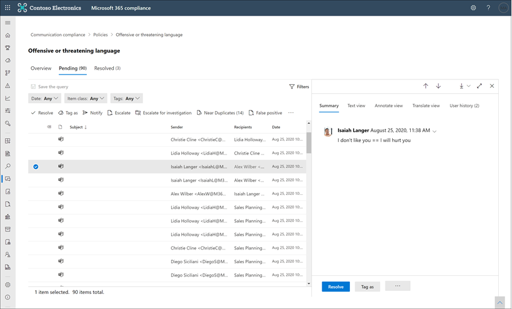

# 커뮤니케이션 규정 준수 알림 검사 및 수정Investigate and remediate communication compliance alerts

통신 준수 정책을 구성한 후에는 Microsoft 365 준수 센터에서 정책 조건과 일치 하는 메시지 문제에 대 한 알림을 수신 하기 시작 합니다.After you've configured your communication compliance policies, you'll start to receive alerts in the Microsoft 365 compliance center for message issues that match your policy conditions. 워크플로 지침에 따라 경고 문제를 조사 하 고 수정 합니다.Follow the workflow instructions here to investigate and remediate alert issues.

## 알림 조사Investigate alerts

정책에서 감지한 문제를 조사 하는 첫 번째 단계는 Microsoft 365 준수 센터에서 통신 준수 알림을 검토 하는 것입니다.The first step to investigate issues detected by your policies is to review communication compliance alerts in the Microsoft 365 compliance center. 통신 준수 솔루션 영역에는 경고 그룹화를 보는 방법에 따라 알림을 빠르게 조사 하는 데 도움이 되는 몇 가지 영역이 있습니다.There are several areas in the communication compliance solution area to help you to quickly investigate alerts, depending on how you prefer to view alert grouping:

- **통신 준수 정책 페이지**: [https://compliance.microsoft.com](https://compliance.microsoft.com) Microsoft 365 조직의 관리자 계정에 대 한 자격 증명을 사용 하 여 로그인 할 때 통신 준수 **정책** 페이지를 표시 하려면 **통신 준수** 를 선택 합니다.**Communication compliance policy page**: When you sign in to [https://compliance.microsoft.com](https://compliance.microsoft.com) using credentials for an admin account in your Microsoft 365 organization, select **Communication compliance** to display the communication compliance **Policy** page. 이 페이지에는 Microsoft 365 조 직에 대해 구성 된 통신 준수 정책과 권장 정책 서식 파일에 대 한 링크가 표시 됩니다.This page displays communication compliance policies configured for your Microsoft 365 organization and links to recommended policy templates. 나열 된 각 정책에는 검토 해야 하는 알림 개수, 에스컬레이션 및 확인 된 항목의 수 및 정책의 현재 상태가 포함 되어 있습니다.Each policy listed includes the count of alerts that need review, the number of escalated and resolved items, and the current status of the policy. 정책을 선택 하면 해당 정책에 대 한 일치 하는 모든 보류 중인 알림이 표시 되 고, 정책 세부 정보 페이지를 시작할 특정 알림을 선택 하 고, 재구성 작업을 시작할 수 있습니다.Selecting a policy displays all the pending alerts for matches to the policy, select a specific alert to launch the policy details page and to start remediation actions.
- **알림**: **Communication compliance**  >  정책 일치 별로 그룹화 된 알림의 마지막 30 일을 표시 하려면 통신 준수 **경고** 로 이동 합니다.**Alerts**: Navigate to **Communication compliance** > **Alerts** to display the last 30 days of alerts grouped by policy matches. 이 보기를 사용 하면 심각도 별로 순서가 지정 된 대부분의 알림을 생성 하는 통신 준수 정책을 빠르게 확인할 수 있습니다.This view allows you to quickly see which communication compliance policies are generating the most alerts ordered by severity. 업데이트 관리 작업을 시작 하려면 해당 알림과 연결 된 정책을 선택 하 여 **정책 세부 정보** 페이지를 시작 합니다.To start remediation actions, select the policy associated with the alert to launch the **Policy details** page. **정책 세부 정보** 페이지에서 **개요** 페이지의 작업 요약을 검토 하 고, **보류 중인** 페이지에서 경고 메시지를 검토 및 작동 하거나, **확인** 된 페이지에서 닫힌 알림의 기록을 검토할 수 있습니다.From the **Policy details** page, you can review a summary of the activities on the **Overview** page, review and act on alert messages on the **Pending** page, or review the history of closed alerts on the **Resolved** page.
- **보고서**: 통신 준수 보고서를 표시 하는 **통신 준수**  >  **보고서** 로 이동 합니다.**Reports**: Navigate to **Communication compliance** > **Reports** to display communication compliance report widgets. 각 위젯은 정책 일치 및 재구성 작업에 대 한 심층적 정보에 대 한 액세스를 포함 하 여 통신 준수 작업 및 상태에 대 한 개요를 제공 합니다.Each widget provides an overview of communication compliance activities and statuses, including access to deeper insights about policy matches and remediation actions.

### 필터 사용Using filters

다음 단계는 알림을 쉽게 조사할 수 있도록 메시지를 정렬 하는 것입니다.The next step is to sort the messages so that it's easier for you to investigate alerts. 통신 준수는 정책 **세부 정보** 페이지에서 여러 메시지 필드에 대 한 다단계 필터링을 지원 하 여 정책 일치 항목이 있는 메시지를 빠르게 조사 하 고 검토할 수 있도록 합니다.From the **Policy details** page, communication compliance supports multi-level filtering for several message fields to help you quickly investigate and review messages with policy matches. 구성 된 각 정책에 대해 보류 중인 항목과 확인 된 항목에 대해 필터링을 사용할 수 있습니다.Filtering is available for pending and resolved items for each configured policy. 정책에 대 한 필터 쿼리를 구성 하거나, 각 특정 정책에서 사용 하도록 사용자 지정 및 기본 필터 쿼리를 구성 하 고 저장할 수 있습니다.You can configure filter queries for a policy or configure and save custom and default filter queries for use in each specific policy. 필터에 대 한 필드를 구성한 후에는 특정 필터 값에 대해 구성할 수 있는 경고 메시지 큐의 맨 위에 필터 필드가 표시 됩니다.After configuring fields for a filter, you'll see the filter fields displayed on the top of the alert message queue that you can configure for specific filter values.

전체 필터 및 필드 세부 정보 목록은 기능 참조 문서의 [필터](communication-compliance-feature-reference.md#filters) 를 참조 하십시오.For a complete list of filters and field details, see [Filters](communication-compliance-feature-reference.md#filters) in the feature reference article.

#### 필터를 구성 하려면To configure a filter

1. [https://compliance.microsoft.com](https://compliance.microsoft.com)Microsoft 365 조직의 관리자 계정에 대 한 자격 증명을 사용 하 여 로그인 합니다.Sign into [https://compliance.microsoft.com](https://compliance.microsoft.com) using credentials for an admin account in your Microsoft 365 organization.

2. Microsoft 365 준수 센터에서 **통신 준수** 로 이동 합니다.In the Microsoft 365 compliance center, go to **Communication compliance**.

3. **정책 탭을** 선택한 다음 조사할 정책을 선택 하 고 **정책** 페이지를 두 번 클릭 하 여 엽니다.Select the **Policies** tab and then select a policy for investigation, double-click to open the **Policy** page.

4. **정책** 페이지에서 **보류 중** 또는 **해결 됨** 탭을 선택 하 여 필터링 할 항목을 표시 합니다.On the **Policy** page, select either the **Pending** or **Resolved** tab to display the items for filtering.

5. **필터** 컨트롤을 선택 하 여 **필터** 세부 정보 페이지를 엽니다.Select the **Filters** control to open the **Filters** details page.

6. 이 경고에 대 한 필터를 사용 하도록 설정 하려면 확인란을 하나 이상 선택 합니다.Select one or more checkboxes to enable filters for these alerts. *날짜*, *보낸 사람*, *제목/제목*, *분류자* 등을 비롯 한 다양 한 필터에서 선택할 수 있습니다.You can choose from numerous filters, including *Date*, *Sender*, *Subject/Title*, *Classifiers*, and more.

7. 선택한 필터를 기본 필터로 저장 하려면 **기본값으로 저장** 을 선택 합니다.If you'd like to save the filter selected as the default filter, select **Save as default**. 이 필터를 저장 된 필터로 사용 하려면 **완료** 를 선택 합니다.If you want to use this filter as a saved filter, select **Done**.

8. 선택한 필터를 필터 쿼리로 저장 하려면 필터 값을 하나 이상 구성한 후 **쿼리 컨트롤 저장** 을 선택 합니다.If you'd like to save the selected filters as a filter query, select **Save the query** control after you've configured at least one filter value. 필터 쿼리의 이름을 입력 하 고 **저장** 을 선택 합니다.Enter a name for the filter query and select **Save**. 이 필터는이 정책에만 사용할 수 있으며 **필터** 세부 정보 페이지의 **저장 된 필터 쿼리** 섹션에 나열 됩니다.This filter is available to use for only this policy and is listed in the **Saved filter queries** section of the **Filters** details page.

    

### 유사 및 정확히 중복 분석 사용Using near and exact duplicate analysis

통신 준수 정책은 추가 구성 단계를 수행 하지 않고 근거리 및 정확히 메시지 복제를 자동으로 검색 하 고 사전 그룹화 합니다.Communication compliance policies automatically scan and pre-group near and exact message duplicates without any additional configuration steps. 이 보기를 사용 하면 유사한 메시지를 일대일 또는 그룹으로 빠르게 처리 하 여 검토자에 대 한 메시지 조사 부담을 줄일 수 있습니다.This view allows you to quickly act on similar messages one-by-one or as a group, reducing the message investigation burden for reviewers. 중복 항목이 검색 됨에 따라 업데이트 관리 작업 도구 모음에는 **거의 중복** 및/또는 **정확히 중복** 되는 컨트롤이 표시 됩니다.As duplicates are detected, the **Near Duplicates** and/or the **Exact Duplicates** controls are displayed in the remediation action toolbar. 근접 했거나 정확 하 게 중복을 찾을 수 없는 경우에는이 보기를 사용 하지 않습니다.This view isn't available if near or exact duplicates aren't found.

#### 중복 항목을 수정 하려면To remediate duplicates

1. [https://compliance.microsoft.com](https://compliance.microsoft.com)Microsoft 365 조직의 관리자 계정에 대 한 자격 증명을 사용 하 여 로그인 합니다.Sign into [https://compliance.microsoft.com](https://compliance.microsoft.com) using credentials for an admin account in your Microsoft 365 organization.

2. Microsoft 365 준수 센터에서 **통신 준수** 로 이동 합니다.In the Microsoft 365 compliance center, go to **Communication compliance**.

3. **정책 탭을** 선택한 다음 조사할 정책을 선택 하 고 **정책** 페이지를 두 번 클릭 하 여 엽니다.Select the **Policies** tab and then select a policy for investigation, double-click to open the **Policy** page.

4. **정책** 페이지에서 **보류 중** 또는 **해결 됨** 탭을 선택 하 여 중복 메시지를 표시 합니다.On the **Policy** page, select either the **Pending** or **Resolved** tab to display duplicate messages.

5. 중복 된 항목 페이지를 열려면 **거의 중복** 또는 **정확히 복제** 컨트롤을 선택 합니다.Select the **Near Duplicates** or **Exact Duplicates** controls to open the duplicates details page.

6. 이러한 메시지에 대 한 업데이트 관리 작업 컨트롤에 대 한 메시지를 하나 이상 선택 합니다.Select one or more messages to remediation action controls for these messages.

7. **확인**, **알림**, **승격** 또는 **다운로드** 를 선택 하 여 작업을 선택한 중복 메시지에 기본 필터로 적용 합니다.Select **Resolve**, **Notify**, **Escalate**, or **Download** to apply the action to the selected duplicate messages as the default filter.

8. 메시지에 대 한 재구성 작업을 완료 한 후 **닫기를** 선택 합니다.Select **Close** after completing the remediation actions on the messages.

    

## 알림 수정Remediate alerts

경고를 검토 하거나 구성한 필터링을 시작 하는 위치에 관계 없이 다음 단계는 경고를 수정 하기 위한 작업을 수행 하는 것입니다.No matter where you start to review alerts or the filtering you configure, the next step is to take action to remediate the alert. **정책** 또는 **알림** 페이지에서 다음 워크플로를 사용 하 여 알림 수정을 시작 합니다.Start your alert remediation using the following workflow on the **Policy** or **Alerts** pages.

### 1 단계: 메시지 기본 사항 검사Step 1: Examine the message basics

 원본 또는 주체가 메시지를 즉시 수정할 수 있다는 명백한 경우도 있습니다.Sometimes it's obvious from the source or subject that a message can be immediately remediated. 메시지가 의사 이거나 정책에 잘못 일치 하거나 가양성으로 확인 되어야 할 수 있습니다.It may be that the message is spurious or incorrectly matched to a policy and it should be resolved as a false positive. **허위 긍정** 컨트롤을 선택 하 여 경고를 즉시 해결 하 고 대기 중인 경고 큐에서 제거 합니다.Select the **False Positive** control to immediately resolve the alert and remove from the pending alert queue. 원본 또는 보낸 사람 정보에서 이러한 상황에서 메시지를 라우팅하거나 처리 하는 방법을 이미 알고 있을 수 있습니다.From the source or sender information, you may already know how the message should be routed or handled in these circumstances. 해당 하는 메시지에 태그를 지정 하거나 지정 된 검토자에 게 메시지를 보내려면 **태그** 또는 **에스컬레이션** 컨트롤을 사용 하는 것이 좋습니다.Consider using the **Tag as** or **Escalate** controls to assign a tag to applicable messages or to send messages to a designated reviewer.

### 2 단계: 메시지 세부 정보 확인Step 2: Examine the message details

메시지 기본 사항을 검토 한 후에는 메시지를 열어 세부 정보를 확인 하 고 추가 수정 작업을 확인 해야 합니다.After reviewing the message basics, it's time to open a message to examine the details and to determine further remediation actions. 메시지를 선택 하 여 전체 메시지 헤더 및 본문 정보를 확인 합니다.Select a message to view the complete message header and body information. 적절 한 작업 과정을 결정 하는 데 도움이 되는 다양 한 보기를 사용할 수 있습니다.Several different views are available to help you decide the proper course of action:

- **원본 보기**:이 보기는 대부분의 웹 기반 메시징 플랫폼에서 일반적으로 표시 되는 표준 메시지 보기입니다.**Source view**: This view is the standard message view commonly seen in most web-based messaging platforms. 머리글 정보의 형식은 표준 스타일로 지정 되며 메시지 본문은 내장 된 그래픽 파일과 단어 줄 바꿈 텍스트를 지원 합니다.The header information is formatted in the normal style and the message body supports imbedded graphic files and word-wrapped text.
- **텍스트 보기**: 텍스트 보기에는 메시지의 줄 번호 텍스트 전용 보기가 표시 되며, 연결 된 통신 준수 정책에서 일치 하는 용어에 대 한 메시지 및 첨부 파일의 키워드 강조 표시가 포함 됩니다.**Text view**: Text view displays a line-numbered text-only view of the message and includes keyword highlighting in messages and attachments for terms matched in the associated communication compliance policy. 키워드 강조 표시는 원하는 영역에 대 한 긴 메시지 및 첨부 파일을 신속 하 게 검색 하는 데 도움이 됩니다.Keyword highlighting can help you quickly scan long messages and attachments for the area of interest. 경우에 따라 강조 표시 된 텍스트는 정책 조건과 일치 하는 메시지에 대해서만 첨부 파일에 있을 수 있습니다.In some cases, highlighted text may be only in attachments for messages matching policy conditions. 포함 된 파일은 표시 되지 않으며 줄 번호 매기기 보기는 여러 검토자 간의 관련 세부 정보를 참조 하는 데 유용 합니다.Embedded files aren't displayed and the line numbering this view is helpful for referencing pertinent details among multiple reviewers.
- **주석 보기**:이 보기를 사용 하면 검토자가 메시지 보기에 저장 되는 메시지에 직접 주석을 추가할 수 있습니다.**Annotate view**: This view allows reviewers to add annotations directly on the message that are saved to the view of the message.
- **사용자 기록**: 사용자 기록 보기에는 메시지를 보내는 사용자에 대 한 통신 준수 정책에 의해 생성 되는 다른 모든 알림이 표시 됩니다.**User history**: User history view displays all other alerts generated by any communication compliance policy for the user sending the message.
- **메시지 정보 보기**: 메시지 메타 데이터 및 구성 정보의 고급 보기입니다.**Message detail view**: Advanced view of message metadata and configuration information.
- **패턴 감지 알림 (미리 보기)**: 시간에 따라 작업이 많고, 사용자에의 한 동일한 동작의 인스턴스를 포함 하는 많은 harassing 및 고 지입니다.**Pattern detected notification (preview)**: Many harassing and bullying actions over time and involve reoccurring instances of the same behavior by a user. *패턴 감지* 알림이 알림 세부 정보에 표시 되 고 경고에 대 한 주의가 발생 합니다.The *Pattern detected* notification is displayed in the alert details and raises attention to the alert. 패턴 검색은 정책을 기준으로 하며, 보낸 사람이 두 개 이상의 메시지를 동일한 받는 사람에 게 보내는 경우 지난 30 일 동안 동작을 평가 합니다.Detection of patterns is on a per-policy basis and evaluates behavior over the last 30 days when at least two messages are sent to the same recipient by a sender. Investigators 및 검토자는이 알림을 사용 하 여 경고를 적절 하 게 평가 하는 반복적인 동작을 식별할 수 있습니다.Investigators and reviewers can use this notification to identify repeated behavior to evaluate the alert as appropriate.

    

### 3 단계: 업데이트 관리 작업 결정Step 3: Decide on a remediation action

경고에 대 한 메시지의 세부 정보를 검토 했으므로 다음과 같은 몇 가지 수정 작업을 선택할 수 있습니다.Now that you've reviewed the details of the message for the alert, you can choose several remediation actions:

- **해결**: **확인** 컨트롤을 선택 하면 **보류 중인 알림** 큐에서 메시지가 즉시 제거 되며 메시지에 대 한 추가 작업을 수행할 수 없습니다.**Resolve**: Selecting the **Resolve** control immediately removes the message from the **Pending alerts** queue and no further action can be taken on the message. **확인** 을 선택 하면 추가 분류 없이 알림을 종료 했으며 추가 작업을 위해 다시 열 수 없습니다.By selecting **Resolve**, you've essentially closed the alert without further classification and it can't be reopened for further actions. 확인 된 모든 메시지는 **확인 됨** 탭에 표시 됩니다.All resolved messages are displayed in the **Resolved** tab.
- **가양성**: 메시지 검토 워크플로가 진행 되는 동안 언제 든 지 항상 가양성으로 메시지를 확인할 수 있습니다.**False Positive**: You can always resolve a message as a false positive at any point during the message review workflow. 가양성은 경고가 실행 가능 하지 않거나 경고 프로세스에 의해 알림이 잘못 생성 되었음을 나타냅니다.False positive signifies that the alert was non-actionable or that the alert was incorrectly generated by the alerting process. 메시지를 다시 열 수 없으며 모든 거짓 긍정 메시지가 **확인 됨** 탭에 표시 됩니다.The message cannot be reopened and all false positive messages are displayed in the **Resolved** tab.
- **전원 자동화 (미리 보기)**: 전원 자동화 흐름을 사용 하 여 경고 메시지에 대 한 프로세스 작업을 자동화 합니다.**Power Automate (preview)**: Use a Power Automate flow to automate process tasks for an alert message. 기본적으로 통신 준수에는 검토자가 메시지 알림이 있는 사용자에 대 한 알림 프로세스를 자동화 하는 데 사용할 수 있는 *통신 준수 알림 흐름 템플릿이 있을 때 Notify manager* 가 포함 됩니다.By default, communication compliance includes the *Notify manager when a user has a communication compliance alert* flow template that reviewers can use to automate the notification process for users with message alerts. 통신 준수에서 전원 자동화 흐름을 만들고 관리 하는 방법에 대 한 자세한 내용은 [communication 준수 기능 참조](communication-compliance-feature-reference.md#power-automate-flows-preview) 문서를 참조 하십시오.For more information about creating and managing Power Automate flows in communication compliance, see the [Communication compliance feature reference](communication-compliance-feature-reference.md#power-automate-flows-preview) article.
- **태그 형식**: 조직의 정책 및 표준과 관련 하 *여, 비준수, 비호환* 또는 *불확실* 한 메시지로 메시지에 *태그를 사용* 합니다.**Tag as**: Tag the message as *compliant*, *non-compliant*, or as *questionable* as it relates to the policies and standards for your organization. 태그와 태그 지정 주석을 추가 하면 에스컬레이션 또는 다른 내부 검토 프로세스의 일부로 서 정책 알림을 마이크로 필터링 할 수 있습니다.Adding tags and tagging comments helps you micro-filter policy alerts for escalations or as part of other internal review processes. 태깅이 완료 된 후에는 메시지를 확인 하 여 보류 중인 검토 큐에서이를 이동할 수도 있습니다.After tagging is complete, you can also choose to resolve the message to move it out of the pending review queue.
- **Notify**: **notify** 컨트롤을 사용 하 여 사용자 지정 공지 템플릿을 알림에 할당 하 고 사용자에 게 경고 알림을 보낼 수 있습니다.**Notify**: You can use the **Notify** control to assign a custom notice template to the alert and to send a warning notice to the user. **통신 준수 설정** 영역에서 구성 된 적절 한 알림 서식 파일을 선택 하 고 **보내기를** 선택 하 여 메시지를 보낸 사용자에 게 미리 알림을 전자 메일로 보내고 문제를 해결 합니다.Choose the appropriate notice template configured in the **Communication compliance settings** area and select **Send** to email a reminder to the user that sent the message and to resolve the issue.
- **에스컬레이션**: **에스컬레이션** 컨트롤을 사용 하 여 조직 내에서 메시지를 검토할 사용자를 선택할 수 있습니다.**Escalate**: Using the **Escalate** control, you can choose who else in your organization should review the message. 통신 준수 정책에 구성 된 검토자 목록에서 메시지 경고에 대 한 추가 검토를 요청 하는 전자 메일 알림을 보내도록 선택 합니다.Choose from a list of reviewers configured in the communication compliance policy to send an email notification requesting additional review of the message alert. 선택한 검토자는 전자 메일 알림의 링크를 사용 하 여 검토용으로 전달 된 항목으로 직접 이동할 수 있습니다.The selected reviewer can use a link in the email notification to go directly to items escalated to them for review.
- **조사를 위해 에스컬레이션**: **조사를 위해 에스컬레이션** 제어를 사용 하 여 단일 또는 여러 메시지에 대 한 새로운 [고급 eDiscovery 사례](overview-ediscovery-20.md) 를 만들 수 있습니다.**Escalate for investigation**: Using the **Escalate for investigation** control, you can create a new [Advanced eDiscovery case](overview-ediscovery-20.md) for single or multiple messages. 새 사례에 대 한 이름 및 메모를 제공 하 고 정책과 일치 하는 메시지를 보낸 사용자가 사례 custodian 자동으로 할당 됩니다.You'll provide a name and notes for the new case, and user who sent the message matching the policy is automatically assigned as the case custodian. 사례를 관리 하기 위한 추가 권한은 필요 하지 않습니다.You don't need any additional permissions to manage the case. 사례를 만들어도 메시지에 대 한 새 태그가 확인 되거나 만들어지지 않습니다.Creating a case does not resolve or create a new tag for the message. 업데이트 관리 프로세스 중에 고급 eDiscovery 사례를 만들 때 총 100 메시지를 선택할 수 있습니다.You can select a total of 100 messages when creating an Advanced eDiscovery case during the remediation process. 통신 준수에 의해 모니터링 되는 모든 통신 채널의 메시지가 지원 됩니다.Messages in all communication channels monitored by communication compliance are supported. 예를 들어 사용자의 새 고급 eDiscovery 사례를 열면 50 Microsoft 팀 채팅, 25 Exchange Online 전자 메일 메시지 및 25 Yammer 메시지를 선택할 수 있습니다.For example, you could select 50 Microsoft Teams chats, 25 Exchange Online email messages, and 25 Yammer messages when you open a new Advanced eDiscovery case for a user.
- **분류 기능 개선 (미리 보기)**: 분류자 형식 일치에서 생성 되는 경고는 조직에서 가양성을 최소화 하기 위해 피드백을 받아야 할 수 있습니다.**Improve classification (preview)**: Alerts created from classifier type matches may need feedback to help minimize false positives in your organization. 향상 된 **분류** 제어를 사용 하 여 통신 준수 분류가 유효한 경우 의견을 제공 하거나이 일치 유형에 대해 다른 trainable 분류자를 제안할 수 있습니다.Use the **Improve classification** control to provide feedback on if the communication compliance classification is valid or to suggest other trainable classifiers for this type of match. 해당 분류자가 *일치* 하는지 또는 *일치 하지* 않는지 확인 하거나 나중에이 유형의 경고 활동에 연결할 다른 trainable 분류자를 제안할 수 있습니다.You can confirm that the classifiers are either a *Match* or *Not a match*, or suggest other trainable classifiers to associate with this type of alert activity in the future.

    1. 경고 목록에서 메시지를 선택 합니다.Select a message from the alert list.
    2. 줄임표 (...)를 선택 하 고 **분류 개선을** 선택 합니다.Choose the ellipsis and select **Improve classification**.
    3. **자세한 분류자 피드백** 창에서 항목이 true 양수인 경우 **일치** 를 선택 합니다.In the **Detailed classifier feedback** pane, if the item is a true positive, choose **Match**.  항목이 잘못 된 범주에 가양성으로 포함 된 경우 일치 하는 항목을 선택 **하지 않습니다**.If the item was incorrectly included in the category as a false positive, choose **Not a match**.
    4. 항목에 더 적합 한 다른 분류자가 있으면 **다른 trainable 분류자 추천** 목록에서 선택 합니다.If there is another classifier that would be more appropriate for the item, choose it from the **Suggest other trainable classifiers** list. 이 피드백은 다른 분류자를 트리거하여 항목을 평가 합니다.This feedback triggers the other classifier to evaluate the item.

    > [!TIP]
    > 여러 항목을 선택 하 고 명령 모음에서 **자세한 피드백 제공** 을 선택 하 여 동시에 한 사용자에 게 피드백을 제공할 수 있습니다.You can provide feedback on multiple items simultaneously by choosing them all and then choosing **Provide detailed feedback** in the command bar.

    5. 일치 분류를 전송 **하지 않고** 일치 하는 **항목** 에 대 한 평가를 보내 다른 trainable 분류자를 추천 하려면 **의견 보내기를** 선택 합니다.Choose **Send feedback** to send your evaluation of the **Match** and **Not a match** classifications and suggest other trainable classifiers. 분류자에 의견의 30 개를 제공 하면 자동으로 retrains.When you've provided 30 instances of feedback to a classifier, it automatically retrains. 재교육을 완료 하는 데 1-4 시간이 걸릴 수 있습니다.Retraining may take 1-4 hours to complete. 분류자는 하루에 한 번만 retrained 수 있습니다.Classifiers can only be retrained twice per day.

    > [!IMPORTANT]
    > 이 정보는 테 넌 트의 분류자로 이동 되며 **Microsoft로 돌아가지** 않습니다.This information goes to the classifier in your tenant, **it does not go back to Microsoft**.

    통신 준수를 위한 재교육 분류자에 대 한 자세한 내용은 [communications 준수 문서에서 분류자를 재교육 하는 방법](classifier-how-to-retrain-comms-compliance.md) 를 참조 하십시오.To learn more about retraining classifier for communication compliance, see the [How to retrain a classifier in communications compliance](classifier-how-to-retrain-comms-compliance.md) article.

    

- **팀에서 메시지 제거**: **팀에서 메시지 제거** 컨트롤을 사용 하 여 Microsoft 팀 채널 및 1:1 및 그룹 채팅의 경고에서 식별 된 부적절 한 메시지와 콘텐츠를 차단할 수 있습니다.**Remove message in Teams**: Using the **Remove message in Teams** control, you can block inappropriate messages and content identified in alerts from Microsoft Teams channels and 1:1 and group chats. 제거 된 메시지 및 콘텐츠는 해당 메시지가 차단 되었음을 설명 하는 정책 팁으로 바뀌고 보기에서 제거 되는 정책이 적용 됩니다.Removed messages and content are replaced with a policy tip that explains that it is blocked and the policy that applies to its removal from view. 적용 가능한 정책 및 검토 프로세스에 대해 자세히 알아보려면 정책 팁의 링크를 제공 합니다.Recipients are provided a link in the policy tip to learn more about the applicable policy and the review process. 보낸 사람은 차단 된 메시지 및 콘텐츠에 대 한 정책 팁을 받으며 차단 되는 메시지에 대 한 세부 정보 및 제거에 대 한 컨텍스트 내용을 검토할 수 있습니다.The sender receives a policy tip for the blocked message and content but can review the details of the blocked message and content for context regarding the removal.

    

### 4 단계: 통신 준수 외부에서 메시지 세부 정보를 보관 해야 하는지 확인Step 4: Determine if message details should be archived outside of communication compliance

별도의 저장소 솔루션에 메시지를 보관 해야 하는 경우 메시지 정보를 내보내거나 다운로드할 수 있습니다.Message details can be exported or downloaded if you need to archive the messages in a separate storage solution. **다운로드** 컨트롤을 선택 하면 선택한 메시지가에 자동으로 추가 됩니다. Microsoft 365 외부의 저장소에 저장할 수 있는 ZIP 파일입니다.Selecting the **Download** control automatically adds selected messages to a .ZIP file that can be saved to storage outside of Microsoft 365.
