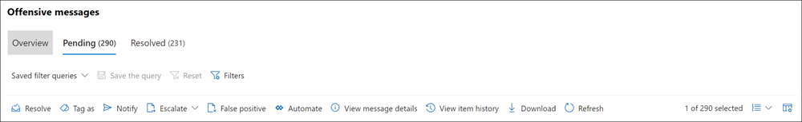

# 커뮤니케이션 규정 준수 알림 검사 및 수정

통신 준수 정책을 구성한 후 정책 조건과 일치하는 메시지 문제에 대한 Microsoft 365 규정 준수 센터 알림을 받기 시작할 수 있습니다. 여기에 있는 워크플로 지침에 따라 경고 문제를 조사하고 해결합니다.

## 경고 조사

정책에서 감지된 문제를 조사하는 첫 번째 단계는 정책에서 통신 준수 경고를 검토하는 Microsoft 365 규정 준수 센터. 알림 그룹화의 선호 방식에 따라 알림을 빠르게 조사하는 데 도움이 되는 커뮤니케이션 규정 준수 솔루션 영역에는 몇 가지 영역이 있습니다.

- **통신 준수 정책 페이지:** Microsoft 365 조직에서 관리자 계정의 자격 증명을 사용하여 로그인할 때 통신 준수를 선택하여 통신 준수 정책 페이지를 [https://compliance.microsoft.com](https://compliance.microsoft.com)  표시합니다.  이 페이지에는 조직에 대해 구성된 통신 준수 정책과 Microsoft 365 템플릿에 대한 링크가 표시됩니다. 나열된 각 정책에는 검토해야 하는 알림 수, 에스컬레이터 및 해결된 항목 수, 정책 상태, 마지막 정책 검사 날짜 및 시간이 포함됩니다. 정책을 선택하면 해당 정책과 일치하는 보류 중인 모든 경고를 표시할 수 있으며, 특정 경고를 선택하여 해당 정책 세부 정보 페이지를 열고, 수정 작업을 시작할 수 있습니다.
- **경고:** 커뮤니케이션 **준수** 경고로 이동하여 지난 30일 동안의 경고를 정책 일치 항목으로  >   그룹화하여 표시합니다. 이 보기를 사용하면 가장 많은 경고가 생성된 커뮤니케이션 규정 준수 정책을 심각도에 따라 나열하여 빠르게 확인할 수 있습니다. 수정 작업을 시작하려면 경고와 연결된 정책을 선택하여 정책 세부 정보 **페이지를 실행합니다.** 정책 **세부** 정보 페이지에서 개요 페이지의 활동 요약을 검토하거나 보류 중인 페이지의 경고 메시지를  검토 및 작업하거나 해결된 페이지에서 닫힌 경고 기록을 검토할 **수** 있습니다. 
- **보고서:** 통신 준수 **보고서로**  >  **이동하여** 통신 준수 보고서 위젯을 표시합니다. 각 위젯은 정책 일치 및 수정 작업에 대한 더 깊은 인사이트에 대한 액세스를 포함하여 커뮤니케이션 규정 준수 활동 및 상태에 대한 개요를 제공합니다.

### 필터 사용

다음 단계는 경고를 더 쉽게 조사할 수 있도록 메시지를 정렬하는 것입니다. 정책 **세부 정보 페이지에서** 통신 준수는 여러 메시지 필드에 대한 다단계 필터링을 지원하여 정책 일치가 있는 메시지를 빠르게 조사하고 검토할 수 있도록 합니다. 구성된 각 정책에 대해 보류 중인 항목 및 해결된 항목을 검색할 수 있도록 필터링이 제공됩니다. 정책에 대한 필터 쿼리를 구성하거나 각 특정 정책에서 사용하도록 사용자 지정 및 기본 필터 쿼리를 구성하고 저장할 수 있습니다. 필터에 대한 필드를 구성하면, 특정 필터 값에 대해 구성할 수 있는 필터 필드가 경고 메시지 큐의 상단에 표시됩니다.

날짜 필터의 경우 이벤트의 날짜와 시간은 UTC(협정 세계시)로 표시됩니다. 보기에 대한 메시지를 필터링할 때 요청하는 사용자의 로컬 날짜/시간에서 사용자의 로컬 날짜/시간을 UTC로 변환한 결과에 따라 결과가 결정됩니다. 예를 들면 다음과 같습니다. 미국 PDT(태평양 일광 절약 시간)의 사용자가 2021년 8월 30일에서 2021년 8월 31일까지 보고서를 00:00시에 필터하는 경우 보고서에는 2021년 8월 30일 07:00 UTC에서 8/31/2021 07:00 UTC까지의 메시지가 포함됩니다. 00:00으로 필터링할 때 동일한 사용자가 EDT(동부 일광 절약 시간)에 있는 경우 보고서에는 2021년 8월 30일 04:00 UTC에서 2021/8/31 04:00 UTC까지의 메시지가 포함됩니다.

필터 및 필드 세부 정보의 전체 목록은 기능 참조 [문서의 필터를](communication-compliance-feature-reference.md#filters) 참조하세요.

#### 필터를 구성하기 위해

1. 조직에서 관리자 계정의 자격 [https://compliance.microsoft.com](https://compliance.microsoft.com) 증명을 사용하여 Microsoft 365 로그인합니다.

2. 다음 Microsoft 365 규정 준수 센터 통신 준수 **로 이동합니다.**

3. 정책 **탭을** 선택한 다음 조사용 정책을 선택하고 두 번 클릭하여 정책 페이지를 **열** 수 있습니다.

4. 정책 **페이지에서** 보류 중  또는 해결된 탭을 선택하여 필터링할 항목을 표시합니다. 

5. 필터 **컨트롤을 선택하여** **필터** 세부 정보 페이지를 열 수 있습니다.

6. 이러한 경고에 대해 필터를 사용하도록 설정하려면 하나 이상의 확인란을 선택합니다. 날짜, 보낸 사람,  *제목/제목,* 분류자, 언어 등을 비롯한 다양한 필터에서 선택할 *수* 있습니다. 

7. 선택한 필터를 기본 필터로 저장하려면 기본 필터로 **저장을 선택합니다.** 이 필터를 저장된 필터로 사용하려면 완료 를 **선택합니다.**

8. 선택한 필터를 필터 쿼리로 저장하려면 필터 값을  하나 이상 구성한 후 쿼리 컨트롤 저장을 선택합니다. 필터 쿼리의 이름을 입력하고 저장을 **선택합니다.** 이 필터는 해당 정책에만 사용할 수 있으며 필터 세부 정보 페이지의 **저장된** 필터 쿼리 **섹션에** 나열됩니다.

    

### 중복에 가까운 항목 및 정확히 중복된 항목 분석 사용

커뮤니케이션 규정 준수 정책은 추가 구성 단계 없이 중복에 가까운 메시지와 정확히 중복된 메시지를 자동으로 검사하고 사전에 그룹화합니다. 이 보기를 사용하면 유사한 메시지를 일대일 또는 그룹으로 신속하게 처리하여 검토자에 대한 메시지 조사 부담을 줄일 수 있습니다. 중복 항목이 감지되면 **거의 중복** 및/또는 **정확히 중복** 컨트롤이 수정 작업 도구 모음에 표시됩니다. 이 보기는 거의 또는 정확한 중복 항목을 찾을 수 없는 경우 사용할 수 없습니다.

#### 중복 항목을 수정

1. 조직에서 관리자 계정의 자격 [https://compliance.microsoft.com](https://compliance.microsoft.com) 증명을 사용하여 Microsoft 365 로그인합니다.

2. 다음 Microsoft 365 규정 준수 센터 통신 준수 **로 이동합니다.**

3. 정책 **탭을** 선택한 다음 조사용 정책을 선택하고 두 번 클릭하여 정책 페이지를 **열** 수 있습니다.

4. 정책 **페이지에서** 보류 중  또는 해결된 탭을 선택하여 중복 메시지를 표시합니다. 

5. 중복에 **가까운 컨트롤** 또는 정확히 **중복** 컨트롤을 선택하여 중복 세부 정보 페이지를 열 수 있습니다.

6. 하나 이상의 메시지를 선택하여 이러한 메시지에 대한 수정 작업 컨트롤을 선택합니다.

7. **확인,** **알림,** **에스컬레이터** 또는 다운로드를 선택하여 선택한 중복 메시지에 작업을 기본 필터로 적용합니다. 

8. 메시지에 **대한** 수정 작업을 완료한 후 닫기 를 선택합니다.

    

## 경고 수정

경고 검토나 구성 필터링을 검토하기 시작하는 위치와 상관없이 다음 단계는 경고를 수정하기 위한 조치를 취하는 것입니다. 정책 또는 알림 페이지에서 다음 워크플로를  사용하여 경고 **수정을** 시작하세요.

### 1단계: 메시지 기본 사항 검사

 원본이나 제목에서 메시지를 즉시 수정할 수 있는 것이 분명한 경우도 있습니다. 메시지가 정책에 의심스러우거나 잘못 일치할 수 있으며 잘못된 것으로 해결해야 할 수 있습니다. 잘못분류된 콘텐츠를 Microsoft와 공유하려면 Report **as misclassified** control(잘못 배포된 컨트롤로 보고)을 선택하고 경고를 즉시 해결한 다음 보류 중인 경고 큐에서 제거합니다. 이러한 상황에서는 원본 또는 보낸 사람 정보를 토대로 해당 메시지를 어떻게 라우팅할지 또는 처리할지 판단이 가능할 수 있습니다. **태그 지정** 또는 **에스컬레이션** 제어를 사용하여, 해당 메시지에 태그를 할당하거나 지정된 검토자에게 메시지를 보내는 방안을 고려할 수도 있습니다.

### 2단계: 메시지 세부 정보 검사

메시지 기본 사항을 검토한 후 메시지를 열어 세부 정보를 검토하고 추가 수정 작업을 결정해야 합니다. 메시지를 선택하여 전체 메시지 헤더 및 본문 정보를 확인합니다. 적절한 작업 과정을 결정하는 데 도움이 되는 여러 가지 옵션 및 보기를 사용할 수 있습니다.

- **첨부 파일:** 이 옵션을 사용하면 정책 조건과 일치하는 최신 첨부 파일을 검사할 수 있습니다. 최신 첨부 파일 콘텐츠는 텍스트로 추출되어 정책에 대한 보류 중인 알림 대시보드에서 볼 수 있습니다. 자세한 내용은 통신 준수 기능 참조 [를 참조하세요.](/microsoft-365/compliance/communication-compliance-feature-reference#supported-communication-types)
- **원본:** 이 보기는 대부분의 웹 기반 메시징 플랫폼에서 일반적으로 볼 수 있는 표준 메시지 보기입니다. 헤더 정보의 형식은 일반 스타일로 지정되어 있으며 메시지 본문은 imbedded 그래픽 파일과 단어 줄 바꿈 텍스트를 지원합니다. [정책에 대해 OCR(광학](communication-compliance-feature-reference.md#optical-character-recognition-ocr) 문자 인식)을 사용하도록 설정하면 정책 조건부와 일치하는 인쇄 또는 필기 텍스트가 포함된 이미지가 이 보기에서 연결된 메시지의 하위 항목으로 표시됩니다.
- **일반 텍스트:** 텍스트 보기는 메시지의 줄 번호가 매기기 텍스트 전용 보기를 표시하며 관련 통신 준수 정책에서 일치하는 중요한 정보 유형 용어 또는 키워드에 대한 메시지 및 첨부 파일에 키워드 강조 표시를 포함합니다. 키워드 강조 표시는 긴 메시지와 첨부 파일을 관심 영역으로 빠르게 검색하는 데 도움이 될 수 있습니다. 경우에 따라 강조 표시된 텍스트는 정책 조건과 일치하는 메시지의 첨부 파일에만 있을 수 있습니다. 키워드 강조 표시는 정책에 할당된 기본 제공 분류자에 의해 식별되는 용어에 대해 지원되지 않습니다. 포함된 파일이 표시되지 않는 경우 이 보기의 줄 번호를 매기면 여러 검토자 사이에서 관련 세부 정보를 참조하는 데 유용합니다.
- **주석:** 이 보기를 통해 검토자는 메시지 보기에 저장된 메시지에 직접 주석을 추가할 수 있습니다. [정책에 대해 OCR을](communication-compliance-feature-reference.md#optical-character-recognition-ocr) 사용하도록 설정하면 정책 조건부와 일치하는 인쇄 또는 필기 텍스트가 포함된 이미지가 이 보기에서 연결된 메시지의 하위 항목으로 표시되어 주석으로 처리될 수 있습니다.
- **대화(미리 보기)**: Microsoft Teams 채팅 메시지에 사용할 수 있는 이 보기에는 경고 메시지 전후에 최대 5개의 메시지가 표시되어 검토자는 대화 컨텍스트에서 활동을 볼 수 있습니다. 이 컨텍스트는 검토자는 메시지를 빠르게 평가하고 보다 자세한 정보의 메시지 확인 결정을 내리는 데 도움이 됩니다. 대화에 사용할 수 있는 모든 인라인 이미지, 이모지 및 스티커를 포함하여 대화에 대한 실시간 메시지 추가가 Teams. 메시지에 대한 이미지 또는 텍스트 첨부 파일이 표시되지 않습니다. 편집된 메시지나 대화 창에서 삭제된 메시지에 대한 알림이 자동으로 표시됩니다. 메시지가 확인되면 연결된 대화 메시지가 해결된 메시지와 함께 보존되지 않습니다. 대화 메시지는 경고 메시지가 식별된 후 최대 60일 동안 사용할 수 있습니다.
- **사용자 기록**: 사용자 기록 보기는 메시지를 보내는 사용자에 대하여 커뮤니케이션 규정 준수 정책에서 생성된 기타 모든 경고를 표시됩니다.
- **패턴 검색 알림:** 시간이 지날 때 많은 괴롭히고 괴롭히는 작업을 많이 수행하며, 사용자가 동일한 동작의 인스턴스를 반복하여 반복합니다. 패턴이 *검색된* 알림은 경고 세부 정보로 표시되고 경고에 주의를 끌 수 있습니다. 패턴 검색은 정책에 따라 적용된 것으로, 보낸 사람이 같은 받는 사람에게 메시지를 두 개 이상 보내는 경우 지난 30일 동안의 동작을 평가합니다. 조사자 및 검토자는 이 알림을 사용하여 반복되는 동작을 식별하여 경고를 적절하게 평가할 수 있습니다.
- **번역:** 이 보기는 각 검토자에 대한 Microsoft 365  구독의 표시된 언어 설정에 구성된 언어로 경고 메시지 텍스트를 자동으로 변환합니다. 번역 *보기를* 사용하면 다국어 사용자가 있는 조직에 대한 조사 지원을 넓히고 통신 준수 검토 프로세스 외부에서 추가 번역 서비스가 필요하지 않습니다. Microsoft 번역 서비스를  사용하여 번역 보기를 필요한 경우 켜고 끄고 다양한 언어를 지원할 수 있습니다. 지원되는 언어의 전체 목록은 Microsoft 번역기 [참조하세요.](https://www.microsoft.com/translator/business/languages/) 번역기 목록에 나열된 언어는 번역 *보기에서 지원됩니다.* 

### 3단계: 수정 작업 결정

이제 경고에 대한 메시지의 세부 정보를 검토한 후 몇 가지 수정 작업을 선택할 수 있습니다.

- **해결:** 해결  컨트롤을 선택하면 보류 중인  경고 큐에서 메시지가 즉시 제거되어 메시지에 대해 추가 작업을 수행하지 않습니다. 확인 **을 선택하여** 추가 분류 없이 기본적으로 경고를 닫습니다. 확인된 모든 메시지가 해결된 **탭에** 표시됩니다.
- **잘못 지정된** 것으로 보고(미리 보기) : 메시지 검토 워크플로 중에 언제든지 메시지가 잘못된 것으로 확인될 수 있습니다. 잘못된 분류는 경고가 실행되지 않거나 경고 프로세스 및 학습 가능한 분류자에 의해 잘못 생성되었습니다. 항목을 잘못 분류된 것으로 확인하면 학습 가능한 분류자 개선을 위해 메시지 콘텐츠, 첨부 파일 및 메시지 제목(메타데이터 포함)이 Microsoft에 전송됩니다. Microsoft로 전송되는 데이터는 조직의 사용자를 식별하거나 식별하는 데 사용할 수 있는 정보를 포함하지 않습니다. 메시지에 대해 추가 작업을 수행할 수 없습니다. 잘못 확인된 메시지는 모두 **해결된 탭에** 표시됩니다.
- **Power Automate(미리 보기)**: Power Automate 흐름을 사용하여 경고 메시지에 대한 프로세스 작업을 자동화합니다. 기본적으로 커뮤니케이션 규정 준수에는 검토자는 메시지 경고가 있는 사용자에 대한 알림 프로세스를 자동화하는 데 사용할 수 있는 통신 준수 경고 흐름 템플릿이 사용자에게 있는 경우 관리자에게 알림이 포함됩니다.  통신 규정 준수에서 Power Automate 흐름을 만들고 관리하는 데 대한 자세한 내용은 통신 규정 준수 [기능 참조 문서를 참조하세요.](communication-compliance-feature-reference.md#power-automate-flows)
- **태그:** 메시지에 *규격,* 비호준 메시지  또는 조직의 정책 및 표준과 관련된 것으로 의심할 수 있는 것으로 태그를 지정합니다.  태그 및 태그 지정 설명을 추가하면 에스컬레이터에 대한 마이크로 필터 정책 경고 또는 다른 내부 검토 프로세스의 일부로 사용할 수 있습니다. 태그 지정이 완료되면 메시지를 확인하여 보류 중인 검토 큐에서 메시지를 이동할 수도 있습니다.
- **알림:** **알림** 컨트롤을 사용하여 경고에 사용자 지정 알림 서식 파일을 할당하고 사용자에게 경고 알림을 보낼 수 있습니다. 통신 준수 설정 영역에 구성된  적절한 알림 템플릿을 선택하고 메시지를 보낸 사용자에게 미리 알림 전자 메일로 보내기 및 문제를 해결합니다. 
- **에스컬레이터:** **에스컬레이터** 컨트롤을 사용하여 조직의 다른 사람이 메시지를 검토해야 하는지 선택할 수 있습니다. 메시지 경고의 추가 검토를 요청하는 전자 메일 알림을 보내도록 통신 준수 정책에 구성된 검토자 목록에서 선택합니다. 선택한 검토자는 전자 메일 통보의 링크를 사용하여 검토를 위해 전자 메일로 에스컬레이션된 항목으로 직접 이동할 수 있습니다.
- **조사 에스컬레이터:** 조사 제어를 위해 **에스컬레이터를** 사용하여 단일 또는 [여러](overview-ediscovery-20.md) 메시지에 Advanced eDiscovery 사례를 새로 만들 수 있습니다. 새 사례에 대한 이름과 메모를 제공하고 정책과 일치하는 메시지를 보낸 사용자는 사례 보호자로 자동으로 할당됩니다. 사례를 관리하는 데 추가 권한이 필요하지 않습니다. 사례를 만들면 메시지에 대한 새 태그가 확인되거나 생성되지 않습니다. 재구성 프로세스 중에 사례를 만들 때 총 100개 Advanced eDiscovery 수 있습니다. 통신 규정 준수에 의해 모니터링되는 모든 통신 채널의 메시지가 지원됩니다. 예를 들어 사용자에 대해 새 Microsoft Teams 사례를 열 때 50개 Microsoft Teams, Exchange Online 전자 메일 메시지 25개, Yammer 메시지 25개Advanced eDiscovery 메시지를 선택할 수 있습니다.
- **Teams** 메시지 제거: Teams 컨트롤에서 메시지 제거를 사용하면 Microsoft Teams 채널 및 1:1 및 그룹 채팅에서 경고에 식별된 부적절한 메시지와 콘텐츠를 차단할 수 있습니다.  제거된 메시지와 콘텐츠는 차단됨을 설명하는 정책 팁과 보기에서 제거에 적용되는 정책으로 대체되었습니다. 받는 사람에게 해당 정책 및 검토 프로세스에 대해 자세히 알아보는 링크가 정책 팁에 제공됩니다. 보낸 사람이 차단된 메시지 및 콘텐츠에 대한 정책 팁을 수신하지만 차단된 메시지의 세부 정보 및 제거와 관련하여 컨텍스트를 검토할 수 있습니다.

    

### 4단계: 통신 준수 외부에서 메시지 세부 정보를 보관해야 하는지 확인

메시지를 별도의 저장소 솔루션에 보관해야 하는 경우 메시지 세부 정보를 내보내거나 다운로드할 수 있습니다. **다운로드** 컨트롤을 선택하면 선택한 메시지가 자동으로 .ZIP 파일에 추가되며, 해당 파일을 저장하여 Microsoft 365 외부의 저장소에 보관할 수 있습니다.

### 메시지 확인 안 (미리 보기)

메시지가 확인되면 보류 중인 탭  보기에서 제거되고 해결된 탭 **보기에** 표시됩니다. 확인된 보기의 메시지에는 조사 및 수정 작업을 사용할 *수* 없습니다. 그러나 잘못 확인되거나 초기 해결 후 추가 조사가 필요한 메시지에 대한 추가 조치를 취해야 하는 경우도 있을 수 있습니다. 확인되지 않은 명령 기능을 사용하면 해결된 보기에서 보류 중인 보기로 하나 이상의 메시지를 *다시 이동할 수* 있습니다. 

메시지를 확인하지 않은 경우 다음 단계를 완료합니다.

1. 조직에서 Microsoft 365 규정 준수 센터 커뮤니케이션 준수 [분석가](https://compliance.microsoft.com) 또는 통신  준수 조사자  역할 그룹에 할당된 사용자의 자격 증명을 사용하여 조직에 Microsoft 365 로그인합니다.
2. 다음 Microsoft 365 규정 준수 센터 통신 준수 **로 이동합니다.**
3. 정책 **탭을** 선택한 다음 확인된 경고 메시지가 포함된 정책을 선택하고 두 번 클릭하여 정책 페이지를 **열** 수 있습니다.
4. 정책 **페이지에서** 해결된 **탭을** 선택합니다.
5. 해결된 **탭에서** 보류 중으로 다시 이동할 메시지를 하나 이상 *선택합니다.*
6. 명령 표시줄에서 **Unresolve 를 선택합니다.**
7. 확인되지 **않은** 항목 창에서 확인되지 않은 동작에 적용할 수 있는 설명을 추가하고 저장을 선택하여 항목을 다시 보류  *중으로 이동합니다.*
8. 보류 **중인 탭을** 선택하여 선택한 항목이 표시되는지 확인할 수 있습니다.
