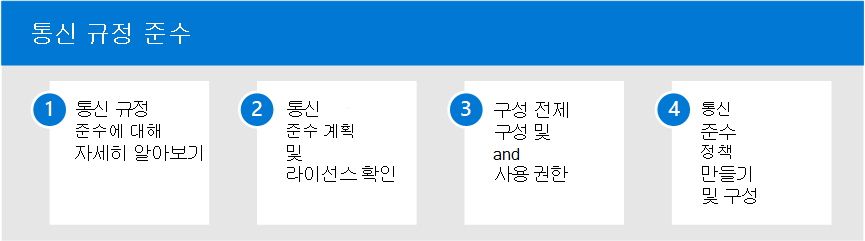

# Microsoft 365의 커뮤니케이션 규정 준수

중요한 정보를 보호하고 직장 괴롭혔던 인시던트 감지 및 대응은 내부 정책 및 표준을 준수하는 데 중요한 부분입니다. 전자 메일의 Microsoft 365 준수는 전자 메일 및 전자 메일 통신에 대한 수정 작업을 신속하게 감지, 캡처 및 조치를 취하도록 하여 이러한 위험을 최소화하는 Microsoft Teams 도움이 됩니다. 여기에는 희롱, 위협 및 괴롭히는 부적절한 커뮤니케이션과 조직 내부 및 외부의 중요한 정보를 공유하는 커뮤니케이션이 포함됩니다.

## 사용자에 대한 통신 준수 Microsoft 365

다음 단계를 사용하여 조직에 대한 통신 규정 준수를 구성합니다.

1. 정보 통신 규정 [준수에](communication-compliance.md) 대해 Microsoft 365
2. 통신 규정 [준수 계획](communication-compliance-plan.md) 및 [라이선스 확인](communication-compliance-configure.md#subscriptions-and-licensing)
3. 기능 [참조 및 솔루션 기능 검토](communication-compliance-feature-reference.md)
4. 선행 [구성 및](communication-compliance-configure.md#step-2-required-enable-the-audit-log) [사용 권한 구성](communication-compliance-configure.md#step-1-required-enable-permissions-for-communication-compliance)
5. 통신 준수 [정책 만들기 및 구성](communication-compliance-configure.md#step-5-required-create-a-communication-compliance-policy)

## 통신 규정 준수에 대한 자세한 정보

- [경고 조사 및 수정](communication-compliance-investigate-remediate.md)
- [사례 연구 - Contoso는 통신에 대한 공격적인 언어 Microsoft Teams, Exchange Yammer 구성합니다.](communication-compliance-case-study.md)