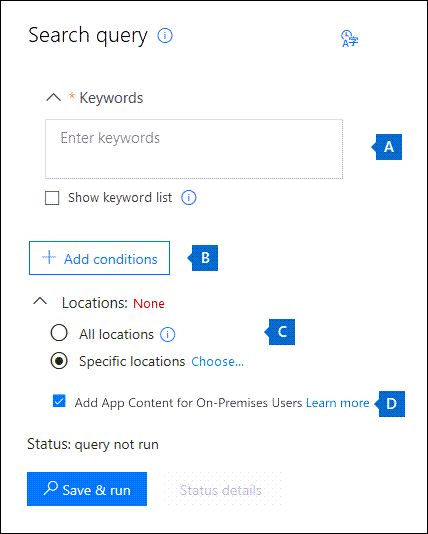

# <a name="content-search"></a><span data-ttu-id="8803c-103">콘텐츠 검색</span><span class="sxs-lookup"><span data-stu-id="8803c-103">Content Search</span></span>

<span data-ttu-id="8803c-104">Office 365 또는 Microsoft 365의 규정 준수 센터의 콘텐츠 검색 eDiscovery 도구를 사용하여 조직에서 전자 메일, 문서, 인스턴트 메시징 대화와 같은 내부 항목을 검색할 수 있습니다.</span><span class="sxs-lookup"><span data-stu-id="8803c-104">You can use the Content search eDiscovery tool in the compliance center in Office 365 or Microsoft 365 to search for in-place items such as email, documents, and instant messaging conversations in your organization.</span></span> <span data-ttu-id="8803c-105">이 도구를 사용하여 다음 서비스의 항목을 검색할 수 있습니다.</span><span class="sxs-lookup"><span data-stu-id="8803c-105">Use this tool to search for items in these services:</span></span>
  
- <span data-ttu-id="8803c-106">Exchange Online 사서함</span><span class="sxs-lookup"><span data-stu-id="8803c-106">Exchange Online mailboxes</span></span>

- <span data-ttu-id="8803c-107">SharePoint Online 사이트 및 비즈니스용 OneDrive 계정</span><span class="sxs-lookup"><span data-stu-id="8803c-107">SharePoint Online sites and OneDrive for Business accounts</span></span>

- <span data-ttu-id="8803c-108">Microsoft Teams</span><span class="sxs-lookup"><span data-stu-id="8803c-108">Microsoft Teams</span></span>

- <span data-ttu-id="8803c-109">Microsoft 365 그룹</span><span class="sxs-lookup"><span data-stu-id="8803c-109">Microsoft 365 Groups</span></span>

- <span data-ttu-id="8803c-110">Yammer 그룹</span><span class="sxs-lookup"><span data-stu-id="8803c-110">Yammer Groups</span></span>

- <span data-ttu-id="8803c-111">비즈니스용 Skype 대화</span><span class="sxs-lookup"><span data-stu-id="8803c-111">Skype for Business conversations</span></span>

<span data-ttu-id="8803c-112">콘텐츠 검색을 실행하고 나면 검색 통계에 콘텐츠 위치의 수와 예상 검색 결과 수가 표시됩니다.</span><span class="sxs-lookup"><span data-stu-id="8803c-112">After you run a Content search, the number of content locations and an estimated number of search results are displayed in the search statistics.</span></span> <span data-ttu-id="8803c-113">검색 쿼리와 일치하는 항목이 가장 많은 콘텐츠 위치와 같은 통계도 빠르게 볼 수 있습니다.</span><span class="sxs-lookup"><span data-stu-id="8803c-113">You can also quickly view statistics, such as the content locations that have the most items that match the search query.</span></span> <span data-ttu-id="8803c-114">검색을 실행한 후에는 결과를 미리 보거나 로컬 컴퓨터로 내보낼 수 있습니다.</span><span class="sxs-lookup"><span data-stu-id="8803c-114">After you run a search, you can preview the results or export them to a local computer.</span></span>

## <a name="create-a-search"></a><span data-ttu-id="8803c-115">검색 만들기</span><span class="sxs-lookup"><span data-stu-id="8803c-115">Create a search</span></span>

<span data-ttu-id="8803c-116">**콘텐츠 검색** 페이지에 액세스하여 검색을 실행하고 검색 결과를 미리 보고 내보내려면 관리자, 준수 관리자 또는 eDiscovery 구성원이 보안 및 준수 센터의 eDiscovery 매니저 역할 그룹의 구성원이어야 합니다.</span><span class="sxs-lookup"><span data-stu-id="8803c-116">To have access to the **Content search** page to run searches and preview and export search results, an administrator, compliance officer, or eDiscovery manager must be a member of the eDiscovery Manager role group in the Security & Compliance Center.</span></span> <span data-ttu-id="8803c-117">자세한 내용은 [eDiscovery 권한 할당](assign-ediscovery-permissions.md)을 참조하세요.</span><span class="sxs-lookup"><span data-stu-id="8803c-117">For more information, see [Assign eDiscovery permissions](assign-ediscovery-permissions.md).</span></span>
  
1. <span data-ttu-id="8803c-118">[https://compliance.microsoft.com](https://compliance.microsoft.com)으로 이동하여 Microsoft 전자 메일 주소와 암호를 사용해 로그인합니다.</span><span class="sxs-lookup"><span data-stu-id="8803c-118">Go to [https://compliance.microsoft.com](https://compliance.microsoft.com) and sign in using your Microsoft email address and password.</span></span>

2. <span data-ttu-id="8803c-119">Microsoft 365 규정 준수 센터의 왼쪽 탐색 창에서 **모두 표시** 를 클릭한 다음 **콘텐츠 검색** 을 클릭합니다.</span><span class="sxs-lookup"><span data-stu-id="8803c-119">In the left navigation pane of the Microsoft 365 compliance center, click **Show all**, and then click **Content search**.</span></span>
    
3. <span data-ttu-id="8803c-120">**콘텐츠 검색** 페이지에서 **새 검색** 을 클릭합니다.</span><span class="sxs-lookup"><span data-stu-id="8803c-120">On the **Content search** page, click **New search**.</span></span>
  
    <span data-ttu-id="8803c-121">다른 검색 옵션 중 하나를 선택할 수도 있습니다.</span><span class="sxs-lookup"><span data-stu-id="8803c-121">You can also choose one of the other search options:</span></span>
    
    - <span data-ttu-id="8803c-122">**검색 도우미:** 이 옵션은 검색을 생성하는 과정을 안내하는 마법사를 시작합니다.</span><span class="sxs-lookup"><span data-stu-id="8803c-122">**Guided search:** This option starts a wizard that guides you through the creating the search.</span></span> <span data-ttu-id="8803c-123">콘텐츠 위치를 선택하고 검색 쿼리를 작성하는 사용자 인터페이스는 **새 검색** 옵션과 동일합니다.</span><span class="sxs-lookup"><span data-stu-id="8803c-123">The user interface to select content locations and build the search query are the same as the **New search** option.</span></span>
    
    - <span data-ttu-id="8803c-124">**ID 목록으로 검색**: 이 옵션은 Exchange ID 목록을 사용하여 특정 전자 메일 메시지 및 기타 사서함 항목을 검색합니다.</span><span class="sxs-lookup"><span data-stu-id="8803c-124">**Search by ID list:** This option lets you search for specific email messages and other mailbox items using a list of Exchange IDs.</span></span> <span data-ttu-id="8803c-125">ID 목록 검색을 만들려면 검색할 특정 사서함 항목을 식별하는 CSV(쉼표로 구분된 값) 파일을 제출합니다.</span><span class="sxs-lookup"><span data-stu-id="8803c-125">To create an ID list search, you submit a comma-separated value (CSV) file that identifies the specific mailbox items to search for.</span></span> <span data-ttu-id="8803c-126">자세한 내용은 [ID 목록 검색을 위해 CSV 파일 준비](csv-file-for-an-id-list-content-search.md)를 참조하세요.</span><span class="sxs-lookup"><span data-stu-id="8803c-126">For instructions, see [Prepare a CSV file for an ID list search](csv-file-for-an-id-list-content-search.md).</span></span> 
    
4. <span data-ttu-id="8803c-127">**검색 쿼리** 에서 다음 사항을 지정합니다.</span><span class="sxs-lookup"><span data-stu-id="8803c-127">Under **Search query**, specify the following things:</span></span>
    
    
  
   1. <span data-ttu-id="8803c-129">**검색할 키워드:** **키워드** 상자에 검색 쿼리를 입력합니다.</span><span class="sxs-lookup"><span data-stu-id="8803c-129">**Keywords to search for:** Type a search query in **Keywords** box.</span></span> <span data-ttu-id="8803c-130">키워드, 메시지 속성(보낸 날짜 및 받은 날짜) 또는 문서 속성(예: 파일 이름 또는 문서를 마지막으로 변경한 날짜)을 지정할 수 있습니다.</span><span class="sxs-lookup"><span data-stu-id="8803c-130">You can specify keywords, message properties such as sent and received dates, or document properties such as file names or the date that a document was last changed.</span></span> <span data-ttu-id="8803c-131">**AND**, **OR**, **NOT**, **NEAR** 와 같은 부울 연산자를 사용하는 좀 더 복잡한 쿼리를 사용할 수 있습니다.</span><span class="sxs-lookup"><span data-stu-id="8803c-131">You can use more complex queries that use a Boolean operator, such as **AND**, **OR**, **NOT**, and **NEAR**.</span></span> <span data-ttu-id="8803c-132">문서에서 중요한 정보(예: 사회 보장 번호)를 검색하거나 외부에서 공유되는 문서를 검색할 수도 있습니다.</span><span class="sxs-lookup"><span data-stu-id="8803c-132">You can also search for sensitive information (such as social security numbers) in documents, or search for documents that have been shared externally.</span></span> <span data-ttu-id="8803c-133">키워드 상자를 비워 두면 지정된 콘텐츠 위치에 있는 모든 콘텐츠가 검색 결과에 포함됩니다.</span><span class="sxs-lookup"><span data-stu-id="8803c-133">If you leave the keyword box empty, all content located in the specified content locations is included in the search results.</span></span>

      <span data-ttu-id="8803c-134">또는 **키워드 목록 표시** 확인란을 클릭하고 각 행에 키워드를 입력할 수 있습니다.</span><span class="sxs-lookup"><span data-stu-id="8803c-134">Alternatively, you can click the **Show keyword list** checkbox and the type a keyword in each row.</span></span> <span data-ttu-id="8803c-135">이렇게하면 각 행의 키워드는 만든 검색 쿼리의 **OR** 연산자와 기능상 유사한 논리 연산자(**c:s**)로 연결됩니다.</span><span class="sxs-lookup"><span data-stu-id="8803c-135">If you do this, the keywords on each row are connected by a logical operator (**c:s**) that is similar in functionality to the **OR** operator in the search query that's created.</span></span> 
    
      <span data-ttu-id="8803c-136">키워드 목록을 사용하는 이유</span><span class="sxs-lookup"><span data-stu-id="8803c-136">Why use the keyword list?</span></span> <span data-ttu-id="8803c-137">각 키워드와 일치하는 항목 수를 보여주는 통계를 얻을 수 있습니다.</span><span class="sxs-lookup"><span data-stu-id="8803c-137">You can get statistics that show how many items match each keyword.</span></span> <span data-ttu-id="8803c-138">이를 통해 가장 (및 가장 덜) 유효한 키워드를 신속하게 파악할 수 있습니다.</span><span class="sxs-lookup"><span data-stu-id="8803c-138">This can help you quickly identify which keywords are the most (and least) effective.</span></span> <span data-ttu-id="8803c-139">키워드 문구(괄호로 묶음)를 연속으로 사용할 수도 있습니다.</span><span class="sxs-lookup"><span data-stu-id="8803c-139">You can also use a keyword phrase (surrounded by parentheses) in a row.</span></span> <span data-ttu-id="8803c-140">검색 통계에 대한 자세한 내용은 [콘텐츠 검색 결과에 대한 키워드 통계 보기](view-keyword-statistics-for-content-search.md)를 참조하세요.</span><span class="sxs-lookup"><span data-stu-id="8803c-140">For more information about search statistics, see [View keyword statistics for Content Search results](view-keyword-statistics-for-content-search.md).</span></span>

      > [!NOTE]
      > <span data-ttu-id="8803c-141">큰 키워드 목록으로 인한 문제를 줄일 수 있도록 키워드 목록에서 최대 20개의 행으로 제한됩니다.</span><span class="sxs-lookup"><span data-stu-id="8803c-141">To help reduce issues caused by large keyword lists, you're now limited to a maximum of 20 rows in the keyword list.</span></span>
    
    2. <span data-ttu-id="8803c-142">**조건:** 검색 조건을 추가하여 검색 범위를 좁히고 보다 구체적인 결과 집합을 반환할 수도 있습니다.</span><span class="sxs-lookup"><span data-stu-id="8803c-142">**Conditions:** You can add search conditions to narrow a search and return a more refined set of results.</span></span> <span data-ttu-id="8803c-143">각 조건은 검색을 시작할 때 생성 및 실행되는 검색 쿼리에 절을 추가합니다.</span><span class="sxs-lookup"><span data-stu-id="8803c-143">Each condition adds a clause to the search query that is created and run when you start the search.</span></span> <span data-ttu-id="8803c-144">조건은 **AND** 연산자와 기능상 유사한 논리 연산자(**c:c**)로 키워드 쿼리 (키워드 상자에서 지정)에 논리적으로 연결됩니다.</span><span class="sxs-lookup"><span data-stu-id="8803c-144">A condition is logically connected to the keyword query (specified in the keyword box) by a logical operator (**c:c**) that is similar in functionality to the **AND** operator.</span></span> <span data-ttu-id="8803c-145">즉, 결과에 포함되려면 항목이 키워드 쿼리와 하나 이상의 조건을 모두 만족해야 합니다.</span><span class="sxs-lookup"><span data-stu-id="8803c-145">That means that items have to satisfy both the keyword query and one or more conditions to be included in the results.</span></span> <span data-ttu-id="8803c-146">이 방법을 통해 결과를 좁힐 수 있습니다.</span><span class="sxs-lookup"><span data-stu-id="8803c-146">This is how conditions help to narrow your results.</span></span> <span data-ttu-id="8803c-147">검색 쿼리에 사용할 수 있는 조건의 목록 및 설명대한 자세한 내용은 [콘텐츠 검색에 대한 키워드 쿼리 및 검색 조건](keyword-queries-and-search-conditions.md#search-conditions) 섹션을 참조하세요.</span><span class="sxs-lookup"><span data-stu-id="8803c-147">For a list and description of conditions that you can use in a search query, see the "Search conditions" section in [Keyword queries and search conditions for Content Search](keyword-queries-and-search-conditions.md#search-conditions).</span></span>
    
    3. <span data-ttu-id="8803c-148">**위치:** 검색할 콘텐츠 위치를 선택합니다.</span><span class="sxs-lookup"><span data-stu-id="8803c-148">**Locations:** Choose the content locations to search.</span></span>
    
      - <span data-ttu-id="8803c-149">**모든 위치:** 이 옵션을 사용해 조직의 모든 콘텐츠 위치를 검색할 수 있습니다.</span><span class="sxs-lookup"><span data-stu-id="8803c-149">**All locations:** Use this option to search all content locations in your organization.</span></span> <span data-ttu-id="8803c-150">여기에는 모든 Exchange 사서함(모든 비활성 사서함 및 모든 Microsoft Teams, Yammer 그룹 및 Microsoft 365 그룹의 사서함 포함)의 전자 메일, 모든 비즈니스용 Skype 대화, 모든 SharePoint 및 비즈니스용 OneDrive 사이트(모든 Microsoft Teams 사이트, Yammer 그룹 및 Microsoft 365 그룹 포함) 및 모든 Exchange 공용 폴더의 항목이 포함됩니다.</span><span class="sxs-lookup"><span data-stu-id="8803c-150">This includes email in all Exchange mailboxes (including all inactive mailboxes, and mailboxes for all Microsoft Teams, Yammer Groups, and Microsoft 365 Groups), all Skype for Business conversations, all SharePoint and OneDrive for Business sites (including the sites for all Microsoft Teams, Yammer Groups, and Microsoft 365 Groups), and items in all Exchange public folders.</span></span>
    
      - <span data-ttu-id="8803c-151">**특정 위치:** 이 옵션을 사용하여 특정 콘텐츠 위치를 검색합니다.</span><span class="sxs-lookup"><span data-stu-id="8803c-151">**Specific locations:** Use this option to search specific content locations.</span></span> <span data-ttu-id="8803c-152">특정 Office 365 서비스에 대한 모든 콘텐츠 위치를 검색(예: 모든 Exchange 사서함 검색 또는 모든 SharePoint 사이트 검색)하거나 표시되는 Office 365 서비스의 특정 위치에서 콘텐츠를 검색할 수 있습니다.</span><span class="sxs-lookup"><span data-stu-id="8803c-152">You can search all content locations for a specific Office 365 service (such as searching all Exchange mailboxes or search all SharePoint sites) or you can search for content in specific locations of any of the Office 365 services that are displayed.</span></span> 
    
        
  
         <span data-ttu-id="8803c-154">검색할 Exchange 사서함 목록에 메일 그룹을 추가할 수도 있습니다.</span><span class="sxs-lookup"><span data-stu-id="8803c-154">You can also add distribution groups to the list of Exchange mailboxes to search.</span></span> <span data-ttu-id="8803c-155">메일 그룹의 경우 그룹 구성원의 사서함이 검색됩니다.</span><span class="sxs-lookup"><span data-stu-id="8803c-155">For distribution groups, the mailboxes of group members are searched.</span></span> <span data-ttu-id="8803c-156">동적 메일 그룹은 지정할 수 없습니다.</span><span class="sxs-lookup"><span data-stu-id="8803c-156">Dynamic distribution groups aren't supported.</span></span>
    
        > [!NOTE]
        > <span data-ttu-id="8803c-157">모든 사서함 위치를 검색하거나 특정 사서함을 검색하는 경우 콘텐츠 검색 결과를 내보낼 때 사용자 사서함에 저장된 다른 Office 365 응용 프로그램의 데이터가 포함됩니다.</span><span class="sxs-lookup"><span data-stu-id="8803c-157">When you search all mailbox locations or just specific mailboxes, data from other Office 365 applications that's saved to user mailboxes is included when you export the results of a Content Search.</span></span> <span data-ttu-id="8803c-158">이 데이터는 예상 검색 결과에 포함되지 않으며 미리 보기에서 확인할 수 없습니다.</span><span class="sxs-lookup"><span data-stu-id="8803c-158">This data won't be included in the estimated search results and isn't available for preview.</span></span> <span data-ttu-id="8803c-159">이는 검색 결과를 내보내고 다운로드할 때 포함됩니다.</span><span class="sxs-lookup"><span data-stu-id="8803c-159">It is included when you export and download the search results.</span></span> <span data-ttu-id="8803c-160">자세한 내용은 [Exchange Online에 저장된 콘텐츠](what-is-stored-in-exo-mailbox.md)를 참조하세요.</span><span class="sxs-lookup"><span data-stu-id="8803c-160">For more information, see [Content stored in Exchange Online mailboxes](what-is-stored-in-exo-mailbox.md).</span></span>

   4. <span data-ttu-id="8803c-161">**온-프레미스 사용자를 위한 앱 콘텐츠 추가:** 검색에 온-프레미스 사용자의 Teams 콘텐츠를 포함하려면 이 확인란을 선택합니다.</span><span class="sxs-lookup"><span data-stu-id="8803c-161">**Add app content for on-premises users:** Select this checkbox to include Teams content for on-premises users in the search.</span></span> <span data-ttu-id="8803c-162">예를 들어 조직에서 모든 Exchange 사서함을 검색하고 이 확인란도 선택하는 경우, 온-프레미스 사용자의 Teams 채팅 데이터를 저장하는 데 사용되는 클라우드 기반 저장소가 검색 범위에 포함됩니다.</span><span class="sxs-lookup"><span data-stu-id="8803c-162">For example if you search all Exchange mailboxes in the organization and also select this checkbox, cloud-based storage used to store Teams chat data for on-premises users will be included in the scope of the search.</span></span> <span data-ttu-id="8803c-163">자세한 내용은 [온-프레미스 사용자의 Teams 채팅 데이터 검색](search-cloud-based-mailboxes-for-on-premises-users.md)을 참조하세요.</span><span class="sxs-lookup"><span data-stu-id="8803c-163">For more information, see [Search for Teams chat data for on-premises users](search-cloud-based-mailboxes-for-on-premises-users.md).</span></span>

5. <span data-ttu-id="8803c-164">검색 쿼리를 설정한 후 **저장 및 실행** 을 클릭합니다.</span><span class="sxs-lookup"><span data-stu-id="8803c-164">After you've set up your search query, click **Save & run**.</span></span>
    
6. <span data-ttu-id="8803c-165">**검색 저장** 페이지에서 검색 이름과 검색 식별에 도움이 되는 설명(선택 사항)을 입력합니다.</span><span class="sxs-lookup"><span data-stu-id="8803c-165">On the **Save search** page, type a name for the search, and an optional description that helps identify the search.</span></span> <span data-ttu-id="8803c-166">검색 이름은 조직에서 고유해야 합니다.</span><span class="sxs-lookup"><span data-stu-id="8803c-166">The name of the search has to be unique in your organization.</span></span> 
    
7. <span data-ttu-id="8803c-167">**저장** 을 클릭하여 검색을 시작합니다.</span><span class="sxs-lookup"><span data-stu-id="8803c-167">Click **Save** to start the search.</span></span> 
    
    <span data-ttu-id="8803c-168">검색을 저장하고 실행한 후 검색을 통해 반환된 결과가 결과 창에 표시됩니다.</span><span class="sxs-lookup"><span data-stu-id="8803c-168">After you save and run the search, any results returned by the search are displayed in the results pane.</span></span> <span data-ttu-id="8803c-169">미리 보기 설정을 구성한 방식에 따라 검색 결과가 표시되거나 **결과 미리 보기** 를 클릭해야 검색 결과가 표시됩니다.</span><span class="sxs-lookup"><span data-stu-id="8803c-169">Depending on how you have the preview setting configured, the search results are display or you have to click **Preview results** to view them.</span></span> <span data-ttu-id="8803c-170">자세한 내용은 다음 섹션을 참조하세요.</span><span class="sxs-lookup"><span data-stu-id="8803c-170">See the next section for details.</span></span> 
    
<span data-ttu-id="8803c-171">이 콘텐츠 검색에 다시 액세스하거나 **콘텐츠 검색** 페이지에 나열된 다른 콘텐츠 검색에 액세스하려면 검색을 선택한 다음 **열기** 를 클릭합니다.</span><span class="sxs-lookup"><span data-stu-id="8803c-171">To access this content search again or access other content searches listed on the **Content search** page, select the search and then click **Open**.</span></span> 
  
<span data-ttu-id="8803c-172">결과를 지우거나 다른 검색을 만들려면  **새 검색** 을 클릭합니다.</span><span class="sxs-lookup"><span data-stu-id="8803c-172">To clear the results or create another search, click  **New search**.</span></span>
  
## <a name="preview-search-results"></a><span data-ttu-id="8803c-173">검색 결과 미리 보기</span><span class="sxs-lookup"><span data-stu-id="8803c-173">Preview search results</span></span>

<span data-ttu-id="8803c-174">검색 결과 미리 보기에 대한 두 가지 구성 설정이 있습니다.</span><span class="sxs-lookup"><span data-stu-id="8803c-174">There are two configuration settings for previewing search results.</span></span> <span data-ttu-id="8803c-175">새 검색을 실행하거나 기존 검색을 연 후 **개별 결과** 를 클릭하여 다음 미리보기 설정을 표시할 수 있습니다.</span><span class="sxs-lookup"><span data-stu-id="8803c-175">After you run a new search or open an existing search, click **Individual results** to view the following preview settings:</span></span> 
  

  
1. <span data-ttu-id="8803c-177">**자동으로 결과 미리 보기**: 이 설정은 검색을 실행한 후에 검색 결과를 표시합니다.</span><span class="sxs-lookup"><span data-stu-id="8803c-177">**Preview results automatically:** This setting displays the search results after you run a search.</span></span>
    
2. <span data-ttu-id="8803c-178">**수동으로 결과 미리 보기:** 이 설정은 검색 결과 창에 자리 표시자를 표시하고, 검색 결과를 표시하기 위해 클릭해야 하는 **미리보기 결과** 버튼을 표시합니다.</span><span class="sxs-lookup"><span data-stu-id="8803c-178">**Preview results manually:** This setting displays placeholders in the search results pane, and displays the **Preview results** button that you have to click to display the search results.</span></span> <span data-ttu-id="8803c-179">기본 설정입니다.</span><span class="sxs-lookup"><span data-stu-id="8803c-179">This is the default setting.</span></span> <span data-ttu-id="8803c-180">기존 검색을 열 때 검색 결과를 자동으로 표시하지 않으므로 검색 성능을 향상할 수 있습니다.</span><span class="sxs-lookup"><span data-stu-id="8803c-180">It helps enhance search performance by not automatically displaying the search results when you open an existing search.</span></span> 
    
<span data-ttu-id="8803c-181">미리 보기 할 수 있는 항목 수와 관련된 제한이 있습니다.</span><span class="sxs-lookup"><span data-stu-id="8803c-181">There are limits related to how many items are available to be previewed.</span></span> <span data-ttu-id="8803c-182">자세한 내용은 [콘텐츠 검색에 대한 제한 사항](limits-for-content-search.md)을 참조하세요.</span><span class="sxs-lookup"><span data-stu-id="8803c-182">For more information, see [Limits for Content Search](limits-for-content-search.md).</span></span> 
  
<span data-ttu-id="8803c-183">미리 볼 수 있는 지원되는 파일 형식 목록은 “콘텐츠 검색에 대한 추가 정보” 섹션의 [검색 결과 미리 보기](#previewing-search-results)를 참조하세요.</span><span class="sxs-lookup"><span data-stu-id="8803c-183">For a list of supported file types that can be previewed, see [Previewing search results](#previewing-search-results) in the "More information about content search" section.</span></span> <span data-ttu-id="8803c-184">파일 형식이 미리 보기나 문서 복사본 다운로드를 지원하지 않는 경우 **원본 파일 다운로드** 를 클릭하여 해당 파일을 로컬 컴퓨터에 다운로드할 수 있습니다.</span><span class="sxs-lookup"><span data-stu-id="8803c-184">If a file type isn't supported for preview or to download a copy of a document, you can click **Download original file** to download it to your local computer.</span></span> <span data-ttu-id="8803c-185">.aspx 웹 페이지의 경우 페이지에 액세스할 수 있는 권한이 없어도 페이지에 URL이 포함됩니다.</span><span class="sxs-lookup"><span data-stu-id="8803c-185">For .aspx Web pages, the URL for the page is included though you might not have permissions to access the page.</span></span> 
  
<span data-ttu-id="8803c-186">또한 인덱싱되지 않은 항목은 미리 볼 수 없습니다.</span><span class="sxs-lookup"><span data-stu-id="8803c-186">Also note that unindexed items aren't available for previewing.</span></span>
  
## <a name="view-information-and-statistics-about-a-search"></a><span data-ttu-id="8803c-187">검색에 대한 정보 및 통계 보기</span><span class="sxs-lookup"><span data-stu-id="8803c-187">View information and statistics about a search</span></span>

<span data-ttu-id="8803c-188">콘텐츠 검색을 만들고 실행한 후 예상 검색 결과에 대한 통계를 볼 수 있습니다.</span><span class="sxs-lookup"><span data-stu-id="8803c-188">After you create and run a content search, you can view statistics about the estimated search results.</span></span> <span data-ttu-id="8803c-189">여기에는 검색 결과 요약, 검색 쿼리와 일치하는 항목이 포함된 콘텐츠 위치 수와 같은 쿼리 통계 및 가장 일치하는 항목이 있는 콘텐츠 위치 이름이 포함됩니다.</span><span class="sxs-lookup"><span data-stu-id="8803c-189">This includes a summary of the search results, the query statistics such as the number of content locations with items that match the search query, and the name of content locations that have the most matching items.</span></span> <span data-ttu-id="8803c-190">하나 이상의 콘텐츠 검색에 대한 통계를 표시할 수 있습니다.</span><span class="sxs-lookup"><span data-stu-id="8803c-190">You can display statistics for one or more content searches.</span></span> <span data-ttu-id="8803c-191">이를 통해 여러 검색 결과를 신속하게 비교하고 검색 쿼리의 효율성을 결정할 수 있습니다.</span><span class="sxs-lookup"><span data-stu-id="8803c-191">This lets you quickly compare the results for multiple searches and make decisions about the effectiveness of your search queries.</span></span>
  
<span data-ttu-id="8803c-192">또한 검색 통계 및 키워드 통계를 CSV 파일로 다운로드할 수 있습니다.</span><span class="sxs-lookup"><span data-stu-id="8803c-192">You can also download the search statistics and keyword statistics to a CSV file.</span></span> <span data-ttu-id="8803c-193">이를 통해 Excel의 필터링 및 정렬 기능을 사용하여 결과를 비교하고 검색 결과에 대한 보고서를 준비할 수 있습니다.</span><span class="sxs-lookup"><span data-stu-id="8803c-193">This lets you use the filtering and sorting features in Excel to compare results, and prepare reports for your search results.</span></span>
  
<span data-ttu-id="8803c-194">검색 통계 보기:</span><span class="sxs-lookup"><span data-stu-id="8803c-194">To view search statistics:</span></span>
  
1. <span data-ttu-id="8803c-195">**콘텐츠 검색** 페이지에서 **열기** 를 클릭한 다음 통계를 보려는 검색을 클릭합니다.</span><span class="sxs-lookup"><span data-stu-id="8803c-195">On the **Content search** page, click **Open** and then click the search that you want to view the statistic for.</span></span>
  
2. <span data-ttu-id="8803c-196">플라이 아웃 페이지에서 **쿼리 열기** 를 클릭합니다.</span><span class="sxs-lookup"><span data-stu-id="8803c-196">On the flyout page, click **Open query**.</span></span> 
  
3. <span data-ttu-id="8803c-197">**개별 결과** 드롭다운 목록에서 **검색 통계** 를 클릭합니다.</span><span class="sxs-lookup"><span data-stu-id="8803c-197">In the **Individual results** drop down list, click **Search statistics**.</span></span>
  
4. <span data-ttu-id="8803c-198">**유형** 드롭다운 목록에서 보려는 검색 통계에 따라 다음 옵션 중 하나를 클릭합니다.</span><span class="sxs-lookup"><span data-stu-id="8803c-198">In the **Type** drop down list, click one of the following options depending on the search statistics you want to view:</span></span>
  
    - <span data-ttu-id="8803c-199">**요약:** 검색되는 각 콘텐츠 위치 유형에 대한 통계를 표시합니다.</span><span class="sxs-lookup"><span data-stu-id="8803c-199">**Summary:** Displays statistics for each type of content locations searched.</span></span> <span data-ttu-id="8803c-200">이 콘텐츠는 검색 쿼리와 일치하는 항목을 포함하는 콘텐츠 위치 수 및 검색 결과 항목의 총 수와 크기를 나타냅니다.</span><span class="sxs-lookup"><span data-stu-id="8803c-200">This contents the number of content locations that contained items that matched the search query, and the total number and size of search result items.</span></span> <span data-ttu-id="8803c-201">기본 설정입니다.</span><span class="sxs-lookup"><span data-stu-id="8803c-201">This is the default setting.</span></span>

    - <span data-ttu-id="8803c-202">**쿼리:** 검색 쿼리에 대한 통계를 표시합니다.</span><span class="sxs-lookup"><span data-stu-id="8803c-202">**Queries:** Displays statistics about the search query.</span></span> <span data-ttu-id="8803c-203">여기에는 쿼리 통계가 적용될 수 있는 콘텐츠 위치 유형, 통계가 적용될 수 있는 검색 쿼리의 일부(**기본** 은 전체 검색 쿼리를 나타냄), 검색 쿼리와 일치하는 항목을 모함하는 콘텐츠 위치의 수와 (특정 콘텐츠 위치에서) 검색 쿼리와 일치하는 것으로 확인된 전체 항목 수와 크기가 포함됩니다.</span><span class="sxs-lookup"><span data-stu-id="8803c-203">This includes the type of content location the query statistics are applicable to, part of the search query the statistics are applicable to (note that **Primary** indicates the entire search query), the number of the content locations that contain items that match the search query, and the total number and size and items that were found (in the specified content location) that match the search query.</span></span> <span data-ttu-id="8803c-204">인덱싱되지 않은 항목(*부분적으로 인덱싱된 항목* 라고도 함)에 대한 통계도 표시됩니다.</span><span class="sxs-lookup"><span data-stu-id="8803c-204">Statistics for unindexed items (also called *partially indexed items*) are also displayed.</span></span> <span data-ttu-id="8803c-205">그러나 사서함의 부분적으로 인덱싱된 항목만 통계에 포함됩니다.</span><span class="sxs-lookup"><span data-stu-id="8803c-205">However, only partially indexed items from mailboxes are included in the statistics.</span></span> <span data-ttu-id="8803c-206">SharePoint 및 OneDrive의 부분적으로 인덱싱된 항목은 통계에 포함되지 않습니다.</span><span class="sxs-lookup"><span data-stu-id="8803c-206">Partially indexed items from SharePoint and OneDrive are not included in the statistics.</span></span>

    - <span data-ttu-id="8803c-207">**주요 위치:** 각 콘텐츠 위치의 검색 쿼리와 일치하는 항목 수에 대한 통계를 표시합니다.</span><span class="sxs-lookup"><span data-stu-id="8803c-207">**Top locations:** Displays statistics about the number of items that match the search query in each content location.</span></span> <span data-ttu-id="8803c-208">주요 위치 1,000개가 표시됩니다.</span><span class="sxs-lookup"><span data-stu-id="8803c-208">The top 1,000 locations are displayed.</span></span>

<span data-ttu-id="8803c-209">검색 통계에 대한 자세한 내용은 [콘텐츠 검색 결과에 대한 키워드 통계 보기](view-keyword-statistics-for-content-search.md)를 참조하세요.</span><span class="sxs-lookup"><span data-stu-id="8803c-209">For more detailed information about search statistics, see [View keyword statistics for Content Search results](view-keyword-statistics-for-content-search.md).</span></span>
  
## <a name="export-search-results"></a><span data-ttu-id="8803c-210">검색 결과 내보내기</span><span class="sxs-lookup"><span data-stu-id="8803c-210">Export search results</span></span>

<span data-ttu-id="8803c-211">검색을 성공적으로 실행한 후 검색 결과 로컬 컴퓨터로 내보낼 수 있습니다.</span><span class="sxs-lookup"><span data-stu-id="8803c-211">After a search is successfully run, you can export the search results to a local computer.</span></span> <span data-ttu-id="8803c-212">전자 메일 결과 내보내면 컴퓨터에 PST 파일이나 개별 메시지(.msg 파일)로 다운로드할 수 없습니다.</span><span class="sxs-lookup"><span data-stu-id="8803c-212">When you export email results, they can be downloaded to your computer as PST files or as individual messages (.msg files).</span></span> <span data-ttu-id="8803c-213">SharePoint 및 OneDrive 사이트에서 콘텐츠를 내보내는 경우 네이티브 Office 문서의 복사본이 내보내집니다.</span><span class="sxs-lookup"><span data-stu-id="8803c-213">When you export content from SharePoint and OneDrive sites, copies of native Office documents are exported.</span></span> <span data-ttu-id="8803c-214">내보낸 검색 결과에 다른 문서 및 보고서도 포함되어 있습니다.</span><span class="sxs-lookup"><span data-stu-id="8803c-214">There are also other documents and reports that are included with the exported search results.</span></span> <span data-ttu-id="8803c-215">실제 항목이 아닌 검색 결과 보고서도 내보낼 수 있습니다.</span><span class="sxs-lookup"><span data-stu-id="8803c-215">You can also export the search results report and not the actual items.</span></span>
  
<span data-ttu-id="8803c-216">검색 결과 내보내기:</span><span class="sxs-lookup"><span data-stu-id="8803c-216">To export search results:</span></span>
  
1. <span data-ttu-id="8803c-217">**콘텐츠 검색** 페이지에서 검색 결과를 내보낼 검색을 클릭합니다.</span><span class="sxs-lookup"><span data-stu-id="8803c-217">On the **Content search** page, click the search that you want to export the search results for.</span></span> 

2. <span data-ttu-id="8803c-218">플라이아웃 페이지에서 **결과 내보내기** 를 클릭합니다.</span><span class="sxs-lookup"><span data-stu-id="8803c-218">On the flyout page, click **Export results**.</span></span> <span data-ttu-id="8803c-219">또한 검색 결과 보고서를 내보낼 수 있습니다.</span><span class="sxs-lookup"><span data-stu-id="8803c-219">You can also export a search results report.</span></span>

3. <span data-ttu-id="8803c-220">**내보내기 결과** 플라이 아웃 페이지의 섹션을 완료합니다.</span><span class="sxs-lookup"><span data-stu-id="8803c-220">Complete the sections on the **Export results** fly out page.</span></span> <span data-ttu-id="8803c-221">모든 내보내기 옵션을 보려면 스크롤 막대를 사용해야 합니다.</span><span class="sxs-lookup"><span data-stu-id="8803c-221">Be sure to use the scroll bar to view all export options.</span></span>

<span data-ttu-id="8803c-222">자세한 지침 및 문제 해결 팁은 다음을 참조하세요.</span><span class="sxs-lookup"><span data-stu-id="8803c-222">For more detailed instructions and troubleshooting tips, see:</span></span>
  
- [<span data-ttu-id="8803c-223">콘텐츠 검색 결과 내보내기</span><span class="sxs-lookup"><span data-stu-id="8803c-223">Export Content search results</span></span>](export-search-results.md)

- [<span data-ttu-id="8803c-224">콘텐츠 검색 보고서 내보내기</span><span class="sxs-lookup"><span data-stu-id="8803c-224">Export a Content search report</span></span>](export-a-content-search-report.md)

## <a name="more-information-about-content-search"></a><span data-ttu-id="8803c-225">검색에 대한 자세한 정보</span><span class="sxs-lookup"><span data-stu-id="8803c-225">More information about content search</span></span>

<span data-ttu-id="8803c-226">콘텐츠 검색 기능에 대한 자세한 내용은 다음 섹션을 참조하세요.</span><span class="sxs-lookup"><span data-stu-id="8803c-226">See the following sections for more information about Content searches.</span></span>
  
[<span data-ttu-id="8803c-227">콘텐츠 검색 제한</span><span class="sxs-lookup"><span data-stu-id="8803c-227">Content search limits</span></span>](#content-search-limits)
  
[<span data-ttu-id="8803c-228">검색 쿼리 작성</span><span class="sxs-lookup"><span data-stu-id="8803c-228">Building a search query</span></span>](#building-a-search-query)
  
[<span data-ttu-id="8803c-229">OneDrive 계정 검색</span><span class="sxs-lookup"><span data-stu-id="8803c-229">Searching OneDrive accounts</span></span>](#searching-onedrive-accounts)
  
[<span data-ttu-id="8803c-230">Microsoft Teams 및 Microsoft 365 그룹 검색</span><span class="sxs-lookup"><span data-stu-id="8803c-230">Searching Microsoft Teams and Microsoft 365 Groups</span></span>](#searching-microsoft-teams-and-microsoft-365-groups)

[<span data-ttu-id="8803c-231">Yammer 그룹 검색</span><span class="sxs-lookup"><span data-stu-id="8803c-231">Searching Yammer Groups</span></span>](#searching-yammer-groups)
  
[<span data-ttu-id="8803c-232">비활성 사서함 검색</span><span class="sxs-lookup"><span data-stu-id="8803c-232">Searching inactive mailboxes</span></span>](#searching-inactive-mailboxes)
  
[<span data-ttu-id="8803c-233">연결이 끊어졌거나 라이선스가 없는 사서함 검색</span><span class="sxs-lookup"><span data-stu-id="8803c-233">Searching disconnected or de-licensed mailboxes</span></span>](#searching-disconnected-or-de-licensed-mailboxes)

[<span data-ttu-id="8803c-234">검색 결과 미리 보기</span><span class="sxs-lookup"><span data-stu-id="8803c-234">Previewing search results</span></span>](#previewing-search-results)
  
[<span data-ttu-id="8803c-235">부분적으로 인덱싱된 항목</span><span class="sxs-lookup"><span data-stu-id="8803c-235">Partially indexed items</span></span>](#partially-indexed-items)

[<span data-ttu-id="8803c-236">SharePoint 다중 지역 환경에서 콘텐츠 검색</span><span class="sxs-lookup"><span data-stu-id="8803c-236">Searching for content in a SharePoint Multi-Geo environment</span></span>](#searching-for-content-in-a-sharepoint-multi-geo-environment)
  
### <a name="content-search-limits"></a><span data-ttu-id="8803c-237">콘텐츠 검색 제한</span><span class="sxs-lookup"><span data-stu-id="8803c-237">Content search limits</span></span>

- <span data-ttu-id="8803c-238">콘텐츠 검색 기능에 적용되는 제한 사항에 대한 설명을 보려면 [콘텐츠 검색 제한](limits-for-content-search.md)을 참조하세요.</span><span class="sxs-lookup"><span data-stu-id="8803c-238">For a description of the limits that are applied to Content search, see [Limits for Content search](limits-for-content-search.md).</span></span>
  
- <span data-ttu-id="8803c-239">Microsoft는 모든 조직에서 실행하는 콘텐츠 검색에 대해 성능 정보를 수집합니다.</span><span class="sxs-lookup"><span data-stu-id="8803c-239">Microsoft collects performance information for Content searches run by all organizations.</span></span> <span data-ttu-id="8803c-240">검색 쿼리의 복잡성이 검색 시간에 영향을 줄 수 있지만, 검색 시간에 영향을 미치는 가장 큰 요인은 검색하는 사서함 수입니다.</span><span class="sxs-lookup"><span data-stu-id="8803c-240">While the complexity of the search query can impact search times, the biggest factor that affects how long searches take is the number of mailboxes searched.</span></span> <span data-ttu-id="8803c-241">Microsoft는 검색 시간에 대한 서비스 수준 약정을 제공하지 않지만 다음 표에는 검색에 포함된 사서함 수를 기준으로 한 콘텐츠 검색의 평균 검색 시간이 나와 있습니다.</span><span class="sxs-lookup"><span data-stu-id="8803c-241">Although Microsoft doesn't provide a Service Level Agreement for search times, the following table lists average search times for a Content Search based on the number of mailboxes included in the search.</span></span>
  
  |<span data-ttu-id="8803c-242">**사서함 수**</span><span class="sxs-lookup"><span data-stu-id="8803c-242">**Number of mailboxes**</span></span>|<span data-ttu-id="8803c-243">**평균 검색 시간**</span><span class="sxs-lookup"><span data-stu-id="8803c-243">**Average search time**</span></span>|
  |:-----|:-----|
  |<span data-ttu-id="8803c-244">100</span><span class="sxs-lookup"><span data-stu-id="8803c-244">100</span></span>  <br/> |<span data-ttu-id="8803c-245">30초</span><span class="sxs-lookup"><span data-stu-id="8803c-245">30 seconds</span></span>  <br/> |
  |<span data-ttu-id="8803c-246">1,000</span><span class="sxs-lookup"><span data-stu-id="8803c-246">1,000</span></span>  <br/> |<span data-ttu-id="8803c-247">45초</span><span class="sxs-lookup"><span data-stu-id="8803c-247">45 seconds</span></span>  <br/> |
  |<span data-ttu-id="8803c-248">10,000</span><span class="sxs-lookup"><span data-stu-id="8803c-248">10,000</span></span>  <br/> |<span data-ttu-id="8803c-249">4분</span><span class="sxs-lookup"><span data-stu-id="8803c-249">4 minutes</span></span>  <br/> |
  |<span data-ttu-id="8803c-250">25,000</span><span class="sxs-lookup"><span data-stu-id="8803c-250">25,000</span></span>  <br/> |<span data-ttu-id="8803c-251">10분</span><span class="sxs-lookup"><span data-stu-id="8803c-251">10 minutes</span></span>  <br/> |
  |<span data-ttu-id="8803c-252">50,000</span><span class="sxs-lookup"><span data-stu-id="8803c-252">50,000</span></span>  <br/> |<span data-ttu-id="8803c-253">20분</span><span class="sxs-lookup"><span data-stu-id="8803c-253">20 minutes</span></span>  <br/> |
  |<span data-ttu-id="8803c-254">100,000</span><span class="sxs-lookup"><span data-stu-id="8803c-254">100,000</span></span>  <br/> |<span data-ttu-id="8803c-255">25분</span><span class="sxs-lookup"><span data-stu-id="8803c-255">25 minutes</span></span>  <br/> |
  |||
  
### <a name="building-a-search-query"></a><span data-ttu-id="8803c-256">검색 쿼리 작성</span><span class="sxs-lookup"><span data-stu-id="8803c-256">Building a search query</span></span>

<span data-ttu-id="8803c-257">검색 쿼리 작성, 부울 검색 연산자 및 검색 조건 사용, 조직 외부 사용자와 공유되는 중요한 정보 유형 및 콘텐츠 검색에 대한 자세한 내용은 [콘텐츠 검색에 대한 키워드 쿼리 및 검색 조건](keyword-queries-and-search-conditions.md)을 참조하세요.</span><span class="sxs-lookup"><span data-stu-id="8803c-257">For detailed information about creating a search query, using Boolean search operators and search conditions, and searching for sensitive information types and content shared with users outside your organization, see [Keyword queries and search conditions for Content Search ](keyword-queries-and-search-conditions.md).</span></span>
  
<span data-ttu-id="8803c-258">키워드 목록을 사용하여 검색 쿼리를 만들 때 다음 사항에 유의하세요.</span><span class="sxs-lookup"><span data-stu-id="8803c-258">Keep the following things in mind when using the keyword list to create a search query.</span></span>
  
- <span data-ttu-id="8803c-259">**키워드 목록 표시** 확인란을 선택한 다음 각 행의 키워드(또는 키워드 문구)가 **OR** 연산자로 연결된 검색어를 만들려면 별도의 행에 각 키워드를 입력해야 합니다.</span><span class="sxs-lookup"><span data-stu-id="8803c-259">You have to select the **Show keyword list** checkbox and then type each keyword in a separate row to create a search query where the keywords (or keyword phrases) in each row are connected by the **OR** operator.</span></span> <span data-ttu-id="8803c-260">키워드 상자에 키워드 목록을 붙여넣거나 키워드를 입력한 후 **Enter** 키를 누르면 **OR** 연산자로 연결되지 않습니다.</span><span class="sxs-lookup"><span data-stu-id="8803c-260">If you paste a list of keywords in the keyword box or press the **Enter** key after typing a keyword, they won't be connected by the **OR** operator.</span></span> <span data-ttu-id="8803c-261">다음은 키워드 목록을 추가하는 방법의 올바른 예와 잘못된 예입니다.</span><span class="sxs-lookup"><span data-stu-id="8803c-261">Here are incorrect and correct examples of how to add a list of keywords.</span></span> 
    
    <span data-ttu-id="8803c-262">**잘못된 예**</span><span class="sxs-lookup"><span data-stu-id="8803c-262">**Incorrect**</span></span>
    
    
  
    <span data-ttu-id="8803c-264">**올바른 예**</span><span class="sxs-lookup"><span data-stu-id="8803c-264">**Correct**</span></span>
    
    
  
- <span data-ttu-id="8803c-266">Excel 파일이나 일반 텍스트 파일에서 키워드나 키워드 구문 목록을 준비한 다음 키워드 목록에 목록을 복사하여 붙여넣을 수도 있습니다.</span><span class="sxs-lookup"><span data-stu-id="8803c-266">You can also prepare a list of keywords or keyword phrases in an Excel file or a plain text file, and then copy and paste your list into the keyword list.</span></span> <span data-ttu-id="8803c-267">이렇게 하려면 **키워드 목록 표시** 확인란을 선택해야 합니다.</span><span class="sxs-lookup"><span data-stu-id="8803c-267">To do this, you have to select the **Show keyword list** check box.</span></span> <span data-ttu-id="8803c-268">그런 다음 키워드 목록의 첫 번째 행을 클릭하고 목록을 붙여넣습니다.</span><span class="sxs-lookup"><span data-stu-id="8803c-268">Then, click the first row in the keyword list and paste your list.</span></span> <span data-ttu-id="8803c-269">Excel 또는 텍스트 파일의 각 줄은 키워드 목록의 별도 행에 붙여넣어집니다.</span><span class="sxs-lookup"><span data-stu-id="8803c-269">Each line from the Excel or text file is pasted into separate row in the keyword list.</span></span> 
    
- <span data-ttu-id="8803c-270">키워드 목록을 사용하여 쿼리를 만든 후에는 의도한 것과 일치하는 검색쿼리 구문인지 확인하는 것이 좋습니다.</span><span class="sxs-lookup"><span data-stu-id="8803c-270">After you create a query using the keyword list, it's a good idea to verify the search query syntax to make the search query is what you intended.</span></span> <span data-ttu-id="8803c-271">세부 정보 창의 **쿼리** 아래에 표시된 검색 쿼리에서 키워드는 텍스트 **(c:s)** 로 구분됩니다.</span><span class="sxs-lookup"><span data-stu-id="8803c-271">In the search query that's displayed under **Query** in the details pane, the keywords are separated by the text **(c:s)**.</span></span> <span data-ttu-id="8803c-272">이는 키워드가 **OR** 연산자와 기능상 유사한 논리 연산자로 연결됨을 의미합니다.</span><span class="sxs-lookup"><span data-stu-id="8803c-272">This indicates that the keywords are connected by a logical operator similar in functionality to the **OR** operator.</span></span> <span data-ttu-id="8803c-273">마찬가지로 검색 쿼리에 조건이 포함된 경우 키워드와 조건은 텍스트 **(c:c)** 로 구분됩니다.</span><span class="sxs-lookup"><span data-stu-id="8803c-273">Similarly, if your search query includes conditions, the keywords and the conditions are separated by the text **(c:c)**.</span></span> <span data-ttu-id="8803c-274">이는 키워드가 **AND** 연산자와 기능상 유사한 논리 연산자를 사용하여 조건에 연결됨을 의미합니다.</span><span class="sxs-lookup"><span data-stu-id="8803c-274">This indicates that the keywords are connected to the conditions with a logical operator similar in functionality to the **AND** operator.</span></span> <span data-ttu-id="8803c-275">다음은 키워드 목록과 조건을 사용할 때 발생하는 검색 쿼리(세부 정보 창에 표시됨)의 예입니다.</span><span class="sxs-lookup"><span data-stu-id="8803c-275">Here's an example of the search query (displayed in the Details pane) that results when using the keyword list and a condition.</span></span> 
    
    
  
- <span data-ttu-id="8803c-277">콘텐츠 검색을 실행하면 Microsoft 365에서 검색 쿼리에서 지원되지 않는 문자와 대문자로 표시되지 않은 부울 연산자를 자동으로 확인합니다.</span><span class="sxs-lookup"><span data-stu-id="8803c-277">When you run a content search, Microsoft 365 automatically checks your search query for unsupported characters and for Boolean operators that may not be capitalized.</span></span> <span data-ttu-id="8803c-278">지원되지 않는 문자는 종종 숨겨져 있으며 일반적으로 검색 오류를 발생시키거나 예기치 않은 결과를 반환할 수 있습니다.</span><span class="sxs-lookup"><span data-stu-id="8803c-278">Unsupported characters are often hidden and typically cause a search error or return unintended results.</span></span> <span data-ttu-id="8803c-279">검사의 대상이 되는 지원되지 않는 문자에 대한 자세한 내용은 [오류에 대한 콘텐츠 검색 쿼리 확인](check-your-content-search-query-for-errors.md)을 참조하세요.</span><span class="sxs-lookup"><span data-stu-id="8803c-279">For more information about the unsupported characters that are checked, see [Check your Content Search query for errors](check-your-content-search-query-for-errors.md).</span></span>
    
- <span data-ttu-id="8803c-280">영문자가 아닌 문자(예: 한자)에 대한 키워드가 포함된 검색 쿼리가 있는 경우 **쿼리 언어-국가/지역**을 클릭하고 언어-국가 문화 코드 값을 선택합니다.</span><span class="sxs-lookup"><span data-stu-id="8803c-280">If you have a search query that contains keywords for non-English characters (such as Chinese characters), you can click **Query language-country/region** and select a language-country culture code value for the search.</span></span> <span data-ttu-id="8803c-281">기본 언어/지역은 중립입니다.</span><span class="sxs-lookup"><span data-stu-id="8803c-281">The default language/region is neutral.</span></span> <span data-ttu-id="8803c-282">콘텐츠 검색에 대해 언어 설정을 변경해야 하는지 어떻게 알 수 있나요?</span><span class="sxs-lookup"><span data-stu-id="8803c-282">How can you tell if you need to change the language setting for a content search?</span></span> <span data-ttu-id="8803c-283">특정 콘텐츠 위치에 검색 중인 영어 이외의 문자가 포함되어 있지만 검색 결과가 나타나지 않으면 언어 설정이 원인일 수 있습니다.</span><span class="sxs-lookup"><span data-stu-id="8803c-283">If you're certain content locations contain the non-English characters you're searching for, but the search returns no results, the language setting may be the cause.</span></span> 
  
### <a name="searching-onedrive-accounts"></a><span data-ttu-id="8803c-284">OneDrive 계정 검색</span><span class="sxs-lookup"><span data-stu-id="8803c-284">Searching OneDrive accounts</span></span>

- <span data-ttu-id="8803c-285">조직의 OneDrive 사이트에 대한 URL 목록을 수집하려면 [조직의 모든 OneDrive 위치 목록 만들기](/onedrive/list-onedrive-urls)를 참조하세요.</span><span class="sxs-lookup"><span data-stu-id="8803c-285">To collect a list of the URLs for the OneDrive sites in your organization, see [Create a list of all OneDrive locations in your organization](/onedrive/list-onedrive-urls).</span></span> <span data-ttu-id="8803c-286">이 문서의 스크립트는 모든 OneDrive 사이트 목록이 포함된 텍스트 파일을 만듭니다.</span><span class="sxs-lookup"><span data-stu-id="8803c-286">This script in this article creates a text file that contains a list of all OneDrive sites.</span></span> <span data-ttu-id="8803c-287">이 스크립트를 실행하려면 SharePoint Online 관리 셸을 설치하고 사용해야 합니다.</span><span class="sxs-lookup"><span data-stu-id="8803c-287">To run this script, you have to install and use the SharePoint Online Management Shell.</span></span> <span data-ttu-id="8803c-288">조직의 MySite 도메인에 대한 URL을 검색하려는 각 OneDrive 사이트 앞에 붙입니다.</span><span class="sxs-lookup"><span data-stu-id="8803c-288">Be sure to append the URL for your organization's MySite domain to each OneDrive site that you want to search.</span></span> <span data-ttu-id="8803c-289">이것은 모든 OneDrive 도메인을 포함하는 도메인입니다(예: `https://contoso-my.sharepoint.com`).</span><span class="sxs-lookup"><span data-stu-id="8803c-289">This is the domain that contains all your OneDrive; for example,  `https://contoso-my.sharepoint.com`.</span></span> <span data-ttu-id="8803c-290">사용자의 OneDrive 사이트에 대한 URL의 예는 다음과 같습니다.  `https://contoso-my.sharepoint.com/personal/sarad_contoso_onmicrosoft.com`.</span><span class="sxs-lookup"><span data-stu-id="8803c-290">Here's an example of a URL for a user's OneDrive site:  `https://contoso-my.sharepoint.com/personal/sarad_contoso_onmicrosoft.com`.</span></span>
    
    <span data-ttu-id="8803c-291">드물게 사용자의 UPN(사용자 계정 이름)이 변경되는 경우 해당 OneDrive 위치의 URL이 새 UPN을 통합하도록 변경됩니다.</span><span class="sxs-lookup"><span data-stu-id="8803c-291">In the rare case of a person's user principal name (UPN) being changed, the URL for their OneDrive location is changed to incorporate the new UPN.</span></span> <span data-ttu-id="8803c-292">이 경우 사용자의 새 OneDrive URL을 추가하고 이전 항목을 제거하여 콘텐츠 검색을 수정해야 합니다.</span><span class="sxs-lookup"><span data-stu-id="8803c-292">If this happens, you have to modify a content search by adding the user's new OneDrive URL and removing the old one.</span></span> <span data-ttu-id="8803c-293">자세한 내용은 [UPN 변경 내용이 OneDrive URL에 미치는 영향](/onedrive/upn-changes)을 참조하세요.</span><span class="sxs-lookup"><span data-stu-id="8803c-293">For more information, see [How UPN changes affect the OneDrive URL](/onedrive/upn-changes).</span></span>
  
### <a name="searching-microsoft-teams-and-microsoft-365-groups"></a><span data-ttu-id="8803c-294">Microsoft Teams 및 Microsoft 365 그룹 검색</span><span class="sxs-lookup"><span data-stu-id="8803c-294">Searching Microsoft Teams and Microsoft 365 Groups</span></span>

<span data-ttu-id="8803c-295">Microsoft 365 그룹 또는 Microsoft Teams와 연결된 사서함을 검색할 수 있습니다.</span><span class="sxs-lookup"><span data-stu-id="8803c-295">You can search the mailbox that's associated with a Microsoft Team or Microsoft 365 Group.</span></span> <span data-ttu-id="8803c-296">Microsoft Teams는 Microsoft 365 그룹을 기반으로 하기 때문에 유사한 검색이 가능합니다.</span><span class="sxs-lookup"><span data-stu-id="8803c-296">Because Microsoft Teams is built on Microsoft 365 Groups, searching them is similar.</span></span> <span data-ttu-id="8803c-297">두 경우 모두 그룹 또는 팀 사서함만 검색됩니다.</span><span class="sxs-lookup"><span data-stu-id="8803c-297">In both cases, only the group or team mailbox is searched.</span></span> <span data-ttu-id="8803c-298">그룹 또는 팀 구성원의 사서함은 검색되지 않습니다.</span><span class="sxs-lookup"><span data-stu-id="8803c-298">The mailboxes of the group or team members aren't searched.</span></span> <span data-ttu-id="8803c-299">이를 검색하려면 검색에 구체적으로 이들을 추가해야 합니다.</span><span class="sxs-lookup"><span data-stu-id="8803c-299">To search them, you have to specifically add them to the search.</span></span>
  
<span data-ttu-id="8803c-300">Microsoft Teams 및 Microsoft 365 그룹에서 콘텐츠를 검색할 때 다음 사항에 유의하세요.</span><span class="sxs-lookup"><span data-stu-id="8803c-300">Keep the following things in mind when searching for content in Microsoft Teams and Microsoft 365 Groups.</span></span>
  
- <span data-ttu-id="8803c-301">Teams 및 Microsoft 365 그룹에 있는 콘텐츠를 검색하려면 Teams 또는 그룹과 연결된 사서함과 SharePoint 사이트를 지정해야 합니다.</span><span class="sxs-lookup"><span data-stu-id="8803c-301">To search for content located in Teams and Microsoft 365 Groups, you have to specify the mailbox and SharePoint site that are associated with a team or group.</span></span>

- <span data-ttu-id="8803c-302">개인 채널의 콘텐츠는 팀 사서함이 아닌 각 사용자의 사서함에 저장됩니다.</span><span class="sxs-lookup"><span data-stu-id="8803c-302">Content from private channels is stored in each user's mailbox, not the team mailbox.</span></span> <span data-ttu-id="8803c-303">개인 채널에서 콘텐츠를 검색하려면 [개인 채널의 eDiscovery](/microsoftteams/ediscovery-investigation#ediscovery-of-private-channels)을 참조하세요.</span><span class="sxs-lookup"><span data-stu-id="8803c-303">To search for content in private channels, see [eDiscovery of private channels](/microsoftteams/ediscovery-investigation#ediscovery-of-private-channels).</span></span>
    
- <span data-ttu-id="8803c-304">Exchange Online에서 **Get-UnifiedGroup** cmdlet을 실행하여 팀 또는 Microsoft 365 그룹의 속성을 볼 수 있습니다.</span><span class="sxs-lookup"><span data-stu-id="8803c-304">Run the **Get-UnifiedGroup** cmdlet in Exchange Online to view properties for a team or a Microsoft 365 Group.</span></span> <span data-ttu-id="8803c-305">이는 팀 또는 그룹에 연결된 사이트의 URL을 가져오는 데 적합합니다.</span><span class="sxs-lookup"><span data-stu-id="8803c-305">This is a good way to get the URL for the site that's associated with a team or a group.</span></span> <span data-ttu-id="8803c-306">예를 들어, 다음 명령을 실행하면 Senior Leadership Team이라는 Microsoft 365 그룹의 선택된 속성이 표시됩니다.</span><span class="sxs-lookup"><span data-stu-id="8803c-306">For example, the following command displays selected properties for a Microsoft 365 Group named Senior Leadership Team:</span></span> 
    
  ```text
  Get-UnifiedGroup "Senior Leadership Team" | FL DisplayName,Alias,PrimarySmtpAddress,SharePointSiteUrl
  DisplayName            : Senior Leadership Team
  Alias                  : seniorleadershipteam
  PrimarySmtpAddress     : seniorleadershipteam@contoso.onmicrosoft.com
  SharePointSiteUrl      : https://contoso.sharepoint.com/sites/seniorleadershipteam
  ```

    > [!NOTE]
    > <span data-ttu-id="8803c-307">**Get-UnifiedGroup** cmdlet를 실행하려면 Exchange Online에서 보기 전용 받는 사람 역할을 할당받았거나 보기 전용 받는 사람 역할이 할당된 역할 그룹의 구성원이어야 합니다.</span><span class="sxs-lookup"><span data-stu-id="8803c-307">To run the **Get-UnifiedGroup** cmdlet, you have to be assigned the View-Only Recipients role in Exchange Online or be a member of a role group that's assigned the View-Only Recipients role.</span></span> 
  
- <span data-ttu-id="8803c-308">사용자의 사서함이 검색될 때 사용자가 구성원인 팀이나 Microsoft 365 그룹은 검색되지 않습니다.</span><span class="sxs-lookup"><span data-stu-id="8803c-308">When a user's mailbox is searched, any team or Microsoft 365 Group that the user is a member of won't be searched.</span></span> <span data-ttu-id="8803c-309">마찬가지로 팀 또는 Microsoft 365 그룹을 검색하면 지정한 그룹 사서함 및 그룹 사이트만 검색됩니다.</span><span class="sxs-lookup"><span data-stu-id="8803c-309">Similarly, when you search a team or a Microsoft 365 Group, only the group mailbox and group site that you specify is searched.</span></span> <span data-ttu-id="8803c-310">그룹 구성원의 사서함 및 비즈니스용 OneDrive 계정은 검색에 명시적으로 추가하지 않는 한 검색되지 않습니다.</span><span class="sxs-lookup"><span data-stu-id="8803c-310">The mailboxes and OneDrive for Business accounts of group members aren't searched unless you explicitly add them to the search.</span></span>

- <span data-ttu-id="8803c-311">Teams 또는 Microsoft 365 그룹의 구성원 목록을 가져오려면 Microsoft 365 관리 센터의 **홈 \> 그룹** 페이지에서 속성을 볼 수 있습니다.</span><span class="sxs-lookup"><span data-stu-id="8803c-311">To get a list of the members of a team or a Microsoft 365 Group, you can view the properties on the **Home \> Groups** page in the Microsoft 365 admin center.</span></span> <span data-ttu-id="8803c-312">또는 Exchange Online PowerShell에서 다음 명령을 실행할 수 있습니다.</span><span class="sxs-lookup"><span data-stu-id="8803c-312">Alternatively, you can run the following command in Exchange Online PowerShell:</span></span> 

  ```powershell
  Get-UnifiedGroupLinks <group or team name> -LinkType Members | FL DisplayName,PrimarySmtpAddress
  ```

    > [!NOTE]
    > <span data-ttu-id="8803c-313">**Get-UnifiedGroupLinks** cmdlet를 실행하려면 Exchange Online에서 보기 전용 받는 사람 역할을 할당받았거나 보기 전용 받는 사람 역할이 할당된 역할 그룹의 구성원이어야 합니다.</span><span class="sxs-lookup"><span data-stu-id="8803c-313">To run the **Get-UnifiedGroupLinks** cmdlet, you have to be assigned the View-Only Recipients role in Exchange Online or be a member of a role group that's assigned the View-Only Recipients role.</span></span> 
  
- <span data-ttu-id="8803c-314">팀 채널의 일부인 대화는 팀과 연결된 사서함에 저장됩니다.</span><span class="sxs-lookup"><span data-stu-id="8803c-314">Conversations that are part of a Teams channel are stored in the mailbox that's associated with the team.</span></span> <span data-ttu-id="8803c-315">마찬가지로 팀 구성원이 채널에서 공유하는 파일은 팀의 SharePoint 사이트에 저장됩니다.</span><span class="sxs-lookup"><span data-stu-id="8803c-315">Similarly, files that team members share in a channel are stored on the team's SharePoint site.</span></span> <span data-ttu-id="8803c-316">따라서 채널의 대화 및 파일을 검색하려면 팀 사서함과 SharePoint 사이트를 콘텐츠 위치로 추가해야 합니다.</span><span class="sxs-lookup"><span data-stu-id="8803c-316">Therefore, you have to add the team mailbox and SharePoint site as a content location to search conversations and files in a channel.</span></span>
    
- <span data-ttu-id="8803c-317">또는 팀의 채팅 목록에 포함된 대화는 채팅에 참여하는 사용자의 Exchange Online 사서함에 저장됩니다.</span><span class="sxs-lookup"><span data-stu-id="8803c-317">Alternatively, conversations that are part of the Chat list in Teams are stored in the Exchange Online mailbox of the users who participate in the chat.</span></span> <span data-ttu-id="8803c-318">사용자가 채팅 대화에서 공유하는 파일은 파일을 공유하는 사용자의 비즈니스용 OneDrive 계정에 저장됩니다.</span><span class="sxs-lookup"><span data-stu-id="8803c-318">And files that a user shares in Chat conversations are stored in the OneDrive for Business account of the user who shares the file.</span></span> <span data-ttu-id="8803c-319">따라서 채팅 목록의 대화와 파일을 검색하려면 개별 사용자 사서함과 비즈니스용 OneDrive 계정을 콘텐츠 위치로 추가해야 합니다.</span><span class="sxs-lookup"><span data-stu-id="8803c-319">Therefore, you have to add the individual user mailboxes and OneDrive for Business accounts as content locations to search conversations and files in the Chat list.</span></span>
    
    > [!NOTE]
    > <span data-ttu-id="8803c-320">Exchange 하이브리드 배포에서는 온-프레미스 사서함이 있는 사용자가 Teams 채팅 목록에 포함된 대화에 참여할 수 있습니다.</span><span class="sxs-lookup"><span data-stu-id="8803c-320">In an Exchange hybrid deployment, users with an on-premises mailbox might participate in conversations that are part of the Chat list in Teams.</span></span> <span data-ttu-id="8803c-321">이 경우 해당 대화의 콘텐츠는 온-프레미스 사서함이 있는 사용자의 클라우드 기반 저장소 영역(*온-프레미스 사용자를 위한 클라우드 기반 사서함* 이라고 함)에 저장되므로 이러한 콘텐츠도 검색할 수 있습니다.</span><span class="sxs-lookup"><span data-stu-id="8803c-321">In this case, content from these conversations is also searchable because it's saved to a cloud-based storage area (called a *cloud-based mailbox for on-premises users*) for users who have an on-premises mailbox.</span></span> <span data-ttu-id="8803c-322">자세한 내용은 [온-프레미스 사용자의 Teams 채팅 데이터 검색](search-cloud-based-mailboxes-for-on-premises-users.md)을 참조하세요.</span><span class="sxs-lookup"><span data-stu-id="8803c-322">For more information, see [Search for Teams chat data for on-premises users](search-cloud-based-mailboxes-for-on-premises-users.md).</span></span>
  
- <span data-ttu-id="8803c-323">모든 팀 또는 팀 채널에는 메모 작성 및 공동 작업을위한 Wiki가 포함되어 있습니다.</span><span class="sxs-lookup"><span data-stu-id="8803c-323">Every team or team channel contains a Wiki for note-taking and collaboration.</span></span> <span data-ttu-id="8803c-324">Wiki 콘텐츠는 자동으로 .mht 형식의 파일에 저장됩니다.</span><span class="sxs-lookup"><span data-stu-id="8803c-324">The Wiki content is automatically saved to a file with a .mht format.</span></span> <span data-ttu-id="8803c-325">이 파일은 팀의 SharePoint 사이트에 있는 Teams Wiki Data 문서 라이브러리에 저장됩니다.</span><span class="sxs-lookup"><span data-stu-id="8803c-325">This file is stored in the Teams Wiki Data document library on the team's SharePoint site.</span></span> <span data-ttu-id="8803c-326">콘텐츠 검색 도구를 사용하여 팀의 SharePoint 사이트를 검색할 콘텐츠 위치로 지정하여 Wiki를 검색할 수 있습니다.</span><span class="sxs-lookup"><span data-stu-id="8803c-326">You can use the Content Search tool to search the Wiki by specifying the team's SharePoint site as the content location to search.</span></span>

    > [!NOTE]
    > <span data-ttu-id="8803c-327">Wiki에서 팀 또는 채널을 검색하는 기능(팀의 SharePoint 사이트 검색 시)은 2017년 6월 22일에 릴리스되었습니다.</span><span class="sxs-lookup"><span data-stu-id="8803c-327">The capability to search the Wiki for a team or channel (when you search the team's SharePoint site) was released on June 22, 2017.</span></span> <span data-ttu-id="8803c-328">해당 날짜나 그 이후에 저장되거나 업데이트된 Wiki 페이지를 검색할 수 있습니다.</span><span class="sxs-lookup"><span data-stu-id="8803c-328">Wiki pages that were saved or updated on that date or after are available to be searched.</span></span> <span data-ttu-id="8803c-329">해당 날짜 이전에 마지막으로 저장되거나 업데이트된 Wiki 페이지는 검색할 수 없습니다.</span><span class="sxs-lookup"><span data-stu-id="8803c-329">Wiki pages last saved or updated before that date aren't available for search.</span></span>

- <span data-ttu-id="8803c-330">Teams 채널의 모임 및 통화에 대한 요약 정보는 모임 또는 전화를 건 사용자의 사서함에도 저장됩니다.</span><span class="sxs-lookup"><span data-stu-id="8803c-330">Summary information for meetings and calls in a Teams channel are also stored in the mailboxes of users who dialed into the meeting or call.</span></span> <span data-ttu-id="8803c-331">즉, 콘텐츠 검색을 사용하여 이러한 요약 레코드를 검색할 수 있습니다.</span><span class="sxs-lookup"><span data-stu-id="8803c-331">This means you can use Content Search to search these summary records.</span></span> <span data-ttu-id="8803c-332">요약 정보에는 다음이 포함됩니다.</span><span class="sxs-lookup"><span data-stu-id="8803c-332">Summary information includes:</span></span>
  
  - <span data-ttu-id="8803c-333">모임 또는 통화의 날짜, 시작 시간, 종료 시간 및 기간</span><span class="sxs-lookup"><span data-stu-id="8803c-333">Date, start time, end time, and duration of a meeting or call</span></span>

  - <span data-ttu-id="8803c-334">각 참가자가 모임에 참석하거나 퇴장한 날짜와 시간</span><span class="sxs-lookup"><span data-stu-id="8803c-334">The date and time when each participant joined or left the meeting or call</span></span>

  - <span data-ttu-id="8803c-335">음성 메일로 전송된 전화</span><span class="sxs-lookup"><span data-stu-id="8803c-335">Calls sent to voice mail</span></span>

  - <span data-ttu-id="8803c-336">부재 중 또는 응답되지 않은 통화</span><span class="sxs-lookup"><span data-stu-id="8803c-336">Missed or unanswered calls</span></span>

  - <span data-ttu-id="8803c-337">두 개의 개별 통화로 표시되는 호출 전송</span><span class="sxs-lookup"><span data-stu-id="8803c-337">Call transfers, which are represented as two separate calls</span></span>

  <span data-ttu-id="8803c-338">모임 및 통화 요약 레코드를 검색할 수 있게 되기까지 최대 8시간이 걸릴 수 있습니다.</span><span class="sxs-lookup"><span data-stu-id="8803c-338">It can take up to 8 hours for meeting and call summary records to be available to be searched.</span></span>

  <span data-ttu-id="8803c-339">검색 결과에서 모임 요약은 **유형 필드** 에서 **모임** 으로 식별되고 통화 요약은 **통화** 로 식별됩니다.</span><span class="sxs-lookup"><span data-stu-id="8803c-339">In the search results, meeting summaries are identified as **Meeting** in the **Type field**, and call summaries are identified as **Call**.</span></span> <span data-ttu-id="8803c-340">또한 Teams 채널과 1xN 채팅의 일부인 대화는 **유형** 필드에서 **IM** 으로 식별됩니다.</span><span class="sxs-lookup"><span data-stu-id="8803c-340">Also, conversations that are part of a Teams channel and 1xN chats are identified as **IM** in the **Type** field.</span></span>
  
  

   <span data-ttu-id="8803c-342">자세한 내용은 [Microsoft Teams에서 통화 및 모임을 위해 eDiscovery 시작하기](https://techcommunity.microsoft.com/t5/microsoft-teams-blog/microsoft-teams-launches-ediscovery-for-calling-and-meetings/ba-p/210947)를 참조하세요.</span><span class="sxs-lookup"><span data-stu-id="8803c-342">For more information, see [Microsoft Teams launches eDiscovery for calls and meetings](https://techcommunity.microsoft.com/t5/microsoft-teams-blog/microsoft-teams-launches-ediscovery-for-calling-and-meetings/ba-p/210947).</span></span>

- <span data-ttu-id="8803c-343">Teams 채널, 1:1 채팅 및 1xN 채팅의 앱에서 생성된 카드 콘텐츠는 편지함에 저장되어 검색할 수 있습니다.</span><span class="sxs-lookup"><span data-stu-id="8803c-343">Card content generated by apps in Teams channels, 1:1 chats, and 1xN chats is stored in mailboxes and can be searched.</span></span> <span data-ttu-id="8803c-344">*카드* 는 짧은 내용의 UI 컨테이너입니다.</span><span class="sxs-lookup"><span data-stu-id="8803c-344">A *card* is a UI container for short pieces of content.</span></span> <span data-ttu-id="8803c-345">카드는 여러 가지 속성 및 첨부 파일을 가질 수 있으며 카드 작업을 트리거할 수 있는 단추를 포함할 수 있습니다.</span><span class="sxs-lookup"><span data-stu-id="8803c-345">Cards can have multiple properties and attachments, and can include buttons that can trigger card actions.</span></span> <span data-ttu-id="8803c-346">자세한 내용은 [카드](/microsoftteams/platform/task-modules-and-cards/what-are-cards)를 참조하세요.</span><span class="sxs-lookup"><span data-stu-id="8803c-346">For more information, see [Cards](/microsoftteams/platform/task-modules-and-cards/what-are-cards)</span></span>

  <span data-ttu-id="8803c-347">다른 Teams 콘텐츠와 마찬가지로 카드 콘텐츠가 저장되는 위치는 카드가 사용된 위치를 기준으로 합니다.</span><span class="sxs-lookup"><span data-stu-id="8803c-347">Like other Teams content, where card content is stored is based on where the card was used.</span></span> <span data-ttu-id="8803c-348">Teams 채널에 사용되는 카드의 내용은 Teams 그룹 사서함에 저장됩니다.</span><span class="sxs-lookup"><span data-stu-id="8803c-348">Content for cards used in a Teams channel is stored in the Teams group mailbox.</span></span> <span data-ttu-id="8803c-349">1:1 및 1xN 채팅의 카드 콘텐츠는 채팅 참가자의 우편함에 저장됩니다.</span><span class="sxs-lookup"><span data-stu-id="8803c-349">Card content for 1:1 and 1xN chats are stored in the mailboxes of the chat participants.</span></span>

  <span data-ttu-id="8803c-350">카드 내용을 검색하려면 `kind:microsoftteams` 또는 `itemclass:IPM.SkypeTeams.Message` 검색 조건을 사용할 수 있습니다.</span><span class="sxs-lookup"><span data-stu-id="8803c-350">To search for card content, you can use the `kind:microsoftteams` or `itemclass:IPM.SkypeTeams.Message` search conditions.</span></span> <span data-ttu-id="8803c-351">검색 결과를 검토할 때 Teams 채널에서 봇에서 생성한 카드 콘텐츠에는 **보낸 사람/작성자** 전자 메일 속성을 `<appname>@teams.microsoft.com`으로 가집니다. 여기서 `appname` 카드 콘텐츠를 생성한 앱의 이름입니다.</span><span class="sxs-lookup"><span data-stu-id="8803c-351">When reviewing search results, card content generated by bots in a Teams channel have the **Sender/Author** email property as `<appname>@teams.microsoft.com`, where `appname` is the name of the app that generated the card content.</span></span> <span data-ttu-id="8803c-352">사용자가 카드 내용을 생성한 경우 **보낸 사람/작성자** 의 값이 사용자를 식별합니다.</span><span class="sxs-lookup"><span data-stu-id="8803c-352">If card content was generated by a user, the value of **Sender/Author** identifies the user.</span></span>

  <span data-ttu-id="8803c-353">내용 검색 결과에서 카드 내용을 볼 때 내용은 메시지에 첨부 파일로 나타납니다.</span><span class="sxs-lookup"><span data-stu-id="8803c-353">When viewing card content in Content search results, the content appears as an attachment to the message.</span></span> <span data-ttu-id="8803c-354">첨부 파일의 이름은 `appname.html`이며, 여기서 `appname`은 카드 콘텐츠를 생성한 앱의 이름입니다.</span><span class="sxs-lookup"><span data-stu-id="8803c-354">The attachment is named `appname.html`, where `appname` is the name of the app that generated the card content.</span></span> <span data-ttu-id="8803c-355">다음 스크린샷은 (Asana라는 이름의 앱의 경우) 카드 콘텐츠가 팀 및 검색 결과에 나타나는 방식을 보여 줍니다.</span><span class="sxs-lookup"><span data-stu-id="8803c-355">The following screenshots show how card content (for an app named Asana) appears in Teams and in the results of a search.</span></span>

  <span data-ttu-id="8803c-356">**Teams의 카드 콘텐츠**</span><span class="sxs-lookup"><span data-stu-id="8803c-356">**Card content in Teams**</span></span>

  

  <span data-ttu-id="8803c-358">**검색 결과의 카드 콘텐츠**</span><span class="sxs-lookup"><span data-stu-id="8803c-358">**Card content in search results**</span></span>
  
  

  > [!NOTE]
  > <span data-ttu-id="8803c-360">현재 검색 결과에 카드 zhs텐츠의 이미지를 표시하려면(예: 이전 스크린샷의 체크마크) 검색 결과를 보기 위해 사용하는 브라우저 세션의 다른 탭에 있는 https://teams.microsoft.com)에서 Teams에 로그인해야 합니다.</span><span class="sxs-lookup"><span data-stu-id="8803c-360">To display images from card content in search results at this time (such as the checkmarks in the previous screenshot), you have to be signed into Teams (at https://teams.microsoft.com) in a different tab in the same browser session that you use to view the search results.</span></span> <span data-ttu-id="8803c-361">그렇지 않으면 이미지 자리 표시자가 표시됩니다.</span><span class="sxs-lookup"><span data-stu-id="8803c-361">Otherwise, image placeholders are displayed.</span></span>

- <span data-ttu-id="8803c-362">**종류** 이메일 속성 또는 **메시지 종류** 검색 조건을 사용하여 Teams 콘텐츠를 구체적으로 검색할 수 있습니다.</span><span class="sxs-lookup"><span data-stu-id="8803c-362">You can use the **Kind** email property or the **Message kind** search condition to search specifically for content in Teams.</span></span>
  
  - <span data-ttu-id="8803c-363">키워드 검색 쿼리의 일부로 **종류** 속성을 사용하려면 검색 쿼리의 **키워드** 상자에 `kind:microsoftteams`를 입력합니다.</span><span class="sxs-lookup"><span data-stu-id="8803c-363">To use the **Kind** property as part of the keyword search query, in the **Keywords** box of a search query, type `kind:microsoftteams`.</span></span>

    
  
  - <span data-ttu-id="8803c-365">검색 조건을 사용하려면 **메시지 종류** 조건을 추가하고 값 `microsoftteams`을 사용합니다.</span><span class="sxs-lookup"><span data-stu-id="8803c-365">To use a search condition, add the **Message kind** condition and use the value `microsoftteams`.</span></span>

    

   <span data-ttu-id="8803c-367">조건은 **AND** 연산자에 의해 키워드 쿼리에 논리적으로 연결됩니다.</span><span class="sxs-lookup"><span data-stu-id="8803c-367">Conditions are logically connected to the keyword query by the **AND** operator.</span></span> <span data-ttu-id="8803c-368">즉, 항목이 키워드 쿼리와 검색 조건에 모두 일치해야 검색 결과에 반환됩니다.</span><span class="sxs-lookup"><span data-stu-id="8803c-368">That means an item must match both the keyword query and the search condition to be returned in the search results.</span></span> <span data-ttu-id="8803c-369">자세한 내용은 [콘텐츠 검색에 대한 키워드 쿼리 및 검색 조건](keyword-queries-and-search-conditions.md#guidelines-for-using-conditions)의 “조건 사용 지침” 섹션을 참조하세요.</span><span class="sxs-lookup"><span data-stu-id="8803c-369">For more information, see the "Guidelines for using conditions" section in [Keyword queries and search conditions for Content Search.](keyword-queries-and-search-conditions.md#guidelines-for-using-conditions)</span></span>
  
### <a name="searching-yammer-groups"></a><span data-ttu-id="8803c-370">Yammer 그룹 검색</span><span class="sxs-lookup"><span data-stu-id="8803c-370">Searching Yammer Groups</span></span>

<span data-ttu-id="8803c-371">**ItemClass** 전자 메일 속성 또는 **유형** 검색 조건을 사용하여 Yammer 그룹의 대화 항목을 구체적으로 검색할 수 있습니다.</span><span class="sxs-lookup"><span data-stu-id="8803c-371">You can use the **ItemClass** email property or the **Type** search condition to search specifically for conversation items in Yammer Groups.</span></span>

  - <span data-ttu-id="8803c-372">키워드 검색 쿼리의 일부로 **ItemClass** 속성을 사용하려면 검색 쿼리의 **키워드** 상자에 다음 속성:값 쌍 중 하나(또는 모두)를 입력할 수 있습니다.</span><span class="sxs-lookup"><span data-stu-id="8803c-372">To use the **ItemClass** property as part of the keyword search query, in the **Keywords** box of a search query, you can type one (or all) of the following property:value pairs:</span></span>

     - <span data-ttu-id="8803c-373">ItemClass:IPM.Yammer.message</span><span class="sxs-lookup"><span data-stu-id="8803c-373">ItemClass:IPM.Yammer.message</span></span>
     - <span data-ttu-id="8803c-374">ItemClass:IPM.Yammer.poll</span><span class="sxs-lookup"><span data-stu-id="8803c-374">ItemClass:IPM.Yammer.poll</span></span>
     - <span data-ttu-id="8803c-375">ItemClass:IPM.Yammer.praise</span><span class="sxs-lookup"><span data-stu-id="8803c-375">ItemClass:IPM.Yammer.praise</span></span>
     - <span data-ttu-id="8803c-376">ItemClass:IPM.Yammer.question</span><span class="sxs-lookup"><span data-stu-id="8803c-376">ItemClass:IPM.Yammer.question</span></span>
  
    <span data-ttu-id="8803c-377">예를 들어 다음 검색 쿼리를 사용하여 Yammer 메시지와 Yammer 칭찬 항목을 반환할 수 있습니다.</span><span class="sxs-lookup"><span data-stu-id="8803c-377">For example, you can use the following search query to return Yammer messages and Yammer praise items:</span></span>

    
  
  - <span data-ttu-id="8803c-379">또는 **유형** 전자 메일 조건을 사용하고 **Yammer 메시지** 를 선택하여 Yammer 항목을 반환할 수 있습니다.</span><span class="sxs-lookup"><span data-stu-id="8803c-379">Alternatively, you can use the **Type** email condition and select **Yammer messages** to return Yammer items.</span></span> <span data-ttu-id="8803c-380">예를 들어 다음 검색 쿼리는 "기밀" 이라는 키워드를 포함하는 모든 Yammer 대화 항목을 반환합니다.</span><span class="sxs-lookup"><span data-stu-id="8803c-380">For example, the following search query will return all Yammer conversation items that contain the keyword "confidential".</span></span> 

    

### <a name="searching-inactive-mailboxes"></a><span data-ttu-id="8803c-382">비활성 사서함 검색</span><span class="sxs-lookup"><span data-stu-id="8803c-382">Searching inactive mailboxes</span></span>

<span data-ttu-id="8803c-383">콘텐츠 검색에서 비활성 사서함을 검색할 수 있습니다.</span><span class="sxs-lookup"><span data-stu-id="8803c-383">You can search inactive mailboxes in a content search.</span></span> <span data-ttu-id="8803c-384">조직의 비활성 사서함 목록을 가져오려면 Exchange Online PowerShell에서 `Get-Mailbox -InactiveMailboxOnly` 명령을 실행합니다.</span><span class="sxs-lookup"><span data-stu-id="8803c-384">To get a list of the inactive mailboxes in your organization, run the command  `Get-Mailbox -InactiveMailboxOnly` in Exchange Online PowerShell.</span></span> <span data-ttu-id="8803c-385">또는 보안 및 준수 센터의 **정보 거버넌스** \> **보존** 으로 이동한 다음 **더 보기** \> **비활성 사서함** 을 클릭합니다.</span><span class="sxs-lookup"><span data-stu-id="8803c-385">Alternatively, you can go to **Information governance** \> **Retention** in the Security & Compliance Center, and then click **More** \> **Inactive mailboxes**.</span></span>
  
<span data-ttu-id="8803c-386">다음은 비활성 사서함을 검색할 때 유의해야 하는 몇 가지 사항입니다.</span><span class="sxs-lookup"><span data-stu-id="8803c-386">Here are a few things to keep in mind when searching inactive mailboxes.</span></span>

- <span data-ttu-id="8803c-387">기존 콘텐츠 검색에 사용자 사서함이 포함되고 해당 사서함이 비활성화되는 경우, 비활성 상태가 된 후 검색을 다시 실행하면 콘텐츠 검색에서 비활성 사서함을 계속 검색합니다.</span><span class="sxs-lookup"><span data-stu-id="8803c-387">If an existing content search includes a user mailbox and that mailbox is made inactive, the content search will continue to search the inactive mailbox when you rerun the search after it becomes inactive.</span></span>

- <span data-ttu-id="8803c-388">경우에 따라 사용자가 활성 상태인 사서함과 동일한 SMTP 주소를 사용하는 비활성 사서함을 가지고 있을 수 있습니다.</span><span class="sxs-lookup"><span data-stu-id="8803c-388">Sometimes a user may have an active mailbox and an inactive mailbox that have the same SMTP address.</span></span> <span data-ttu-id="8803c-389">이 경우 콘텐츠 검색의 위치로 선택하는 특정 사서함만 검색됩니다.</span><span class="sxs-lookup"><span data-stu-id="8803c-389">In this case, only the specific mailbox that you select as a location for a content search is searched.</span></span> <span data-ttu-id="8803c-390">즉, 검색에 사용자의 사서함을 추가하는 경우 활성 사서함과 비활성 사서함이 모두 검색된다고 가정할 수 없습니다.</span><span class="sxs-lookup"><span data-stu-id="8803c-390">In other words, if you add a user's mailbox to a search, you can't assume that both their active and inactive mailboxes are searched.</span></span> <span data-ttu-id="8803c-391">사용자가 검색에 명시적으로 추가하는 사서함만 검색됩니다.</span><span class="sxs-lookup"><span data-stu-id="8803c-391">Only the mailbox that you explicitly add to the search is searched.</span></span>

- <span data-ttu-id="8803c-392">보안 및 준수 센터 PowerShell을 사용하여 비활성 사서함을 검색할 콘텐츠 검색을 만들 수 있습니다.</span><span class="sxs-lookup"><span data-stu-id="8803c-392">You can use Security & Compliance Center PowerShell to create a content search to search an inactive mailbox.</span></span> <span data-ttu-id="8803c-393">이 작업을 수행하려면  </span><span class="sxs-lookup"><span data-stu-id="8803c-393">To do this, you have to pre-append a period ( .</span></span> <span data-ttu-id="8803c-394">비활성 사서함의 전자 메일 주소 앞에 마침표를 추가해야 합니다.</span><span class="sxs-lookup"><span data-stu-id="8803c-394">) to the email address of the inactive mailbox.</span></span> <span data-ttu-id="8803c-395">예를 들어, 다음 명령은 전자 메일 주소 pavelb@contoso.onmicrosoft.com를 사용하여 비활성 사서함을 검색하는 콘텐츠 검색을 만듭니다.</span><span class="sxs-lookup"><span data-stu-id="8803c-395">For example, the following command creates a content search that searches an inactive mailbox with the email address pavelb@contoso.onmicrosoft.com:</span></span>

   ```powershell
   New-ComplianceSearch -Name InactiveMailboxSearch -ExchangeLocation .pavelb@contoso.onmicrosoft.com -AllowNotFoundExchangeLocationsEnabled $true
   ```

- <span data-ttu-id="8803c-396">동일한 SMTP 주소를 사용하는 활성 사서함과 비활성 사서함은 없는 것이 좋습니다.</span><span class="sxs-lookup"><span data-stu-id="8803c-396">We strongly recommend that you avoid having an active mailbox and inactive mailbox with the same SMTP address.</span></span> <span data-ttu-id="8803c-397">비활성 사서함에 지정된 SMTP 주소를 다시 사용해야 하는 경우 비활성 사서함을 복구하거나 비활성 사서함의 콘텐츠를 활성 사서함(또는 활성 사서함의 아카이브)으로 복원한 다음 비활성 사서함을 삭제하는 것이 좋습니다.</span><span class="sxs-lookup"><span data-stu-id="8803c-397">If you need to reuse the SMTP address that is assigned to an inactive mailbox, we recommend that you recover the inactive mailbox or restore the contents of an inactive mailbox to an active mailbox (or the archive of an active mailbox), and then delete the inactive mailbox.</span></span> <span data-ttu-id="8803c-398">자세한 내용은 다음 항목 중 하나를 참조하십시오.</span><span class="sxs-lookup"><span data-stu-id="8803c-398">For more information, see one of the following topics:</span></span>

  - [<span data-ttu-id="8803c-399">Office 365에서 비활성 사서함 복구</span><span class="sxs-lookup"><span data-stu-id="8803c-399">Recover an inactive mailbox in Office 365</span></span>](recover-an-inactive-mailbox.md)

  - [<span data-ttu-id="8803c-400">Office 365에서 비활성 사서함 복원</span><span class="sxs-lookup"><span data-stu-id="8803c-400">Restore an inactive mailbox in Office 365</span></span>](restore-an-inactive-mailbox.md)

  - [<span data-ttu-id="8803c-401">Office 365에서 비활성 사서함 삭제</span><span class="sxs-lookup"><span data-stu-id="8803c-401">Delete an inactive mailbox in Office 365</span></span>](delete-an-inactive-mailbox.md)

### <a name="searching-disconnected-or-de-licensed-mailboxes"></a><span data-ttu-id="8803c-402">연결이 끊어졌거나 라이선스가 없는 사서함 검색</span><span class="sxs-lookup"><span data-stu-id="8803c-402">Searching disconnected or de-licensed mailboxes</span></span>

<span data-ttu-id="8803c-403">Exchange Online 라이선스(또는 전체 Microsoft 365 라이선스)가 사용자 계정이나 Azure Active Directory에서 제거된 경우, 사용자의 사서함은 *연결이 끊어진* 사서함이 됩니다.</span><span class="sxs-lookup"><span data-stu-id="8803c-403">If the Exchange Online license (or the entire Microsoft 365 license) is removed from a user account or in Azure Active Directory, the user's mailbox becomes a *disconnected* mailbox.</span></span> <span data-ttu-id="8803c-404">즉, 사서함과 사용자 계정이 더 이상 연결되지 않습니다.</span><span class="sxs-lookup"><span data-stu-id="8803c-404">This means that the mailbox is no longer associated with the user account.</span></span> <span data-ttu-id="8803c-405">다음은 연결이 끊어진 사서함을 검색할 때 발생하는 사항입니다.</span><span class="sxs-lookup"><span data-stu-id="8803c-405">Here's what happens when searching disconnected mailboxes:</span></span>

- <span data-ttu-id="8803c-406">사서함에서 라이선스가 제거되는 경우, 해당 사서함은 더 이상 검색할 수 없습니다.</span><span class="sxs-lookup"><span data-stu-id="8803c-406">If the license is removed from a mailbox, the mailbox is no longer searchable.</span></span> 

- <span data-ttu-id="8803c-407">기존 콘텐츠 검색에 라이선스가 제거된 사서함이 포함되어 있는 경우, 콘텐츠 검색을 다시 실행하면 연결이 끊어진 사서함의 검색 결과가 반환되지 않습니다.</span><span class="sxs-lookup"><span data-stu-id="8803c-407">If an existing content search includes a mailbox in which the license is removed, no search results from the disconnected mailbox will be returned if you rerun the content search.</span></span>

- <span data-ttu-id="8803c-408">**New-ComplianceSearch** cmdlet을 사용하여 콘텐츠 검색을 만들고 연결이 끊어진 사서함을 Exchange 콘텐츠 위치로 지정하여 검색한 경우 콘텐츠 검색에서 연결이 끊어진 사서함의 검색 결과를 반환하지 않습니다.</span><span class="sxs-lookup"><span data-stu-id="8803c-408">If you use the **New-ComplianceSearch** cmdlet to create a content search and specify a disconnected mailbox as the Exchange content location to search, the content search won't return any search results from the disconnected mailbox.</span></span>

<span data-ttu-id="8803c-409">검색이 가능할 수 있도록 연결이 끊어진 사서함에서 데이터를 보존해야 하는 경우 라이선스를 제거하기 전에 사서함을 보류 설정해야 합니다.</span><span class="sxs-lookup"><span data-stu-id="8803c-409">If you need to preserve the data in a disconnected mailbox so that it's searchable, you must place a hold on the mailbox before removing the license.</span></span> <span data-ttu-id="8803c-410">이렇게 하면 데이터가 보존되고 보류 설정이 해제될 때까지 연결이 끊어진 사서함이 검색 가능한 상태로 유지됩니다.</span><span class="sxs-lookup"><span data-stu-id="8803c-410">This preserves the data and keeps the disconnected mailbox searchable until the hold is removed.</span></span> <span data-ttu-id="8803c-411">보류에 대한 자세한 내용은 [Exchange Online 사서함의 보류 유형을 식별하는 방법](identify-a-hold-on-an-exchange-online-mailbox.md)을 참조하세요.</span><span class="sxs-lookup"><span data-stu-id="8803c-411">For more information about holds, see [How to identify the type of hold placed on an Exchange Online mailbox](identify-a-hold-on-an-exchange-online-mailbox.md).</span></span>

### <a name="previewing-search-results"></a><span data-ttu-id="8803c-412">검색 결과 미리 보기</span><span class="sxs-lookup"><span data-stu-id="8803c-412">Previewing search results</span></span>

<span data-ttu-id="8803c-413">미리 보기 창에서 지원되는 파일 형식을 미리 볼 수 있습니다.</span><span class="sxs-lookup"><span data-stu-id="8803c-413">You can preview supported file types in the preview pane.</span></span> <span data-ttu-id="8803c-414">파일 형식이 지원되지 않는 경우 파일을 보려면 로컬 컴퓨터에 파일 복사본을 다운로드해야 합니다.</span><span class="sxs-lookup"><span data-stu-id="8803c-414">If a file type isn't supported, you have to download a copy of the file to your local computer to view it.</span></span> <span data-ttu-id="8803c-415">다음 파일 형식은 검색 결과 창에서 지원되며 미리 볼 수 있습니다.</span><span class="sxs-lookup"><span data-stu-id="8803c-415">The following file types are supported and can be previewed in the search results pane.</span></span>
  
- <span data-ttu-id="8803c-416">.txt, .html, .mhtml</span><span class="sxs-lookup"><span data-stu-id="8803c-416">.txt, .html, .mhtml</span></span>
    
- <span data-ttu-id="8803c-417">.eml</span><span class="sxs-lookup"><span data-stu-id="8803c-417">.eml</span></span>
    
- <span data-ttu-id="8803c-418">.doc, .docx, .docm</span><span class="sxs-lookup"><span data-stu-id="8803c-418">.doc, .docx, .docm</span></span>
    
- <span data-ttu-id="8803c-419">.pptm, .pptx</span><span class="sxs-lookup"><span data-stu-id="8803c-419">.pptm, .pptx</span></span>
    
- <span data-ttu-id="8803c-420">.pdf</span><span class="sxs-lookup"><span data-stu-id="8803c-420">.pdf</span></span>
    
<span data-ttu-id="8803c-421">또한 다음 파일 컨테이너 형식이 지원됩니다.</span><span class="sxs-lookup"><span data-stu-id="8803c-421">Also, the following file container types are supported.</span></span> <span data-ttu-id="8803c-422">미리 보기 창에서 컨테이너의 파일 목록을 볼 수 있습니다.</span><span class="sxs-lookup"><span data-stu-id="8803c-422">You can view the list of files in the container in the preview pane.</span></span>
  
- <span data-ttu-id="8803c-423">.zip</span><span class="sxs-lookup"><span data-stu-id="8803c-423">.zip</span></span>

- <span data-ttu-id="8803c-424">.gzip</span><span class="sxs-lookup"><span data-stu-id="8803c-424">.gzip</span></span>

### <a name="partially-indexed-items"></a><span data-ttu-id="8803c-425">부분적으로 인덱싱된 항목</span><span class="sxs-lookup"><span data-stu-id="8803c-425">Partially indexed items</span></span>

- <span data-ttu-id="8803c-426">앞서 설명한 것처럼 사서함의 부부분적으로 인덱싱된 항목은 예상 검색 결과에 포함됩니다.</span><span class="sxs-lookup"><span data-stu-id="8803c-426">As previously explained, partially indexed items in mailboxes are included in the estimated search results.</span></span> <span data-ttu-id="8803c-427">SharePoint 및 OneDrive의 부분적으로 인덱싱된 항목은 예상 검색 결과에 포함되지 않습니다.</span><span class="sxs-lookup"><span data-stu-id="8803c-427">Partially indexed items from SharePoint and OneDrive aren't included in the estimated search results.</span></span>

- <span data-ttu-id="8803c-428">부분적으로 인덱싱된 항목이 검색 쿼리와 일치하는 경우(다른 메시지 또는 문서 속성이 검색 조건에 부합되기 때문) 이 항목은 예상되는 인덱싱되지 않은 항목 수에 포함되지 않습니다.</span><span class="sxs-lookup"><span data-stu-id="8803c-428">If a partially indexed item matches the search query (because other message or document properties meet the search criteria), it isn't included in the estimated number of unindexed items.</span></span> <span data-ttu-id="8803c-429">부분적으로 인덱싱된 항목이 검색 조건에 의해 제외되는 경우 인덱싱되지 않은 항목의 예상 수에 포함되지 않습니다.</span><span class="sxs-lookup"><span data-stu-id="8803c-429">If a partially indexed item is excluded by the search criteria, it isn't included in the estimated number of unindexed items.</span></span> <span data-ttu-id="8803c-430">자세한 내용은 [Office 365의 콘텐츠 검색에서 부분적으로 인덱싱된 항목](partially-indexed-items-in-content-search.md)을 참조하세요.</span><span class="sxs-lookup"><span data-stu-id="8803c-430">For more information, see [Partially indexed items in Content Search in Office 365](partially-indexed-items-in-content-search.md).</span></span>

### <a name="searching-for-content-in-a-sharepoint-multi-geo-environment"></a><span data-ttu-id="8803c-431">SharePoint 다중 지역 환경에서 콘텐츠 검색</span><span class="sxs-lookup"><span data-stu-id="8803c-431">Searching for content in a SharePoint Multi-Geo environment</span></span>

<span data-ttu-id="8803c-432">eDiscovery 관리자가 [SharePoint 다중 지역 환경](../enterprise/multi-geo-capabilities-in-onedrive-and-sharepoint-online-in-microsoft-365.md)의 여러 지역에서 SharePoint 및 OneDrive의 콘텐츠를 검색해야 하는 경우 다음과 같은 작업을 수행해야 합니다.</span><span class="sxs-lookup"><span data-stu-id="8803c-432">If it's necessary for an eDiscovery manager to search for content in SharePoint and OneDrive in different regions in a [SharePoint multi-geo environment](../enterprise/multi-geo-capabilities-in-onedrive-and-sharepoint-online-in-microsoft-365.md), then you need to do the following things to make that happen:</span></span>

1. <span data-ttu-id="8803c-433">eDiscovery 관리자가 검색해야 하는 각 위성 지리적 위치에 대한 별도의 사용자 계정을 만듭니다.</span><span class="sxs-lookup"><span data-stu-id="8803c-433">Create a separate user account for each satellite geo location that the eDiscovery manager needs to search.</span></span> <span data-ttu-id="8803c-434">해당 지리적 위치에 있는 사이트의 콘텐츠를 검색하려면 eDiscovery 관리자가 해당 위치에 대해 만든 계정에 로그인한 다음 콘텐츠 검색을 실행해야 합니다.</span><span class="sxs-lookup"><span data-stu-id="8803c-434">To search for content in sites in that geo location, the eDiscovery manager must sign in to the account you created for that location and then run a content search.</span></span>

2. <span data-ttu-id="8803c-435">eDiscovery 관리자가 검색해야 하는 각 위성 지리적 위치 (및 해당 사용자 계정)에 대한 검색 권한 필터를 만듭니다.</span><span class="sxs-lookup"><span data-stu-id="8803c-435">Create a search permissions filter for each satellite geo location (and corresponding user account) the eDiscovery manager needs to search.</span></span> <span data-ttu-id="8803c-436">이러한 각 검색 권한 필터는 eDiscovery 관리자가 해당 위치와 연결된 사용자 계정에 로그인한 경우 콘텐츠 검색의 범위를 특정 지리적 위치로 제한합니다.</span><span class="sxs-lookup"><span data-stu-id="8803c-436">Each of these search permissions filters limits the scope of the content search to a specific geo location when the eDiscovery manager is signed in to the user account associated with that location.</span></span>

> [!TIP]
> <span data-ttu-id="8803c-437">[고급 eDiscovery](overview-ediscovery-20.md)에서 검색 도구를 사용하는 경우에는 이 전략을 사용할 필요가 없습니다.</span><span class="sxs-lookup"><span data-stu-id="8803c-437">You don't have to use this strategy when using the search tool in [Advanced eDiscovery](overview-ediscovery-20.md).</span></span> <span data-ttu-id="8803c-438">이는 고급 eDiscovery에서 SharePoint 사이트 및 OneDrive 계정을 검색하는 경우 모든 데이터 센터가 검색되기 때문입니다.</span><span class="sxs-lookup"><span data-stu-id="8803c-438">That's because all datacenters are searched when you search SharePoint sites and OneDrive accounts in Advanced eDiscovery.</span></span> <span data-ttu-id="8803c-439">콘텐츠 검색 도구를 사용하고 [eDiscovery 사례](./get-started-core-ediscovery.md)와 연결된 검색을 실행하는 경우에만 지역별 사용자 계정 및 검색 권한 필터를 사용해야 합니다.</span><span class="sxs-lookup"><span data-stu-id="8803c-439">You have to use this strategy of region-specific user accounts and search permissions filters only when using the Content Search tool and running searches associated with [eDiscovery cases](./get-started-core-ediscovery.md).</span></span>

<span data-ttu-id="8803c-440">예를 들어 eDiscovery 관리자가 북미, 유럽 그리고 아시아 태평양에서 위성 위치에 SharePoint 및 OneDrive 콘텐츠를 검색해야 한다고 가정해 보겠습니다.</span><span class="sxs-lookup"><span data-stu-id="8803c-440">For example, let's say that an eDiscovery manager needs to search for SharePoint and OneDrive content in satellite locations in North American, Europe, and Asia Pacific.</span></span> <span data-ttu-id="8803c-441">첫 번째 단계는 각 위치마다 하나씩 세 개의 사용자 계정을 만드는 것입니다.</span><span class="sxs-lookup"><span data-stu-id="8803c-441">The first step is to create three users accounts, one for each location.</span></span> <span data-ttu-id="8803c-442">다음 단계는 각 위치 *와* 해당 사용자 계정에 하나씩 세 개의 검색 권한 필터를 만드는 것입니다.</span><span class="sxs-lookup"><span data-stu-id="8803c-442">The next step is to create three search permissions filters, one for each location *and* corresponding user account.</span></span> <span data-ttu-id="8803c-443">다음은 이 시나리오에 대한 세 가지 검색 권한 필터의 예입니다.</span><span class="sxs-lookup"><span data-stu-id="8803c-443">Here are examples of the three search permissions filters for this scenario.</span></span> <span data-ttu-id="8803c-444">각 예제에서 **지역** 은 해당 지역에 대한 SharePoint 데이터 센터 위치를 지정하고 **사용자** 매개 변수는 해당 사용자 계정을 지정합니다.</span><span class="sxs-lookup"><span data-stu-id="8803c-444">In each of these examples, the **Region** specifies the SharePoint datacenter location for that geo and the **Users** parameter specifies the corresponding user account.</span></span>

<span data-ttu-id="8803c-445">**북미**</span><span class="sxs-lookup"><span data-stu-id="8803c-445">**North America**</span></span>

```powershell
New-ComplianceSecurityFilter -FilterName "SPMultiGeo-NAM" -Users ediscovery-nam@contoso.com -Region NAM -Action ALL
```

<span data-ttu-id="8803c-446">**유럽**</span><span class="sxs-lookup"><span data-stu-id="8803c-446">**Europe**</span></span>

```powershell
New-ComplianceSecurityFilter -FilterName "SPMultiGeo-EUR" -Users ediscovery-eur@contoso.com -Region EUR -Action ALL
```

<span data-ttu-id="8803c-447">**아시아 태평양**</span><span class="sxs-lookup"><span data-stu-id="8803c-447">**Asia Pacific**</span></span>

```powershell
New-ComplianceSecurityFilter -FilterName "SPMultiGeo-APC" -Users ediscovery-apc@contoso.com -Region APC -Action ALL
```

<span data-ttu-id="8803c-448">검색 권한 필터를 사용하여 다중 지역 환경에서 콘텐츠를 검색하는 경우 다음 사항에 유의하세요.</span><span class="sxs-lookup"><span data-stu-id="8803c-448">Keep the following things in mind when using search permissions filters to search for content in multi-geo environments:</span></span>

- <span data-ttu-id="8803c-449">**지역** 매개 변수는 검색을 지정된 위성 위치로 보냅니다.</span><span class="sxs-lookup"><span data-stu-id="8803c-449">The **Region** parameter directs searches to the specified satellite location.</span></span> <span data-ttu-id="8803c-450">eDiscovery 관리자가 검색 권한 필터에 지정된 지역 외부에 있는 SharePoint 및 OneDrive 사이트만 검색하는 경우 검색 결과가 반환되지 않습니다.</span><span class="sxs-lookup"><span data-stu-id="8803c-450">If an eDiscovery manager only searches SharePoint and OneDrive sites outside of the region specified in the search permissions filter, no search results are returned.</span></span> 

- <span data-ttu-id="8803c-451">**지역** 매개 변수가 Exchange 사서함의 검색을 제어하지 않습니다.</span><span class="sxs-lookup"><span data-stu-id="8803c-451">The **Region** parameter doesn't control searches of Exchange mailboxes.</span></span> <span data-ttu-id="8803c-452">사서함을 검색하는 경우 모든 데이터 센터가 검색됩니다.</span><span class="sxs-lookup"><span data-stu-id="8803c-452">All datacenters are searched when you search mailboxes.</span></span>

<span data-ttu-id="8803c-453">다중 지역 환경에서 검색 권한 필터를 사용하는 방법에 대한 자세한 내용은 [eDiscovery 검사에 대한 규정 준수 경계 설정](set-up-compliance-boundaries.md#searching-and-exporting-content-in-multi-geo-environments)의 "다중 지역 환경에서 콘텐츠 검색 및 내보내기" 섹션을 참조하세요.</span><span class="sxs-lookup"><span data-stu-id="8803c-453">For more information about using search permissions filters in a multi-geo environment, see the "Searching and exporting content in Multi-Geo environments" section in [Set up compliance boundaries for eDiscovery investigations](set-up-compliance-boundaries.md#searching-and-exporting-content-in-multi-geo-environments).</span></span>