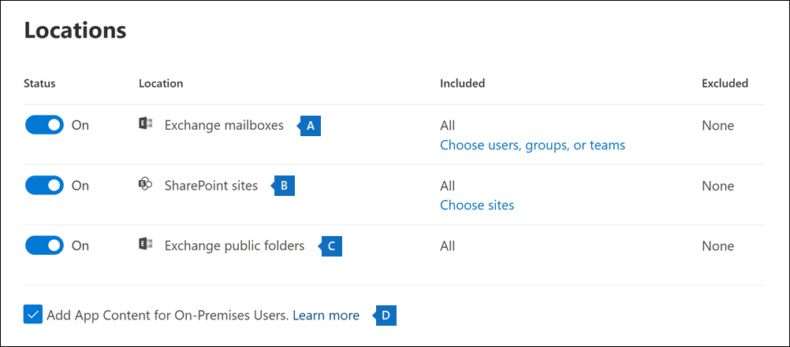

# 콘텐츠 검색 만들기

Microsoft 365 규정 준수 센터의 콘텐츠 검색 eDiscovery 도구를 사용하여 조직에서 전자 메일, 문서, 인스턴트 메시징 대화와 같은 콘텐츠를 검색할 수 있습니다. 이 도구를 사용하여 이러한 클라우드 기반 Microsoft 365 데이터 원본에서 콘텐츠를 검색합니다.
  
- Exchange Online 사서함

- SharePoint Online 사이트 및 비즈니스용 OneDrive 계정

- Microsoft Teams

- Microsoft 365 그룹

- Yammer 그룹

검색을 실행하면 콘텐츠 위치 수와 예상 검색 결과 수가 검색 플라이아웃 페이지에 표시됩니다. 검색 쿼리와 일치하는 항목이 가장 많은 콘텐츠 위치와 같은 통계를 빠르게 볼 수 있습니다. 검색을 실행한 후에는 결과를 미리 보거나 로컬 컴퓨터로 내보낼 수 있습니다.

## 검색을 실행하기 전에

- Microsoft 365 규정 준수의 콘텐츠 검색 도구에 액세스(하여 검색을 실행하고 검색 결과 미리 보기 및 내보내기를 실행)하려면 관리자, 준수 관리자 또는 eDiscovery 구성원이 Microsoft 365 규정 준수 센터에서 eDiscovery 관리자 역할 그룹의 구성원이어야 합니다. 자세한 내용은 [eDiscovery 권한 할당](assign-ediscovery-permissions.md)을 참조하세요.

- Exchange 하이브리드 배포에서는 콘텐츠 검색 도구를 사용하여 온-프레미스 사서함을 검색할 수 없습니다. 이 도구는 클라우드 기반 사서함을 검색하는 데만 사용할 수 있습니다.

## 검색 만들기 및 실행
  
1. 해당 <https://compliance.microsoft.com> 할당된 계정의 자격 증명을 사용하여 로그인합니다.

2. Microsoft 365 규정 준수 센터 왼쪽 탐색 창에서 **콘텐츠 검색** 을 클릭합니다.

3. **콘텐츠 검색** 페이지에서 **새 검색** 을 클릭합니다.

   > [!NOTE]
   > **ID 목록으로 검색**: 이 옵션은 Exchange ID 목록을 사용하여 특정 전자 메일 메시지 및 기타 사서함 항목을 검색합니다. ID 목록 검색을 만들려면 검색할 특정 사서함 항목을 식별하는 CSV(쉼표로 구분된 값) 파일을 제출합니다. 자세한 내용은 [ID 목록 검색을 위해 CSV 파일 준비](csv-file-for-an-id-list-content-search.md)를 참조하세요.

4. 검색 이름과 검색 식별에 도움이 되는 설명(선택 사항)을 입력합니다. 검색 이름은 조직에서 고유해야 합니다.

5. **위치** 페이지에서 검색할 콘텐츠 위치를 선택합니다. 사서함, 사이트 및 공용 폴더를 검색할 수 있습니다.

    
  
   1. **Exchange 사서함**: 토글을 **켜기** 로 설정한 다음 **사용자, 그룹 또는 팀 선택** 을 클릭하여 보류할 사서함을 지정합니다. 검색 상자를 사용하여 사용자 사서함 및 메일 그룹을 찾습니다. Microsoft Teams(채널 메시지), Office 365 그룹 및 Yammer 그룹과 연결된 사서함을 검색할 수도 있습니다. 사서함에 저장된 애플리케이션 데이터에 대한 자세한 내용은 [eDiscovery용 사서함에 저장된 콘텐츠](what-is-stored-in-exo-mailbox.md)를 참조하세요.

   2. **SharePoint 사이트**: 토글을 **켜기** 로 설정한 다음 **사이트 선택** 을 클릭하여 SharePoint 사이트 및 OneDrive 계정을 보류할 수 있습니다. 보류할 각 사이트의 URL을 입력합니다. Microsoft Teams, Office 365 그룹 또는 Yammer 그룹의 SharePoint 사이트 URL을 추가할 수도 있습니다.
  
   3. **Exchange 공용 폴더**: 토글을 **켜기** 로 설정하여 Exchange Online 조직의 모든 공용 폴더를 보류합니다. 보류할 특정 공용 폴더는 선택할 수 없습니다. 공용 폴더를 보류하고 싶지 않은 경우 토글 스위치를 해제합니다.
  
   4. 이 확인란을 선택된 것으로 유지하여 온-프레미스 사용자에 대한 Teams 콘텐츠를 검색합니다. 예를 들어 조직에서 모든 Exchange 사서함을 검색하고 이 확인란도 선택하는 경우, 온-프레미스 사용자의 Teams 채팅 데이터를 저장하는 데 사용되는 클라우드 기반 저장소가 검색 범위에 포함됩니다. 자세한 내용은 [온-프레미스 사용자의 Teams 채팅 데이터 검색](search-cloud-based-mailboxes-for-on-premises-users.md)을 참조하세요.

6. **검색 조건 정의** 페이지에서 키워드 쿼리를 입력하고, 필요한 경우 검색 쿼리에 조건을 추가합니다.

   

   1. 키워드, 메시지 속성(보낸 날짜 및 받은 날짜) 또는 문서 속성(예: 파일 이름 또는 문서를 마지막으로 변경한 날짜)을 지정할 수 있습니다. **AND**, **OR**, **NOT**, **NEAR** 와 같은 부울 연산자를 사용하는 좀 더 복잡한 쿼리를 사용할 수 있습니다. 키워드 상자를 비워 두면 지정된 콘텐츠 위치에 있는 모든 콘텐츠가 검색 결과에 포함됩니다. 자세한 내용은 [eDiscovery에 대한 키워드 쿼리 및 검색 조건](keyword-queries-and-search-conditions.md)을 참조하세요.

   2. 또는 **키워드 목록 표시** 확인란을 클릭하고 각 행에 키워드를 입력할 수 있습니다. 이렇게하면 각 행의 키워드는 만든 검색 쿼리의 **OR** 연산자와 기능상 유사한 논리 연산자(**c:s**)로 연결됩니다.

      키워드 목록을 사용하는 이유 각 키워드와 일치하는 항목 수를 보여주는 통계를 얻을 수 있습니다. 이를 통해 가장 (및 가장 덜) 유효한 키워드를 신속하게 파악할 수 있습니다. 키워드 문구(괄호로 묶음)를 연속으로 사용할 수도 있습니다. 키워드 목록 및 검색 통계에 대한 자세한 내용은 [검색에 대한 키워드 통계 얻기](view-keyword-statistics-for-content-search.md#get-keyword-statistics-for-searches)를 참조하세요.

      > [!NOTE]
      > 큰 키워드 목록으로 인한 문제를 줄일 수 있도록 키워드 목록에서 최대 20개의 행으로 제한됩니다.

   3. 검색 조건을 추가하여 검색 범위를 좁히고 보다 세분화된 결과 집합을 반환할 수 있습니다. 각 조건은 검색을 시작할 때 만들어지고 실행되는 검색 쿼리에 절을 추가합니다. 조건은 **AND** 연산자와 기능면에서 유사한 논리 연산자(**c:c**)에 의해 키워드 쿼리(키워드 상자에 지정됨)에 논리적으로 연결됩니다. 즉, 항목이 키워드 쿼리와 하나 이상의 조건을 모두 충족해야 결과에 포함될 수 있습니다. 이것이 조건이 결과를 좁히는 데 도움이 되는 방법입니다. 검색 쿼리에 사용할 수 있는 조건 목록 및 설명은 [검색 조건](keyword-queries-and-search-conditions.md#search-conditions)을 참조하세요.

7. 검색 설정을 검토하고 필요한 경우 편집한 다음 검색을 제출하여 시작하세요.
  
이 콘텐츠 검색에 다시 액세스하거나 **콘텐츠 검색** 페이지에 나열된 다른 콘텐츠 검색에 액세스하려면 검색을 선택한 다음 **열기** 를 클릭합니다.

## 다음 단계

다음은 콘텐츠 검색을 만들고 실행한 후 수행할 다음 단계 목록입니다.

- [검색 결과 미리 보기](preview-ediscovery-search-results.md)

- [검색 결과에 대한 통계 보기](view-keyword-statistics-for-content-search.md)

- [검색 결과 내보내기](export-search-results.md)

- [검색 보고서 내보내기](export-a-content-search-report.md)

## 자세한 정보

다른 Microsoft 365 서비스의 콘텐츠 검색과 같은 콘텐츠 검색에 대한 자세한 내용은 [콘텐츠 검색 기능 참조](content-search-reference.md)를 보세요.
