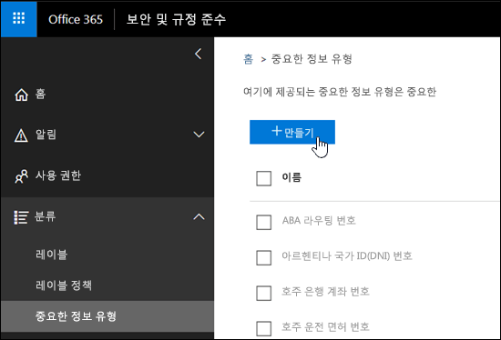
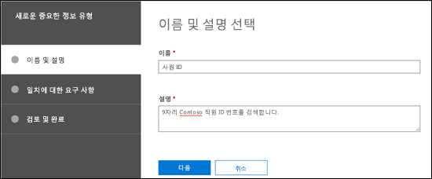
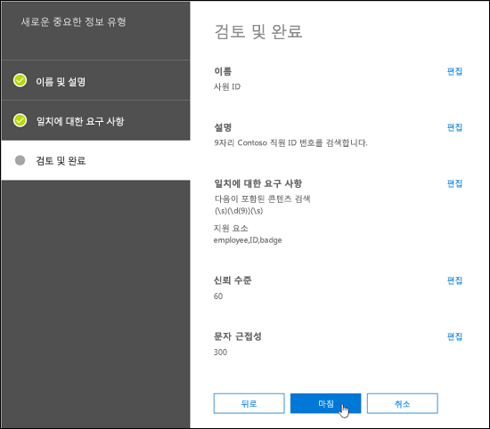
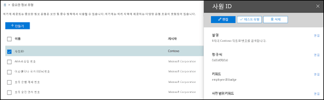
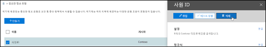
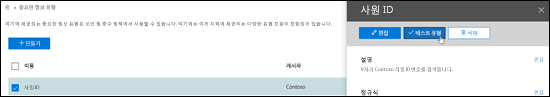
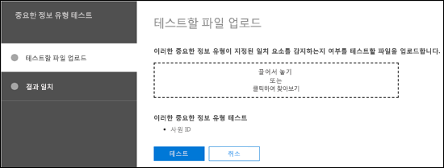

<!-- rename md file to match the display name -->
# 보안 및 준수 센터에서 사용자 지정 중요한 정보 유형 만들기Create a custom sensitive information type in the Security & Compliance Center

이 문서를 읽고 보안 및 준수 센터([https://protection.office.com](https://protection.office.com))에서 [사용자 지정 중요한 정보 유형](custom-sensitive-info-types.md)을 만들어 보세요.Read this article to create a [custom sensitive information type](custom-sensitive-info-types.md) in the Security & Compliance Center ([https://protection.office.com](https://protection.office.com)). 이 방법으로 만드는 사용자 지정 중요한 정보 유형은 이름이 `Microsoft.SCCManaged.CustomRulePack`인 규칙 패키지에 추가됩니다.The custom sensitive information types that you create by using this method are added to the rule package named `Microsoft.SCCManaged.CustomRulePack`.

PowerShell 및 정확한 데이터 매치 기능을 사용하여 사용자 지정 중요한 정보 유형을 만들 수도 있습니다.You can also create custom sensitive information types by using PowerShell and Exact Data Match capabilities. 해당 방법에 대한 자세한 내용은 다음을 참조하세요.To learn more about those methods, see:
- [보안 및 준수 센터 PowerShell에서 사용자 지정 중요한 정보 유형 만들기Create a custom sensitive information type in Security & Compliance Center PowerShell](create-a-custom-sensitive-information-type-in-scc-powershell.md)
- [정확한 데이터 매치(EDM)를 사용하여 DLP를 위한 사용자 지정 중요한 정보 유형 만들기Create a custom sensitive information type for DLP with Exact Data Match (EDM)](create-custom-sensitive-information-types-with-exact-data-match-based-classification.md)

## 시작하기 전에Before you begin

> [!NOTE]
> 사용자 지정 정보 유형을 UI를 통해 작성하고, 테스트하고 배포하려면 전역 관리자 또는 준수 관리자 권한이 있어야 합니다.You should have Global admin or Compliance admin permissions to create, test, and deploy a custom sensitive information type through the UI. Office 365에서 [관리자 역할 정보](https://docs.microsoft.com/office365/admin/add-users/about-admin-roles?view=o365-worldwide)를 참조하세요.See [About admin roles](https://docs.microsoft.com/office365/admin/add-users/about-admin-roles?view=o365-worldwide) in Office 365.

- 조직에 DLP(데이터 손실 방지)를 포함하는 구독(예: Office 365 Enterprise)이 있어야 합니다.Your organization must have a subscription, such as Office 365 Enterprise, that includes Data Loss Prevention (DLP). [메시징 정책 및 규정 준수 서비스 설명](https://docs.microsoft.com/office365/servicedescriptions/exchange-online-protection-service-description/messaging-policy-and-compliance-servicedesc)을 참조하세요.See [Messaging Policy and Compliance ServiceDescription](https://docs.microsoft.com/office365/servicedescriptions/exchange-online-protection-service-description/messaging-policy-and-compliance-servicedesc). 

- Custom sensitive information types require familiarity with regular expressions (RegEx).Custom sensitive information types require familiarity with regular expressions (RegEx). For more information about the Boost.RegEx (formerly known as RegEx++) engine that's used for processing the text, see [Boost.Regex 5.1.3](https://www.boost.org/doc/libs/1_68_0/libs/regex/doc/html/).For more information about the Boost.RegEx (formerly known as RegEx++) engine that's used for processing the text, see [Boost.Regex 5.1.3](https://www.boost.org/doc/libs/1_68_0/libs/regex/doc/html/).

  Microsoft 고객 서비스 및 지원은 사용자 지정 분류 또는 정규식 패턴 만들기를 지원할 수 없습니다.Microsoft Customer Service & Support can't assist with creating custom classifications or regular expression patterns. 지원 엔지니어는 테스트 목적으로 샘플 정규식 패턴 제공 또는 예상대로 트리거되지 않는 기존 정규식 패턴 문제 해결 지원과 같은 기능을 제한적으로 지원할 수 있습니다. 그러나 사용자 지정 콘텐츠 일치 개발이 귀하의 요구 사항이나 의무를 충족할 것이라고 확신할 수는 없습니다.Support engineers can provide limited support for the feature, such as, providing sample regular expression patterns for testing purposes, or assisting with troubleshooting an existing regular expression pattern that's not triggering as expected, but can't provide assurances that any custom content-matching development will fulfill your requirements or obligations.

- DLP는 SharePoint Online 및 비즈니스용 OneDrive 사이트에서 중요한 정보를 식별하고 분류하기 위해 검색 크롤러를 사용합니다.DLP uses the search crawler to identify and classify sensitive information in SharePoint Online and OneDrive for Business sites. 기존 콘텐츠에서 새로운 사용자 지정 중요한 정보 유형을 식별하려면 해당 콘텐츠에 대한 크롤링을 다시 수행해야 합니다.To identify your new custom sensitive information type in existing content, the content must be re-crawled. 콘텐츠는 일정을 기반으로 크롤링되지만 사이트 모음, 목록 또는 라이브러리의 콘텐츠를 수동으로 다시 크롤링할 수 있습니다.Content is crawled based on a schedule, but you can manually re-crawl content for a site collection, list, or library. 자세한 내용은 [사이트, 라이브러리 또는 목록을 크롤링 및 다시 인덱싱하도록 수동으로 요청](https://docs.microsoft.com/sharepoint/crawl-site-content)을 참조하세요.For more information, see [Manually request crawling and re-indexing of a site, a library or a list](https://docs.microsoft.com/sharepoint/crawl-site-content).

## 보안 및 준수 센터에서 사용자 지정 중요한 정보 유형 만들기Create custom sensitive information types in the Security & Compliance Center

보안 및 준수 센터에서 **분류** \> **중요한 정보 유형**으로 이동한 후 **만들기**를 클릭합니다.In the Security & Compliance Center, go to **Classifications** \> **Sensitive info types** and click **Create**.

설정은 매우 명확하며 마법사의 연결 페이지에서 설명합니다.The settings are fairly self-evident, and are explained on the associate page of the wizard:

- **이름****Name**

- **설명****Description**

- **근접****Proximity**

- **신뢰 수준****Confidence level**

- **기본 패턴 요소**(키워드, 정규식 또는 사전)**Primary pattern element** (keywords, regular expression, or dictionary)

- 선택 사항인 **지원 패턴 요소**(키워드, 정규식 또는 사전) 및 해당하는 **최소 비용** 값Optional **Supporting pattern elements** (keywords, regular expression, or dictionary) and a corresponding **Minimum cost** value.

Here's a scenario: You want a custom sensitive information type that detects 9-digit employee numbers in content, along with the keywords "employee" "ID" and "badge".Here's a scenario: You want a custom sensitive information type that detects 9-digit employee numbers in content, along with the keywords "employee" "ID" and "badge". To create this custom sensitive information type, do the following steps:To create this custom sensitive information type, do the following steps:

1. 보안 및 준수 센터에서 **분류** \> **중요한 정보 유형**으로 이동한 후 **만들기**를 클릭합니다.In the Security & Compliance Center, go to **Classifications** \> **Sensitive info types** and click **Create**.

    

2. **이름 및 설명 선택** 페이지가 열리면 다음 값을 입력합니다.In the **Choose a name and description** page that opens, enter the following values:

  - **이름**: 직원 ID입니다.**Name**: Employee ID.

  - **설명**: 9자리 Contoso 직원 ID 번호를 검색합니다.**Description**: Detect nine-digit Contoso employee ID numbers.

    

    작업을 마친 후 **다음**을 클릭합니다.When you're finished, click **Next**.

3. **일치 요구 사항** 페이지가 열리면 **요소 추가**를 클릭하고 다음 설정을 구성합니다.In the **Requirements for matching** page that opens, click **Add an element** configure the following settings:

    - **다음이 포함된 콘텐츠 검색**:**Detect content containing**:
 
      a.a. Click **Any of these** and select **Regular expression**.Click **Any of these** and select **Regular expression**.

      b.b. In the regular expression box, enter `(\s)(\d{9})(\s)` (nine-digit numbers surrounded by white space).In the regular expression box, enter `(\s)(\d{9})(\s)` (nine-digit numbers surrounded by white space).
  
    - **지원 요소**: **지원 요소 추가**를 클릭하고 **이 키워드 목록 포함**을 선택합니다.**Supporting elements**: Click **Add supporting elements** and select **Contains this keyword list**.

    - **이 키워드 목록 포함** 영역이 표시되면 다음 설정을 구성합니다.In the **Contains this keyword list** area that appears, configure the following settings:

      - **키워드 목록**: 직원, ID, 배지 값을 입력합니다.**Keyword list**: Enter the following value: employee,ID,badge.

      - **최소 개수**: 기본값 1을 그대로 둡니다.**Minimum count**: Leave the default value 1.

    - 기본값인 **신뢰 수준** 값 60을 그대로 둡니다.Leave the default **Confidence level** value 60. 

    - 기본값인 **문자 근접** 값 300을 그대로 둡니다.Leave the default **Character proximity** value 300.

    

    작업을 마친 후 **다음**을 클릭합니다.When you're finished, click **Next**.

4. **검토 및 완료** 페이지가 열리면 설정을 검토하고 **마침**을 클릭합니다.On the **Review and finalize** page that opens, review the settings and click **Finish**.

    

5. The next page encourages you to test the new custom sensitive information type by clicking **Yes**.The next page encourages you to test the new custom sensitive information type by clicking **Yes**. For more information, see [Test custom sensitive information types in the Security & Compliance Center](#test-custom-sensitive-information-types-in-the-security--compliance-center).For more information, see [Test custom sensitive information types in the Security & Compliance Center](#test-custom-sensitive-information-types-in-the-security--compliance-center). To test the rule later, click **No**.To test the rule later, click **No**.

    

### 작동 여부는 어떻게 확인하나요?How do you know this worked?

새로운 중요한 정보 유형을 성공적으로 만들었는지 확인하려면 다음 단계를 수행합니다.To verify that you've successfully created a new sensitive information type, do any of the following steps:

  - **분류** \> **중요한 정보 유형**으로 이동하고 새로운 사용자 지정 중요한 정보 유형이 나열되어 있는지 확인하세요.Go to **Classifications** \> **Sensitive info types** and verify the new custom sensitive information type is listed.

  - Test the new custom sensitive information type.Test the new custom sensitive information type. For more information, see [Test custom sensitive information types in the Security & Compliance Center](#test-custom-sensitive-information-types-in-the-security--compliance-center).For more information, see [Test custom sensitive information types in the Security & Compliance Center](#test-custom-sensitive-information-types-in-the-security--compliance-center).

## 보안 및 준수 센터에서 사용자 지정 중요한 정보 유형 수정Modify custom sensitive information types in the Security & Compliance Center

**참고:****Notes**:
<!-- check to see if this note contradicts the guidance in "customize a built in sensitive information type customize-a-built-in-sensitive-information-type it sure seems like it does-->
- You can only modify custom sensitive information types; you can't modify built-in sensitive information types.You can only modify custom sensitive information types; you can't modify built-in sensitive information types. But you can use PowerShell to export built-in custom sensitive information types, customize them, and import them as custom sensitive information types.But you can use PowerShell to export built-in custom sensitive information types, customize them, and import them as custom sensitive information types. For more information, see [Customize a built-in sensitive information type](customize-a-built-in-sensitive-information-type.md).For more information, see [Customize a built-in sensitive information type](customize-a-built-in-sensitive-information-type.md).

- You can only modify custom sensitive information types that you created in the UI.You can only modify custom sensitive information types that you created in the UI. If you used the [PowerShell procedure](create-a-custom-sensitive-information-type-in-scc-powershell.md) to import a custom sensitive information type rule package, you'll get an error.If you used the [PowerShell procedure](create-a-custom-sensitive-information-type-in-scc-powershell.md) to import a custom sensitive information type rule package, you'll get an error.

보안 및 준수 센터에서 **분류** \> **중요한 정보 유형**으로 이동하고, 수정할 사용자 지정 중요한 정보 유형을 선택한 후 **편집**을 클릭합니다.In the Security & Compliance Center, go to **Classifications** \> **Sensitive info types**, select the custom sensitive information type that you want to modify, and then click **Edit**.

  

The same options are available here as when you created the custom sensitive information type in the Security & Compliance Center.The same options are available here as when you created the custom sensitive information type in the Security & Compliance Center. For more information, see [Create custom sensitive information types in the Security & Compliance Center](#create-custom-sensitive-information-types-in-the-security--compliance-center).For more information, see [Create custom sensitive information types in the Security & Compliance Center](#create-custom-sensitive-information-types-in-the-security--compliance-center).

### 작동 여부는 어떻게 확인하나요?How do you know this worked?

수정한 중요한 정보 유형을 성공적으로 만들었는지 확인하려면 다음 단계를 수행합니다.To verify that you've successfully modified a sensitive information type, do any of the following steps:

  - **분류** \> **중요한 정보 유형**으로 이동하고 수정한 사용자 지정 중요한 정보 유형의 속성을 확인합니다.Go to **Classifications** \> **Sensitive info types** to verify the properties of the modified custom sensitive information type. 

  - Test the modified custom sensitive information type.Test the modified custom sensitive information type. For more information, see [Test custom sensitive information types in the Security & Compliance Center](#test-custom-sensitive-information-types-in-the-security--compliance-center).For more information, see [Test custom sensitive information types in the Security & Compliance Center](#test-custom-sensitive-information-types-in-the-security--compliance-center).

## 보안 및 준수 센터에서 사용자 지정 중요한 정보 유형 제거Remove custom sensitive information types in the Security & Compliance Center 

**참고**:**Notes**:

- 사용자 지정 중요한 정보 유형만 제거할 수 있습니다. 기본 제공 중요한 정보 유형은 제거할 수 없습니다.You can only remove custom sensitive information types; you can't remove built-in sensitive information types.

- 사용자 지정 중요한 정보 유형을 제거하기 전에 DLP 정책이나 Exchange 메일 흐름 규칙(전송 규칙이라고도 함)이 중요한 정보 유형을 계속 참조하지 않는 것을 확인합니다.Before your remove a custom sensitive information type, verify that no DLP policies or Exchange mail flow rules (also known as transport rules) still reference the sensitive information type.

1. 보안 및 준수 센터에서 **분류** \> **중요한 정보 유형**으로 이동하고, 제거할 사용자 지정 중요한 정보 유형을 한 개 이상 선택합니다.In the Security & Compliance Center, go to **Classifications** \> **Sensitive info types** and select one or more custom sensitive information types that you want to remove.

2. 플라이아웃이 열리면 **삭제**(두 개 이상을 선택한 경우 **중요한 정보 유형 삭제**)를 클릭합니다.In the fly-out that opens, click **Delete** (or **Delete sensitive info types** if you selected more than one).

    

3. 나타나는 경고 메시지에서 **예**를 클릭합니다.In the warning message that appears, click **Yes**.

### 작동 여부는 어떻게 확인하나요?How do you know this worked?

사용자 지정 중요한 정보 유형을 성공적으로 삭제했는지 확인하려면 **분류** \> **중요한 정보 유형**으로 이동하여 사용자 지정 중요한 정보 유형이 더 이상 나열되지 않는지 확인합니다.To verify that you've successfully removed a custom sensitive information type, go to **Classifications** \> **Sensitive info types** to verify the custom sensitive information type is no longer listed.

## 보안 및 준수 센터에서 사용자 지정 중요한 정보 유형 테스트Test custom sensitive information types in the Security & Compliance Center

1. 보안 및 준수 센터에서 **분류** \> **중요한 정보 유형**으로 이동합니다.In the Security & Compliance Center, go to **Classifications** \> **Sensitive info types**.

2. Select one or more custom sensitive information types to test.Select one or more custom sensitive information types to test. In the fly-out that opens, click **Test type** (or **Test sensitive info types** if you selected more than one).In the fly-out that opens, click **Test type** (or **Test sensitive info types** if you selected more than one).

    

3. **테스트할 파일 업로드** 페이지가 열리면 파일을 끌어서 놓거나 **찾아보기**를 클릭하고 파일을 선택하여 테스트할 문서를 업로드합니다.On the **Upload file to test** page that opens, upload a document to test by dragging and dropping a file or by clicking **Browse** and selecting a file.

    

4. **테스트** 단추를 클릭하여 파일에서 패턴 일치에 대해 문서를 테스트합니다.Click the **Test** button to test the document for pattern matches in the file.

5. **결과 일치** 페이지에서 **마침**을 클릭합니다.On the **Match results** page, click **Finish**.

    
