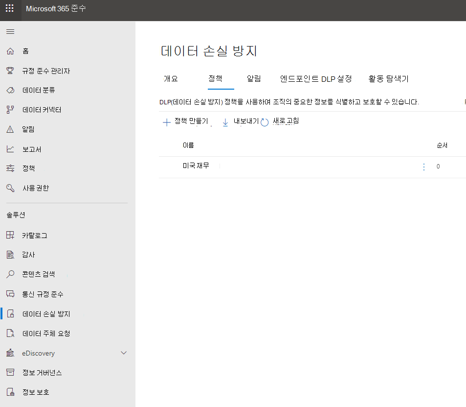
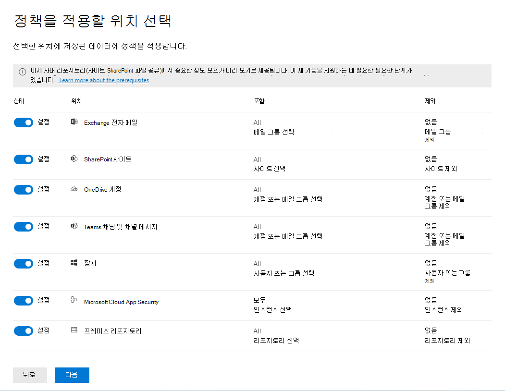

# 템플릿에서 DLP 정책 만들기

DLP 정책을 시작하는 가장 쉽고 일반적인 방법은 규정 준수 센터에 포함된 템플릿 중 Microsoft 365 것입니다. 이러한 템플릿 중 하나를 있는 대로 사용하거나 조직의 특정 규정 준수 요구 사항에 맞게 규칙을 사용자 지정할 수 있습니다.

Microsoft 365 다양한 일반 규정 및 비즈니스 정책 요구를 충족하는 데 도움이 될 수 있는 40개가 넘는 즉시 사용 템플릿이 포함되어 있습니다. 자세한 내용은 다음을 참조 하여 참조 [전체 목록에](dlp-policy-reference.md#policy-templates) 대한 정책 템플릿입니다. 

기존 규칙을 수정하거나 새 규칙을 추가하여 템플릿을 미세 조정할 수 있습니다. 예를 들어 새로운 유형의 중요한 정보를 규칙에 추가하거나, 한 규칙의 템플릿 수를 수정하여 트리거하기 더 어렵게 또는 더 쉽게 만들거나, 업무 정당성을 제공하여 규칙의 작업을 재정의할 수 있도록 하거나, 알림 및 사고 보고서를 받을 수 있는 사람을 변경할 수 있습니다. DLP 정책 템플릿은 여러 일반적인 규정 준수 시나리오에 대한 유연한 시작점입니다.

기본 규칙이 없는 사용자 지정 템플릿을 선택하고, 조직의 특정 규정 준수 요구에 맞게 DLP 정책을 처음부터 새로 구성할 수도 있습니다.

### 템플릿에서 DLP 정책 만들기

1. <https://compliance.microsoft.com>에서 로그인합니다.

2. 준수 센터 왼쪽 \> 탐색 데이터 손실 \> **방지** \> **정책** \> **+ 정책 만들기에서**.

    
          
3. 다음에 필요한 중요한 정보 유형을 보호하는 DLP 정책 템플릿을 \> **선택하십시오.**

4. 정책 이름을 \> 다음으로 **지정합니다.**
 
<!--In this example, you'll select **Privacy** \> **U.S. Personally Identifiable Information (PII) Data** because it already includes most of the types of sensitive information that you want to protect - you'll add a couple later.

    When you select a template, you can read the description on the right to learn what types of sensitive information the template protects.

    -->

5. DLP 정책에서 보호할 위치를 선택하고 각 위치에 대한 기본 범위를 적용하거나 범위를 사용자 지정합니다. 선택 [옵션의 위치는](dlp-policy-reference.md#locations) 위치를 참조하세요.

6. \> **다음** 을 선택합니다.
 
1. <!--> 다음 중 하나를 사용 합니다.

   - 다음 **에서** 모든 위치를 \> **Office 365.**
   - Let **me choose specific locations Next(다음으로 특정 위치 선택)** \> **를 선택하세요.** 이 예제에서는 이 옵션을 선택 합니다.

   모든 Exchange 또는 모든 OneDrive 계정과 같은 전체 위치를 포함하거나 제외하기  위해 해당 위치의 상태를 켜거나 끄면 됩니다.

   특정 SharePoint 또는 비즈니스용 OneDrive 계정만 포함하려면 상태를 켜기로 전환한 다음 포함 아래의  링크를 클릭하여 특정 사이트 또는 계정을 선택하세요.  사이트에 정책을 적용하면 해당 정책에 구성된 규칙이 해당 사이트의 모든 하위 사이트에 자동으로 적용됩니다.

   

   이 예에서는 모든 비즈니스용 OneDrive 계정에 저장된 중요한 정보를 보호하기 위해 Exchange  전자 메일 및 SharePoint 사이트의 상태를 모두 해제하고 OneDrive 계정에 대해 상태를 OneDrive .-->  

7. 템플릿 다음에서 검토 **및 기본 설정 사용자 지정을** \> **선택합니다.**

8. DLP 정책 템플릿에는 특정 유형의 중요한 정보를 검색하는 조건과 그에 따른 작업이 미리 정의된 규칙이 포함되어 있습니다. 기존 규칙을 편집, 삭제 또는 해제하거나 새 규칙을 추가할 수 있습니다. 완료되면 다음 을 **클릭합니다.**

    

9. 다음 위치를 선택한 경우 조직 내부 또는 조직 외부에서 이 콘텐츠가 공유되는 경우를 검색합니다.
    1. Exchange
    1. SharePoint
    1. OneDrive
    1. Teams 채팅 및 채널 메시지 

10. **다음** 을 선택합니다.

11. 원하는 **경우 보호** 작업 페이지에서 정책 팁 알림 및 알림 전자 메일을 사용자 지정할 수 있습니다. 콘텐츠가 정책 **조건과** 일치하는 경우 사용자에게 정책 팁을 표시하고 전자 메일 알림을 보낸 다음 팁 및 전자 메일 사용자 지정 **을 선택하세요.**
12. **다음** 을 선택합니다.

<!--    In this example, the U.S. PII Data template includes two predefined rules:

   - **Low volume of content detected U.S. PII** This rule looks for files containing between 1 and 10 occurrences of each of three types of sensitive information (ITIN, SSN, and U.S. passport numbers), where the files are shared with people outside the organization. If found, the rule sends an email notification to the primary site collection administrator, document owner, and person who last modified the document.

   - **High volume of content detected U.S. PII** This rule looks for files containing 10 or more occurrences of each of the same three sensitive information types, where the files are shared with people outside the organization. If found, this action also sends an email notification, plus it restricts access to the file. For content in a OneDrive for Business account, this means that permissions for the document are restricted for everyone except the primary site collection administrator, document owner, and person who last modified the document.

    To meet your organization's specific requirements, you may want to make the rules easier to trigger, so that a single occurrence of sensitive information is enough to block access for external users. After looking at these rules, you understand that you don't need low and high count rules—you need only a single rule that blocks access if any occurrence of sensitive information is found.

    So you expand the rule named **Low volume of content detected U.S. PII** \> **Delete rule**.

    

9. Now, in this example, you need to add two sensitive information types (U.S. bank account numbers and U.S. driver's license numbers), allow people to override a rule, and change the count to any occurrence. You can do all of this by editing one rule, so select **High volume of content detected U.S. PII** \> **Edit rule**.

    

10. To add a sensitive information type, in the **Conditions** section \> **Add or change types**. Then, under **Add or change types** \> choose **Add** \> select **U.S. Bank Account Number** and **U.S. Driver's License Number** \> **Add** \> **Done**.

    

    

11. To change the count (the number of instances of sensitive information required to trigger the rule), under **Instance count** \> choose the **min** value for each type \> enter 1. The minimum count cannot be empty. The maximum count can be empty; an empty **max** value convert to **any**.

    When finished, the min count for all of the sensitive information types should be **1** and the max count should be **any**. In other words, any occurrence of this type of sensitive information will satisfy this condition.

    

12. For the final customization, you don't want your DLP policies to block people from doing their work when they have a valid business justification or encounter a false positive, so you want the user notification to include options to override the blocking action.

    In the **User notifications** section, you can see that email notifications and policy tips are turned on by default for this rule in the template.

    In the **User overrides** section, you can see that overrides for a business justification are turned on, but overrides to report false positives are not. Choose **Override the rule automatically if they report it as a false positive**.

    

13. At the top of the rule editor, change the name of this rule from the default **High volume of content detected U.S. PII** to **Any content detected with U.S. PII** because it's now triggered by any occurrence of its sensitive information types.

14. At the bottom of the rule editor \> **Save**.

15. Review the conditions and actions for this rule \> **Next**.

    On the right, notice the **Status** switch for the rule. If you turn off an entire policy, all rules contained in the policy are also turned off. However, here you can turn off a specific rule without turning off the entire policy. This can be useful when you need to investigate a rule that is generating a large number of false positives.

16. On the next page, read and understand the following, and then choose whether to turn on the rule or test it out first \> **Next**.

     Before you create your DLP policies, you should consider rolling them out gradually to assess their impact and test their effectiveness before you fully enforce them. For example, you don't want a new DLP policy to unintentionally block access to thousands of documents that people require to get their work done.

    If you're creating DLP policies with a large potential impact, we recommend following this sequence:

17. Start in test mode without Policy Tips and then use the DLP reports to assess the impact. You can use DLP reports to view the number, location, type, and severity of policy matches. Based on the results, you can fine tune the rules as needed. In test mode, DLP policies will not impact the productivity of people working in your organization.

18. Move to Test mode with notifications and Policy Tips so that you can begin to teach users about your compliance policies and prepare them for the rules that are going to be applied. At this stage, you can also ask users to report false positives so that you can further refine the rules.

19. Turn on the policies so that the rules are enforced and the content's protected. Continue to monitor the DLP reports and any incident reports or notifications to make sure that the results are what you intend.

    

20. Review your settings for this policy \> choose **Create**.

After you create and turn on a DLP policy, it's deployed to any content sources that it includes, such as SharePoint Online sites or OneDrive for Business accounts, where the policy begins automatically enforcing its rules on that content.

## Example: Identify sensitive information across all OneDrive for Business sites and restrict access for people outside your organization

OneDrive for Business accounts make it easy for people across your organization to collaborate and share documents. But a common concern for compliance officers is that sensitive information stored in OneDrive for Business accounts may be inadvertently shared with people outside your organization. A DLP policy can help mitigate this risk.

In this example, you'll create a DLP policy that identifies U.S. PII data, which includes Individual Taxpayer Identification Numbers (ITIN), Social Security Numbers, and U.S. passport numbers. You'll get started by using a template, and then you'll modify the template to meet your organization's compliance requirements—specifically, you'll:

- Add a couple of types of sensitive information—U.S. bank account numbers and U.S. driver's license numbers—so that the DLP policy protects even more of your sensitive data.

- Make the policy more sensitive, so that a single occurrence of sensitive information is enough to restrict access for external users.

- Allow users to override the actions by providing a business justification or reporting a false positive. This way, your DLP policy won't prevent people in your organization from getting their work done, provided they have a valid business reason for sharing the sensitive information.

## View the status of a DLP policy

At any time, you can view the status of your DLP policies on the **Policy** page in the **Data loss prevention** section of the Security &amp; Compliance Center. Here you can find important information, such as whether a policy was successfully enabled or disabled, or whether the policy is in test mode.

Here are the different statuses and what they mean.

 

****

|Status|Explanation|
|---|---|
|**Turning on…**|The policy is being deployed to the content sources that it includes. The policy is not yet enforced on all sources.|
|**Testing, with notifications**|The policy is in test mode. The actions in a rule are not applied, but policy matches are collected and can be viewed by using the DLP reports. Notifications about policy matches are sent to the specified recipients.|
|**Testing, without notifications**|The policy is in test mode. The actions in a rule are not applied, but policy matches are collected and can be viewed by using the DLP reports. Notifications about policy matches are not sent to the specified recipients.|
|**On**|The policy is active and enforced. The policy was successfully deployed to all its content sources.|
|**Turning off...**|The policy is being removed from the content sources that it includes. The policy may still be active and enforced on some sources. Turning off a policy may take up to 45 minutes.|
|**Off**|The policy is not active and not enforced. The settings for the policy (sources, keywords, duration, etc) are saved.|
|**Deleting...**|The policy is in the process of being deleted. The policy is not active and not enforced. It normally takes an hour for a policy to delete.|
|

## Turn off a DLP policy

You can edit or turn off a DLP policy at any time. Turning off a policy disables all of the rules in the policy.

To edit or turn off a DLP policy, on the **Policy** page \> select the policy \> **Edit policy**.

In addition, you can turn off each rule individually by editing the policy and then toggling off the **Status** of that rule, as described above.

## More information

- [Learn about data loss prevention](dlp-learn-about-dlp.md)
- [Send notifications and show policy tips for DLP policies](use-notifications-and-policy-tips.md)
- [Create a DLP policy to protect documents with FCI or other properties](protect-documents-that-have-fci-or-other-properties.md)
- [What the DLP policy templates include](what-the-dlp-policy-templates-include.md)
- [Sensitive information type entity definitions](sensitive-information-type-entity-definitions.md)
