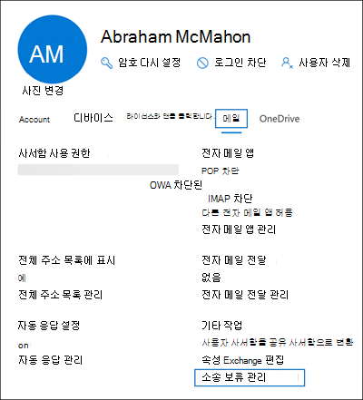

# <a name="create-a-litigation-hold"></a>소송 보류 만들기

사서함에 소송 보존을 설정하여 삭제된 항목 및 수정된 항목의 원래 버전을 포함하여 모든 사서함 콘텐츠를 보존할 수 있습니다. 사용자 사서함에 소송 보존을 설정하면 사용자의 보관 사서함(사용하도록 설정된 경우)의 콘텐츠도 보존됩니다. 보류를 만들 때 삭제 및 수정된 항목이 지정된 기간 동안 보존된 다음 사서함에서 영구적으로 삭제될 수 있도록 보류 기간(시간 기반 보류라고도함)을 지정할 수 있습니다. 또는 콘텐츠를 무기한 보존(무한 보존)하거나 소송 보존이 제거될 때까지 보존할 수 있습니다.  보류 기간을 지정하면 메시지를 받거나 사서함 항목이 만들어진 날짜부터 계산됩니다. 
  
소송 보류를 만들면 다음과 같은 상황이 발생합니다.
  
- 사용자가 영구적으로 삭제한 항목은 보존 기간 동안 사용자 사서함의 복구 가능한 항목 폴더에 보존됩니다.

- 사용자가 복구할 수 있는 항목 폴더에서 제거한 항목은 보존 기간 동안 보존됩니다.

- 복구 가능한 항목 폴더의 저장소 할당량은 30GB에서 110GB로 증가합니다.

- 사용자의 기본 및 보관 사서함의 항목은 보존됩니다.

## <a name="assign-an-exchange-online-plan-2-license"></a>계획 Exchange Online 라이선스 할당

사서함에 Exchange Online 사서함에 소송을 보류하려면 계획 2에 Exchange Online 할당해야 합니다. 사서함에 Exchange Online 계획 1 라이선스가 할당된 경우 사서함을 보류하기 위해 별도의 Exchange Online Archiving 라이선스를 할당해야 합니다.

> [!NOTE]
> Office 365 Education 조직의 경우 추가 기능이 있는 Office 365 A1 계획 1 라이선스가 포함된 Exchange Online 구독에서 소송 보류가 지원됩니다. 자세한 내용은 Exchange Online 서비스 설명의 "Exchange Online 기능" [섹션을 Office 365 Education 참조하세요.](/office365/servicedescriptions/office-365-platform-service-description/office-365-education#exchange-online-features)

## <a name="place-a-mailbox-on-litigation-hold"></a>사서함에 소송 보류

다음은 사서함을 사용하여 소송을 보류하는 Microsoft 365 관리 센터.

1. <https://admin.microsoft.com>으로 이동하여 로그인합니다.

2. 관리 센터의 탐색 창에서 사용자 활성 **사용자를**  >  <a href="https://go.microsoft.com/fwlink/p/?linkid=834822" target="_blank">**클릭합니다.**</a>

3. 소송을 보류할 사용자를 선택합니다.

4. 속성 플라이아웃 페이지에서 메일  탭을 클릭한 다음 추가 작업에서 **소송** 보류 관리를 **클릭합니다.**

   

5. 소송 보류 관리 **플라이아웃** 페이지에서 소송  보류 켜기 확인란을 선택하고 다음 선택적 정보를 입력합니다.

    1. **보류 기간(일)**: 이 상자를 사용하여 시간 기반 보류를 만들고 사서함이 소송 보류된 경우 사서함 항목이 유지되는 기간을 지정합니다. 기간은 사서함 항목이 수신되거나 만들어진 날짜부터 계산됩니다. 특정 항목에 대한 보존 기간이 만료되면 해당 항목이 더 이상 보존되지 않습니다. 이 상자를 비워 두면 항목은 무기한으로 또는 보류가 제거될 때까지 보존됩니다. 기간을 지정하는 데 날짜를 사용할 수 있습니다.

    2. **사용자에게 표시되는** 참고: 이 상자를 사용하여 사서함이 소송 보류 중임에 대해 사용자에게 알릴 수 있습니다. 이 메모는 2010 이상을 사용하는 경우 사용자 사서함의 계정 정보 페이지에 Outlook 표시됩니다. 이 페이지에 액세스하려면 사용자가 이 페이지에서 **파일을** 클릭할 수 Outlook.

    3. **사용자에 대한** 자세한 정보가 있는 웹 페이지: 이 상자를 사용하여 사용자에게 소송 보류에 대한 자세한 정보를 웹 사이트로 안내합니다. 이 URL은 2010 이상을 사용하는 경우 사용자 사서함의 계정 정보 페이지에 Outlook 표시됩니다. 이 페이지에 액세스하려면 사용자가 이 페이지에서 **파일을** 클릭할 수 Outlook.

6. 소송 **보류**  플라이아웃 페이지에서 변경 내용 저장을 클릭하여 보류를 만드십시오. 

   시스템에 변경이 적용될 때 최대 60분이 걸릴 수 있는 배너가 표시됩니다.

### <a name="create-a-litigation-hold-using-powershell"></a>PowerShell을 사용하여 소송 보류 만들기

PowerShell에서 다음 명령을 실행하여 소송 Exchange Online [있습니다.](/powershell/exchange/connect-to-exchange-online-powershell)

```powershell
Set-Mailbox <username> -LitigationHoldEnabled $true
```

이전 명령은 보존 기간이 지정되지 않은 항목을 무기한 보존합니다. 시간 기반 보류를 만들기 위해 다음 명령을 사용 합니다.

```powershell
Set-Mailbox <username> -LitigationHoldEnabled $true -LitigationHoldDuration <number of days>
```

또한 다음 명령을 실행하여 사서함이 소송 보류에 있는지 확인할 수 있습니다.

```powershell
Get-Mailbox <username> | FL LitigationHoldEnabled
```

True 값은 *사서함이* 소송 보류 중입니다.

자세한 내용은 [설정-사서함](/powershell/module/exchange/set-mailbox)을 참조하세요.

## <a name="how-does-litigation-hold-work"></a>소송 보유는 어떻게 작동하나요?

일반 삭제된 항목 워크플로에서는 사용자가 항목을 영구적으로 삭제(Shift + Delete)하거나 지우기 항목 폴더에서 삭제하면 사서함 항목이 복구 가능한 항목 폴더의 삭제 하위 폴더로 이동됩니다. 삭제 정책(보존 삭제 작업으로 구성된 보존 태그)도 보존 기간이 만료되면 항목을 삭제 하위폴더로 이동합니다. 사용자가 복구 가능한 항목 폴더의 항목을 제거하거나 항목에 대한 삭제된 항목 보존 기간이 만료되면 복구할 수 있는 항목 폴더의 제거 하위 폴더로 이동되고 영구 삭제로 표시됩니다. 다음에 MFA(관리되는 폴더 Exchange 도우미)에서 사서함이 처리될 때 제거됩니다.

사서함에 소송 보존이 설정되어 있는 경우 제거 하위폴더의 항목은 소송 보존에 지정된 보존 기간 동안 보존됩니다. 보류 기간은 항목을 받거나 만든 원래 날짜부터 계산하며 제거 하위폴더의 항목을 보유하는 기간을 정의합니다. 제거 하위폴더의 항목에 대한 보류 기간이 만료되면 항목이 영구적으로 삭제된 것으로 표시되고 다음에 MFA에서 Exchange 사서함이 제거됩니다. 사서함에 무기한 보류가 설정되는 경우 항목은 제거 하위폴더에서 제거되지 않습니다.

다음 그림에서는 복구 가능한 항목 폴더 및 보류 워크플로 프로세스의 하위 폴더를 보여줍니다.


> [!NOTE]
> eDiscovery 사례와 연결된 보류가 사서함에 배치된 경우 제거된 항목은 Deletions 하위폴더에서 DiscoveryHolds 하위폴더로 이동되고 eDiscovery 보류에서 사서함이 릴리스될 때까지 보존됩니다.
