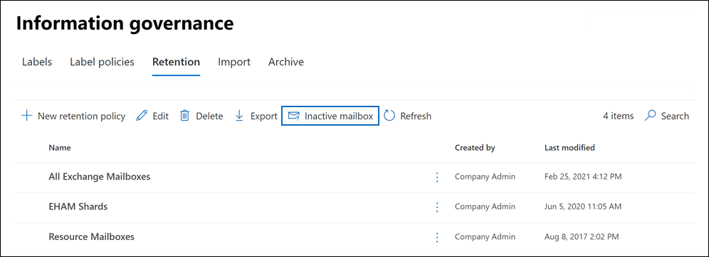
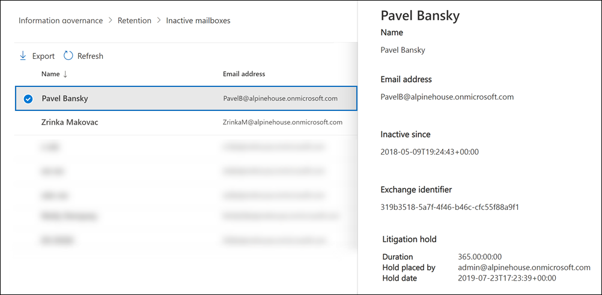

# <a name="create-and-manage-inactive-mailboxes"></a><span data-ttu-id="dcdcd-103">비활성 사서함 만들기 및 관리</span><span class="sxs-lookup"><span data-stu-id="dcdcd-103">Create and manage inactive mailboxes</span></span>

<span data-ttu-id="dcdcd-104">Microsoft 365 사서함의 내용을 보존할 수 있습니다.</span><span class="sxs-lookup"><span data-stu-id="dcdcd-104">Microsoft 365 makes it possible for you to retain the contents of deleted mailboxes.</span></span> <span data-ttu-id="dcdcd-105">이 기능을 [비활성 사서함](inactive-mailboxes-in-office-365.md)이라고 합니다.</span><span class="sxs-lookup"><span data-stu-id="dcdcd-105">This feature is called [inactive mailboxes](inactive-mailboxes-in-office-365.md).</span></span> <span data-ttu-id="dcdcd-106">비활성 사서함을 사용하면 조직에서 나서 이전 직원의 전자 메일을 보존할 수 있습니다.</span><span class="sxs-lookup"><span data-stu-id="dcdcd-106">Inactive mailboxes allow you to retain former employees' email after they leave your organization.</span></span> <span data-ttu-id="dcdcd-107">해당 사용자 계정이 삭제되기 전에 사서함에 소송 보존 또는 보존 정책(Office 365 또는 Microsoft 365의 보안 및 준수 센터에서 생성)이 적용되면 사서함이 비활성화됩니다.</span><span class="sxs-lookup"><span data-stu-id="dcdcd-107">A mailbox becomes inactive when a Litigation Hold or a retention policy (created in the security and compliance center in Office 365 or Microsoft 365) is applied to the mailbox before the corresponding user account is deleted.</span></span> <span data-ttu-id="dcdcd-108">비활성 사서함의 콘텐츠는 비활성으로 설정되기 전에 사서함에 배치된 보존 기간 동안 보존됩니다.</span><span class="sxs-lookup"><span data-stu-id="dcdcd-108">The contents of an inactive mailbox are retained for the duration of the hold that was placed on the mailbox before it was made inactive.</span></span> <span data-ttu-id="dcdcd-109">이를 통해 관리자, 준수 관리자 및 레코드 관리자는 콘텐츠 검색을 사용하여 비활성 사서함의 콘텐츠를 검색하고 내보낼 수 있습니다.</span><span class="sxs-lookup"><span data-stu-id="dcdcd-109">This allows administrators, compliance officers, and records managers to use Content Search to search and export the contents of an inactive mailbox.</span></span> <span data-ttu-id="dcdcd-110">비활성 사서함은 전자 메일을 받을 수 없으며 조직의 공유 주소록 또는 기타 목록에 표시되지 않습니다.</span><span class="sxs-lookup"><span data-stu-id="dcdcd-110">Inactive mailboxes can't receive email and aren't displayed in your organization's shared address book or other lists.</span></span>
  
> [!IMPORTANT]
> <span data-ttu-id="dcdcd-111">사서함 콘텐츠를 보존하는 다양한 방식으로 계속 투자함에 따라 In-Place 관리 센터에서 보존 Exchange 발표하고 있습니다.</span><span class="sxs-lookup"><span data-stu-id="dcdcd-111">As we continue to invest in different ways to preserve mailbox content, we're announcing the retirement of In-Place Holds in the Exchange admin center.</span></span> <span data-ttu-id="dcdcd-112">즉, 소송 보존 및 보존 정책을 사용하여 비활성 사서함을 만들어야 합니다.</span><span class="sxs-lookup"><span data-stu-id="dcdcd-112">That means you should use Litigation Holds and retention policies to create an inactive mailbox.</span></span> <span data-ttu-id="dcdcd-113">2020년 7월 1일부터는 새 보류를 In-Place 수 Exchange Online.</span><span class="sxs-lookup"><span data-stu-id="dcdcd-113">Starting July 1, 2020 you won't be able to create new In-Place Holds in Exchange Online.</span></span> <span data-ttu-id="dcdcd-114">그러나 비활성 사서함에 배치된 보류 In-Place 변경할 수 있습니다.</span><span class="sxs-lookup"><span data-stu-id="dcdcd-114">But you'll still be able to change the hold duration of an In-Place Hold placed on an inactive mailbox.</span></span> <span data-ttu-id="dcdcd-115">그러나 2020년 10월 1일부터는 보류 기간을 변경할 수 없습니다.</span><span class="sxs-lookup"><span data-stu-id="dcdcd-115">However, starting October 1, 2020, you won't be able to change the hold duration.</span></span> <span data-ttu-id="dcdcd-116">비활성 사서함은 비활성 사서함을 제거하여 비활성 사서함만 삭제할 In-Place 있습니다.</span><span class="sxs-lookup"><span data-stu-id="dcdcd-116">You'll only be able to delete an inactive mailbox by removing the In-Place Hold.</span></span> <span data-ttu-id="dcdcd-117">보류에 있는 In-Place 비활성 사서함은 보존이 제거될 때까지 계속 보존됩니다.</span><span class="sxs-lookup"><span data-stu-id="dcdcd-117">Existing inactive mailboxes that are on In-Place Hold will still be preserved until the hold is removed.</span></span> <span data-ttu-id="dcdcd-118">보류의 사용 중지에 대한 In-Place 레거시 [eDiscovery](legacy-ediscovery-retirement.md)도구의 사용 중지를 참조하세요.</span><span class="sxs-lookup"><span data-stu-id="dcdcd-118">For more information about the retirement of In-Place Holds, see [Retirement of legacy eDiscovery tools](legacy-ediscovery-retirement.md).</span></span>
  
## <a name="preparations-before-creating-an-inactive-mailbox"></a><span data-ttu-id="dcdcd-119">비활성 사서함을 만들기 전에 준비</span><span class="sxs-lookup"><span data-stu-id="dcdcd-119">Preparations before creating an inactive mailbox</span></span>

- <span data-ttu-id="dcdcd-120">사서함을 비활성화하려면 사서함에 Exchange Online 계획 2 라이선스를 할당해야 사서함을 삭제하기 전에 사서함에 소송 보존 또는 보존 정책을 적용할 수 있습니다.</span><span class="sxs-lookup"><span data-stu-id="dcdcd-120">To make a mailbox inactive, it must be assigned an Exchange Online Plan 2 license so that a Litigation Hold or a retention policy can be applied to the mailbox before it's deleted.</span></span> <span data-ttu-id="dcdcd-121">Exchange Online 계획 2 라이선스는 E3 Office 365 Enterprise E5 구독의 일부입니다.</span><span class="sxs-lookup"><span data-stu-id="dcdcd-121">Exchange Online Plan 2 licenses are part of an Office 365 Enterprise E3 and E5 subscription.</span></span> <span data-ttu-id="dcdcd-122">사서함에 Exchange Online 계획 1 또는 Exchange Online Kiosk 라이선스(각각 Office 365 E1 및 F1 구독의 일부)가 할당된 경우 사서함을 삭제하기 전에 보류를 적용할 수 있도록 별도의 Exchange Online Archiving 라이선스를 할당해야 합니다.</span><span class="sxs-lookup"><span data-stu-id="dcdcd-122">If a mailbox is assigned an Exchange Online Plan 1 or Exchange Online Kiosk license (which are part of an Office 365 E1 and F1 subscription respectively), you would have to assign it a separate Exchange Online Archiving license so that a hold can be applied to the mailbox before it's deleted.</span></span> <span data-ttu-id="dcdcd-123">자세한 내용은 [를](https://go.microsoft.com/fwlink/p/?LinkId=286153)Exchange Online Archiving.</span><span class="sxs-lookup"><span data-stu-id="dcdcd-123">For more information, see [Exchange Online Archiving](https://go.microsoft.com/fwlink/p/?LinkId=286153).</span></span>

- <span data-ttu-id="dcdcd-124">해당 사용자 계정을 삭제한 Exchange Online 사서함과 연결된 라이선스를 사용할 수 있습니다.</span><span class="sxs-lookup"><span data-stu-id="dcdcd-124">The licenses associated with the deleted Exchange Online mailbox will be available after you delete the corresponding user account.</span></span> <span data-ttu-id="dcdcd-125">그런 다음 해당 라이선스를 다른 사용자에게 [할당할 수 있습니다.](../admin/manage/assign-licenses-to-users.md)</span><span class="sxs-lookup"><span data-stu-id="dcdcd-125">You can then [assign those licenses to another user](../admin/manage/assign-licenses-to-users.md).</span></span>

- <span data-ttu-id="dcdcd-126">콘텐츠를 보존하거나 보존한 다음 삭제하도록 구성된 보존 정책 또는 소송 보존 정책이 삭제되기 전에 사서함에 적용되지 않는 경우 사서함의 콘텐츠는 보존되거나 검색할 수 없습니다.</span><span class="sxs-lookup"><span data-stu-id="dcdcd-126">If a Litigation Hold or a retention policy (that's configured to retain or retain and then delete content) isn't applied to a mailbox before it's deleted, the contents of the mailbox won't be retained or discoverable.</span></span> <span data-ttu-id="dcdcd-127">그러나 삭제된 사서함은 삭제 후 30일 이내에 복구할 수 있지만 복구되지 않은 경우 30일 후에 사서함 및 해당 콘텐츠가 영구적으로 삭제됩니다.</span><span class="sxs-lookup"><span data-stu-id="dcdcd-127">However, the deleted mailbox can be recovered within 30 days of deletion, but the mailbox and its contents will be permanently deleted after 30 days if it isn't recovered.</span></span>

- <span data-ttu-id="dcdcd-128">소송 보류에 대한 자세한 내용은 [소송 보류를 참조하세요.](/exchange/security-and-compliance/in-place-and-litigation-holds)</span><span class="sxs-lookup"><span data-stu-id="dcdcd-128">For more information about Litigation Hold, see [Litigation Hold](/exchange/security-and-compliance/in-place-and-litigation-holds).</span></span> <span data-ttu-id="dcdcd-129">보존 정책에 대한 자세한 내용은 보존 정책 및 보존 레이블에 대해 [자세히를 참조하세요.](retention.md)</span><span class="sxs-lookup"><span data-stu-id="dcdcd-129">For more information about retention policies, see [Learn about retention policies and retention labels](retention.md).</span></span>
  
## <a name="create-an-inactive-mailbox"></a><span data-ttu-id="dcdcd-130">비활성 사서함 만들기</span><span class="sxs-lookup"><span data-stu-id="dcdcd-130">Create an inactive mailbox</span></span>

<span data-ttu-id="dcdcd-131">사서함을 비활성화하려면 1) 사서함을 소송 보존으로 설정하거나 보존 정책을 적용하고, 2) 사서함 또는 해당 사용자 계정을 삭제하는 두 단계가 수행됩니다.</span><span class="sxs-lookup"><span data-stu-id="dcdcd-131">Making a mailbox inactive involves two steps: 1) placing the mailbox on Litigation Hold or applying a  retention policy to it, and 2) deleting the mailbox or corresponding user account.</span></span> <span data-ttu-id="dcdcd-132">사서함이 비활성인 경우 보존 또는 보존 정책이 제거될 때까지 해당 콘텐츠가 보존됩니다.</span><span class="sxs-lookup"><span data-stu-id="dcdcd-132">After the mailbox is inactive, its contents are retained until the hold or retention policy is removed.</span></span>
  
### <a name="step-1-place-a-mailbox-on-litigation-hold-or-apply-a-retention-policy"></a><span data-ttu-id="dcdcd-133">1단계: 사서함에 소송 보존 적용 또는 보존 정책 적용</span><span class="sxs-lookup"><span data-stu-id="dcdcd-133">Step 1: Place a mailbox on Litigation Hold or apply a retention policy</span></span>

<span data-ttu-id="dcdcd-134">사서함을 소송 보존으로 설정하거나 보존 정책(콘텐츠를 보존하거나 보존한 다음 삭제하도록 구성된 보존 정책)을 적용하면 사서함이 삭제되기 전에 사서함의 콘텐츠가 보존됩니다.</span><span class="sxs-lookup"><span data-stu-id="dcdcd-134">Placing a mailbox on Litigation Hold or applying a retention policy (that's configured to retain or retain and then delete content) retains the contents in the mailbox before it's deleted.</span></span> <span data-ttu-id="dcdcd-135">두 보존 유형 모두 삭제된 항목 및 수정된 항목의 원래 버전을 포함하여 모든 사서함 콘텐츠를 보존합니다.</span><span class="sxs-lookup"><span data-stu-id="dcdcd-135">Both types of holds will retain all mailbox content, including deleted items and original versions of modified items.</span></span> <span data-ttu-id="dcdcd-136">삭제 및 수정된 항목은 지정된 기간 동안 비활성 사서함에 보존되거나 비활성 사서함에 적용된 보존 또는 보존 정책을 제거하여 비활성 사서함을 영구적으로 삭제할 때까지 보존됩니다.</span><span class="sxs-lookup"><span data-stu-id="dcdcd-136">Deleted and modified items are retained in the inactive mailbox for a specified period, or until you permanently delete the inactive mailbox by removing the hold or retention policy that's applied to the inactive mailbox.</span></span>
  
<span data-ttu-id="dcdcd-137">이미 사서함에 보류가 적용되어 있는 경우 또는 보존 정책이 사서함에 이미 적용된 경우 2단계에서 설명한 해당 사용자 계정을 삭제하기만하면 됩니다.</span><span class="sxs-lookup"><span data-stu-id="dcdcd-137">If a hold is already placed on a mailbox, or if a retention policy is already applied to a mailbox, then all you have to do is delete the corresponding user account as explained in Step 2.</span></span>
  
<span data-ttu-id="dcdcd-138">사서함을 소송 보존으로 설정하거나 보존 정책을 적용하는 단계별 절차는 다음을 참조합니다.</span><span class="sxs-lookup"><span data-stu-id="dcdcd-138">For step-by-step procedures for placing a mailbox on Litigation Hold or applying a retention policy, see:</span></span>
  
- [<span data-ttu-id="dcdcd-139">사서함을 소송 자료 보존으로 설정</span><span class="sxs-lookup"><span data-stu-id="dcdcd-139">Place a mailbox on Litigation Hold</span></span>](create-a-litigation-hold.md)

- [<span data-ttu-id="dcdcd-140">보존 정책 및 보존 레이블에 대해 알아보기</span><span class="sxs-lookup"><span data-stu-id="dcdcd-140">Learn about retention policies and retention labels</span></span>](retention.md)

> [!NOTE]
> <span data-ttu-id="dcdcd-141">소송 보존 및 보존 정책의 경우 무기한 보류를 만들거나 시간 기반 보류를 만들 수 있습니다.</span><span class="sxs-lookup"><span data-stu-id="dcdcd-141">For Litigation Holds and retention policies, you can create an indefinite hold or on a time-based hold.</span></span> <span data-ttu-id="dcdcd-142">무기한 보존의 경우 비활성 사서함의 콘텐츠는 보존이 제거되거나 보존 기간이 변경될 때까지 계속 보존됩니다.</span><span class="sxs-lookup"><span data-stu-id="dcdcd-142">In an indefinite hold, the contents of the inactive mailbox will be retained forever, or until the hold is removed or until the hold duration is changed.</span></span> <span data-ttu-id="dcdcd-143">보류 또는 보존 정책이 제거된 후(사서함이 183일 전에 삭제된 경우) 비활성 사서함은 영구 삭제로 표시되고 사서함의 콘텐츠는 더 이상 보존되거나 검색할 수 없습니다.</span><span class="sxs-lookup"><span data-stu-id="dcdcd-143">After the hold or retention policy is removed (assuming that the mailbox was deleted more than 183 days ago), the inactive mailbox will be marked for permanent deletion and the contents of the mailbox will no longer be retained or discoverable.</span></span> <span data-ttu-id="dcdcd-144">시간 기반 보류 또는 보존 정책에서 보존 기간을 지정합니다.</span><span class="sxs-lookup"><span data-stu-id="dcdcd-144">In a time-based hold or retention policy, you specify the duration of the hold.</span></span> <span data-ttu-id="dcdcd-145">이 기간은 항목별로 지정되며 사서함 항목을 받거나 만든 날짜로부터 계산됩니다.</span><span class="sxs-lookup"><span data-stu-id="dcdcd-145">This duration is on a per-item basis and is calculated from the date a mailbox item was received or created.</span></span> <span data-ttu-id="dcdcd-146">사서함 항목에 대한 보류가 만료되고 해당 항목이 비활성 사서함의 복구 가능한 항목 폴더로 이동되거나 해당 폴더에 있는 경우 삭제된 항목 보존 기간이 만료되면 해당 항목이 비활성 사서함에서 영구적으로 삭제(제거)됩니다.</span><span class="sxs-lookup"><span data-stu-id="dcdcd-146">After the hold expires for a mailbox item, and that item moved to or is located in the Recoverable Items folder in the inactive mailbox, the item is permanently deleted (purged) from the inactive mailbox after the deleted item retention period expires.</span></span> 
  
### <a name="step-2-delete-the-mailbox"></a><span data-ttu-id="dcdcd-147">2단계: 사서함 삭제</span><span class="sxs-lookup"><span data-stu-id="dcdcd-147">Step 2: Delete the mailbox</span></span>

<span data-ttu-id="dcdcd-148">사서함을 보류하거나 보존 정책이 사서함에 적용된 후 다음 단계는 사서함을 삭제하는 것입니다.</span><span class="sxs-lookup"><span data-stu-id="dcdcd-148">After the mailbox is placed on hold or a retention policy is applied to it, the next step is to delete the mailbox.</span></span> <span data-ttu-id="dcdcd-149">사서함을 삭제하는 가장 좋은 방법은 Microsoft 365 관리 센터에서 해당 사용자 계정을 삭제하는 것입니다.</span><span class="sxs-lookup"><span data-stu-id="dcdcd-149">The best way to delete a mailbox is to delete the corresponding user account in the Microsoft 365 admin center.</span></span> <span data-ttu-id="dcdcd-150">사용자 계정을 삭제하는 데 대한 자세한 내용은 조직에서 사용자 [삭제를 참조하세요.](../admin/add-users/delete-a-user.md)</span><span class="sxs-lookup"><span data-stu-id="dcdcd-150">For information about deleting user accounts, see [Delete a user from your organization](../admin/add-users/delete-a-user.md).</span></span>
  
> [!NOTE]
> <span data-ttu-id="dcdcd-151">PowerShell에서 **Remove-Mailbox** cmdlet을 사용하여 사서함을 삭제할 Exchange Online 있습니다.</span><span class="sxs-lookup"><span data-stu-id="dcdcd-151">You can also delete the mailbox by using the **Remove-Mailbox** cmdlet in Exchange Online PowerShell.</span></span> <span data-ttu-id="dcdcd-152">자세한 내용은 [Delete or restore user mailboxes in Exchange Online.](/exchange/recipients-in-exchange-online/delete-or-restore-mailboxes)</span><span class="sxs-lookup"><span data-stu-id="dcdcd-152">For more information, see [Delete or restore user mailboxes in Exchange Online](/exchange/recipients-in-exchange-online/delete-or-restore-mailboxes).</span></span> 
  
## <a name="view-a-list-of-inactive-mailboxes"></a><span data-ttu-id="dcdcd-153">비활성 사서함 목록 보기</span><span class="sxs-lookup"><span data-stu-id="dcdcd-153">View a list of inactive mailboxes</span></span>

<span data-ttu-id="dcdcd-154">조직의 비활성 사서함 목록을 확인 합니다.</span><span class="sxs-lookup"><span data-stu-id="dcdcd-154">To view a list of the inactive mailboxes in your organization:</span></span>

1. <span data-ttu-id="dcdcd-155"><https://compliance.microsoft.com>으로 이동한 후 조직의 관리자 계정 자격 증명을 사용하여 로그인합니다.</span><span class="sxs-lookup"><span data-stu-id="dcdcd-155">Go to <https://compliance.microsoft.com> and sign in using the credentials for an administrator account in your organization.</span></span>

2. <span data-ttu-id="dcdcd-156">규정 준수 센터의 왼쪽 탐색 Microsoft 365 모두 표시를 클릭한 다음 보존 에서 정보 **거버넌스 > 클릭합니다.** </span><span class="sxs-lookup"><span data-stu-id="dcdcd-156">In the left navigation pane of the Microsoft 365 compliance center, click **Show all**, and then click **Information governance > Retention**.</span></span>

   

3. <span data-ttu-id="dcdcd-158">보존 **페이지에서** 비활성 사서함을 클릭하여 비활성 사서함 목록을 표시합니다. </span><span class="sxs-lookup"><span data-stu-id="dcdcd-158">On the **Retention** page, click **Inactive mailbox** to display a list of inactive mailboxes.</span></span>

4. <span data-ttu-id="dcdcd-159">비활성 사서함에 대한 정보가 있는 플라이아웃 페이지를 표시하려면 비활성 사서함을 선택합니다.</span><span class="sxs-lookup"><span data-stu-id="dcdcd-159">Select an inactive mailbox to display a flyout page with information about the inactive mailbox.</span></span>

     

<span data-ttu-id="dcdcd-161">검색 결과 내보내기 아이콘 내보내기 를 클릭하여 조직의 비활성 사서함에 대한 추가 정보가 포함된 CSV 파일을 보거나 다운로드할   수 있습니다.</span><span class="sxs-lookup"><span data-stu-id="dcdcd-161">You can click  **Export** to view or download a CSV file that contains additional information about the inactive mailboxes in your organization.</span></span>

<span data-ttu-id="dcdcd-162">또는 PowerShell에서 다음 명령을 Exchange Online 비활성 사서함 목록을 표시할 수 있습니다.</span><span class="sxs-lookup"><span data-stu-id="dcdcd-162">Alternatively, you can run the following command in Exchange Online PowerShell to display the list of inactive mailboxes.</span></span>

```powershell
 Get-Mailbox -InactiveMailboxOnly | FT DisplayName,PrimarySMTPAddress,WhenSoftDeleted
```

<span data-ttu-id="dcdcd-163">다음 명령을 실행하여 비활성 사서함 목록 및 기타 정보를 CSV 파일로 내보낼 수도 있습니다.</span><span class="sxs-lookup"><span data-stu-id="dcdcd-163">You can also run the following command to export the list of inactive mailboxes and other information to a CSV file.</span></span> <span data-ttu-id="dcdcd-164">이 예에서는 CSV 파일이 현재 디렉터리에 만들어집니다.</span><span class="sxs-lookup"><span data-stu-id="dcdcd-164">In this example, the CSV file is created in the current directory.</span></span>

```powershell
Get-Mailbox -InactiveMailboxOnly | Select Displayname,PrimarySMTPAddress,DistinguishedName,ExchangeGuid,WhenSoftDeleted | Export-Csv InactiveMailboxes.csv -NoType
```

> [!NOTE]
> <span data-ttu-id="dcdcd-165">비활성 사서함에 활성 사용자 사서함과 동일한 SMTP 주소가 있을 수 있습니다.</span><span class="sxs-lookup"><span data-stu-id="dcdcd-165">It's possible that an inactive mailbox may have the same SMTP address as an active user mailbox.</span></span> <span data-ttu-id="dcdcd-166">이 경우 **DistinguishedName** 또는 **ExchangeGuid** 속성 값을 사용하여 비활성 사서함을 고유하게 식별할 수 있습니다.</span><span class="sxs-lookup"><span data-stu-id="dcdcd-166">In this case, the value of the **DistinguishedName** or **ExchangeGuid** property can be used to uniquely identify an inactive mailbox.</span></span>
  
## <a name="search-and-export-the-contents-of-an-inactive-mailbox"></a><span data-ttu-id="dcdcd-167">비활성 사서함의 콘텐츠 검색 및 내보내기</span><span class="sxs-lookup"><span data-stu-id="dcdcd-167">Search and export the contents of an inactive mailbox</span></span>

<span data-ttu-id="dcdcd-168">보안 및 준수 센터의 콘텐츠 검색 도구를 사용하여 비활성 사서함의 콘텐츠에 액세스할 & 있습니다.</span><span class="sxs-lookup"><span data-stu-id="dcdcd-168">You can access the contents of the inactive mailbox by using the Content Search tool in the Security & Compliance Center.</span></span> <span data-ttu-id="dcdcd-169">비활성 사서함을 검색할 때는 키워드 검색 쿼리를 만들어 특정 항목을 검색하거나 비활성 사서함의 전체 콘텐츠를 반환할 수 있습니다.</span><span class="sxs-lookup"><span data-stu-id="dcdcd-169">When you search an inactive mailbox, you can create a keyword search query to search for specific items or you can return the entire contents of the inactive mailbox.</span></span> <span data-ttu-id="dcdcd-170">검색 결과를 미리 보거나 검색 결과를 PST(Outlook) 파일 또는 개별 전자 메일 메시지로 내보낼 수 있습니다.</span><span class="sxs-lookup"><span data-stu-id="dcdcd-170">You can preview the search results or export the search results to an Outlook Data (PST) file or as individual email messages.</span></span> <span data-ttu-id="dcdcd-171">사서함을 검색하고 검색 결과를 내보내는 단계별 절차는 다음 항목을 참조하십시오.</span><span class="sxs-lookup"><span data-stu-id="dcdcd-171">For step-by-step procedures for searching mailboxes and exporting search results, see the following topics:</span></span>
  
- [<span data-ttu-id="dcdcd-172">콘텐츠 검색</span><span class="sxs-lookup"><span data-stu-id="dcdcd-172">Content search</span></span>](content-search.md)

- [<span data-ttu-id="dcdcd-173">검색 결과 내보내기</span><span class="sxs-lookup"><span data-stu-id="dcdcd-173">Export search results</span></span>](export-search-results.md)

<span data-ttu-id="dcdcd-174">다음은 비활성 사서함을 검색할 때 유의해야 하는 몇 가지 사항입니다.</span><span class="sxs-lookup"><span data-stu-id="dcdcd-174">Here are a few things to keep in mind when searching inactive mailboxes.</span></span>
  
- <span data-ttu-id="dcdcd-175">콘텐츠 검색에 사용자 사서함이 포함되어 있으며 해당 사서함이 비활성으로 설정되는 경우 콘텐츠 검색은 비활성으로 된 후 검색을 다시 한 후에도 비활성 사서함을 계속 검색합니다.</span><span class="sxs-lookup"><span data-stu-id="dcdcd-175">If a content search includes a user mailbox and that mailbox is made inactive, the content search will continue to search the inactive mailbox when you rerun the search after it becomes inactive.</span></span>

- <span data-ttu-id="dcdcd-176">경우에 따라 사용자에게 활성 사서함과 동일한 SMTP 주소가 있는 비활성 사서함이 있을 수 있습니다.</span><span class="sxs-lookup"><span data-stu-id="dcdcd-176">In some cases, a user may have an active mailbox and an inactive mailbox that have the same SMTP address.</span></span> <span data-ttu-id="dcdcd-177">이 경우 콘텐츠 검색 위치로 선택한 특정 사서함만 검색됩니다.</span><span class="sxs-lookup"><span data-stu-id="dcdcd-177">In this case, only the specific mailbox that you select as a location for a content search will be searched.</span></span> <span data-ttu-id="dcdcd-178">즉, 사용자의 사서함을 검색에 추가하는 경우 활성 사서함과 비활성 사서함이 모두 검색된다고 가정할 수 없습니다. 검색에 명시적으로 추가한 사서함만 검색됩니다.</span><span class="sxs-lookup"><span data-stu-id="dcdcd-178">In other words, if you add a user's mailbox to a search, you can't assume that both their active and inactive mailboxes will be searched; only the mailbox that you explicitly add to the search will be searched.</span></span>

- <span data-ttu-id="dcdcd-179">동일한 SMTP 주소를 사용하는 활성 사서함과 비활성 사서함은 없는 것이 좋습니다.</span><span class="sxs-lookup"><span data-stu-id="dcdcd-179">We strongly recommend that you avoid having an active mailbox and inactive mailbox with the same SMTP address.</span></span> <span data-ttu-id="dcdcd-180">현재 비활성 사서함에 할당된 SMTP 주소를 다시 사용하려면 비활성 사서함을 복구하거나 비활성 사서함의 내용을 활성 사서함(또는 활성 사서함의 보관함)으로 복원한 다음 비활성 사서함을 삭제하는 것이 좋습니다.</span><span class="sxs-lookup"><span data-stu-id="dcdcd-180">If you need to reuse the SMTP address that is currently assigned to an inactive mailbox, we recommend that you recover the inactive mailbox or restore the contents of an inactive mailbox to an active mailbox (or the archive of an active mailbox), and then delete the inactive mailbox.</span></span>

## <a name="change-the-hold-duration-for-an-inactive-mailbox"></a><span data-ttu-id="dcdcd-181">비활성 사서함의 보존 기간 변경</span><span class="sxs-lookup"><span data-stu-id="dcdcd-181">Change the hold duration for an inactive mailbox</span></span>

<span data-ttu-id="dcdcd-182">사서함을 비활성으로 설정한 후 보존 기간 또는 비활성 사서함에 적용 된 보존 정책을 변경할 수 있습니다.</span><span class="sxs-lookup"><span data-stu-id="dcdcd-182">After a mailbox is made inactive, you can change the duration of the hold or the retention policy applied to the inactive mailbox.</span></span> <span data-ttu-id="dcdcd-183">단계별 절차는 에서 비활성 사서함의 보류 [기간 변경을 Office 365.](change-the-hold-duration-for-an-inactive-mailbox.md)</span><span class="sxs-lookup"><span data-stu-id="dcdcd-183">For step-by-step procedures, see [Change the hold duration for an inactive mailbox in Office 365](change-the-hold-duration-for-an-inactive-mailbox.md).</span></span>
  
## <a name="recover-an-inactive-mailbox"></a><span data-ttu-id="dcdcd-184">비활성 사서함 복구</span><span class="sxs-lookup"><span data-stu-id="dcdcd-184">Recover an inactive mailbox</span></span>

<span data-ttu-id="dcdcd-185">이전 직원이 조직으로 돌아오거나 퇴사한 직원의 직무를 위해 신입 사원을 고용한 경우 비활성 사서함의 내용을 복구할 수 있습니다.</span><span class="sxs-lookup"><span data-stu-id="dcdcd-185">If a former employee returns to your organization, or if a new employee is hired to take on the job responsibilities of the departed employee, you can recover the contents of the inactive mailbox.</span></span> <span data-ttu-id="dcdcd-186">비활성 사서함을 복구 하는 경우 사서함 새 사서함으로 변환 됩니다 내용과 비활성 사서함의 폴더 구조 유지 되므로 및 사서함을 새 사용자 계정에 연결 됩니다.</span><span class="sxs-lookup"><span data-stu-id="dcdcd-186">When you recover an inactive mailbox, the mailbox is converted to a new mailbox, the contents and folder structure of the inactive mailbox are retained, and the mailbox is linked to a new user account.</span></span> <span data-ttu-id="dcdcd-187">복구한 후 비활성 사서함 존재 하지 않습니다.</span><span class="sxs-lookup"><span data-stu-id="dcdcd-187">After it's recovered, the inactive mailbox no longer exists.</span></span> <span data-ttu-id="dcdcd-188">비활성 사서함을 복구할 때 발생하는 단계별 절차 및 자세한 내용은 [에서 비활성 사서함 복구를 Office 365.](recover-an-inactive-mailbox.md)</span><span class="sxs-lookup"><span data-stu-id="dcdcd-188">For step-by-step procedures and more information about happens when you recover an inactive mailbox, see [Recover an inactive mailbox in Office 365](recover-an-inactive-mailbox.md).</span></span>
  
## <a name="restore-the-contents-of-an-inactive-mailbox-to-another-mailbox"></a><span data-ttu-id="dcdcd-189">비활성 사서함의 콘텐츠를 다른 사서함으로 복원</span><span class="sxs-lookup"><span data-stu-id="dcdcd-189">Restore the contents of an inactive mailbox to another mailbox</span></span>

<span data-ttu-id="dcdcd-190">다른 직원이 이전 직원의 직무를 대신하거나 다른 사람이 비활성 사서함의 콘텐츠에 액세스해야 하는 경우 비활성 사서함의 내용을 기존 사서함으로 복원하거나 병합할 수 있습니다.</span><span class="sxs-lookup"><span data-stu-id="dcdcd-190">If another employee takes on the job responsibilities of a former employee, or if another person needs access to the contents of the inactive mailbox, you can restore (or merge) the contents of the inactive mailbox to an existing mailbox.</span></span> <span data-ttu-id="dcdcd-191">비활성 사서함을 복원 하는 경우에 내용은 다른 사서함에 복사 됩니다.</span><span class="sxs-lookup"><span data-stu-id="dcdcd-191">When you restore an inactive mailbox, the contents are copied to another mailbox.</span></span> <span data-ttu-id="dcdcd-192">비활성 사서함은 유지 하 고 비활성 사서함을 유지 됩니다.</span><span class="sxs-lookup"><span data-stu-id="dcdcd-192">The inactive mailbox is retained and remains an inactive mailbox.</span></span> <span data-ttu-id="dcdcd-193">eDiscovery를 사용하여 비활성 사서함을 계속 검색하거나 해당 콘텐츠를 다른 사서함으로 복원하거나 나중에 복구하거나 삭제할 수 있습니다.</span><span class="sxs-lookup"><span data-stu-id="dcdcd-193">The inactive mailbox can still be searched using eDiscovery, its contents can be restored to another mailbox, or it can be recovered or deleted at a later date.</span></span> <span data-ttu-id="dcdcd-194">단계별 절차는 [Restore an inactive mailbox in Office 365.](restore-an-inactive-mailbox.md)</span><span class="sxs-lookup"><span data-stu-id="dcdcd-194">For step-by-step procedures, see [Restore an inactive mailbox in Office 365](restore-an-inactive-mailbox.md).</span></span>
  
## <a name="delete-an-inactive-mailbox"></a><span data-ttu-id="dcdcd-195">비활성 사서함 삭제</span><span class="sxs-lookup"><span data-stu-id="dcdcd-195">Delete an inactive mailbox</span></span>

<span data-ttu-id="dcdcd-196">비활성 사서함의 콘텐츠를 더 이상 보존할 필요가 없는 경우 비활성 사서함에 적용된 보존 정책을 제거하거나 보존을 제거하여 비활성 사서함을 영구적으로 삭제할 수 있습니다.</span><span class="sxs-lookup"><span data-stu-id="dcdcd-196">If you no longer need to retain the contents of an inactive mailbox, you can permanently delete the inactive mailbox by removing the hold or removing the retention policy applied to the inactive mailbox.</span></span> <span data-ttu-id="dcdcd-197">보류 또는 보존 정책을 제거한 후 183일 동안 사서함이 보존됩니다.</span><span class="sxs-lookup"><span data-stu-id="dcdcd-197">The mailbox will be retained for 183 days after you remove the hold or retention policy.</span></span> <span data-ttu-id="dcdcd-198">183일이 지난 후 사서함은 영구 삭제로 표시되어 사서함을 복구할 수 없습니다.</span><span class="sxs-lookup"><span data-stu-id="dcdcd-198">After 183 days, the mailbox will be marked for permanent deletion, and the mailbox will become non-recoverable.</span></span> <span data-ttu-id="dcdcd-199">비활성 사서함이 지난 183일 이내에 삭제된 경우 복구할 수 있습니다.</span><span class="sxs-lookup"><span data-stu-id="dcdcd-199">If the inactive mailbox was deleted within the last 183 days, you can still recover it.</span></span> <span data-ttu-id="dcdcd-200">비활성 사서함을 영구적으로 삭제하기 위한 보존 또는 보존 정책을 제거하는 단계별 절차는 비활성 사서함 [삭제를 참조합니다.](delete-an-inactive-mailbox.md)</span><span class="sxs-lookup"><span data-stu-id="dcdcd-200">For step-by-step procedures for removing a hold or a retention policy to permanently delete an inactive mailbox, see [Delete an inactive mailbox](delete-an-inactive-mailbox.md).</span></span>
