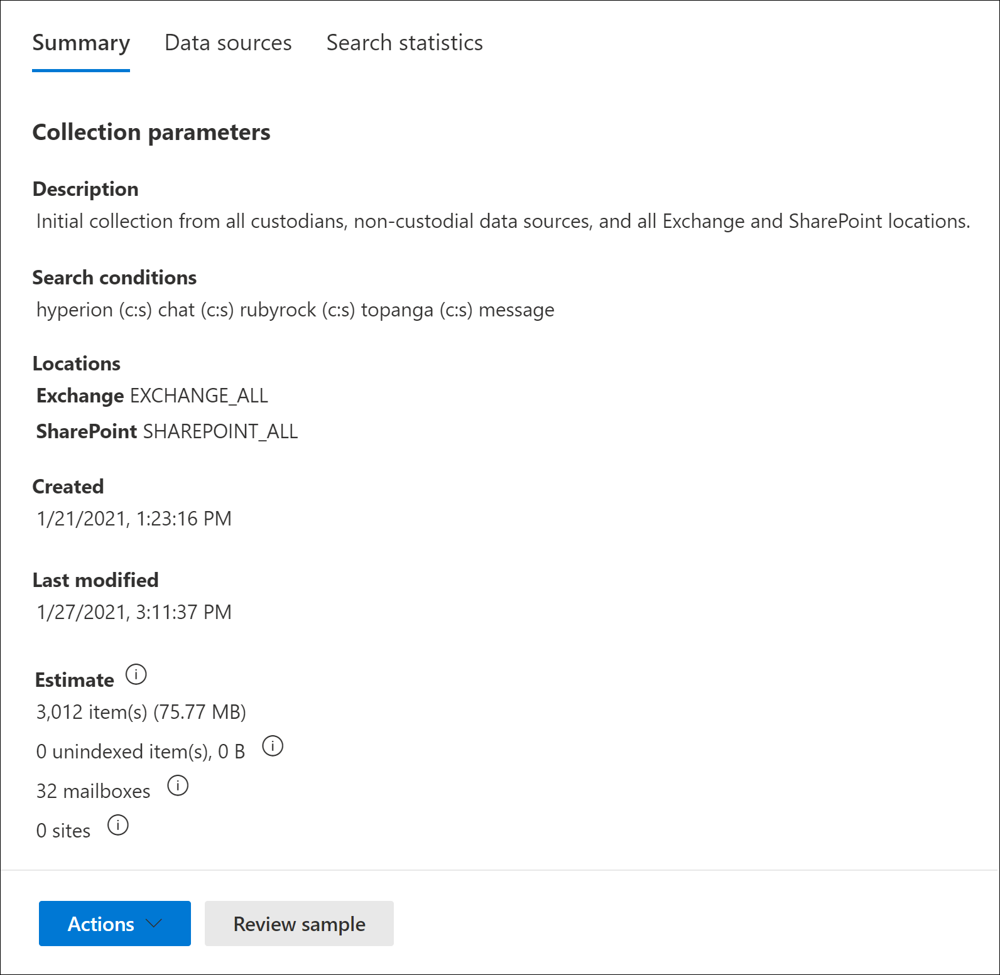

# 컬렉션에서 초안 컬렉션 Advanced eDiscovery

해당 사례에 대한 보호자 및 비보조 데이터 원본을 식별한 후 관련 문서 집합을 식별하고 찾을 준비가 된 것입니다. 이 작업을 위해 컬렉션 도구를 사용하여 데이터 원본에서 관련 콘텐츠를 검색합니다. 이 작업을 위해 지정된 데이터 원본에서 검색 조건과 일치하는 콘텐츠를 검색하는 컬렉션을 만들 수 있습니다. 항목의 예상 항목인 초안 컬렉션을 만들거나 검토 집합에 항목을 자동으로 추가하는 컬렉션을 만들 수 있습니다. 초안 컬렉션을 만들 때 검색 쿼리와 일치하는 예상 결과(예: 총 항목 수 및 크기, 검색된 여러 데이터 원본, 검색 쿼리에 대한 통계)에 대한 정보를 볼 수 있습니다. 컬렉션에서 반환된 항목의 샘플을 미리 볼 수 있습니다. 이러한 통계를 사용하여 검색 쿼리를 변경하고 초안 컬렉션을 다시 실행하여 결과 범위를 좁힐 수 있습니다. 컬렉션 결과에 만족하면 컬렉션을 검토 집합으로 커밋할 수 있습니다. 초안 컬렉션을 커밋하면 컬렉션에서 반환된 항목이 검토, 분석 및 내보내기용 검토 집합에 추가됩니다.

## 초안 컬렉션을 만들기 전에

- 초안 컬렉션을 만들기 전에 사례에 보호자 및 비보조 데이터 원본을 추가합니다. 초안 컬렉션을 만들 때 데이터 원본을 선택할 수 있도록 이 옵션을 선택해야 합니다. 자세한 내용은 다음을 참조하세요.

  - [보유자를 사례에 추가](add-custodians-to-case.md)

  - [비관리 데이터 원본을 사례에 추가](non-custodial-data-sources.md)

- 초안 컬렉션에서 사례와 관련이 있을 수 있는 콘텐츠에 대해 추가 데이터 원본(사례에 양도 또는 비보조 위치로 추가되지 않은 데이터 원본)을 검색할 수 있습니다. 이러한 데이터 원본에는 사서함, SharePoint 사이트 및 Teams. 이러한 상황이 해당되는 경우 컬렉션에 추가할 수 있도록 이러한 데이터 원본 목록을 컴파일합니다.

## 초안 컬렉션 만들기

1. 이 Microsoft 365 규정 준수 센터 사례를 Advanced eDiscovery 컬렉션 **탭을** 선택합니다.

2. 컬렉션 **페이지에서** 새 컬렉션 Standard **컬렉션**  >  **을 선택합니다.**

3. 컬렉션의 이름(필수) 및 설명(선택 사항)을 입력합니다. 컬렉션을 만든 후 이름을 변경할 수 없지만 설명을 수정할 수 있습니다.

4. **Custodial 데이터** 원본 페이지에서 다음 중 하나를 사용하여 콘텐츠를 수집할 양도 데이터 원본을 식별합니다.

   - **오타자** 선택을 클릭하여 사례에 추가된 특정 정보를 검색합니다. 이 옵션을 사용하면 대소문자 목록이 표시됩니다. 한 개 이상의 양도인을 선택합니다. 보호자 선택 및 추가 후 각 보호자에 대해 검색할 특정 데이터 원본을 선택할 수도 있습니다. 이러한 데이터 원본은 사례에 보호자가 추가될 때 지정되었습니다.

   - 모두 **선택 토글을** 클릭하여 사례에 추가된 모든 전환을 검색합니다. 이 옵션을 선택하면 모든 보호자에 대한 모든 데이터 원본이 검색됩니다.

5. 비보조 데이터 원본 페이지에서 다음 중 하나를 사용하여 콘텐츠를 수집할 비보조 데이터 원본을 식별합니다. 

   - **비보조** 데이터 원본 선택을 클릭하여 사례에 추가된 특정 비보조 데이터 원본을 선택합니다. 이 옵션을 사용하면 데이터 원본 목록이 표시됩니다. 이러한 데이터 원본 중 하나 이상을 선택합니다.

   - 모두 **선택 토글을** 클릭하여 사례에 추가된 모든 비보조 데이터 원본을 선택합니다.

6. 추가 **데이터 원본 페이지에서** 컬렉션의 일부로 검색할 다른 사서함 및 사이트를 선택할 수 있습니다. 이러한 유형의 데이터 원본은 이 경우 양도 또는 비보조 데이터 위치로 추가되지 않습니다. 추가 데이터 원본을 검색할 때 두 가지 옵션도 있습니다.

   - 특정 서비스(Exchange 사서함, SharePoint 및 OneDrive 사이트 또는 Exchange 공용 폴더)에 대한 모든 콘텐츠 위치를  검색하려면 상태 열에서 해당 모든 토글 선택을 **클릭합니다.** 이 옵션은 선택한 서비스의 모든 콘텐츠 위치를 검색합니다.

   - 서비스의 특정 콘텐츠 위치를 검색하려면 상태  열에서 해당 모든  토글 선택을  클릭한 다음 사용자, 그룹 또는 팀(Exchange 사서함의 경우) 또는 사이트 선택(SharePoint 및 OneDrive 사이트)을 클릭하여 특정 콘텐츠 위치를 검색합니다. 

7. 조건 **페이지에서** 이전 마법사 페이지에서 식별한 데이터 원본에서 항목을 수집하는 데 사용되는 검색 쿼리를 만들 수 있습니다. 키워드, property:value 쌍을 검색하거나 키워드 목록을 사용할 수 있습니다. 다양한 검색 조건을 추가하여 컬렉션 범위를 좁힐 수도 있습니다. 자세한 내용은 [컬렉션에 대한 검색 쿼리 작성을 참조하세요.](building-search-queries.md)

8. 초안으로 저장 또는 검토 **집합에** 추가 페이지에서 컬렉션을 초안으로 **저장을 선택합니다.**

   > [!NOTE]
   > 이 페이지의 다른 옵션을 사용하면 항목을 수집하고 검토 집합에 직접 추가할 수 있습니다. 이 옵션은 컬렉션 결과의 통계를 검토하고 예제를 미리 볼 수 있는 초안 컬렉션을 만드는 대신 해당 프로세스를 건너뛰고 검토 집합에 컬렉션을 자동으로 추가합니다. 검토 집합에 컬렉션을 추가하는 두 번째 옵션을 선택하는 경우 전체 채팅 대화 스레드를 Microsoft Teams 및 Yammer 클라우드 첨부 파일(최신 첨부 파일이라고도 합니다)을 수집하는 등의 추가 설정을 구성할 수 있습니다. 이러한 설정에 대한 자세한 내용은 검토 집합에 초안 컬렉션 [커밋을 참조하세요.](commit-draft-collection.md)

9. 컬렉션 **검토 페이지에서** 이전 페이지에서 구성한 컬렉션 설정을 검토하고 업데이트할 수 있습니다.

   - **요약 탭:** 컬렉션의 이름과 설명, 컬렉션 검색 조건, 추가 데이터 위치 및 컬렉션 형식을 검토하고 수정합니다.

   - **원본 탭:** 컬렉션에 대한 양도 및 비보조 데이터 원본을 검토하고 수정합니다.

10. **제출을** 클릭하여 초안 컬렉션을 만들 수 있습니다. 컬렉션이 만들어졌다는 확인 페이지가 표시됩니다.

## 초안 컬렉션을 만든 후 발생하는 작업

초안 컬렉션을 만든 후 이  경우 컬렉션 페이지에 해당 컬렉션이 나열되고 상태가 진행 중으로 표시됩니다. 검색 미리 보기 및 예상 작업 **준비** 작업도  만들어 작업 페이지에 표시됩니다.

초안 수집 프로세스 중에 Advanced eDiscovery 지정한 검색 조건 및 데이터 원본을 사용하여 검색 예상을 수행할 수 있습니다. Advanced eDiscovery 미리 볼 수 있는 항목의 샘플링도 준비합니다. 컬렉션이 완료되면 컬렉션 페이지의 다음 열과 해당  값이 업데이트됩니다.

- **Status:** 컬렉션의 상태와 유형을 나타냅니다. Estimated **값은** 초안 컬렉션이 완료된 것입니다. 또한 이 값은 컬렉션이 초안 컬렉션이고 검토 집합에 추가되지 않은 경우를 나타냅니다. 상태 **열의 커밋** **값은** 컬렉션이 검토 집합에 추가된 것입니다.

- **예상 상태:** 예상 검색 결과의 상태와 검색 예상 결과 및 통계를 검토할 준비가 되어 있는지 여부를 나타냅니다. Successful 값은 **초안** 컬렉션의 결과를 검토할 준비가 됐을 때를 나타냅니다. 초안 컬렉션을 처음 제출한 후 **컬렉션이** 계속 실행되고 있는 것을 나타내기 위해 진행 중 값이 표시됩니다.

- **미리 보기 상태:** 미리 볼 수 있는 샘플 항목의 상태를 나타냅니다. Successful **값은** 항목을 미리 볼 수 있는 상태입니다. 초안 컬렉션을 처음 제출한 후 **컬렉션이** 계속 실행되고 있는 것을 나타내기 위해 진행 중 값이 표시됩니다.

## 초안 컬렉션이 완료된 후의 다음 단계

초안 컬렉션이 성공적으로 완료되면 다양한 작업을 수행할 수 있습니다. 이러한 대부분의 작업을 수행하려면 컬렉션  탭으로 이동한 후 초안 컬렉션의 이름을 클릭하여 플라이아웃 페이지를 표시합니다.

다음은 컬렉션 플라이아웃 페이지에서 할 수 있는 사항 목록입니다.

- 요약 **탭을 선택하여** 컬렉션에 대한 요약 정보 및 컬렉션에서 반환된 예상 검색 결과를 볼 수 있습니다. 여기에는 예상 검색 결과의 총 항목 수와 크기, 검색 결과가 포함된 사서함 및 사이트 수, 컬렉션의 범위를 지정하는 데 사용되는 검색 조건(사용되는 경우)이 포함됩니다.

- 데이터 원본 **탭을 선택하여** 컬렉션에서 검색된 보호자 및 비영구적 데이터 원본 목록을 볼 수 있습니다. 검색된 추가 콘텐츠 위치는 요약 탭의 **위치** **아래에 나열됩니다.**

- 검색 **통계 탭을 선택하여** 컬렉션에 대한 통계를 볼 수 있습니다. 여기에는 각 서비스에서 찾은 총 항목 수와 크기(예: Exchange 사서함 또는 SharePoint 사이트)와 컬렉션에서 사용되는 검색 쿼리의 여러 구성 요소에서 반환되는 항목 수에 대한 통계를 표시하는 조건 보고서가 포함됩니다. 자세한 내용은 컬렉션 [통계 및 보고서를 참조하세요.](collection-statistics-reports.md)

- 샘플  검토(플라이아웃 페이지 아래쪽에 위치)를 클릭하여 컬렉션에서 반환된 항목의 샘플을 미리 볼 수 있습니다.

- 작업 편집 컬렉션을 클릭하여 초안 컬렉션을 검토 집합에   >  **커밋합니다.** 즉, 현재 설정을 사용하여 컬렉션을 다시 시작하고 컬렉션에서 반환된 항목을 검토 집합에 추가합니다. 앞서 설명한처럼 검토 집합에 컬렉션을 추가할 때 추가 설정(예: 대화 스레딩 및 클라우드 기반 첨부 파일)을 구성할 수도 있습니다. 자세한 정보 및 단계별 지침은 검토 집합에 초안 컬렉션 [커밋을 참조하세요.](commit-draft-collection.md)

## 초안 컬렉션 관리

초안 컬렉션의 플라이아웃 페이지에 있는 작업 메뉴의 옵션을 사용하여 다양한 관리 작업을 수행할 수 있습니다. 

다음은 관리 옵션에 대한 설명입니다.

- **컬렉션 편집:** 초안 컬렉션의 설정을 변경합니다. 변경한 후 컬렉션을 다시하고 검색 예상 결과 및 통계를 업데이트할 수 있습니다. 앞서 설명한 것 처럼 이 옵션을 사용하여 초안 컬렉션을 검토 집합에 커밋합니다.  

- **컬렉션 삭제:** 초안 컬렉션을 삭제합니다. 초안 컬렉션을 검토 집합에 커밋한 후 삭제할 수 없습니다.

- **새로 고침 예상** 결과: 초안 컬렉션에 지정된 데이터 원본에 대해 쿼리를 다시 실행하여 검색 예상 결과 및 통계를 업데이트합니다.

- **보고서로 내보내기:** 초안 컬렉션에 대한 정보를 로컬 컴퓨터로 다운로드할 수 있는 CSV 파일로 내보낼 수 있습니다. 내보내기 보고서에는 다음 정보가 포함되어 있습니다.

  - 초안 컬렉션의 검색 쿼리와 일치하는 항목이 포함된 각 콘텐츠 위치의 ID입니다. 이러한 위치는 일반적으로 사서함 또는 사이트입니다.
  
  - 각 콘텐츠 위치에 있는 총 항목 수입니다.
  
  - 각 콘텐츠 위치에 있는 항목의 총 크기(bytes)입니다.

  - 콘텐츠 위치가 Exchange SharePoint 서비스입니다.

- **Copy 컬렉션:** 기존 컬렉션의 설정을 복사하여 새 초안 컬렉션을 만들 수 있습니다. 새 컬렉션에는 다른 이름을 지정해야 합니다. 새 컬렉션을 제출하기 전에 설정을 수정할 수도 있습니다. 쿼리를 제출하면 검색 쿼리가 실행되어 새 예상치 및 통계가 생성됩니다. 이렇게 하면 초안 컬렉션을 더 빠르게 만든 다음 필요한 경우 선택한 설정을 수정하는 동시에 원본 컬렉션의 정보를 보존하는 것이 좋습니다. 또한 비슷한 두 컬렉션의 결과를 쉽게 비교할 수 있습니다.

> [!NOTE]
> 초안 컬렉션이 검토 집합에 커밋된 후 컬렉션을 복사하고 보고서만 내보낼 수 있습니다.
