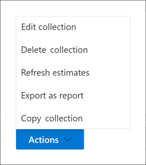

# Advanced eDiscovery에서 초안 컬렉션 만들기Create a draft collection in Advanced eDiscovery

해당 사례에 대한 보호자 및 비보조 데이터 원본을 식별한 후 관련 문서 집합을 식별하고 찾을 준비가 된 것입니다.After you've identified custodians and any non-custodian data sources for the case, you're ready to identify and locate a set of documents that are relevant. 이 작업을 위해 컬렉션 도구를 사용하여 데이터 원본에서 관련 콘텐츠를 검색합니다.You do this by using the Collections tool to search data sources for relevant content. 이 작업을 위해 지정된 데이터 원본에서 검색 조건과 일치하는 콘텐츠를 검색하는 컬렉션을 만들 수 있습니다.You do this by creating a collection that searches specified data sources for content that matches your search criteria. 항목의 예상 항목인 초안 컬렉션을 만들거나 검토 집합에 항목을 자동으로 추가하는 컬렉션을 만들 수 있습니다.You have the option to create a *draft collection*, which is an estimate of the items are found or you can create a collection that automatically adds the items to a review set. 초안 컬렉션을 만들 때 검색 쿼리와 일치하는 예상 결과(예: 총 항목 수 및 크기, 검색된 여러 데이터 원본, 검색 쿼리에 대한 통계)에 대한 정보를 볼 수 있습니다.When you create a draft collection, you can views information about the estimated results that matched the search query, such as the total number and size of items found, the different data sources where they were found, and statistics about the search query. 컬렉션에서 반환된 항목의 샘플을 미리 볼 수 있습니다.You can also preview a sample of items that were returned by the collection. 이러한 통계를 사용하여 검색 쿼리를 변경하고 초안 컬렉션을 다시 실행하여 결과 범위를 좁힐 수 있습니다.Using these statistics, you can change the search query and rerun the draft collection to narrow your results. 컬렉션 결과에 만족하면 컬렉션을 검토 집합으로 커밋할 수 있습니다.Once you're satisfied with the collection results, you can commit the collection to a review set. 초안 컬렉션을 커밋하면 컬렉션에서 반환된 항목이 검토, 분석 및 내보내기용 검토 집합에 추가됩니다.When you commit a draft collection, the items returned by the collection are added to a review set for review, analysis, and export.

## 초안 컬렉션을 만들기 전에Before you create a draft collection

- 초안 컬렉션을 만들기 전에 사례에 보호자 및 비보조 데이터 원본을 추가합니다.Add custodians and non-custodial data sources to the case before you create a draft collection. 초안 컬렉션을 만들 때 데이터 원본을 선택할 수 있도록 이 옵션을 선택해야 합니다.This is required so that you can select the data sources when you create a draft collection. 자세한 내용은 다음을 참조하세요.For more information, see:

  - [보유자를 사례에 추가Add custodians to a case](add-custodians-to-case.md)

  - [비관리 데이터 원본을 사례에 추가Add non-custodial data sources to a case](non-custodial-data-sources.md)

- 초안 컬렉션에서 사례와 관련이 있을 수 있는 콘텐츠에 대해 추가 데이터 원본(사례에 양도 또는 비보조 위치로 추가되지 않은 데이터 원본)을 검색할 수 있습니다.You can search additional data sources (ones that haven't been added to the case as custodial or non-custodial locations) in a draft collection for content that may be relevant to the case. 이러한 데이터 원본에는 사서함, SharePoint 사이트 및 Teams가 포함됩니다.These data sources might include mailboxes, SharePoint sites, and Teams. 이러한 상황이 해당되는 경우 컬렉션에 추가할 수 있도록 이러한 데이터 원본 목록을 컴파일합니다.If this situation is applicable to your case, compile a list of these data sources so you can add them to the collection.

## 초안 컬렉션 만들기Create a draft collection

1. Microsoft 365 규정 준수 센터에서 고급 eDiscovery 사례를 열고 컬렉션 **탭을** 선택합니다.In the Microsoft 365 compliance center, open the Advanced eDiscovery case, and then select the **Collections** tab.

2. 컬렉션 **페이지에서** 새 컬렉션 Standard **컬렉션**  >  **을 선택합니다.**On the **Collections** page, select **New collection** > **Standard collection**.

3. 컬렉션의 이름(필수) 및 설명(선택 사항)을 입력합니다.Type a name (required) and description (optional) for the collection. 컬렉션을 만든 후 이름을 변경할 수 없지만 설명을 수정할 수 있습니다.After the collection is created, you can't change the name, but you can modify the description.

4. **Custodial 데이터** 원본 페이지에서 다음 중 하나를 사용하여 콘텐츠를 수집할 양도 데이터 원본을 식별합니다.On the **Custodial data sources** page, do one of the following things to identify the custodial data sources to collect content from:

   - **오타자** 선택을 클릭하여 사례에 추가된 특정 정보를 검색합니다.Click **Select custodians** to search specific custodians that were added to the case. 이 옵션을 사용하면 대소문자 목록이 표시됩니다.If you use this option, a list of the case custodians is displayed. 한 개 이상의 양도인을 선택합니다.Select one or more custodians. 보호자 선택 및 추가 후 각 보호자에 대해 검색할 특정 데이터 원본을 선택할 수도 있습니다.After you select and add the custodians, you can also select the specific data sources to search for each custodian. 이러한 데이터 원본은 사례에 보호자가 추가될 때 지정되었습니다.These data sources that are displayed were specified when the custodian was added to the case.

   - 모두 **선택 토글을** 클릭하여 사례에 추가된 모든 전환을 검색합니다.Click the **Select all** toggle to search all custodians that were added to the case. 이 옵션을 선택하면 모든 보호자에 대한 모든 데이터 원본이 검색됩니다.When you select this option, all data sources for all custodians are searched.

5. 비보조 데이터 원본 페이지에서 다음 중 하나를 사용하여 콘텐츠를 수집할 비보조 데이터 원본을 식별합니다. On the **Non-custodial data sources** page, do one of the following things to identify the non-custodial data sources to collect content from:

   - **비보조** 데이터 원본 선택을 클릭하여 사례에 추가된 특정 비보조 데이터 원본을 선택합니다.Click **Select non-custodial data sources** to select specific non-custodial data sources that were added to the case. 이 옵션을 사용하면 데이터 원본 목록이 표시됩니다.If you use this option, a list of data sources displayed. 이러한 데이터 원본 중 하나 이상을 선택합니다.Select one or more of these data sources.

   - 모두 **선택 토글을** 클릭하여 사례에 추가된 모든 비보조 데이터 원본을 선택합니다.Click the **Select all** toggle to select all non-custodial data sources that were added to the case.

6. 추가 **데이터 원본 페이지에서** 컬렉션의 일부로 검색할 다른 사서함 및 사이트를 선택할 수 있습니다.On the **Additional data sources** page, you can select other mailboxes and sites to search as part of the collection. 이러한 유형의 데이터 원본은 이 경우 양도 또는 비보조 데이터 위치로 추가되지 않습니다.These types of data sources weren't added as custodial or non-custodial data locations in the case. 추가 데이터 원본을 검색할 때 두 가지 옵션도 있습니다.You also have two options when searching additional data sources:

   - 특정 서비스(Exchange 사서함, SharePoint 및 OneDrive 사이트 또는 Exchange 공용 폴더)에  대한 모든 콘텐츠 위치를 검색하려면 상태 열에서 해당 모든 선택 토글을 **클릭합니다.**To search all content locations for a specific service (Exchange mailboxes, SharePoint and OneDrive sites, or Exchange public folders), click the corresponding **Select all** toggle in the **Status** column. 이 옵션은 선택한 서비스의 모든 콘텐츠 위치를 검색합니다.This option will search all content locations in the selected service.

   - 서비스의 특정 콘텐츠 위치를 검색하려면 상태  열에서 해당 모든  토글 선택을 클릭한 다음 **사용자,** 그룹 또는 팀(Exchange 사서함의 경우) 또는 **사이트** 선택(SharePoint 및 OneDrive 사이트)을 클릭하여 특정 콘텐츠 위치를 검색합니다.To search specific content location for a service, click the corresponding **Select all** toggle in the **Status** column, and then click **Users, groups or teams** (for Exchange mailboxes) or **Choose sites** for (SharePoint and OneDrive sites) to search specific content locations.

7. 조건 **페이지에서** 이전 마법사 페이지에서 식별한 데이터 원본에서 항목을 수집하는 데 사용되는 검색 쿼리를 만들 수 있습니다.On the **Conditions** page, you can create the search query that is used to collect items from the data sources that you've identified in the previous wizard pages. 키워드, property:value 쌍을 검색하거나 키워드 목록을 사용할 수 있습니다.You can search for keywords, property:value pairs, or use a keyword list. 다양한 검색 조건을 추가하여 컬렉션 범위를 좁힐 수도 있습니다.You can also add various search conditions to narrow the scope of the collection. 자세한 내용은 [컬렉션에 대한 검색 쿼리 작성을 참조하세요.](building-search-queries.md)For more information, see [Build search queries for collections](building-search-queries.md).

8. 초안으로 저장 또는 검토 **집합에** 추가 페이지에서 컬렉션을 초안으로 **저장을 선택합니다.**On the **Save as draft or add to review set** page, select **Save collection as draft**.

   > [!NOTE]
   > 이 페이지의 다른 옵션을 사용하면 항목을 수집하고 검토 집합에 직접 추가할 수 있습니다.The other option on this page lets you collect items and add them direct to a review set. 이 옵션은 컬렉션 결과의 통계를 검토하고 예제를 미리 볼 수 있는 초안 컬렉션을 만드는 대신 해당 프로세스를 건너뛰고 검토 집합에 컬렉션을 자동으로 추가합니다.Instead of creating a draft collection that you can review statistics for and preview a sample of the collection results, this option skips that process and automatically adds the collection to a review set. 검토 집합에 컬렉션을 추가하는 두 번째 옵션을 선택하는 경우 Microsoft Teams에서 전체 채팅 대화 스레드를 수집하고 클라우드 첨부 파일(최신 첨부 파일이라고도 Yammer)을 수집하는 등 구성할 추가 설정이 있습니다.If you select the second option to add the collection to a review set, you have additional settings to configure, such as collecting entire chat conversation threads in Microsoft Teams and Yammer and collecting cloud attachments (also called *modern attachments*). 이러한 설정에 대한 자세한 내용은 검토 집합에 초안 컬렉션 [커밋을 참조하세요.](commit-draft-collection.md)For more information about these settings, see [Commit a draft collection to a review set](commit-draft-collection.md).

9. 컬렉션 **검토 페이지에서** 이전 페이지에서 구성한 컬렉션 설정을 검토하고 업데이트할 수 있습니다.On the **Review your collection** page, you can review and update the collection settings that you configured on the previous pages.

   - **요약 탭:** 컬렉션의 이름과 설명, 컬렉션 검색 조건, 추가 데이터 위치 및 컬렉션 형식을 검토하고 수정합니다.**Summary** tab:  Review and modify the name and description of the collection, the collection search criteria, additional data locations, and the collection type.

   - **원본 탭:** 컬렉션에 대한 양도 및 비보조 데이터 원본을 검토하고 수정합니다.**Sources** tab: Review and modify the custodial and non-custodial data sources for the collection.

10. **제출을** 클릭하여 초안 컬렉션을 만들 수 있습니다.Click **Submit** to create the draft collection. 컬렉션이 만들어졌다는 확인 페이지가 표시됩니다.A page is displayed confirming that the collection was created.

## 초안 컬렉션을 만든 후 발생하는 작업What happens after you create a draft collection

초안 컬렉션을 만든 후 이  경우 컬렉션 페이지에 해당 컬렉션이 나열되고 상태가 진행 중으로 표시됩니다.After you create a draft collection, it listed on the **Collections** page in the case and the status shows that it's in progress. 검색 미리 보기 및 예상 작업 **준비** 작업도  만들어 작업 페이지에 표시됩니다.A job named **Preparing search preview and estimates** is also created and displayed on the **Jobs** page in the case.

초안 수집 프로세스 중에 Advanced eDiscovery는 컬렉션에 지정한 검색 조건 및 데이터 원본을 사용하여 검색 예상을 수행합니다.During the draft collection process, Advanced eDiscovery performs a search estimate using the search criteria and data sources that you specified in the collection. Advanced eDiscovery는 미리 볼 수 있는 항목 샘플링도 준비합니다.Advanced eDiscovery also prepares a sampling of items that you can preview. 컬렉션이 완료되면 컬렉션 페이지의 다음 열과 해당  값이 업데이트됩니다.When the collection is complete, the following columns and corresponding values on the **Collection** page are updated:

- **Status:** 컬렉션의 상태와 유형을 나타냅니다.**Status**: Indicates the status and type of collection. Estimated **값은** 초안 컬렉션이 완료된 것입니다.A value of **Estimated** indicates that a draft collection is complete. 또한 이 값은 컬렉션이 초안 컬렉션이고 검토 집합에 추가되지 않은 경우를 나타냅니다.This same value also indicates that the collection is a draft collection, and that it hasn't been added to a review set. 상태 **열의 커밋** **값은** 컬렉션이 검토 집합에 추가된 것입니다.A value of **Committed** in the **Status** column indicates that the collection has been added to a review set.

- **예상 상태:** 예상 검색 결과의 상태와 검색 예상 결과 및 통계를 검토할 준비가 되어 있는지 여부를 나타냅니다.**Estimate status**: Indicates the status of the estimated search results and whether or not the search estimates and statistics are ready for review. Successful 값은 **초안** 컬렉션의 결과를 검토할 준비가 됐을 때를 나타냅니다.A value of **Successful** indicates the results of the draft collection are ready for review. 초안 컬렉션을 처음 제출한 후 **컬렉션이** 계속 실행되고 있는 것을 나타내기 위해 진행 중 값이 표시됩니다.After you first submit a draft collection, a value of **In progress** is displayed to indicate the collection is still running

- **미리 보기 상태:** 미리 볼 수 있는 샘플 항목의 상태를 나타냅니다.**Preview status**: Indicates the status of the sample items that you can preview. Successful **값은** 항목을 미리 볼 수 있는 상태입니다.A value of **Successful** indicates the items are ready for preview. 초안 컬렉션을 처음 제출한 후 **컬렉션이** 계속 실행되고 있는 것을 나타내기 위해 진행 중 값이 표시됩니다.After you first submit a draft collection, a value of **In progress** is displayed to indicate that the collection is still running.

## 초안 컬렉션이 완료된 후의 다음 단계Next steps after a draft collection is complete

초안 컬렉션이 성공적으로 완료되면 다양한 작업을 수행할 수 있습니다.After the draft collection is successfully completed, you can perform various tasks. 이러한 대부분의 작업을 수행하려면 컬렉션  탭으로 이동한 후 초안 컬렉션의 이름을 클릭하여 플라이아웃 페이지를 표시합니다.To perform most of these tasks, just go the **Collections** tab and click the name of the draft collection to display the flyout page.

다음은 컬렉션 플라이아웃 페이지에서 할 수 있는 사항 목록입니다.Here's a list of things you can do from the collection flyout page:

- 요약 **탭을 선택하여** 컬렉션에 대한 요약 정보 및 컬렉션에서 반환된 예상 검색 결과를 볼 수 있습니다.Select the **Summary** tab to view summary information about the collection and the estimated search results returned by the collection. 여기에는 예상 검색 결과의 총 항목 수와 크기, 검색 결과가 포함된 사서함 및 사이트 수, 컬렉션의 범위를 지정하는 데 사용되는 검색 조건(사용되는 경우)이 포함됩니다.This includes that total number of items and size of the estimated search results, the number of mailboxes and sites contained search results, and the search conditions (if used) used to scope the collection.

- 데이터 원본 **탭을 선택하여** 컬렉션에서 검색된 보호자 및 비영구적 데이터 원본 목록을 볼 수 있습니다.Select the **Data sources** tab to view a list of custodians and non-custodial data sources) that were searched in the collection. 검색된 추가 콘텐츠 위치는 요약 탭의 **위치** **아래에 나열됩니다.**Any additional content locations that were search are listed under **Locations** on the **Summary** tab.

- 검색 **통계 탭을 선택하여** 컬렉션에 대한 통계를 볼 수 있습니다.Select the **Search statistics** tab to view statistics about the collection. 여기에는 각 서비스에서 찾은 총 항목 수와 크기(예: Exchange 사서함 또는 SharePoint 사이트)와 컬렉션에서 사용하는 검색 쿼리의 여러 구성 요소에서 반환되는 항목 수에 대한 통계를 표시하는 조건 보고서가 포함됩니다.This includes the total number and size of items found in each service (for example, Exchange mailboxes or SharePoint sites) and a condition report that displays statistics about the number of items returned by different components of the search query used by the collection. 자세한 내용은 컬렉션 [통계 및 보고서를 참조하세요.](collection-statistics-reports.md)For more information, see [Collection statistics and reports](collection-statistics-reports.md).

- 샘플  검토(플라이아웃 페이지 아래쪽에 위치)를 클릭하여 컬렉션에서 반환된 항목의 샘플을 미리 볼 수 있습니다.Click **Review sample** (located at the bottom of the flyout page) to preview a sample of the items returned by the collection.

- 작업 편집 컬렉션을 클릭하여 초안 컬렉션을 검토 집합에   >  **커밋합니다.**Commit the draft collection to a review set (by clicking **Actions** > **Edit collection**). 즉, 현재 설정을 사용하여 컬렉션을 다시 시작하고 컬렉션에서 반환된 항목을 검토 집합에 추가합니다.This means that you rerun the collection (using the current settings) and add the items returned by the collection to a review set. 앞서 설명한처럼 검토 집합에 컬렉션을 추가할 때 추가 설정(예: 대화 스레딩 및 클라우드 기반 첨부 파일)을 구성할 수도 있습니다.As previously explained, you can also configure additional settings (such as conversation threading and cloud-based attachments) when you add the collection to a review set. 자세한 정보 및 단계별 지침은 검토 집합에 초안 컬렉션 [커밋을 참조하세요.](commit-draft-collection.md)For more information and step-by-step instructions, see [Commit a draft collection to a review set](commit-draft-collection.md).

## 초안 컬렉션 관리Manage a draft collection

초안 컬렉션의 플라이아웃 페이지에 있는 작업 메뉴의 옵션을 사용하여 다양한 관리 작업을 수행할 수 있습니다. You can use the options in the **Actions** menu on the flyout page of a draft collection to perform various management tasks.

다음은 관리 옵션에 대한 설명입니다.Here's are descriptions of the management options.

- **컬렉션 편집:** 초안 컬렉션의 설정을 변경합니다.**Edit collection**: Change the settings of the draft collection. 변경한 후 컬렉션을 다시하고 검색 예상 결과 및 통계를 업데이트할 수 있습니다.After you make changes, you can rerun the collection and update the search estimates and statistics. 앞서 설명한 것 처럼 이 옵션을 사용하여 초안 컬렉션을 검토 집합에 커밋합니다.As previously explained, you use this option to commit a draft collection to a review set.  

- **컬렉션 삭제:** 초안 컬렉션을 삭제합니다.**Delete collection**: Delete a draft collection. 초안 컬렉션을 검토 집합에 커밋한 후 삭제할 수 없습니다.Note that after a draft collection is committed to a review set, it can't be deleted.

- **새로 고침 예상** 결과: 초안 컬렉션에 지정된 데이터 원본에 대해 쿼리를 다시 실행하여 검색 예상 결과 및 통계를 업데이트합니다.**Refresh estimates**: Rerun the query (against the data sources) specified in the draft collection to update the search estimates and statistics.

- **보고서로 내보내기:** 초안 컬렉션에 대한 정보를 로컬 컴퓨터로 다운로드할 수 있는 CSV 파일로 내보낼 수 있습니다.**Export as report**: Exports information about the draft collection to a CSV file that you can download to your local computer. 내보내기 보고서에는 다음 정보가 포함되어 있습니다.The export report contains the following information:

  - 초안 컬렉션의 검색 쿼리와 일치하는 항목이 포함된 각 콘텐츠 위치의 ID입니다.The identity of each content location that contains items that match the search query in the draft collection. 이러한 위치는 일반적으로 사서함 또는 사이트입니다.These locations are typically mailboxes or sites.
  
  - 각 콘텐츠 위치에 있는 총 항목 수입니다.The total number of items in each content location.
  
  - 각 콘텐츠 위치에 있는 항목의 총 크기(bytes)입니다.The total size (in bytes) of the items in each content location.

  - 콘텐츠 위치가 있는 서비스(예: Exchange 또는 SharePoint)입니다.The service (such as Exchange or SharePoint) in which the content location is located.

- **Copy 컬렉션:** 기존 컬렉션의 설정을 복사하여 새 초안 컬렉션을 만들 수 있습니다.**Copy collection**: Create a new draft collection by copying the settings from an existing collection. 새 컬렉션에는 다른 이름을 지정해야 합니다.You have to use a different name for the new collection. 새 컬렉션을 제출하기 전에 설정을 수정할 수도 있습니다.You also have the option to modify the settings before you submit the new collection. 쿼리를 제출하면 검색 쿼리가 실행되어 새 예상치 및 통계가 생성됩니다.After you submit it, the search query is run and new estimates and statistics are generated. 이렇게 하면 초안 컬렉션을 더 빠르게 만든 다음 필요한 경우 선택한 설정을 수정하는 동시에 원본 컬렉션의 정보를 보존하는 것이 좋습니다.The is a good way to quickly create additional draft collection and then modify selected settings as necessary while still preserving information in the original collection. 또한 비슷한 두 컬렉션의 결과를 쉽게 비교할 수 있습니다.This also lets you easily compare the results of two similar collections.

> [!NOTE]
> 초안 컬렉션이 검토 집합에 커밋된 후 컬렉션을 복사하고 보고서만 내보낼 수 있습니다.After a draft collection is committed to a review set, you can only copy the collection and export a report.
