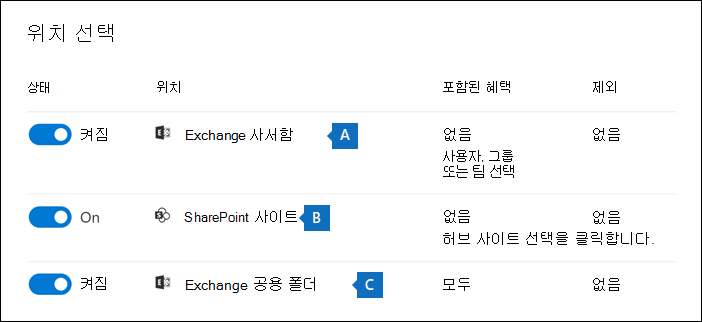
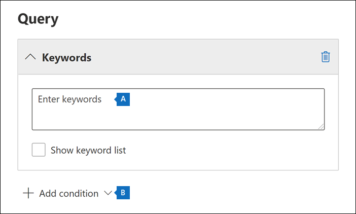

# <a name="create-an-ediscovery-hold"></a>eDiscovery 보존 만들기

Core eDiscovery 사례를 사용하여 보류를 만들어 사례와 관련이 있을 수 있는 콘텐츠를 보존할 수 있습니다. 이 경우 조사하는 Exchange 사서함 및 비즈니스용 OneDrive 계정을 보류할 수 있습니다. 또한 그룹, Microsoft Teams 그룹 및 그룹과 연결된 사서함 및 Office 365 보류할 Yammer 있습니다. 콘텐츠 위치를 보류 중으로 두면 보류에서 콘텐츠 위치를 제거하거나 보류를 삭제할 때까지 콘텐츠가 보존됩니다.

eDiscovery 보류를 만든 후 보류를 적용하는 데 최대 24시간이 걸릴 수 있습니다.

보류를 만들 때 지정된 콘텐츠 위치에 보존되는 콘텐츠의 범위를 지정하는 옵션은 다음과 같습니다.
  
- 지정된 위치의 모든 콘텐츠가 보류된 무한 보류를 만들 수 있습니다. 또는 검색 쿼리와 일치하는 지정된 위치의 콘텐츠만 보류된 쿼리 기반 보류를 만들 수 있습니다.

- 해당 날짜 범위 내에서 보내거나 받거나 만든 콘텐츠만 보존할 날짜 범위를 지정합니다. 또는 모든 콘텐츠를 전송, 수신 또는 만든 시간과 관계없이 지정된 위치에 모두 보유할 수 있습니다.
  
## <a name="how-to-create-an-ediscovery-hold"></a>eDiscovery 보류를 만드는 방법

Core eDiscovery 사례와 연결된 eDiscovery 보류를 만들 수 있는 경우:
  
1. <a href="https://go.microsoft.com/fwlink/p/?linkid=2077149" target="_blank">eDiscovery Microsoft 365 규정 준수 센터</a> 권한이 할당된 사용자 계정의 자격 증명을 사용하여 로그인합니다.

2. 왼쪽 탐색 창에서 모두 표시를 클릭한 다음 핵심 에서 **eDiscovery > 클릭합니다.**

3. Core **eDiscovery** 페이지에서 보류를 만들 사례의 이름을 클릭합니다.

4. 사례의 **홈** 페이지에서 보류 **탭을** 클릭합니다.
  
5. 보류 **페이지에서** 만들기를 **클릭합니다.**

6. 보류 **마법사 이름 지정** 페이지에서 보류 이름을 지정하고 선택적 설명을 추가한 후 다음 을 **클릭합니다.** 보류 이름은 조직에서 고유해야 합니다.

7. 위치 **선택 마법사** 페이지에서 보류할 콘텐츠 위치를 선택합니다. 사서함, 사이트, 공용 폴더를 보류 상태로 지정할 수 있습니다.

    
  
   1. **Exchange 사서함**: 토글을 **켜기** 로 설정한 다음 **사용자, 그룹 또는 팀 선택** 을 클릭하여 보류할 사서함을 지정합니다. 검색 상자를 사용하여 보류 상태로 지정할 사용자 사서함 및 메일 그룹(그룹 구성원의 사서함을 보류)을 찾습니다. Microsoft 팀, 그룹 및 그룹 그룹에 대한 연결된 Office 365 보류할 Yammer 있습니다. 사서함을 보류할 때 보존되는 응용 프로그램 데이터에 대한 자세한 내용은 [eDiscovery의](what-is-stored-in-exo-mailbox.md)사서함에 저장된 콘텐츠를 참조하세요.

   2. **SharePoint 사이트**: 토글을 **켜기** 로 설정한 다음 **사이트 선택** 을 클릭하여 SharePoint 사이트 및 OneDrive 계정을 보류할 수 있습니다. 보류할 각 사이트의 URL을 입력합니다. Microsoft 팀, SharePoint 그룹 또는 그룹 그룹에 대한 Office 365 URL을 추가할 Yammer 있습니다.
  
   3. **Exchange 공용 폴더**: 토글을 **켜기** 로 설정하여 Exchange Online 조직의 모든 공용 폴더를 보류합니다. 보류할 특정 공용 폴더는 선택할 수 없습니다. 공용 폴더를 보류하고 싶지 않은 경우 토글 스위치를 해제합니다.

   > [!NOTE]
   > 보류에 콘텐츠 위치를 하나 이상 추가해야 합니다. 그렇지 않으면 eDiscovery 보류 통계에 보류된 항목이 없음이 표시될 수 있습니다.

8. 보류에 위치 추가를 완료하면 다음 을 **클릭합니다.**

9. 키워드 또는 조건을 사용하여 쿼리 기반 보류를 만들 경우 다음 단계를 완료합니다. 지정된 콘텐츠 위치에 있는 모든 콘텐츠를 보존하려면 다음 을 **클릭합니다.**

    
  
    1. 키워드 아래에 **있는 상자에** 쿼리 조건과 일치하는 콘텐츠만 보존하는 쿼리를 입력합니다. 키워드, 전자 메일 메시지 속성 또는 사이트 속성(예: 파일 이름)을 지정할 수 있습니다. **AND**, **OR** 또는 NOT과 같은 부울 연산자를 사용하는 좀 더 복잡한 쿼리를 사용할 수도 **있습니다.**

    2. 조건 **추가를** 클릭하여 하나 이상의 조건을 추가하여 보류에 대한 쿼리 범위를 좁힐 수 있습니다. 각 조건은 보류를 만들 때 만들어 실행되는 KQL 검색 쿼리에 절을 추가합니다. 예를 들어 날짜 범위 내에서 만든 전자 메일 또는 사이트 문서가 보존될 수 있도록 날짜 범위를 지정할 수 있습니다. 조건은 키워드 상자에 지정된 키워드 쿼리  및 AND 연산자에 의해 다른 조건에 **논리적으로 연결됩니다.** 즉, 항목이 키워드 쿼리와 보존 조건을 모두 충족해야 합니다.

    검색 쿼리를 만들고 조건을 사용하는 데 대한 자세한 내용은 [eDiscovery에 대한 키워드 쿼리 및 검색 조건을 참조하세요.](keyword-queries-and-search-conditions.md)

10. 쿼리 기반 보류를 구성한 후 다음 을 **클릭합니다.**

11. 설정을 검토하고 필요한 경우 편집한 다음 제출을 **클릭합니다.**

## <a name="query-based-holds-placed-on-sites"></a>사이트에 배치된 쿼리 기반 보류

쿼리 기반 eDiscovery를 사이트의 문서에 저장하는 경우 다음 SharePoint 유의하십시오.

- 쿼리 기반 보류는 처음에 삭제된 후 짧은 기간 동안 사이트의 모든 문서를 보존합니다. 즉, 문서가 삭제되면 쿼리 기반 보류의 조건과 일치하지 않는 경우에도 문서가 자료 보존 라이브러리로 이동됩니다. 그러나 쿼리 기반 보류와 일치하지 않는 삭제된 문서는 자료 보존 라이브러리를 처리하는 Timer Job에 의해 제거됩니다. Timer 작업은 주기적으로 실행됩니다. 자료 보존 라이브러리의 모든 문서와 쿼리 기반 eDiscovery 보류(및 기타 유형의 보류 및 보존 정책)를 비교합니다. 쿼리 기반 보류와 일치하지 않는 문서를 삭제하고 유지한 문서를 보존합니다.

- 특정 폴더나 사이트에 문서를 보존하거나 다른 위치 기반 보류 조건을 사용하는 등 특정 보존을 수행하는 데는 쿼리 기반 보류를 사용하지 말아야 합니다. 이렇게 하면 의도하지 않은 결과가 있을 수 있습니다. 사이트 문서를 보존하기 위해 키워드, 날짜 범위 또는 기타 문서 속성과 같은 위치 기반이 아닌 보류 조건을 사용하는 것이 좋습니다.

## <a name="ediscovery-hold-statistics"></a>eDiscovery 보류 통계

eDiscovery 보류를 만든 후 선택한 보류에 대한 플라이아웃 페이지에 새 보류에 대한 정보가 표시됩니다. 이 정보에는 보류된 총 항목 수와 크기, 마지막으로 보류 통계를 계산한 시간 등 보류된 콘텐츠에 대한 통계 및 보류된 사서함 및 사이트 수가 포함됩니다. 이러한 보류 통계는 사례와 관련된 콘텐츠의 양을 식별하는 데 도움이 됩니다.
  

  
eDiscovery 보류 통계에 대해 다음에 유의하십시오.
  
- 보류된 총 항목 수는 보류된 모든 콘텐츠 원본의 항목 수를 나타냅니다. 쿼리 기반 보류를 만든 경우 이 통계는 쿼리와 일치하는 항목 수를 나타냅니다.

- 보류된 항목 수에는 콘텐츠 위치에 있는 인덱서되지 않은 항목도 포함됩니다. 쿼리 기반 보류를 만들면 콘텐츠 위치의 인덱서되지 않은 모든 항목이 보류됩니다. 여기에는 날짜 범위 조건 외부에 있을 수 있는 쿼리 기반 보류 및 인덱서되지 않은 항목의 검색 조건과 일치하지 않는 인덱서되지 않은 항목이 포함됩니다. 이는 검색 쿼리와 일치하지 않는 인덱서되지 않은 항목이 검색 결과에 포함되지 않은 경우 또는 날짜 범위 조건에 의해 제외되는 검색을 실행할 때 발생하는 상황과는 다릅니다. 인덱싱되지 않은 항목에 대한 자세한 내용은 [부분적으로 인덱싱된 항목을 참조하세요.](partially-indexed-items-in-content-search.md)

- 업데이트 통계 업데이트를 클릭하여 현재 보류 중인 항목 수를 계산하는 검색 예상 결과를 다시 시작하면 최신 보류 통계를 얻을 수 있습니다. 

- 사서함 또는 사이트가 보류된 사용자는 일반적으로 새 전자 메일 메시지를 보내거나 받고 새 전자 메일 메시지를 보내거나 받는 사용자가 SharePoint 및 OneDrive.

- Exchange 사서함, SharePoint 사이트 또는 OneDrive 계정이 Multi-Geo 환경의 다른 지역으로 이동되는 경우 해당 사이트의 통계가 보류 통계에 포함되지 않습니다. 그러나 이러한 위치의 콘텐츠는 계속 보존됩니다. 또한 사서함 또는 사이트를 다른 지역으로 이동하면 보류에 표시되는 SMTP 주소 또는 URL이 자동으로 업데이트되지 않습니다. 콘텐츠 위치가 보류 통계에 다시 포함될 수 있도록 보류를 편집하고 URL 또는 SMTP 주소를 업데이트해야 합니다.

## <a name="search-locations-on-ediscovery-hold"></a>eDiscovery 보류의 검색 위치

Core [](search-for-content-in-core-ediscovery.md) eDiscovery 사례에서 콘텐츠를 검색할 때 사례와 연결된 보류된 콘텐츠 위치만 검색하도록 검색을 신속하게 구성할 수 있습니다.

**보류된** 모든 콘텐츠 위치를 검색하려면 보류 위치 옵션을 선택합니다. 사례에 여러 eDiscovery 보류가 포함된 경우 이 옵션을 선택하면 모든 보류의 콘텐츠 위치가 검색됩니다. 또한 콘텐츠 위치가 쿼리 기반 보류에 배치된 경우 검색을 실행할 때 보류 쿼리와 일치하는 항목만 검색됩니다. 즉, 보류 조건과 검색 조건 둘 다와 일치하는 콘텐츠만 검색 결과와 함께 반환됩니다. 예를 들어 사용자가 특정 날짜 전에 보내거나 만든 항목을 보존하는 쿼리 기반 케이스 보류를 설정한 경우 해당 항목만 검색됩니다. 이 작업을 수행하기 위해 AND 연산자로 케이스 보류 쿼리와 검색 쿼리를 **연결합니다.**

다음은 eDiscovery 보류의 위치를 검색할 때 유의해야 할 몇 가지 다른 사항입니다.

- 콘텐츠 위치가 동일한 사례 내에서 여러 보류의 일부인 경우 모든 사례 콘텐츠 옵션을 사용하여 해당 콘텐츠 위치를 검색할 때 **OR** 연산자가 보류 쿼리를 결합합니다. 마찬가지로 콘텐츠 위치가 두 개의 서로 다른 보류의 일부인 경우 다른 하나는 쿼리 기반의 보류인 반면 다른 하나는 무한 보류인 경우(모든 콘텐츠가 보류된 경우) 모든 콘텐츠가 무한 보류 때문에 검색됩니다.

- 보류된 위치를 검색하도록 검색을 구성한 다음 이 경우 위치를 추가 또는 제거하거나 보류 쿼리를 변경하여 eDiscovery 보류를 변경하면 해당 변경 내용으로 검색 구성이 업데이트됩니다. 그러나 검색 결과를 업데이트하기 위해 보류가 변경된 후 검색을 다시 다시해야 합니다.

- eDiscovery 사례에서 단일 위치에 여러 eDiscovery 보류가 배치된 경우 보류된 위치를 검색하기로 선택한 경우 해당 검색 쿼리의 최대 키워드 수는 500개입니다. 이는 검색에서 **OR** 연산자를 사용하여 모든 쿼리 기반 보류를 결합하기 때문에입니다. 결합된 보류 쿼리 및 검색 쿼리에 키워드가 500개가 넘는 경우 쿼리 기반 케이스 보류와 일치하는 콘텐츠가 아니라 사서함의 모든 콘텐츠가 검색됩니다.

- eDiscovery 보류 상태가 켜기(보류 **중)인** 경우 보류가 켜져 있는 동안에도 보류 중인 위치를 검색할 수 있습니다.

## <a name="preserve-content-in-microsoft-teams"></a>콘텐츠 보존 Microsoft Teams

Microsoft Teams 채널의 일부인 대화는 Microsoft 팀과 연결된 사서함에 저장됩니다. 마찬가지로 팀 구성원이 채널에서 공유하는 파일은 팀의 SharePoint 사이트에 저장됩니다. 따라서 채널의 대화와 파일을 보존하려면 팀 사서함과 SharePoint 사이트를 eDiscovery에 유지해야 합니다.

또는 채팅 목록에 *Teams(1:1* 채팅 또는 *1:N* 그룹 채팅)는 채팅에 참가하는 사용자의 사서함에 저장됩니다. 사용자가 채팅 대화에서 공유하는 파일은 파일을 공유하는 OneDrive 계정으로 저장됩니다. 따라서 채팅 목록의 대화와 파일을 보존하려면 OneDrive 사용자 사서함 및 OneDrive 계정을 eDiscovery 보류에 추가해야 합니다. 팀 사서함과 사이트를 보류하는 것 외에도 Microsoft 팀 구성원의 사서함을 보류하는 것이 좋습니다.

> [!NOTE]
> 조직에 Exchange Exchange 하이브리드 배포가 있는 경우(또는 조직이 Office 365와 Office 365) Microsoft Teams 하이브리드 배포를 사용하도록 설정한 경우, Teams 채팅 응용 프로그램을 사용하여 1:1 채팅 및 1:N 그룹 채팅에 참가할 수 있습니다. 이러한 대화는 사내 사용자와 연결된 클라우드 기반 저장소에 저장됩니다. eDiscovery 보류에 Teams 클라우드 기반 저장소의 Teams 채팅 콘텐츠가 보존됩니다. 자세한 내용은 [온-프레미스 사용자의 Teams 채팅 데이터 검색](search-cloud-based-mailboxes-for-on-premises-users.md)을 참조하세요.

콘텐츠 보존에 Teams 대한 자세한 내용은 법적 보존에 Microsoft Teams 사용자 또는 팀을 [추가를 참조하세요.](/MicrosoftTeams/legal-hold)

### <a name="preserve-card-content"></a>카드 콘텐츠 보존

마찬가지로, Teams 채널, 1:1 채팅 및 1:N 그룹 채팅에서 앱에서 생성한 카드 콘텐츠는 사서함에 저장되고 사서함이 eDiscovery 보류 중일 때 보존됩니다. *카드* 는 짧은 내용의 UI 컨테이너입니다. 카드에는 여러 속성과 첨부 파일이 있을 수 있으며 카드 작업을 트리거하는 단추를 포함할 수 있습니다. 자세한 내용은 카드 를 [참조하세요.](/microsoftteams/platform/task-modules-and-cards/what-are-cards) 다른 Teams 콘텐츠와 마찬가지로 카드 콘텐츠가 저장되는 위치는 카드가 사용된 위치를 기준으로 합니다. Teams 채널에 사용되는 카드의 내용은 Teams 그룹 사서함에 저장됩니다. 1:1 및 1xN 채팅의 카드 콘텐츠는 채팅 참가자의 우편함에 저장됩니다.

### <a name="preserve-meeting-and-call-information"></a>모임 및 통화 정보 보존

Teams 채널의 모임 및 통화에 대한 요약 정보는 모임 또는 통화에 전화를 거는 사용자의 사서함에도 저장됩니다. 이 콘텐츠는 사용자 사서함에 eDiscovery 보류가 설정될 때도 보존됩니다.

### <a name="preserve-content-in-private-channels"></a>비공개 채널에서 콘텐츠 보존

2020년 2월부터는 비공개 채널의 콘텐츠를 보존하는 기능을 설정했습니다. 비공개 채널 채팅은 채팅 참가자의 사서함에 저장되어 있기 때문에 eDiscovery 보류에 사용자 사서함을 배치하면 비공개 채널 채팅이 보존됩니다. 또한 사용자 사서함이 2020년 2월 이전에 eDiscovery 보류에 추가된 경우 이제 보류는 해당 사서함에 저장된 비공개 채널 메시지에 자동으로 적용됩니다. 비공개 채널에서 공유되는 파일 보존도 지원됩니다.

### <a name="preserve-wiki-content"></a>위키 콘텐츠 보존

모든 팀 또는 팀 채널에는 메모를 찍고 공동 작업을 위한 Wiki도 포함되어 있습니다. Wiki 콘텐츠는 자동으로 .mht 형식의 파일에 저장됩니다. 이 파일은 팀의 SharePoint 사이트에 있는 Teams Wiki Data 문서 라이브러리에 저장됩니다. 팀의 사이트 사이트를 eDiscovery 보류에 추가하여 wiki SharePoint 보존할 수 있습니다.

> [!NOTE]
> 팀 또는 팀 채널의 Wiki 콘텐츠를 보존하는 기능(팀의 SharePoint 사이트를 보류할 때)은 2017년 6월 22일 출시되었습니다. 팀 사이트가 보류 중이면 해당 날짜부터 위키 콘텐츠가 보존됩니다. 그러나 팀 사이트가 보류 중이고 2017년 6월 22일 전에 위키 콘텐츠가 삭제된 경우 Wiki 콘텐츠는 보존되지 않습니다.

### <a name="office-365-groups"></a>Office 365 그룹

Teams 그룹에서 Office 365. 따라서 Office 365 그룹을 eDiscovery 보류에 배치하는 것은 콘텐츠의 Teams 배치하는 것이 비슷합니다.

eDiscovery 보류에 Teams Office 365 다음에 유의해야 합니다.

- 앞서 설명한 Teams 및 Office 365 그룹에 콘텐츠를 저장하기 위해 그룹 또는 팀과 연결된 사서함 및 SharePoint 사이트를 지정해야 합니다.

- [PowerShell에서](/powershell/exchange/connect-to-exchange-online-powershell) **Get-UnifiedGroup** cmdlet을 실행하여 Exchange Online 그룹의 속성을 Teams Office 365 합니다. 이는 팀 또는 그룹과 연결된 사이트의 URL을 Office 365 좋은 방법입니다. 예를 들어 다음 명령을 실행하면 Senior Leadership Team이라는 Office 365 그룹의 선택된 속성이 표시됩니다.

    ```text
    Get-UnifiedGroup "Senior Leadership Team" | FL DisplayName,Alias,PrimarySmtpAddress,SharePointSiteUrl

    DisplayName            : Senior Leadership Team
    Alias                  : seniorleadershipteam
    PrimarySmtpAddress     : seniorleadershipteam@contoso.onmicrosoft.com
    SharePointSiteUrl      : https://contoso.sharepoint.com/sites/seniorleadershipteam
    ```

    > [!NOTE]
    > **Get-UnifiedGroup** cmdlet를 실행하려면 Exchange Online에서 보기 전용 받는 사람 역할을 할당받았거나 보기 전용 받는 사람 역할이 할당된 역할 그룹의 구성원이어야 합니다. 
  
- 사용자의 사서함을 검색하면 사용자가 구성원인 Office 365 그룹 또는 그룹이 검색되지 않습니다. 마찬가지로 팀 또는 Office 365 그룹이 eDiscovery 보류로 설정되어 있는 경우 그룹 사서함 및 그룹 사이트만 보류됩니다. eDiscovery 비즈니스용 OneDrive 추가하지 않는 한 그룹 구성원의 사서함 및 사이트는 보류되지 않습니다. 따라서 법적 이유로 팀 또는 Office 365 그룹을 보류해야 하는 경우 팀 또는 그룹 구성원의 사서함과 OneDrive 계정을 동일한 보류에 추가하는 것이 고려됩니다.

- 팀 또는 그룹 구성원 목록을 Office 365 그룹의 그룹 페이지에서 속성을 볼 수 <a href="https://go.microsoft.com/fwlink/p/?linkid=2052855" target="_blank"></a> Microsoft 365 관리 센터. 또는 Exchange Online PowerShell에서 다음 명령을 실행할 수 있습니다.

    ```powershell
    Get-UnifiedGroupLinks <group or team name> -LinkType Members | FL DisplayName,PrimarySmtpAddress
    ```

    > [!NOTE]
    > **Get-UnifiedGroupLinks** cmdlet를 실행하려면 Exchange Online에서 보기 전용 받는 사람 역할을 할당받았거나 보기 전용 받는 사람 역할이 할당된 역할 그룹의 구성원이어야 합니다.

## <a name="preserve-content-in-onedrive-accounts"></a>계정에서 OneDrive 보존

eDiscovery 사례와 연결된 보류 또는 검색에 추가할 수 있도록 조직의 비즈니스용 OneDrive 사이트의 URL 목록을 수집하기 위해 조직의 모든 OneDrive 위치 목록 만들기를 [참조하세요.](/onedrive/list-onedrive-urls) 이 문서의 스크립트는 조직의 모든 사이트 목록이 OneDrive 텍스트 파일을 만듭니다. 이 스크립트를 실행하려면 SharePoint Online 관리 셸을 설치하고 사용해야 합니다. 조직의 MySite 도메인에 대한 URL을 검색하려는 각 OneDrive 사이트 앞에 붙입니다. 이것은 모든 OneDrive 도메인을 포함하는 도메인입니다(예: `https://contoso-my.sharepoint.com`). 사용자의 OneDrive 사이트에 대한 URL의 예는 다음과 같습니다.  `https://contoso-my.sharepoint.com/personal/sarad_contoso_onmicrosoft.com`.

> [!IMPORTANT]
> 사용자 OneDrive 계정의 URL에는 UPN(사용자 계정 이름)(예: )이 `https://alpinehouse-my.sharepoint.com/personal/sarad_alpinehouse_onmicrosoft_com` 포함됩니다. 드물게 개인의 UPN이 변경되는 경우, 새 UPN을 OneDrive URL도 변경됩니다. 사용자의 OneDrive 계정이 eDiscovery 보류의 일부인 경우 이전 및 해당 UPN이 변경된 경우 보류를 업데이트해야 합니다. 보류를 업데이트하고 사용자의 새 OneDrive URL을 추가하고 이전 URL을 제거해야 합니다. 자세한 내용은 [UPN 변경 내용이 OneDrive URL에 미치는 영향](/onedrive/upn-changes)을 참조하세요.

## <a name="removing-content-locations-from-an-ediscovery-hold"></a>eDiscovery 보류에서 콘텐츠 위치 제거

사서함, SharePoint 사이트 또는 OneDrive 계정이 eDiscovery 보류에서 제거되면  지연 보류가 적용됩니다. 즉, 데이터가 콘텐츠 위치에서 영구적으로 삭제(제거)되는 것을 방지하기 위해 보류의 실제 제거가 30일 동안 지연됩니다. 이를 통해 관리자는 eDiscovery 보류가 제거된 후 제거될 콘텐츠를 검색하거나 복구할 수 있습니다. 사서함과 사이트에 대해 지연 보류가 작동하는 방식에 대한 세부 정보는 서로 다릅니다.

- **사서함:** 관리되는 폴더 도우미가 다음에 사서함을 처리하고 eDiscovery 보류가 제거된 경우 사서함에 지연 보류가 적용됩니다. 특히 관리되는 폴더 도우미가 다음 사서함 속성 중 하나를 True로 설정하면 사서함에 지연 보류가 **적용됩니다.**

   - **DelayHoldApplied:** 이 속성은 사용자 사서함에 저장된 전자 메일 관련 콘텐츠(Outlook 및 웹용 Outlook 사용하여 생성)에 적용됩니다.

   - **DelayReleaseHoldApplied:** 이 속성 Outlook은 사용자 사서함에 저장된 클라우드 기반 콘텐츠(Microsoft Teams, Microsoft Forms 및 Microsoft Yammer와 같은 비영구 앱에 의해 생성)에 적용됩니다. Microsoft 앱에서 생성된 클라우드 데이터는 일반적으로 사용자 사서함의 숨겨진 폴더에 저장됩니다.

   사서함에 지연 보류가 설정되어 있는 경우(이전 속성 중 하나를 **True로** 설정한 경우) 사서함은 사서함이 소송 보류에 있는 경우처럼 무제한 보류 기간 동안 여전히 보류된 것으로 간주됩니다. 30일이 지난 후 지연 보류가 만료되고 Microsoft 365 지연 보류가 제거될 수 있도록 DelayHoldApplied 또는 DelayReleaseHoldApplied 속성을 **False로** 설정하여 지연 보류를 자동으로 제거합니다. 이러한 속성 중 하나를 **False로** 설정하면 제거로 표시된 해당 항목은 다음에 관리되는 폴더 도우미에서 사서함을 처리하면 제거됩니다.

   자세한 내용은 [지연되는 사서함 관리](identify-a-hold-on-an-exchange-online-mailbox.md#managing-mailboxes-on-delay-hold)를 참조하세요.

- **SharePoint OneDrive 사이트:** 사이트가 eDiscovery 보류에서 제거된 SharePoint 또는 OneDrive 보존 라이브러리에 보존되는 모든 콘텐츠 또는 콘텐츠는 30일의 지연 보존 기간 동안 삭제되지 않습니다. 이는 사이트가 보존 정책에서 릴리스될 때 발생하는 일과 유사합니다. 또한 30일의 지연 보존 기간 동안 자료 보존 라이브러리에서 이 콘텐츠를 수동으로 삭제할 수 없습니다. 

   자세한 내용은 보존 정책 공개를 [참조하세요.](retention.md#releasing-a-policy-for-retention)

핵심 eDiscovery 사례를 닫을 때 케이스가 닫히면 보류가 꺼지기 때문에 보류가 보류된 콘텐츠 위치에도 적용됩니다. 사례를 닫는 자세한 내용은 [Core eDiscovery](close-reopen-delete-core-ediscovery-cases.md)사례 닫기, 다시 열기 및 삭제를 참조하세요.

## <a name="ediscovery-hold-limits"></a>eDiscovery 보류 제한

다음 표에는 eDiscovery 사례 및 케이스 보류에 대한 제한이 나열됩니다.

  | 제한 설명 | 제한 유형 |
  |:-----|:-----|
  |조직의 최대 사례 수입니다.  <br/> |제한 없음  <br/> |
  |조직의 최대 eDiscovery 보류 수입니다.  <br/> |10,000  <br/> |
  |단일 eDiscovery 보류의 최대 사서함 수입니다. 이 제한에는 사용자 사서함의 총 합계와 Microsoft 365, Microsoft Teams 및 그룹과 연결된 Yammer 포함됩니다.  <br/> |1,000  <br/> |
  |단일 eDiscovery 보류의 최대 사이트 수입니다. 이 제한에는 비즈니스용 OneDrive, SharePoint 사이트, Microsoft 365 그룹, Microsoft Teams 및 Yammer 그룹과 연결된 사이트가 Yammer 포함됩니다.  <br/> |100  <br/> |
  |eDiscovery 홈 페이지에 표시되는 최대 사례 수와 케이스 내의 보류, 검색 및 내보내기 탭에 표시되는 최대 항목 수입니다. <sup>1</sup> |1,000|
  |||

   > [!NOTE]
   > <sup>1</sup> 1,000개가 넘는 사례, 보류, 검색 또는 내보내기 목록을 표시하기 위해 해당 Office 365 Security & PowerShell cmdlet을 사용할 수 있습니다.
   >
   > - [Get-ComplianceCase](/powershell/module/exchange/get-compliancecase)
   > - [Get-CaseHoldPolicy](/powershell/module/exchange/get-caseholdpolicy)
   > - [Get-ComplianceSearch](/powershell/module/exchange/get-compliancesearch)
   > - [Get-ComplianceSearchAction](/powershell/module/exchange/get-compliancesearchaction)
