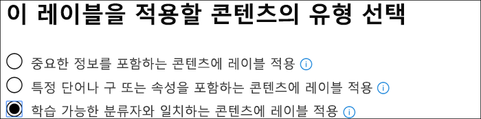
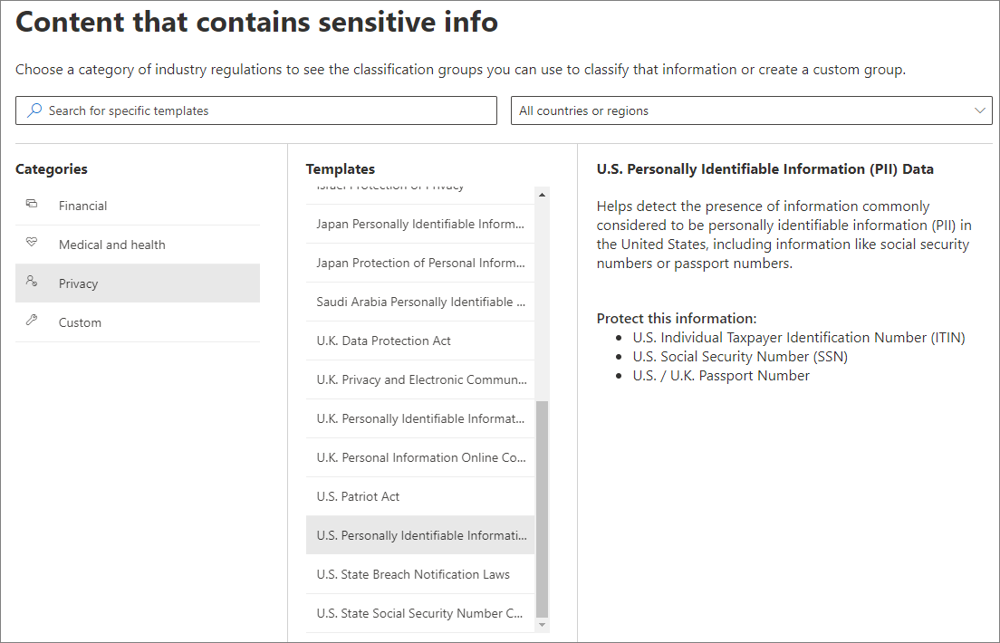
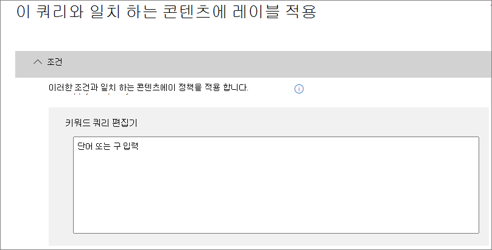

# <a name="create-publish-and-auto-apply-retention-labels"></a>보존 레이블 만들기, 게시 및 자동 적용

>*[보안 및 규정 준수를 위한 Microsoft 365 라이선싱 지침](https://aka.ms/ComplianceSD).*

다음 정보를 사용하여 [보존 레이블](labels.md)을 만드는 데 도움을 받은 후, 보존 레이블을 문서 및 전자 메일에 자동으로 적용하거나 사용자가 수동으로 적용할 수 있도록 게시합니다.

보존 레이블은 필요한 사항은 보존하고 필요하지 않은 사항은 삭제하는 데 도움이 됩니다. 또한 Microsoft 365 데이터에 대한 [레코드 관리](records-management.md) 솔루션의 일부로 항목을 레코드로 선언하는 데도 사용됩니다.

보존 레이블을 만들고 구성하는 위치는 레코드 관리를 사용 중인지 여부에 따라 달라집니다. 두 시나리오 모두에 대한 지침이 제공 됩니다.

## <a name="before-you-begin"></a>시작하기 전에

보존 레이블을 만드는 규정 준수 팀의 구성원은 보안 및 준수 센터에 대한 사용 권한이 필요합니다. 기본적으로 테넌트 관리자는 이 위치에 액세스할 수 있으며, 준수 관리자 및 기타 사용자에게 테넌트 관리를 위한 모든 권한을 부여하지는 않으면서, 보안 및 준수 센터에 대한 액세스 권한을 부여할 수 있습니다. 이렇게 하기 위해 보안 및 준수 센터의 **권한** 페이지로 이동한 후 **준수 관리자** 역할 그룹을 편집하고 해당 역할 그룹에 구성원을 추가하는 것이 좋습니다. 
  
자세한 내용은 [사용자에게 Office 365 보안 및 준수 센터에 대한 액세스 권한 부여](../security/office-365-security/grant-access-to-the-security-and-compliance-center.md)를 참조하세요.
  
이러한 정책은 보존 레이블 및 레이블 정책을 만들고 적용하는 데만 필요합니다. 정책 적용을 위해서는 콘텐츠에 액세스하지 않아도 됩니다.

## <a name="create-and-configure-retention-labels"></a>보존 레이블 만들기 및 구성

1. [Microsoft 365 규정 준수 센터](https://compliance.microsoft.com/)에서 다음의 위치 중 한 곳으로 이동합니다.
    
    - 레코드 관리를 사용하는 경우:
        - **솔루션** > **레코드 관리** > **파일 계획** 탭 > **+ 레이블 만들기** > **보존 레이블**
        
    - 레코드 관리를 사용하지 않는 경우:
       - **솔루션** > **정보 관리** > **레이블** tab > + **레이블 만들기**
    
    바로 옵션이 표시되지 않나요? 먼저 **모두 표시**를 선택합니다. 

2. 마법사의 지시를 따릅니다. 레코드 관리를 사용하는 경우:
    
    - 파일 계획 설명자에 대한 자세한 내용은 [파일 계획 관리자의 개요](file-plan-manager.md)를 참조하세요
    
    - 보존 레이블을 사용하여 콘텐츠를 레코드로 선언하려면 **레이블을 사용하여 콘텐츠를 “기록”으로 분류** 확인란을 체크합니다.

3. 이 단계를 반복하여 레이블을 더 만듭니다.

기존 레이블을 편집하려면 레이블을 선택하고 **레이블 편집**을 선택합니다. 그러면 2단계에서 레이블 설명과 설정을 변경할 수 있는 동일한 마법사가 시작됩니다.

## <a name="publish-retention-labels-by-creating-a-retention-label-policy"></a>보존 레이블 정책을 만들어 보존 레이블 게시

보존 레이블을 게시하여 사용자가 수동으로 적용할 수 있도록 합니다.

1. [Microsoft 365 규정 준수 센터](https://compliance.microsoft.com/)에서 다음의 위치 중 한 곳으로 이동합니다.
    
    - 레코드 관리를 사용하는 경우:
        - **솔루션** > **레코드 관리** > > **레이블 정책** 탭 > **레이블 게시**
    
    - 레코드 관리를 사용하지 않는 경우:
        - **솔루션** > **정보 관리** > **레이블 정책** 탭 > **레이블 게시**
    
    바로 옵션이 표시되지 않나요? 먼저 **모두 표시**를 선택합니다. 

2. 마법사의 지시를 따릅니다.
    
    위치를 구성하는 방법에 대한 자세한 내용은 이 페이지에서 [보존 레이블과 위치](#retention-labels-and-locations) 섹션을 참조하세요. 

## <a name="auto-apply-a-retention-label"></a>보존 레이블 작동 적용

사용자가 지정한 조건을 기반으로 보존 레이블을 자동으로 적용합니다.

1. [Microsoft 365 규정 준수 센터](https://compliance.microsoft.com/)에서 다음의 위치 중 한 곳으로 이동합니다.
    
    - 레코드 관리를 사용하는 경우: **정보 거버넌스**
        - **솔루션** > **레코드 관리** > **레이블 정책** 탭 > **레이블 자동 적용**
    
    - 레코드 관리를 사용하지 않는 경우:
        - **솔루션** > **정보 거버넌스** > **레이블 정책** 탭 > **레이블 자동 적용**
    
    바로 옵션이 표시되지 않나요? 먼저 **모두 표시**를 선택합니다. 

2. 마법사의 지시를 따릅니다.
    
    보존 레이블을 자동으로 적용하는 조건을 구성하는 방법에 대한 자세한 내용은이 페이지에서 [보존 레이블 자동 적용에 대한 조건 구성하기](#configuring-conditions-for-auto-apply-retention-labels) 섹션을 참조하세요.
    
    위치를 구성하는 방법에 대한 자세한 내용은 이 페이지의 다음 섹션 [보존 레이블과 위치](#retention-labels-and-locations)를 참조하세요.

## <a name="retention-labels-and-locations"></a>보존 레이블 및 위치

보존 레이블이 수행하는 작업에 따라, 다양한 유형의 보존 레이블을 여러 다른 위치에 게시할 수 있습니다.
  
|**보존 레이블...**|**레이블 정책을 적용할 수 있는 대상...**|
|:-----|:-----|
|최종 사용자에게 게시  <br/> |Exchange, SharePoint, OneDrive, Office 365 그룹  <br/> |
|중요한 정보 유형에 따라 자동으로 적용  <br/> |Exchange(모든 사서함만), SharePoint, OneDrive  <br/> |
|쿼리에 따라 자동 적용  <br/> |Exchange, SharePoint, OneDrive, Office 365 그룹  <br/> |
   
Exchange에서 자동 적용 보존 레이블(쿼리 및 중요한 정보 유형 모두에 대한)은 현재 사서함에 있는 모든 항목(미사용 데이터)이 아닌 새로 전송된 메시지(전송 중인 데이터)에만 적용됩니다. 또한 민감한 정보 유형에 대한 자동 적용 보존 레이블은 모든 사서함에만 적용되며 특정 사서함을 선택할 수 없습니다.
  
Exchange 공용 폴더와 Skype는 보존 레이블을 지원하지 않습니다.


## <a name="configuring-conditions-for-auto-apply-retention-labels"></a>보존 레이블 자동 적용에 대한 조건 구성하기

콘텐츠에 다음이 포함될 경우, 콘텐츠에 자동으로 보존 레이블을 적용할 수 있습니다.
  
- [특정 중요한 정보 유형](#auto-apply-labels-to-content-with-specific-types-of-sensitive-information)
    
- [만든 쿼리와 일치하는 특정 키워드](#auto-apply-labels-to-content-with-keywords-or-searchable-properties)

- [학습 가능한 분류자와 일치](#auto-apply-labels-to-content-by-using-trainable-classifiers)
    


구성한 조건과 일치하는 모든 콘텐츠에 자동 적용 보존 레이블을 적용하는 데 최대 7일이 걸릴 수 있습니다.

### <a name="auto-apply-labels-to-content-with-specific-types-of-sensitive-information"></a>특정 유형의 중요한 정보가 있는 콘텐츠에 레이블 자동 적용

중요한 정보에 대한 자동 적용 보존 레이블을 만들면 DLP(데이터 손실 방지) 정책을 만들 때 같은 정책 템플릿 목록이 표시됩니다. 각 정책 템플릿은 특정 중요한 정보 유형을 찾도록 미리 구성되어 있습니다. 예를 들어, 여기에 표시된 템플릿은 미국 ITIN, SSN 및 여권 번호를 검색합니다. DLP에 대한 자세한 내용은 [데이터 손실 방지 정책 개요](data-loss-prevention-policies.md)를 참조하세요.
  

  
정책 템플릿을 선택한 후 임의 유형의 중요한 정보를 추가하거나 제거하고, 인스턴스 수 및 일치 정확도를 변경할 수 있습니다. 여기에 표시된 예제에서는 다음 경우에만 보존 레이블이 자동 적용됩니다.
  
- 콘텐츠에 이러한 세 가지 중요한 정보 유형 중 어느 하나의 1~9개 인스턴스가 포함되어 있습니다. **max** 값을 삭제하여 **any**로 변경할 수 있습니다.
    
- 검색된 중요한 정보 유형은 75 이상의 일치 정확도(또는 신뢰도)를 갖습니다. 많은 중요한 정보 유형은 여러 패턴으로 정의되고, 일치 정확도가 더 높은 패턴에서는 더 많은 증거(예: 키워드, 날짜 또는 주소)가 검색되어야 합니다. 일치 정확도가 더 낮은 패턴은 증거가 덜 요구합니다. 간단히 말해서 **min** 일치 정확도가 더 낮을수록 콘텐츠가 조건과 일치하기가 더 쉽습니다. 
    
이 옵션에 대한 자세한 내용은 [더 쉽게 또는 더 어렵게 일치하도록 규칙 조정](data-loss-prevention-policies.md#tuning-rules-to-make-them-easier-or-harder-to-match)을 참조하세요.
    

  
### <a name="auto-apply-labels-to-content-with-keywords-or-searchable-properties"></a>키워드 또는 검색 가능 속성이 있는 콘텐츠에 레이블 자동 적용

특정 조건을 충족하는 콘텐츠에 레이블을 자동으로 적용할 수 있습니다. 현재 사용 가능한 조건은 특정 단어, 구 또는 검색 가능 속성 값을 포함하는 콘텐츠에만 레이블을 적용하도록 지원합니다. AND, OR 및 NOT과 같은 검색 연산자를 사용하여 쿼리를 구체화할 수 있습니다.

쿼리 구문에 대한 자세한 내용은 다음을 참조하세요.

- [KQL(키워드 쿼리 언어) 구문 참조](https://docs.microsoft.com/sharepoint/dev/general-development/keyword-query-language-kql-syntax-reference)

쿼리 기반 레이블은 검색 인덱스를 사용하여 콘텐츠를 식별합니다. 유효한 검색 가능 속성에 대한 자세한 내용은 다음을 참조하세요.

- [콘텐츠 검색에 대한 키워드 쿼리 및 검색 조건](keyword-queries-and-search-conditions.md)
- [SharePoint Server에서 크롤링 및 관리 속성의 개요](https://docs.microsoft.com/SharePoint/technical-reference/crawled-and-managed-properties-overview)

예제 쿼리:

- Exchange
    - subject:"Quarterly Financials"
    - recipients:garthf<!--nolink-->@contoso.com
- SharePoint 및 OneDrive
    - contenttype:contract
    - site:https<!--nolink-->://contoso.sharepoint.com/sites/teams/procurement AND contenttype:contract




### <a name="auto-apply-labels-to-content-by-using-trainable-classifiers"></a>학습 가능한 분류자를 사용하여 콘텐츠에 레이블 자동 적용

학습 가능한 분류자 옵션을 선택할 때 기본 분류자 중 하나 또는 사용자 지정 분류자를 선택할 수 있습니다. 기본 제공 분류자에는 **이력서**, **SourceCode**, **대상 희롱**, **비속어**, **위협**이 포함됩니다.


이 옵션을 사용하여 레이블을 자동으로 적용하려면 SharePoint Online 사이트 및 사서함에 10MB 이상의 데이터가 있어야 합니다.

학습 가능한 분류자에 대한 자세한 내용은 [학습 가능한 분류자 시작(미리 보기)](classifier-getting-started-with.md)를 참조하세요.

구성 예는 [분류자를 준비하고 기본 제공 분류자를 사용하는 방법](classifier-using-a-ready-to-use-classifier.md#how-to-verify-that-a-built-in-classifier-will-meet-your-needs)을 참조하세요.

## <a name="how-long-it-takes-for-retention-labels-to-take-effect"></a>보존 레이블이 적용되는 데 걸리는 시간

보존 레이블을 게시하거나 자동 적용할 경우 즉시 적용되지 않습니다.
  
1. 먼저 관리 센터에서 레이블 정책을 정책의 위치로 동기화해야 합니다.
    
2. 그런 다음 위치에서는 게시된 보존 레이블을 최종 사용자에게 제공하거나 레이블을 콘텐츠에 자동 적용하기 위한 시간이 필요할 수 있습니다. 여기에 걸리는 시간은 보존 레이블의 위치와 유형에 따라 다릅니다.
    
### <a name="published-retention-labels"></a>게시된 보존 레이블

SharePoint 또는 OneDrive에 보존 레이블을 게시하면 해당 보존 레이블이 최종 사용자에 게 표시되기까지 하루가 걸릴 수 있습니다. 또한 보존 레이블을 Exchange에 게시하는 경우 해당 보존 레이블이 최종 사용자에게 표시되기까지 7일이 걸릴 수 있으며, 사서함에는 10MB 이상의 데이터가 포함되어야 합니다.
  

  
### <a name="auto-apply-retention-labels"></a>보존 레이블 작동 적용

특정 조건과 일치하는 콘텐츠에 보존 레이블을 자동으로 적용하는 경우 보존 레이블이 조건과 일치하는 모든 기존 콘텐츠에 적용되는 데 7일이 걸릴 수 있습니다.
  

  
### <a name="how-to-check-on-the-status-of-retention-labels-published-to-exchange"></a>Exchange에 게시된 보존 레이블의 상태를 확인하는 방법

Exchange Online에서는 7일 간격으로 실행되는 프로세스를 통해 최종 사용자가 보존 레이블을 사용할 수 있게 됩니다. Powershell을 사용하여 이 프로세스가 마지막으로 실행된 시간 및 다시 실행될 시간을 확인할 수 있습니다.
  
1. [Exchange Online PowerShell에 연결합니다](https://go.microsoft.com/fwlink/?linkid=799773).
    
2. 다음 명령을 실행합니다.
    
   ```powershell
   $logProps = Export-MailboxDiagnosticLogs <user> -ExtendedProperties
   ```

   ```powershell
   $xmlprops = [xml]($logProps.MailboxLog)
   ```

   ```powershell
   $xmlprops.Properties.MailboxTable.Property | ? {$_.Name -like "ELC*"}
   ```

결과에서 `ELCLastSuccessTimeStamp`(UTC) 속성은 시스템에서 사서함을 마지막으로 처리한 시간을 보여 줍니다. 정책을 만든 이후로 이러한 처리가 발생하지 않은 경우 레이블은 표시되지 않습니다. 강제로 처리하려면 `Start-ManagedFolderAssistant -Identity <user>`를 실행합니다.
    
웹용 Outlook에 레이블이 나타나야 하는데 나타나지 않으면 브라우저에서 캐시를 지워야 합니다(Ctrl + F5).
    

## <a name="updating-retention-labels-and-their-policies"></a>보존 레이블과 해당 정책 업데이트하기

보존 레이블, 보존 레이블 정책 또는 자동 적용 정책을 편집하거나 보존 레이블이 이미 콘텐츠에 적용된 경우, 새로 레이블이 적용된 콘텐츠 외에 이 콘텐츠에 업데이트된 설정이 자동으로 적용됩니다.

## <a name="find-the-powershell-cmdlets-for-retention-labels"></a>보존 레이블에 대한 PowerShell cmdlet 찾기

보존 레이블 cmdlet을 사용하려면 다음을 수행합니다.
  
1. [Office 365 보안 및 준수 센터 PowerShell에 연결](https://docs.microsoft.com/powershell/exchange/office-365-scc/connect-to-scc-powershell/connect-to-scc-powershell)
    
2. 다음 Office 365 보안 및 준수 센터 cmdlet 사용:
    
    - [Get-ComplianceTag](https://docs.microsoft.com/powershell/module/exchange/policy-and-compliance-retention/get-compliancetag)
    
    - [New-ComplianceTag](https://docs.microsoft.com/powershell/module/exchange/policy-and-compliance-retention/new-compliancetag)
    
    - [Remove-ComplianceTag](https://docs.microsoft.com/powershell/module/exchange/policy-and-compliance-retention/remove-compliancetag)
    
    - [Set-ComplianceTag](https://docs.microsoft.com/powershell/module/exchange/policy-and-compliance-retention/set-compliancetag)
    
    - [Enable-ComplianceTagStorage](https://docs.microsoft.com/powershell/module/exchange/policy-and-compliance-retention/enable-compliancetagstorage)
    
    - [Get-ComplianceTagStorage](https://docs.microsoft.com/powershell/module/exchange/policy-and-compliance-retention/get-compliancetagstorage)
    
    - [Get-RetentionCompliancePolicy](https://docs.microsoft.com/powershell/module/exchange/policy-and-compliance-retention/get-retentioncompliancepolicy)
    
    - [New-RetentionCompliancePolicy](https://docs.microsoft.com/powershell/module/exchange/policy-and-compliance-retention/new-retentioncompliancepolicy)
    
    - [Remove-RetentionCompliancePolicy](https://docs.microsoft.com/powershell/module/exchange/policy-and-compliance-retention/remove-retentioncompliancepolicy)
    
    - [Set-RetentionCompliancePolicy](https://docs.microsoft.com/powershell/module/exchange/policy-and-compliance-retention/set-retentioncompliancepolicy)
    
    - [Get-RetentionComplianceRule](https://docs.microsoft.com/powershell/module/exchange/policy-and-compliance-retention/get-retentioncompliancerule)
    
    - [New-RetentionComplianceRule](https://docs.microsoft.com/powershell/module/exchange/policy-and-compliance-retention/new-retentioncompliancerule)
    
    - [Remove-RetentionComplianceRule](https://docs.microsoft.com/powershell/module/exchange/policy-and-compliance-retention/remove-retentioncompliancerule)
    
    - [Set-RetentionComplianceRule](https://docs.microsoft.com/powershell/module/exchange/policy-and-compliance-retention/set-retentioncompliancerule)
