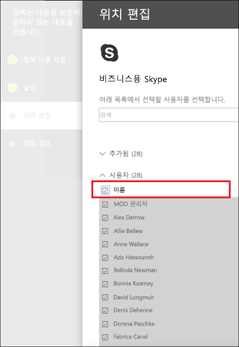

# 보존 정책 만들기 및 구성Create and configure retention policies

>*[보안 및 규정 준수를 위한 Microsoft 365 라이선싱 지침](https://aka.ms/ComplianceSD).**[Microsoft 365 licensing guidance for security & compliance](https://aka.ms/ComplianceSD).*

콘텐츠를 보존할지, 삭제할지, 아니면 보존했다가 삭제할지를 사전에 결정하기 위해 보존 정책을 사용합니다.Use a retention policy to decide proactively whether to retain content, delete content, or both - retain and then delete the content. 

보존 정책이 작동하는 방식에 대한 자세한 내용은 [보존 정책 정보](retention-policies.md)를 참조하세요.For information about how retention policies work, see [Learn about retention policies](retention-policies.md).

## 시작하기 전에Before you begin

보존 정책을 만들고 관리할 규정 준수 팀의 구성원에게는 [Microsoft 365 규정 준수 센터](https://compliance.microsoft.com/)에 대한 권한이 필요합니다.Members of your compliance team who will create and manage retention policies need permissions to the [Microsoft 365 compliance center](https://compliance.microsoft.com/). 기본적으로 테넌트 관리자(전역 관리자)는 이 위치에 액세스할 수 있으며, 규정 준수 책임자와 기타 사용자에게 테넌트 관리자의 모든 권한을 부여하지는 않으면서 액세스 권한을 부여할 수 있습니다. 이 제한적 관리를 위한 권한을 부여하기 위해서는 사용자를 **규정 준수 관리자** 관리 역할 그룹에 추가할 것을 권장합니다.By default, the tenant admin (global administrator) has access to this location and can give compliance officers and other people access without giving them all the permissions of a tenant admin. To grant permissions for this limited administration, we recommend that you add users to the **Compliance Administrator** admin role group. 지침은 [사용자에게 보안 및 준수 센터에 대한 액세스 권한 부여](https://docs.microsoft.com/microsoft-365/security/office-365-security/grant-access-to-the-security-and-compliance-center)를 참조하세요.For instructions, see [Give users access to the Security & Compliance Center](https://docs.microsoft.com/microsoft-365/security/office-365-security/grant-access-to-the-security-and-compliance-center).

이러한 권한은 보존 정책을 생성하고 적용할 때만 필요합니다.These permissions are required only to create and apply a retention policy. 보존 정책을 구성하는 사용자는 콘텐츠에 액세스할 필요가 없습니다.The person configuring the retention policy doesn't require access to the content.

## 보존 정책 만들기 및 구성Create and configure a retention policy

1. [Microsoft 365 준수 센터](https://compliance.microsoft.com/)에서 **정책** > **보존**을 선택합니다.From the [Microsoft 365 compliance center](https://compliance.microsoft.com/), select **Policies** > **Retention**.

2. **새 보존 정책**을 선택하거나 기존 보존 정책 편집을 선택합니다.Select **New retention policy** or edit an exiting retention policy.

3. **설정**에서 먼저 컨텐츠 유지 및 삭제에 대한 구성 옵션을 지정하세요.For **Settings**, first specify the configuration options for retaining and deleting content. 삭제하지 않고 콘텐츠를 유지하거나 지정된 기간 후에 콘텐츠를 유지한 다음 삭제하거나 지정된 기간 후에 콘텐츠를 삭제하는 보존 정책을 만들 수 있습니다.You can create a retention policy that just retains content without deleting, retains and then deletes after a specified period of time, or just deletes content after a specified period of time. 자세한 내용은 이 페이지에서 [콘텐츠를 보존하고 삭제하는 방법에 대한 설정](#settings-for-retaining-and-deleting-content)을 참조하세요.For more information, see [Settings for retaining and deleting content](#settings-for-retaining-and-deleting-content) on this page:
    
    그런 다음 보존 정책을 모든 콘텐츠 또는 특정 조건을 충족하는 콘텐츠에 적용할지 결정합니다.Then, decide whether the retention policy should apply to all content, or content that meets specific conditions. 이러한 고급 보존 설정에 대한 자세한 내용은 이 페이지의 [특정 조건을 충족하는 콘텐츠를 식별하는 고급 설정](#advanced-settings-to-identify-content-that-meets-specific-conditions)을 참조하세요.For more information about these advanced retention settings, see [Advanced settings to identify content that meets specific conditions](#advanced-settings-to-identify-content-that-meets-specific-conditions) on this page. 

4. **위치 선택** 페이지에서 보존 정책을 조직 전체에서 지원되는 모든 위치에 적용할 것인지 또는 위치를 지정할 것인지 선택하세요.For the **Choose locations** page, select whether the retention policy should apply to all supported locations across your organization, or you want to specify the locations. 특정 위치를 선택하면 포함 및 제외를 지정할 수도 있습니다.If you choose specific locations, you can also specify includes and excludes. 
    
    Microsoft Teams의 경우:For Microsoft Teams: 
    - Teams 채널 메시지 또는 Teams 채팅을 삭제하거나 유지하려면 특정 위치를 선택하는 옵션을 선택해야 합니다.You must select the option to choose specific locations if you want to delete or retain Teams channel messages or Team chats. 이러한 옵션 중 하나를 위치로 선택하면 이 Teams 데이터를 포함하는 보존 정책에 다른 위치를 포함할 수 없으므로 다른 위치는 자동으로 제외됩니다.When you select either of these options as locations, the other locations are automatically excluded because a retention policy that includes this Teams data can't include other locations. 
    - **Teams 채널 메시지**의 경우 표준 채널이지만 [비공개 채널](https://docs.microsoft.com/microsoftteams/private-channels)의 메시지는 포함되지 않습니다.Note that for **Teams channel messages**, message from standard channels but not [private channels](https://docs.microsoft.com/microsoftteams/private-channels) are included. 개인 채널의 메시지는 **Teams 채팅** 위치를 선택할 때 그룹 채팅으로 사용자에 게 제공됩니다.Messages from private channels are included for users as group chats when you select the **Teams chats** location.
    
    조직 또는 특정 위치에 대한 보존 정책을 선택하는 방법에 대한 자세한 내용은 이 페이지의 [전체 조직 또는 특정 위치에 보존 정책 적용](#applying-a-retention-policy-to-an-entire-organization-or-specific-locations)을 참조하세요.For more information about choosing between a retention policy for the organization or for specific locations, see [Applying a retention policy to an entire organization or specific locations](#applying-a-retention-policy-to-an-entire-organization-or-specific-locations) on this page.
    
    **Office 365 그룹** 및 **비즈니스용 Skype**에 대한 자세한 내용은 [Microsoft 365 그룹의 구성 정보](#configuration-information-for-microsoft-365-groups) 및 [비즈니스용 Skype의 구성 정보](#configuration-information-for-skype-for-business) 섹션을 참조하세요.For information specific to **Office 365 groups** and **Skype for Business**, see the following sections, [Configuration information for Microsoft 365 groups](#configuration-information-for-microsoft-365-groups) and [Configuration information for Skype for Business](#configuration-information-for-skype-for-business).

5. 마법사를 완료하여 설정을 저장합니다.Complete the wizard to save your settings.

보존 정책이 두 개 이상인 경우 [보존 원칙 또는 우선 순위](retention-policies.md#the-principles-of-retention-or-what-takes-precedence)를 참조하세요.When you have more than one retention policy, see [The principles of retention, or what takes precedence?](retention-policies.md#the-principles-of-retention-or-what-takes-precedence)

### Microsoft 365 그룹에 대한 구성 정보Configuration information for Microsoft 365 groups

Microsoft 365 그룹(과거 Office 365 그룹)에 대한 콘텐츠를 유지하거나 삭제하려면 보존 정책의 위치를 선택할 때 **Office 365 그룹** 위치를 선택하세요.To retain or delete content for a Microsoft 365 group (formerly Office 365 group), select the **Office 365 groups** location when you choose locations for your retention policy. Microsoft 365 그룹이 Exchange 사서함을 보유하고 있더라도 전체 **Exchange 전자 메일** 위치를 포함하는 보존 정책이 Microsoft 365 그룹 사서함의 콘텐츠를 포함하지는 않습니다.Even though a Microsoft 365 group has an Exchange mailbox, a retention policy that includes the entire **Exchange email** location won't include content in Microsoft 365 group mailboxes. 또한 **Exchange 전자 메일** 위치에서 처음에 포함하거나 제외할 그룹 사서함을 지정할 수 있지만 보존 정책을 저장하려고 하면 "RemoteGroupMailbox"가 Exchange 위치에 대해 올바른 선택이 아니라는 오류가 발생합니다.In addition, although the **Exchange email** location initially allows you to specify a group mailbox to be included or excluded, when you try to save the retention policy, you receive an error that "RemoteGroupMailbox" is not a valid selection for the Exchange location.

Microsoft 365 그룹에 적용되는 보존 정책에는 그룹 사서함과 사이트가 모두 포함됩니다.A retention policy applied to a Microsoft 365 group includes both the group mailbox and site. Microsoft 365 그룹에 적용된 보존 정책은 Microsoft Teams를 포함하여 Microsoft 365 그룹에서 생성한 리소스를 보호합니다.A retention policy applied to a Microsoft 365 group protects the resources created by a Microsoft 365 group, which includes Microsoft Teams.

### 비즈니스용 Skype에 대한 구성 정보Configuration information for Skype for Business

Exchange 전자 메일과 달리, Skype 위치의 상태는 간단히 설정으로 전환하여 모든 사용자를 포함할 수 없습니다. 그렇지만 해당 위치를 켜면 해당 대화를 보존하려는 사용자를 수동으로 선택할 수 있습니다.Unlike Exchange email, you can't toggle the status of the Skype location on to include all users, but when you turn on that location, you then manually choose the users whose conversations you want to retain:

  
**사용자 선택**을 선택하면 열 헤더에서 **이름** 상자를 선택하여 모든 사용자를 빠르게 포함할 수 있습니다.When you select **Choose users**, you can quickly include all users by selecting the **Name** box in the column header. 그러나 각 사용자가 정책의 특정 포함사항으로 간주된다는 점을 이해해야 합니다.However, it's important to understand that each user counts as a specific inclusion in the policy. 따라서 1,000명이 넘는 사용자를 포함하게 되면 이전 섹션에서 설명한 제한 사항이 적용됩니다.Therefore, if you include over 1,000 users, the limits noted in the previous section apply. 여기에서 모든 Skype 사용자를 선택하는 것은 조직 전체 정책에 기본적으로 모든 Skype 사용자를 포함하는 것과 다르게 작동합니다.Selecting all Skype users here is not the same as if an org-wide policy were able to include all Skype users by default. 
  

  
Note that **Conversation History**, a folder in Outlook, is a feature that has nothing to do with Skype archiving.Note that **Conversation History**, a folder in Outlook, is a feature that has nothing to do with Skype archiving. **Conversation History** can be turned off by the end user, but archiving for Skype is done by storing a copy of Skype conversations in a hidden folder that is inaccessible to the user but available to eDiscovery.**Conversation History** can be turned off by the end user, but archiving for Skype is done by storing a copy of Skype conversations in a hidden folder that is inaccessible to the user but available to eDiscovery.

## 콘텐츠를 보존 및 삭제하기 위한 설정Settings for retaining and deleting content

보존 정책에서 콘텐츠를 보존하고 삭제하기 위한 설정을 선택하면 보존 정책에 지정된 기간 동안 다음 구성 중 하나를 사용할 수 있습니다.By choosing the settings for retaining and deleting content in your retention policy, your retention policy will have one of the following configurations for a specified period of time:

- 보존 전용Retain-only
- 보존 후 삭제Retain and then delete
- 삭제 전용Delete-only

### 특정 기간 동안 콘텐츠 보존Retaining content for a specific period of time

보존 정책을 구성하면 콘텐츠를 영구적으로 또는 며칠, 몇 달, 몇 년 동안만 보존을 선택할 수 있습니다.When you configure a retention policy, you choose to retain content indefinitely or for a specific number of days, months, or years. 콘텐츠 보존 기간은 보존 정책이 적용된 시점이 아닌 콘텐츠 생성 시점을 기준으로 계산됩니다.The duration for how long content is retained is calculated from the age of the content, not from when the retention policy is applied. 콘텐츠의 생성 시점 또는 (OneDrive 및 SharePoint의 경우) 수정 시점 중 어느 것을 기준으로 할지 선택할 수 있습니다.You can choose whether the age is based on when the content was created or (for OneDrive and SharePoint) when it was last modified.

예제:Examples:
  
- SharePoint: 콘텐츠가 마지막으로 수정된 후 7년 동안 사이트 모음에 콘텐츠를 유지하고 해당 사이트 모음에 있는 문서가 6년 내에 수정되지 않은 경우 문서가 수정되지 않으면 다른 해에만 보존됩니다.SharePoint: If you want to retain content in a site collection for seven years since it was last modified, and a document in that site collection hasn't been modified in six years, the document will be retained for only another year if it's not modified. 문서를 다시 편집하면 문서 사용 기간은 마지막으로 수정한 날부터 계산되고 앞으로 7년 동안 더 보존됩니다.If the document is edited again, the age of the document is calculated from the new last modified date, and it will be retained for another seven years.
  
- Exchange: 사서함의 콘텐츠를 7년 동안 보존하려고 하고 메시지가 6년 전에 발송되었다면, 사서함은 1년 동안만 더 보존됩니다.Exchange: If you want to retain content in a mailbox for seven years, and a message was sent six years ago, the message will be retained for only one year. Exchange 콘텐츠의 경우 해당 기간은 받는 전자 메일의 받은 날짜 또는 보내는 전자 메일에 대해 보낸 날짜를 기준으로 합니다.For Exchange content, the age is based on the date received for incoming email, or the date sent for outgoing email. 콘텐츠를 수정된 시점을 기준으로 보존하는 것은 OneDrive 및 SharePoint의 사이트 콘텐츠에만 해당됩니다.Retaining content based on when it was last modified applies only to site content in OneDrive and SharePoint.
  
보존 기간이 끝나면 콘텐츠를 영구적으로 삭제할지 여부를 선택합니다.At the end of the retention period, you choose whether you want the content to be permanently deleted:
  

  
### 특정 사용 기간보다 오래된 콘텐츠 삭제Deleting content that's older than a specific age

보존 정책은 콘텐츠를 보존했다가 삭제하거나, 보존하지 않고 오래된 콘텐츠를 단순히 삭제할 수 있습니다.A retention policy can both retain and then delete content, or delete old content without retaining it.
  
보존 정책이 콘텐츠를 삭제할 경우 보존 정책에 대해 지정된 기간은 정책이 할당된 시점이 아니라 콘텐츠가 만들어졌거나 수정된 이후부터 계산된다는 사실에 유의해야 합니다.If your retention policy deletes content, it's important to understand that the time period specified for a retention policy is calculated from the time when the content was created or modified, not the time since the policy was assigned.
  

  
예를 들어, 3년이 지난 콘텐츠를 삭제하는 보존 정책을 만든 다음 해당 정책을 모든 OneDrive 계정에 적용한다고 가정하겠습니다. 이때 OneDrive 계정에는 4~5년 전에 생성된 콘텐츠가 매우 많습니다.For example, suppose that you create a retention policy that deletes content after three years, and then assign that policy to all OneDrive accounts, which contain a lot of content that was created four or five years ago. 이 경우 보존 정책을 최초로 적용한 뒤 얼마 지나지 않아 다량의 콘텐츠가 삭제되게 됩니다.In this case, a lot of content will be deleted soon after assigning the retention policy for the first time. 이러한 이유로 인해 콘텐츠를 삭제하는 보존 정책은 콘텐츠에 상당한 영향을 주게 됩된다는 것을 이해하는 것이 중요합니다..For this reason, it's important to understand that a retention policy that deletes content can have a considerable impact on your content. 
  
Therefore, before you assign a retention policy to a site collection for the first time, you should first consider the age of the existing content and how the policy may impact that content.Therefore, before you assign a retention policy to a site collection for the first time, you should first consider the age of the existing content and how the policy may impact that content. You may also want to communicate the new policy to your users before assigning it, to give them time to assess the possible impact.You may also want to communicate the new policy to your users before assigning it, to give them time to assess the possible impact. Note this warning that appears when you review the settings for your retention policy just before creating it.Note this warning that appears when you review the settings for your retention policy just before creating it.
  

  
## 특정 조건을 충족하는 콘텐츠를 식별하는 고급 설정Advanced settings to identify content that meets specific conditions

보존 정책을 포함하는 위치의 모든 콘텐츠에 적용할 수도 있고, 특정 키워드 또는 [특정 유형의 중요 정보](what-the-sensitive-information-types-look-for.md)를 포함하는 콘텐츠에만 보존 정책을 적용하도록 선택할 수 있습니다.A retention policy can apply to all content in the locations that it includes, or you can choose to apply a retention policy only to content that contains specific keywords or [specific types of sensitive information](what-the-sensitive-information-types-look-for.md).
  

  
### 특정 키워드를 포함하는 콘텐츠 식별Identify content that contains specific keywords

특정 조건을 충족하는 콘텐츠에만 보존 정책을 적용하고 해당 콘텐츠에 대해서만 보존 작업을 수행할 수 있습니다.You can apply a retention policy only to content that meets specific conditions, and then take retention actions on just that content. 사용 가능한 조건은 특정 단어 나 문구가 포함된 콘텐츠에 보존 정책을 적용하는 것을 지원합니다.The conditions available support applying a retention policy to content that contains specific words or phrases. 검색 연산자(예: AND, OR 및 NOT)를 사용하여 쿼리를 구체화할 수 있습니다.You can refine your query by using search operators like AND, OR, and NOT. 연산자에 대한 자세한 내용은 [콘텐츠 검색에 대한 키워드 쿼리 및 검색 조건](keyword-queries-and-search-conditions.md)을 참조하세요.For more information on these operators, see [Keyword queries and search conditions for Content Search](keyword-queries-and-search-conditions.md).
  
검색 가능한 속성(예: **제목:**)을 추가하는 기능이 곧 지원될 예정입니다.Support for adding searchable properties (for example, **subject:**) is coming soon.
  
쿼리 기반 보존은 검색 인덱스를 사용하여 콘텐츠를 식별합니다.Query-based retention uses the search index to identify content.
  

  
### 중요한 정보가 포함된 콘텐츠 식별Identify content that contains sensitive information

You can also apply a retention policy only to content that contains [specific types of sensitive information](what-the-sensitive-information-types-look-for.md).You can also apply a retention policy only to content that contains [specific types of sensitive information](what-the-sensitive-information-types-look-for.md). For example, you can choose to apply unique retention requirements only to content that contains personally identifiable information (PII) such as taxpayer identification numbers, social security numbers, or passport numbers.For example, you can choose to apply unique retention requirements only to content that contains personally identifiable information (PII) such as taxpayer identification numbers, social security numbers, or passport numbers.
  

  
참고:Notes:
  
- 중요한 정보에 대한 고급 보존이 Exchange 공용 폴더 및 비즈니스용 Skype에는 적용되지 않습니다. 이러한 위치는 중요한 정보 유형을 지원하지 않기 때문입니다.Advanced retention for sensitive information doesn't apply to Exchange public folders or Skype for Business because those locations don't support sensitive information types.
    
- Exchange Online은 메일 흐름 규칙(전송 규칙이라고도 함)을 사용하여 중요한 정보를 식별하므로 이미 사서함에 저장된 모든 항목이 아니라 전송 중인 메시지에서만 작동합니다.Exchange Online uses mail flow rules (also known as transport rules) to identify sensitive information, so this works only on messages in transit—not on all items already stored in a mailbox. 즉, Exchange Online의 경우 사서함에 정책이 적용된 **뒤에** 수신된 메시지에 대해서만 보존 정책이 중요한 정보를 식별하고 보존 작업을 수행할 수 있습니다.For Exchange Online, this means that a retention policy can identify sensitive information and take retention actions only on messages that are received **after** the policy is applied to the mailbox. 이전 섹션에서 설명하는 쿼리 기반 보존의 경우 콘텐츠 식별을 위해 검색 인덱스를 사용하므로 이러한 제한 사항이 적용되지 않습니다.Query-based retention described in the previous section doesn't have this limitation because it uses the search index to identify content. 
    
## 전체 조직 또는 특정 위치에 보존 정책 적용Applying a retention policy to an entire organization or specific locations

전체 조직, 전체 위치 또는 특정 위치나 사용자에 보존 정책을 쉽게 적용할 수 있습니다.You can easily apply a retention policy to an entire organization, entire locations, or only to specific locations or users.
  
### 조직 전체 정책Org-wide policy

보존 정책의 가장 강력한 기능 중 하나는 다음을 비롯한 Microsoft 365의 위치에 적용할 수 있다는 것입니다.One of the most powerful features of a retention policy is that it can apply to locations across Microsoft 365, including:
  
- Exchange 전자 메일Exchange email
    
- SharePoint 사이트 모음SharePoint site collections
    
- OneDrive 계정OneDrive accounts
    
- Microsoft 365 그룹(그룹의 사서함 및 관련 SharePoint 사이트의 콘텐츠에 적용됩니다.)Microsoft 365 groups (applies to content in the group's mailbox and associated SharePoint site.)
    
- Exchange 공용 폴더Exchange public folders
    

조직 전체 보존 정책의 기타 중요한 기능은 다음과 같습니다.Other important features of an org-wide retention policy include:
  
- 정책이 포함할 수 있는 사서함 또는 사이트 개수에 제한이 없습니다.There is no limit to the number of mailboxes or sites the policy can include.
    
- Exchange의 경우 정책이 적용된 후에 만들어진 모든 새 사서함은 해당 정책을 자동으로 상속합니다.For Exchange, any new mailbox created after the policy is applied will automatically inherit the policy.
  
### 전체 위치에 적용되는 정책A policy that applies to entire locations

위치를 선택할 때 Exchange 전자 메일이나 OneDrive 계정 등 전체 위치를 간편하게 포함하거나 배제할 수 있습니다.When you choose locations, you can easily include or exclude an entire location, such as Exchange email or OneDrive accounts. 해당 위치의 **상태를** 켜거나 끄면 됩니다.To do so, toggle the **Status** of that location on or off. 
  
조직 전체 정책과 마찬가지로 전체 위치의 임의의 조합에 정책이 적용되는 경우 정책에 포함할 수 있는 사서함 또는 사이트 개수에 제한이 없습니다.Like an org-wide policy, if a policy applies to any combination of entire locations, there is no limit to the number of mailboxes or sites the policy can include. 

예를 들어, 정책에 Exchange 전자 메일과 SharePoint 사이트가 모두 포함된다면, 개수와 상관없이 모든 사이트와 사서함이 포함됩니다.For example, if a policy includes all Exchange email and all SharePoint sites, all sites and mailboxes will be included, no matter how many. 또한 Exchange의 경우 정책이 적용된 후 만들어진 모든 새 사서함은 자동으로 정책을 상속합니다.And for Exchange, any new mailbox created after the policy is applied will automatically inherit the policy.

### 특정 포함 또는 제외가 적용된 정책A policy with specific inclusions or exclusions

특정 사용자, 특정 Microsoft 365 그룹 또는 특정 사이트에 보존 정책을 적용할 수도 있습니다.You can also apply a retention policy to specific users, specific Microsoft 365 groups, or specific sites. 해당 위치의 **상태**를 켜거나 끈 다음 링크를 사용하여 특정 사용자, Microsoft 365 그룹 또는 사이트를 포함하거나 배제하면 됩니다.To do so, toggle the **Status** of that location on, and then use the links to include or exclude specific users, Microsoft 365 groups, or sites. 
  
그러나 이 구성을 사용하는 경우 보존 정책에는 다음과 같은 1000개의 특정 위치를 포함하거나 제외하는 몇 가지 제한이 있습니다.However, using this configuration, there are some limits when your retention policy includes or excludes over 1,000 specific locations:
  
- 보존 정책의 최대 수:Maximum numbers for the retention policy:
    - 1,000개의 사서함1,000 mailboxes
    - 1,000개의 Microsoft 365 그룹1,000 Microsoft 365 groups
    - Teams 비공개 채팅에 참여하는 1,000명의 사용자1,000 users for Teams private chats
    - 100개의 사이트(OneDrive 또는 SharePoint)100 sites (OneDrive or SharePoint)

테넌트에 대해 지원되는 최대 정책 수는 10,000입니다.There is a maximum number of policies that are supported for a tenant: 10,000. 이러한 항목에는 보존 정책, 보존 레이블 정책, 자동 적용 보존 정책이 포함됩니다.These items include retention policies, retention label policies, and auto-apply retention policies.

보존 정책에 이러한 제한이 적용되는 경우 전체 위치에 적용되는 구성 옵션을 선택하거나 조직 전체 정책을 사용하세요.If your retention policies are likely to be subject to these limitations, choose the configuration options that apply to entire locations, or use an org-wide policy.

## 보존 정책 업데이트Updating retention policies

보존 정책을 편집하고 콘텐츠가 보존 정책의 원래 설정에 이미 적용되어 있는 경우 업데이트된 설정은 새로 식별된 콘텐츠 외에 이 콘텐츠에도 자동으로 적용됩니다.If you edit a retention policy and content is already subject to the original settings in your retention policy, your updated settings will be automatically applied to this content in addition to content that's newly identified.

일반적으로 이 업데이트는 아주 간단하지만 며칠이 걸릴 수 있습니다.Usually this update is fairly quick but can take several days. Microsoft 365 위치에서 정책 복제가 완료되면 Microsoft 365 준수 센터의 보존 정책 상태가 **켜기(보류)** 에서 **켜기(성공)** 으로 변경됩니다.When the policy replication across your Microsoft 365 locations is complete, you'll see the status of the retention policy in the Microsoft 365 compliance center change from **On (Pending)** to **On (Success)**.

## 보존 정책에 대한 PowerShell cmdlet 찾기Find the PowerShell cmdlets for retention policies

보존 정책 cmdlet을 사용하려면 다음을 수행합니다.To use the retention policies cmdlets:
  
1. [Office 365 보안 및 준수 센터 PowerShell에 연결Connect to the Office 365 Security & Compliance Center Powershell](https://docs.microsoft.com/powershell/exchange/office-365-scc/connect-to-scc-powershell/connect-to-scc-powershell)
    
2. 다음 Office 365 보안 및 준수 센터 cmdlet 사용:Use these Office 365 Security & Compliance Center cmdlets:
    
    - [Get-RetentionCompliancePolicyGet-RetentionCompliancePolicy](https://docs.microsoft.com/powershell/module/exchange/get-retentioncompliancepolicy)
    
    - [New-RetentionCompliancePolicyNew-RetentionCompliancePolicy](https://docs.microsoft.com/powershell/module/exchange/new-retentioncompliancepolicy)
    
    - [Remove-RetentionCompliancePolicyRemove-RetentionCompliancePolicy](https://docs.microsoft.com/powershell/module/exchange/remove-retentioncompliancepolicy)
    
    - [Set-RetentionCompliancePolicySet-RetentionCompliancePolicy](https://docs.microsoft.com/powershell/module/exchange/set-retentioncompliancepolicy)
    
    - [Get-RetentionComplianceRuleGet-RetentionComplianceRule](https://docs.microsoft.com/powershell/module/exchange/get-retentioncompliancerule)
    
    - [New-RetentionComplianceRuleNew-RetentionComplianceRule](https://docs.microsoft.com/powershell/module/exchange/new-retentioncompliancerule)
    
    - [Remove-RetentionComplianceRuleRemove-RetentionComplianceRule](https://docs.microsoft.com/powershell/module/exchange/remove-retentioncompliancerule)
    
    - [Set-RetentionComplianceRuleSet-RetentionComplianceRule](https://docs.microsoft.com/powershell/module/exchange/set-retentioncompliancerule)

## PowerShell을 사용하여 보존 정책 잠금Lock a retention policy by using PowerShell

규정 요구 사항을 준수하기 위해 [보존 잠금](retention-policies.md#use-preservation-lock-to-comply-with-regulatory-requirements)을 사용해야 하는 경우 PowerShell을 사용해야 합니다.You must use PowerShell if you need to use [Preservation Lock](retention-policies.md#use-preservation-lock-to-comply-with-regulatory-requirements) to comply with regulatory requirements.

1. [Office 365 보안 및 준수 센터 PowerShell에 연결](https://docs.microsoft.com/powershell/exchange/office-365-scc/connect-to-scc-powershell/connect-to-scc-powershell?view=exchange-ps)[Connect to Office 365 Security & Compliance Center PowerShell](https://docs.microsoft.com/powershell/exchange/office-365-scc/connect-to-scc-powershell/connect-to-scc-powershell?view=exchange-ps).

2. 보존 정책을 나열하고 `Get-RetentionCompliancePolicy`을(를) 실행하여 잠그려는 정책의 이름을 찾으세요.List your retention policies and find the name of the policy that you want to lock by running `Get-RetentionCompliancePolicy`.
    
    
    
3. 보존 정책에 유지 잠금을 적용하려면 `RestrictiveRetention` 매개 변수가 true로 설정된 `Set-RetentionCompliancePolicy`를 실행합니다.To place a Preservation Lock on a retention policy, run `Set-RetentionCompliancePolicy` with the `RestrictiveRetention` parameter set to true. 예시:For example:
    
        Set-RetentionCompliancePolicy -Identity "<Name of Policy>" – RestrictiveRetention $true
    
    
    
    이 cmdlet을 실행한 후 **모두 예**를 선택합니다.After you run that cmdlet, choose **Yes to All**:
    
    

이제 보존 정책에 보존 잠금이 적용됩니다.A Preservation Lock is now placed on the retention policy. `Get-RetentionCompliancePolicy`을 실행할 경우, `RestrictiveRetention` 매개 변수가 True로 설정됩니다.If you run `Get-RetentionCompliancePolicy`, the `RestrictiveRetention` parameter is set to true. 예시는 다음과 같습니다:For example:

`Get-RetentionCompliancePolicy -Identity "<Name of Policy>" |Fl`

  

