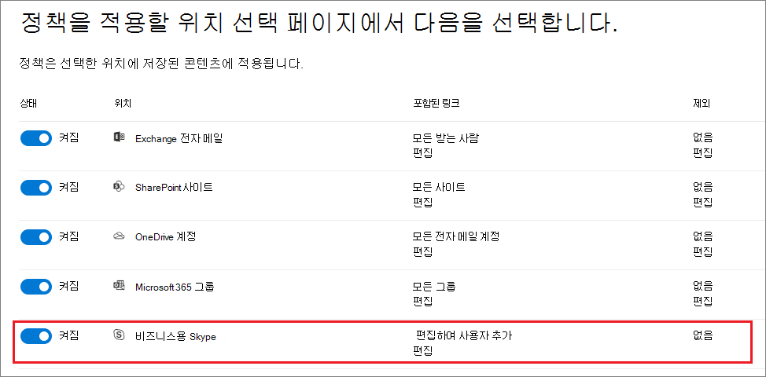

# <a name="create-and-configure-retention-policies"></a><span data-ttu-id="8fc7b-103">보존 정책 만들기 및 구성</span><span class="sxs-lookup"><span data-stu-id="8fc7b-103">Create and configure retention policies</span></span>

><span data-ttu-id="8fc7b-104">*[보안 및 규정 준수를 위한 Microsoft 365 라이선싱 지침](https://aka.ms/ComplianceSD).*</span><span class="sxs-lookup"><span data-stu-id="8fc7b-104">*[Microsoft 365 licensing guidance for security & compliance](https://aka.ms/ComplianceSD).*</span></span>

<span data-ttu-id="8fc7b-105">콘텐츠를 보존할지, 삭제할지, 아니면 보존했다가 삭제할지를 사전에 결정하기 위해 보존 정책을 사용합니다.</span><span class="sxs-lookup"><span data-stu-id="8fc7b-105">Use a retention policy to decide proactively whether to retain content, delete content, or both - retain and then delete the content.</span></span> 

<span data-ttu-id="8fc7b-106">보존 정책을 사용하면 사이트 또는 사서함 수준에서 위치별로 콘텐츠의 보존 설정을 동일하게 할당하여 효율적으로 이 작업을 수행할 수 있습니다.</span><span class="sxs-lookup"><span data-stu-id="8fc7b-106">A retention policy lets you do this very efficiently by assigning the same retention settings for content by location, at a site or mailbox level.</span></span> <span data-ttu-id="8fc7b-107">보존 정책 또는 보존 레이블을 사용해야 할지 확실하지 않다면 [보존 정책 및 보존 레이블](retention.md#retention-policies-and-retention-labels)을 참조하세요.</span><span class="sxs-lookup"><span data-stu-id="8fc7b-107">If you're not sure whether to use a retention policy or a retention label, see [Retention policies and retention labels](retention.md#retention-policies-and-retention-labels).</span></span>

<span data-ttu-id="8fc7b-108">보존 정책과 보존이 작동하는 방식에 대한 자세한 내용은 [보존에 대해 알아보기](retention.md)를 참조하세요.</span><span class="sxs-lookup"><span data-stu-id="8fc7b-108">For more information about retention policies and how retention works, see [Learn about retention](retention.md).</span></span>

## <a name="before-you-begin"></a><span data-ttu-id="8fc7b-109">시작하기 전에</span><span class="sxs-lookup"><span data-stu-id="8fc7b-109">Before you begin</span></span>

<span data-ttu-id="8fc7b-110">조직의 전역 관리자는 보존 정책을 만들고 편집할 수 있는 모든 권한을 가지고 있습니다.</span><span class="sxs-lookup"><span data-stu-id="8fc7b-110">The global admin for your organization has full permissions to create and edit retention policies.</span></span> <span data-ttu-id="8fc7b-111">전역 관리자로 로그인하지 않은 경우 [보존 정책 및 보존 레이블을 만들고 관리하는 데 필요한 권한](get-started-with-retention.md#permissions-required-to-create-and-manage-retention-policies-and-retention-labels)을 참조하세요.</span><span class="sxs-lookup"><span data-stu-id="8fc7b-111">If you aren't signing in as a global admin, see [Permissions required to create and manage retention policies and retention labels](get-started-with-retention.md#permissions-required-to-create-and-manage-retention-policies-and-retention-labels).</span></span>

## <a name="create-and-configure-a-retention-policy"></a><span data-ttu-id="8fc7b-112">보존 정책 만들기 및 구성하기</span><span class="sxs-lookup"><span data-stu-id="8fc7b-112">Create and configure a retention policy</span></span>

<span data-ttu-id="8fc7b-113">보존 정책은 여러 위치를 지원할 수 있지만 지원되는 모든 위치를 포함하는 단일 보존 정책을 만들 수는 없습니다.</span><span class="sxs-lookup"><span data-stu-id="8fc7b-113">Although a retention policy can support multiple locations, you can't create a single retention policy that includes all the supported locations:</span></span>
- <span data-ttu-id="8fc7b-114">Exchange 전자 메일</span><span class="sxs-lookup"><span data-stu-id="8fc7b-114">Exchange email</span></span>
- <span data-ttu-id="8fc7b-115">SharePoint 사이트</span><span class="sxs-lookup"><span data-stu-id="8fc7b-115">SharePoint site</span></span>
- <span data-ttu-id="8fc7b-116">OneDrive 계정</span><span class="sxs-lookup"><span data-stu-id="8fc7b-116">OneDrive accounts</span></span>
- <span data-ttu-id="8fc7b-117">Microsoft 365 그룹</span><span class="sxs-lookup"><span data-stu-id="8fc7b-117">Microsoft 365 groups</span></span>
- <span data-ttu-id="8fc7b-118">비즈니스용 Skype</span><span class="sxs-lookup"><span data-stu-id="8fc7b-118">Skype for Business</span></span>
- <span data-ttu-id="8fc7b-119">Exchange 공용 폴더</span><span class="sxs-lookup"><span data-stu-id="8fc7b-119">Exchange public folders</span></span>
- <span data-ttu-id="8fc7b-120">Teams 채널 메시지</span><span class="sxs-lookup"><span data-stu-id="8fc7b-120">Teams channel messages</span></span>
- <span data-ttu-id="8fc7b-121">Teams 채팅</span><span class="sxs-lookup"><span data-stu-id="8fc7b-121">Teams chats</span></span>

<span data-ttu-id="8fc7b-122">보존 정책을 만들 때 Teams 위치 중 하나를 선택하면 다른 위치는 자동으로 제외됩니다.</span><span class="sxs-lookup"><span data-stu-id="8fc7b-122">When you select either of the Teams locations when you create a retention policy, the other locations are automatically excluded.</span></span> <span data-ttu-id="8fc7b-123">따라서, 따라야 하는 지침은 Teams 위치를 포함해야 하는지에 따라 다릅니다.</span><span class="sxs-lookup"><span data-stu-id="8fc7b-123">Therefore, the instructions to follow depend on whether you need to include the Teams locations:</span></span>

- [<span data-ttu-id="8fc7b-124">Teams 위치 보존 정책에 대한 지침</span><span class="sxs-lookup"><span data-stu-id="8fc7b-124">Instructions for a retention policy for Teams locations</span></span>](#retention-policy-for-teams-locations)
- [<span data-ttu-id="8fc7b-125">Teams 이외의 위치 보존 정책에 대한 지침</span><span class="sxs-lookup"><span data-stu-id="8fc7b-125">Instructions for a retention policy for locations other than Teams</span></span>](#retention-policy-for-locations-other-than-teams)

<span data-ttu-id="8fc7b-126">보존 정책이 두 개 이상이고 보존 레이블도 사용하는 경우에는 여러 보존 설정이 동일한 콘텐츠에 적용되는 경우의 결과를 이해하기 위해 [보존 원칙 또는 우선하는 항목](retention.md#the-principles-of-retention-or-what-takes-precedence)을 참조하세요.</span><span class="sxs-lookup"><span data-stu-id="8fc7b-126">When you have more than one retention policy, and when you also use retention labels, see [The principles of retention, or what takes precedence?](retention.md#the-principles-of-retention-or-what-takes-precedence) to understand the outcome when multiple retention settings apply to the same content.</span></span>

### <a name="retention-policy-for-teams-locations"></a><span data-ttu-id="8fc7b-127">Teams 위치 보존 정책</span><span class="sxs-lookup"><span data-stu-id="8fc7b-127">Retention policy for Teams locations</span></span>

1. <span data-ttu-id="8fc7b-128">[Microsoft 365 규정 준수 센터](https://compliance.microsoft.com/)에서 **정책** > **보존**을 선택합니다.</span><span class="sxs-lookup"><span data-stu-id="8fc7b-128">From the [Microsoft 365 compliance center](https://compliance.microsoft.com/), select **Policies** > **Retention**.</span></span>

2. <span data-ttu-id="8fc7b-129">**새 보존 정책**을 선택하여 새 보존 정책을 만듭니다.</span><span class="sxs-lookup"><span data-stu-id="8fc7b-129">Select **New retention policy** to create a new retention policy.</span></span>

3. <span data-ttu-id="8fc7b-130">**콘텐츠를 유지, 삭제 또는 둘 다 수행할지 결정** 마법사 페이지에서 컨텐츠 유지 및 삭제에 대한 구성 옵션을 지정하세요.</span><span class="sxs-lookup"><span data-stu-id="8fc7b-130">For **Decide if you want to retain content, delete it, or both** page of the wizard, specify the configuration options for retaining and deleting content.</span></span> 
    
    <span data-ttu-id="8fc7b-131">삭제하지 않고 콘텐츠를 유지하거나 지정된 기간 후에 콘텐츠를 유지한 다음 삭제하거나 지정된 기간 후에 콘텐츠를 삭제하는 보존 정책을 만들 수 있습니다.</span><span class="sxs-lookup"><span data-stu-id="8fc7b-131">You can create a retention policy that just retains content without deleting, retains and then deletes after a specified period of time, or just deletes content after a specified period of time.</span></span> <span data-ttu-id="8fc7b-132">자세한 내용은 이 페이지에서 [콘텐츠를 보존하고 삭제하기 위한 설정](#settings-for-retaining-and-deleting-content)을 참조하세요.</span><span class="sxs-lookup"><span data-stu-id="8fc7b-132">For more information, see [Settings for retaining and deleting content](#settings-for-retaining-and-deleting-content) on this page.</span></span>
    
    <span data-ttu-id="8fc7b-133">이 옵션은 Teams 위치에서 지원되지 않으므로 **고급 보존 설정 사용**을 선택하지 마세요.</span><span class="sxs-lookup"><span data-stu-id="8fc7b-133">Do not select **Use advanced retention settings** because this option isn't supported for Teams locations.</span></span> 

4. <span data-ttu-id="8fc7b-134">**위치 선택** 페이지에서 **특정 위치 선택 허용**을 선택합니다.</span><span class="sxs-lookup"><span data-stu-id="8fc7b-134">For the **Choose locations** page, select **Let me choose specific locations**.</span></span> <span data-ttu-id="8fc7b-135">그런 다음 Teams 위치(**Teams 채널 메시지** 및 **Teams 채팅**) 중 하나 또는 둘 다를 설정합니다.</span><span class="sxs-lookup"><span data-stu-id="8fc7b-135">Then toggle on one or both of the locations for Teams: **Teams channel message** and **Teams chats**.</span></span>
     
    <span data-ttu-id="8fc7b-136">**Teams 채널 메시지**의 경우, 표준 채널이지만 [비공개 채널](https://docs.microsoft.com/microsoftteams/private-channels)의 메시지는 포함되지 않습니다.</span><span class="sxs-lookup"><span data-stu-id="8fc7b-136">For **Teams channel messages**, message from standard channels but not [private channels](https://docs.microsoft.com/microsoftteams/private-channels) are included.</span></span> <span data-ttu-id="8fc7b-137">현재 개인 채널은 보존 정책에서 지원되지 않습니다.</span><span class="sxs-lookup"><span data-stu-id="8fc7b-137">Currently, private channels aren't supported by retention policies.</span></span>
    
    <span data-ttu-id="8fc7b-138">기본적으로 모든 팀이 선택되어 있지만, 포함할 팀 또는 제외할 팀을 지정하여 이를 세분화할 수 있습니다.</span><span class="sxs-lookup"><span data-stu-id="8fc7b-138">By default, all teams are selected, but you can refine this by specifying teams to be included, or teams to be excluded.</span></span>

5. <span data-ttu-id="8fc7b-139">마법사를 완료하여 설정을 저장합니다.</span><span class="sxs-lookup"><span data-stu-id="8fc7b-139">Complete the wizard to save your settings.</span></span>

<span data-ttu-id="8fc7b-140">Teams 보존 정책에 대한 자세한 내용은 Teams 설명서에서 [Microsoft Teams의 보존 정책](https://docs.microsoft.com/microsoftteams/retention-policies)을 참조하세요.</span><span class="sxs-lookup"><span data-stu-id="8fc7b-140">For more information about retention policies for Teams, see [Retention policies in Microsoft Teams](https://docs.microsoft.com/microsoftteams/retention-policies) from the Teams documentation.</span></span>

#### <a name="additional-retention-policy-needed-to-support-teams"></a><span data-ttu-id="8fc7b-141">Teams 지원에 필요한 추가 보존 정책</span><span class="sxs-lookup"><span data-stu-id="8fc7b-141">Additional retention policy needed to support Teams</span></span>

<span data-ttu-id="8fc7b-142">Teams는 채팅 및 채널 메시지 그 이상입니다.</span><span class="sxs-lookup"><span data-stu-id="8fc7b-142">Teams is more than just chats and channel messages.</span></span> <span data-ttu-id="8fc7b-143">Microsoft 365 그룹에서 만든 팀(이전에는 Office 365 그룹)을 가진 경우 **Office 365 그룹** 위치를 사용하여 Microsoft 365 그룹을 포함하는 보존 정책을 추가적으로 구성해야 합니다.</span><span class="sxs-lookup"><span data-stu-id="8fc7b-143">If you have teams that were created from a Microsoft 365 group (formerly Office 365 group), you should additionally configure a retention policy that includes that Microsoft 365 group by using the **Office 365 groups** location.</span></span> <span data-ttu-id="8fc7b-144">이 보존 정책은 그룹의 사서함, 사이트 및 파일의 콘텐츠에 적용됩니다.</span><span class="sxs-lookup"><span data-stu-id="8fc7b-144">This retention policy applies to content in the group's mailbox, site, and files.</span></span>

<span data-ttu-id="8fc7b-145">Microsoft 365 그룹에 연결되어 있지 않은 팀 사이트가 있는 경우, Teams에서 파일을 보존하고 삭제하려면 **SharePoint 사이트** 또는 **OneDrive 계정** 위치를 포함하는 보존 정책이 필요합니다.</span><span class="sxs-lookup"><span data-stu-id="8fc7b-145">If you have team sites that aren't connected to a Microsoft 365 group, you need a retention policy that includes the **SharePoint sites** or **OneDrive accounts** locations to retain and delete files in Teams:</span></span>

- <span data-ttu-id="8fc7b-146">채팅에서 공유되는 파일은 해당 파일을 공유하는 사용자의 OneDrive 계정에 저장됩니다.</span><span class="sxs-lookup"><span data-stu-id="8fc7b-146">Files that are shared in chat are stored in the OneDrive account of the user who shared the file.</span></span> 

- <span data-ttu-id="8fc7b-147">채널에 업로드된 파일은 해당 팀의 SharePoint 사이트에 저장됩니다.</span><span class="sxs-lookup"><span data-stu-id="8fc7b-147">Files that are uploaded to channels are stored in the SharePoint site for the team.</span></span>

> [!TIP]
> <span data-ttu-id="8fc7b-148">특정 팀의 SharePoint 사이트 및 특정 팀 사용자의 OneDrive 계정을 선택하여 Microsoft 365 그룹에 연결되어 있지 않으면 해당 팀의 파일에 보존 정책을 적용할 수 있습니다.</span><span class="sxs-lookup"><span data-stu-id="8fc7b-148">You can apply a retention policy to the files of just a specific team when it's not connected to a Microsoft 365 group by selecting the SharePoint site for the team, and the OneDrive accounts of users in the Team.</span></span>

<span data-ttu-id="8fc7b-149">Microsoft 365 그룹, SharePoint 사이트 또는 OneDrive 계정에 적용되는 보존 정책은 해당 메시지가 삭제되기 전에 Teams 채팅 또는 채널 메시지에서 참조되는 파일을 삭제할 수 있습니다.</span><span class="sxs-lookup"><span data-stu-id="8fc7b-149">It's possible that a retention policy that's applied to Microsoft 365 groups, SharePoint sites, or OneDrive accounts could delete a file that's referenced in a Teams chat or channel message before those messages get deleted.</span></span> <span data-ttu-id="8fc7b-150">이 시나리오에서는 파일이 Teams 메시지에 여전히 표시되지만 사용자가 파일을 선택하면 "파일을 찾을 수 없음" 오류가 발생합니다.</span><span class="sxs-lookup"><span data-stu-id="8fc7b-150">In this scenario, the file still displays in the Teams message, but when users select the file, they get a "File not found" error.</span></span> <span data-ttu-id="8fc7b-151">이 동작은 보존 정책에만 국한된 것이 아니며 사용자가 SharePoint 또는 OneDrive에서 파일을 수동으로 삭제하는 경우에도 발생할 수 있습니다.</span><span class="sxs-lookup"><span data-stu-id="8fc7b-151">This behavior isn't specific to retention policies and could also happen if a user manually deletes a file from SharePoint or OneDrive.</span></span>


### <a name="retention-policy-for-locations-other-than-teams"></a><span data-ttu-id="8fc7b-152">Teams 이외의 위치 보존 정책</span><span class="sxs-lookup"><span data-stu-id="8fc7b-152">Retention policy for locations other than Teams</span></span>

1. <span data-ttu-id="8fc7b-153">[Microsoft 365 규정 준수 센터](https://compliance.microsoft.com/)에서 **정책** > **보존**을 선택합니다.</span><span class="sxs-lookup"><span data-stu-id="8fc7b-153">From the [Microsoft 365 compliance center](https://compliance.microsoft.com/), select **Policies** > **Retention**.</span></span>

2. <span data-ttu-id="8fc7b-154">**새 보존 정책**을 선택하여 새 보존 정책을 만듭니다.</span><span class="sxs-lookup"><span data-stu-id="8fc7b-154">Select **New retention policy** to create a new retention policy.</span></span>

3. <span data-ttu-id="8fc7b-155">**콘텐츠를 유지, 삭제 또는 둘 다 수행할지 결정** 마법사 페이지에서 컨텐츠 유지 및 삭제에 대한 구성 옵션을 지정하세요.</span><span class="sxs-lookup"><span data-stu-id="8fc7b-155">For **Decide if you want to retain content, delete it, or both** page of the wizard, specify the configuration options for retaining and deleting content.</span></span> 
    
    <span data-ttu-id="8fc7b-156">삭제하지 않고 콘텐츠를 유지하거나 지정된 기간 후에 콘텐츠를 유지한 다음 삭제하거나 지정된 기간 후에 콘텐츠를 삭제하는 보존 정책을 만들 수 있습니다.</span><span class="sxs-lookup"><span data-stu-id="8fc7b-156">You can create a retention policy that just retains content without deleting, retains and then deletes after a specified period of time, or just deletes content after a specified period of time.</span></span> <span data-ttu-id="8fc7b-157">자세한 내용은 이 페이지에서 [콘텐츠를 보존하고 삭제하기 위한 설정](#settings-for-retaining-and-deleting-content)을 참조하세요.</span><span class="sxs-lookup"><span data-stu-id="8fc7b-157">For more information, see [Settings for retaining and deleting content](#settings-for-retaining-and-deleting-content) on this page.</span></span>
    
    <span data-ttu-id="8fc7b-158">그런 다음 보존 정책을 모든 콘텐츠 또는 특정 조건을 충족하는 콘텐츠에 적용할지 결정합니다.</span><span class="sxs-lookup"><span data-stu-id="8fc7b-158">Then, decide whether the retention policy should apply to all content, or content that meets specific conditions.</span></span> <span data-ttu-id="8fc7b-159">이러한 고급 보존 설정에 대한 자세한 내용은 이 페이지의 [특정 조건을 충족하는 콘텐츠를 식별하는 고급 설정](#advanced-settings-to-identify-content-that-meets-specific-conditions)을 참조하세요.</span><span class="sxs-lookup"><span data-stu-id="8fc7b-159">For more information about these advanced retention settings, see [Advanced settings to identify content that meets specific conditions](#advanced-settings-to-identify-content-that-meets-specific-conditions) on this page.</span></span> 

4. <span data-ttu-id="8fc7b-160">**위치 선택** 페이지에서 보존 정책을 조직 전체에서 지원되는 모든 위치에 적용할 것인지 또는 위치를 지정할 것인지 선택하세요.</span><span class="sxs-lookup"><span data-stu-id="8fc7b-160">For the **Choose locations** page, select whether the retention policy should apply to all supported locations across your organization, or you want to specify the locations.</span></span> <span data-ttu-id="8fc7b-161">특정 위치를 선택하면 포함 및 제외를 지정할 수도 있습니다.</span><span class="sxs-lookup"><span data-stu-id="8fc7b-161">If you choose specific locations, you can also specify includes and excludes.</span></span> 
    
    <span data-ttu-id="8fc7b-162">조직 또는 특정 위치에 대한 보존 정책을 선택하는 방법에 대한 자세한 내용은 이 페이지의 [전체 조직 또는 특정 위치에 보존 정책 적용](#applying-a-retention-policy-to-an-entire-organization-or-specific-locations)을 참조하세요.</span><span class="sxs-lookup"><span data-stu-id="8fc7b-162">For more information about choosing between a retention policy for the organization or for specific locations, see [Applying a retention policy to an entire organization or specific locations](#applying-a-retention-policy-to-an-entire-organization-or-specific-locations) on this page.</span></span>
    
    <span data-ttu-id="8fc7b-163">위치 관련 정보:</span><span class="sxs-lookup"><span data-stu-id="8fc7b-163">Information specific to locations:</span></span>
    - [<span data-ttu-id="8fc7b-164">Exchange 전자 메일 및 Exchange 공용 폴더</span><span class="sxs-lookup"><span data-stu-id="8fc7b-164">Exchange email and Exchange public folders</span></span>](#configuration-information-for-exchange-email-and-exchange-public-folders)
    - [<span data-ttu-id="8fc7b-165">SharePoint 사이트 및 OneDrive 계정</span><span class="sxs-lookup"><span data-stu-id="8fc7b-165">SharePoint sites and OneDrive accounts</span></span>](#configuration-information-for-sharepoint-sites-and-onedrive-accounts)
    - [<span data-ttu-id="8fc7b-166">Office 365 그룹</span><span class="sxs-lookup"><span data-stu-id="8fc7b-166">Office 365 groups</span></span>](#configuration-information-for-microsoft-365-groups)
    - [<span data-ttu-id="8fc7b-167">비즈니스용 Skype</span><span class="sxs-lookup"><span data-stu-id="8fc7b-167">Skype for Business</span></span>](#configuration-information-for-skype-for-business)

5. <span data-ttu-id="8fc7b-168">마법사를 완료하여 설정을 저장합니다.</span><span class="sxs-lookup"><span data-stu-id="8fc7b-168">Complete the wizard to save your settings.</span></span>


#### <a name="configuration-information-for-exchange-email-and-exchange-public-folders"></a><span data-ttu-id="8fc7b-169">Exchange 전자 메일 및 Exchange 공용 폴더에 대한 구성 정보</span><span class="sxs-lookup"><span data-stu-id="8fc7b-169">Configuration information for Exchange email and Exchange public folders</span></span>

<span data-ttu-id="8fc7b-170">**Exchange 전자 메일** 위치는 사서함 수준에서 보존 설정을 적용하여 사용자의 전자 메일, 일정 및 기타 사서함 항목에 대한 보존을 지원합니다.</span><span class="sxs-lookup"><span data-stu-id="8fc7b-170">The **Exchange email** location supports retention for users' email, calendar, and other mailbox items, by applying retention settings at the level of a mailbox.</span></span>

<span data-ttu-id="8fc7b-171">다음 메일 항목 포함: 첨부 파일, 작업 및 일정 항목이 끝나는 날짜, 메모가 포함된 메일 메시지(임시 보관함 포함)</span><span class="sxs-lookup"><span data-stu-id="8fc7b-171">The following mail items are included: Mail messages (includes drafts) with any attachments, tasks and calendar items when they have an end date, and notes.</span></span> <span data-ttu-id="8fc7b-172">종료 날짜가 없는 모든 작업 및 일정 항목은 포함되지 않습니다.</span><span class="sxs-lookup"><span data-stu-id="8fc7b-172">Contacts, and any tasks and calendar items that don't have an end date are not included.</span></span> <span data-ttu-id="8fc7b-173">Skype 및 Teams에 저장된 메시지와 같이 사서함에 저장된 다른 항목은 이 위치에 포함되지 않습니다.</span><span class="sxs-lookup"><span data-stu-id="8fc7b-173">Other items stored in a mailbox, such as Skype and Teams saved messages, aren't included with this location.</span></span> <span data-ttu-id="8fc7b-174">이러한 항목은 자체 보존 위치가 있습니다.</span><span class="sxs-lookup"><span data-stu-id="8fc7b-174">These items have their own retention locations.</span></span>

<span data-ttu-id="8fc7b-175">Microsoft 365 그룹이 Exchange 사서함을 보유하고 있더라도 전체 **Exchange 전자 메일** 위치를 포함하는 보존 정책이 Microsoft 365 그룹 사서함의 콘텐츠를 포함하지는 않습니다.</span><span class="sxs-lookup"><span data-stu-id="8fc7b-175">Even though a Microsoft 365 group has an Exchange mailbox, a retention policy that includes the entire **Exchange email** location won't include content in Microsoft 365 group mailboxes.</span></span> <span data-ttu-id="8fc7b-176">이러한 사서함의 콘텐츠를 보존하려면 **Office 365 그룹** 위치를 선택하세요.</span><span class="sxs-lookup"><span data-stu-id="8fc7b-176">To retain content in these mailboxes, select the **Office 365 groups** location.</span></span>

<span data-ttu-id="8fc7b-177">**Exchange 공용 폴더** 위치는 보존 설정을 모든 공용 폴더에 적용하며 폴더 또는 사서함 수준에서 적용될 수 없습니다.</span><span class="sxs-lookup"><span data-stu-id="8fc7b-177">The **Exchange public folders** location applies retention settings to all public folders and can't be applied at the folder or mailbox level.</span></span>

#### <a name="configuration-information-for-sharepoint-sites-and-onedrive-accounts"></a><span data-ttu-id="8fc7b-178">SharePoint 사이트 및 OneDrive 계정에 대한 구성 정보</span><span class="sxs-lookup"><span data-stu-id="8fc7b-178">Configuration information for SharePoint sites and OneDrive accounts</span></span>

<span data-ttu-id="8fc7b-179">**SharePoint 사이트** 위치를 선택할 때 보존 정책을 사용하여 SharePoint 커뮤니케이션 사이트, Office 365 그룹으로 연결되지 않는 팀 사이트 및 클래식 사이트에서 문서를 보존하고 삭제할 수 있습니다.</span><span class="sxs-lookup"><span data-stu-id="8fc7b-179">When you choose the **SharePoint sites** location, the retention policy can retain and delete documents in SharePoint communication sites, team sites that aren't connected by Office 365 groups, and classic sites.</span></span> <span data-ttu-id="8fc7b-180">Office 365 그룹에서 연결된 팀 사이트는 이 옵션에서 지원되지 않으며 대신 해당 그룹의 사서함, 사이트 및 파일에 있는 콘텐츠에 적용되는 **Office 365 그룹** 위치를 사용합니다.</span><span class="sxs-lookup"><span data-stu-id="8fc7b-180">Team sites connected by Office 365 groups aren't supported with this option and instead, use the **Office 365 groups** location that applies to content in the group's mailbox, site, and files.</span></span>

<span data-ttu-id="8fc7b-181">보존 정책이 사이트 수준에서 적용되더라도 보존 설정은 문서에만 적용됩니다.</span><span class="sxs-lookup"><span data-stu-id="8fc7b-181">Although the retention policy is applied at the site level, only documents have retention settings applied to them.</span></span> <span data-ttu-id="8fc7b-182">보존 설정은 사이트 내의 라이브러리, 목록 및 폴더를 포함하는 구성 구조에 적용되지 않습니다.</span><span class="sxs-lookup"><span data-stu-id="8fc7b-182">Retention settings do not apply to the organizing structures that include libraries, lists, and folders within the site.</span></span> 

<span data-ttu-id="8fc7b-183">SharePoint 사이트 또는 OneDrive 계정의 위치를 지정하는 경우, 사이트에 액세스할 수 있는 권한이 필요하지 않으며 **위치 편집** 페이지에서 URL을 지정하는 시점에 유효성 검사가 수행되지 않습니다.</span><span class="sxs-lookup"><span data-stu-id="8fc7b-183">When you specify your locations for SharePoint sites or OneDrive accounts, you don't need permissions to access the sites and no validation is done at the time you specify the URL on the **Edit locations** page.</span></span> <span data-ttu-id="8fc7b-184">그러나 SharePoint 사이트를 색인화해야 하며 마법사 종료 시 지정한 사이트가 존재하는지 검사합니다.</span><span class="sxs-lookup"><span data-stu-id="8fc7b-184">However, the SharePoint sites must be indexed and the sites that you specify are checked that they exist at the end of the wizard.</span></span>

<span data-ttu-id="8fc7b-185">이 검사에 실패하는 경우, 입력한 URL에 대한 유효성 검사에 실패했다는 메시지가 표시되고 유효성 검사가 통과한 후에 마법사에서 보존 정책이 만들어집니다.</span><span class="sxs-lookup"><span data-stu-id="8fc7b-185">If this check fails, you see a message that validation failed for the URL you entered, and the wizard won't create the retention policy until the validation check passes.</span></span> <span data-ttu-id="8fc7b-186">이 메시지가 표시되는 경우, 마법사에서 돌아가서 URL을 변경하거나 보존 정책에서 사이트를 제거합니다.</span><span class="sxs-lookup"><span data-stu-id="8fc7b-186">If you see this message, go back in the wizard to change the URL or remove the site from the retention policy.</span></span>

<span data-ttu-id="8fc7b-187">포함하거나 제외할 개별 OneDrive 계정을 지정하려면 URL은 `https://<tenant name>-my.sharepoint.com/personal/<user_name>_<tenant name>_com` 형식이어야 합니다.</span><span class="sxs-lookup"><span data-stu-id="8fc7b-187">To specify individual OneDrive accounts to include or exclude, the URL has the following format: `https://<tenant name>-my.sharepoint.com/personal/<user_name>_<tenant name>_com`</span></span>

<span data-ttu-id="8fc7b-188">예를 들어, "rsimone"라는 사용자 이름을 보유한 Contoso 테넌트에 있는 사용자의 경우: `https://contoso-my.sharepoint.com/personal/rsimone_contoso_onmicrosoft_com`</span><span class="sxs-lookup"><span data-stu-id="8fc7b-188">For example, for a user in the contoso tenant that has a user name of "rsimone": `https://contoso-my.sharepoint.com/personal/rsimone_contoso_onmicrosoft_com`</span></span>

<span data-ttu-id="8fc7b-189">테넌트의 구문을 확인하고 사용자 URL을 확인하려면, [조직에 있는 모든 사용자 OneDrive URL 목록 가져오기](https://docs.microsoft.com/onedrive/list-onedrive-urls)를 참조하세요.</span><span class="sxs-lookup"><span data-stu-id="8fc7b-189">To verify the syntax for your tenant and identify URLs for users, see [Get a list of all user OneDrive URLs in your organization](https://docs.microsoft.com/onedrive/list-onedrive-urls).</span></span>

### <a name="configuration-information-for-microsoft-365-groups"></a><span data-ttu-id="8fc7b-190">Microsoft 365 그룹에 대한 구성 정보</span><span class="sxs-lookup"><span data-stu-id="8fc7b-190">Configuration information for Microsoft 365 groups</span></span>

<span data-ttu-id="8fc7b-191">Microsoft 365 그룹(이전 이름: Office 365 그룹)의 콘텐츠를 보존하거나 삭제하려면 **Office 365 그룹** 위치를 사용합니다.</span><span class="sxs-lookup"><span data-stu-id="8fc7b-191">To retain or delete content for a Microsoft 365 group (formerly Office 365 group), use the **Office 365 groups** location.</span></span> <span data-ttu-id="8fc7b-192">Microsoft 365 그룹이 Exchange 사서함을 보유하고 있더라도 전체 **Exchange 전자 메일** 위치를 포함하는 보존 정책이 Microsoft 365 그룹 사서함의 콘텐츠를 포함하지는 않습니다.</span><span class="sxs-lookup"><span data-stu-id="8fc7b-192">Even though a Microsoft 365 group has an Exchange mailbox, a retention policy that includes the entire **Exchange email** location won't include content in Microsoft 365 group mailboxes.</span></span> <span data-ttu-id="8fc7b-193">또한 **Exchange 전자 메일** 위치에서 처음에 포함하거나 제외할 그룹 사서함을 지정할 수 있지만 보존 정책을 저장하려고 하면 "RemoteGroupMailbox"가 Exchange 위치에 대해 올바른 선택이 아니라는 오류가 발생합니다.</span><span class="sxs-lookup"><span data-stu-id="8fc7b-193">In addition, although the **Exchange email** location initially allows you to specify a group mailbox to be included or excluded, when you try to save the retention policy, you receive an error that "RemoteGroupMailbox" is not a valid selection for the Exchange location.</span></span>

<span data-ttu-id="8fc7b-194">Microsoft 365 그룹에 적용되는 보존 정책에는 그룹 사서함과 사이트가 모두 포함됩니다.</span><span class="sxs-lookup"><span data-stu-id="8fc7b-194">A retention policy applied to a Microsoft 365 group includes both the group mailbox and site.</span></span> <span data-ttu-id="8fc7b-195">Microsoft 365 그룹에 적용된 보존 정책은 Microsoft Teams를 포함하여 Microsoft 365 그룹에서 생성한 리소스를 보호합니다.</span><span class="sxs-lookup"><span data-stu-id="8fc7b-195">A retention policy applied to a Microsoft 365 group protects the resources created by a Microsoft 365 group, which includes Microsoft Teams.</span></span>

### <a name="configuration-information-for-skype-for-business"></a><span data-ttu-id="8fc7b-196">비즈니스용 Skype에 대한 구성 정보</span><span class="sxs-lookup"><span data-stu-id="8fc7b-196">Configuration information for Skype for Business</span></span>

<span data-ttu-id="8fc7b-197">Exchange 전자 메일과 달리, Skype 위치의 상태는 간단히 설정으로 전환하여 모든 사용자를 포함할 수 없습니다. 그렇지만 해당 위치를 켜면 해당 대화를 보존하려는 사용자를 수동으로 선택할 수 있습니다.</span><span class="sxs-lookup"><span data-stu-id="8fc7b-197">Unlike Exchange email, you can't toggle the status of the Skype location on to include all users, but when you turn on that location, you then manually choose the users whose conversations you want to retain:</span></span>


  
<span data-ttu-id="8fc7b-199">**사용자 선택**을 선택하면 열 헤더에서 **이름** 상자를 선택하여 모든 사용자를 빠르게 포함할 수 있습니다.</span><span class="sxs-lookup"><span data-stu-id="8fc7b-199">When you select **Choose users**, you can quickly include all users by selecting the **Name** box in the column header.</span></span> <span data-ttu-id="8fc7b-200">그러나 각 사용자가 정책의 특정 포함사항으로 간주된다는 점을 이해해야 합니다.</span><span class="sxs-lookup"><span data-stu-id="8fc7b-200">However, it's important to understand that each user counts as a specific inclusion in the policy.</span></span> <span data-ttu-id="8fc7b-201">따라서 1,000명이 넘는 사용자를 포함하게 되면 이전 섹션에서 설명한 제한 사항이 적용됩니다.</span><span class="sxs-lookup"><span data-stu-id="8fc7b-201">Therefore, if you include over 1,000 users, the limits noted in the previous section apply.</span></span> <span data-ttu-id="8fc7b-202">여기에서 모든 Skype 사용자를 선택하는 것은 조직 전체 정책에 기본적으로 모든 Skype 사용자를 포함하는 것과 다르게 작동합니다.</span><span class="sxs-lookup"><span data-stu-id="8fc7b-202">Selecting all Skype users here is not the same as if an org-wide policy were able to include all Skype users by default.</span></span> 
  

  
<span data-ttu-id="8fc7b-p121">Outlook의 **대화 내용** 폴더는 Skype 보관과 아무 관계가 없는 기능입니다. **대화 내용**은 최종 사용자가 해제할 수 있지만 Skype 보관은 사용자는 액세스할 수 없고 eDiscovery에서 사용할 수 있는 숨겨진 폴더에 Skype 대화 사본을 저장하여 수행됩니다.</span><span class="sxs-lookup"><span data-stu-id="8fc7b-p121">Note that **Conversation History**, a folder in Outlook, is a feature that has nothing to do with Skype archiving. **Conversation History** can be turned off by the end user, but archiving for Skype is done by storing a copy of Skype conversations in a hidden folder that is inaccessible to the user but available to eDiscovery.</span></span>


## <a name="settings-for-retaining-and-deleting-content"></a><span data-ttu-id="8fc7b-206">콘텐츠를 보존 및 삭제하기 위한 설정</span><span class="sxs-lookup"><span data-stu-id="8fc7b-206">Settings for retaining and deleting content</span></span>

<span data-ttu-id="8fc7b-207">보존 정책에서 콘텐츠를 보존하고 삭제하기 위한 설정을 선택하면 보존 정책에 지정된 기간 동안 다음 구성 중 하나를 사용할 수 있습니다.</span><span class="sxs-lookup"><span data-stu-id="8fc7b-207">By choosing the settings for retaining and deleting content in your retention policy, your retention policy will have one of the following configurations for a specified period of time:</span></span>

- <span data-ttu-id="8fc7b-208">보존 전용</span><span class="sxs-lookup"><span data-stu-id="8fc7b-208">Retain-only</span></span>
- <span data-ttu-id="8fc7b-209">보존 후 삭제</span><span class="sxs-lookup"><span data-stu-id="8fc7b-209">Retain and then delete</span></span>
- <span data-ttu-id="8fc7b-210">삭제 전용</span><span class="sxs-lookup"><span data-stu-id="8fc7b-210">Delete-only</span></span>

### <a name="retaining-content-for-a-specific-period-of-time"></a><span data-ttu-id="8fc7b-211">특정 기간 동안 콘텐츠 보존</span><span class="sxs-lookup"><span data-stu-id="8fc7b-211">Retaining content for a specific period of time</span></span>

<span data-ttu-id="8fc7b-212">보존 정책을 구성하면 콘텐츠를 영구적으로 또는 며칠, 몇 달, 몇 년 동안만 보존을 선택할 수 있습니다.</span><span class="sxs-lookup"><span data-stu-id="8fc7b-212">When you configure a retention policy, you choose to retain content indefinitely or for a specific number of days, months, or years.</span></span> <span data-ttu-id="8fc7b-213">콘텐츠 보존 기간은 보존 정책이 적용된 시점이 아닌 콘텐츠 생성 시점을 기준으로 계산됩니다.</span><span class="sxs-lookup"><span data-stu-id="8fc7b-213">The duration for how long content is retained is calculated from the age of the content, not from when the retention policy is applied.</span></span> <span data-ttu-id="8fc7b-214">콘텐츠의 생성 시점 또는 (OneDrive 및 SharePoint의 경우) 수정 시점 중 어느 것을 기준으로 할지 선택할 수 있습니다.</span><span class="sxs-lookup"><span data-stu-id="8fc7b-214">You can choose whether the age is based on when the content was created or (for OneDrive and SharePoint) when it was last modified.</span></span>

<span data-ttu-id="8fc7b-215">예제:</span><span class="sxs-lookup"><span data-stu-id="8fc7b-215">Examples:</span></span>
  
- <span data-ttu-id="8fc7b-216">SharePoint: 콘텐츠가 마지막으로 수정된 후 7년 동안 사이트 모음에 콘텐츠를 유지하고 해당 사이트 모음에 있는 문서가 6년 내에 수정되지 않은 경우 문서가 수정되지 않으면 다른 해에만 보존됩니다.</span><span class="sxs-lookup"><span data-stu-id="8fc7b-216">SharePoint: If you want to retain content in a site collection for seven years since it was last modified, and a document in that site collection hasn't been modified in six years, the document will be retained for only another year if it's not modified.</span></span> <span data-ttu-id="8fc7b-217">문서를 다시 편집하면 문서 사용 기간은 마지막으로 수정한 날부터 계산되고 앞으로 7년 동안 더 보존됩니다.</span><span class="sxs-lookup"><span data-stu-id="8fc7b-217">If the document is edited again, the age of the document is calculated from the new last modified date, and it will be retained for another seven years.</span></span>
  
- <span data-ttu-id="8fc7b-218">Exchange: 사서함의 콘텐츠를 7년 동안 보존하려고 하고 메시지가 6년 전에 발송되었다면, 사서함은 1년 동안만 더 보존됩니다.</span><span class="sxs-lookup"><span data-stu-id="8fc7b-218">Exchange: If you want to retain content in a mailbox for seven years, and a message was sent six years ago, the message will be retained for only one year.</span></span> <span data-ttu-id="8fc7b-219">Exchange 콘텐츠의 경우 해당 기간은 받는 전자 메일의 받은 날짜 또는 보내는 전자 메일에 대해 보낸 날짜를 기준으로 합니다.</span><span class="sxs-lookup"><span data-stu-id="8fc7b-219">For Exchange content, the age is based on the date received for incoming email, or the date sent for outgoing email.</span></span> <span data-ttu-id="8fc7b-220">콘텐츠를 수정된 시점을 기준으로 보존하는 것은 OneDrive 및 SharePoint의 사이트 콘텐츠에만 해당됩니다.</span><span class="sxs-lookup"><span data-stu-id="8fc7b-220">Retaining content based on when it was last modified applies only to site content in OneDrive and SharePoint.</span></span>
  
<span data-ttu-id="8fc7b-221">보존 기간이 끝나면 콘텐츠를 영구적으로 삭제할지 여부를 선택합니다.</span><span class="sxs-lookup"><span data-stu-id="8fc7b-221">At the end of the retention period, you choose whether you want the content to be permanently deleted:</span></span>
  

  
### <a name="deleting-content-thats-older-than-a-specific-age"></a><span data-ttu-id="8fc7b-223">특정 사용 기간보다 오래된 콘텐츠 삭제</span><span class="sxs-lookup"><span data-stu-id="8fc7b-223">Deleting content that's older than a specific age</span></span>

<span data-ttu-id="8fc7b-224">보존 정책은 콘텐츠를 보존했다가 삭제하거나, 보존하지 않고 오래된 콘텐츠를 단순히 삭제할 수 있습니다.</span><span class="sxs-lookup"><span data-stu-id="8fc7b-224">A retention policy can both retain and then delete content, or delete old content without retaining it.</span></span>
  
<span data-ttu-id="8fc7b-225">보존 정책이 콘텐츠를 삭제할 경우 보존 정책에 대해 지정된 기간은 정책이 할당된 시점이 아니라 콘텐츠가 만들어졌거나 수정된 이후부터 계산된다는 사실에 유의해야 합니다.</span><span class="sxs-lookup"><span data-stu-id="8fc7b-225">If your retention policy deletes content, it's important to understand that the time period specified for a retention policy is calculated from the time when the content was created or modified, not the time since the policy was assigned.</span></span>
  

  
<span data-ttu-id="8fc7b-227">예를 들어, 3년이 지난 콘텐츠를 삭제하는 보존 정책을 만든 다음 해당 정책을 모든 OneDrive 계정에 적용한다고 가정하겠습니다. 이때 OneDrive 계정에는 4~5년 전에 생성된 콘텐츠가 매우 많습니다.</span><span class="sxs-lookup"><span data-stu-id="8fc7b-227">For example, suppose that you create a retention policy that deletes content after three years, and then assign that policy to all OneDrive accounts, which contain a lot of content that was created four or five years ago.</span></span> <span data-ttu-id="8fc7b-228">이 경우 보존 정책을 최초로 적용한 뒤 얼마 지나지 않아 다량의 콘텐츠가 삭제되게 됩니다.</span><span class="sxs-lookup"><span data-stu-id="8fc7b-228">In this case, a lot of content will be deleted soon after assigning the retention policy for the first time.</span></span> <span data-ttu-id="8fc7b-229">이러한 이유로 인해 콘텐츠를 삭제하는 보존 정책은 콘텐츠에 상당한 영향을 주게 됩된다는 것을 이해하는 것이 중요합니다..</span><span class="sxs-lookup"><span data-stu-id="8fc7b-229">For this reason, it's important to understand that a retention policy that deletes content can have a considerable impact on your content.</span></span> 
  
<span data-ttu-id="8fc7b-p126">따라서 처음으로 사이트 모음에 보존 정책을 할당하기 전에 먼저 콘텐츠의 사용 기간과 정책이 기존 콘텐츠에 어떤 영향을 줄 수 있는지 고려해야 합니다. 또한 새 정책을 할당하기 전에 사용자에게 미리 알려, 가능한 영향을 평가할 시간을 줄 수도 있습니다. 보존 정책을 만들기 바로 전에 해당 설정을 검토할 때 나타나는 다음 경고에 유의하세요.</span><span class="sxs-lookup"><span data-stu-id="8fc7b-p126">Therefore, before you assign a retention policy to a site collection for the first time, you should first consider the age of the existing content and how the policy may impact that content. You may also want to communicate the new policy to your users before assigning it, to give them time to assess the possible impact. Note this warning that appears when you review the settings for your retention policy just before creating it.</span></span>
  

  
## <a name="advanced-settings-to-identify-content-that-meets-specific-conditions"></a><span data-ttu-id="8fc7b-234">특정 조건을 충족하는 콘텐츠를 식별하는 고급 설정</span><span class="sxs-lookup"><span data-stu-id="8fc7b-234">Advanced settings to identify content that meets specific conditions</span></span>

<span data-ttu-id="8fc7b-235">보존 정책을 포함하는 위치의 모든 콘텐츠에 적용할 수도 있고, 특정 키워드 또는 [특정 유형의 중요 정보](what-the-sensitive-information-types-look-for.md)를 포함하는 콘텐츠에만 보존 정책을 적용하도록 선택할 수 있습니다.</span><span class="sxs-lookup"><span data-stu-id="8fc7b-235">A retention policy can apply to all content in the locations that it includes, or you can choose to apply a retention policy only to content that contains specific keywords or [specific types of sensitive information](what-the-sensitive-information-types-look-for.md).</span></span>
  

  
### <a name="identify-content-that-contains-specific-keywords"></a><span data-ttu-id="8fc7b-237">특정 키워드를 포함하는 콘텐츠 식별</span><span class="sxs-lookup"><span data-stu-id="8fc7b-237">Identify content that contains specific keywords</span></span>

<span data-ttu-id="8fc7b-238">특정 조건을 충족하는 콘텐츠에만 보존 정책을 적용하고 해당 콘텐츠에 대해서만 보존 작업을 수행할 수 있습니다.</span><span class="sxs-lookup"><span data-stu-id="8fc7b-238">You can apply a retention policy only to content that meets specific conditions, and then take retention actions on just that content.</span></span> <span data-ttu-id="8fc7b-239">사용 가능한 조건은 특정 단어 나 문구가 포함된 콘텐츠에 보존 정책을 적용하는 것을 지원합니다.</span><span class="sxs-lookup"><span data-stu-id="8fc7b-239">The conditions available support applying a retention policy to content that contains specific words or phrases.</span></span> <span data-ttu-id="8fc7b-240">검색 연산자(예: AND, OR 및 NOT)를 사용하여 쿼리를 구체화할 수 있습니다.</span><span class="sxs-lookup"><span data-stu-id="8fc7b-240">You can refine your query by using search operators like AND, OR, and NOT.</span></span> <span data-ttu-id="8fc7b-241">연산자에 대한 자세한 내용은 [콘텐츠 검색에 대한 키워드 쿼리 및 검색 조건](keyword-queries-and-search-conditions.md)을 참조하세요.</span><span class="sxs-lookup"><span data-stu-id="8fc7b-241">For more information on these operators, see [Keyword queries and search conditions for Content Search](keyword-queries-and-search-conditions.md).</span></span>
  
<span data-ttu-id="8fc7b-242">검색 가능한 속성(예: **제목:**)을 추가하는 기능이 곧 지원될 예정입니다.</span><span class="sxs-lookup"><span data-stu-id="8fc7b-242">Support for adding searchable properties (for example, **subject:**) is coming soon.</span></span>
  
<span data-ttu-id="8fc7b-243">쿼리 기반 보존은 검색 인덱스를 사용하여 콘텐츠를 식별합니다.</span><span class="sxs-lookup"><span data-stu-id="8fc7b-243">Query-based retention uses the search index to identify content.</span></span>
  

  
### <a name="identify-content-that-contains-sensitive-information"></a><span data-ttu-id="8fc7b-245">중요한 정보가 포함된 콘텐츠 식별</span><span class="sxs-lookup"><span data-stu-id="8fc7b-245">Identify content that contains sensitive information</span></span>

<span data-ttu-id="8fc7b-p128">[특정 유형의 중요 정보](what-the-sensitive-information-types-look-for.md)를 포함하는 콘텐츠에만 보존 정책을 적용할 수도 있습니다. 예를 들어, 납세자 ID 번호, 주민 등록 번호 또는 여권 번호 등 개인 정보를 포함하는 콘텐츠에만 고유한 보존 요구 사항을 적용하도록 선택할 수 있습니다.</span><span class="sxs-lookup"><span data-stu-id="8fc7b-p128">You can also apply a retention policy only to content that contains [specific types of sensitive information](what-the-sensitive-information-types-look-for.md). For example, you can choose to apply unique retention requirements only to content that contains personal information, such as taxpayer identification numbers, social security numbers, or passport numbers.</span></span>
  

  
<span data-ttu-id="8fc7b-249">참고:</span><span class="sxs-lookup"><span data-stu-id="8fc7b-249">Notes:</span></span>
  
- <span data-ttu-id="8fc7b-250">중요한 정보에 대한 고급 보존이 Exchange 공용 폴더 및 비즈니스용 Skype에는 적용되지 않습니다. 이러한 위치는 중요한 정보 유형을 지원하지 않기 때문입니다.</span><span class="sxs-lookup"><span data-stu-id="8fc7b-250">Advanced retention for sensitive information doesn't apply to Exchange public folders or Skype for Business because those locations don't support sensitive information types.</span></span>
    
- <span data-ttu-id="8fc7b-251">Exchange Online은 메일 흐름 규칙(전송 규칙이라고도 함)을 사용하여 중요한 정보를 식별하므로 이미 사서함에 저장된 모든 항목이 아니라 전송 중인 메시지에서만 작동합니다.</span><span class="sxs-lookup"><span data-stu-id="8fc7b-251">Exchange Online uses mail flow rules (also known as transport rules) to identify sensitive information, so this works only on messages in transit—not on all items already stored in a mailbox.</span></span> <span data-ttu-id="8fc7b-252">즉, Exchange Online의 경우 사서함에 정책이 적용된 **뒤에** 수신된 메시지에 대해서만 보존 정책이 중요한 정보를 식별하고 보존 작업을 수행할 수 있습니다.</span><span class="sxs-lookup"><span data-stu-id="8fc7b-252">For Exchange Online, this means that a retention policy can identify sensitive information and take retention actions only on messages that are received **after** the policy is applied to the mailbox.</span></span> <span data-ttu-id="8fc7b-253">이전 섹션에서 설명하는 쿼리 기반 보존의 경우 콘텐츠 식별을 위해 검색 인덱스를 사용하므로 이러한 제한 사항이 적용되지 않습니다.</span><span class="sxs-lookup"><span data-stu-id="8fc7b-253">Query-based retention described in the previous section doesn't have this limitation because it uses the search index to identify content.</span></span> 
    
## <a name="applying-a-retention-policy-to-an-entire-organization-or-specific-locations"></a><span data-ttu-id="8fc7b-254">전체 조직 또는 특정 위치에 보존 정책 적용</span><span class="sxs-lookup"><span data-stu-id="8fc7b-254">Applying a retention policy to an entire organization or specific locations</span></span>

<span data-ttu-id="8fc7b-255">전체 조직, 전체 위치 또는 특정 위치나 사용자에 보존 정책을 쉽게 적용할 수 있습니다.</span><span class="sxs-lookup"><span data-stu-id="8fc7b-255">You can easily apply a retention policy to an entire organization, entire locations, or only to specific locations or users.</span></span>
  
### <a name="org-wide-policy"></a><span data-ttu-id="8fc7b-256">조직 전체 정책</span><span class="sxs-lookup"><span data-stu-id="8fc7b-256">Org-wide policy</span></span>

<span data-ttu-id="8fc7b-257">보존 정책의 가장 강력한 기능 중 하나는 다음을 비롯한 Microsoft 365의 위치에 적용할 수 있다는 것입니다.</span><span class="sxs-lookup"><span data-stu-id="8fc7b-257">One of the most powerful features of a retention policy is that it can apply to locations across Microsoft 365, including:</span></span>
  
- <span data-ttu-id="8fc7b-258">Exchange 전자 메일</span><span class="sxs-lookup"><span data-stu-id="8fc7b-258">Exchange email</span></span>
    
- <span data-ttu-id="8fc7b-259">SharePoint 사이트 모음</span><span class="sxs-lookup"><span data-stu-id="8fc7b-259">SharePoint site collections</span></span>
    
- <span data-ttu-id="8fc7b-260">OneDrive 계정</span><span class="sxs-lookup"><span data-stu-id="8fc7b-260">OneDrive accounts</span></span>
    
- <span data-ttu-id="8fc7b-261">Microsoft 365 그룹</span><span class="sxs-lookup"><span data-stu-id="8fc7b-261">Microsoft 365 groups</span></span>
    
- <span data-ttu-id="8fc7b-262">Exchange 공용 폴더</span><span class="sxs-lookup"><span data-stu-id="8fc7b-262">Exchange public folders</span></span>
    


<span data-ttu-id="8fc7b-264">조직 전체 보존 정책의 기타 중요한 기능은 다음과 같습니다.</span><span class="sxs-lookup"><span data-stu-id="8fc7b-264">Other important features of an org-wide retention policy include:</span></span>
  
- <span data-ttu-id="8fc7b-265">정책이 포함할 수 있는 사서함 또는 사이트 개수에 제한이 없습니다.</span><span class="sxs-lookup"><span data-stu-id="8fc7b-265">There is no limit to the number of mailboxes or sites the policy can include.</span></span>
    
- <span data-ttu-id="8fc7b-266">Exchange의 경우 정책이 적용된 후에 만들어진 모든 새 사서함은 해당 정책을 자동으로 상속합니다.</span><span class="sxs-lookup"><span data-stu-id="8fc7b-266">For Exchange, any new mailbox created after the policy is applied will automatically inherit the policy.</span></span>
  
### <a name="a-policy-that-applies-to-entire-locations"></a><span data-ttu-id="8fc7b-267">전체 위치에 적용되는 정책</span><span class="sxs-lookup"><span data-stu-id="8fc7b-267">A policy that applies to entire locations</span></span>

<span data-ttu-id="8fc7b-268">위치를 선택할 때 Exchange 전자 메일이나 OneDrive 계정 등 전체 위치를 간편하게 포함하거나 배제할 수 있습니다.</span><span class="sxs-lookup"><span data-stu-id="8fc7b-268">When you choose locations, you can easily include or exclude an entire location, such as Exchange email or OneDrive accounts.</span></span> <span data-ttu-id="8fc7b-269">해당 위치의 **상태를** 켜거나 끄면 됩니다.</span><span class="sxs-lookup"><span data-stu-id="8fc7b-269">To do so, toggle the **Status** of that location on or off.</span></span> 
  
<span data-ttu-id="8fc7b-270">조직 전체 정책과 마찬가지로 전체 위치의 임의의 조합에 정책이 적용되는 경우 정책에 포함할 수 있는 사서함 또는 사이트 개수에 제한이 없습니다.</span><span class="sxs-lookup"><span data-stu-id="8fc7b-270">Like an org-wide policy, if a policy applies to any combination of entire locations, there is no limit to the number of mailboxes or sites the policy can include.</span></span> 

<span data-ttu-id="8fc7b-271">예를 들어, 정책에 Exchange 전자 메일과 SharePoint 사이트가 모두 포함된다면, 개수와 상관없이 모든 사이트와 사서함이 포함됩니다.</span><span class="sxs-lookup"><span data-stu-id="8fc7b-271">For example, if a policy includes all Exchange email and all SharePoint sites, all sites and mailboxes will be included, no matter how many.</span></span> <span data-ttu-id="8fc7b-272">또한 Exchange의 경우 정책이 적용된 후 만들어진 모든 새 사서함은 자동으로 정책을 상속합니다.</span><span class="sxs-lookup"><span data-stu-id="8fc7b-272">And for Exchange, any new mailbox created after the policy is applied will automatically inherit the policy.</span></span>

### <a name="a-policy-with-specific-inclusions-or-exclusions"></a><span data-ttu-id="8fc7b-273">특정 포함 또는 제외가 적용된 정책</span><span class="sxs-lookup"><span data-stu-id="8fc7b-273">A policy with specific inclusions or exclusions</span></span>

<span data-ttu-id="8fc7b-274">특정 사용자, 특정 Microsoft 365 그룹 또는 특정 사이트에 보존 정책을 적용할 수도 있습니다.</span><span class="sxs-lookup"><span data-stu-id="8fc7b-274">You can also apply a retention policy to specific users, specific Microsoft 365 groups, or specific sites.</span></span> <span data-ttu-id="8fc7b-275">해당 위치의 **상태**를 켜거나 끈 다음 링크를 사용하여 특정 사용자, Microsoft 365 그룹 또는 사이트를 포함하거나 배제하면 됩니다.</span><span class="sxs-lookup"><span data-stu-id="8fc7b-275">To do so, toggle the **Status** of that location on, and then use the links to include or exclude specific users, Microsoft 365 groups, or sites.</span></span> 
  
<span data-ttu-id="8fc7b-276">그러나 이 구성을 사용하는 경우 보존 정책에는 다음과 같은 1000개의 특정 위치를 포함하거나 제외하는 몇 가지 제한이 있습니다.</span><span class="sxs-lookup"><span data-stu-id="8fc7b-276">However, using this configuration, there are some limits when your retention policy includes or excludes over 1,000 specific locations:</span></span>
  
- <span data-ttu-id="8fc7b-277">보존 정책의 최대 수:</span><span class="sxs-lookup"><span data-stu-id="8fc7b-277">Maximum numbers for the retention policy:</span></span>
    - <span data-ttu-id="8fc7b-278">1,000개의 사서함</span><span class="sxs-lookup"><span data-stu-id="8fc7b-278">1,000 mailboxes</span></span>
    - <span data-ttu-id="8fc7b-279">1,000개의 Microsoft 365 그룹</span><span class="sxs-lookup"><span data-stu-id="8fc7b-279">1,000 Microsoft 365 groups</span></span>
    - <span data-ttu-id="8fc7b-280">Teams 비공개 채팅에 참여하는 1,000명의 사용자</span><span class="sxs-lookup"><span data-stu-id="8fc7b-280">1,000 users for Teams private chats</span></span>
    - <span data-ttu-id="8fc7b-281">100개의 사이트(OneDrive 또는 SharePoint)</span><span class="sxs-lookup"><span data-stu-id="8fc7b-281">100 sites (OneDrive or SharePoint)</span></span>

<span data-ttu-id="8fc7b-282">테넌트에 대해 지원되는 최대 정책 수는 10,000입니다.</span><span class="sxs-lookup"><span data-stu-id="8fc7b-282">There is a maximum number of policies that are supported for a tenant: 10,000.</span></span> <span data-ttu-id="8fc7b-283">이러한 항목에는 보존 정책, 보존 레이블 정책, 자동 적용 보존 정책이 포함됩니다.</span><span class="sxs-lookup"><span data-stu-id="8fc7b-283">These items include retention policies, retention label policies, and auto-apply retention policies.</span></span>

<span data-ttu-id="8fc7b-284">보존 정책에 이러한 제한이 적용되는 경우 전체 위치에 적용되는 구성 옵션을 선택하거나 조직 전체 정책을 사용하세요.</span><span class="sxs-lookup"><span data-stu-id="8fc7b-284">If your retention policies are likely to be subject to these limitations, choose the configuration options that apply to entire locations, or use an org-wide policy.</span></span>

## <a name="updating-retention-policies"></a><span data-ttu-id="8fc7b-285">보존 정책 업데이트</span><span class="sxs-lookup"><span data-stu-id="8fc7b-285">Updating retention policies</span></span>

<span data-ttu-id="8fc7b-286">보존 정책을 편집하고 콘텐츠가 보존 정책의 원래 설정에 이미 적용되어 있는 경우 업데이트된 설정은 새로 식별된 콘텐츠 외에 이 콘텐츠에도 자동으로 적용됩니다.</span><span class="sxs-lookup"><span data-stu-id="8fc7b-286">If you edit a retention policy and content is already subject to the original settings in your retention policy, your updated settings will be automatically applied to this content in addition to content that's newly identified.</span></span>

<span data-ttu-id="8fc7b-287">일반적으로 이 업데이트는 아주 간단하지만 며칠이 걸릴 수 있습니다.</span><span class="sxs-lookup"><span data-stu-id="8fc7b-287">Usually this update is fairly quick but can take several days.</span></span> <span data-ttu-id="8fc7b-288">Microsoft 365 위치에서 정책 복제가 완료되면 Microsoft 365 준수 센터의 보존 정책 상태가 **켜기(보류)** 에서 **켜기(성공)** 으로 변경됩니다.</span><span class="sxs-lookup"><span data-stu-id="8fc7b-288">When the policy replication across your Microsoft 365 locations is complete, you'll see the status of the retention policy in the Microsoft 365 compliance center change from **On (Pending)** to **On (Success)**.</span></span>

## <a name="lock-a-retention-policy-by-using-powershell"></a><span data-ttu-id="8fc7b-289">PowerShell을 사용하여 보존 정책 잠금</span><span class="sxs-lookup"><span data-stu-id="8fc7b-289">Lock a retention policy by using PowerShell</span></span>

<span data-ttu-id="8fc7b-290">규정 요구 사항을 준수하기 위해 [보존 잠금](retention.md#use-preservation-lock-to-comply-with-regulatory-requirements)을 사용해야 하는 경우 PowerShell을 사용해야 합니다.</span><span class="sxs-lookup"><span data-stu-id="8fc7b-290">You must use PowerShell if you need to use [Preservation Lock](retention.md#use-preservation-lock-to-comply-with-regulatory-requirements) to comply with regulatory requirements.</span></span> <span data-ttu-id="8fc7b-291">유지 잠금이 적용된 후에는 관리자가 보존 정책을 사용하지 않도록 설정하거나 삭제할 수 없기 때문에, 이 기능을 사용하도록 설정하는 것은 잘못된 구성으로부터 보호하는 UI에서 사용할 수 없습니다.</span><span class="sxs-lookup"><span data-stu-id="8fc7b-291">Because administrators can't disable or delete a retention policy after a preservation lock is applied, enabling this feature is not available in the UI to safeguard against accidental configuration.</span></span>

<span data-ttu-id="8fc7b-292">모든 구성 지원 보존 잠금이 있는 모든 보존 정책.</span><span class="sxs-lookup"><span data-stu-id="8fc7b-292">All retention policies with any configuration support Preservation Lock.</span></span> <span data-ttu-id="8fc7b-293">그러나 뒤에 나오는 PowerShell 명령을 사용하는 경우 **작업부하** 매개변수에는 정책에 구성된 실제 작업 부하를 반영하는 것이 아니라 **Exchange, SharePoint, OneDriveForBusines, Skype, ModernGroup**을 표시하는 것을 볼 수 있습니다.</span><span class="sxs-lookup"><span data-stu-id="8fc7b-293">However, when you use the PowerShell commands that follow, you'll notice that the **Workload** parameter always displays **Exchange, SharePoint, OneDriveForBusines, Skype, ModernGroup** rather than reflect the actual workloads configured in the policy.</span></span> <span data-ttu-id="8fc7b-294">이는 표시 문제일 뿐입니다.</span><span class="sxs-lookup"><span data-stu-id="8fc7b-294">This is a display issue only.</span></span>

1. <span data-ttu-id="8fc7b-295">[보안 및 준수 센터 PowerShell에 연결](https://docs.microsoft.com/powershell/exchange/office-365-scc/connect-to-scc-powershell/connect-to-scc-powershell?view=exchange-ps)합니다.</span><span class="sxs-lookup"><span data-stu-id="8fc7b-295">[Connect to Security & Compliance Center PowerShell](https://docs.microsoft.com/powershell/exchange/office-365-scc/connect-to-scc-powershell/connect-to-scc-powershell?view=exchange-ps).</span></span>

2. <span data-ttu-id="8fc7b-296">[RetentionCompliancePolicy](https://powershell/module/exchange/get-retentioncompliancepolicy)를 실행하여 잠글 정책의 이름을 나열하고 보존 정책을 확인합니다.</span><span class="sxs-lookup"><span data-stu-id="8fc7b-296">List your retention policies and find the name of the policy that you want to lock by running [Get-RetentionCompliancePolicy](https://powershell/module/exchange/get-retentioncompliancepolicy).</span></span> <span data-ttu-id="8fc7b-297">예를 들어,</span><span class="sxs-lookup"><span data-stu-id="8fc7b-297">For example:</span></span>
    
   
    
3. <span data-ttu-id="8fc7b-299">보존 정책에 보존 잠금을 설정하려면 [Set-RetentionCompliancePolicy]( ) cmdlet을 보존 정책 이름으로 실행하고 *RestrictiveRetention* 매개변수를 true로 설정합니다.</span><span class="sxs-lookup"><span data-stu-id="8fc7b-299">To place a Preservation Lock on a retention policy, run the [Set-RetentionCompliancePolicy]( ) cmdlet with the name of the retention policy, and the *RestrictiveRetention* parameter set to true:</span></span>
    
    ```powershell
    Set-RetentionCompliancePolicy -Identity "<Name of Policy>" –RestrictiveRetention $true
    ```
    
    <span data-ttu-id="8fc7b-300">예를 들어,</span><span class="sxs-lookup"><span data-stu-id="8fc7b-300">For example:</span></span>
    
    
    
     <span data-ttu-id="8fc7b-302">메시지가 표시되면 이 구성과 함께 제공되는 제한 사항을 읽고 승인한 다음 **모두 예**를 선택합니다.</span><span class="sxs-lookup"><span data-stu-id="8fc7b-302">When prompted, read and acknowledge the restrictions that come with this configuration, and choose **Yes to All**:</span></span>
    
   

<span data-ttu-id="8fc7b-304">이제 보존 정책에 보존 잠금이 적용됩니다.</span><span class="sxs-lookup"><span data-stu-id="8fc7b-304">A Preservation Lock is now placed on the retention policy.</span></span> <span data-ttu-id="8fc7b-305">확인하려면 `Get-RetentionCompliancePolicy` 다시 실행 하지만, 보존 정책 이름을 지정하고 정책 매개변수를 표시합니다.</span><span class="sxs-lookup"><span data-stu-id="8fc7b-305">To confirm, run `Get-RetentionCompliancePolicy` again, but specify the retention policy name and display the policy parameters:</span></span>

```powershell
Get-RetentionCompliancePolicy -Identity "<Name of Policy>" |Fl
```

<span data-ttu-id="8fc7b-306">**RestrictiveRetention**이 **True**로 설정되어 있는지 확인해야 합니다.</span><span class="sxs-lookup"><span data-stu-id="8fc7b-306">You should see **RestrictiveRetention** is set to **True**.</span></span> <span data-ttu-id="8fc7b-307">예를 들어,</span><span class="sxs-lookup"><span data-stu-id="8fc7b-307">For example:</span></span>


  

