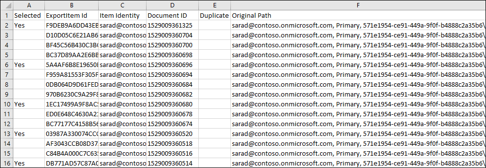
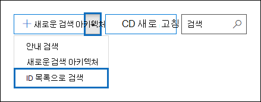

# ID 목록 콘텐츠 검색에 대 한 CSV 파일 준비Prepare a CSV file for an ID list Content Search

Exchange ID 목록을 사용하여 특정 사서함 전자 메일 메시지 및 기타 사서함 항목을 검색할 수 있습니다.You can search for specific mailbox email messages and other mailbox items using a list of Exchange IDs. ID 목록 검색(대상 지정 검색이라고도 합니다)을 만들 수 있도록 검색할 특정 사서함 항목을 식별하는 CSV(콤보로 구분된 값) 파일을 제출합니다.To create an ID list search (formally called a targeted search), you submit a comma separated value (CSV) file that identifies the specific mailbox items to search for. 이 CSV 파일의 경우 콘텐츠 **검색** 결과를 내보내거나 콘텐츠 검색 보고서를 기존 콘텐츠 검색에서 내보낼 **때** 포함된Results.csv파일 또는 인덱서되지 않은 Items.csv파일을 사용할 수 있습니다.For this CSV file you use the **Results.csv** file or the **Unindexed Items.csv** file that are included when you export the Content Search results or export a Content Search report from and existing Content Search. 그런 다음 이러한 파일 중 하나를 편집하여 검색할 특정 항목을 지정한 다음 새 ID 목록 검색을 만들고 CSV 파일을 제출합니다.Then you edit one of these files to indicate the specific items to search for, and then create a new ID list search and submit the CSV file.

ID 목록 검색을 만드는 프로세스를 간략하게 간략하게 소개합니다.Here's a quick overview of the process for creating an ID list search.

1. 보안 및 준수 센터에서 새 콘텐츠 검색 또는 & 실행합니다.Create and run a new or guided Content Search in the Security & Compliance Center.

2. 콘텐츠 검색 결과를 내보내거나 콘텐츠 검색 보고서를 내보낼 수 있습니다.Export the content search results or export the content search report. 자세한 내용은 다음을 참조하세요.For more information, see:

    - [콘텐츠 검색 결과 내보내기Export Content Search results](export-search-results.md)

    - [콘텐츠 검색 보고서 내보내기Export a Content Search report](export-a-content-search-report.md)

3. Results.csv **파일** 또는 인덱서되지 않은 Items.csvID 목록 검색에 포함할 특정 사서함 항목을 식별합니다. Edit the **Results.csv** file or the **Unindexed Items.csv** and identify the specific mailbox items that you want to include in the ID list search. ID [목록](#prepare-the-csv-file-for-an-id-list-search) 검색을 위해 CSV 파일을 준비하기 위한 지침을 참조하세요.See the [instructions](#prepare-the-csv-file-for-an-id-list-search) for preparing a CSV file for an ID list search.

4. 새 ID 목록 검색을 만들고(지침 [참조)](#create-an-id-list-search)준비한 CSV 파일을 제출합니다.Create a new ID list search (see the [instructions](#create-an-id-list-search)) and submit the CSV file that you prepared. 생성된 검색 쿼리는 CSV 파일에서 선택한 항목만 검색합니다.The search query that's created will only search for the items selected in the CSV file.

> [!NOTE]
> ID 목록 검색은 사서함 항목에만 지원됩니다.ID list searches are only supported for mailbox items. ID 목록 검색에서는 SharePoint 및 OneDrive 문서를 검색할 수 없습니다.You can't search for SharePoint and OneDrive documents in an ID list search.

 **ID 목록 검색을 만드는 이유****Why create an ID list search?** **Results.csv** 또는 인덱서되지 않은 Items.csv파일의 메타데이터를 기반으로 항목이 eDiscovery 요청에 응답하는지 여부를 확인할 수 없는 경우 ID 목록 검색을 사용하여 해당 항목을 찾아 미리 보고 내보낼 수 있습니다. If you're unable to determine if an item is responsive to an eDiscovery request based on the metadata in the **Results.csv** or **Unindexed Items.csv** files, you can use an ID list search to find, preview, and then export that item to determine if it's responsive to the case you're investigating. ID 목록 검색은 일반적으로 인덱서되지 않은 특정 항목 집합을 검색하고 반환하는 데 사용됩니다.ID list searches are typically used to search for and return a specific set of unindexed items.

## ID 목록 검색을 위한 CSV 파일 준비Prepare the CSV file for an ID list search

콘텐츠 검색에 대한 검색 결과 또는 보고서를 내보낼 경우 다음 단계를 수행하여 ID 목록 검색을 위해 CSV 파일을 준비할 수 있습니다.After you export the search results or report for a content search, you can perform the following steps to prepare the CSV file for an ID list search. 이 CSV 파일은 ID 목록 검색의 모든 항목을 식별합니다.This CSV file will identify every item in the ID list search.

SharePoint 사이트 및 OneDrive 계정을 포함 하는 검색에서 CSV 파일을 사용할  수 있지만 ID 목록 검색에 대 한 사서함 항목만 선택할 수 있습니다.Note that you can use a CSV file from a search that included SharePoint sites and OneDrive accounts, but you can select  *only*  mailbox items for an ID list search. SharePoint 또는 OneDrive에서 문서를 선택하면 ID 목록 검색을 만들 때 CSV 파일이 유효성 검사에 실패합니다.If you select a document in SharePoint or OneDrive, the CSV file will fail validation when you create an ID list search.

1. Excel에서 Results.csv파일을 열거나 **Items.csv** 열 수 있습니다.Open the **Results.csv** or **Unindexed Items.csv** file in Excel.

2. 선택한 **열에** 검색할 항목에 해당하는 셀에 **예를** 입력합니다.In the **Selected** column, type **Yes** in the cell that corresponds to the item that you want to search for. 검색하려는 모든 항목에 대해 이 단계를 반복합니다.Repeat this step for every item that you want to search for.

    > [!IMPORTANT]
    > Excel에서 CSV 파일을 열면 문서 **ID** 열의 데이터 형식이 일반으로 **변경됩니다.**When you open the CSV file in Excel, the data format for the **Document ID** column is changed to **General**. 따라서 항목의 문서 ID가 과학적 표시로 표시됩니다.This results in displaying the document ID for an item in scientific notation. 예를 들어 "481037338205"의 문서 ID는 "4.81037E+11"으로 표시됩니다. 문서 **ID** 열의 데이터 형식을 **숫자로** 변경하여 문서 ID에 대한 올바른 형식을 복원해야 합니다.For example, the document ID of "481037338205" is displayed as "4.81037E+11" You have to perform the next steps to change the data format of the **Document ID** column to **Number** to restore the correct format for the document ID. 이렇게 하지 않는 경우 CSV 파일을 사용하는 ID 목록 검색이 실패합니다.If you don't do this, the ID list search that uses the CSV file will fail.

3. 전체 문서 **ID 열을 마우스 오른쪽 단추로** 클릭하고 **셀 서식을 선택합니다.**Right-click the entire **Document ID** column and select **Format Cells**.

4. 범주 **상자에서** 번호를 **클릭합니다.**In the **Category** box, click **Number**.

5. 소수 자치소 수를 **0으로** 변경한 다음 **확인을** 클릭하여 변경 내용을 저장합니다.Change the number of decimal places to **0**, and then click **OK** to save your changes. 문서 ID 열의 값은 숫자로 변경됩니다.Notice that the values in the Document ID column are changed to numbers.

    다음은 ID 목록 콘텐츠 검색을 위해 제출할 준비가 된 CSV 파일의 예입니다.Here's an example of the a CSV file that's ready to be submitted for a ID list content search.

    

6. CSV 파일을 저장하거나  다른 파일 이름으로 다른 이름으로 저장에 다른 이름으로 저장을 사용할 수 있습니다.Save the CSV file or use **Save As** to the save the file with different file name. 두 경우 모두 CSV 형식으로 파일을 저장해야 합니다.In both cases, be sure to save the file with the CSV format.

## ID 목록 검색 만들기Create an ID list search

다음 단계에서는 새 ID 목록 콘텐츠 검색을 만들고 이전 단계에서 준비한 CSV 파일을 제출합니다.The next step is to create a new ID list Content Search and submit the CSV file that you prepared in the previous step.

> [!IMPORTANT]
> 콘텐츠 검색에서 결과 또는 보고서를 내보낼 때 ID 목록 검색을 2일 이상 만들어야 합니다.You should create an ID list search no more than 2 days after exporting the results or report from a Content Search. 2일이 지난 검색 결과 또는 보고서를 내보낼 경우 검색 결과 또는 보고서를 다시 내보내 업데이트된 CSV 파일을 생성해야 합니다.If the search results or report where exported more than 2 days ago, you should re-export the search results or report to generate updated CSV files. 그런 다음 업데이트된 CSV 파일 중 하나를 준비하고 이를 사용하여 ID 목록 검색을 만들 수 있습니다.Then you can prepare one of the updated CSV files and use it to create an ID list search.

1. 보안 & 준수 센터에서 검색 콘텐츠  \> **검색으로 이동하세요.**In the Security & Compliance Center, go to **Search** \> **Content search**.

2. 검색 **페이지에서** 아이콘 새로 검색 추가 옆에 있는 화살표를 클릭한 다음 ID 목록으로   **검색을 클릭합니다.**On the **Search** page, click the arrow next to  **New search**, and then click **Search by ID List**.

    

3. **ID로** 검색 목록 플라이아웃에서 검색 이름을 지정하고 원하는 경우  설명을 입력한 다음 찾아보기를 클릭하고 이전 단계에서 준비한 CSV 파일을 선택합니다.On the **Search by ID List** flyout, name the search (and optionally describe it) and then click **Browse** and select the CSV file that you prepared in the previous step.

    Microsoft 365는 CSV 파일의 유효성을 검사하려고 시도합니다.Microsoft 365 attempts to validate the CSV file. 유효성 검사에 실패하면 유효성 검사 오류를 해결하는 데 도움이 될 수 있는 오류 메시지가 표시됩니다.If the validation is unsuccessful, an error message is displayed that might help you troubleshoot the validation errors. ID 목록 검색을 만들 수 있는 CSV 파일의 유효성을 검사해야 합니다.The CSV file has to be successfully validated to create an ID list search.

4. CSV 파일의 유효성을 검사한 후 **검색을** 클릭하여 ID 목록 검색을 생성합니다.After the CSV file is successfully validated, click **Search** to create the ID list search.

    다음은 ID 목록 검색에 대해 생성된 예상 검색 결과 및 쿼리의 예입니다.Here's an example of the estimated search results and the query that's generated for an ID list search.

    

    ID 검색 통계에 표시되는 예상 항목 수는 CSV 파일에서 선택한 항목 수와 일치해야 합니다.Note that the number of estimated items displayed in statistics for the ID search should match the number of items that you selected in the CSV file.

5. ID 목록 검색에서 반환된 항목을 미리 보거나 내보낼 수 있습니다.Preview or export the items returned by the ID list search.

> [!NOTE]
> ID 목록 검색을 만들고 나서 사서함을 이동하면 검색에 대한 쿼리가 지정된 항목을 반환하지 않습니다.If you move a mailbox after creating an ID list search, the query for the search won't return the specified items. 사서함을 이동할 때 사서함 항목에 대한 **DocumentId** 속성이 변경되어 있기 때문에입니다.That's because the **DocumentId** property for mailbox items are changed when a mailbox is moved. ID 목록 검색을 만든 후 사서함이 이동되는 드물지만, 새 콘텐츠 검색을 만들거나 기존 콘텐츠 검색에 대한 검색 결과를 업데이트한 다음 검색 결과 또는 보고서를 내보내 새 ID 목록 검색을 만드는 데 사용할 수 있는 업데이트된 CSV 파일을 생성해야 합니다.In the rare instance when a mailbox is moved after you create an ID list search, you should create a new content search (or update the search results for the existing content search) and then export the search results or report to generate updated CSV files that can be used to create a new ID list search.
