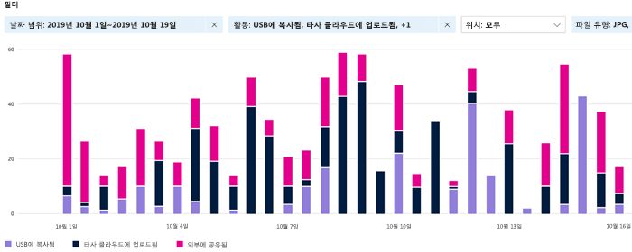

# 활동 탐색기 시작하기

데이터 [분류 개요 및](data-classification-overview.md) 콘텐츠 [탐색기](data-classification-content-explorer.md) 탭을 사용하면 검색되고 레이블이 지정되는 콘텐츠와 해당 콘텐츠의 위치를 확인할 수 있습니다. 활동 탐색기는 사용자가 레이블이 지정된 콘텐츠로 수행한 작업을 모니터링할 수 있도록 하여 이 기능 제품군을 자세히 설명합니다. 활동 탐색기는 레이블이 지정한 콘텐츠에 대한 활동의 기록 보기를 제공합니다. 활동 정보는 통합 감사 Microsoft 365 수집되어 활동 탐색기 UI에서 사용할 수 있도록 변환됩니다. 

사용할 수 있는 30개가 넘는 여러 가지 필터가 있습니다. 예를 들면:

- 날짜 범위
- 활동 유형
- 위치
- 사용자
- 민감도 레이블
- 보존 레이블
- 파일 경로
- DLP 정책

## 필수 구성 요소

테이터 분류에 액세스하고 이를 사용하는 모든 계정에는 다음 구독 중 하나에서 할당된 라이선스가 있어야 합니다.

- Microsoft 365 (E5)
- Office 365 (E5)
- 고급 규정 준수 (E5) 추가 기능
- 고급 위협 인텔리전스 (E5) 추가 기능
- Microsoft 365 E5/A5 정보 보호 및 거버넌스
- Microsoft 365 E5/A5 규정 준수

### 권한

 활동 탐색기 탭에 액세스하려면 계정이 이러한 역할 그룹 중 하나에서 멤버 자격을 명시적으로 할당하거나 역할을 명시적으로 부여해야 합니다.

<!--
> [!IMPORTANT]
> Access to Activity explorer via the Security reader or Device Management role groups or other has been removed-->

**Microsoft 365 역할 그룹**

- 전역 관리자
- 준수 관리자
- 보안 관리자
- 규정 준수 데이터 관리자

**Microsoft 365 역할**

- 준수 관리자
- 보안 관리자

## 활동 유형

활동 탐색기는 여러 활동 원본의 감사 로그에서 활동 정보를 수집합니다. 활동 탐색기에서 사용할 수 있는 레이블 지정 활동에 대한 자세한 내용은 활동 탐색기에서 사용할 수 있는 이벤트 레이블 [지정을 참조하세요.](data-classification-activity-explorer-available-events.md)

**Office** 네이티브  응용 프로그램, Azure Information Protection 추가 기능, SharePoint Online, Exchange Online(민감도 레이블만 해당) 및 OneDrive. 예를 들면 다음과 같습니다.

- 레이블을 적용함
- 레이블을 변경함(업그레이드, 다운그레이드 또는 제거함)
- 자동 레이블 지정 시뮬레이션
- 파일 읽기 

**AIP(Azure Information Protection) 스캐너 및 AIP 클라이언트**

- 보호 적용
- 보호가 변경된 경우
- 보호 제거됨
- 검색된 파일 

또한 활동 탐색기는 Exchange Online, SharePoint Online, OneDrive, Teams 채팅 및 채널(미리 보기), SharePoint 폴더 및 라이브러리, Windows 10 파일 공유 및 끝점 **DLP(데이터** 손실 방지)를 통해 Windows 10 장치와 일치하는 이벤트를 수집합니다.  다음과 같은 Windows 10 예시가 있습니다.

- deletions
- creations
- 클립보드에 복사
- 수정됨
- 읽기
- 인쇄
- 이름 변경
- 네트워크 공유에 복사
- 허용되지 않은 앱에서 액세스 

중요한 레이블이 지정되는 콘텐츠에 대해 수행되는 작업을 이해하면 데이터 손실 방지와 같이 이미 설정한  컨트롤이 효과적인지 알 수 있습니다. 그렇지 않고, 많은 수의 항목이 `highly confidential` 레이블이 지정되었다가 `general`로 다운그레이드되는 것과 같은 예기치 않은 상황이 발생하는 경우, 다양한 정책을 관리하고 새로운 작업을 수행하여 원치 않은 동작을 제한할 수 있습니다.

> [!NOTE]
> 현재 활동 탐색기에서는 Exchange Online의 보존 활동을 모니터링하고 있지 않습니다.

## 참고 항목

- [민감도 레이블에 대해 알아보기](sensitivity-labels.md)
- [보존 정책 및 보존 레이블에 대해 알아보기](retention.md)
- [중요한 정보 유형에 대해 알아보기](sensitive-information-type-learn-about.md)
- [데이터 분류에 대한 자세한 정보](data-classification-overview.md)
