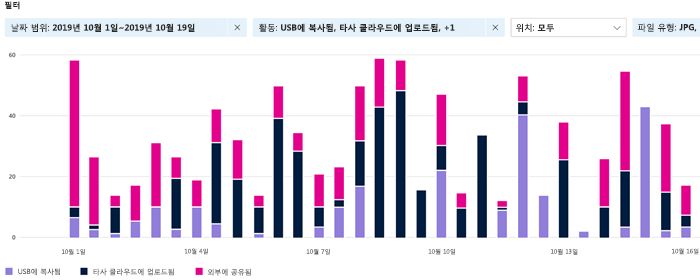
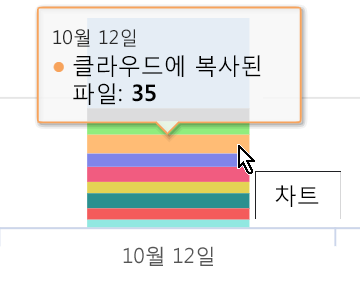
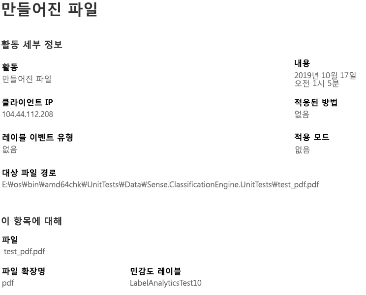

# 레이블이 지정된 콘텐츠의 활동 보기(미리 보기)

데이터 분류 개요 및 콘텐츠 탐색기 탭을 통해 검색된 후 레이블이 지정된 콘텐츠와 해당 콘텐츠의 위치를 확인할 수 있습니다. 활동 탐색기는 사용자가 레이블이 지정된 콘텐츠로 수행한 작업을 모니터링할 수 있도록 하여 이 기능 제품군을 자세히 설명합니다. 활동 탐색기는 기록 보기를 제공합니다.

다음을 수행하여 데이터를 필터링할 수 있습니다.

- 날짜 범위
- 활동 유형
- 위치
- 사용자
- 민감도 레이블
- 보존 레이블

데이터를 목록 또는 막대 그래프로 볼 수 있습니다.

## 활동 유형

Microsoft 365는 SharePoint Online, OneDrive 및 엔드포인트에서 12가지 유형의 활동을 모니터링하고 보고합니다. 끝점은 Windows 10을 실행하는 사용자 디바이스입니다.

- 파일을 만들었음
- 파일을 수정함
- 파일 이름을 바꿈
- 파일을 클라우드로 복사함
- 허용되지 않은 앱에서 파일에 액세스함
- 파일을 인쇄함
- 이동식 미디어에 파일을 복사함
- 파일을 네트워크 공유에 복사함
- 파일 읽기
- 파일을 클립보드로 복사함
- 레이블을 적용함
- 레이블을 변경함(업그레이드, 다운그레이드 또는 제거함)

중요 레이블이 지정된 콘텐츠에 어떤 작업이 수행되고 있는지 파악하면 사용자가 이미 적용한 제어(예: [데이터 손실 방지 정책](data-loss-prevention-policies.md))이 유효한지를 파악할 수 있다는 이점이 있습니다. 그렇지 않고, 많은 수의 항목이 `highly confidential` 레이블이 지정되었다가 `general`로 다운그레이드되는 것과 같은 예기치 않은 상황이 발생하는 경우, 다양한 정책을 관리하고 새로운 작업을 수행하여 원치 않은 동작을 제한할 수 있습니다.

필터를 설정하면 다음을 수행할 수 있습니다.

- 막대형 차트의 세그먼트에 마우스를 올려 놓으면 해당 범주에 속하는 항목의 수를 볼 수 있습니다. 
- 데이터 내보내기
- 목록에서 지정된 항목을 선택하고 플라이아웃에서 작업 세부 정보 확인

## 참고 항목
- [민감도 레이블](sensitivity-labels.md)
- [보존 레이블](labels.md)
- [중요한 정보 유형이 찾는 항목](what-the-sensitive-information-types-look-for.md)
- [보존 정책 개요](retention-policies.md)