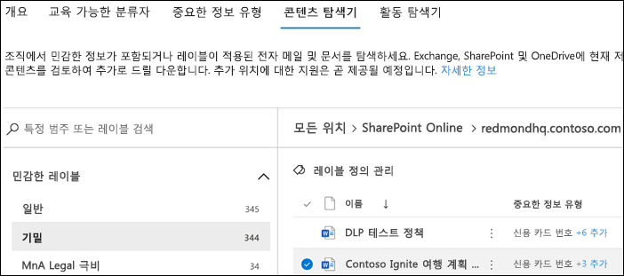

# 데이터 분류 콘텐츠 탐색기(미리 보기) 사용

데이터 분류 콘텐츠 탐색기를 사용하여 개요 페이지에 요약된 항목을 원래 상태로 볼 수 있습니다.

## 콘텐츠 탐색기

콘텐츠 탐색기는 민감도 레이블, 보존 레이블이 있거나, 조직에서 중요한 정보 유형으로 분류된 항목의 현재 스냅샷입니다.

### 사용 권한

콘텐츠 탐색기에 대한 액세스 권한을 부여하는 두 개의 역할이 있습니다.

- **콘텐츠 탐색기 목록 뷰어**: 이 역할의 멤버 자격으로 각 항목과 해당 위치를 볼 수 있습니다.

- **콘텐츠 탐색기 콘텐츠 뷰어**:이 역할의 멤버 자격으로 목록에 있는 각 항목의 내용을 볼 수 있습니다.

콘텐츠 탐색기에 액세스하는 데 사용하는 계정은 역할 중 하나 또는 둘 다에 있어야 합니다. 이러한 역할은 독립적인 역할이며 누적되지 않습니다. 예를 들어 계정에 항목 및 해당 위치만 볼 수 있는 권한을 부여 하려는 경우 콘텐츠 탐색기 목록 표시기 권한을 부여 합니다. 동일한 계정에서 목록에 있는 항목의 내용을 볼 수 있게 하려면 콘텐츠 탐색기 콘텐츠 뷰어 권한도 부여합니다.

### 콘텐츠 탐색기를 사용하는 방법

1. **Microsoft 365 준수 센터**  > **데이터 분류** > **콘텐츠 탐색기**
2. 레이블 이름 또는 중요한 정보 유형을 알고 있는 경우 검색 상자에 입력할 수 있습니다.
3. 또는 레이블 유형을 확장하고 목록에서 레이블을 선택하여 항목을 찾아볼 수 있으며, 목록의 보존 레이블 영역에 포함된 항목이 아래에 표시됩니다.
4. **모든 위치**에서 위치를 선택하고 폴더 구조를 드릴다운하여 해당 항목까지 이동합니다.
5. 콘텐츠 탐색기에서 기본적으로 항목을 열려면 두 번 클릭합니다.

## 참고 항목

- [민감도 레이블](sensitivity-labels.md)
- [보존 레이블](labels.md)
- [중요한 정보 유형이 찾는 항목](what-the-sensitive-information-types-look-for.md)
- [보존 정책 개요](retention-policies.md)
