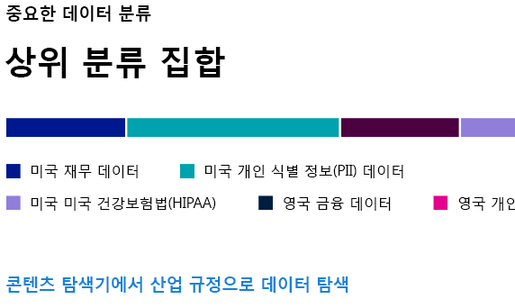
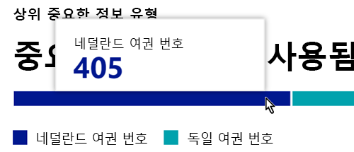
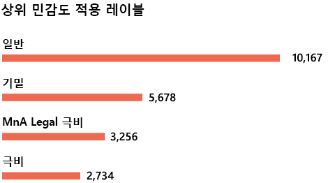
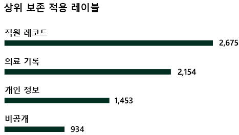

# 데이터 분류에 대한 자세한 정보

Microsoft 365 관리자 또는 준수 관리자는 조직의 콘텐츠가 이동하는 위치를 제어하고, 위치에 관계없이 보호하고, 조직의 요구에 따라 보존 및 삭제하기 위해 콘텐츠를 평가하고 태그를 지정할 수 있습니다. 이 작업은 [민감도 레이블](sensitivity-labels.md), [보존 레이블](retention.md#retention-labels) 및 중요한 정보 유형 분류를 적용하여 수행합니다. 검색, 평가 및 태그 지정을 수행하는 방법에는 여러 가지가 있지만, 결과적으로는 많은 수의 문서 및 전자 메일을 이러한 두 레이블 중 하나 또는 둘 다를 사용하여 태그를 지정하고 분류하게 됩니다. 보존 레이블 및 민감도 레이블을 적용한 후에는 테넌트 전체에서 레이블이 사용되는 방식과 해당 항목으로 수행 중인 작업을 확인하고자 할 것입니다. 데이터 분류 페이지에는 해당 콘텐츠 본문이 표시됩니다. 특히 다음 정보를 확인할 수 있습니다.

- 중요한 정보 유형으로 분류된 항목의 수와 사용된 분류
- Microsoft 365 및 Azure Information Protection에서 가장 많이 적용한 민감도 레이블
- 가장 많이 적용한 보존 레이블
- 사용자가 중요한 콘텐츠에 대해 수행하는 활동 요약
- 중요한 데이터와 보존된 데이터의 위치

또한 데이터 분류 페이지에서 다음 기능을 관리합니다.

- [학습 가능한 분류자](classifier-learn-about.md)
- [중요한 정보 유형](sensitive-information-type-learn-about.md)
- [정확한 데이터 일치](create-custom-sensitive-information-types-with-exact-data-match-based-classification.md)
- [콘텐츠 탐색기](data-classification-content-explorer.md)
- [활동 탐색기](data-classification-activity-explorer.md)

**Microsoft 365 규정 준수 센터** 또는 **Microsoft 365 보안 센터** > **분류** > **데이터 분류** 에서 데이터 분류를 찾을 수 있습니다.

비디오를 시청하여 데이터 분류 기능에 대해 알아보세요.

> [!VIDEO https://www.microsoft.com/videoplayer/embed/RE4vx8x]

정책을 만들기 전에 데이터 분류에서 중요한 콘텐츠와 레이블이 지정된 콘텐츠를 검사합니다. 이를 **제로 변경 관리** 라고 합니다. 이를 통해 모든 보존 및 민감도 레이블이 환경에 미치는 영향을 확인하고, 보호 및 관리 정책 요구 사항을 평가할 수 있습니다.

## 필수 구성 요소

### 권한

 테이터 분류 페이지에 액세스하려면 계정에 다음 역할이나 역할 그룹 중 하나의 구성원 자격이 할당되어야 합니다.

**Microsoft 365 역할 그룹**

- 전역 관리자
- 준수 관리자
- 보안 관리자
- 규정 준수 데이터 관리자

> [!NOTE]
> 항상 역할을 최소 권한으로 사용하여 Microsoft 365 데이터 분류에 대한 액세스 권한을 부여하는 것이 좋습니다.

## 콘텐츠에 가장 많이 사용되는 중요한 정보 유형

Microsoft 365에는 사회 보장 번호 또는 신용 카드 번호를 포함하는 항목과 같은 중요한 정보 유형에 대한 다양한 정의가 포함되어 있습니다. 중요한 정보 유형에 대한 자세한 내용은 [중요한 정보 유형 엔터티 정의](sensitive-information-type-entity-definitions.md)를 참조하세요.

중요한 정보 유형 카드는 조직 전체에서 검색되고 레이블이 지정된 상위 중요한 정보 유형을 보여 줍니다.

특정 분류 범주에 있는 항목의 수를 확인하려면 해당 범주에 대한 막대를 마우스로 가리킵니다.

> [!NOTE]
> 카드에 "중요한 정보가 포함된 데이터를 찾을 수 없음" 메시지가 표시되면 조직에 중요한 정보 유형으로 분류된 항목이 없거나 크롤링된 항목이 없는 것입니다. 레이블을 시작하려면 다음을 참조하세요.
>- [민감도 레이블 시작하기](get-started-with-sensitivity-labels.md)
>- [보존 정책 및 보존 레이블 시작하기](get-started-with-retention.md)
>- [중요한 정보 유형 엔터티 정의](sensitive-information-type-entity-definitions.md)

## 콘텐츠에 적용되는 상위 민감도 레이블

Microsoft 365 또는 AIP(Azure Information Protection)를 통해 항목에 민감도 레이블을 적용하면 다음과 같은 두 가지 상황이 발생합니다.

- 조직에 항목의 값을 표시하는 태그가 문서에 포함되고, 문서가 이동할 때마다 함께 이동합니다.
- 이 태그가 있으면 필수 워터마크 또는 암호화와 같은 다양한 보호 동작을 사용할 수 있습니다. 엔드포인트 보호를 사용하도록 설정한 경우 항목이 조직의 컨트롤을 벗어나지 않도록 방지할 수도 있습니다.

민감도 레이블에 대한 자세한 내용은 [민감도 레이블 알아보기](sensitivity-labels.md)를 참조하세요.

데이터 분류 페이지에서 해당 데이터를 표시하려면 SharePoint 및 OneDrive에 있는 파일에 민감도 레이블을 사용하도록 설정되어 있어야 합니다. 자세한 내용은 [SharePoint 및 OneDrive에서 Office 파일에 대한 민감도 레이블 사용](sensitivity-labels-sharepoint-onedrive-files.md)을 참조하세요.

민감도 레이블 카드에는 민감도 레이블별 항목(전자 메일 또는 문서) 수가 표시됩니다.

> [!NOTE]
> 민감도 레이블을 생성 또는 게시하지 않았거나 민감도 레이블이 적용된 콘텐츠가 없는 경우 이 카드에 “검색된 민감도 레이블이 없음” 메시지가 표시됩니다. 민감도 레이블을 시작하려면 다음을 참조하세요.
>- [민감도 레이블](get-started-with-sensitivity-labels.md) 또는 AIP [구성 Azure 정보 보호 정책](/azure/information-protection/configure-policy) 시작하기

## 콘텐츠에 적용되는 상위 보존 레이블

보존 레이블은 조직에서 콘텐츠의 보존과 처리를 관리하는데 사용됩니다. 적용된 경우 항목을 삭제하기 전에 보존 기간, 삭제 전에 검토해야 하는지 여부, 보존 기간이 만료되는 시점 및 레코드로 표시해야 하는지 여부를 제어하는 데 사용할 수 있습니다. 자세한 내용은 [보존 정책 및 보존 레이블에 대해 알아보기](retention.md)를 참조하세요.

적용되는 상위 보존 레이블 카드에는 보존 레이블이 지정된 항목 수가 표시됩니다.

> [!NOTE]
> 이 카드에 “검색된 보존 레이블이 없음” 메시지가 표시되는 경우 사용자가 보존 레이블을 생성 또는 게시하지 않았거나, 보존 레이블이 적용된 콘텐츠가 없음을 의미합니다. 보존 레이블을 시작하려면 다음을 참조합니다.
>- [보존 정책 및 보존 레이블 시작하기](get-started-with-retention.md)

## 검색된 상위 활동

이 카드는 사용자가 민감도 레이블이 지정된 항목에 대해 수행하는 가장 일반적인 작업을 빠르게 요약해서 보여 줍니다. [활동 탐색기](data-classification-activity-explorer.md)를 사용하여 Microsoft 365에서 레이블이 지정된 콘텐츠 및 Windows 10 엔드포인트에 있는 콘텐츠에 대해 추적하는 다양한 활동을 드릴다운할 수 있습니다.

> [!NOTE]
> 이 카드에 “검색된 활동 없음" 메시지가 표시되는 경우 파일에 대한 활동이 없었거나 해당 사용자 및 관리자 감사가 켜져 있지 않는 것입니다. 감사 로그를 키려면 다음을 참조하세요.
>- [보안 및 준수 센터에서 감사 로그 검색](search-the-audit-log-in-security-and-compliance.md)

## 위치별 민감도 및 보존 레이블이 지정된 데이터

데이터 분류 보고 지점은 특정 레이블이 지정된 항목의 수와 해당 위치를 시각적으로 보여 줍니다. 이러한 카드를 사용하여 Exchange, SharePoint, OneDrive 등에 있는 레이블이 지정된 항목의 수를 알 수 있습니다.

> [!NOTE]
> 이 카드에 “검색된 위치가 없음” 메시지가 표시되는 경우 사용자가 민감도 레이블을 생성 또는 게시하지 않았거나, 보존 레이블이 적용된 콘텐츠가 없음을 의미합니다. 민감도 레이블 작업을 하려면 다음을 참조하세요.
>- [민감도 레이블](sensitivity-labels.md)

## 공개 미리 보기 릴리스 정보 

> [!NOTE]
> **Exchange 사서함 수**: Exchange 사서함을 드릴할 때 작은 도구 팁이 나타납니다. 중요한 정보 유형, 민감도 레이블 및 보존 레이블에 대해 표시되는 집계 수가 사서함 내에서 찾을 수 있는 항목 수와 정확히 일치하지 않을 수 있습니다. 이는 폴더로 드릴다운하면 집계된 수가 계산되는 동안 분류된 콘텐츠의 라이브 뷰를 가져오기 때문입니다. 스키밍하는 경우에도 사용자가 알아야 하는 정보입니다.

> [!NOTE]
> **암호화된 문서 렌더링**: 암호화된 SharePoint, Exchange 및 OneDrive 파일은 콘텐츠 탐색기에서 렌더링되지 않습니다. 이는 콘텐츠 탐색기에서 파일 콘텐츠를 확인할 필요와 콘텐츠를 암호화된 상태로 유지할 필요 사이에 균형을 요구하는 중요한 문제입니다. **콘텐츠 탐색기 목록 뷰어** 및 **콘텐츠 탐색기 콘텐츠 뷰어** 역할 그룹에서 부여한 권한으로 파일, 파일, 메타 데이터, 웹 클라이언트를 통해 컨텐츠에 액세스하는 데 사용할 수 있는 링크의 목록 보기를 볼 수 있습니다. 스키밍하는 경우에도 사용자가 알아야 하는 정보입니다.

> [!NOTE]
> **SharePoint 검색 보존 레이블 이름에서 지원되는 문자**: SharePoint 검색은 `-` 또는 `_`을(를) 포함한 보존 레이블 이름을 지원하지 않습니다. 예를 들어 `Label-MIP` 및 `Label_MIP`은 지원되지 않습니다. SharePoint 검색에서는 민감도 레이블 이름 및 중요한 정보 유형 이름의 문자를 지원합니다.

> [!NOTE]
> **OneDrive가 미리 보기에 남아 있음**: 미리 보기 프로그램 중에 OneDrive 통합에 대한 소중한 피드백을 주셔서 감사합니다. 세부 사항을 통해 작업할 때 일치하지 않는 데이터/흐름이 실행될 수 있습니다. 모든 수정 사항이 적용될 때까지 OneDrive를 미리 보기로 계속해서 제공할 것입니다. 귀하의 지속적인 지원에 감사드립니다.

## 참고 항목

- [레이블 활동 보기](data-classification-activity-explorer.md)
- [레이블 지정된 콘텐츠 보기](data-classification-content-explorer.md)
- [민감도 레이블에 대해 알아보기](sensitivity-labels.md)
- [보존 정책 및 보존 레이블에 대해 알아보기](retention.md)
- [중요한 정보 유형에 대해 알아보기](sensitive-information-type-learn-about.md)
- [중요한 정보 유형 엔터티 정의](sensitive-information-type-entity-definitions.md)
- [학습 가능한 분류자에 대한 자세한 정 (미리 보기)](classifier-learn-about.md)

데이터 분류를 사용하여 데이터 개인 정보 보호 규정을 준수하는 방법을 알아보려면 [Microsoft 365(aka.ms/m365dataprivacy)를 사용하여 데이터 개인 정보 보호 규정에 대한 정보 보호 배포](../solutions/information-protection-deploy.md)를 참조하세요.