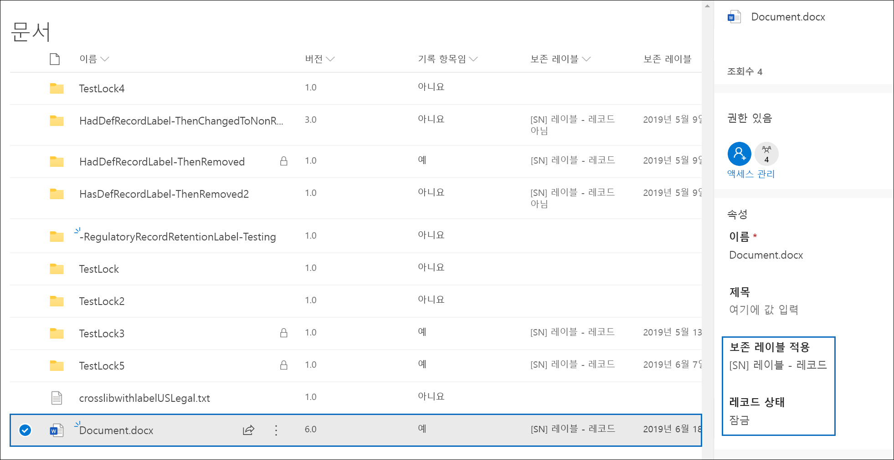

# <a name="declare-records-by-using-retention-labels"></a>보존 레이블을 사용하여 레코드 선언

>*[보안 및 규정 준수를 위한 Microsoft 365 라이선싱 지침](/office365/servicedescriptions/microsoft-365-service-descriptions/microsoft-365-tenantlevel-services-licensing-guidance/microsoft-365-security-compliance-licensing-guidance).*

문서 및 전자 메일을 [레코드](records-management.md#records)로 선언하려면 콘텐츠를 **레코드** 또는 **규제 레코드** 로 표시하는 [보존 레이블](retention.md#retention-labels)을 사용합니다.

레코드 또는 규제 레코드를 사용할지 확실하지 않은 경우 [허용되거나 차단된 작업에 대한 제한을 비교](records-management.md#compare-restrictions-for-what-actions-are-allowed-or-blocked)를 참조하세요. 규제 레코드를 사용해야 하는 경우 먼저 다음 섹션에 설명된 대로 PowerShell 명령을 실행해야 합니다.

그런 다음 이러한 레이블을 보존 레이블 정책에 게시하여 사용자와 관리자가 컨텐츠에 적용할 수 있도록 하거나 항목을 레코드(규제 레코드는 아님)로 표시하는 레이블의 경우 레코드를 선언할 컨텐츠에 레이블을 자동으로 적용할 수 있습니다.

## <a name="how-to-display-the-option-to-mark-content-as-a-regulatory-record"></a>콘텐츠를 규제 레코드로 표시하는 옵션을 표시하는 방법입니다.

> [!NOTE]
> 다음 절차는 감사 로그의 [보존 정책 및 보존 레이블 활동](search-the-audit-log-in-security-and-compliance.md#retention-policy-and-retention-label-activities) 섹션에 있는 **보존 레이블에 대해 사용 설정된 규제 레코드 옵션** 을 로깅하는 감사 작업입니다.

기본적으로 내용을 규제 레코드로 표시하는 보존 레이블 옵션은 보존 레이블 마법사에 표시되지 않습니다. 이 옵션을 표시하려면 먼저 PowerShell 명령을 실행해야 합니다.

1. [Office 365 보안 및 준수 센터 PowerShell에 연결](/powershell/exchange/office-365-scc/connect-to-scc-powershell/connect-to-scc-powershell)합니다.

2. 다음 cmdlet을 실행합니다.

    ```powershell
    Set-RegulatoryComplianceUI -Enabled $true
    ````

    확인할 메시지가 없으며 설정이 즉시 적용됩니다.

보존 레이블 마법사에서 이 옵션을 보는 것에 대한 생각을 변경하면 **false** 값과 동일한 cmdlet을 실행하여 이 옵션을 다시 숨길 수 있습니다. `Set-RegulatoryComplianceUI -Enabled $false`

## <a name="configuring-retention-labels-to-declare-records"></a>레코드를 선언하도록 보존 레이블을 구성하는 중입니다.

Microsoft 365 규정 준수 센터의 **레코드 관리** 솔루션에서 보존 레이블을 생성할 때 항목을 레코드로 표시하는 옵션이 제공됩니다. 이전 섹션에서 PowerShell 명령을 실행한 경우 또는 항목을 규정 레코드로 표시할 수 있습니다.

예를 들어 다음과 같습니다.


이 보존 레이블을 사용하여 필요에 따라 SharePoint 또는 OneDrive 문서 및 Exchange 전자 메일에 적용할 수 있습니다.

전체 지침은 다음과 같습니다.

- [보존 레이블을 만들어 앱에 적용합니다](create-apply-retention-labels.md)

- [내용에 보존 레이블을 자동으로 적용합니다](apply-retention-labels-automatically.md)(규제 레코드에 지원되지 않음).


## <a name="applying-the-configured-retention-label-to-content"></a>구성된 보존 레이블을 내용에 적용하는 중입니다.

항목을 기록 또는 규제 레코드로 표시하는 보존 레이블을 앱에서 적용할 수 있는 경우 다음을 수행합니다.

- Exchange의 경우 사서함에 대한 쓰기 권한이 있는 사용자는 이러한 레이블을 적용할 수 있습니다.
- SharePoint 및 OneDrive의 경우 기본 구성원 그룹에 있는 모든 사용자(참가 권한 수준)는 이러한 레이블을 적용할 수 있습니다.

보존 레이블을 사용하여 레코드로 표시된 문서 예제:



## <a name="searching-the-audit-log-for-labeled-items-that-were-declared-records"></a>레코드로 선언된 레이블이 지정된 항목에 대한 감사 로그 검색

레코드로 항목을 선언하는 레이블 지정 작업은 감사 로그에 기록됩니다.

SharePoint 항목의 경우:
- **파일 및 페이지 활동** 에서 **파일의 보존 레이블 변경** 을 선택합니다. 이 감사 이벤트는 항목을 레코드, 규제 레코드로 표시하거나 표준 보존 레이블인 보존 레이블에 대한 이벤트입니다.

Exchange 항목의 경우:
- **Exchange 사서함 활동** 에서 **레이블이 지정된 메시지를 레코드로** 를 선택합니다. 이 감사 이벤트는 항목을 레코드 또는 규제 레코드로 표시하는 보존 레이블에 대한 이벤트입니다.

이러한 이벤트를 검색하는 방법에 대한 자세한 내용은 [보안 및 준수 센터에서 감사 로그 검색](search-the-audit-log-in-security-and-compliance.md#file-and-page-activities)을 참조하세요.

## <a name="next-steps"></a>다음 단계

레코드 관리에서 지원되는 기타 시나리오 목록은 [레코드 관리에 대한 일반적인 시나리오](get-started-with-records-management.md#common-scenarios-for-records-management)를 참조하세요.
