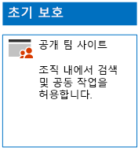
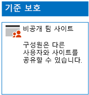
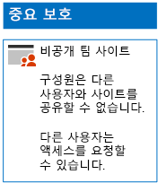
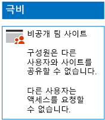

# 3단계 보호를 위한 SharePoint Online 사이트 배포Deploy SharePoint Online sites for three tiers of protection

이 문서의 단계를 사용하여 초기, 중요 및 극비 SharePoint Online 팀 사이트를 디자인하고 배포합니다. 이러한 3계층 보호에 대한 자세한 내용은 [SharePoint Online 사이트 및 파일 보호](../security/office-365-security/secure-sharepoint-online-sites-and-files.md)를 참조하세요.Use the steps in this article to design and deploy baseline, sensitive, and highly confidential SharePoint Online team sites. For more information about these three tiers of protection, see [Secure SharePoint Online sites and files](../security/office-365-security/secure-sharepoint-online-sites-and-files.md).
  
## 초기 SharePoint Online 팀 사이트Baseline SharePoint Online team sites

초기 보호에는 공용 및 개인 팀 사이트가 모두 포함됩니다. 공용 팀 사이트는 조직의 모든 사용자가 검색하고 액세스할 수 있습니다. 개인 사이트는 팀 사이트와 연결된 Office 365 그룹의 구성원만 검색하고 액세스할 수 있습니다. 이러한 유형의 팀 사이트 모두에서는 구성원이 다른 사용자와 사이트를 공유할 수 있습니다.Baseline protection includes both public and private team sites. Public team sites can be discovered and accessed by anybody in the organization. Private sites can only be discovered and accessed by members of the Office 365 group associated with the team site. Both of these types of team sites allow members to share the site with others.
  
### 공개Public

공용 액세스 및 권한이 있는 초기 SharePoint Online 팀 사이트를 만들려면 다음 [지침](https://support.office.com/article/create-a-team-site-in-sharepoint-ef10c1e7-15f3-42a3-98aa-b5972711777d)을 따릅니다.To create a baseline SharePoint Online team site with public access and permissions, follow [these instructions](https://support.office.com/article/create-a-team-site-in-sharepoint-ef10c1e7-15f3-42a3-98aa-b5972711777d).

구성 결과는 다음과 같습니다.Here is your resulting configuration.
  

  
### 비공개Private

개인 액세스 및 권한이 있는 초기 SharePoint Online 팀 사이트를 만들려면 다음 [지침](https://support.office.com/article/create-a-team-site-in-sharepoint-ef10c1e7-15f3-42a3-98aa-b5972711777d)을 따릅니다.To create a baseline SharePoint Online team site with private access and permissions, follow [these instructions](https://support.office.com/article/create-a-team-site-in-sharepoint-ef10c1e7-15f3-42a3-98aa-b5972711777d).
  
구성 결과는 다음과 같습니다.Here is your resulting configuration.
  

  
## 중요 SharePoint Online 팀 사이트Sensitive SharePoint Online team sites

중요 SharePoint Online 팀 사이트는 개인 팀 사이트로 시작합니다.A sensitive SharePoint Online team site starts as a private team site.
  
먼저 다음 [지침](https://support.office.com/article/create-a-team-site-in-sharepoint-ef10c1e7-15f3-42a3-98aa-b5972711777d)에 따라 개인 SharePoint Online 팀 사이트를 만듭니다.First, create the private SharePoint Online team site with [these instructions](https://support.office.com/article/create-a-team-site-in-sharepoint-ef10c1e7-15f3-42a3-98aa-b5972711777d).

다음으로, 새 SharePoint Online 팀 사이트에서 다음 단계를 사용하여 추가 권한 설정을 구성합니다.Next, from the new SharePoint Online team site, configure additional permission settings with these steps.

1.  SharePoint 팀 사이트의 도구 막대에서 설정 아이콘을 클릭한 다음 **사이트 사용 권한**을 클릭합니다.In the tool bar of the SharePoint team site, click the settings icon, and then click **Site permissions**.
2.  **사이트 사용 권한** 창에 있는 **공유 설정**에서 **공유 설정 변경**을 클릭합니다.In the **Site permissions** pane, under **Sharing Settings**, click **Change sharing settings**.
3.  **사용 권한 공유**에서 **사이트 소유자만 파일, 폴더 및 사이트를 공유할 수 있습니다**를 선택하고 **저장**을 클릭합니다.Under **Sharing permissions**, choose **Only site owners can share files, folders, and the site**, and then click **Save**.

이러한 권한 설정의 결과는 다음과 같습니다.The results of these permission settings are:

- 구성원이 다른 구성원과 공유하는 기능은 사용할 수 없습니다.The ability for members to share with other members is disabled.
- 구성원이 아닌 사용자가 액세스를 요청하는 기능은 사용할 수 있습니다.The ability for non-members to request access is enabled.

구성 결과는 다음과 같습니다.Here is your resulting configuration.
  

  
사이트 구성원은 이제 액세스 그룹 중 하나의 그룹 구성원 자격을 통해 사이트의 리소스에서 안전하게 공동 작업할 수 있습니다.The members of the site, through group membership in one of the access groups, can now securely collaborate on the resources of the site.
  
## 극비 SharePoint Online 팀 사이트Highly confidential SharePoint Online team sites

극비 SharePoint Online 팀 사이트는 추가 권한 설정이 있는 개인 팀 사이트입니다.A highly confidential SharePoint Online team site is a private team site with additional permissions settings.

먼저 다음 [지침](https://support.office.com/article/create-a-team-site-in-sharepoint-ef10c1e7-15f3-42a3-98aa-b5972711777d)에 따라 개인 SharePoint Online 팀 사이트를 만듭니다.First, create the private SharePoint Online team site with [these instructions](https://support.office.com/article/create-a-team-site-in-sharepoint-ef10c1e7-15f3-42a3-98aa-b5972711777d).

다음으로, 새 SharePoint Online 팀 사이트에서 다음 단계를 사용하여 추가 권한 설정을 구성합니다.Next, from the new SharePoint Online team site, configure additional permission settings with these steps.

1.  SharePoint 팀 사이트의 도구 막대에서 설정 아이콘을 클릭한 다음 **사이트 사용 권한**을 클릭합니다.In the tool bar of the SharePoint team site, click the settings icon, and then click **Site permissions**.
2.  **사이트 사용 권한** 창에 있는 **공유 설정**에서 **공유 설정 변경**을 클릭합니다.In the **Site permissions** pane, under **Sharing Settings**, click **Change sharing settings**.
3.  **사용 권한 공유**에서 **사이트 소유자만 파일, 폴더 및 사이트를 공유할 수 있습니다**를 선택합니다.Under **Sharing permissions**, choose **Only site owners can share files, folders, and the site**.
4. **액세스 요청 허용**을 해제한 다음, **저장**을 클릭합니다.Turn off **Allow access requests**, and then click **Save**.

이러한 권한 설정의 결과는 다음과 같습니다.The results of these permission settings are:

- 구성원이 다른 구성원과 공유하는 기능은 사용할 수 없습니다.The ability for members to share with other members is disabled.
- 구성원이 아닌 사용자가 액세스를 요청하는 기능은 사용할 수 없습니다.The ability for non-members to request access is disabled.

구성 결과는 다음과 같습니다.Here is your resulting configuration.
  

  
사이트 구성원은 이제 액세스 그룹 중 하나의 그룹 구성원 자격을 통해 사이트의 리소스에서 안전하게 공동 작업할 수 있습니다.The members of the site, through group membership in one of the access groups, can now securely collaborate on the resources of the site.
  
## 다음 단계Next step

[Office 365 레이블 및 DLP를 사용하여 SharePoint Online 파일 보호Protect SharePoint Online files with Office 365 labels and DLP](protect-sharepoint-online-files-with-office-365-labels-and-dlp.md)

## 참고 항목See also

[정치적 캠페인, 비영리 조직 및 기타 기밀 조직에 대한 Microsoft 보안 지침Microsoft Security Guidance for Political Campaigns, Nonprofits, and Other Agile Organizations](../security/office-365-security/microsoft-security-guidance-for-political-campaigns-nonprofits-and-other-agile-o.md)
  
[클라우드 도입 및 하이브리드 솔루션Cloud adoption and hybrid solutions](https://docs.microsoft.com/office365/enterprise/cloud-adoption-and-hybrid-solutions)
