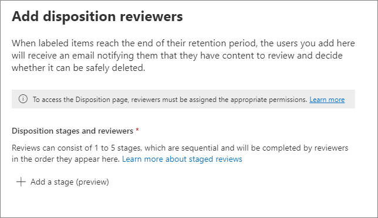
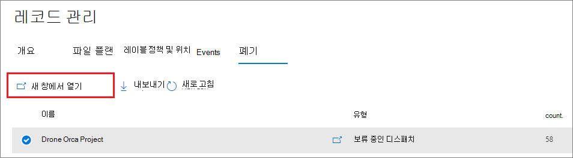
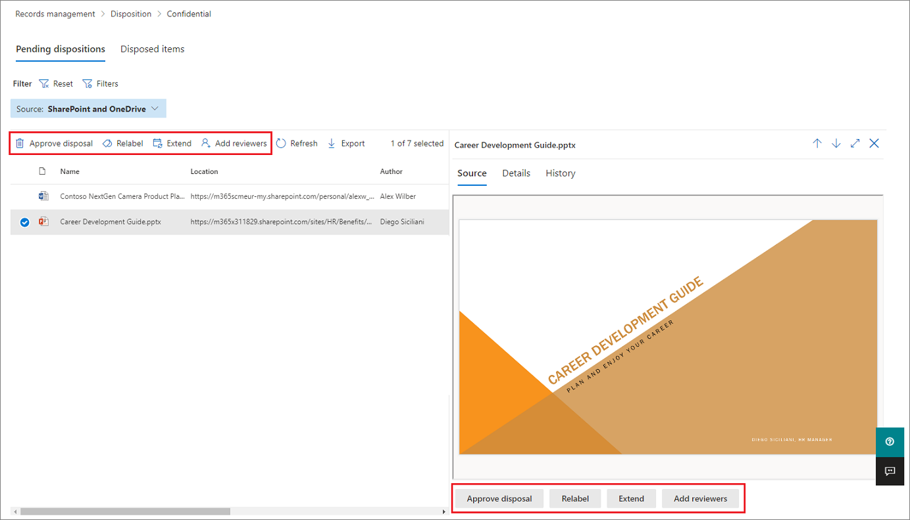

# <a name="disposition-of-content"></a>콘텐츠의 처리

>*[보안 및 규정 준수를 위한 Microsoft 365 라이선싱 지침](/office365/servicedescriptions/microsoft-365-service-descriptions/microsoft-365-tenantlevel-services-licensing-guidance/microsoft-365-security-compliance-licensing-guidance).*

Microsoft 365 준수 센터의 **레코드 관리** 에서 **처리** 페이지을 사용하여 처리 검토를 관리하고 보존 기간이 끝날 때 자동으로 삭제된 [레코드](records-management.md#records)의 메타데이터를 봅니다.

## <a name="prerequisites-for-viewing-content-dispositions"></a>콘텐츠 처리를 보기 위한 필수 구성 요소

처리 검토를 관리하고 레코드가 삭제되었는지 확인하려면 충분한 권한이 필요하고 감사를 사용하도록 설정해야 합니다. 처리 [한도](retention-limits.md#maximum-number-of-items-for-disposition)를 감안하는 것도 잊지 마세요.

### <a name="permissions-for-disposition"></a>처리 권한

Microsoft 365 준수 센터의 **처리** 탭에 액세스하려면 사용자에게 **처리 관리** 역할이 있어야 합니다. 2020년 12월부터 이 역할이 **역할 그룹** 에 포함됩니다.

> [!NOTE]
> 기본적으로 전역 관리자에게 **처리 관리** 역할이 부여되지 않습니다. 

사용자에게 보존 및 레코드 관리를 위한 다른 기능을 보고 구성할 수 있는 권한을 부여하지 않고 처리 검토에 필요한 권한만 부여하려면 사용자 지정 역할 그룹(예: "처리 검토자")을 만들고 이 그룹에 **처분 관리** 역할을 부여하세요.

기본 역할에 사용자를 추가하거나 고유의 역할 그룹을 만드는 방법에 대한 지침은 [Office 365 규정 준수 센터의 사용 권한](microsoft-365-compliance-center-permissions.md)을 참조하세요.

추가 사항:

- 처리 프로세스 중에 항목의 콘텐츠를 보려면 사용자를 **콘텐츠 탐색기 콘텐츠 뷰어** 역할 그룹에 추가하세요. 사용자가 이 역할 그룹의 권한을 가지고 있지 않은 경우에도 처리 검토 작업을 선택하여 처리 검토를 완료할 수 있지만, 규정 준수 센터의 미니 미리 보기 창에서 항목의 콘텐츠를 볼 수는 없습니다.

- 기본적으로 **처리** 페이지에 액세스하는 각 사용자는 검토하도록 할당된 항목만 봅니다. 레코드 관리 관리자가 모든 사용자에게 할당된 모든 항목과 처리 검토를 위해 구성된 모든 보존 레이블을 보려면: **레코드 관리 설정** > **일반** > **레코드 관리자용 보안 그룹** 으로 이동하여 관리자 계정이 포함된 메일 사용 가능 보안 그룹을 선택한 다음 활성화합니다.
    
    메일을 사용할 수 없는 Microsoft 365 그룹 및 보안 그룹은 이 기능을 지원하지 않으므로 선택할 목록에 표시되지 않습니다. 새 메일 사용 보안 그룹을 만들어야 하는 경우 <a href="https://go.microsoft.com/fwlink/p/?linkid=2024339" target="_blank">Microsoft 365 관리 센터</a>에 대한 링크를 사용하여 새 그룹을 만듭니다. 
    
    > [!IMPORTANT]
    > 그룹을 활성화한 후에는 규정 준수 센터에서 변경할 수 없습니다. PowerShell을 사용하여 다른 그룹을 활성화하는 방법은 다음 섹션을 참조하세요.

- **레코드 관리 설정** 옵션은 레코드 관리 관리자에게만 표시됩니다. 

#### <a name="enabling-another-security-group-for-disposition"></a>처리를 위해 다른 보안 그룹 활성화

Microsoft 365 규정 준수 센터의 **레코드 관리 설정** 에서 처리를 위해 보안 그룹을 활성화한 후에는 그룹에 대해 이 권한을 비활성화하거나 규정 준수 센터에서 선택한 그룹을 바꿀 수 없습니다. 그러나 [Enable-ComplianceTagStorage](/powershell/module/exchange/enable-compliancetagstorage) cmdlet을 사용하여 다른 메일 사용 보안 그룹을 설정할 수 있습니다.

예제: 

```PowerShell
Enable-ComplianceTagStorage -RecordsManagementSecurityGroupEmail dispositionreviewers@contosoi.com
````

### <a name="enable-auditing"></a>감사 사용

첫 처리 작업 최소 하루 이전에 감사를 사용하도록 설정합니다. 자세한 내용은 [보안 및 준수 센터에서 감사 로그 검색](search-the-audit-log-in-security-and-compliance.md)을 참조하세요. 

## <a name="disposition-reviews"></a>처리 검토

콘텐츠의 보존 기간이 만료되면 해당 콘텐츠를 검토하고 영구적으로 삭제할 수 있는지 여부를 확인하는 몇 가지 이유가 있습니다(폐기). 예를 들어 콘텐츠를 삭제하는 대신 다음 작업을 수행해야 할 수 있습니다.
  
- 소송 또는 감사를 위해 관련 콘텐츠의 지우기 일시 중단

- 원래 보존 설정이 임시 혹은 잠정적 솔루션이어서 콘텐츠에 다른 보존 기간을 할당합니다.

- 예를 들어, 기존 위치에서 보관 위치로 콘텐츠를 이동합니다(예: 해당 내용이 연구 또는 과거 가치가 있는 경우).

보존 기간이 끝날 때 처리 검토가 트리거되면 선택한 검토자는 검토할 콘텐츠가 있다는 전자 메일 알림을 받습니다. 이러한 검토자는 개별 사용자 또는 메일 사용 보안 그룹일 수 있습니다.

다른 언어의 지침을 포함하여 검토자가 받는 알림 전자 메일을 사용자 지정할 수 있습니다. 다국어 지원을 받으려면 변환을 직접 지정해야 하며 이 사용자 지정 텍스트는 해당 로캘에 관계없이 모든 검토자에게 표시됩니다.

사용자는 항목의 보존 기간이 끝나면 레이블당 초기 전자 메일 알림을 받고, 레이블당 1주일에 한 번씩 할당된 모든 처리 검토에 대한 알림 메시지를 받습니다. 알림 및 알림 전자 메일의 링크를 클릭하여 Microsoft 365 규정 준수 센터의 **처리** 페이지로 이동하여 콘텐츠를 검토하고 작업을 수행할 수 있습니다. 또는 검토자가 규정 준수 센터의 **처리** 페이지로 직접 이동할 수 있습니다. 그런 다음 다음을 수행합니다.

- 검토자는 자신에게 할당된 처리 검토만 보는 반면, 선택한 기록 관리자용 보안 그룹에 추가된 관리자는 모든 처리 검토를 봅니다.

- 검토자는 동일한 처리 검토에 새 사용자를 추가할 수 있습니다. 이 작업은 추가된 사용자에게 필요한 [사용 권한](#permissions-for-disposition)을 자동으로 부여하지 않습니다.

- 처리 검토 프로세스의 경우, 볼 수 있는 권한이 있다면 각 항목에 대한 미니 검토 창에 콘텐츠의 미리 보기가 표시됩니다. 권한이 없는 경우 콘텐츠 링크를 선택하고 권한을 요청할 수 있습니다. 이 미니 검토 창에는 콘텐츠에 대한 추가 정보 탭도 있습니다.
   - 인덱싱된 속성, 해당 속성이 있는 위치, 해당 속성을 생성한 사용자 및 시기, 마지막으로 수정한 사용자 및 시기를 표시하는 **세부 정보** 입니다.
   - 사용 가능한 경우 검토자 설명과 함께 현재까지 모든 처리 검토 작업의 기록을 보여 주는 **기록** 입니다.

처리 검토에는 Exchange 편지함, SharePoint 사이트 및 OneDrive 계정의 콘텐츠가 포함될 수 있습니다. 해당 위치에서 처리 검토 대기 중인 콘텐츠는 처리 최종 스테이지에 대한 검토자가 콘텐츠 영구 삭제를 선택한 후에만 영구히 삭제됩니다.

> [!NOTE]
> 처리 검토를 지원하려면 사서함에 10MB 이상의 데이터가 있어야 합니다.

관리자는 보류 중인 모든 배치에 대한 개요를 **개요** 탭에서 볼 수 있습니다. 검토자는 처리 보류 중인 항목만 봅니다. 예:


**보류 중인 모든 처리 보기** 를 선택하면 **처리** 페이지로 이동됩니다. 예를 들면 다음과 같습니다.


### <a name="workflow-for-a-disposition-review"></a>처리 검토를 위한 워크플로

다음 다이어그램에서는 보존 레이블을 게시한 다음 사용자가 수동으로 적용하는 경우 처리 검토(단일 단계)에 대한 기본 워크플로를 보여줍니다. 또는 처리 검토를 위해 구성된 보존 레이블을 콘텐츠에 자동으로 적용할 수 있습니다.
  


### <a name="how-to-configure-a-retention-label-for-disposition-review"></a>처리 검토를 위해 보존 레이블을 구성하는 방법

보존 기간이 끝날 때 처리 검토를 트리거하는 것은 보존 레이블과만 함께 제공되는 구성 옵션입니다. 보존 정책에 대해 처리 검토를 사용할 수 없습니다. 이 두 가지 보존 솔루션에 대한 자세한 내용은 [보존 정책과 보존 레이블에 대해 알아보기](retention.md)를 참조하세요.

보존 레이블을 위한 **보존 설정 정의** 페이지에서:


 
이 **처리 검토 트리거** 옵션을 선택한 후 구성의 다음 페이지에서 원하는 연속 처리 스테이지 수와 각 스테이지에 대한 처리 검토자를 지정합니다.

 

**스테이지 추가** 를 선택하고 식별을 위해 스테이지 이름을 지정합니다. 그런 다음 해당 스테이지에 대한 검토자를 지정합니다.

검토자의 경우 사용자 또는 메일 사용이 가능한 보안 그룹을 지정합니다. 이 옵션에 대해 Microsoft 365 그룹([이전 Office 365 그룹](https://techcommunity.microsoft.com/t5/microsoft-365-blog/office-365-groups-will-become-microsoft-365-groups/ba-p/1303601))은 지원되지 않습니다.

보존 기간이 끝날 때 항목을 검토하는 데 둘 이상의 사용자가 필요한 경우 **스테이지 추가** 를 다시 선택하고 필요한 스테이지 수에 대해 구성 프로세스를 최대 5개의 스테이지까지 반복합니다. 

각 개별 처리 스테이지 내에서, 해당 스테이지에 대해 지정한 사용자는 보존 기간이 끝날 때 항목에 대해 다음 작업을 수행할 수 있습니다. 이러한 사용자는 처리 검토 단계에 다른 사용자를 추가할 수도 있습니다.

> [!NOTE]
> 다중 단계 처리 검토를 사용하기 전에 보존 레이블을 구성한 경우 다음 기능을 지원하도록 레이블을 업그레이드할 수 있습니다. 레이블 마법사에서 **단계 추가** 를 선택하거나 기존 검토자를 편집하거나 새 검토자를 추가합니다.

구성 단계에서 지정된 각 스테이지에 대해 스테이작업 옵션(**...**)을 선택하여 이름을 변경하거나 순서를 변경하거나 제거할 수 있습니다. 


그러나 보존 레이블을 만든 후에는 스테이지를 다시 정렬하거나 제거할 수 없습니다.

검토자를 지정한 후에는 **처리 관리** 역할 사용 권한을 부여해야 합니다. 자세한 콘텐츠는 이 페이지의 [처리 권한](#permissions-for-disposition) 섹션을 참조하세요.

### <a name="how-to-customize-email-messages-for-disposition-review"></a>처리 검토를 위해 전자 메일 메시지를 사용자 지정하는 방법

검토자에게 보내는 기본 전자 메일 알림의 예:


초기 알림 및 미리 알림에 대해 처리 검토자에게 보내는 전자 메일 메시지를 사용자 지정할 수 있습니다.

규정 준수 센터의 모든 처리 페이지에서 **기록 관리 설정** 을 선택하세요.  


그런 다음 **처리 알림** 탭을 선택하고 기본 전자 메일 메시지만 사용할지 아니면 기본 메시지에 자신만의 텍스트를 추가할지 지정합니다. 사용자 지정 텍스트는 보존 레이블에 대한 정보 뒤와 다음 단계 지침 전에 전자 메일 지침에 추가됩니다.

모든 언어에 대한 텍스트를 추가할 수 있지만 형식과 이미지는 지원되지 않습니다. URL 및 전자 메일 주소는 텍스트로 입력할 수 있으며, 전자 메일 클라이언트에 따라 사용자 지정된 전자 메일에 하이퍼링크 또는 포맷되지 않은 텍스트로 표시됩니다.

추가할 예제 텍스트:

```console
If you need additional information, visit the helpdesk website (https://support.contoso.com) or send them an email (helpdesk@contoso.com).
```

변경 사항을 저장하려면 **저장** 을 선택합니다.

### <a name="viewing-and-disposing-of-content"></a>콘텐츠 보기 및 처리

검토자가 콘텐츠를 검토할 준비가 되었다는 전자 메일 알림을 받으면 전자 메일의 링크를 클릭하여 Microsoft 365 규정 준수 센터의 **기록 관리** 에서 **처리** 페이지로 직접 이동할 수 있습니다. 해당 페이지에서 검토자는 **유형** 이 **처리 보류** 로 표시되어 처리를 기다리고 있는 각 보존 레이블의 항목 수를 확인할 수 있습니다. 그런 다음 보존 레이블을 선택하고 **새 창에서 열기** 를 선택하여 해당 레이블의 모든 콘텐츠를 확인합니다.



**보류 중인 처리** 페이지에 해당 레이블에 대해 보류 중인 모든 처리가 표시됩니다. 하나 이상의 항목을 선택하면 미니 미리 보기 창과 **원본**, **세부 정보** 및 **기록** 탭을 사용하여 콘텐츠를 검사한 후 작업을 수행할 수 있습니다.



수평 스크롤 막대를 사용하거나 최소 검토 창을 닫으면 만료 날짜 및 처리 검토 스테이지의 이름이 포함된 열이 추가로 표시됩니다.

표시된 예에서 볼 수 있듯이 지원되는 작업은 다음과 같습니다. 
  
- **폐기 승인**:
    - 이 작업을 임시 처리 검토 스테이지로 선택한 경우(여러 스테이지를 구성함), 항목이 다음 처리 스테이지로 이동합니다.
    - 이 작업이 처리 검토의 최종 스테이지에 선택되거나 처리 스테이지가 하나만 있는 경우: 항목은 영구 삭제 대상으로 표시됩니다. 정확한 삭제 시기는 워크로드에 따라 다릅니다. 자세한 콘텐츠는 [보존 설정이 콘텐츠와 함께 작동하는 방법](retention.md#how-retention-settings-work-with-content-in-place)을 참조하세요.
- **레이블 변경**:
    - 이 작업을 선택하면 항목이 원래 레이블에 대한 처리 검토 프로세스를 종료합니다. 그런 다음 항목은 새로 선택한 보존 레이블의 보존 설정을 따릅니다.
- **확장**:
    - 이 작업을 선택하면 처리 검토가 연장 기간이 끝날 때까지 사실상 중단되었다가 첫 번째 스테이지부터 처리 검토가 다시 트리거됩니다.
- **검토자 추가**:
    - 이 작업을 선택하면 검토를 위해 다른 사용자를 지정하고 추가하라는 메시지가 표시됩니다.
    
    > [!NOTE]
    > 이 작업은 추가된 사용자에게 [필수 사용 권한](#permissions-for-disposition)을 자동으로 부여하지 않습니다. 해당 사용자에게 이러한 사용 권한이 없으면 사용자가 처리 검토에 참여할 수 없습니다.

취한 각 조치에는 [처리 검토](search-the-audit-log-in-security-and-compliance.md#disposition-review-activities) 활동 감사 활동 그룹에 해당하는 감사 이벤트가 있습니다.

처리 검토 중에는 콘텐츠가 원래 위치에서 이동하지 않으며, 최종 또는 유일한 처리 스테이지에서 검토자가 이 작업을 선택할 때까지 영구 삭제로 표시되지 않습니다.

## <a name="disposition-of-records"></a>레코드 처리

**레코드 관리** 페이지의 **처리** 탭을 사용하여 다음을 식별하세요.

- 처리 검토 결과로 삭제된 항목입니다.
- 보관 기간이 끝날 때 자동으로 삭제된 레코드 또는 규제 레코드로 표시된 항목입니다.

이러한 항목에는 **유형** 열에 **처리된 레코드** 를 표시합니다. 예를 들면 다음과 같습니다.


> [!NOTE]
> 이 기능은 [통합 감사 로그](search-the-audit-log-in-security-and-compliance.md)의 정보를 사용하며, 따라서 해당 이벤트를 캡처할 수 있도록 감사를 [사용하도록 설정하고 검색 가능하도록](turn-audit-log-search-on-or-off.md) 해야 합니다.

레코드 또는 규제 레코드로 표시된 삭제된 항목을 감사하려면 **파일 및 페이지 활동** 카테고리에서 **레코드로 표시된 삭제된 파일** 을 검색하세요. 이 감사 이벤트는 문서 및 이일에 적용됩니다.

## <a name="filter-and-export-the-views"></a>보기 필터링 및 내보내기

**처리** 페이지에서 보존 레이블을 선택하는 경우, **보류 중인 처리** 탭(해당 하는 경우)과 **처리된 항목** 탭을 사용하여 보기를 필터링하여 항목을 보다 쉽게 찾을 수 있도록 합니다.

보류 중인 처리의 경우에는 시간 범위가 만료 날짜를 기준으로 합니다. 처리된 항목의 경우에는 시간 범위가 삭제 날짜를 기준으로 합니다.
  
아래의 항목에 대한 정보를 .csv 파일로 내보낼 수 있습니다. 그런 다음 Excel을 사용하여 정렬을 하고 관리할 수 있습니다.
