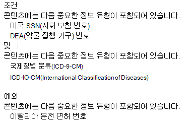

# 데이터 손실 방지 정책 참조

DLP(데이터 손실 방지) 정책에는 구성할 수 있는 많은 구성 요소가 있습니다. 효과적인 정책을 만들 수 있도록 각 구성 요소의 용도와 구성으로 정책의 동작을 변경하는 방법을 이해해야 합니다. 이 문서에서는 DLP 정책에 대한 자세한 설명을 제공 합니다.

## 정책 템플릿 

DLP 정책 템플릿은 다음 네 가지 범주로 미리 정렬됩니다.

- 재무 정보 유형을 감지하고 보호할 **수 있는 정보**
- 의료 및 건강 정보 유형을 감지하고 보호할 **수 있는 정보**
- 개인 정보 유형을 검색하고 보호할 **수 있는** 정보 보호
- 다른 **사용자 지정** 템플릿 중 하나에서 조직의 요구 사항을 충족하지 않는 경우 자체 정책을 빌드하는 데 사용할 수 있는 사용자 지정 템플릿입니다.

이 표에는 모든 정책 템플릿 및 해당 템플릿이 다루는 SIT(중요한 정보 유형)가 나열됩니다. 

2021년 6월 23일 현재

|범주| 서식 파일 | SIT |
|---------|---------|---------|
|금융| 호주 재무 데이터| - [SWIFT 코드](sensitive-information-type-entity-definitions.md#swift-code)   - [오스트레일리아 세금 파일 번호](sensitive-information-type-entity-definitions.md#australia-tax-file-number)   - [호주 은행 계좌 번호](sensitive-information-type-entity-definitions.md#australia-bank-account-number)   - [신용 카드 번호](sensitive-information-type-entity-definitions.md#credit-card-number)|
|금융| 캐나다 재무 데이터 |- [신용 카드 번호](sensitive-information-type-entity-definitions.md#credit-card-number)   -  [캐나다 은행 계좌 번호](sensitive-information-type-entity-definitions.md#canada-bank-account-number)|
|금융| 프랑스 재무 데이터 |- [신용 카드 번호](sensitive-information-type-entity-definitions.md#credit-card-number)   - [유럽 직불 카드 번호](sensitive-information-type-entity-definitions.md#eu-debit-card-number)|
|금융| 독일 재무 데이터 |- [신용 카드 번호](sensitive-information-type-entity-definitions.md#credit-card-number)   - [유럽 직불 카드 번호](sensitive-information-type-entity-definitions.md#eu-debit-card-number)|
|금융| 이스라엘 재무 데이터 |- [이스라엘 은행 계좌 번호](sensitive-information-type-entity-definitions.md#israel-bank-account-number)   - [SWIFT 코드](sensitive-information-type-entity-definitions.md#swift-code)   - [신용 카드 번호](sensitive-information-type-entity-definitions.md#credit-card-number)|
|금융| 일본 재무 데이터 |- [일본 은행 계좌 번호](sensitive-information-type-entity-definitions.md#japan-bank-account-number)   - [신용 카드 번호](sensitive-information-type-entity-definitions.md#credit-card-number)|
|금융| PCI DSS(PCI Data Security Standard)|- [신용 카드 번호](sensitive-information-type-entity-definitions.md#credit-card-number)|
|금융| 사우디아라비아 사이버 범죄 방지법|- [SWIFT 코드](sensitive-information-type-entity-definitions.md#swift-code)   - [IBAN(국제 은행 계좌 번호)](sensitive-information-type-entity-definitions.md#international-banking-account-number-iban) |
|금융| 사우디 아라비아 재무 데이터 |- [신용 카드 번호](sensitive-information-type-entity-definitions.md#credit-card-number)   - [SWIFT 코드](sensitive-information-type-entity-definitions.md#swift-code)   - [IBAN(국제 은행 계좌 번호)](sensitive-information-type-entity-definitions.md#international-banking-account-number-iban)|
|금융| 영국 재무 데이터|- [신용 카드 번호](sensitive-information-type-entity-definitions.md#credit-card-number)   - [유럽 직불 카드 번호](sensitive-information-type-entity-definitions.md#eu-debit-card-number)   - [SWIFT 코드](sensitive-information-type-entity-definitions.md#swift-code)|
|금융| 미국 재무 데이터|- [신용 카드 번호](sensitive-information-type-entity-definitions.md#credit-card-number)   - [미국 은행 계좌 번호](sensitive-information-type-entity-definitions.md#us-bank-account-number)  - [ABA 라우팅 번호](sensitive-information-type-entity-definitions.md#aba-routing-number)|
|금융| 미국 FTC(Federal Trade Commission) 소비자 규약|- [신용 카드 번호](sensitive-information-type-entity-definitions.md#credit-card-number)   - [미국 은행 계좌 번호](sensitive-information-type-entity-definitions.md#us-bank-account-number)  - [ABA 라우팅 번호](sensitive-information-type-entity-definitions.md#aba-routing-number)|
|금융| 미국 GLBA(Gramm-Leach-Bliley Act) 고급|- [신용 카드 번호](sensitive-information-type-entity-definitions.md#credit-card-number)   - [미국 은행 계좌 번호](sensitive-information-type-entity-definitions.md#us-bank-account-number)  - [미국 ITIN(개인 납세자 번호)](sensitive-information-type-entity-definitions.md#us-individual-taxpayer-identification-number-itin)    - [미국 SSN(사회 보장 번호)](sensitive-information-type-entity-definitions.md#us-social-security-number-ssn)  - [미국/영국 여권 번호](sensitive-information-type-entity-definitions.md#us--uk-passport-number)   -[미국 운전 면허 번호](sensitive-information-type-entity-definitions.md#us-drivers-license-number)|
|금융| 미국 GLBA(Gramm-Leach-Bliley Act)|- [신용 카드 번호](sensitive-information-type-entity-definitions.md#credit-card-number)   - [미국 은행 계좌 번호](sensitive-information-type-entity-definitions.md#us-bank-account-number)  - [미국 ITIN(개인 납세자 번호)](sensitive-information-type-entity-definitions.md#us-individual-taxpayer-identification-number-itin)    - [미국 SSN(사회 보장 번호)](sensitive-information-type-entity-definitions.md#us-social-security-number-ssn)|
|의료 및 건강| HRIP Act(호주 보건 기록법) 강화 |- [오스트레일리아 세금 파일 번호](sensitive-information-type-entity-definitions.md#australia-tax-file-number)   - [오스트레일리아 의료 계좌 번호](sensitive-information-type-entity-definitions.md#australia-medical-account-number)|
|의료 및 건강| 호주 HRIP Act(Health Records Act)|- [오스트레일리아 세금 파일 번호](sensitive-information-type-entity-definitions.md#australia-tax-file-number)   - [오스트레일리아 의료 계좌 번호](sensitive-information-type-entity-definitions.md#australia-medical-account-number)|
|의료 및 건강| 캐나다 HIA(Health Information Act) |- [캐나다 여권 번호](sensitive-information-type-entity-definitions.md#canada-passport-number)  - [캐나다 사회 보험 번호](sensitive-information-type-entity-definitions.md#canada-social-insurance-number)   - [캐나다 보건 서비스 번호](sensitive-information-type-entity-definitions.md#canada-health-service-number)   - [캐나다 개인 건강 식별 번호](sensitive-information-type-entity-definitions.md#canada-personal-health-identification-number-phin)|
|의료 및 건강| 캐나다 PHIA(Personal Health Information Act) 매니토바|- [캐나다 사회 보험 번호](sensitive-information-type-entity-definitions.md#canada-social-insurance-number)   - [캐나다 보건 서비스 번호](sensitive-information-type-entity-definitions.md#canada-health-service-number)   - [캐나다 개인 건강 식별 번호](sensitive-information-type-entity-definitions.md#canada-personal-health-identification-number-phin)|
|의료 및 건강| 캐나다 PHIPA(Personal Health Act) Ontario |- [캐나다 여권 번호](sensitive-information-type-entity-definitions.md#canada-passport-number)  - [캐나다 사회 보험 번호](sensitive-information-type-entity-definitions.md#canada-social-insurance-number)   - [캐나다 보건 서비스 번호](sensitive-information-type-entity-definitions.md#canada-health-service-number)   - [캐나다 개인 건강 식별 번호](sensitive-information-type-entity-definitions.md#canada-personal-health-identification-number-phin)|
|의료 및 건강| 영국 의료 보고 접근 규제법|- [영국 보건 서비스 번호](sensitive-information-type-entity-definitions.md#uk-national-health-service-number)   - [영국 NINO(국가 보험 번호)](sensitive-information-type-entity-definitions.md#uk-national-insurance-number-nino)|
|의료 및 건강| 미국 HIPAA(Health Insurance Act) 고급|  - [국제적인 병 분류(ICD-9-CM)](sensitive-information-type-entity-definitions.md#international-classification-of-diseases-icd-9-cm)   - [국제질병 분류(ICD-10-CM)](sensitive-information-type-entity-definitions.md#international-classification-of-diseases-icd-10-cm) |
|의료 및 건강| 미국 HIPAA(Health Insurance Act)| - [국제적인 병 분류(ICD-9-CM)](sensitive-information-type-entity-definitions.md#international-classification-of-diseases-icd-9-cm)   - [국제질병 분류(ICD-10-CM)](sensitive-information-type-entity-definitions.md#international-classification-of-diseases-icd-10-cm)|
|개인 정보| 호주 개인 정보 보호법 강화|- [호주 운전 면허 번호](sensitive-information-type-entity-definitions.md#australia-drivers-license-number)   - [호주 여권 번호](sensitive-information-type-entity-definitions.md#australia-passport-number)|
|개인 정보| 호주 개인 정보 보호법|- [호주 운전 면허 번호](sensitive-information-type-entity-definitions.md#australia-drivers-license-number)   - [호주 여권 번호](sensitive-information-type-entity-definitions.md#australia-passport-number)|
|개인 정보| 호주 PII(개인 식별 정보) 데이터|- [오스트레일리아 세금 파일 번호](sensitive-information-type-entity-definitions.md#australia-tax-file-number)   - [호주 운전 면허 번호](sensitive-information-type-entity-definitions.md#australia-drivers-license-number)|
|개인 정보| 캐나다 PII(개인 식별 정보) 데이터|- [캐나다 운전 면허 번호](sensitive-information-type-entity-definitions.md#canada-drivers-license-number)  - [캐나다 은행 계좌 번호](sensitive-information-type-entity-definitions.md#canada-bank-account-number)   - [캐나다 여권 번호](sensitive-information-type-entity-definitions.md#canada-passport-number)  - [캐나다 사회 보험 번호](sensitive-information-type-entity-definitions.md#canada-social-insurance-number)   - [캐나다 보건 서비스 번호](sensitive-information-type-entity-definitions.md#canada-health-service-number)   - [캐나다 개인 건강 식별 번호](sensitive-information-type-entity-definitions.md#canada-personal-health-identification-number-phin)|
|개인 정보| 캐나다 PIPA(Personal Information Protection Act)|- [캐나다 여권 번호](sensitive-information-type-entity-definitions.md#canada-passport-number)  - [캐나다 사회 보험 번호](sensitive-information-type-entity-definitions.md#canada-social-insurance-number)   - [캐나다 보건 서비스 번호](sensitive-information-type-entity-definitions.md#canada-health-service-number)   - [캐나다 개인 건강 식별 번호](sensitive-information-type-entity-definitions.md#canada-personal-health-identification-number-phin)|
|개인 정보| 캐나다 PIPEDA(Personal Information Protection Act)|- [호주 여권 번호](sensitive-information-type-entity-definitions.md#australia-passport-number)   [캐나다 운전 면허 번호](sensitive-information-type-entity-definitions.md#canada-drivers-license-number)   - [캐나다 은행 계좌 번호](sensitive-information-type-entity-definitions.md#canada-bank-account-number)   - [캐나다 여권 번호](sensitive-information-type-entity-definitions.md#canada-passport-number)  - [캐나다 사회 보험 번호](sensitive-information-type-entity-definitions.md#canada-social-insurance-number)   - [캐나다 보건 서비스 번호](sensitive-information-type-entity-definitions.md#canada-health-service-number)   - [캐나다 개인 건강 식별 번호](sensitive-information-type-entity-definitions.md#canada-personal-health-identification-number-phin)|
|개인 정보| 프랑스 데이터 보호법|- [프랑스 국가 ID 카드(CNI)](sensitive-information-type-entity-definitions.md#france-national-id-card-cni)   - [프랑스 사회 보장 번호(INSEE)](sensitive-information-type-entity-definitions.md#france-social-security-number-insee)|
|개인 정보| 프랑스 PII(개인 식별 정보) 데이터|- [프랑스 사회 보장 번호(INSEE)](sensitive-information-type-entity-definitions.md#france-social-security-number-insee)   - [프랑스 운전 면허 번호](sensitive-information-type-entity-definitions.md#france-drivers-license-number)   - [프랑스 여권 번호](sensitive-information-type-entity-definitions.md#france-passport-number)   - [프랑스 국가 ID 카드(CNI)](sensitive-information-type-entity-definitions.md#france-national-id-card-cni)|
|개인 정보| GDPR(일반 데이터 보호 규정) 강화|- [유럽 직불 카드 번호](sensitive-information-type-entity-definitions.md#eu-debit-card-number)   - [EU 운전 면허 번호](sensitive-information-type-entity-definitions.md#eu-drivers-license-number)   - [EU 국가 ID 번호](sensitive-information-type-entity-definitions.md#eu-national-identification-number)   - [EU 여권 번호](sensitive-information-type-entity-definitions.md#eu-passport-number)   - [EU 사회 보장 번호 또는 동등한 식별](sensitive-information-type-entity-definitions.md#eu-social-security-number-or-equivalent-identification)   - [EU 세금 식별 번호](sensitive-information-type-entity-definitions.md#eu-tax-identification-number)| 
|개인 정보| 일반 데이터 보호 규정(GDPR)|- [유럽 직불 카드 번호](sensitive-information-type-entity-definitions.md#eu-debit-card-number)   - [EU 운전 면허 번호](sensitive-information-type-entity-definitions.md#eu-drivers-license-number)   - [EU 국가 ID 번호](sensitive-information-type-entity-definitions.md#eu-national-identification-number)  - [EU 여권 번호](sensitive-information-type-entity-definitions.md#eu-passport-number)   - [EU 사회 보장 번호 또는 동등한 식별](sensitive-information-type-entity-definitions.md#eu-social-security-number-or-equivalent-identification)  - [EU 세금 식별 번호](sensitive-information-type-entity-definitions.md#eu-tax-identification-number)|
|개인 정보| 독일 PII(개인 식별 정보) 데이터|- [독일 운전 면허 번호](sensitive-information-type-entity-definitions.md#germany-drivers-license-number)   - [독일 여권 번호](sensitive-information-type-entity-definitions.md#germany-passport-number)| 
|개인 정보| 이스라엘 PII(개인 식별 정보) 데이터|- [이스라엘 국가 ID 번호](sensitive-information-type-entity-definitions.md#israel-national-identification-number)| 
|개인 정보| 이스라엘 개인 정보 보호|- [이스라엘 국가 ID 번호](sensitive-information-type-entity-definitions.md#israel-national-identification-number)  - [이스라엘 은행 계좌 번호](sensitive-information-type-entity-definitions.md#israel-bank-account-number)|
|개인 정보| 일본 PII(개인 식별 정보) 데이터 향상|- [일본 SIN(사회 보험 번호)](sensitive-information-type-entity-definitions.md#japan-social-insurance-number-sin)  - [일본 내 번호 - 개인](sensitive-information-type-entity-definitions.md#japan-my-number---personal)  - [일본 여권 번호](sensitive-information-type-entity-definitions.md#japan-passport-number)  - [일본 운전 면허 번호](sensitive-information-type-entity-definitions.md#japan-drivers-license-number)|
|개인 정보| 일본 PII(개인 식별 정보) 데이터|- [일본 거주 등록 번호](sensitive-information-type-entity-definitions.md#japan-resident-registration-number)   - [일본 SIN(사회 보험 번호)](sensitive-information-type-entity-definitions.md#japan-social-insurance-number-sin)|
|개인 정보| 일본 개인 정보 보호 강화|- [일본 SIN(사회 보험 번호)](sensitive-information-type-entity-definitions.md#japan-social-insurance-number-sin)   - [일본 내 번호 - 개인](sensitive-information-type-entity-definitions.md#japan-my-number---personal)  - [일본 여권 번호](sensitive-information-type-entity-definitions.md#japan-passport-number)   - [일본 운전 면허 번호](sensitive-information-type-entity-definitions.md#japan-drivers-license-number)| 
|개인 정보| 일본 개인 정보 보호|- [일본 거주 등록 번호](sensitive-information-type-entity-definitions.md#japan-resident-registration-number)  - [일본 SIN(사회 보험 번호)](sensitive-information-type-entity-definitions.md#japan-social-insurance-number-sin)|
|개인 정보| 사우디아라비아 PII(개인 식별 가능) 데이터|- [사우디아라비아 국가 ID](sensitive-information-type-entity-definitions.md#saudi-arabia-national-id)|
|개인 정보| 영국 데이터 보호법|- [영국 NINO(국가 보험 번호)](sensitive-information-type-entity-definitions.md#uk-national-insurance-number-nino)   - [미국/영국 여권 번호](sensitive-information-type-entity-definitions.md#us--uk-passport-number)   - [SWIFT 코드](sensitive-information-type-entity-definitions.md#swift-code)|
|개인 정보| 영국 개인 정보 보호 및 전자 통신 규정|- [SWIFT 코드](sensitive-information-type-entity-definitions.md#swift-code)|
|개인 정보| 영국 PII(개인 식별 정보) 데이터|- [영국 NINO(국가 보험 번호)](sensitive-information-type-entity-definitions.md#uk-national-insurance-number-nino)   - [미국/영국 여권 번호](sensitive-information-type-entity-definitions.md#us--uk-passport-number)|
|개인 정보| 영국 PIOCP(Personal Information Online Code of Practice)|- [영국 NINO(국가 보험 번호)](sensitive-information-type-entity-definitions.md#uk-national-insurance-number-nino)   - [영국 보건 서비스 번호](sensitive-information-type-entity-definitions.md#uk-national-health-service-number)   - [SWIFT 코드](sensitive-information-type-entity-definitions.md#swift-code)|
|개인 정보| 미국 애국법 강화|- [신용 카드 번호](sensitive-information-type-entity-definitions.md#credit-card-number)   - [미국 은행 계좌 번호](sensitive-information-type-entity-definitions.md#us-bank-account-number)  - [미국 ITIN(개인 납세자 번호)](sensitive-information-type-entity-definitions.md#us-individual-taxpayer-identification-number-itin)    - [미국 SSN(사회 보장 번호)](sensitive-information-type-entity-definitions.md#us-social-security-number-ssn)|
|개인 정보| 미국 애국법|- [신용 카드 번호](sensitive-information-type-entity-definitions.md#credit-card-number)   - [미국 은행 계좌 번호](sensitive-information-type-entity-definitions.md#us-bank-account-number)  - [미국 ITIN(개인 납세자 번호)](sensitive-information-type-entity-definitions.md#us-individual-taxpayer-identification-number-itin)    - [미국 SSN(사회 보장 번호)](sensitive-information-type-entity-definitions.md#us-social-security-number-ssn)|
|개인 정보| 미국 PII(개인 식별 정보) 데이터 향상|- [미국 ITIN(개인 납세자 번호)](sensitive-information-type-entity-definitions.md#us-individual-taxpayer-identification-number-itin)    - [미국 SSN(사회 보장 번호)](sensitive-information-type-entity-definitions.md#us-social-security-number-ssn)  - [미국/영국 여권 번호](sensitive-information-type-entity-definitions.md#us--uk-passport-number)|
|개인 정보| 미국 PII(개인 식별 정보) 데이터|- [미국 ITIN(개인 납세자 번호)](sensitive-information-type-entity-definitions.md#us-individual-taxpayer-identification-number-itin)    - [미국 SSN(사회 보장 번호)](sensitive-information-type-entity-definitions.md#us-social-security-number-ssn)  - [미국/영국 여권 번호](sensitive-information-type-entity-definitions.md#us--uk-passport-number)|
|개인 정보| 미국 주 위반 알림법 강화|- [신용 카드 번호](sensitive-information-type-entity-definitions.md#credit-card-number)   - [미국 은행 계좌 번호](sensitive-information-type-entity-definitions.md#us-bank-account-number)  -[미국 운전 면허 번호](sensitive-information-type-entity-definitions.md#us-drivers-license-number)   - [미국 SSN(사회 보장 번호)](sensitive-information-type-entity-definitions.md#us-social-security-number-ssn)   - [미국/영국 여권 번호](sensitive-information-type-entity-definitions.md#us--uk-passport-number)|
|개인 정보| 미국 개인 정보 침해 고지법|- [신용 카드 번호](sensitive-information-type-entity-definitions.md#credit-card-number)   - [미국 은행 계좌 번호](sensitive-information-type-entity-definitions.md#us-bank-account-number)  -[미국 운전 면허 번호](sensitive-information-type-entity-definitions.md#us-drivers-license-number)   - [미국 SSN(사회 보장 번호)](sensitive-information-type-entity-definitions.md#us-social-security-number-ssn)|
|개인 정보| 미국 사회 보장 번호 기밀 유지법|- [미국 SSN(사회 보장 번호)](sensitive-information-type-entity-definitions.md#us-social-security-number-ssn)| 

## 위치

<!--This section covers a mapping of data-at-rest, data-in-use, and data-in-motion to the locations/workloads. It introduces the idea that the options that are selected here have a direct impact on the UI that they will encounter further along in the policy creation/edit flow. It will also cover the dependencies between locations (eg. Teams chat and channel requires SharePoint and ODB). It will also include the impact of the different scope settings. eg. If you want the policy to be applied to DEF, but not HIJ, you should configure your include/exclude scopes like this......--> 

DLP 정책은 여러 위치에서 중요한 정보가 포함된 항목을 찾아 보호할 수 있습니다.

|위치  |범위 포함/제외  |데이터 상태  |추가 사전 필요 |
|---------|---------|---------|---------|
|Exchange 전자 메일 보내기 |distribution group(메일 그룹) | 데이터 동작| 아니요 |
|SharePoint 사이트   |사이트       | 데이터 저장   데이터 사용 중 | 아니요|
|비즈니스용 OneDrive 계정| 계정 또는 메일 그룹 |데이터 저장   데이터 사용 중|아니요|
|Teams 채팅 및 채널 메시지     | 계정 또는 메일 그룹 |데이터 동작   데이터 사용 중 |  아니요       |
|Microsoft Cloud App Security(MCAS)   | 클라우드 앱 인스턴스       |데이터 저장         | - [Microsoft가 아닌 클라우드 앱에 데이터 손실 방지 정책 사용](dlp-use-policies-non-microsoft-cloud-apps.md#use-data-loss-prevention-policies-for-non-microsoft-cloud-apps)        |
|디바이스  |사용자 또는 그룹         |데이터 저장    데이터 사용 중    데이터 동작         |- [끝점 Microsoft 365 손실 방지에 대한 자세한 정보](endpoint-dlp-learn-about.md#learn-about-microsoft-365-endpoint-data-loss-prevention)  - [끝점 데이터 손실 방지 시작](endpoint-dlp-getting-started.md#get-started-with-endpoint-data-loss-prevention)  - [끝점 DLP에 대한 장치 프록시 및 인터넷 연결 설정 구성](endpoint-dlp-configure-proxy.md#configure-device-proxy-and-internet-connection-settings-for-endpoint-dlp)        |
|사내 리포지토리(파일 공유 및 SharePoint)    |repository         | 데이터 저장         | - [데이터 손실 Microsoft 365 스캐너에 대해 자세히 알아보시고](dlp-on-premises-scanner-learn.md#learn-about-the-microsoft-365-data-loss-prevention-on-premises-scanner)   - [데이터 손실 방지 On-premises 스캐너 시작](dlp-on-premises-scanner-get-started.md#get-started-with-the-data-loss-prevention-on-premises-scanner)         |

Exchange에서 특정 메일 그룹을 포함하도록 선택하는 경우 DLP 정책은 해당 그룹의 구성원으로만 제한됩니다. 마찬가지로 메일 그룹을 제외하면 해당 메일 그룹의 모든 구성원이 정책 평가에서 제외됩니다. 메일 그룹의 구성원, 동적 메일 그룹, 보안 그룹에 대한 정책의 범위를 선택할 수 있습니다. DLP 정책에는 50개 이하의 이러한 포함 및 제외가 포함될 수 있습니다.

특정 SharePoint 사이트 또는 OneDrive 계정을 포함하거나 제외하도록 선택하는 경우 DLP 정책은 이러한 포함 항목 및 제외 항목을 100개까지 포함할 수 있습니다. 해당 제한 사항에도 불구하고 조직 전체의 정책이나 전체 위치에 적용되는 정책을 적용하여 해당 제한 사항을 극복할 수 있습니다.

특정 OneDrive 계정 또는 그룹을 포함하거나 제외하도록 선택하는 경우 DLP 정책에는 100개 이상의 사용자 계정 또는 50개 그룹을 포함하거나 제외로 포함할 수 있습니다.

### 콘텐츠를 정의하는 방법에 대한 위치 지원

DLP 정책은 중요한 항목을 SIT(중요한 정보 유형), 민감도 레이블 또는 보존 레이블에 일치하여 검색합니다. 각 위치는 중요한 콘텐츠를 정의하는 다양한 방법을 지원합니다. 또한 정책에서 위치를 결합할 때 콘텐츠를 정의할 수 있는 방식은 단일 위치에서 콘텐츠를 정의하는 방법과 다를 수 있습니다. 

> [!IMPORTANT]
> 정책에 대해 여러 위치를 선택하면 콘텐츠 정의 범주에 대한 "아니요" 값이 "yes" 값보다 우선합니다. 예를 들어 사이트만 SharePoint 경우 정책은 SIT 중 하나 이상, 민감도 레이블 또는 보존 레이블에 따라 중요한 항목 검색을 지원합니다. 그러나 사이트 및 SharePoint 채팅  Teams 메시지 위치를 선택할 경우 정책은 SIT를 통해 중요한 항목 검색만 지원합니다. 

|위치|  SIT를 통해 콘텐츠를 정의할 수 있습니다.|  콘텐츠는 민감도 레이블을 정의할 수 있습니다.|   콘텐츠를 보존 레이블로 정의할 수 있습니다.|
|---------|---------|---------|---------|
|Exchange 전자 메일 보내기|예| 예|    아니요|
|SharePoint 사이트|   예|    예|    예|
|비즈니스용 OneDrive 계정|    예|    예|    예|
|Teams 채팅 및 채널 메시지 |  예|    아니요| 아니요|
|디바이스    |예 |  예|    아니요|
|Microsoft Cloud App Security|  예|    예|    예|
|On-Premises repositories|  예|    예|    아니요|

> [!NOTE]
> DLP는 전자 메일 및 첨부emnet에서 민감도 레이블 검색을 지원함 [DLP](dlp-sensitivity-label-as-condition.md#use-sensitivity-labels-as-conditions-in-dlp-policies) 정책에서 민감도 레이블을 조건으로 사용 참조

## 규칙

<!--This section introduces the classifications of content that, when detected, can be protected. Link out to [Learn about sensitive information types]() and [Sensitive information type entity definitions](sensitive-information-type-entity-definitions.md#sensitive-information-type-entity-definitions) as well as labels (cross referenced by supporting workload). It will touch on the purpose of multiple conditions, confidence levels (link out to [more on confidence levels](sensitive-information-type-learn-about.md#more-on-confidence-levels)) and confidence levels video. How to use the confidence level to change the behavior of a policy in conjunction with the instance count.  eg. if you want your policy to trigger when it encounters situation DEF, set your conditions like HIJ.-->
<!--
- What is a rule in the context of a Policy?
- when and why should I have more than one rule?
- The purpose of rule groups
- How do I tune the behavior of a Policy through the tuning of rules
- what's in a rule-->

규칙은 DLP 정책의 비즈니스 논리입니다. 이러한 구성은 다음으로 구성 있습니다.

- [**일치하는**](#conditions) 경우 정책을 트리거하는 조건
- [**조건에**](#exceptions) 대한 예외
- [**정책이**](#actions) 트리거될 때 수행할 작업
- [**정책을 트리거하는**](#user-notifications-and-policy-tips) 작업을 수행하고 있는 경우 사용자에게 알리고, 사용자가 중요한 정보를 처리하려는 방법을 교육하는 데 도움이 되는 사용자 알림
- [**관리자가 구성한**](#user-overrides) 사용자 다시 설정, 사용자가 차단 작업을 선택적으로 다시 설정하도록 허용
- [**규칙 일치가**](#incident-reports) 발생할 때 관리자 및 기타 주요 이해 관계자에게 알리는 인시던트 보고서
- [**규칙 평가**](#additional-options) 우선 순위를 정의하고 추가 규칙 및 정책 처리를 중지할 수 있는 추가 옵션입니다.

 정책에 하나 이상의 규칙이 포함되어 있습니다. 규칙은 각 정책에서 가장 우선순위가 높은 규칙부터 순차적으로 실행됩니다.

### 규칙이 처리되는 우선 순위

각 규칙에는 규칙이 만들어진 순서대로 우선 순위가 할당됩니다. 즉, 처음 만든 규칙에 첫 번째 우선 순위가 지정됩니다. 두 번째로 만든 규칙의 우선 순위는 두 번째입니다. 
  

콘텐츠를 규칙에 대해 평가할 때 규칙은 우선 순위대로 처리됩니다. 콘텐츠가 여러 규칙과 일치하는 경우 가장 제한적인 작업이 있는 첫 번째 규칙이 적용됩니다. 예를 들어 콘텐츠가 다음과 같은 규칙과 모두 일치하는 경우 우선 순위가 가장 높고 가장 제한적인 규칙 3이 적용됩니다:
  
- 규칙 1: 사용자에게 알리기만 함
- 규칙 2: 사용자에게 알리고, 액세스를 제한하고, 사용자 재정의를 허용함
- 규칙 3: 사용자에게 알리고, 액세스를 제한하고, 사용자 재정의를 허용하지 않음
- 규칙 4: 액세스 제한

규칙 1, 2 및 4는 평가되지만 적용되지 않습니다. 이 예에서는 가장 제한적인 규칙만 적용된 경우에도 모든 규칙에 대한 일치가 감사 로그에 기록되고 DLP 보고서에 표시됩니다.

규칙을 사용하여 특정 보호 요구 사항을 충족한 다음, DLP 정책을 사용하여 특정 규정을 준수하는 데 필요한 모든 규칙과 같은 일반적인 보호 요구 사항을 그룹화할 수 있습니다.
  
예를 들어 HIPAA(Health Insurance Portability and Accountability Act)가 적용되는 정보의 현재 상태를 확인하는 데 도움이 되는 DLP 정책이 있을 수 있습니다. 해당 DLP 정책은 조직 외부의 사용자와 공유(조건)하는 중요한 정보가 포함된 모든 문서를 찾고 문서에 대한 액세스 차단 및 알림을 전송하여(작업) 모든 SharePoint Online 사이트 및 모든 비즈니스용 OneDrive 사이트(위치)에서 HIPAA 데이터(대상)를 보호하는 데 도움을 줄 수 있습니다. 해당 요구 사항은 개별 규칙으로 저장되며 관리 및 보고를 간소화하기 위해 DLP 정책으로 그룹화 됩니다.
  

### 조건

조건은 포괄적이며 규칙에서 찾아야 할 항목 및 해당 항목이 사용되는 컨텍스트를 정의합니다. 이러한 규칙은 &#8212; 항목이 검색될 때 규칙에  알 수 있으며, &#8212; 일치 항목으로 사용 중이면 정책의 나머지 작업을 해당 항목에 대해 수행해야 합니다.  조건을 사용하여 위험 수준마다 다른 작업을 할당할 수 있습니다. 예를 들어 내부적으로 공유하는 중요한 콘텐츠는 조직 외부의 사용자와 공유되는 중요한 콘텐츠 보다 위험성이 더 낮고 더 적은 작업이 필요할 수 있습니다.

> [!NOTE]
> 호스트 조직의 Active Directory 또는 Azure Active Directory 테넌트에 게스트가 아닌 계정을 보유하고 있는 사용자는 조직 내부의 사용자로 간주됩니다. 

#### 콘텐츠 포함

 모든 위치는 콘텐츠 포함 **조건이 지원됩니다.** 각 콘텐츠 형식의 여러 인스턴스를 선택하고 다음 중 **하나(논리** OR) 또는  이러한 모든(논리 AND) 연산자를 사용하여 조건을 세분화할 수 있습니다.

- [중요한 정보 유형](sensitive-information-type-learn-about.md#learn-about-sensitive-information-types)
- [민감도 레이블](sensitivity-labels.md)
- [보존 레이블](retention.md#using-a-retention-label-as-a-condition-in-a-dlp-policy)

정책을 적용하기로 선택한 위치에 따라 다를 수 있습니다.  

SITS에는 필요한 경우 변경할 수 [**있는**](https://www.microsoft.com/videoplayer/embed/RE4Hx60) 미리 정의된 신뢰 수준이 있습니다. 자세한 내용은 신뢰 [수준에 대한 자세한 정보를 참조하세요.](sensitive-information-type-learn-about.md#more-on-confidence-levels) 또한 SITS에는 규칙과 일치하기 위해 찾아야 하는 SIT 발생 범위가 미리 정의되어 있습니다. 예를 들어 인스턴스 수 범위가 1에서 9까지로 설정된 경우 규칙이 일치하려면 SIT가 한 번 이상 최대 9번까지 발생해야 합니다. 

이 규칙은 선택된 민감도  레이블 및 보존 레이블의 **존재만** 봐야 합니다. 

#### 조건 컨텍스트

사용 가능한 컨텍스트 옵션은 선택한 위치에 따라 변경됩니다. 여러 위치를 선택하는 경우 위치에 공통된 조건만 사용할 수 있습니다.

##### 다음 Exchange 지원되는 조건:

- 콘텐츠 포함
- 콘텐츠가 공유되는 Microsoft 365
- 콘텐츠 수신
- 보낸 사람 IP 주소는
- 보낸 사람이 정책 팁을 다시 정해 두었기
- 보낸 사람은
- 보낸 사람 도메인은
- 보낸 사람 주소에 단어 포함
- 보낸 사람 주소에 패턴 포함
- 보낸 사람 AD 특성에 단어 또는 구가 포함되어 있습니다.
- 보낸 사람 AD 특성이 패턴 일치
- 보낸 사람이 다음의 구성원인 경우
- 전자 메일 첨부 파일의 콘텐츠를 검사할 수 없음
- 전자 메일 첨부 파일 내용의 검사가 완료되지 않음
- 첨부 파일이 암호로 보호됨
- 파일 확장명은
- 받는 사람이 다음의 구성원인 경우
- 받는 사람 도메인은
- 받는 사람은
- 받는 사람 주소에 단어가 포함되어 있음
- 받는 사람 주소가 패턴과 일치
- 받는 사람 AD 특성에 단어 또는 구가 포함되어 있습니다.
- 받는 사람 AD 특성이 패턴 일치
- 문서 이름에 단어 또는 구가 포함되어 있습니다.
- 문서 이름이 패턴과 일치
- 문서 속성은
- 문서 크기가 같거나 보다 크거나 같은 경우
- 문서 콘텐츠에 단어 또는 구가 포함되어 있습니다.
- 문서 콘텐츠 일치 패턴
- 제목에 단어 또는 구가 포함되어 있습니다.
- 제목이 패턴과 일치
- 제목 또는 본문에 단어 또는 구가 포함되어 있습니다.
- 제목 또는 본문이 패턴과 일치
- 콘텐츠 문자 집합에 단어 포함
- 헤더에 단어 또는 구가 포함되어 있습니다.
- 헤더가 패턴과 일치
- 메시지 크기가 같거나 보다 크기
- 메시지 유형은
- 메시지 중요도

##### 지원 SharePoint 조건
 
- 콘텐츠 포함
- 콘텐츠가 공유되는 Microsoft 365
- 파일 확장명은
- 문서 속성은

##### 계정 OneDrive 지원 조건

- 콘텐츠 포함
- 콘텐츠가 공유되는 Microsoft 365
- 파일 확장명은
- 문서 속성은

##### 채팅 Teams 채널 메시지 지원에 대한 조건

- 콘텐츠 포함
- 콘텐츠가 공유되는 Microsoft 365
- 보낸 사람이 (미리 보기)
- 보낸 사람 도메인이 (미리 보기)
- 받는 사람 도메인이 (미리 보기)
- 받는 사람이 (미리 보기)

##### 장치가 지원하는 조건

- 콘텐츠에 포함된 내용
- 모니터링하고 조치를 취할 수 있는 [끝점 활동을 참조](endpoint-dlp-learn-about.md#endpoint-activities-you-can-monitor-and-take-action-on)

##### 지원 Microsoft Cloud App Security 조건

- 콘텐츠 포함
- 콘텐츠가 공유되는 Microsoft 365

##### 사내 리포지토리

- 콘텐츠 포함
- 파일 확장명은
- 문서 속성은

#### 조건 그룹

단일 SIT로 정의된 미국 사회 보장 번호가 포함된 모든 콘텐츠와 같이 한 가지만 식별하는 규칙이 필요한 경우도 있습니다. 그러나 식별하려는 항목 유형이 더 복잡하여 정의하기 어렵게 하는 대부분의 시나리오에서는 조건을 정의하는 데 더 많은 유연성이 필요합니다.

예를 들어 미국 HIPAA(Health Insurance Portability and Accountability Act)를 적용받는 콘텐츠를 식별하려면 다음과 같은 정보를 찾아야 합니다:
  
- 미국 사회보장번호 또는 DEA(마약단속국) 번호와 같은 특정 유형의 중요한 정보를 포함하는 콘텐츠
    
    그리고
    
- 환자의 병력에 관한 커뮤니케이션 또는 환자에게 제공된 의료 서비스에 대한 설명과 같이 식별하기 더 어려운 콘텐츠 해당 콘텐츠를 식별하려면 국제질병분류(ICD-9-CM 또는 ICD-10-CM)처럼 아주 방대한 키워드 목록에서 일치하는 키워드가 필요합니다.
    
조건을 그룹화하고 그룹 간에 AND,OR(논리 연산자)를 사용하여 이러한 유형의 데이터를 식별할 수 있습니다.
    
미국 **HIPPA(Health Insurance Act)의** 경우 조건은 다음으로 그룹화됩니다.

첫 번째 그룹에는 식별 및 개인을 식별하는 SITS가 포함되어 있으며 두 번째 그룹에는 의료 진단을 식별하는 SITS가 포함되어 있습니다.

### 예외

규칙에서 예외는 정책에서 항목을 제외하는 데 사용되는 조건을 정의합니다. 포괄 조건 및 컨텍스트 이후에 평가되는 논리적 배타적 조건입니다. 이러한 규칙은 &#8212; 항목이 일치하는 항목과 같은  것으로 사용 중이면 규칙에 알려 주며, 정책의 나머지 작업은 ...가 일치하는 경우를 제외하고 해당 항목에 대해 &#8212;  

예를 들어 HIPPA 정책을 유지하면 다음과 같이 벨기에 드라이버 라이선스 번호가 포함된 항목을 제외하도록 규칙을 수정할 수 있습니다.

위치에서 지원되는 예외 조건은 모든 포함 조건과 동일합니다. 단, 지원되는 각 조건에 대해 "If 제외"의 보류 중 유일한 차이점이 있습니다.

모든 위치에서 포괄 조건을 지원하는 경우와 같습니다.

- 콘텐츠 포함

예외는 다음입니다.

- **콘텐츠에 포함된** 경우 제외 

### 작업 

포함 ***** 조건 _ 및 배타적 예외 _**_ 필터를 통해 항목을 _**_ 만드는 항목에는 규칙에 정의된 작업이 모두 적용됩니다. 작업을 지원하도록 필요한 옵션을 구성해야 합니다. 예를 들어 _ Exchange 사용하여 액세스 제한을 선택하거나 Microsoft 365 위치 *** 작업에서 콘텐츠를 암호화하는 경우 다음 옵션에서 선택해야 합니다.

- 사용자가 공유 콘텐츠에 액세스하지 SharePoint, OneDrive Teams 차단
    - 모든 사람을 차단합니다. 콘텐츠 소유자, 마지막 수정자 및 사이트 관리자만 계속 액세스할 수 있습니다.
    - 조직 외부의 사용자만 차단합니다. 조직 내부 사용자는 계속 액세스할 수 있습니다.
- 전자 메일 메시지 암호화(Exchange의 콘텐츠에만 적용)

규칙에서 사용할 수 있는 작업은 선택한 위치에 따라 달라집니다. 정책을 적용할 위치를 하나만 선택하면 사용 가능한 작업이 아래에 나열됩니다.

> [!IMPORTANT]
> SharePoint Online 및 비즈니스용 OneDrive 위치의 경우 문서가 공유 여부에 관계 없는 모든 외부 사용자에 대해 문서가 검색된 직후에 내부 사용자가 문서에 계속 액세스할 수 있도록 차단됩니다.

#### Exchange 위치 작업:

- 액세스 제한 또는 콘텐츠 암호화 위치의 Microsoft 365 암호화
- 헤더 설정
- 헤더 제거
- 메시지를 특정 사용자로 리디렉션
- 승인을 위해 보낸 사람 관리자에게 메시지 전달
- 특정 승인자에 대한 승인을 위해 메시지 전달
- 받는 사람 상자에 받는 사람 추가
- Cc 상자에 받는 사람 추가
- Bcc 상자에 받는 사람 추가
- 보낸 사람의 관리자를 받는 사람으로 추가
- 제거된 O365 메시지 암호화 및 권한 보호
- 전자 메일 제목 추가
- HTML 고지 조항 추가

#### SharePoint 사이트 위치 작업:

- 액세스 제한 또는 콘텐츠 암호화 위치의 Microsoft 365 암호화

#### OneDrive 계정 위치:

- 액세스 제한 또는 콘텐츠 암호화 위치의 Microsoft 365 암호화

#### Teams 채팅 및 채널 메시지

- 액세스 제한 또는 콘텐츠 암호화 위치의 Microsoft 365 암호화

#### 장치:

- 디바이스에서 활동 Windows 감사 또는 제한

> [!NOTE]
> 장치는 활동 **감사,** 활동 차단 또는 활동  에 대한 금지 옵션을 제공합니다. 

장치 위치는 다양한 하위 활동(조건) 및 작업을 제공합니다. 자세한 내용은 모니터링하고 작업을 수행 할 수 있는 [끝점 활동을 참조합니다.](endpoint-dlp-learn-about.md#endpoint-activities-you-can-monitor-and-take-action-on) 

#### Microsoft Cloud App Security:

- 액세스 제한 또는 콘텐츠 암호화 위치의 Microsoft 365 암호화
- 타사 앱 제한

#### On-premises repositories:

- 액세스 제한 또는 사내 파일 제거

#### 위치를 결합할 때 사용할 수 있는 작업

정책을 적용할 Exchange 위치 및 다른 단일 위치를 선택하는 경우

- 액세스 제한 또는 콘텐츠 암호화 위치의 Microsoft 365 암호화

및

- 비영리 위치의 Exchange 작업

작업을 사용할 수 있습니다.

정책이 적용될 비보안 Exchange 선택된 경우

- 액세스 제한 또는 콘텐츠 암호화 위치의 Microsoft 365 암호화

그리고

- 비보안 위치에 대한 Exchange 작업 

작업을 사용할 수 있습니다.

예를 들어 Exchange 디바이스를 위치로 선택하면 다음 작업을 사용할 수 있습니다.

- 액세스 제한 또는 콘텐츠 암호화 위치의 Microsoft 365 암호화
- 디바이스에서 활동 Windows 감사 또는 제한

장치를 선택하고 Microsoft Cloud App Security 다음 작업을 사용할 수 있습니다.

- 액세스 제한 또는 콘텐츠 암호화 위치의 Microsoft 365 암호화
- 디바이스에서 활동 Windows 감사 또는 제한
- 타사 앱 제한

작업이 적용될지 여부는 정책 모드를 구성하는 방법에 따라 결정됩니다. 첫 번째로 테스트 옵션을 선택하여 정책 팁을 표시하거나 표시하지 않고 테스트 모드에서 **정책을 실행할 수** 있습니다. 정책을 만든 후 1시간이 지나자마자 바로 켜기 옵션을 선택하여 정책을 실행하거나, 나중에 보관 옵션을 선택하여 정책을 저장하고 나중에 돌아오게 선택할 수 **있습니다.**  

<!-- This section needs to explain that the actions available depend on the locations selected AND that the observed behavior of a policy is produced through an interaction of the configured actions AND the configured status (off, test, apply) of a policy. It will detail the purpose of each of the available actions and the location/desired outcome interaction and provide examples eg. how to use the Restrict Third Party apps in the context of a policy that is applied to endpoints so that users can't use a upload content to a third party site or the interaction of on-premises scanner with restrict access or remove on-premises files.  Also what happens when I select multiple locations? provide abundant examples for most common scenarios-->

### 사용자 알림 및 정책 팁

<!--This section introduces the business need for user notifications, what they are, their benefit, how to use them, how to customize them, and links out to 

- https://docs.microsoft.com/en-us/microsoft-365/compliance/use-notifications-and-policy-tips?view=o365-worldwide
- https://docs.microsoft.com/en-us/microsoft-365/compliance/dlp-policy-tips-reference?view=o365-worldwide

for where they are used/expected behavior-->

<!--You can use notifications and overrides to educate your users about DLP policies and help them remain compliant without blocking their work. For example, if a user tries to share a document containing sensitive information, a DLP policy can both send them an email notification and show them a policy tip in the context of the document library that allows them to override the policy if they have a business justification.-->

사용자가 규칙의 조건 및 예외를 충족하는 컨텍스트에서 중요한 항목에 대한 작업을 시도하면 사용자 알림 전자 메일 및 컨텍스트 정책 팁 팝업을 통해 해당 항목에 대해 알 수 있습니다. 이러한 알림은 인식을 높이고 조직의 DLP 정책에 대해 교육하는 데 도움이 됐기 때문에 유용합니다. 

예를 들어 PII(개인 식별 Excel)를 포함하며 외부 사용자와 공유되는 비즈니스용 OneDrive 사이트의 비즈니스용 OneDrive 통합 문서와 같은 콘텐츠입니다.

> [!NOTE]
> 알림 전자 메일은 보호되지 않은 것으로 전송됩니다.

또한 유효한 업무상 필요한 경우나 정책이 가짓 긍정을 감지하는 경우 차단되지 않을 수 있도록 정책을 다시 설정하는 옵션을 사용자들에게 제공 할 수 있습니다.

사용자 알림 및 정책 팁 구성 옵션은 선택한 모니터링 위치에 따라 다릅니다. 선택한 경우:

- Exchange
- SharePoint
- OneDrive
- Teams 채팅 및 채널
- MCAS

다양한 Microsoft 앱에 대한 사용자 알림을 사용 또는 사용하지 않도록 설정할 수 있습니다. 데이터 손실 방지 정책 팁 [참조를 참조하세요.](dlp-policy-tips-reference.md#data-loss-prevention-policy-tips-reference)

- 정책 팁을 사용하여 Office 365 **알림 기능을** 사용하도록 설정하거나 사용하지 않도록 설정할 수 있습니다.
    - 콘텐츠를 전송, 공유 또는 마지막으로 수정한 사용자에게 전자 메일 알림
    - 특정 사용자에게 알림

뿐만 아니라 전자 메일 텍스트, 제목 및 정책 팁 텍스트를 사용자 지정할 수 있습니다.

장치만 선택한 경우 Exchange, SharePoint, OneDrive, Teams 채팅 및 채널 및 MCAS에 사용할 수 있는 모든 옵션과 Windows 10 장치에 나타나는 알림 제목과 콘텐츠를 사용자 지정하는 옵션이 제공됩니다.

  

이러한 매개 변수를 사용하여 텍스트의 제목과 본문을 사용자 지정할 수 있습니다. 본문은 다음을 지원합니다.

|일반 이름  |매개 변수  |예
|---------|---------|---------|
|파일 이름     |%%FileName%% | Contoso doc 1 |
|프로세스 이름     |%%ProcessName%% | Word |
|정책 이름     |%%PolicyName%%| Contoso 높은 기밀 |
|조치 | %%AppliedActions%% | 클립보드에서 다른 앱으로 문서 콘텐츠 붙여넣기 |

**%%AppliedActions%%는** 다음 값을 메시지 본문으로 대체합니다.

|작업 일반 이름 |%%AppliedActions%% 매개 변수로 대체된 값 |
|---------|---------|
|제거할 수 있는 저장소에 복사    |*이동식 저장소에 쓰기*         |
|네트워크 공유에 복사     |*네트워크 공유에 쓰기*         |
|print     |*인쇄*         |
|클립보드에서 붙여넣기  |*클립보드에서 붙여넣기*         |
|bluetooth를 통해 복사   |*전송을 통해 Bluetooth*         |
|사용할 수 없는 앱으로 열기     |*이 앱으로 열기*         |
|RDP(원격 데스크톱)에 복사     |*원격 데스크톱으로 전송*         |
|웹 사이트에 업로드     |*이 사이트에 업로드*         |
|허용되지 않은 브라우저를 통해 항목에 액세스     |*이 브라우저를 사용하여 열기*         |

이 사용자 지정 텍스트 사용

*%%AppliedActions%% File name %%FileName%% via %%ProcessName%% is not allowed by your organization. %%PolicyName%의 정책을 무시하려면 '허용'을 클릭합니다.* 

사용자 지정 알림에서 다음 텍스트를 생성합니다.

*클립보드 파일 이름에서 붙여넣기: 조직에서 WINWORD.EXE Contoso doc 1을 붙여넣을 수 없습니다. Contoso의 높은 기밀 정책을 무시하려면 '허용' 단추를 클릭합니다.*
 

> [!NOTE]
> 사용자 알림 및 정책 팁은 On-premises location에서 사용할 수 없습니다.

> [!NOTE]
> 가장 높은 우선 순위와 가장 제한적인 규칙의 정책 팁만 표시됩니다. 예를 들어 알림을 콘텐츠 액세스를 차단하는 규칙의 정책 팁은 단순히 알림을 보내는 규칙의 정책 팁보다 우선적으로 표시됩니다. 따라서 정책 팁이 단계별로 표시되지는 않습니다.

알림 및 팁 텍스트를 사용자 지정하는 방법을 포함하여 사용자 알림 및 정책 팁 구성 및 사용에 대한 자세한 내용은 다음을 참조합니다. 
- [DLP 정책에 대한 전자 메일 알림 보내기 및 정책 팁 표시](use-notifications-and-policy-tips.md#send-email-notifications-and-show-policy-tips-for-dlp-policies)
  
<!--The email can notify the person who sent, shared, or last modified the content and, for site content, the primary site collection administrator and document owner. In addition, you can add or remove whomever you choose from the email notification.
  
In addition to sending an email notification, a user notification displays a policy tip:
  
- In Outlook and Outlook on the web.
    
- For the document on a SharePoint Online or OneDrive for Business site.
    
- In Excel, PowerPoint, and Word, when the document is stored on a site included in a DLP policy.
    
The email notification and policy tip explain why content conflicts with a DLP policy. If you choose, the email notification and policy tip can allow users to override a rule by reporting a false positive or providing a business justification. This can help you educate users about your DLP policies and enforce them without preventing people from doing their work. Information about overrides and false positives is also logged for reporting (see below about the DLP reports) and included in the incident reports (next section), so that the compliance officer can regularly review this information.
  
Here's what a policy tip looks like in a OneDrive for Business account.
  

 To learn more about user notifications and policy tips in DLP policies, see [Use notifications and policy tips](use-notifications-and-policy-tips.md).

> [!NOTE]
> The default behavior of a DLP policy, when there is no alert configured, is not to alert or trigger. This applies only to default information types. For custom information types, the system will alert even if there is no action defined in the policy.
-->

### 사용자 오버라이드

사용자 무시의 의도는 사용자가 작업을 계속할 수 있도록 Exchange, SharePoint, OneDrive 또는 Teams 중요한 항목에 대한 작업을 차단하는 사명을 사용하여 DLP 정책을 무시할 수 있는 방법을 사용자에게 제공하기 위한 것입니다.  사용자 다시 설정은 정책  팁을 사용하여 Office 365 서비스 사용자에게 알림이 설정된 경우만 사용하도록 설정되어 있으므로 사용자 다시 설정은 알림 및 정책 팁과 함께 사용할 수 있습니다. 

> [!NOTE]
> 사용자 다시 설정은 사내 리포지토리 위치에 사용할 수 없습니다.

일반적으로 사용자 오버라이드는 조직에서 정책을 처음 출시할 때 유용합니다. 모든 의의 정당성 및 가짓 긍정 식별에서 얻게 되는 피드백은 정책을 조정하는 데 도움이 됩니다. 

<!-- This section covers what they are and how to best use them in conjunction with Test/Turn it on right away and link out to where to find the business justification for the override (DLP reports?  https://docs.microsoft.com/en-us/microsoft-365/compliance/view-the-dlp-reports?view=o365-worldwide)  https://docs.microsoft.com/en-us/microsoft-365/compliance/view-the-dlp-reports?view=o365-worldwide#view-the-justification-submitted-by-a-user-for-an-override-->

- 가장 제한적인 규칙의 정책 팁이 사용자의 규칙 재정의를 허용할 경우 이 규칙을 재정의하면 해당 콘텐츠가 일치하는 다른 모든 규칙이 함께 재정의됩니다.
 
<!---->
 
사용자 오버라이드에 대한 자세한 내용은 다음을 참조합니다.

- [사용자가 제출한 정당성에 대한 검토](view-the-dlp-reports.md#view-the-justification-submitted-by-a-user-for-an-override)

### 사고 보고서

<!--DLP interacts with other M365 information protection services, like IR. Link this to a process outline for triaging/managing/resolving DLP incidents

https://docs.microsoft.com/en-us/microsoft-365/compliance/view-the-dlp-reports?view=o365-worldwide
https://docs.microsoft.com/en-us/microsoft-365/compliance/dlp-configure-view-alerts-policies?view=o365-worldwide-->

규칙이 일치하면 규정 준수 책임자(또는 다른 사용자)에게 사고 보고서와 이벤트에 대한 세부 정보를 보낼 수 있습니다. 이 보고서에는 일치된 항목에 관한 정보, 규칙과 일치한 실제 콘텐츠, 해당 콘텐츠를 마지막으로 수정한 사람이 포함됩니다. 전자 메일 메시지의 경우 보고서에는 DLP 정책과 일치하는 원본 메시지가 첨부 파일로 포함되어 있습니다.

DLP는 내부자 위험 관리와 같은 Microsoft 365 정보 보호 서비스에 인시던트 정보를 [Microsoft 365.](insider-risk-management.md#learn-about-insider-risk-management-in-microsoft-365) 인시던트 정보를 내부자 위험 관리에 사용하려면 인시던트 보고서 심각도 수준을 높음으로 설정해야 **합니다.** 

<!---->

활동이 규칙과 일치할 때마다 알림이 전송되는 것을 선택할 수 있습니다. 이 규칙은 매우 시목이 될 수 있습니다. 또는 설정된 기간 동안 일치 횟수 또는 항목의 양에 따라 인시던트 수를 더 적은 경고로 집계할 수 있습니다.

DLP는 SharePoint Online 또는 비즈니스용 OneDrive의 항목과는 다른 방식으로 전자 메일을 검사합니다. SharePoint Online 및 비즈니스용 OneDrive에서 DLP는 기존 항목을 비롯하여 새 항목을 검사하고 일치하는 항목이 발견될 때마다 인시던트 보고서를 생성합니다. Exchange Online에서 DLP는 새 전자 메일 메시지만 검사하고 정책 일치 항목이 있는 경우에 보고서를 생성합니다. DLP는 사서함이나 보관함에 저장된 기존 전자 메일 항목을 검색하거나 일치시키지 ***않습니다.***

### 추가 옵션

정책에 여러 규칙이 있는 경우 추가  옵션을 사용하여 편집할 규칙과 일치하는 경우 추가 규칙 처리를 제어하고 규칙 평가 우선 순위를 설정할 수 있습니다.

## 참고 항목

- [데이터 손실 방지에 대해 알아보기](dlp-learn-about-dlp.md#learn-about-data-loss-prevention)
- [DLP(데이터 손실 방지) 계획](dlp-overview-plan-for-dlp.md#plan-for-data-loss-prevention-dlp)
- [템플릿에서 DLP 정책 만들기](create-a-dlp-policy-from-a-template.md#create-a-dlp-policy-from-a-template)
- [DLP 정책 만들기, 테스트 및 조정](create-test-tune-dlp-policy.md#create-test-and-tune-a-dlp-policy)
