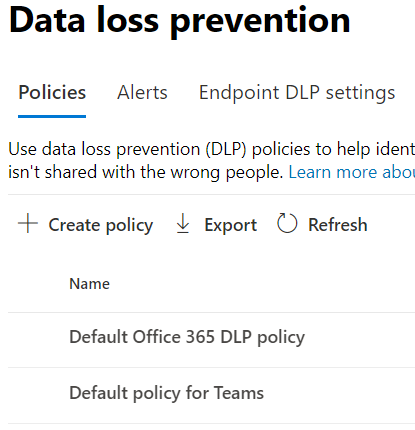

# Microsoft Teams의 기본 데이터 손실 방지 정책에 대한 자세한 정보(미리 보기)Learn about the default data loss prevention policy in Microsoft Teams (preview)

[개인 채널 메시지를](dlp-learn-about-dlp.md) 포함하여 Microsoft Teams 및 채널 메시지를 포함하기 위해 데이터 손실 방지 기능이 확장되어 있습니다.[Data loss prevention](dlp-learn-about-dlp.md) capabilities have been extended to include Microsoft Teams chat and channel messages, including private channel messages. 이 릴리스의 일부로 규정 준수 센터에 처음 Microsoft Teams 대한 기본 DLP 정책을 만들 수 있습니다.As a part of this release, we created a default DLP policy for Microsoft Teams for first-time customers to Compliance center.

## 적용 대상Applies to

하나 이상의 라이선스가 부여된 테넌트 및 활성 사용자 TeamsAny tenant who is licensed with one or more of the below licenses and have active Teams users
 
- ME5,ME5, 
- MA5,MA5, 
- E5/A5 규정 준수,E5/A5 Compliance, 
- IP+G,IP+G, 
- OE5,OE5, 
- O365 고급 규정 준수O365 Advanced Compliance 
- EMS E5EMS E5

## 기본 정책은 어떤 작업을 하나요?What does the default policy do?

기본 DLP 정책은 Teams 내부 및 외부적으로 공유되는 모든 신용 카드 번호를 추적합니다.The default DLP policy for Teams tracks all the credit card numbers shared internally and externally to the organization. 이 정책은 테넌트의 모든 사용자에 대해 기본적으로 설정되어 있습니다.This policy is on by default for all users of the tenant. 최종 사용자를 위한 정책 팁은 생성하지 않지만 경고 이벤트를 생성하며, 관리자에게 낮은 심각도 전자 메일(정책에 추가)을 트리거합니다.It does not generate any policy tips for end users but does generate an Alert event and also triggers a low severity email to the admin (added in the policy). 관리자는 준수 센터에 로그인하여 활동을 보고 정책 세부 정보를 편집할 수 있습니다.Administrator can view the activities and edit the policies details by logging into the Compliance center.

관리자는 데이터 손실 방지 정책 페이지의 준수 센터에서 [>](https://compliance.microsoft.com/compliancesettings) 수 있습니다.Admins can view this policy in the [Compliance center](https://compliance.microsoft.com/compliancesettings) > Data Loss prevention policies page.

> [!div class="mx-imgBorder"]
> 

## 기본 정책 편집 또는 삭제Edit or delete the default policy

더 [나은 성능을 위해](create-test-tune-dlp-policy.md#tune-a-dlp-policy)기본 정책을 편집하거나 삭제하려면 **DLP** 준수 관리 권한이 있는 계정을 사용하세요.To [edit the default policy for better performance or to delete it](create-test-tune-dlp-policy.md#tune-a-dlp-policy), just use an account with **DLP Compliance Management** permissions. 자세한 내용은 사용 권한을 [참조하세요.](create-test-tune-dlp-policy.md#permissions)For more information, see, [Permissions](create-test-tune-dlp-policy.md#permissions).

