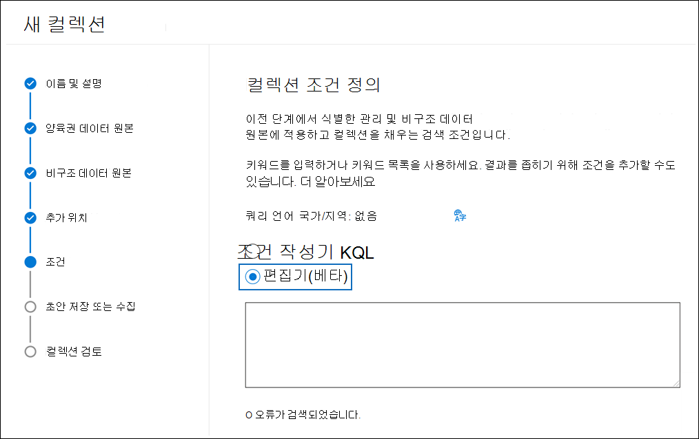

# KQL 편집기를 사용하여 검색 쿼리 작성(미리 보기)

Microsoft 365 eDiscovery 도구 검색의 새로운 KQL 쿼리 환경은 콘텐츠 검색, Core eDiscovery 및 콘텐츠 검색에서 검색 쿼리를 빌드할 때 피드백 및 Advanced eDiscovery. 편집기에서 쿼리를 입력하면 지원되는 검색 가능한 속성 및 조건에 대한 자동 고침을 제공하며 표준 속성 및 조건에 대해 지원되는 값 목록을 제공합니다. 예를 들어 쿼리에 전자 메일 속성을 지정하면 편집기에서 선택할 수 있는 지원되는 값 목록을 `kind` 표시합니다. 또한 KQL 편집기는 검색을 실행하기 전에 수정할 수 있는 잠재적인 쿼리 오류도 실시간으로 표시됩니다. 무엇보다도 표준 조건 작성기에서 키워드 및 조건 카드를 사용하여 쿼리를 수동으로 작성하지 않고도 복잡한 쿼리를 편집기에 직접 붙여넣을 수 있습니다.
  
다음은 KQL 편집기를 사용할 때의 주요 이점입니다.

- 지침을 제공하며 검색 쿼리를 처음부터 작성하는 데 도움이 됩니다.

- 길고 복잡한 쿼리를 편집기에 바로 붙여넣을 수 있습니다. 예를 들어 상대 변호인으로부터 복잡한 쿼리를 받은 경우 조건 작성기를 사용하지 않고 KQL 편집기로 붙여넣을 수 있습니다.

- 잠재적인 오류를 빠르게 식별하고 문제를 해결하는 방법에 대한 힌트를 표시합니다.

KQL 편집기는 Core eDiscovery 및 쿼리 기반 보류를 만들 때도 사용할 수 Advanced eDiscovery.

## KQL 편집기 표시

eDiscovery 검색을 만들거나 편집할 때 KQL 편집기를 표시하고 사용하는  옵션은 검색 또는 컬렉션 마법사의 조건 페이지에 있습니다.

### 콘텐츠 검색 및 Core eDiscovery의 KQL 편집기

### Advanced eDiscovery

## KQL 편집기 사용

다음 섹션에서는 KQL 편집기에서 제안을 제공하는 방법의 예를 보여 주며 잠재적인 오류를 검색합니다.

### 검색 속성 및 연산자의 자동completion

KQL 편집기에서 검색 쿼리를 입력하기 시작하면 편집기에서 선택할 수 있는 지원되는 검색 속성(속성 제한이라고도 하는)에 대한 추천 자동 작성이 표시됩니다. 이러한 두 문자로 시작하는 지원되는 속성 목록을 표시하기 위해 최소 2자만 입력해야 합니다. 예를 들어 다음 스크린샷에는 로 시작하는 추천 검색 속성이 나와 `Se` 있습니다.

또한 전체 속성 이름을 입력할 때 지원되는 연산자(예: , )의 목록도 `:` `=` `<>` 제공합니다. 예를 들어 다음 스크린샷에는 속성에 대해 제안된 연산자가 `Date` 나와 있습니다.

지원되는 검색 속성 및 연산자에 대한 자세한 내용은 [eDiscovery에](keyword-queries-and-search-conditions.md)대한 키워드 쿼리 및 검색 조건을 참조하세요.

### 속성 값 제안

KQL 편집기는 일부 속성의 가능한 값에 대한 제안을 제공합니다. 예를 들어 다음 스크린샷에는 속성에 대해 제안된 값이 `Kind` 나와 있습니다.

편집기에서 , 및 과 같은 전자 메일 받는 사람 속성을 입력할 때 UPN 형식의 사용자 목록을 `From` `To` `Recipients` `Participants` 제안합니다.

### 잠재적인 오류 검색

KQL 편집기는 검색 쿼리에서 발생할 수 있는 오류를 검색하고 오류를 해결하는 데 도움이 되는 원인에 대한 힌트를 제공합니다. 편집기는 속성에 해당하는 작업이나 값이 없는 경우 발생할 수 있는 오류를 나타냅니다. 쿼리의 잠재적인 오류는 빨간색 텍스트로 강조 표시되고 오류에 대한 설명 및  가능한 수정은 잠재적인 오류 드롭다운 섹션에 표시됩니다. 예를 들어 다음 쿼리를 KQL 편집기에 붙여 넣은 경우 4개의 잠재적인 오류가 검색됩니다.

이 경우 잠재적인 오류 힌트를 사용하여 쿼리 문제를 해결하고 수정할 수 있습니다.

## 추가 정보

- 조건 작성기와 KQL 편집기 간에 전환할 수 있습니다. 예를 들어 조건 작성기를 사용하여 키워드 상자와 여러 조건 카드를 사용하여 쿼리를 구성하는 경우 KQL 편집기에서 결과 쿼리를 표시할 수 있습니다. 그러나 KQL 편집기에서 키워드 및 조건이 있는 복잡한 쿼리를 만드는 경우 결과 쿼리는 조건 작성기에서 볼 때 키워드 상자에만 표시됩니다.

- 복잡한 쿼리를 KQL 편집기에 붙여 넣는 경우 편집기에서 잠재적인 오류를 검색하고 오류를 해결하기 위한 가능한 해결 방법을 제안합니다.
