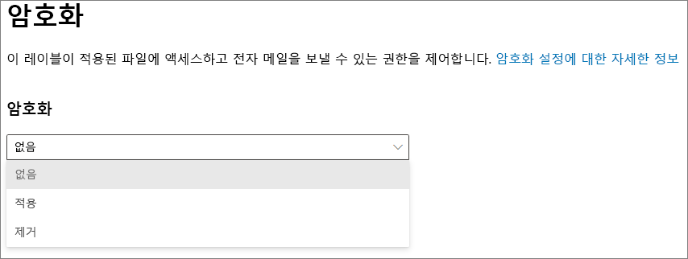
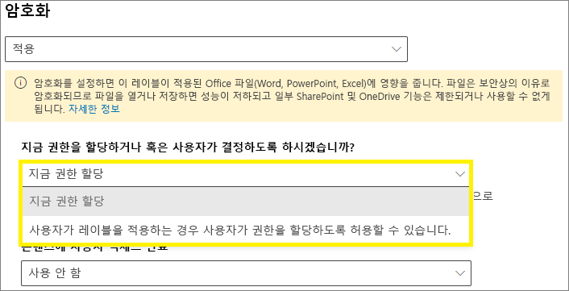
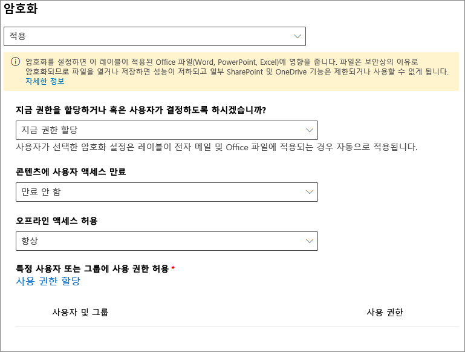
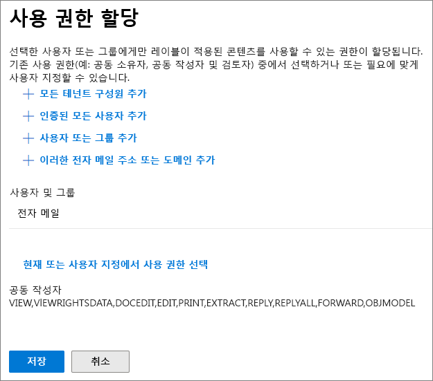
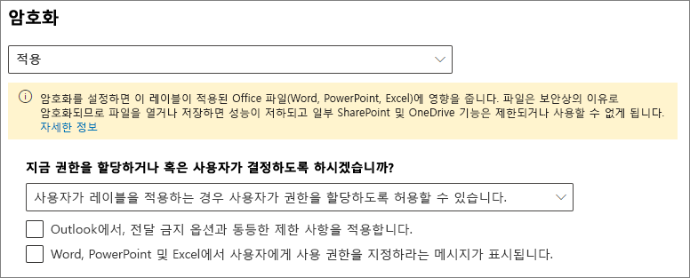
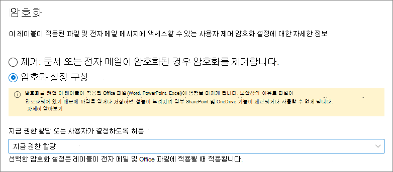

# 민감도 레이블을 사용하여 암호화를 적용하여 콘텐츠 액세스 제한

>*[보안 및 규정 준수를 위한 Microsoft 365 라이선싱 지침](/office365/servicedescriptions/microsoft-365-service-descriptions/microsoft-365-tenantlevel-services-licensing-guidance/microsoft-365-security-compliance-licensing-guidance)*

민감한 레이블을 만들면 레이블이 적용되는 콘텐츠에 대한 액세스를 제한할 수 있습니다. 예를 들어 민감도 레이블의 암호화 설정으로 다음과 같이 콘텐츠를 보호할 수 있습니다.

- 조직 내의 사용자만 기밀 문서나 전자 메일을 열 수 있습니다.
- 마케팅 부서의 사용자만 프로모션 공지 사항 문서 또는 전자 메일을 편집하고 인쇄할 수 있으며 조직의 다른 모든 사용자는 이를 읽는 것만 가능합니다.
- 사용자는 내부 재구성에 대한 소식이 포함된 전자 메일을 전달하거나 정보를 복사할 수 없습니다.
- 비즈니스 파트너에게 전송되는 현재 가격 목록은 특정 날짜 이후에 열 수 없습니다.

문서 또는 전자 메일이 암호화되면 콘텐츠에 대한 액세스가 다음과 같이 제한됩니다.

- 레이블의 암호화 설정에 따라 권한이 있는 사용자만 암호를 해독할 수 있습니다.
- 파일의 이름이 바뀌더라도 조직의 내부 또는 외부에 관계 없이 암호화된 상태로 유지됩니다.
- 작동 중단 시(예: OneDrive 계정에서) 및 전송 중(예: 전자 메일이 인터넷을 트래버스할 때)에 모두 암호화됩니다.

마지막으로, 관리자가 암호화 적용을 위해 민감도 레이블을 구성할 때 다음 중 하나를 선택할 수 있습니다.

- 어떤 사용자에게 해당 레이블이 있는 콘텐츠에 어떤 권한을 부여할 것인지 정확하게 결정하도록 **지금 권한을 할당** 합니다.
- 사용자가 콘텐츠에 레이블을 적용하는 경우 **사용자가 권한을 할당하도록** 허용할 수 있습니다. 이렇게 하면 조직의 사용자가 공동 작업과 작업 수행을 유연하게 할 수 있습니다.

암호화 설정은 Microsoft 365 규정 준수 센터에서 [민감도 레이블을 만들](create-sensitivity-labels.md) 때 사용할 수 있습니다. 이전 포털인 보안 및 준수 센터를 사용할 수도 있습니다.

## 암호화 작동 방식 이해

암호화는 Azure Information Protection의 Azure RMS(Azure 권한 관리 서비스)를 사용합니다. 이 보호 솔루션은 암호화, ID 및 권한 부여 정책을 사용합니다. 자세한 내용은 Azure Information Protection 문서에서 [Azure 권한 관리란?](/azure/information-protection/what-is-azure-rms)을 참조하세요. 

이 암호화 솔루션을 사용하는 경우 **수퍼 사용자** 기능은 권한있는 사용자 및 서비스에서 조직에 대해 암호화된 데이터를 언제든지 읽고 검사 할 수 있도록 해줍니다. 필요한 경우 암호화를 제거하거나 변경할 수 있습니다. 자세한 내용은 [Azure Information Protection 및 검색 서비스 또는 데이터 복구에 대한 수퍼 사용자 구성](/azure/information-protection/configure-super-users)을 참조하세요.

## 암호화 레이블을 구성하는 방법

1. 일반 지침에 따라 [민감도 레이블을 만들거나 편집](create-sensitivity-labels.md#create-and-configure-sensitivity-labels)하고 반드시 레이블 범위에 대해 **파일 및 전자 메일** 이 선택되도록 합니다. 
    
    

2. 그런 다음 **파일 및 전자 메일에 대한 보호 설정 선택** 페이지에서 반드시 **파일 및 전자 메일 암호화** 를 선택합니다.
    
    

4.  마법사의 **암호화** 페이지에서 다음 옵션 중 하나를 선택하세요.
    
    - **파일이 암호화된 경우 암호화 제거**: 이 옵션은 Azure Information Protection 통합 레이블 지정 클라이언트에서만 지원됩니다. 이 옵션을 선택하고 기본 제공 레이블을 사용하면 레이블이 앱에 표시되지 않거나 앱에 표시되지만 암호화를 변경하지 않을 수 있습니다.
        
        이 시나리오에 대한 자세한 내용은 [레이블이 적용되는 경우 기존 암호화에 발생하는 영향](#what-happens-to-existing-encryption-when-a-labels-applied) 섹션을 참조하세요. 이 설정을 사용하면 사용자에게 충분한 권한이 없는 경우, 적용하지 못할 수 있는 민감도 레이블이 있다는 것을 이해하는 것이 중요합니다.
    
    - **암호화 설정 구성**: 암호화를 켜고 암호화 설정을 표시합니다.
        
        
        
        해당 설정에 대한 지침은 다음 [암호화 설정 구성](#configure-encryption-settings) 섹션에 있습니다.

### 레이블이 적용되면 기존 암호화는 어떻게 되나요?

암호화되지 않은 컨텐츠에 민감도 레이블이 적용된 경우 선택할 수 있는 암호화 옵션의 결과는 자명합니다. 예를 들어 **암호화 파일 및 전자 메일** 을 선택하지 않은 경우 콘텐츠는 암호화되지 않은 상태로 유지됩니다.

그러나 콘텐츠가 이미 암호화되었을 수 있습니다. 예를 들어 다른 사용자가 다음을 적용했을 수 있습니다.

- 레이블에 의해 프롬프트될 때 사용자 정의 권한, Azure Information Protection 클라이언트의 사용자 지정 권한 및 Office 앱 내에서 **제한된 액세스** 문서 보호가 포함된 자체 권한
- 레이블과 독립적으로 콘텐츠를 암호화하는 Azure 권한 관리 보호 서식 파일. 이 범주에는 권한 보호를 사용하여 암호화를 적용하는 메일 흐름 규칙이 포함됩니다.
- 관리자가 할당한 권한으로 암호화를 적용하는 레이블입니다.

다음 테이블에서는 민감도 레이블이 해당 콘텐츠에 적용되는 경우 기존 암호화가 어떻게 되는지에 대해 설명합니다.

| | 암호화: 선택되지 않음 | 암호화: 구성됨 | 암호화: 제거\* |
|:-----|:-----|:-----|:-----|
|**사용자가 지정하는 사용 권한**|원래 암호화가 유지됨|새 레이블 암호화가 적용됨|원래 암호화가 제거됨|
|**보호 서식 파일**|원래 암호화가 유지됨|새 레이블 암호화가 적용됨|원래 암호화가 제거됨|
|**관리자 정의 권한이 있는 레이블**|원래 암호화가 제거됨|새 레이블 암호화가 적용됨|원래 암호화가 제거됨|

**각주:**

\*Azure Information Protection 통합 레이블 클라이언트에서만 지원됩니다.

새 레이블 암호화가 적용되거나 원래 암호화가 제거된 경우, 레이블을 적용하는 사용자에게 이 작업을 지원하는 사용 권한 또는 역할이 있는 경우에만 발생합니다.

- [사용 권한](/azure/information-protection/configure-usage-rights#usage-rights-and-descriptions) 내보내기 또는 모든 권한.
- [권한 관리 발급자 또는 권한 관리 소유자](/azure/information-protection/configure-usage-rights#rights-management-issuer-and-rights-management-owner) 또는 [수퍼 사용자](/azure/information-protection/configure-super-users)의 역할

사용자에게 이러한 권한이나 역할이 없는 경우에는 레이블을 적용할 수 없으므로 원래 암호화가 유지됩니다. 사용자에게 다음 메시지가 표시됩니다. **민감도 레이블을 변경할 권한이 없습니다. 콘텐츠 소유자에게 문의하세요.**

예를 들어 전자 메일 메시지에 전달 안 함을 적용한 사람은 전자 메일의 권한 관리 소유자이므로 스레드의 레이블을 다시 지정하여 암호화를 대체하거나 제거할 수 있습니다. 그러나 수퍼 사용자를 제외하고 이 전자 메일 수신자는 요구되는 사용 권한이 없기 때문에 레이블을 변경할 수 없습니다.

#### 암호화된 전자 메일 메시지에 대한 전자 메일 첨부 파일

어떤 방법으로든 전자 메일 메시지를 암호화하면 전자 메일에 첨부된 암호화되지 않은 Office 문서는 자동으로 동일한 암호화 설정을 상속합니다.

이미 암호화된 후 첨부 파일로 추가된 문서는 항상 원래 암호화를 유지합니다.

## 암호화 설정 구성

민감도 레이블을 만들거나 편집하기 위해 마법사의 **암호화** 페이지에서 **암호화 설정 구성** 을 선택하는 경우, 다음 옵션 중 하나를 선택할 수 있습니다.

- 레이블을 적용한 콘텐츠에 대해 어떤 사용자에게 어떤 권한을 부여할 것인지 정확하게 결정할 수 있도록 **지금 권한을 할당** 합니다. 자세한 내용은 다음 섹션 [지금 권한 할당](#assign-permissions-now)을 참조하세요.
- 사용자가 콘텐츠에 레이블을 적용하는 경우 **사용자가 권한을 할당하도록 허용** 할 수 있습니다. 이 옵션을 사용하면 조직의 사용자가 공동 작업과 작업 수행을 유연하게 할 수 있습니다. 자세한 내용은이 페이지에서 [권한을 할당할 수 있도록 허용](#let-users-assign-permissions) 섹션을 참조하세요.

예를 들어, 가장 중요한 콘텐츠에 적용되는 **극비** 라는 민감도 레이블을 사용하는 경우 해당 콘텐츠의 사용 권한 유형을 받을 사용자를 결정하는 것이 좋습니다.

또는 **비즈니스 계약서** 라는 민감도 레이블을 사용하고, 사용자 조직의 워크플로에 따라 사용자가 임시로 다른 사용자와 이 콘텐츠에 대해 공동 작업해야 하는 경우, 사용자가 레이블을 지정할 때 권한을 받을 사용자를 결정할 수 있습니다. 이와 같은 유연성을 갖추어 사용자의 생산성은 향상되고 관리자가 특정 시나리오를 해결하기 위해 새 민감도 레이블을 업데이트하거나 만들어야 하는 요청은 줄일 수 있습니다.

지금 권한을 할당할지 사용자가 권한을 할당하도록 허용할지 선택:

## 지금 권한 할당

다음 옵션을 사용하여 이 레이블이 적용되는 전자 메일 또는 문서에 액세스할 수 있는 사용자를 제어합니다. 다음은 수행 가능한 작업입니다.

- 특정 날짜 또는 레이블을 지정한 후 특정 일수가 지나면 **레이블을 지정한 콘텐츠에 대한 액세스가 만료** 되도록 합니다. 이 기간 이후 사용자는 레이블을 지정한 항목을 열 수 없습니다. 날짜를 지정하는 경우 표준 시간대의 해당 날짜 자정에 적용됩니다. 일부 전자 메일 클라이언트의 경우 캐싱 메커니즘으로 인해 만료 기능이 적용되지 않을 수 있으며 만료 날짜가 지난 전자 메일이 표시될 수 있습니다.

- **오프라인 액세스 허용** 을 허용 안 함, 항상 허용 또는 레이블을 적용한 후 특정 일수 동안 허용합니다. 오프라인 액세스를 허용 안 함 또는 며칠로 제한하는 경우 임계값에 도달하면 사용자를 다시 인증해야 하고 액세스 권한이 기록됩니다. 자세한 내용은 권한 관리 사용 라이선스에 대한 다음 섹션을 참조하세요.

암호화된 콘텐츠의 액세스 제어 설정:

### 오프라인 액세스에 대한 권한 관리 사용 라이선스

사용자가 Microsoft Azure AD Rights Management 서비스에서 암호화로 보호되는 문서 또는 전자 메일을 열면 사용자에게 해당 콘텐츠에 대한 Microsoft Azure AD Rights Management 사용 라이선스가 부여됩니다. 이 사용 라이선스는 문서 또는 전자 메일에 대한 사용자의 사용 권한 및 콘텐츠를 암호화하는 데 사용된 암호화 키가 포함된 인증서입니다. 사용 라이선스에는 만료 날짜가 설정된 경우 만료 날짜와 사용 라이선스 유효 기간이 포함되어 있습니다.

만료 날짜가 설정된 경우 테넌트에 대한 기본 사용 라이선스의 유효 기간은 30일입니다. 사용 라이센스 동안 콘텐츠에 대해 다시 인증받지 않습니다. 이 프로세스를 통해 인터넷에 연결하지 않고도 보호된 문서 또는 전자 메일을 계속 열 수 있습니다. 사용 라이선스 유효 기간이 만료되면 다음에 사용자가 보호된 문서 또는 전자 메일에 액세스할 때 다시 인증받아야 합니다.

재인증 외에도 암호화 설정 및 사용자 그룹 멤버십이 다시 평가됩니다. 즉, 사용자가 마지막으로 콘텐츠에 액세스한 시점에서 암호화 설정이나 그룹 멤버십에 변경 사항이 있는 경우 사용자가 동일한 문서 또는 전자 메일에 대해 다른 액세스 결과를 경험할 수 있습니다.

기본값 30일 설정을 변경하는 방법을 알아보려면 [권한 관리 사용 라이선스](/azure/information-protection/configure-usage-rights#rights-management-use-license)를 참조하세요.

### 특정 사용자 또는 그룹에 사용 권한 할당

특정 사용자만 레이블이 지정된 콘텐츠와 상호 작용할 수 있도록 다음과 같이 사용 권한을 부여할 수 있습니다.

1. 먼저 사용 권한을 할당할 사용자 또는 그룹을 레이블이 지정된 콘텐츠에 추가합니다.

2. 그런 다음 레이블이 지정된 컨텐츠에 대해 해당 사용자에게 어떤 권한이 있는지 선택합니다.

사용 권한 할당:

#### 사용자 또는 그룹 추가

권한을 할당할 때 다음을 선택할 수 있습니다.

- 조직의 모든 사용자(모든 테넌트 구성원). 이 설정에서는 게스트 계정이 제외됩니다.

- 인증된 모든 사용자. 이 설정을 선택하기 전에 이 설정의 [요구 사항과 제한 사항](#requirements-and-limitations-for-add-any-authenticated-users)을 이해해야 합니다.

- 모든 특정 사용자 또는 전자 메일 사용이 가능한 보안 그룹, 분배 그룹 또는 Azure AD의 Microsoft 365 그룹([이전 Office 365 그룹](https://techcommunity.microsoft.com/t5/microsoft-365-blog/office-365-groups-will-become-microsoft-365-groups/ba-p/1303601)). Microsoft 365 그룹에는 정적 또는 [동적 구성원](/azure/active-directory/users-groups-roles/groups-create-rule)이 있을 수 있습니다. 이 그룹 유형은 Azure AD와 동기화되지 않으며 전자 메일을 사용할 수없는 보안 그룹을 사용할 수 없으므로 [Exchange에서 동적 메일 그룹](/Exchange/recipients/dynamic-distribution-groups/dynamic-distribution-groups)을 사용할 수 없습니다.

- 모든 전자 메일 주소 또는 도메인. 해당 조직에서 도메인 이름을 입력하여 Azure AD를 사용하는 다른 조직의 모든 사용자를 지정하려면 이 옵션을 사용합니다. 소셜 공급자의 도메인 이름(예: **gmail.com**, **hotmail.com** 또는 **outlook.com**)을 입력하여 소셜 공급자에 이 옵션을 사용할 수도 있습니다.

    > [!NOTE]
    > Azure AD를 사용하는 조직에서 도메인을 지정할 경우 해당 특정 도메인에 대한 액세스를 제한할 수 없습니다. 대신에 Azure AD에서 확인된 모든 도메인은 사용자가 지정한 도메인 이름을 소유하는 테넌트에 자동으로 포함됩니다.

조직 혹은 브라우저 디렉토리에 모든 사용자 및 그룹을 선택하면 사용자 혹은 그룹에 전자 메일 주소가 있어야 합니다.

모범 사례로 사용자 대신 그룹을 사용할 수 있습니다. 이 전략으로 더 간단하게 구성할 수 있습니다.

##### “인증된 사용자 추가”에 대한 요구 사항 및 제한 사항

이 설정은 레이블이 암호화하는 컨텐츠에 액세스할 수 있는 사람을 제한하지 않고 컨텐츠를 계속 암호화하고 컨텐츠 사용 방법(권한) 및 액세스 방법(만료 및 오프라인 액세스)을 제한하는 옵션을 제공합니다. 그러나 암호화된 콘텐츠를 여는 응용 프로그램은 사용되는 인증을 지원할 수 있어야 합니다. 이러한 이유로 Google과 같은 페더레이션된 소셜 공급자 및 일회용 암호 인증은 Exchange Online을 사용할 때에 한해 전자 메일에 대해서만 작동합니다. Microsoft 계정은 Office 365 앱 및 [Azure Information Protection 뷰어](https://portal.azurerms.com/#/download)와 함께 사용할 수 있습니다.

> [!NOTE]
> [SharePoint 및 OneDrive Office 파일에 대해 민감도 레이블을 사용](sensitivity-labels-sharepoint-onedrive-files.md)하는 경우 [Azure AD B2B와 SharePoint 및 OneDrive 통합](/sharepoint/sharepoint-azureb2b-integration-preview)으로 이 설정을 사용하는 것이 좋습니다.

인증된 사용자 설정에 대한 일반적인 시나리오는 다음과 같습니다.

- 누가 컨텐츠를 보는지는 신경 쓰지 않지만 컨텐츠 사용 방법을 제한하려고 합니다. 예를 들어 내용의 편집, 복사 또는 인쇄를 원하지 않습니다.
- 컨텐츠에 액세스하는 사람을 제한할 필요는 없지만 누가 컨텐츠를 여는지 확인하고 싶을 수 있습니다.
- 콘텐츠는 저장 및 전송시 암호화되어야 하지만 액세스 제어는 필요하지 않습니다.

#### 사용 권한 선택

해당 사용자 또는 그룹에 허용할 사용 권한을 선택하면 다음 중 하나를 선택할 수 있습니다.

- 미리 설정된 권한 그룹(예: 공동 작성 또는 검토자)이 있는 [미리 정의된 권한 수준](/azure/information-protection/configure-usage-rights#rights-included-in-permissions-levels).
- 하나 이상의 사용 권한을 선택하는 경우 권한 사용자 지정

적절한 사용 권한을 선택하는 데 도움이 되는 자세한 내용은 [사용 권한 및 설명](/azure/information-protection/configure-usage-rights#usage-rights-and-descriptions)을 참조하세요.  

동일한 레이블로 다른 사용자에게 다른 권한을 부여할 수 있습니다. 예를 들어 아래에 있는 스크린샷과 같이 단일 레이블에서 일부 사용자를 검토자로 할당하고 다른 사용자를 공동 작성자로 할당할 수 있습니다.

이를 위해서는 사용자 또는 그룹을 추가하고 사용 권한을 할당하고 해당 설정을 저장합니다. 그런 다음 매번 이 단계를 반복하여 사용자를 추가하고 권한을 할당하고 설정을 저장합니다. 이 구성을 필요한 만큼 수행하여 여러 사용자에게 서로 다른 권한을 정의할 수 있습니다.

#### 권한 관리 발급자(민감도 레이블을 적용한 사용자)는 항상 모든 권한을 갖습니다

민감도 레이블의 암호화는 Azure Information Protection의 Microsoft Azure AD Rights Management 서비스를 사용합니다. 사용자가 암호화를 사용하여 문서 또는 전자 메일을 보호하기 위해 중요도 레이블을 적용하면 해당 사용자는 해당 콘텐츠에 대한 권한 관리 발급자가 됩니다.

권한 관리 발급자는 문서 또는 전자 메일에 대한 모든 권한을 항상 부여받으며, 또한 다음과 같은 권한을 갖습니다.

- 암호화 설정에 만료 날짜가 포함된 경우 권한 관리 발급자는 해당 날짜 이후에도 여전히 문서 또는 전자 메일을 열고 편집할 수 있습니다.
- 권한 관리 발급자는 문서 또는 전자 메일을 언제든지 오프라인으로 액세스할 수 있습니다.
- 권한 관리 발급자는 권한이 해지된 후에도 문서를 열 수 있습니다.

자세한 내용은 [권한 관리 발급자 및 권한 관리 소유자](/azure/information-protection/configure-usage-rights#rights-management-issuer-and-rights-management-owner)를 참조하세요.

### 이중 키 암호화

> [!NOTE]
> 이 기능은 현재 Azure Information Protection 통합 라벨링 클라이언트에서만 지원됩니다.

이중 키 암호화 서비스를 구성한 후 이 레이블이 적용되는 파일에 대해 해당 이중 키 암호화를 사용해야 하는 경우에만 이 옵션을 선택합니다.

자세한 내용, 전제 조건 및 구성 지침을 보려면 [DKE(Double Key Encryption)를](double-key-encryption.md)를 참조하세요.

## 사용자가 권한을 할당하도록 허용

> [!IMPORTANT]
> 모든 레이블 지정 클라이언트가 사용자가 본인의 사용 권한을 할당할 수 있는 모든 옵션을 지원하지는 않습니다. 이 섹션에서 자세히 알아보세요.

다음 옵션을 사용하여 사용자가 민감도 레이블을 콘텐츠에 수동으로 추가할 때 사용자가 권한을 할당하도록 허용할 수 있습니다.

- Outlook의 경우 사용자는 선택된 수신자에 대해 [전달하지 않음](/azure/information-protection/configure-usage-rights#do-not-forward-option-for-emails) 옵션 또는 [암호화 전용](/azure/information-protection/configure-usage-rights#encrypt-only-option-for-emails)에 해당하는 제한을 선택할 수 있습니다.
    
    전달하지 않음 옵션은 민감도 레이블을 지원하는 모든 전자 메일 클라이언트에서 지원됩니다. 그러나 민감도 레이블에 **암호화 전용** 옵션을 적용하는 것은 Azure Information Protection 통합 레이블 클라이언트가 아닌 기본 제공 레이블에서만 지원되는 최근 릴리스입니다. 이 기능을 지원하지 않는 전자 메일 클라이언트의 경우 레이블이 표시되지 않습니다.
    
    민감도 레이블로 암호화 전용 옵션 적용을 지원하기 위해 기본 제공 레이블 지정을 사용하는 Outlook 앱의 최소 버전을 확인하려면 [Outlook 기능 표](sensitivity-labels-office-apps.md#sensitivity-label-capabilities-in-outlook)와 **사용자가 권한을 할당하도록 허용: - 암호화 전용** 행을 사용하세요.

- Word, PowerPoint 및 Excel의 경우 사용자에게 특정 사용자, 그룹 또는 조직에 대한 고유 권한을 선택하라는 메시지가 표시됩니다.

    이 옵션은 Azure Information Protection 통합 레이블 클라이언트와 기본 제공 레이블 지정을 사용하는 일부 앱에서 지원됩니다. 이 기능을 지원하지 않는 앱의 경우 레이블이 사용자에게 표시되지 않거나 레이블이 일관성을 위해 표시되지만 사용자에게 설명 메시지와 함께 적용할 수 없습니다.
    
    기본 제공 레이블을 사용하는 앱이 이 옵션을 지원하는지 확인하려면 [Word, Excel 및 PowerPoint 기능 표](sensitivity-labels-office-apps.md#sensitivity-label-capabilities-in-word-excel-and-powerpoint)와 **사용자가 권한을 할당하도록 허용: - 암호화 전용** 행을 사용합니다.

옵션이 지원되면 다음 표를 사용하여 사용자에게 민감도 레이블이 표시되는 시기를 식별하세요.

|설정 |Outlook에 표시되는 레이블|Word, Excel, PowerPoint에서 표시되는 레이블|
|:-----|:-----|:-----|:-----|
|**Outlook에서 전달하지 않음 또는 암호화 전용 옵션으로 제한 사항을 적용합니다.**|예 |아니요 |
|**Word, PowerPoint 및 Excel에서 사용자에게 사용 권한을 지정하라는 메시지가 표시됩니다.**|아니요 |예|

두 설정을 모두 선택하면 레이블은 Outlook과 Word, Excel 및 PowerPoint 모두에 표시됩니다.

사용자가 권한을 할당할 수 있도록 허용하는 민감도 레이블은 사용자가 수동으로 콘텐츠에 적용해야 하므로, 이를 자동 적용하거나 권장 레이블 사용할 수 없습니다.

사용자 할당 권한 구성:

### Outlook 제한 사항

Outlook에서, 사용자가 메시지에 권한을 할당하도록 허용하는 민감도 레이블을 적용하는 경우 **전달하지 않음** 또는 **암호화 전용** 옵션을 선택할 수 있습니다. 사용자에게 메시지 맨 위에 레이블 이름과 설명이 표시됩니다. 이는 콘텐츠가 보호되고 있음을 나타냅니다. Word, PowerPoint 및 Excel([다음 섹션](#word-powerpoint-and-excel-permissions) 참조)과 달리, 사용자에게 특정 권한을 선택 하라는 메시지가 표시되지 않습니다.

이러한 옵션 중 하나를 전자 메일에 적용하면 전자 메일이 암호화되고 받는 사람은 인증을 거쳐야 합니다. 인증을 완료하면 받는 사람에게 자동으로 제한된 사용 권한이 부여됩니다.

- **전달하지 않음**: 받는 사람이 전자 메일을 전달하거나, 인쇄하거나, 복사할 수 없습니다. 예를 들어, Outlook 클라이언트에서 전달 단추를 사용할 수 없고, 다른 이름으로 저장 및 인쇄 메뉴 옵션도 사용할 수 없으며, 받는 사람, 참조 또는 숨은 참조 상자에서 받는 사람을 추가하거나 변경할 수 없습니다.
    
    이 옵션이 작동하는 방식에 대한 자세한 내용은 [전자 메일에 대한 전달하지 않음 옵션](/azure/information-protection/configure-usage-rights#do-not-forward-option-for-emails)을 참조하세요.

- **암호화 전용**: 받는 사람은 다른 이름으로 저장, 내보내기 및 모든 권한을 제외한 모든 사용 권한을 갖습니다. 이 사용 권한 조합은 받는 사람에게는 보호를 제거할 수 없다는 것 외에는 제한이 없다는 뜻입니다. 예를 들어 받는 사람은 전자 메일에서 복사하여 인쇄한 다음 전달할 수 있습니다.
    
    이 옵션이 작동하는 방식에 대한 자세한 내용은 [전자 메일에 대한 암호화 전용 옵션](/azure/information-protection/configure-usage-rights#encrypt-only-option-for-emails)을 참조하세요.

전자 메일에 첨부된 암호화되지 않은 Office 문서는 자동으로 동일한 제한 사항을 상속합니다. 전달하지 않음의 경우 이 문서에 적용되는 사용 권한은 콘텐츠 편집, 편집, 저장, 보기, 열기, 읽기, 매크로 허용입니다. 사용자가 첨부 파일에 대해 다른 권한을 요구하는 경우 또는 첨부 파일이 상속된 보호를 지원하는 Office 문서가 아닌 경우, 사용자가 파일을 전자 메일에 첨부하기 전에 파일을 암호화해야 합니다.

### Word, PowerPoint 및 Excel 권한

Word, PowerPoint 및 Excel에서 사용자가 문서에 사용 권한을 할당할 수 있는 민감도 레이블을 적용하면 암호화 적용시 사용자와 사용 권한을 선택하라는 메시지가 표시됩니다.

예를 들어 Azure Information Protection 통합 레이블 클라이언트를 사용하면 다음을 수행할 수 있습니다.

- 뷰어(보기 전용 권한 할당) 또는 공동 작성자(보기, 편집, 복사 및 인쇄 권한 할당)와 같은 권한 수준을 선택합니다.
- 사용자, 그룹 또는 조직을 선택합니다. 여기에는 조직의 내부 또는 외부 사용자가 모두 포함될 수 있습니다.
- 선택한 사용자가 콘텐츠에 액세스할 수 없는 만료 날짜를 설정합니다. 자세한 내용은 위에 있는 섹션 [오프라인 액세스용 권한 관리 사용자 라이선스](#rights-management-use-license-for-offline-access)를 참조하세요.

내장 레이블의 경우 유저가 다음을 선택할 경우 동일한 대화 상자가 표시됩니다.

- Windows: **파일** 탭 > **정보** > **문서 보호** > **액세스 제한** > **제한된 액세스**

- MacOS: **검토** 탭 > **보호** > **사용 권한** > **제한된 액세스**

## 암호화 설정의 예제 구성

아래에 나오는 각 예제에 대해 **암호화 설정 구성** 을 선택하는 경우, 마법사의 **암호화** 페이지에서 구성을 수행합니다.

### 예제 1: 적용되는 레이블 암호화된 전자 메일을 Gmail 계정으로 보내기 위해 전달하지 않습니다.

이 레이블은 Outlook 및 웹에서의 Outlook에서만 사용할 수 있으며 Exchange Online을 사용해야 합니다. 사용자가 Gmail 계정(또는 조직 외부의 다른 전자 메일 계정)을 사용하는 사용자에게 암호화된 전자 메일을 보내야 하는 경우 이 레이블을 선택하도록 지시합니다.

사용자는 **받는 사람** 상자에 Gmail 전자 메일 주소를 입력합니다.  그런 다음 레이블을 선택하면 전달 금지 옵션이 전자 메일에 자동으로 추가됩니다. 그 결과 받는 사람이 **다른 이름으로 저장** 옵션을 사용하여 전자 메일을 전달, 인쇄, 복사하거나 혹은 사서함 외부에 해당 전자 메일을 저장하는 것을 방지할 수 있습니다.

1. **암호화** 페이지에서 다음을 수행합니다. **사용 권한을 지금 할당 혹은 사용자가 결정하도록 하기** 에서 **사용자가 레이블을 적용할 때 사용 권한을 할당하도록 하기** 를 선택합니다.

2. 확인란 선택: **Outlook에서 전달 금지 옵션에 해당하는 제한 사항을 적용합니다**.

3. 선택된 경우 확인란의 선택을 취소합니다. **Word, PowerPoint 및 Excel에서 사용자에게 사용 권한을 지정하라는 메시지를 표시합니다**.

4. **다음** 을 선택하고 마법사를 완료합니다.

### 예제 2: 다른 조직의 모든 사용자에게 읽기 전용 권한을 제한하는 레이블

이 레이블은 매우 중요한 문서를 읽기 전용으로 공유하는 데 적합하며, 이러한 문서를 보려면 항상 인터넷 연결이 필요합니다.

이 레이블은 전자 메일에 적합하지 않습니다.

1. **암호화** 페이지에서 다음을 수행합니다. **사용 권한을 지금 할당 혹은 사용자가 결정하도록 하기** 에서 **지금 사용 권한을 할당** 을 선택합니다.

2. **오프라인 액세스를 허용** 은 **절대 불허** 를 선택합니다.

3. **사용 권한 할당** 을 선택합니다.

4. **사용 권한 할당** 창에서 **특정 전자 메일 주소 또는 도메인 추가** 를 선택합니다.

5. 텍스트 상자에 다른 조직의 도메인 이름을 입력 합니다(예:**fabrikam.com**). 그런 다음 **추가** 를 선택합니다.

6. **사용 권한 선택** 선택

7. **사용 권한 선택** 창에서 드롭다운 상자를 선택하고 **뷰어** 를 선택 한 다음 **저장** 을 선택합니다.

8. **사용 권한 할당** 창으로 돌아가서 **저장** 을 선택합니다.

9. **암호화** 페이지에서 **다음** 을 선택하고 마법사를 완료합니다.

### 예제 3: 콘텐츠를 암호화하는 기존 레이블에 외부 사용자 추가

추가하는 새 사용자는 이 레이블로 이미 보호된 문서 및 전자 메일을 열 수 있습니다. 이러한 사용자에게 부여하는 사용 권한은 기존 사용자의 사용 권한과 다를 수 있습니다.

1. **암호화** 페이지에서 다음을 수행합니다. **사용 권한을 지금 할당 혹은 사용자가 결정하도록 하기** 에서 반드시 **지금 사용 권한을 할당** 이 선택되도록 합니다.

2. **사용 권한 할당** 을 선택합니다.

3. **사용 권한 할당** 창에서 **특정 전자 메일 주소 또는 도메인 추가** 를 선택합니다.

4. 텍스트 상자에 추가할 첫 번째 사용자(또는 그룹)의 전자 메일 주소를 입력한 다음 **추가** 를 선택합니다.

5. **사용 권한 선택** 선택

6. **사용 권한 선택** 창에서 이 사용자(또는 그룹)에 대한 사용 권한을 선택하고 **저장** 을 선택합니다.

7. **사용 권한 할당** 창으로 돌아가서 이 레이블에 추가하려는 각 사용자(또는 그룹)에 대해 3 ~ 6단계를 반복합니다. 그런 다음 **저장** 을 클릭합니다.

8. **암호화** 페이지에서 **다음** 을 선택하고 마법사를 완료합니다.

### 예제 4: 콘텐츠를 암호화하지만 액세스할 수 있는 사용자를 제한하지 않는 레이블

이 구성은 전자 메일이나 문서를 암호화하는 데 사용자, 그룹 또는 도메인을 지정할 필요가 없다는 장점이 있습니다. 콘텐츠는 계속 암호화되므로 사용 권한, 만료 날짜 및 오프라인 액세스를 계속 지정할 수 있습니다.

보호되는 문서 또는 전자 메일을 열 수 있는 사용자를 제한할 필요가 없는 경우에만 이 구성을 사용합니다. [이 설정에 대한 자세한 내용](#requirements-and-limitations-for-add-any-authenticated-users)

1. **암호화** 페이지에서 다음을 수행합니다. **사용 권한을 지금 할당 혹은 사용자가 결정하도록 하기** 에서 반드시 **지금 사용 권한을 할당** 이 선택되도록 합니다.

2. 필요한 경우 **콘텐츠에 대한 사용자 액세스 만료** 및 **오프라인 액세스 허용** 에 대한 설정을 구성합니다.

3. **사용 권한 할당** 을 선택합니다.

4. **사용 권한 할당** 창에서 **인증된 사용자 추가** 를 선택합니다.

    **사용자 및 그룹** 의 경우 **인증된 사용자** 가 자동으로 추가되는 것을 확인할 수 있습니다. 이 값은 변경할 수 없고 삭제만 가능하며 삭제 시 **인증된 사용자 추가** 선택이 취소됩니다.

5. **사용 권한 선택** 선택

6. **사용 권한 선택** 창에서 드롭다운 상자를 선택하고 원하는 사용 권한을 선택한 다음 **저장** 을 선택합니다.

7. **사용 권한 할당** 창으로 돌아가서 **저장** 을 선택합니다.

8. **암호화** 페이지에서 **다음** 을 선택하고 마법사를 완료합니다.

## 암호화된 콘텐츠의 고려 사항

가장 중요한 문서와 전자 메일을 암호화하면 권한있는 사용자만 이 데이터에 액세스할 수 있습니다. 그러나 다음과 같은 몇 가지 고려해야 할 사항이 있습니다.

- 조직이 [SharePoint 및 OneDrive에서 Office 파일에 대한 민감도 레이블을 활성화](sensitivity-labels-sharepoint-onedrive-files.md)하지 않은 경우, 다음과 같이 작동합니다.

  - 암호화된 파일에는 검색, eDiscovery 및 Delve가 작동하지 않습니다.
  - DLP 정책은 이러한 암호화된 파일의 메타 데이터(보존 레이블 정보 포함)에 대해서는 작동하지만 파일의 내용(예: 파일 내의 신용 카드 번호)에는 적용되지 않습니다.
  - 사용자는 웹에서 Office를 사용하여 암호화된 파일을 열 수 없습니다. SharePoint 및 OneDrive에서 Office 파일에 대한 민감도 레이블을 사용하도록 설정하면 사용자는 웹에서 Office를 사용하여 암호화된 파일을 열 수 있습니다. 이 경우에는 온-프레미스 키("자체 키 보유" 또는 HYOK)를 사용하여 적용된 암호화, [이중 키 암호화](#double-key-encryption)와 민감도 레이블과 독립적으로 적용된 암호화를 포함하는 몇 가지 [제한 사항](sensitivity-labels-sharepoint-onedrive-files.md#limitations)이 있습니다.

- 암호화된 문서를 조직 외부의 사용자와 공유하는 경우 게스트 계정을 만들고 조건부 액세스 정책을 수정해야 할 수 있습니다. 자세한 내용은 [암호화된 문서를 외부 사용자와 공유하기](sensitivity-labels-office-apps.md#support-for-external-users-and-labeled-content)를 참조하세요.

- 여러 사용자가 동시에 암호화된 파일을 편집하려면 모두 웹용 Office를 사용해야 합니다. 그와 같은 상황이 아니고 파일이 이미 열려있는 경우:

  - Office 앱(Windows, Mac, Android 및 iOS)에서, 사용자에게는 파일을 체크아웃한 사용자의 이름과 함께 **사용 중인 파일** 메시지가 표시됩니다. 그런 다음 읽기 전용 사본을 보거나 파일 사본을 저장 및 편집하고, 파일을 사용할 수 있을 때 알림을 받을 수 있습니다.
  - 웹용 Office에서, 사용자에게는 다른 사람과 함께 문서를 편집할 수 없다는 오류 메시지가 표시됩니다. 그런 다음 **읽기용 보기에서 열기** 를 선택할 수 있습니다.

- 암호화된 파일에 대해서는 Office 앱(Windows, Mac, Android 및 iOS)의 [자동 저장](https://support.office.com/article/what-is-autosave-6d6bd723-ebfd-4e40-b5f6-ae6e8088f7a5) 기능이 비활성화되어 있습니다. 사용자에게는 자동 저장을 설정하기 전에 사용 권한의 제한을 해제해야 한다는 메시지가 표시됩니다.

- 암호화된 파일은 Office 앱(Windows, Mac, Android 및 iOS)에서 여는 데 시간이 더 걸릴 수 있습니다.

- 문서가 [SharePoint에서 체크아웃](https://support.microsoft.com/office/check-out-check-in-or-discard-changes-to-files-in-a-library-7e2c12a9-a874-4393-9511-1378a700f6de)될 때 Office 앱을 사용하여 암호화를 적용하는 레이블이 추가된 다음 사용자가 체크아웃을 무시해도 문서는 레이블과 암호화된 상태로 유지됩니다.

- 암호화된 파일에 대한 다음 작업은 Office 앱(Windows, Mac, Android 및 iOS)에서 지원되지 않으며 사용자에게 문제가 있다는 오류 메시지가 표시됩니다. 하지만 SharePoint 기능을 대신 사용할 수 있습니다.

  - 이전 버전의 사본 보기, 복원 및 저장. 대안으로, 사용자는 [목록 또는 라이브러리에 대한 버전 관리를 활성화하고 구성할 때](https://support.office.com/article/enable-and-configure-versioning-for-a-list-or-library-1555d642-23ee-446a-990a-bcab618c7a37) 웹에서 Office를 사용하여 이러한 작업을 수행할 수 있습니다.
  - 파일 이름 또는 위치 변경. 대안으로, 사용자는 SharePoint에서 [문서 라이브러리에서 파일, 폴더 또는 링크 이름 바꾸기](https://support.microsoft.com/office/rename-a-file-folder-or-link-in-a-document-library-bc493c1a-921f-4bc1-a7f6-985ce11bb185)를 할 수 있습니다.

민감도 레이블로 암호화된 파일에 대한 최상의 공동 작업 환경을 위해서는 웹용 Office와 [SharePoint 및 OneDrive의 Office 파일에 대해 민감도 레이블을 사용](sensitivity-labels-sharepoint-onedrive-files.md)하는 것이 좋습니다.

## 중요한 필수 구성 요소

암호화를 사용하려면 먼저 몇 가지 구성 작업을 수행해야 합니다.

- Azure Information Protection에서 보호 활성화
    
    민감도 레이블이 암호화를 적용하려면 테넌트에 대해 Azure Information Protection의 보호 서비스(Azure 권한 관리)가 활성화되어 있어야 합니다. 새 테넌트에서는 이것이 기본 설정이지만 서비스를 수동으로 활성화해야 할 수도 있습니다. 자세한 내용은 [Azure Information Protection에서 보호 서비스 활성화](/azure/information-protection/activate-service)를 참조하세요.

- 네트워크 요구 사항을 확인합니다.
    
    방화벽 등 네트워크 장치를 일부 변경해야 할 수 있습니다. 세부 정보는 Azure Information Protection 설명서의 [방화벽 및 네트워크 인프라](/azure/information-protection/requirements#firewalls-and-network-infrastructure)에서 확인하세요.

- Azure Information Protection에 대한 Exchange 구성
    
    사용자가 전자 메일을 암호화하기 위해 Outlook에서 레이블을 적용하기 전에 Azure Information Protection용으로 Exchange를 구성하지 않아도 됩니다. 그러나 Microsoft Azure Information Protection용으로 Exchange를 구성하기 전까지는 Exchange에서 Microsoft Azure AD Rights Management 보호를 사용하는 모든 기능을 온전히 사용할 수 없습니다.
    
    예를 들어 사용자는 휴대폰 또는 웹에서의 Outlook으로 암호화된 전자 메일을 볼 수 없으며 검색 시 암호화된 전자 메일이 인덱싱되지 않으며 권한 관리 보호를 위한 Exchange Online DLP를 구성할 수 없습니다. 
    
    Exchange에서 이러한 추가 시나리오를 지원할 수 있는지 확인하려면 다음을 참조하세요.
    
    - Exchange Online의 경우 [Exchange Online: IRM 구성](/azure/information-protection/configure-office365#exchangeonline-irm-configuration)에 대한 설명서를 참고하세요.
    - Exchange 온-프레미스의 경우 [RMS 커넥터를 배포하고 Exchange 서버를 구성](/azure/information-protection/deploy-rms-connector)해야 합니다. 

## 다음 단계

레이블이 지정되고 암호화된 문서를 조직 외부의 사용자와 공유해야 하나요?  [암호화된 문서 외부 사용자와 공유](sensitivity-labels-office-apps.md#sharing-encrypted-documents-with-external-users)를 참조하세요.