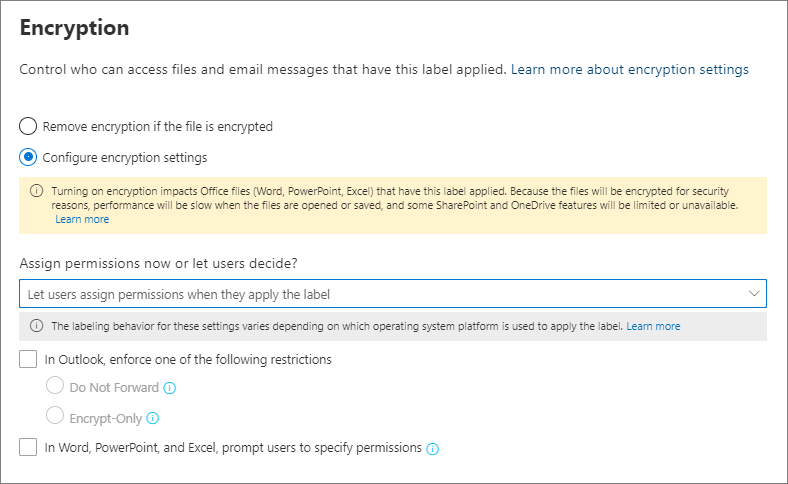

# 민감도 레이블을 사용하여 암호화를 적용하여 콘텐츠 액세스 제한Restrict access to content by using sensitivity labels to apply encryption 

>*[보안 및 규정 준수를 위한 Microsoft 365 라이선싱 지침](https://aka.ms/ComplianceSD)**[Microsoft 365 licensing guidance for security & compliance](https://aka.ms/ComplianceSD).*

민감한 레이블을 만들면 레이블이 적용되는 콘텐츠에 대한 액세스를 제한할 수 있습니다. 예를 들어 민감도 레이블의 암호화 설정으로 다음과 같이 콘텐츠를 보호할 수 있습니다.When you create a sensitivity label, you can restrict access to content that the label will be applied to. For example, with the encryption settings for a sensitivity label, you can protect content so that:

- 조직 내의 사용자만 기밀 문서나 전자 메일을 열 수 있습니다.Only users within your organization can open a confidential document or email.
- 마케팅 부서의 사용자만 프로모션 공지 사항 문서 또는 전자 메일을 편집하고 인쇄할 수 있으며 조직의 다른 모든 사용자는 이를 읽는 것만 가능합니다.Only users in the marketing department can edit and print the promotion announcement document or email, while all other users in your organization can only read it.
- 사용자는 내부 재구성에 대한 소식이 포함된 전자 메일을 전달하거나 정보를 복사할 수 없습니다.Users cannot forward an email or copy information from it that contains news about an internal reorganization.
- 비즈니스 파트너에게 전송되는 현재 가격 목록은 특정 날짜 이후에 열 수 없습니다.The current price list that is sent to business partners cannot be opened after a specified date.

문서 또는 전자 메일이 암호화되면 콘텐츠에 대한 액세스가 다음과 같이 제한됩니다.When a document or email is encrypted, access to the content is restricted, so that it:

- 레이블의 암호화 설정에 따라 권한이 있는 사용자만 암호를 해독할 수 있습니다.Can be decrypted only by users authorized by the label's encryption settings.
- 파일의 이름이 바뀌더라도 조직의 내부 또는 외부에 관계 없이 암호화된 상태로 유지됩니다.Remains encrypted no matter where it resides, inside or outside your organization, even if the file's renamed.
- 작동 중단 시(예: OneDrive 계정에서) 및 전송 중(예: 보낸 전자 메일)에 모두 암호화됩니다.Is encrypted both at rest (for example, in a OneDrive account) and in transit (for example, a sent email).

마지막으로, 관리자가 암호화 적용을 위해 민감도 레이블을 구성할 때 다음 중 하나를 선택할 수 있습니다.Finally, as an admin, when you configure a sensitivity label to apply encryption, you can choose either to:

- 어떤 사용자에게 해당 레이블이 있는 콘텐츠에 어떤 권한을 부여할 것인지 정확하게 결정하도록 **지금 권한을 할당**합니다.**Assign permissions now**, so that you determine exactly which users get which permissions to content with that label.
- 사용자가 콘텐츠에 레이블을 적용하는 경우 **사용자가 권한을 할당하도록** 허용할 수 있습니다.**Let users assign permissions** when they apply the label to content. 이렇게 하면 조직의 사용자가 공동 작업과 작업 수행을 유연하게 할 수 있습니다.This way, you can allow people in your organization some flexibility that they might need to collaborate and get their work done.

암호화 설정은 Microsoft 365 규정 준수 센터, Microsoft 365 보안 센터 또는 보안 및 규정 준수 센터에서 [민감도 레이블 만들기](create-sensitivity-labels.md)를 할 때 사용할 수 있습니다.The encryption settings are available when you [create a sensitivity label](create-sensitivity-labels.md) in the Microsoft 365 compliance center, Microsoft 365 security center, or the Security & Compliance Center.

## 암호화 작동 방식 이해Understand how the encryption works

암호화는 Azure Information Protection의 Azure RMS(Azure 권한 관리 서비스)를 사용합니다.Encryption uses the Azure Rights Management service (Azure RMS) from Azure Information Protection. 이 보호 솔루션은 암호화, ID 및 권한 부여 정책을 사용합니다.This protection solution uses encryption, identity, and authorization policies. 자세한 내용은 Azure Information Protection 문서에서 [Azure 권한 관리란?](https://docs.microsoft.com/azure/information-protection/what-is-azure-rms)을 참조하세요.To learn more, see [What is Azure Rights Management?](https://docs.microsoft.com/azure/information-protection/what-is-azure-rms) from the Azure Information Protection documentation. 

이 암호화 솔루션을 사용하는 경우 **수퍼 사용자** 기능은 권한있는 사용자 및 서비스에서 조직에 대해 암호화된 데이터를 언제든지 읽고 검사 할 수 있도록 해줍니다.When you use this encryption solution, the **super user** feature ensures that authorized people and services can always read and inspect the data that has been encrypted for your organization. 필요한 경우 암호화를 제거하거나 변경할 수 있습니다.If necessary, the encryption can then be removed or changed. 자세한 내용은 [Azure Information Protection 및 검색 서비스 또는 데이터 복구에 대한 수퍼 사용자 구성](https://docs.microsoft.com/azure/information-protection/configure-super-users)을 참조하세요.For more information, see [Configuring super users for Azure Information Protection and discovery services or data recovery](https://docs.microsoft.com/azure/information-protection/configure-super-users).

## 암호화 레이블을 구성하는 방법How to configure a label for encryption

[민감도 레이블을 만들거나 편집](create-sensitivity-labels.md#create-and-configure-sensitivity-labels)하고 마법사의 **암호화** 페이지에서 다음 옵션 중 하나를 선택할 수 있습니다.[Create or edit a sensitivity label](create-sensitivity-labels.md#create-and-configure-sensitivity-labels), and on the **Encryption** page of the wizard, select one of the following options:

- **없음**: 새 레이블의 기본 설정입니다.**None**: The default setting for a new label. 새 암호화가 적용되지 않습니다.No new encryption is applied.
- **적용**: 암호화를 켠 다음 암호화 설정을 지정합니다.**Apply**: Turns on encryption, and you then specify encryption settings.
- **제거**: 문서 또는 전자 메일이 암호화된 경우 암호화를 제거합니다.**Remove**: Removes encryption if the document or email is encrypted.

> [!NOTE]
> **제거** 옵션은 Azure Information Protection 통합 레이블 클라이언트에서만 지원됩니다.The **Remove** option is supported by the Azure Information Protection unified labeling client only. 기본 제공 레이블을 사용하는 경우, 이 옵션이 있는 레이블이 Office 앱과 서비스에 표시되며 이 옵션을 선택하면 암호화 동작은 **없음**과 동일합니다.When you use built-in labeling, a label with this option is visible in Office apps and services and if selected, the encryption behavior is the same as **None**.

암호화 옵션 구성:Configuring the encryption options:

### 레이블이 적용되면 기존 암호화는 어떻게 되나요?What happens to existing encryption when a label's applied

암호화되지 않은 컨텐츠에 민감도 레이블이 적용된 경우 선택할 수 있는 암호화 옵션의 결과는 자명합니다.If a sensitivity label is applied to unencrypted content, the outcome of the encryption options you can select is self-explanatory. 예를 들어 암호화가 **없음**으로 설정되면 콘텐츠가 암호화되지 않은 상태로 유지됩니다.For example, if encryption is set to **None**, the content remains unencrypted.

그러나 콘텐츠가 이미 암호화되었을 수 있습니다.However, the content might be already encrypted. 예를 들어 다른 사용자가 다음을 적용했을 수 있습니다.For example, another user might have applied:

- 레이블에 의해 프롬프트될 때 사용자 정의 권한, Azure Information Protection 클라이언트의 사용자 지정 권한 및 Office 앱 내에서 **제한된 액세스** 문서 보호가 포함된 자체 권한Their own permissions, which include user-defined permissions when prompted by a label, custom permissions by the Azure Information Protection client, and the **Restricted Access** document protection from within an Office app.
- 레이블과 독립적으로 콘텐츠를 암호화하는 Azure 권한 관리 보호 서식 파일.An Azure Rights Management protection template that encrypts the content independently from a label. 이 범주에는 권한 보호를 사용하여 암호화를 적용하는 메일 흐름 규칙이 포함됩니다.This category includes mail flow rules that apply encryption by using rights protection.
- 관리자가 할당한 권한으로 암호화를 적용하는 레이블입니다.A label that applies encryption with permissions assigned by the administrator.

다음 테이블에서는 민감도 레이블이 해당 콘텐츠에 적용되는 경우 기존 암호화가 어떻게 되는지에 대해 설명합니다.The following table identifies what happens to existing encryption when a sensitivity label is applied to that content:

| |**암호화: 없음****Encryption: None**|**암호화: 적용****Encryption: Apply**|**암호화: 제거****Encryption: Remove**|
|:-----|:-----|:-----|:-----|
|**사용자가 지정하는 사용 권한****Permissions specified by a user**|원래 암호화가 유지됨Original encryption is preserved|새 레이블 암호화가 적용됨New label encryption is applied|원래 암호화가 제거됨Original encryption is removed|
|**보호 서식 파일****Protection template**|원래 암호화가 유지됨Original encryption is preserved|새 레이블 암호화가 적용됨New label encryption is applied|원래 암호화가 제거됨Original encryption is removed|
|**관리자 정의 권한이 있는 레이블****Label with administator-defined permissions**|원래 암호화가 제거됨Original encryption is removed|새 레이블 암호화가 적용됨New label encryption is applied|원래 암호화가 제거됨Original encryption is removed|

새 레이블 암호화가 적용되거나 원래 암호화가 제거된 경우, 레이블을 적용하는 사용자에게 이 작업을 지원하는 사용 권한 또는 역할이 있는 경우에만 발생합니다.Note that in the cases where the new label encryption is applied or the original encryption is removed, this happens only if the user applying the label has a usage right or role that supports this action:
- [사용 권한](https://docs.microsoft.com/azure/information-protection/configure-usage-rights#usage-rights-and-descriptions) 내보내기 또는 모든 권한.The [usage right](https://docs.microsoft.com/azure/information-protection/configure-usage-rights#usage-rights-and-descriptions) Export or Full Control.
- [권한 관리 발급자 또는 권한 관리 소유자](https://docs.microsoft.com/azure/information-protection/configure-usage-rights#rights-management-issuer-and-rights-management-owner) 또는 [수퍼 사용자](https://docs.microsoft.com/azure/information-protection/configure-super-users)의 역할The role of [Rights Management issuer or Rights Management owner](https://docs.microsoft.com/azure/information-protection/configure-usage-rights#rights-management-issuer-and-rights-management-owner), or [super user](https://docs.microsoft.com/azure/information-protection/configure-super-users).

사용자에게 이러한 권한이나 역할이 없는 경우에는 레이블을 적용할 수 없으므로 원래 암호화가 유지됩니다.If the user doesn't have one of these rights or roles, the label can't be applied and so the original encryption is preserved. 사용자에게 다음 메시지가 표시됩니다. **민감도 레이블을 변경할 권한이 없습니다. 콘텐츠 소유자에게 문의하세요.**The user sees the following message: **You don't have permission to make this change to the sensitivity label. Please contact the content owner.**

예를 들어 전자 메일 메시지에 전달 안 함을 적용한 사람은 전자 메일의 권한 관리 소유자이므로 스레드의 레이블을 다시 지정하여 암호화를 대체하거나 제거할 수 있습니다.For example, the person who applies Do Not Forward to an email message can relabel the thread to replace the encryption or remove it, because they are the Rights Management owner for the email. 그러나 수퍼 사용자를 제외하고 이 전자 메일 수신자는 요구되는 사용 권한이 없기 때문에 레이블을 변경할 수 없습니다.But with the exception of super users, recipients of this email can't relabel it because they don't have the required usage rights.

#### 암호화된 전자 메일 메시지에 대한 전자 메일 첨부 파일Email attachments for encrypted email messages

어떤 방법으로든 전자 메일 메시지를 암호화하면 전자 메일에 첨부된 암호화되지 않은 Office 문서는 자동으로 동일한 암호화 설정을 상속합니다.When an email message is encrypted by any method, any unencrypted Office documents that are attached to the email automatically inherit the same encryption settings.

이미 암호화된 후 첨부 파일로 추가된 문서는 항상 원래 암호화를 유지합니다.Documents that are already encrypted and then added as attachments always preserve their original encryption. 

## 암호화 설정 구성Configure encryption settings

마법사의 **암호화** 페이지에서 **적용**을 선택하여 민감도 레이블을 작성하거나 편집할 때 다음을 수행할지 여부를 선택하세요.When you select **Apply** on the **Encryption** page of the wizard to create or edit a sensitivity label, choose whether to:

- 레이블을 적용한 콘텐츠에 대해 어떤 사용자에게 어떤 권한을 부여할 것인지 정확하게 결정할 수 있도록 **지금 권한을 할당**합니다.**Assign permissions now**, so that you can determine exactly which users get which permissions to content that has the label applied. 자세한 내용은 다음 섹션 [지금 권한 할당](#assign-permissions-now)을 참조하세요.For more information, see the next section [Assign permissions now](#assign-permissions-now).
- 사용자가 콘텐츠에 레이블을 적용하는 경우 **사용자가 권한을 할당하도록 허용**할 수 있습니다.**Let users assign permissions** when your users apply the label to content. 이 옵션을 사용하면 조직의 사용자가 공동 작업과 작업 수행을 유연하게 할 수 있습니다.With this option, you can allow people in your organization some flexibility that they might need to collaborate and get their work done. 자세한 내용은이 페이지에서 [권한을 할당할 수 있도록 허용](#let-users-assign-permissions) 섹션을 참조하세요.For more information, see the [Let users assign permissions](#let-users-assign-permissions) section on this page.

예를 들어, 가장 중요한 콘텐츠에 적용되는 **극비**라는 민감도 레이블을 사용하는 경우 해당 콘텐츠의 사용 권한 유형을 받을 사용자를 결정하는 것이 좋습니다.For example, if you have a sensitivity label named **Highly Confidential** that will be applied to your most sensitive content, you might want to decide now who gets what type of permissions to that content.

또는 **비즈니스 계약서**라는 민감도 레이블을 사용하고, 사용자 조직의 워크플로에 따라 사용자가 임시로 다른 사용자와 이 콘텐츠에 대해 공동 작업해야 하는 경우, 사용자가 레이블을 지정할 때 권한을 받을 사용자를 결정할 수 있습니다.Alternatively, if you have a sensitivity label named **Business Contracts**, and your organization's workflow requires that your people collaborate on this content with different people on an ad hoc basis, you might want to allow your users to decide who gets permissions when they assign the label. 이와 같은 유연성을 갖추어 사용자의 생산성은 향상되고 관리자가 특정 시나리오를 해결하기 위해 새 민감도 레이블을 업데이트하거나 만들어야 하는 요청은 줄일 수 있습니다.This flexibility both helps your users' productivity and reduces the requests for your admins to update or create new sensitivity labels to address specific scenarios.

지금 권한을 할당할지 사용자가 권한을 할당하도록 허용할지 선택:Choosing whether to assign permissions now or let users assign permissions: 

## 지금 권한 할당Assign permissions now

다음 옵션을 사용하여 이 레이블이 적용되는 전자 메일 또는 문서에 액세스할 수 있는 사용자를 제어합니다.Use the following options to control who can access email or documents to which this label is applied. 다음을 수행할 수 있습니다.You can:

1. 특정 날짜 또는 레이블을 지정한 후 특정 일수가 지나면 **레이블을 지정한 콘텐츠에 대한 액세스가 만료**되도록 합니다. 이 기간 이후 사용자는 레이블을 지정한 항목을 열 수 없습니다. 날짜를 지정하는 경우 표준 시간대의 해당 날짜 자정에 적용됩니다. 일부 전자 메일 클라이언트의 경우 캐싱 메커니즘으로 인해 만료 기능이 적용되지 않을 수 있으며 만료 날짜가 지난 전자 메일이 표시될 수 있습니다.**Allow access to labeled content to expire**, either on a specific date or after a specific number of days after the label is applied. After this time, users won't be able to open the labeled item. If you specify a date, it is effective midnight on that date in your current time zone. (Note that some email clients might not enforce expiration and show emails past their expiration date, due to their caching mechanisms.)

2. **오프라인 액세스 허용**을 허용 안 함, 항상 허용 또는 레이블을 적용한 후 특정 일수 동안 허용합니다. 오프라인 액세스를 허용 안 함 또는 며칠로 제한하는 경우 임계값에 도달하면 사용자를 다시 인증해야 하고 액세스 권한이 기록됩니다. 자세한 내용은 권한 관리 사용 라이선스에 대한 다음 섹션을 참조하세요.**Allow offline access** never, always, or for a specific number of days after the label is applied. If you restrict offline access to never or a number of days, when that threshold is reached, users must be reauthenticated and their access is logged. For more information, see the next section on the Rights Management use license.

암호화된 콘텐츠의 액세스 제어 설정:Settings for access control for encrypted content:

### 오프라인 액세스에 대한 권한 관리 사용 라이선스Rights Management use license for offline access

사용자가 Azure 권한 관리 서비스의 암호화로 보호된 문서 또는 전자 메일을 열면 해당 콘텐츠에 대한 Azure 권한 관리 사용 라이선스가 사용자에게 부여됩니다.When a user opens a document or email that's been protected by encryption from the Azure Rights Management service, an Azure Rights Management use license for that content is granted to the user. 이 사용 라이선스는 문서 또는 전자 메일에 대한 사용자의 사용 권한 및 콘텐츠를 암호화하는 데 사용된 암호화 키를 포함하는 인증서입니다.This use license is a certificate that contains the user's usage rights for the document or email, and the encryption key that was used to encrypt the content. 사용 라이센스는 만료 날짜(설정된 경우)와 사용 라이선스 유효 기간도 포함합니다.The use license also contains an expiration date if this has been set, and how long the use license is valid.

만료 날짜가 설정된 경우 테넌트에 대한 기본 사용 라이선스의 유효 기간은 30일입니다. 사용 라이센스 동안 콘텐츠에 대해 다시 인증받지 않습니다. 이 프로세스를 통해 인터넷에 연결하지 않고도 보호된 문서 또는 전자 메일을 계속 열 수 있습니다. 사용 라이선스 유효 기간이 만료되면 다음에 사용자가 보호된 문서 또는 전자 메일에 액세스할 때 다시 인증받아야 합니다.If no expiration date has been set, the default use license validity period for a tenant is 30 days. For the duration of the use license, the user is not reauthenticated or reauthorized for the content. This process lets the user continue to open the protected document or email without an internet connection. When the use license validity period expires, the next time the user accesses the protected document or email, the user must be reauthenticated and reauthorized.

재인증 외에도 정책 및 사용자 그룹 구성원 자격이 다시 평가됩니다.In addition to reauthentication, the encryption settings and user group membership is reevaluated. 즉, 사용자가 마지막으로 콘텐츠에 액세스한 시점에서 암호화 설정이나 그룹 구성원에 변경된 사항이 있는 경우 사용자에게 동일한 문서 또는 전자 메일에 대해 다른 액세스 결과를 제공할 수 있습니다.This means that users could experience different access results for the same document or email if there are changes in the encryption settings or group membership from when they last accessed the content.

기본값 30일 설정을 변경하는 방법을 알아보려면 [권한 관리 사용 라이선스](https://docs.microsoft.com/azure/information-protection/configure-usage-rights#rights-management-use-license)를 참조하세요.To learn how to change the default 30-day setting, see [Rights Management use license](https://docs.microsoft.com/azure/information-protection/configure-usage-rights#rights-management-use-license).

### 특정 사용자 또는 그룹에 사용 권한 할당Assign permissions to specific users or groups

특정 사용자만 레이블이 지정된 콘텐츠와 상호 작용할 수 있도록 다음과 같이 사용 권한을 부여할 수 있습니다.You can grant permissions to specific people so that only they can interact with the labeled content:

1. 먼저 사용 권한을 할당할 사용자 또는 그룹을 레이블이 지정된 콘텐츠에 추가합니다.First, add users or groups that will be assigned permissions to the labeled content.

2. 그런 다음 레이블이 지정된 컨텐츠에 대해 해당 사용자에게 어떤 권한이 있는지 선택합니다.Then, choose which permissions those users should have for the labeled content.

사용 권한 할당:Assigning permissions:

#### 사용자 또는 그룹 추가Add users or groups

권한을 할당할 때 다음을 선택할 수 있습니다.When you assign permissions, you can choose:

- 조직의 모든 사용자(모든 테넌트 구성원). 이 설정에서는 게스트 계정이 제외됩니다.Everyone in your organization (all tenant members). This setting excludes guest accounts.

- 인증된 모든 사용자.Any authenticated users. 이 설정을 선택하기 전에 이 설정의 [요구 사항과 제한 사항](#requirements-and-limitations-for-add-any-authenticated-users)을 이해해야 합니다.Make sure you understand the [requirements and limitations](#requirements-and-limitations-for-add-any-authenticated-users) of this setting before selecting it.

- 모든 특정 사용자 또는 전자 메일 사용이 가능한 보안 그룹, 분배 그룹 또는 Azure AD의 Microsoft 365 그룹([이전 Office 365 그룹](https://techcommunity.microsoft.com/t5/microsoft-365-blog/office-365-groups-will-become-microsoft-365-groups/ba-p/1303601)).Any specific user or email-enabled security group, distribution group, or Microsoft 365 group ([formerly Office 365 group](https://techcommunity.microsoft.com/t5/microsoft-365-blog/office-365-groups-will-become-microsoft-365-groups/ba-p/1303601)) in Azure AD. Microsoft 365 그룹에는 정적 또는 [동적 구성원](https://docs.microsoft.com/azure/active-directory/users-groups-roles/groups-create-rule)이 있을 수 있습니다.The Microsoft 365 group can have static or [dynamic membership](https://docs.microsoft.com/azure/active-directory/users-groups-roles/groups-create-rule). 이 그룹 유형은 Azure AD와 동기화되지 않으며 전자 메일을 사용할 수없는 보안 그룹을 사용할 수 없으므로 [Exchange에서 동적 메일 그룹](https://docs.microsoft.com/Exchange/recipients/dynamic-distribution-groups/dynamic-distribution-groups?view=exchserver-2019)을 사용할 수 없습니다.Note that you can't use a [dynamic distribution group from Exchange](https://docs.microsoft.com/Exchange/recipients/dynamic-distribution-groups/dynamic-distribution-groups?view=exchserver-2019) because this group type isn't synchronized to Azure AD, and you can't use a security group that isn't email-enabled.

- 모든 전자 메일 주소 또는 도메인.Any email address or domain. 해당 조직에서 도메인 이름을 입력하여 Azure AD를 사용하는 다른 조직의 모든 사용자를 지정하려면 이 옵션을 사용합니다.Use this option to specify all users in another organization who uses Azure AD, by entering any domain name from that organization. 소셜 공급자의 도메인 이름(예: **gmail.com**, **hotmail.com** 또는 **outlook.com**)을 입력하여 소셜 공급자에 이 옵션을 사용할 수도 있습니다.You can also use this option for social providers, by entering their domain name such as **gmail.com**, **hotmail.com**, or **outlook.com**.
    
    > [!NOTE]
    > Azure AD를 사용하는 조직에서 도메인을 지정할 경우 해당 특정 도메인에 대한 액세스를 제한할 수 없습니다.If you specify a domain from an organization that uses Azure AD, you can't restrict access to that specific domain. 대신에 Azure AD에서 확인된 모든 도메인은 사용자가 지정한 도메인 이름을 소유하는 테넌트에 자동으로 포함됩니다.Instead, all verified domains in Azure AD are automatically included for the tenant that owns the domain name you specify.

모든 테넌트 구성원을 선택하거나 디렉토리를 탐색할 때 사용자 또는 그룹에 전자 메일 주소가 있어야 합니다.When you choose all tenant members or browse the directory, the users or groups must have an email address.

모범 사례로 사용자 대신 그룹을 사용할 수 있습니다. 이 전략으로 더 간단하게 구성할 수 있습니다.As a best practice, use groups rather than users. This strategy keeps your configuration simpler.

##### **인증된 사용자 추가**에 대한 요구 사항 및 제한 사항Requirements and limitations for **Add any authenticated users**

이 설정은 레이블이 암호화하는 컨텐츠에 액세스할 수 있는 사람을 제한하지 않고 컨텐츠를 계속 암호화하고 컨텐츠 사용 방법(권한) 및 액세스 방법(만료 및 오프라인 액세스)을 제한하는 옵션을 제공합니다.This setting doesn't restrict who can access the content that the label encrypts, while still encrypting the content and providing you with options to restrict how the content can be used (permissions), and accessed (expiry and offline access). 그러나 암호화된 콘텐츠를 여는 응용 프로그램은 사용되는 인증을 지원할 수 있어야 합니다.However, the application opening the encrypted content must be able to support the authentication being used. 이러한 이유로 Google과 같은 페더레이션된 소셜 공급자 및 일회용 암호 인증은 Exchange Online을 사용할 때에 한해 전자 메일에 대해서만 작동합니다.For this reason, federated social providers such as Google, and onetime passcode authentication work for email only, and only when you use Exchange Online. Microsoft 계정은 Office 365 앱 및 [Azure Information Protection 뷰어](https://portal.azurerms.com/#/download)와 함께 사용할 수 있습니다.Microsoft accounts can be used with Office 365 apps and the [Azure Information Protection viewer](https://portal.azurerms.com/#/download).

인증된 사용자 설정에 대한 일반적인 시나리오는 다음과 같습니다.Some typical scenarios for the any authenticated users setting:
- 누가 컨텐츠를 보는지는 신경 쓰지 않지만 컨텐츠 사용 방법을 제한하려고 합니다.You don't mind who views the content, but you want to restrict how it is used. 예를 들어 내용의 편집, 복사 또는 인쇄를 원하지 않습니다.For example, you don't want the content to be edited, copied, or printed.
- 컨텐츠에 액세스하는 사람을 제한할 필요는 없지만 누가 컨텐츠를 여는지 확인하고 싶을 수 있습니다.You don't need to restrict who accesses the content, but you want to be able to confirm who opens it.
- 콘텐츠는 저장 및 전송시 암호화되어야 하지만 액세스 제어는 필요하지 않습니다.You have a requirement that the content must be encrypted at rest and in transit, but it doesn't require access controls.

#### 사용 권한 선택Choose permissions

해당 사용자 또는 그룹에 허용할 사용 권한을 선택하면 다음 중 하나를 선택할 수 있습니다.When you choose which permissions to allow for those users or groups, you can select either:

- 미리 설정된 권한 그룹(예: 공동 작성 또는 검토자)이 있는 [미리 정의된 권한 수준](https://docs.microsoft.com/azure/information-protection/configure-usage-rights#rights-included-in-permissions-levels).A [predefined permissions level](https://docs.microsoft.com/azure/information-protection/configure-usage-rights#rights-included-in-permissions-levels) with a preset group of rights, such as Co-Author or Reviewer.
- 하나 이상의 사용 권한을 선택하는 경우 권한 사용자 지정Custom permissions, where you choose one or more usage rights.

적절한 사용 권한을 선택하는 데 도움이 되는 자세한 내용은 [사용 권한 및 설명](https://docs.microsoft.com/azure/information-protection/configure-usage-rights#usage-rights-and-descriptions)을 참조하세요.For more information to help you select the appropriate permissions, see [Usage rights and descriptions](https://docs.microsoft.com/azure/information-protection/configure-usage-rights#usage-rights-and-descriptions).  

동일한 레이블로 다른 사용자에게 다른 권한을 부여할 수 있습니다. 예를 들어 아래에 있는 스크린샷과 같이 단일 레이블에서 일부 사용자를 검토자로 할당하고 다른 사용자를 공동 작성자로 할당할 수 있습니다.Note that the same label can grant different permissions to different users. For example, a single label can assign some users as Reviewer and a different user as Co-author, as shown in the following screenshot.

이를 위해서는 사용자 또는 그룹을 추가하고 사용 권한을 할당하고 해당 설정을 저장합니다. 그런 다음 매번 이 단계를 반복하여 사용자를 추가하고 권한을 할당하고 설정을 저장합니다. 이 구성을 필요한 만큼 수행하여 여러 사용자에게 서로 다른 권한을 정의할 수 있습니다.To do this, add users or groups, assign them permissions, and save those settings. Then repeat these steps, adding users and assigning them permissions, saving the settings each time. You can repeat this configuration as often as necessary, to define different permissions for different users.

#### 권한 관리 발급자(민감도 레이블을 적용한 사용자)는 항상 모든 권한을 갖습니다Rights Management issuer (user applying the sensitivity label) always has Full Control

민감도 레이블의 암호화는 Azure Information Protection의 Azure 권한 관리 서비스를 사용합니다.Encryption for a sensitivity label uses the Azure Rights Management service from Azure Information Protection. 사용자가 암호화를 사용하여 문서 또는 전자 메일을 보호하기 위해 중요도 레이블을 적용하면 해당 사용자는 해당 내용에 대한 권한 관리 발급자가 됩니다.When a user applies a sensitivity label to protect a document or email by using encryption, that user becomes the Rights Management issuer for that content.

권한 관리 발급자는 문서 또는 전자 메일에 대한 모든 권한을 항상 부여받으며, 또한 다음과 같은 권한을 갖습니다.The Rights Management issuer is always granted Full Control permissions for the document or email, and in addition:

- 암호화 설정에 만료 날짜가 포함된 경우 권한 관리 발급자는 해당 날짜 이후에도 여전히 문서 또는 전자 메일을 열고 편집할 수 있습니다.If the encryption settings include an expiration date, the Rights Management issuer can still open and edit the document or email after that date.
- 권한 관리 발급자는 문서 또는 전자 메일을 언제든지 오프라인으로 액세스할 수 있습니다.The Rights Management issuer can always access the document or email offline.
- 권한 관리 발급자는 권한이 해지된 후에도 문서를 열 수 있습니다.The Rights Management issuer can still open a document after it is revoked.

자세한 내용은 [권한 관리 발급자 및 권한 관리 소유자](https://docs.microsoft.com/azure/information-protection/configure-usage-rights#rights-management-issuer-and-rights-management-owner)를 참조하세요.For more information, see [Rights Management issuer and Rights Management owner](https://docs.microsoft.com/azure/information-protection/configure-usage-rights#rights-management-issuer-and-rights-management-owner).

## 사용자가 권한을 할당하도록 허용Let users assign permissions

다음 옵션을 사용하여 사용자가 민감도 레이블을 콘텐츠에 수동으로 추가할 때 사용자가 권한을 할당하도록 허용할 수 있습니다.You can use these options to let users assign permissions when they manually apply a sensitivity label to content:

- Outlook의 경우 사용자는 선택된 수신자에 대해 [전달 안 함](https://docs.microsoft.com/azure/information-protection/configure-usage-rights#do-not-forward-option-for-emails) 옵션에 해당하는 제한을 선택할 수 있습니다.In Outlook, a user can select restrictions equivalent to the [Do Not Forward](https://docs.microsoft.com/azure/information-protection/configure-usage-rights#do-not-forward-option-for-emails) option for their chosen recipients.

- Word, PowerPoint 및 Excel의 경우 사용자에게 특정 사용자, 그룹 또는 조직에 대한 고유 권한을 선택하라는 메시지가 표시됩니다.In Word, PowerPoint, and Excel, a user is prompted to select their own permissions for specific users, groups, or organizations. 
    > [!NOTE]
    > Word, PowerPoint 및 Excel에 대한 이 옵션은 Azure Information Protection 통합 레이블 클라이언트에서 지원됩니다.This option for Word, PowerPoint, and Excel is supported by the Azure Information Protection unified labeling client. 내장 레이블을 사용하는 앱의 경우 현재 [Windows 및 Mac용 미리보기](sensitivity-labels-office-apps.md#sensitivity-label-capabilities-in-word-excel-and-powerpoint)에서 지원됩니다.For apps that use built-in labeling, support is currently in [preview for Windows and Mac](sensitivity-labels-office-apps.md#sensitivity-label-capabilities-in-word-excel-and-powerpoint). 
    > 
    > 이 옵션이 선택되었지만 사용자의 앱에서 지원되지 않는 경우, 해당 레이블은 사용자에게 표시되지 않거나 (현재 iOS 및 Android 용 미리 보기에서 배포 중) 레이블이 일관성을 위해 표시되지만. 사용자에게 설명 메시지와 함께 적용될 수 없습니다.If this option is selected but isn't supported for a user's app, either that label doesn't display to the user, or (currently rolling out in preview for iOS and Android) the label displays for consistency, but it can't be applied with an explanation message to users.

옵션이 지원되면 다음 표를 사용하여 사용자에게 민감도 레이블이 표시되는 시기를 식별하세요.When the options are supported, use the following table to identify when users see the sensitivity label:

|설정Setting |Outlook에 표시되는 레이블Label visible in Outlook|Word, Excel, PowerPoint에서 표시되는 레이블Label visible in Word, Excel, PowerPoint|
|:-----|:-----|:-----|:-----|
|**Outlook에서 전달 안 함 옵션에 해당하는 제한 사항을 적용합니다.****In Outlook, enforce restrictions equivalent to the Do Not Forward option**|예Yes |아니요No |
|**Word, PowerPoint 및 Excel에서 사용자에게 사용 권한을 지정하라는 메시지가 표시됩니다.****In Word, PowerPoint, and Excel, prompt users to specify permissions**|아니요No |예Yes|

두 설정을 모두 선택하면 레이블은 Outlook과 Word, Excel 및 PowerPoint 모두에 표시됩니다.When both settings are selected, the label is therefore visible in both Outlook and in Word, Excel, and PowerPoint.

사용자가 권한을 할당할 수 있도록 허용하는 민감도 레이블은 사용자가 수동으로만 콘텐츠에 적용할 수 있으므로, 이를 추천 레이블로 자동 적용 또는 사용할 수 없습니다.A sensitivity label that lets users assign permissions can be applied to content only manually by users; it can't be auto-applied or used as a recommended label.

사용자 할당 권한 구성:Configuring the user-assigned permissions:

### Outlook 제한 사항Outlook restrictions

Outlook에서, 사용자가 메시지에 권한을 할당하도록 허용하는 민감도 레이블을 적용하는 경우 이 제한 사항은 전달 금지 옵션과 동일합니다.In Outlook, when a user applies a sensitivity label that lets them assign permissions to a message, the restrictions are the same as the Do Not Forward option. 사용자에게 메시지 맨 위에 레이블 이름과 설명이 표시됩니다. 이는 콘텐츠가 보호되고 있음을 나타냅니다.The user will see the label name and description at the top of the message, which indicates the content's being protected. Word, PowerPoint 및 Excel([다음 섹션](#word-powerpoint-and-excel-permissions) 참조)과 달리, 사용자에게 특정 권한을 선택 하라는 메시지가 표시되지 않습니다.Unlike Word, PowerPoint, and Excel (see the [next section](#word-powerpoint-and-excel-permissions)), users aren't prompted to select specific permissions.

전달 금지 옵션이 전자 메일에 적용되는 경우, 전자 메일이 암호화되므로 받는 사람을 인증해야 합니다.When the Do Not Forward option is applied to an email, the email is encrypted and recipients must be authenticated. 그런 다음, 받는 사람이 이를 전달하거나, 인쇄하거나, 복사할 수 없습니다.Then, the recipients cannot forward it, print it, or copy from it. 예를 들어, Outlook 클라이언트에서 전달 단추를 사용할 수 없고, 다른 이름으로 저장 및 인쇄 메뉴 옵션도 사용할 수 없으며, 받는 사람, 참조 또는 숨은 참조 상자에서 받는 사람을 추가하거나 변경할 수 없습니다.For example, in the Outlook client, the Forward button is not available, the Save As and Print menu options are not available, and you cannot add or change recipients in the To, Cc, or Bcc boxes.

전자 메일에 첨부된 암호화되지 않은 Office 문서는 자동으로 동일한 제한 사항을 상속합니다.Unencrypted Office documents that are attached to the email automatically inherit the same restrictions. 이 문서에 적용되는 사용 권한은 콘텐츠 편집, 편집, 저장, 보기, 열기, 읽기, 모든 매크로입니다.The usage rights applied to these documents are Edit Content, Edit; Save; View, Open, Read; and Allow Macros. 사용자가 첨부 파일에 대해 다른 권한을 요구하는 경우 또는 첨부 파일이 상속된 보호를 지원하는 Office 문서가 아닌 경우, 사용자가 파일을 전자 메일에 첨부하기 전에 파일을 보호해야 합니다.If the user wants different usage rights for an attachment, or the attachment is not an Office document that supports this inherited protection, the user needs to protect the file before attaching it to the email.

### Word, PowerPoint 및 Excel 권한Word, PowerPoint, and Excel permissions

Word, PowerPoint 및 Excel에서 사용자가 문서에 사용 권한을 할당할 수 있는 민감도 레이블을 적용하면 암호화 적용시 사용자와 사용 권한을 선택하라는 메시지가 표시됩니다.In Word, PowerPoint, and Excel, when a user applies a sensitivity label that lets them assign permissions to a document, they are prompted to specify their choice of users and permissions when the encryption is applied.

예를 들어 Azure Information Protection 통합 레이블 클라이언트를 사용하면 다음을 수행할 수 있습니다.For example, with the Azure Information Protection unified labeling client, users can:

- 뷰어(보기 전용 권한 할당) 또는 공동 작성자(보기, 편집, 복사 및 인쇄 권한 할당)와 같은 권한 수준을 선택합니다.Select a permission level, such as Viewer (which assigns View Only permission) or Co-Author (which assigns View, Edit, Copy, and Print permissions).
- 사용자, 그룹 또는 조직을 선택합니다.Select users, groups, or organizations. 여기에는 조직의 내부 또는 외부 사용자가 모두 포함될 수 있습니다.This can include people both inside or outside your organizations.
- 선택한 사용자가 콘텐츠에 액세스할 수 없는 만료 날짜를 설정합니다.Set an expiration date, after which the selected users cannot access the content. 자세한 내용은 위에 있는 섹션 [오프라인 액세스용 권한 관리 사용자 라이선스](#rights-management-use-license-for-offline-access)를 참조하세요.For more information, see the above section [Rights Management use license for offline access](#rights-management-use-license-for-offline-access).

내장 레이블의 경우 유저가 다음을 선택할 경우 동일한 대화 상자가 표시됩니다.For built-in labeling, users see the same dialog box if they select the following:

- Windows: **파일** 탭 > **정보** > **문서 보호** > **액세스 제한** > **제한된 액세스**Windows: **File** tab > **Info** > **Protect Document** > **Restrict Access** > **Restricted Access**

- MacOS: **검토** 탭 > **보호** > **사용 권한** > **제한된 액세스**MacOS: **Review** tab > **Protection** > **Permissions** > **Restricted Access**

## 암호화 설정의 예제 구성Example configurations for the encryption settings

아래에 나오는 각 예제에 대해 [민감도 레이블을 만들거나 편집](create-sensitivity-labels.md#create-and-configure-sensitivity-labels) 시 마법사의 **암호화**페이지에서 구성을 수행합니다.For each example that follows, do the configuration from the **Encryption** page of the wizard when you [create or edit a sensitivity label](create-sensitivity-labels.md#create-and-configure-sensitivity-labels). 먼저 **암호화**가 **적용**으로 설정되어 있는지 확인합니다.First make sure that the **Encryption** is set to **Apply**:

### 예제 1: 적용되는 레이블 암호화된 전자 메일을 Gmail 계정으로 보내기 위해 전달하지 않습니다.Example 1: Label that applies Do Not Forward to send an encrypted email to a Gmail account

이 레이블은 Outlook 및 웹에서의 Outlook에서만 사용할 수 있으며 Exchange Online을 사용해야 합니다.This label displays only in Outlook and Outlook on the web, and you must use Exchange Online. 사용자가 Gmail 계정(또는 조직 외부의 다른 전자 메일 계정)을 사용하는 사용자에게 암호화된 전자 메일을 보내야 하는 경우 이 레이블을 선택하도록 지시합니다.Instruct users to select this label when they need to send an encrypted email to people using a Gmail account (or any other email account outside your organization). 

사용자는 **받는 사람** 상자에 Gmail 전자 메일 주소를 입력합니다.Your users type the Gmail email address in the **To** box.  그런 다음 레이블을 선택하면 전달 금지 옵션이 전자 메일에 자동으로 추가됩니다.Then, they select the label and the Do Not Forward option is automatically added to the email. 그 결과 받는 사람이 **다른 이름으로 저장** 옵션을 사용하여 전자 메일을 전달, 인쇄, 복사하거나 혹은 사서함 외부에 해당 전자 메일을 저장하는 것을 방지할 수 있습니다.The result is that recipients cannot forward the email, or print it, copy from it, or save the email outside their mailbox by using the **Save As** option. 

1. **암호화** 페이지에서 다음을 수행합니다. **사용 권한을 지금 할당 혹은 사용자가 결정하도록 하기**에서 **사용자가 레이블을 적용할 때 사용 권한을 할당하도록 하기**를 선택합니다.On the **Encryption** page: For **Assign permissions now or let users decide?** select **Let users assign permissions when they apply the label**.

3. 확인란 선택: **Outlook에서 전달 금지 옵션에 해당하는 제한 사항을 적용합니다**.Select the checkbox: **In Outlook, enforce restrictions equivalent to the Do Not Forward option**.

4. 선택된 경우 확인란의 선택을 취소합니다. **Word, PowerPoint 및 Excel에서 사용자에게 사용 권한을 지정하라는 메시지를 표시합니다**.If selected, clear the checkbox: **In Word, PowerPoint, and Excel, prompt users to specify permissions**.

5. **다음**을 선택하고 마법사를 완료합니다.Select **Next** and complete the wizard.

### 예제 2: 다른 조직의 모든 사용자에게 읽기 전용 권한을 제한하는 레이블Example 2: Label that restricts read-only permission to all users in another organization

이 레이블은 매우 중요한 문서를 읽기 전용으로 공유하는 데 적합하며, 이러한 문서를 보려면 항상 인터넷 연결이 필요합니다.This label is suitable for sharing very sensitive documents as read-only, and the documents always require an internet connection to view them.

이 레이블은 전자 메일에 적합하지 않습니다.This label is not suitable for emails.

1. **암호화** 페이지에서 다음을 수행합니다. **사용 권한을 지금 할당 혹은 사용자가 결정하도록 하기**에서 **지금 사용 권한을 할당**을 선택합니다.On the **Encryption** page: For **Assign permissions now or let users decide?** select **Assign permissions now**.

3. **오프라인 액세스를 허용**은 **절대 불허**를 선택합니다.For **Allow offline access**, select **Never**.

4. **사용 권한 할당**을 선택합니다.Select **Assign permissions**.

3. **사용 권한 할당** 창에서 **이 전자 메일 주소 또는 도메인 추가**를 선택합니다.On the **Assign permissions** pane, select **Add these email address or domains**.

4. 텍스트 상자에 다른 조직의 도메인 이름을 입력 합니다(예:**fabrikam.com**).In the text box, enter the name of a domain from the other organization, for example, **fabrikam.com**. 그런 다음 **추가**를 선택합니다.Then select **Add**.

5. **현재 또는 사용자 지정으로 사용 권한 선택**을 선택합니다.Select **Choose permissions from present or custom**.

6. **현재 또는 사용자 지정으로 사용 권한 선택** 창에서 드롭다운 상자를 선택하고 **뷰어**를 선택한 다음 **저장**을 선택합니다.On the **Choose permissions from present or custom** pane, select the dropdown box, select **Viewer**, and then select **Save**.

6. **사용 권한 할당** 창으로 돌아가서 **저장**을 선택합니다.Back on the **Assign Permissions** pane, select **Save**.

7. **암호화**페이지에서 **다음**을 선택하고 마법사를 완료합니다.On the **Encryption** page, select **Next** and complete the wizard.

### 예제 3: 콘텐츠를 암호화하는 기존 레이블에 외부 사용자 추가Example 3: Add external users to an existing label that encrypts content

추가하는 새 사용자는 이 레이블로 이미 보호된 문서 및 전자 메일을 열 수 있습니다.The new users that you add will be able open documents and emails that have already been protected with this label. 이러한 사용자에게 부여하는 사용 권한은 기존 사용자의 사용 권한과 다를 수 있습니다.The permissions that you grant these users can be different from the permissions that the existing users have.

1. **암호화** 페이지에서 다음을 수행합니다. **사용 권한을 지금 할당 혹은 사용자가 결정하도록 하기**에서 반드시 **지금 사용 권한을 할당**이 선택되도록 합니다.On the **Encryption** page: For **Assign permissions now or let users decide?** make sure **Assign permissions now** is selected.

2. **사용 권한 할당**을 선택합니다.Select **Assign permissions**.

3. **사용 권한 할당** 창에서 **이 전자 메일 주소 또는 도메인 추가**를 선택합니다.On the **Assign permissions** pane, select **Add these email address or domains**.

4. 텍스트 상자에 추가할 첫 번째 사용자(또는 그룹)의 전자 메일 주소를 입력한 다음 **추가**를 선택합니다.In the text box, enter the email address of the first user (or group) to add, and then select **Add**.

5. **현재 또는 사용자 지정으로 사용 권한 선택**을 선택합니다.Select **Choose permissions from present or custom**.

6. **현재 또는 사용자 지정으로 사용 권한 선택** 창에서 이 사용자(또는 그룹)에 대한 사용 권한을 선택하고 **저장**을 선택합니다.On the **Choose permissions from present or custom** pane, select the permissions for this user (or group), and then select **Save**.

7. **사용 권한 할당** 창으로 돌아가서 이 레이블에 추가하려는 각 사용자(또는 그룹)에 대해 3 ~ 6단계를 반복합니다.Back on the **Assign Permissions** pane, repeat steps 3 through 6 for each user (or group) that you want to add to this label. 그런 다음 **저장**을 클릭합니다.Then click **Save**.

8. **암호화**페이지에서 **다음**을 선택하고 마법사를 완료합니다.On the **Encryption** page, select **Next** and complete the wizard.

### 예제 4: 콘텐츠를 암호화하지만 액세스할 수 있는 사용자를 제한하지 않는 레이블Example 4: Label that encrypts content but doesn't restrict who can access it

이 구성은 전자 메일이나 문서를 암호화하는 데 사용자, 그룹 또는 도메인을 지정할 필요가 없다는 장점이 있습니다.This configuration has the advantage that you don't need to specify users, groups, or domains to encrypt an email or document. 콘텐츠는 계속 암호화되므로 사용 권한, 만료 날짜 및 오프라인 액세스를 계속 지정할 수 있습니다.The content will still be encrypted and you can still specify usage rights, an expiry date, and offline access. 

보호되는 문서 또는 전자 메일을 열 수 있는 사용자를 제한할 필요가 없는 경우에만 이 구성을 사용합니다.Use this configuration only when you do not need to restrict who can open the protected document or email. [이 설정에 대한 자세한 내용More information about this setting](#requirements-and-limitations-for-add-any-authenticated-users)

1. **암호화** 페이지에서 다음을 수행합니다. **사용 권한을 지금 할당 혹은 사용자가 결정하도록 하기**에서 반드시 **지금 사용 권한을 할당**이 선택되도록 합니다.On the **Encryption** page: For **Assign permissions now or let users decide?** make sure **Assign permissions now** is selected.

2. 필요한 경우 **콘텐츠에 대한 사용자 액세스 만료** 및 **오프라인 액세스 허용**에 대한 설정을 구성합니다.Configure settings for **User access to content expires** and **Allow offline access** as required.

3. **사용 권한 할당**을 선택합니다.Select **Assign permissions**.

4. **사용 권한 할당** 창에서 **인증된 사용자 추가**를 선택합니다.On the **Assign permissions** pane, select **Add any authenticated users**. 
    
    **사용자 및 그룹**의 경우 **인증된 사용자**가 자동으로 추가되는 것을 확인할 수 있습니다.For **Users and groups**, you see **AuthenticatedUsers** automatically added. 이 값은 변경할 수 없고 삭제만 가능하며 삭제 시 **인증된 사용자 추가** 선택이 취소됩니다.You can't change this value, only delete it, which cancels the **Add any authenticated users** selection.

5. **현재 또는 사용자 지정으로 사용 권한 선택**을 선택합니다.Select **Choose permissions from present or custom**.

6. **현재 또는 사용자 지정으로 사용 권한 선택** 창에서 드롭다운 상자를 선택하고 원하는 **뷰어** 사용 권한을 선택한 다음 **저장**을 선택합니다.On the **Choose permissions from present or custom** pane, select the dropdown box, select **Viewer**permissions you want, and then select **Save**.

7. **사용 권한 할당** 창으로 돌아가서 **저장**을 선택합니다.Back on the **Assign Permissions** pane, select **Save**.

8. **암호화**페이지에서 **다음**을 선택하고 마법사를 완료합니다.On the **Encryption** page, select **Next** and complete the wizard.

## 암호화된 콘텐츠의 고려 사항Considerations for encrypted content

가장 중요한 문서와 전자 메일을 암호화하면 권한있는 사용자만 이 데이터에 액세스할 수 있습니다.Encrypting your most sensitive documents and emails helps to ensure that only authorized people can access this data. 그러나 다음과 같은 몇 가지 고려해야 할 사항이 있습니다.However, there are some considerations to take into account:

- 조직에서 [SharePoint 및 OneDrive(공개 미리보기)에서 Office 파일에 대한 민감도 레이블을 활성화](sensitivity-labels-sharepoint-onedrive-files.md)하지 않은 경우:If your organization hasn't [enabled sensitivity labels for Office files in SharePoint and OneDrive (public preview)](sensitivity-labels-sharepoint-onedrive-files.md):
    
    - 암호화된 파일에는 검색, eDiscovery 및 Delve가 작동하지 않습니다.Search, eDiscovery, and Delve will not work for encrypted files. 
    - DLP 정책은 이러한 암호화된 파일의 메타 데이터(보존 레이블 정보 포함)에 대해서는 작동하지만 파일의 내용(예: 파일 내의 신용 카드 번호)에는 적용되지 않습니다.DLP policies work for the metadata of these encrypted files (including retention label information) but not the content of these files (such as credit card numbers within files).
    - 사용자는 웹에서 Office를 사용하여 암호화된 파일을 열 수 없습니다.Users can't open encrypted files using Office on the web. SharePoint 및 OneDrive에서 Office 파일에 대한 민감도 레이블을 사용하도록 설정하면 사용자는 웹에서 Office를 사용하여 암호화된 파일을 열 수 있습니다. 이 경우에는 온-프레미스 키("자체 키 보유" 또는 HYOK)를 사용하여 적용된 암호화와 민감도 레이블과 독립적으로 적용된 암호화를 포함하는 몇 가지 [제한 사항](sensitivity-labels-sharepoint-onedrive-files.md#limitations)이 있습니다.When sensitivity labels for Office files in SharePoint and OneDrive is enabled, users can use Office on the web to open encrypted files, with some [limitations](sensitivity-labels-sharepoint-onedrive-files.md#limitations) that include encryption that has been applied with an on-premises key (known as "hold your own key", or HYOK), and encryption that has been applied independently from a sensitivity label.

- 여러 사용자가 동시에 암호화된 파일을 편집하려면 모두 웹용 Office를 사용해야 합니다.For multiple users to edit an encrypted file at the same time, they must all be using Office for the web. 그와 같은 상황이 아니고 파일이 이미 열려있는 경우:If this isn't the case, and the file is already open:
    
    - Office 앱(Windows, Mac, Android 및 iOS)에서, 사용자에게는 파일을 체크아웃한 사용자의 이름과 함께 **사용 중인 파일** 메시지가 표시됩니다.In Office apps (Windows, Mac, Android, and iOS), users see a **File In Use** message with the name of the person who has checked out the file. 그런 다음 읽기 전용 사본을 보거나 파일 사본을 저장 및 편집하고, 파일을 사용할 수 있을 때 알림을 받을 수 있습니다.They can then view a read-only copy or save and edit a copy of the file, and receive notification when the file is available.
    - 웹용 Office에서, 사용자에게는 다른 사람과 함께 문서를 편집할 수 없다는 오류 메시지가 표시됩니다.In Office for the web, users see an error message that they can't edit the document with other people. 그런 다음 **읽기용 보기에서 열기**를 선택할 수 있습니다.They can then select **Open in Reading View**.

- 암호화된 파일에 대해서는 Office 앱(Windows, Mac, Android 및 iOS)의 [자동 저장](https://support.office.com/article/what-is-autosave-6d6bd723-ebfd-4e40-b5f6-ae6e8088f7a5) 기능이 비활성화되어 있습니다.The [AutoSave](https://support.office.com/article/what-is-autosave-6d6bd723-ebfd-4e40-b5f6-ae6e8088f7a5) functionality in Office apps (Windows, Mac, Android, and iOS) is disabled for encrypted files. 사용자에게는 자동 저장을 설정하기 전에 사용 권한의 제한을 해제해야 한다는 메시지가 표시됩니다.Users see a message that the file has restricted permissions that must be removed before AutoSave can be turned on.

- 암호화된 파일은 Office 앱(Windows, Mac, Android 및 iOS)에서 여는 데 시간이 더 걸릴 수 있습니다.Encrypted files might take longer to open in Office apps (Windows, Mac, Android, and iOS).

- 암호화된 파일에 대한 다음 작업은 Office 앱(Windows, Mac, Android 및 iOS)에서 지원되지 않으며 사용자에게 문제가 있다는 오류 메시지가 표시됩니다.The following actions for encrypted files aren't supported from Office apps (Windows, Mac, Android, and iOS), and users see an error message that something went wrong. 그러나 SharePoint 기능을 대안으로 사용할 수 있습니다.However, SharePoint functionality can be used as an alternative:
    
    - 이전 버전의 사본 보기, 복원 및 저장.View, restore, and save copies of previous versions. 대안으로, 사용자는 [목록 또는 라이브러리에 대한 버전 관리를 활성화하고 구성할 때](https://support.office.com/article/enable-and-configure-versioning-for-a-list-or-library-1555d642-23ee-446a-990a-bcab618c7a37) 웹에서 Office를 사용하여 이러한 작업을 수행할 수 있습니다.As an alternative, users can do these actions using Office on the web when you [enable and configure versioning for a list or library](https://support.office.com/article/enable-and-configure-versioning-for-a-list-or-library-1555d642-23ee-446a-990a-bcab618c7a37). 
    - 파일 이름 또는 위치 변경.Change the name or location of files. 대안으로, 사용자는 SharePoint에서 [문서 라이브러리에서 파일, 폴더 또는 링크 이름 바꾸기](https://support.office.com/article/rename-a-file-folder-or-link-in-a-document-library-bc493c1a-921f-4bc1-a7f6-985ce11bb185)를 할 수 있습니다.As an alternative, users can [rename a file, folder, or link in a document library](https://support.office.com/article/rename-a-file-folder-or-link-in-a-document-library-bc493c1a-921f-4bc1-a7f6-985ce11bb185) in SharePoint.

민감도 레이블로 암호화된 파일에 대한 최상의 공동 작업 환경을 위해서는 웹용 Office와 [SharePoint 및 OneDrive의 Office 파일에 대해 민감도 레이블을 사용](sensitivity-labels-sharepoint-onedrive-files.md)하는 것이 좋습니다.For the best collaboration experience for files that are encrypted by a sensitivity label, we recommend you use [sensitivity labels for Office files in SharePoint and OneDrive](sensitivity-labels-sharepoint-onedrive-files.md) and Office for the web. 

## 중요한 필수 구성 요소Important prerequisites

암호화를 사용하려면 먼저 몇 가지 구성 작업을 수행해야 합니다.Before you can use encryption, you might need to do some configuration tasks.

### Azure Information Protection에서 보호 활성화Activate protection from Azure Information Protection

민감도 레이블이 암호화를 적용하려면 테넌트에 대해 Azure Information Protection의 보호 서비스(Azure 권한 관리)가 활성화되어 있어야 합니다.For sensitivity labels to apply encryption, the protection service (Azure Rights Management) from Azure Information Protection must be activated for your tenant. 새 테넌트에서는 이것이 기본 설정이지만 서비스를 수동으로 활성화해야 할 수도 있습니다.In newer tenants, this is the default setting, but you might need to manually activate the service. 자세한 내용은 [Azure Information Protection에서 보호 서비스 활성화](https://docs.microsoft.com/azure/information-protection/activate-service)를 참조하세요.For more information, see [Activating the protection service from Azure Information Protection](https://docs.microsoft.com/azure/information-protection/activate-service).

### Azure Information Protection에 대한 Exchange 구성Configure Exchange for Azure Information Protection

사용자가 Outlook에서 전자 메일을 암호화하기 위해 레이블을 적용하기 전에 Azure Information Protection을 위해 Exchange를 구성할 필요는 없습니다.Exchange does not have to be configured for Azure Information Protection before users can apply labels in Outlook to encrypt their emails. 그러나 Exchange에 Azure Information Protection을 구성하기 전에는 Exchange에서 Azure 권한 관리 보호 사용의 모든 기능을 이용할 수 없습니다.However, until Exchange is configured for Azure Information Protection, you do not get the full functionality of using Azure Rights Management protection with Exchange.
 
예를 들어 사용자는 휴대폰 또는 웹에서의 Outlook으로 암호화된 전자 메일을 볼 수 없으며 검색 시 암호화된 전자 메일이 인덱싱되지 않으며 권한 관리 보호를 위한 Exchange Online DLP를 구성할 수 없습니다.For example, users cannot view encrypted emails on mobile phones or with Outlook on the web, encrypted emails cannot be indexed for search, and you cannot configure Exchange Online DLP for Rights Management protection. 

Exchange에서 이러한 추가 시나리오를 지원할 수 있는지 확인하려면 다음을 참조하세요.To ensure that Exchange can support these additional scenarios, see the following:

- Exchange Online의 경우 [Exchange Online: IRM 구성](https://docs.microsoft.com/azure/information-protection/configure-office365#exchangeonline-irm-configuration)에 대한 설명서를 참고하세요.For Exchange Online, see the instructions for [Exchange Online: IRM Configuration](https://docs.microsoft.com/azure/information-protection/configure-office365#exchangeonline-irm-configuration).
- Exchange 온-프레미스의 경우 [RMS 커넥터를 배포하고 Exchange 서버를 구성](https://docs.microsoft.com/azure/information-protection/deploy-rms-connector)해야 합니다.For Exchange on-premises, you must deploy the [RMS connector and configure your Exchange servers](https://docs.microsoft.com/azure/information-protection/deploy-rms-connector). 
