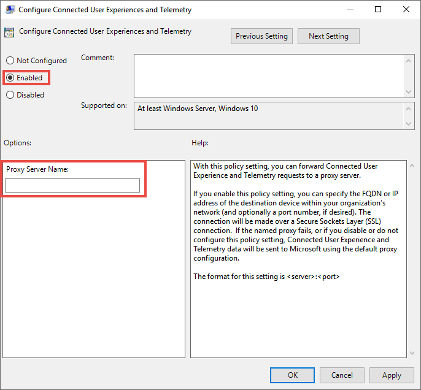

# <a name="configure-device-proxy-and-internet-connection-settings-for-endpoint-dlp"></a>끝점 DLP에 대한 장치 프록시 및 인터넷 연결 설정을 구성합니다.

Microsoft Endpoint DLP는 Microsoft Windows HTTP(WinHTTP)를 사용하여 데이터를 보고하고 Microsoft 끝점 클라우드 서비스와 통신합니다. 포함된 Endpoint DLP는 LocalSystem(로컬 시스템) 계정을 사용하여 시스템 컨텍스트에서 실행됩니다.

> [!TIP]
> 전달 프록시를 인터넷 게이트웨이로 사용하는 조직의 경우 네트워크 보호를 사용하여 프록시 뒤에서 조사할 수 있습니다. 자세한 내용은 [전달 프록시 뒤에서 발생하는 연결 이벤트 조사](/windows/security/threat-protection/microsoft-defender-atp/investigate-behind-proxy)를 참조하십시오.

WinHTTP 구성 설정은 Windows Internet(WinINet) 인터넷 검색 프록시 설정과 독립적이며 다음 자동 검색 방법을 사용해야만 프록시 서버를 검색할 수 있습니다.

- 투명한 프록시
- WPAD(웹 프록시 자동 검색) 프로토콜

> [!NOTE]
> 네트워크 토폴로지에서 투명 프록시 또는 WPAD를 사용하는 경우에는 특별한 구성 설정이 필요하지 않습니다. 프록시의 엔드포인트 URL 제외에 대한 Defender에 대한 자세한 내용은 [프록시 서버 ](#enable-access-to-endpoint-dlp-cloud-service-urls-in-the-proxy-server)에서 엔드포인트 DLP 클라우드 서비스 URL 액세스 사용을 참조하십시오.

- 수동 정적 프록시 구성:
  - 레지스트리 기반 구성
  - netsh 명령을 사용하여 구성된 WinHTTP – 안정적인 토폴로지의 데스크톱에만 적합합니다(예: 동일한 프록시 뒤에 있는 회사 네트워크의 데스크톱).

## <a name="configure-the-proxy-server-manually-using-a-registry-based-static-proxy"></a>레지스트리 기반 정적 프록시를 사용하여 프록시 서버를 수동으로 구성합니다.

인터넷에 연결할 수 없는 끝점 디바이스의 경우 레지스트리 기반 정적 프록시를 구성해야 합니다. Microsoft 끝점 DLP만 진단 데이터를 보고하고 Microsoft 끝점 클라우드 서비스와 통신할 수 있도록 구성해야 합니다.

정적 프록시는 GP(그룹 정책)를 통해 구성할 수 있습니다. 그룹 정책은 다음에서 확인할 수 있습니다.

1. **관리 템플릿 > Windows 구성 요소 > 데이터 수집 및 미리 보기 빌드 > 연결된 사용자 환경 및 원격 측정 서비스에 대한 인증된 프록시 사용 구성** 을 엽니다.

2. **사용**(으)로 설정하고 **인증 프록시 사용 안 함** 을 선택합니다.

   

3. **관리 템플릿 > Windows 구성 요소 > 데이터 수집 및 미리 보기 빌드 > 연결된 사용자 환경 및 원격 메트릭** 을(를) 여십시오.

   프록시 구성

   

   정책은 레지스트리 키 `HKLM\Software\Policies\Microsoft\Windows\DataCollection`에서 레지스트리 값 `TelemetryProxyServer`을(를) REG_SZ로, `DisableEnterpriseAuthProxy`을(를) REG_DWORD로 설정합니다.

   레지스트리 값 TelemetryProxyServer는 이 형식 \<server name or ip\>:\<port\>입니다. 예: **10.0.0.6:8080**

   레지스트리 값 `DisableEnterpriseAuthProxy`을(를) 1로 설정해야 합니다.

## <a name="configure-the-proxy-server-manually-using-netsh-command"></a>netsh 명령을 사용하여 프록시 서버를 수동으로 구성합니다.

netsh를 사용하여 시스템 전체의 정적 프록시를 구성합니다.

> [!NOTE]
> 이는 Windows 서비스를 포함하여 기본 프록시로 WinHTTP를 사용하는 모든 응용 프로그램에 영향을 미칩니다. - 토폴로지를 변경하는 노트북(예: 사무실에서 가정으로)은 netsh에서 오작동합니다. 레지스트리 기반 정적 프록시 구성을 사용합니다.

1. 승격된 명령줄을 열기:
    1. **시작**(으)로 이동하고 **cmd** 를 입력하십시오.
    2. **명령 프롬프트** 을(를) 마우스 오른쪽 버튼으로 클릭하고 **관리자**(으)로 실행을 선택합니다.

2. 다음 명령을 입력하고 **Enter** 를 누릅니다.

   `netsh winhttp set proxy <proxy>:<port>`

   예: **netsh winhttp 설정 프록시 10.0.0.6:8080**

3. winhttp 프록시를 재설정하려면 다음 명령을 입력하고 **Enter** 를 누릅니다.

   `netsh winhttp reset proxy`

자세한 내용은 [Netsh 명령 구문, 컨텍스트 및 포맷](/windows-server/networking/technologies/netsh/netsh-contexts)을 참조하십시오.

## <a name="enable-access-to-endpoint-dlp-cloud-service-urls-in-the-proxy-server"></a>프록시 서버에서 끝점 DLP 클라우드 서비스 URL에 대한 액세스를 활성화합니다.

프록시 또는 방화벽이 기본적으로 모든 트래픽을 차단하고 특정 도메인만 통과하도록 허용하는 경우 다운로드 가능한 시트에 나열된 도메인을 허용된 도메인 목록에 추가합니다.

이 [다운로드 가능한 스프레드시트](https://download.microsoft.com/download/8/a/5/8a51eee5-cd02-431c-9d78-a58b7f77c070/mde-urls.xlsx)에는 네트워크가 연결할 수 있어야 하는 서비스 및 관련 URL이 나열됩니다. 이러한 URL에 대한 액세스를 거부하는 방화벽 또는 네트워크 필터링 규칙이 없는지 확인하거나 해당 URL에 대한 허용 규칙을 만들어야 할 수 있습니다.

프록시 또는 방화벽에 HTTPS 검색(SSL 검사)이 활성화된 경우 위의 표에 나열된 도메인을 HTTPS 검색에서 제외합니다.
끝점 DLP가 시스템 컨텍스트에서 연결되므로 프록시 또는 방화벽이 익명 트래픽을 차단하는 경우 이전에 나열된 URL에서 익명 트래픽이 허용되는지 확인합니다.

## <a name="verify-client-connectivity-to-microsoft-cloud-service-urls"></a>Microsoft 클라우드 서비스 URL에 대한 클라이언트 연결을 확인합니다.

프록시 구성이 성공적으로 완료되었는지 확인합니다. WinHTTP는 사용자 환경의 프록시 서버를 통해 검색할 수 있으며 프록시 서버가 엔드포인트용 Defender 서비스 URL에 대한 트래픽을 허용하는지 여부를 확인할 수 있습니다.

1. 끝점 DLP가 실행 중인 PC에 [MDATP 클라이언트 분석기 도구](https://aka.ms/mdatpanalyzer)을(를) 다운로드합니다.
2. 장치에서 MDATPC Client Analyzer.zip의 내용을 추출합니다.
3. 승격된 명령줄을 열기:
    1. **시작**(으)로 이동하고 **cmd** 를 입력하십시오.
    1. **명령 프롬프트** 을(를) 마우스 오른쪽 버튼으로 클릭하고 **관리자**(으)로 실행을 선택합니다.
4. 다음 명령을 입력하고 **Enter** 를 누릅니다.

   `HardDrivePath\MDATPClientAnalyzer.cmd`

   예를 들어 *HardDrivePath* 를 MDATPC 클라이언트 Analyzer 도구가 다운로드된 경로로 대체합니다.

   **C:\Work\tools\MDATPClientAnalyzer\MDATPClientAnalyzer.cmd**

5. _HardDrivePath*에 사용된 폴더의 도구에서 생성한 **MDPCclient AnalyzerResult.zip** _ 파일의 압축을 풉니다.

6. **MDATPClient AnalyzerResult.txt** 를 열고 프록시 구성 단계를 수행하여 서버 검색 및 서비스 URL 액세스를 설정했는지 확인합니다.  도구는 엔드포인트용 Defender 클라이언트와 상호 작용하도록 구성된 엔드포인트용 Defender 서비스 URL의 연결을 확인합니다. 그런 다음 엔드포인트용 Defender 서비스와 통신하는 데 잠재적으로 사용될 수있는 각 URL에 대한 결과를 **MDATPClientAnalyzerResult.txt** 파일에 인쇄합니다. 예를 들어 다음과 같습니다.

   ```DOS
   Testing URL: https://xxx.microsoft.com/xxx
   1 - Default proxy: Succeeded (200)
   2 - Proxy auto discovery (WPAD): Succeeded (200)
   3 - Proxy disabled: Succeeded (200)
   4 - Named proxy: Doesn't exist
   5 - Command-line proxy: Doesn't exist
   ```

연결 옵션 중 하나 이상이 (200) 상태를 반환하는 경우 엔드포인트용 Defender 클라이언트는 이 연결 방법을 사용하여 테스트된 URL과 제대로 통신할 수 있습니다.

그러나 연결 검사 결과가 오류를 나타내는 경우 HTTP 오류가 표시됩니다(HTTP 상태 코드 참조). 그런 다음 [프록시 서버에서 끝점 DLP 클라우드 서비스 URL에 대한 액세스 활성화](#enable-access-to-endpoint-dlp-cloud-service-urls-in-the-proxy-server)에 표시된 표의 URL을 사용할 수 있습니다. 사용할 URL은 온보드 절차 중에 선택한 영역에 따라 다릅니다.

> [!NOTE]
>
> 연결 분석기 도구가 ASR 규칙 [PSExec 및 WMI 명령에서 생성된 블록 프로세스 생성](/windows/security/threat-protection/windows-defender-exploit-guard/attack-surface-reduction#attack-surface-reduction-rules)과 호환되지 않습니다. 연결 도구를 실행하려면 이 규칙을 일시적으로 비활성화해야 합니다.
>
> 원격 측정 프록시 서버를 설정할 때 레지스트리 또는 그룹 정책을 통해 엔드포인트용 Defender가 정의된 프록시에 액세스할 수 없는 경우 직접으로 되돌아갑니다. 관련 항목:
>
> - Windows 10 디바이스 온보딩
> - Microsoft 엔드포인트 DLP 온보딩 문제 해결

## <a name="see-also"></a>참고 항목

- [끝점 데이터 손실 방지에 대한 자세한 정보](endpoint-dlp-learn-about.md)
- [엔드포인트 데이터 손실 방지 사용](endpoint-dlp-using.md)
- [데이터 손실 방지에 대해 알아보기](dlp-learn-about-dlp.md)
- [DLP 정책 만들기, 테스트 및 조정](create-test-tune-dlp-policy.md)
- [활동 탐색기 시작하기](data-classification-activity-explorer.md)
- [엔드포인트용 Microsoft Defender](/windows/security/threat-protection/)
- [Windows 10 컴퓨터용 온보딩 도구 및 방법](/windows/security/threat-protection/microsoft-defender-atp/configure-endpoints)
- [Microsoft 365 구독](https://www.microsoft.com/microsoft-365/compare-microsoft-365-enterprise-plans?rtc=1)
- [Azure AD 가입 장치](/azure/active-directory/devices/concept-azure-ad-join)
- [Chromium 기반 새 Microsoft Edge 다운로드하기](https://support.microsoft.com/help/4501095/download-the-new-microsoft-edge-based-on-chromium)
