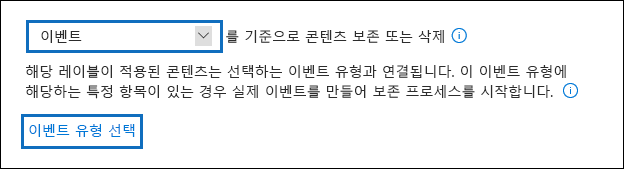
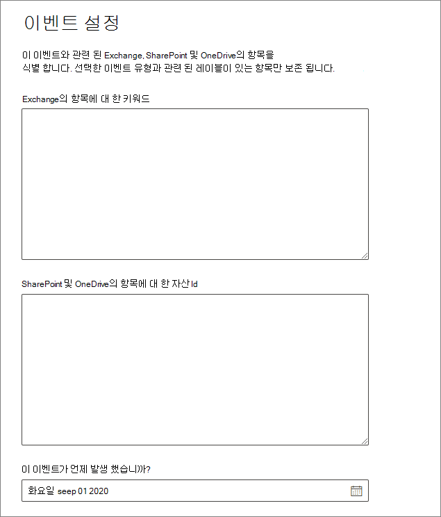

# <a name="start-retention-when-an-event-occurs"></a>이벤트가 발생할 때 보존 시작

>*[보안 및 규정 준수를 위한 Microsoft 365 라이선싱 지침](/office365/servicedescriptions/microsoft-365-service-descriptions/microsoft-365-tenantlevel-services-licensing-guidance/microsoft-365-security-compliance-licensing-guidance)*

콘텐츠를 보존할 때 보존 기간은 대개 콘텐츠의 사용 기간을 기준으로 합니다. 예를 들어, 문서를 만들고 7년 동안 보존한 후 삭제할 수 있습니다. 그렇지만 [보존 레이블](retention.md#retention-labels)을 구성할 때 특정 유형의 이벤트가 발생하는 경우를 기준으로 보존 기간을 지정할 수도 있습니다. 이벤트는 보존 기간의 시작을 트리거하며, 해당 유형의 이벤트에 적용된 보존 레이블이 있는 모든 콘텐츠에 대해 레이블 보존 작업이 적용됩니다.
  
이벤트 기반 보존 사용 예제:
  
- **직원이 조직을 떠나는 경우** 직원 기록은 직원이 조직을 나가는 시점부터 10년 동안 보존되어야 한다고 가정합니다. 10년이 경과된 후에 해당 직원의 채용, 성과 및 퇴사와 관련된 모든 문서를 처리해야 합니다. 10년 보존 기간을 트리거하는 이벤트는 직원이 조직을 퇴사하는 것입니다. 
    
- **계약 만료** 계약과 관련된 모든 레코드는 계약이 만료되는 시점부터 5년 동안 보존되어야 한다고 가정합니다. 5년 보존 기간을 트리거하는 이벤트는 계약 만료입니다. 
    
- **제품 수명** 조직은 기술 사양과 같은 콘텐츠에 대해 제품의 마지막 제조일과 관련된 보존 요구 사항을 유지할 수 있습니다. 이 경우 마지막 제조일이 보존 기간을 트리거하는 이벤트가 됩니다. 
    
이벤트 기반 보존은 일반적으로 기록 관리 프로세스의 일부로 사용됩니다. 이것은 다음을 의미합니다.
  
- 이벤트 기반의 보존 레이블 또한 일반적으로 레코드 관리 솔루션의 일환으로 항목을 레코드로 표시합니다. 자세한 내용은 [레코드 관리에 대한 자세한 정보](records-management.md)를 참조하세요.

- 레코드로 선언되었으나 해당 이벤트 트리거가 아직 발생하지 않은 문서는 문서의 보존 기간을 트리거하는 이벤트가 발생할 때까지 무기한 보존됩니다(레코드를 영구히 삭제할 수 없음).
    
- 일반적으로 이벤트를 기준으로 하는 보존 레이블은 보존 기간이 끝나면 처리 검토를 트리거하므로 기록 관리자는 콘텐츠를 수동으로 검토하고 처리할 수 있습니다. 자세한 내용은 [콘텐츠의 처리](disposition.md)를 참조하세요.
    

이벤트를 기준으로 하는 보존 레이블은 Microsoft 365의 보존 레이블과 동일한 기능을 제공합니다. 자세한 내용은 [보존 정책 및 보존 레이블에 대한 자세한 정보](retention.md)를 참조하세요.

## <a name="understanding-the-relationship-between-event-types-labels-events-and-asset-ids"></a>이벤트 유형, 레이블, 이벤트 및 자산 ID 간 관계 이해

이벤트 기반 보존을 성공적으로 사용하려면 다음과 같은 다이어그램 및 설명에 있는 것처럼 이벤트 유형, 보존 레이블, 이벤트 및 자산 ID 간 관계를 이해하는 것이 중요합니다. 
  

  

  
1. 다양한 콘텐츠 형식에 대한 보존 레이블을 만든 후 특정 이벤트 유형에 연결합니다. 예를 들어, 다양한 유형의 제품 파일 및 기록에 대한 보존 레이블은 해당 기록을 제품이 수명에 도달한 시점부터 10년 동안 보존해야 하므로 제품 수명이라는 이벤트 유형에 연결됩니다.
    
2. 사용자(일반적으로 레코드 관리자)는 해당 보존 레이블을 콘텐츠에 적용하고(SharePoint 및 OneDrive의 문서의 경우) 각 항목에 대한 자산 ID를 입력합니다. 이 예에서 자산 ID는 조직에서 사용하는 제품 이름 또는 코드입니다. 그런 다음 각 제품의 레코드에 보존 레이블이 할당되고 각 레코드에는 자산 ID가 포함된 속성이 있습니다. 다이어그램은 조직의 모든 제품 레코드에 대한 **모든 콘텐츠** 를 나타내며 각 항목에는 해당 레코드가 있는 제품의 자산 ID가 있습니다. 
    
3. 제품 수명은 이벤트 유형입니다. 특정 제품이 제품 수명에 도달하는 것이 이벤트입니다. 해당 이벤트 유형의 이벤트가 발생할 때(이 경우 제품이 수명 종료에 도달) 다음을 지정하는 이벤트를 만듭니다.
    
   - 자산 ID(SharePoint 및 OneDrive 문서 관련)
    
   - 키워드(Exchange 항목 관련). 이 예제에서 조직은 Exchange 항목에 대한 키워드가 SharePoint 및 OneDrive 문서에 대한 자산 ID와 동일하도록 제품 레코드를 포함하는 메시지에 제품 코드를 사용합니다.
    
   - 이벤트가 발생한 날짜. 이 날짜는 보존 기간의 시작 날짜로 사용됩니다. 이 날짜는 현재, 과거 또는 미래의 날짜가 될 수 있습니다.

4. 이벤트를 생성하면 해당 이벤트 유형의 보존 레이블이 있고 지정된 자산 ID 또는 키워드를 포함하는 모든 콘텐츠에 해당 이벤트 날짜가 동기화됩니다. 다른 보존 레이블과 마찬가지로 이 동기화에도 최대 7일이 걸릴 수 있습니다. 이전 다이어그램에서 빨간색으로 동그라미 친 모든 항목의 보존 기간은 이 이벤트에 의해 트리거되었습니다. 즉, 이 제품의 수명이 다하면 해당 이벤트가 해당 제품의 레코드에 대한 보존 기간을 트리거합니다.

이벤트에 대해 자산 ID 또는 키워드를 지정하지 않으면 해당 이벤트 유형의 보존 레이블이 지정된 **모든 콘텐츠** 의 보존 기간이 해당 이벤트의 의해 트리거됩니다. 이는 이전 다이어그램에서 모든 콘텐츠가 유지되기 시작한다는 것을 의미합니다. 사용자가 의도한 것이 아닐 수도 있습니다.

마지막으로, 각 보존 레이블에는 고유한 보존 설정이 지정되어 있습니다. 이 예제에서는 모두 10년을 지정하지만, 각 레이블이 다른 보존 기간을 갖는 경우 이벤트가 보존 레이블을 트리거할 수 있습니다.
  
## <a name="how-to-set-up-event-driven-retention"></a>이벤트 구동 보존 설정 방법

이벤트 구동 보존의 상위 레벨 워구동우우:
  

  
> [!TIP]
> SharePont에서 관리 속성을 사용하여 보존 레이블을 자동 적용하고 이벤트 중심 보존을 구현하는 방법에 대한 자세한 시나리오는 [보존 레이블로 SharePoint에서 문서의 수명 주기 관리](auto-apply-retention-labels-scenario.md)를 참조하세요.

### <a name="step-1-create-a-label-whose-retention-period-is-based-on-an-event"></a>1단계: 보존 기간이 이벤트에 따라 조정되는 레이블 만들기

보존 레이블을 만들고 구성하려면 [보존 레이블 만들기](./create-apply-retention-labels.md#step-1-create-retention-labels) 지침을 참조하세요. 이벤트 기반 보존에만 해당하는 경우 보존 레이블 만들기 마법사의 **보존 설정 정의** 페이지에서 **기반 보존 기간** 을 시작한 후 드롭다운 목록에서 기본 이벤트 유형 중 하나를 선택하거나 **새 이벤트 유형 만들기** 를 선택하여 직접 만듭니다.



이벤트 유형은 보존 레이블을 연결할 이벤트에 대한 일반적인 설명입니다.

기본 이벤트 유형에는 손쉬운 식별을 위해 드롭다운 목록에 이름이 표시되는 **(이벤트 유형)** **레코드 관리** > **이벤트** > **이벤트 유형 관리** 를 참조하여 이벤트 유형을 보고 만들 수도 있습니다.

이벤트 기반 보존에는 다음과 같은 보존 설정이 필요합니다.
  
- 콘텐츠를 보존합니다.
    
- 보존 기간이 끝나면 콘텐츠를 자동으로 삭제하거나 처리 검토를 트리거합니다.
  
이벤트 기반 보존은 보통 레코드로 선언되는 콘텐츠에 사용되므로 콘텐츠를 [레코드](records-management.md#records)로 표시하는 옵션도 선택해야 하는지 확인하는 것이 좋습니다.

새 이벤트 유형을 만드는 대신 기존 이벤트 유형을 사용하고 있는 경우에는 3 단계로 건너뜁니다.

> [!NOTE]
> 이벤트 유형을 선택하고 보존 레이블을 저장한 후에는 이벤트 유형을 변경할 수 없습니다.

### <a name="step-2-create-a-new-event-type-for-your-label"></a>단계 2: 레이블에 새 이벤트 유형 만들기

보존 설정의 경우 **새 이벤트 유형 만들기** 를 선택했다면 이벤트 유형에 대한 이름과 설명을 입력합니다. 그 후 **다음**, **제출**, 그리고 **완료** 를 선택합니다.

**보존 설정 정의** 페이지에 돌아와서 **기준에 따라 보존 기간을 시작하려면** 드롭다운 목록을 사용하여 만든 이벤트 유형을 선택합니다.

  
### <a name="step-3-publish-or-auto-apply-the-event-based-retention-labels"></a>3단계: 이벤트 기반 보존 레이블 게시 혹은 자동 적용

다른 보존 레이블과 마찬가지로 이벤트 기반 레이블을 게시하거나 자동 적용해야만 콘텐츠에 수동 또는 자동으로 적용됩니다.
- [보존 레이블을 만들고 앱에 적용하기](create-apply-retention-labels.md)
- [보존 레이블을 콘텐츠에 자동으로 적용하기](apply-retention-labels-automatically.md)

### <a name="step-4-enter-an-asset-id"></a>4단계: 자산 ID 입력

이벤트 기반 레이블이 콘텐츠에 적용된 후에 각 항목에 대한 자산 ID를 입력할 수 있습니다. 예를 들어 조직에서는 다음을 사용할 수 있습니다.
  
- 특정 제품에 대한 콘텐츠만 보존하는 데 사용할 수 있는 제품 코드
    
- 특정 프로젝트에 대한 콘텐츠만 보존하는 데 사용할 수 있는 프로젝트 코드
    
- 특정 사람에 대한 콘텐츠만 보존하는 데 사용할 수 있는 직원 ID
    
자산 ID는 단순히 SharePoint 및 OneDrive에서 사용할 수 있는 또 다른 문서 속성입니다. 조직에서 이미 다른 문서 속성 및 ID를 사용하여 콘텐츠를 분류하고 있을 수 있습니다. 그렇다면 이벤트를 생성할 때 해당 속성과 값을 사용할 수도 있습니다. 다음 6단계를 참조하세요. 중요한 점은 문서 속성에서 일부 *속성:값* 조합을 사용하여 해당 항목을 이벤트 유형과 연결해야 한다는 것입니다.
  

  
### <a name="step-5-create-an-event"></a>5단계: 이벤트 만들기

해당 이벤트 유형의 특정 인스턴스가 발생하면(예: 제품이 수명 종료에 도달), Microsoft 365 규정 준수 센터의 **레코드 관리** > **이벤트** 페이지로 가서 **+만들기** 를 선택하여 이벤트를 만듭니다. 여기에서 이벤트를 생성하여 트리거합니다.


테넌트당 최대 100만 이벤트를 지원합니다.

### <a name="step-6-choose-the-same-event-type-used-by-the-label-in-step-2"></a>6단계: 2단계에서 레이블에 사용된 것과 동일한 이벤트 유형 선택

이벤트를 만들 때 2단계에서 보존 레이블 설정에 지정되는 동일한 이벤트 유형을 선택합니다. 예를 들어 **제품 수명** 을 레이블 설정의 이벤트 유형으로 선택했다면 이벤트를 만들 때 **제품 수명** 을 선택합니다. 해당 이벤트 유형에 적용된 보존 레이블이 있는 콘텐츠에 대해서만 보존 기간이 트리거됩니다.


또는 다양한 이벤트 유형을 포함하는 여러 보존 레이블 이벤트를 만들어야 하는 경우 **기존 레이블 선택** 옵션을 선택합니다. 그런 다음 이 이벤트와 연결하려는 이벤트 유형에 대해 구성된 레이블을 선택합니다.

### <a name="step-7-enter-keywords-or-query-for-exchange-asset-id-for-sharepoint-and-onedrive"></a>7단계: Exchange, SharePoint 자산 ID 및 OneDrive에 대한 키워드 또는 쿼리 입력

이제 콘텐츠의 범위를 좁힐 수 있습니다. Exchange 콘텐츠의 경우 키워드 또는 쿼리를 지정하여 이 작업을 수행합니다. SharePoint 및 OneDrive 콘텐츠의 경우 자산 ID를 지정하여 이 작업을 수행합니다.

Exchange 항목의 경우 키워드 또는 KQL(키워드 쿼리 언어)을 사용하는 쿼리를 사용합니다. 쿼리 구문에 대한 자세한 내용은 [KQL(Keyword Query Language) 구문 참조](/sharepoint/dev/general-development/keyword-query-language-kql-syntax-reference)를 참조하세요. Exchange에 대한 사용할 수 있는 검색 가능 속성에 대한 자세한 내용은 [내용 검색](keyword-queries-and-search-conditions.md)에 대한 키워드 쿼리 및 검색 조건을 참조합니다.

자산 ID의 경우 지정된 *속성:값* 쌍을 가진 콘텐츠에 대해서만 보존이 강제 적용됩니다. 예를 들어 자산 ID 속성을 사용하는 경우 다음 그림에 표시된 자산 ID 상자에 `ComplianceAssetID:<value>`를 입력합니다.

자산 ID가 입력되지 않은 경우 해당 이벤트 유형의 레이블을 가진 모든 콘텐츠는 동일한 보존 날짜가 적용됩니다.

조직이 이 이벤트 유형과 관련된 문서에 다른 속성 및 ID를 적용했을 수 있습니다. 예를 들어 특정 제품의 레코드를 검색해야 할 경우 ID는 사용자 지정 속성인 ProductID와 값 "XYZ"의 조합일 수 있습니다. 이 경우 다음 그림에 표시된 자산 ID 상자에 `ProductID:XYZ`을(를) 입력합니다.

마지막으로 이벤트가 발생한 날짜를 선택합니다. 이 날짜는 보존 기간의 시작으로 사용됩니다. 이벤트를 생성한 후에는 해당 이벤트 유형, 자산 ID 및 키워드 또는 쿼리의 보존 레이블이 있는 모든 콘텐츠에 해당 이벤트 날짜가 동기화됩니다. 다른 보존 레이블과 마찬가지로 이 동기화에도 최대 7일이 걸릴 수 있습니다.
  


이벤트를 만든 후 보존 설정은 이미 레이블이 지정되고 인덱싱된 콘텐츠에 적용됩니다. 이벤트를 만든 후 새 콘텐츠에 보존 레이블을 추가한 경우에는 동일한 세부 정보를 사용하여 새 이벤트를 만들어야 합니다.

이벤트를 삭제해도 이미 레이블이 지정된 콘텐츠에 적용되는 보존 설정은 취소되지 않습니다. 보존 설정을 취소하려면 동일한 세부 정보를 사용하여 새 이벤트를 만들되 날짜를 비워 두세요. 

## <a name="use-content-search-to-find-all-content-with-a-specific-label-or-asset-id"></a>콘텐츠 검색을 사용하여 특정 레이블 또는 자산 ID를 포함하는 모든 콘텐츠 찾기

콘텐츠에 보존 레이블이 할당된 후에 콘텐츠 검색을 사용하여 특정 보존 레이블로 분류되거나 특정 자산 ID를 포함하는 모든 콘텐츠를 찾을 수 있습니다.
  
- 특정 보존 레이블이 있는 모든 콘텐츠를 찾으려면 **보존 레이블** 조건을 선택하고 전체 레이블 이름 또는 레이블 이름 일부를 입력하고 와일드카드를 사용합니다. 
    
- 특정 자산 ID가 있는 모든 콘텐츠를 찾으려면 **ComplianceAssetID** 속성과 값(예: `ComplianceAssetID:<value>`)을 입력합니다. 
    
자세한 내용은 [콘텐츠 검색에 대한 키워드 쿼리 및 검색 조건](keyword-queries-and-search-conditions.md)을 참조하세요.

## <a name="automate-events-by-using-powershell"></a>PowerShell을 사용하여 이벤트 자동화

PowerShell 스크립트를 사용하여 비즈니스 응용 프로그램에서 이벤트 기반 보존을 자동화할 수 있습니다. 이벤트 기반 보존에 다음 PowerShell cmdlet을 사용할 수 있습니다.
  
- [Get-ComplianceRetentionEventType](/powershell/module/exchange/get-complianceretentioneventtype)
    
- [New-ComplianceRetentionEventType](/powershell/module/exchange/new-complianceretentioneventtype)
    
- [Remove-ComplianceRetentionEventType](/powershell/module/exchange/remove-complianceretentioneventtype)
    
- [Set-ComplianceRetentionEventType](/powershell/module/exchange/set-complianceretentioneventtype)
    
- [Get-ComplianceRetentionEvent](/powershell/module/exchange/get-complianceretentionevent)
    
- [New-ComplianceRetentionEvent](/powershell/module/exchange/new-complianceretentionevent)
    

## <a name="automate-events-by-using-a-rest-api"></a>REST API를 사용하여 이벤트 자동화하기

REST API를 사용하여 보존 시간 시작을 트리거하는 이벤트를 자동으로 만들 수 있습니다.

REST API는 서비스 자원에 대한 작성/검색/갱신/삭제 액세스를 제공하는 HTTP 조작(메소드) 세트를 지원하는 서비스 엔드 포인트입니다. 자세한 정보는 [REST API 요청/응답 구성 요소](/rest/api/gettingstarted/#components-of-a-rest-api-requestresponse)를 참조하세요. Microsoft 365 REST API를 사용하면 POST 및 GET 메서드를 사용하여 이벤트를 만들고 검색할 수 있습니다.

REST API를 사용할 수 있는 옵션은 다음과 같이 두 가지가 있습니다.

- 이벤트 발생을 자동으로 트리거하는 **Microsoft Power Automate 또는 유사한 응용 프로그램** Microsoft Power Automate는 다른 시스템에 연결하기 위한 조정자이므로 사용자 지정 솔루션을 작성할 필요가 없습니다. 자세한 내용은 [Power Automate 웹 사이트](https://flow.microsoft.com/en-us/)를 참조하세요.

- 사용자 지정 솔루션의 일부인 PowerShell(버전 6 이상)을 사용하여 이벤트를 생성하기 위해 **REST API를 호출하는 PowerShell 또는 HTTP 클라이언트**

전역 관리자로서 REST API를 사용하기 전에 보존 이벤트 호출에 사용할 URL을 확인합니다. 확인하려면 다음 REST API URL을 사용하여 POST 보존 이벤트 호출을 실행합니다.

```http
https://ps.compliance.protection.outlook.com/psws/service.svc/ComplianceRetentionEvent
```

응답 코드를 확인하세요. 302인 경우 응답 헤더의 위치 속성에서 리디렉션 URL을 가져오고 다음 지침에 `https://ps.compliance.protection.outlook.com/psws/service.svc/ComplianceRetentionEvent` 대신 해당 URL을 사용하세요.

자동으로 생성되는 이벤트는 Microsoft 365 규정 준수 센터 > **레코드 관리** >  **이벤트** 에서 보고 확인할 수 있습니다.

### <a name="use-microsoft-power-automate-to-create-the-event"></a>Microsoft Power Automate를 사용하여 이벤트 만들기

Microsoft 365 REST API를 사용하여 이벤트를 생성하는 흐름을 만듭니다.


#### <a name="create-an-event"></a>이벤트 만들기

REST API를 호출하는 샘플 코드:

- **메서드**: POST
- **URL**: `https://ps.compliance.protection.outlook.com/psws/service.svc/ComplianceRetentionEvent`
- **헤더**: Key = Content-Type, Value = application/atom+xml
- **Body**:

    ```xml
    <?xml version='1.0' encoding='utf-8' standalone='yes'?>
    
    <entry xmlns:d='http://schemas.microsoft.com/ado/2007/08/dataservices'
    
    xmlns:m='http://schemas.microsoft.com/ado/2007/08/dataservices/metadata'
    
    xmlns='http://www.w3.org/2005/Atom'>
    
    <category scheme='http://schemas.microsoft.com/ado/2007/08/dataservices/scheme' term='Exchange.ComplianceRetentionEvent' />
    
    <updated>9/9/2017 10:50:00 PM</updated>
    
    <content type='application/xml'>
    
    <m:properties>
    
    <d:Name>Employee Termination </d:Name>
    
    <d:EventType>99e0ae64-a4b8-40bb-82ed-645895610f56</d:EventType>
    
    <d:SharePointAssetIdQuery>1234</d:SharePointAssetIdQuery>
    
    <d:EventDateTime>2018-12-01T00:00:00Z </d:EventDateTime>
    
    </m:properties>
    
    </content>
    
    </entry>
    ```

- **인증**: 기본
- **사용자 이름**: "Complianceuser"
- **암호**: "Compliancepassword"


##### <a name="available-parameters"></a>사용 가능한 매개 변수


|매개 변수|설명|참고|
|--- |--- |--- |
|<d:Name></d:Name>|이벤트에 대해 고유한 이름을 제공하고,|후행 공백 또는 문자 % * \ & < \> \|  # ? , : ;를 사용할 수 없습니다.|
|<d:EventType></d:EventType>|이벤트 유형 이름(또는 Guid)을 입력합니다.|예제: "직원 고용 계약 완료". 이벤트 유형은 보존 레이블과 관련되어야 합니다.|
|<d:SharePointAssetIdQuery></d:SharePointAssetIdQuery>|“ComplianceAssetId:” + 직원 ID 입력|예제: "ComplianceAssetId:12345"|
|<d:EventDateTime></d:EventDateTime>|이벤트 날짜 및 시간|형식: yyyy-MM-ddTHH:mm:ssZ, 예제: 2018-12-01T00:00:00Z
|

###### <a name="response-codes"></a>응답코드

| 응답코드 | 설명       |
| ----------------- | --------------------- |
| 302               | 리디렉션              |
| 201               | 만든 날짜               |
| 403               | 인증 실패  |
| 401               | 인증 실패 |

##### <a name="get-events-based-on-a-time-range"></a>이벤트를 시간 범위를 기준으로 가져오기

- **메서드**: GET

- **URL**: `https://ps.compliance.protection.outlook.com/psws/service.svc/ComplianceRetentionEvent?BeginDateTime=2019-01-11&EndDateTime=2019-01-16`

- **헤더**: Key = Content-Type, Value = application/atom+xml

- **인증**: 기본

- **사용자 이름**: "Complianceuser"

- **암호**: "Compliancepassword"

###### <a name="response-codes"></a>응답코드

| 응답코드 | 설명                   |
| ----------------- | --------------------------------- |
| 200               | 확인, atom + xml의 이벤트 목록 |
| 404               | 찾을 수 없음                         |
| 302               | 리디렉션                          |
| 401               | 인증 실패              |
| 403               | 인증 실패             |

##### <a name="get-an-event-by-id"></a>이벤트 ID로 가져오기

- **메서드**: GET

- **URL**: `https://ps.compliance.protection.outlook.com/psws/service.svc/ComplianceRetentionEvent('174e9a86-74ff-4450-8666-7c11f7730f66')`

- **헤더**: Key = Content-Type, Value = application/atom+xml

- **인증**: 기본

- **사용자 이름**: "Complianceuser"

- **암호**: "Compliancepassword"

###### <a name="response-codes"></a>응답코드

| 응답코드 | 설명                                      |
| ----------------- | ---------------------------------------------------- |
| 200               | 확인, 응답 본문에 atom + xml 이벤트가 포함되어 있습니다. |
| 404               | 찾을 수 없음                                            |
| 302               | 리디렉션                                             |
| 401               | 인증 실패                                 |
| 403               | 인증 실패                                |

##### <a name="get-an-event-by-name"></a>이벤트 이름으로 받기

- **메서드**: GET

- **URL**: `https://ps.compliance.protection.outlook.com/psws/service.svc/ComplianceRetentionEvent`

- **헤더**: Key = Content-Type, Value = application/atom+xml

- **인증**: 기본

- **사용자 이름**: "Complianceuser"

- **암호**: "Compliancepassword"

###### <a name="response-codes"></a>응답코드

| 응답코드 | 설명                                      |
| ----------------- | ---------------------------------------------------- |
| 200               | 확인, 응답 본문에 atom + xml 이벤트가 포함되어 있습니다. |
| 404               | 찾을 수 없음                                            |
| 302               | 리디렉션                                             |
| 401               | 인증 실패                                 |
| 403               | 인증 실패                                |

### <a name="use-powershell-or-any-http-client-to-create-the-event"></a>PowerShell 또는 HTTP 클라이언트를 사용하여 이벤트 만들기

PowerShell은 버전 6 이상이어야 합니다.

PowerShell 세션에서 다음 스크립트를 실행합니다.

```powershell
param([string]$baseUri)

$userName = "UserName"

$password = "Password"

$securePassword = ConvertTo-SecureString $password -AsPlainText -Force

$credentials = New-Object System.Management.Automation.PSCredential($userName, $securePassword)

$EventName="EventByRESTPost-$(([Guid]::NewGuid()).ToString('N'))"

Write-Host "Start to create an event with name: $EventName"

$body = "<?xml version='1.0' encoding='utf-8' standalone='yes'?>

<entry xmlns:d='http://schemas.microsoft.com/ado/2007/08/dataservices'

xmlns:m='http://schemas.microsoft.com/ado/2007/08/dataservices/metadata'

xmlns='http://www.w3.org/2005/Atom'>

<category scheme='http://schemas.microsoft.com/ado/2007/08/dataservices/scheme' term='Exchange.ComplianceRetentionEvent' />

<updated>7/14/2017 2:03:36 PM</updated>

<content type='application/xml'>

<m:properties>

<d:Name>$EventName</d:Name>

<d:EventType>e823b782-9a07-4e30-8091-034fc01f9347</d:EventType>

<d:SharePointAssetIdQuery>'ComplianceAssetId:123'</d:SharePointAssetIdQuery>

</m:properties>

</content>

</entry>"

$event = $null

try

{

$event = Invoke-RestMethod -Body $body -Method 'POST' -Uri "$baseUri/ComplianceRetentionEvent" -ContentType "application/atom+xml" -Authentication Basic -Credential $credentials -MaximumRedirection 0

}

catch

{

$response = $_.Exception.Response

if($response.StatusCode -eq "Redirect")

{

$url = $response.Headers.Location

Write-Host "redirected to $url"

$event = Invoke-RestMethod -Body $body -Method 'POST' -Uri $url -ContentType "application/atom+xml" -Authentication Basic -Credential $credentials -MaximumRedirection 0

}

}

$event | fl *
```
