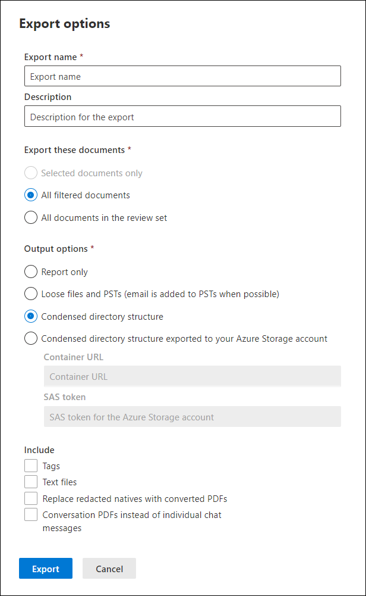

# 문서의 검토 집합에서 Advanced eDiscovery

내보내기에서는 사용자가 다운로드 패키지의 검토 집합에서 문서를 내보낼 때 다운로드 패키지에 포함된 콘텐츠를 사용자 지정할 수 Advanced eDiscovery.

검토 집합에서 문서를 내보내는 경우:

1. 다음 Microsoft 365 규정 준수 센터 사례를 Advanced eDiscovery 검토 집합 탭을 선택한  다음 내보낼 검토 집합을 선택합니다.

2. 검토 집합에서 작업 **내보내기 를**  >  **클릭합니다.**

   내보내기 도구에는 내보내기 구성 설정이 있는 플라이아웃 페이지가 표시됩니다. 일부 옵션은 기본적으로 선택되지만 변경할 수 있습니다. 구성할 수 있는 내보내기 옵션에 대한 설명은 다음 섹션을 참조하세요.

   

3. 내보내기 구성 후 **내보내기** 를 클릭하여 내보내기 프로세스를 시작 합니다. 출력 옵션 섹션에서 선택한  옵션에 따라 직접 다운로드 또는 조직의 Azure Storage 액세스할 수 있습니다.

> [!NOTE]
> 내보내기 작업은 사례의 수명 동안 유지됩니다. 그러나 내보내기 작업이 완료된 후 30일 이내에 내보내기 작업에서 콘텐츠를 다운로드해야 합니다.

## 내보내기 옵션

다음 옵션을 사용하여 내보내기 구성을 구성합니다. 일부 출력 옵션에 대해 일부 옵션이 허용되지는 않습니다. 특히 PST 형식으로 내보낼 때 텍스트 파일 및 편집된 PDF의 내보내기가 허용되지 않습니다.

- **내보내기 이름:** 내보내기 작업의 이름입니다. 이 이름은 다운로드할 ZIP 파일의 이름을 지정하는 데 사용됩니다.

- **설명:** 설명을 추가할 수 있는 자유 텍스트 필드입니다.

- **다음 문서 내보내기**

  - 선택한 문서만: 이 옵션은 현재 선택된 문서만 내보낼 수 있습니다. 이 옵션은 검토 집합에서 항목을 선택할 때만 사용할 수 있습니다.
  
  - 필터링된 모든 문서: 이 옵션은 활성 필터에서 문서를 내보낼 수 있습니다. 이 옵션은 필터가 검토 집합에 적용될 때만 사용할 수 있습니다.
  
  - 검토 집합의 모든 문서: 이 옵션은 검토 집합의 모든 문서를 내보낼 수 있습니다.

- **출력 옵션:** 내보낼 콘텐츠는 웹 브라우저를 통해 직접 다운로드할 수 있습니다. 또는 내보낼 콘텐츠가 Azure Storage 있습니다. 처음 두 옵션을 사용하면 직접 다운로드를 사용할 수 있습니다.
  
  - 보고서만: 요약 및 로드 파일만 만들어집니다.
  
  - 느슨한 파일 및 PSTS(가능한 경우 전자 메일이 PSTS에 추가됨): 파일은 기본 응용 프로그램에서 사용자가 볼 수 있는 원래 디렉터리 구조와 같은 형식으로 내보낼 수 있습니다.  자세한 내용은 느슨한 파일 및 [PST 내보내기](#loose-files-and-pst-export-structure) 구조 섹션을 참조하세요.
  
  - 압축된 디렉터리 구조: 파일을 내보내고 다운로드에 포함됩니다.
  
  - 조직 계정으로 내보낼 압축된 디렉터리 Azure Storage: 파일은 조직의 Azure Storage 계정으로 내보낼 수 있습니다. 이 옵션의 경우 파일을 내보낼 Azure Storage 컨테이너의 URL을 제공해야 합니다. 또한 사용자 계정의 SAS(공유 액세스 서명) 토큰을 Azure Storage 합니다. 자세한 내용은 검토 집합의 문서 내보내기 계정을 Azure Storage [참조하세요.](download-export-jobs.md)

- **포함**
  
  - 태그: 이 옵션을 선택하면 태그 지정 정보가 로드 파일에 포함됩니다.
  
  - 텍스트 파일: 이 옵션에는 내보내기에서 추출된 네이티브 파일의 텍스트 버전이 포함됩니다.
  
  - 편집된 네이티브를 변환된 PDF로 바꾸기: 검토 중에 편집된 PDF 파일이 생성되는 경우 이러한 파일을 내보낼 수 있습니다. 이 옵션을 선택하지 않은 경우, 편집된 기본 파일만 내보내거나 실제 변경이 포함된 PDF 파일을 내보내기 위해 이 옵션을 선택할 수 있습니다.

  - 개별 채팅 메시지 대신 대화 PDF: 이 확인란을 선택하여 PDF 파일로 채팅 대화를 내보낼 수 있습니다. 같은 대화의 모든 채팅 메시지는 동일한 PDF 파일로 내보낼 수 있습니다. 이 확인란을 선택하지 않은 채로 두면 채팅 대화의 각 고유 메시지가 독립 실행형 항목으로 내보내지 않습니다. 파일은 사서함에 저장한 형식과 같은 형식으로 내보낼 수 있습니다. 특정 대화의 경우 여러 .msg 파일을 받게 됩니다.

다음 섹션에서는 느슨한 파일 및 압축된 디렉터리 구조 옵션에 대한 폴더 구조에 대해 설명합니다. 내보낼은 압축되지 않은 콘텐츠의 최대 크기가 75GB인 ZIP 파일로 분할됩니다. 내보내기 크기가 75GB 미만이면 내보내기가 요약 파일과 단일 ZIP 파일로 구성됩니다. 압축되지 않은 데이터의 75GB보다 큰 내보내기에서는 여러 ZIP 파일이 만들어집니다. 다운로드한 후 ZIP 파일을 단일 위치로 압축을 풀어 전체 내보내기 파일을 다시 만드면 됩니다.

### 느슨한 파일 및 PST 내보내기 구조

이 내보내기 옵션을 선택하면 내보낼 콘텐츠가 다음 구조로 구성됩니다.

- Summary.csv: 검토 집합에서 내보낼 콘텐츠의 요약 포함

- 루트 폴더: 이름이 [Export Name] x of z.zip 이 폴더는 각 ZIP 파일 파티션에 대해 반복됩니다.
  
  - Export_load_file_x z.csv: 메타데이터 파일입니다.
  
  - 경고 및 오류 x z.csv: 이 파일에는 검토 집합에서 내보내려고 할 때 발생하는 오류에 대한 정보가 포함됩니다.
  
  - Exchange: 이 폴더에는 PST 파일에 Exchange 콘텐츠가 모두 들어 있습니다. 이 옵션에는 편집된 PDF 파일을 사용할 수 없습니다. 검토 집합에서 첨부 파일이 선택된 경우 상위 전자 메일은 첨부 파일이 첨부된 후 내보낼 수 있습니다.
  
  - SharePoint: 이 폴더에는 기본 SharePoint 형식의 모든 네이티브 콘텐츠가 들어 있습니다. 이 옵션에는 편집된 PDF 파일을 사용할 수 없습니다.

### 압축된 디렉터리 구조

- Summary.csv: 검토 집합에서 내보낼 콘텐츠의 요약 포함

- 루트 폴더: 이름이 [Export Name] x of z.zip 이 폴더는 각 ZIP 파일 파티션에 대해 반복됩니다.
  
  - Export_load_file_x z.csv: 메타데이터 파일과 ZIP 파일에 저장된 각 파일의 위치도 포함됩니다.
  
  - 경고 및 오류 x z.csv: 이 파일에는 검토 집합에서 내보내려고 할 때 발생하는 오류에 대한 정보가 포함됩니다.

  - NativeFiles: 이 폴더에는 내보낼 수 있는 모든 기본 파일이 포함되어 있습니다. 변환된 네이티브를 변환된 *PDF로* 바꾸기 옵션을 선택한 경우 네이티브 파일은 재조정된 PDF로 대체됩니다.
  
  - Error_files: 이 폴더에는 추출 또는 기타 처리 오류가 있는 파일이 들어 있습니다. 파일은 ExtractionError 또는 ProcessingError와 같은 별도의 폴더에 배치됩니다. 이러한 파일은 로드 파일에 나열됩니다.

  - Extracted_text_files: 이 폴더에는 처리 시 생성된 추출된 텍스트 파일이 모두 포함되어 있습니다.

### 사용자 계정으로 내보낼 압축된 디렉터리 Azure Storage

이 옵션은 *압축된* 디렉터리 구조와 동일한 일반 구조를 사용 하지만 콘텐츠는 압축되지 않습니다. 데이터는 사용자 계정으로 Azure Storage 저장됩니다. 이 옵션은 일반적으로 타사 eDiscovery 공급자를 사용할 때 사용됩니다. 이 옵션을 사용하는 방법에 대한 자세한 내용은 검토 집합에서 문서 내보내기 계정을 Azure Storage [참조하세요.](download-export-jobs.md)
